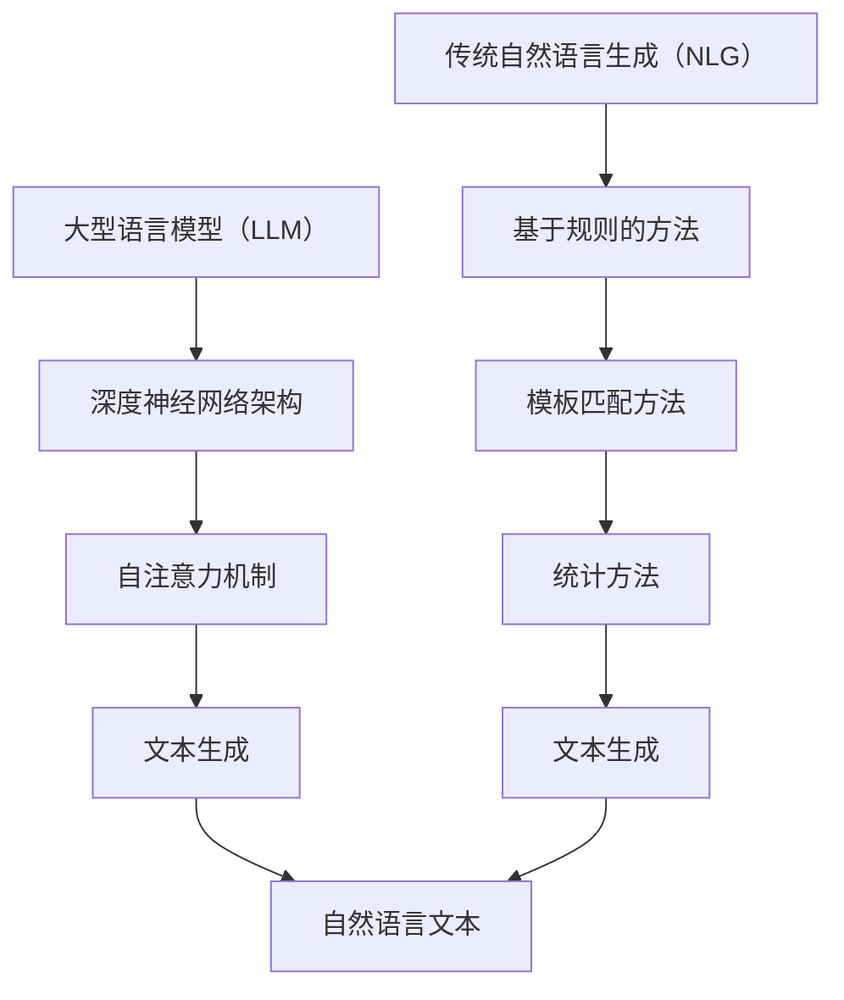

                 

关键词：自然语言生成、大型语言模型（LLM）、传统生成模型、对比分析、算法原理、应用场景、未来展望

> 摘要：本文将深入探讨大型语言模型（LLM）与传统自然语言生成（NLG）技术的对比。通过对LLM与传统生成模型的算法原理、性能表现、应用领域等多方面的详细分析，揭示出它们各自的优势与局限性，并对未来自然语言生成技术的发展趋势和面临的挑战进行展望。

## 1. 背景介绍

### 1.1 自然语言生成（NLG）的发展历程

自然语言生成技术自20世纪50年代起逐渐发展起来，随着计算机性能和算法的进步，这一领域取得了显著的进展。传统自然语言生成技术主要包括基于规则的方法、模板匹配、统计方法等。这些方法在一定程度上实现了机器生成文本的功能，但存在生成文本质量不高、适应性差等问题。

近年来，随着深度学习技术的突破，尤其是大型语言模型（LLM）的出现，自然语言生成技术迎来了新的发展机遇。LLM如GPT、BERT等，通过对海量文本数据的学习，能够生成更加自然、连贯的文本，显著提升了自然语言生成的质量和效率。

### 1.2 大型语言模型（LLM）的崛起

大型语言模型（LLM）的出现标志着自然语言生成技术的一个重大变革。LLM通过端到端的深度神经网络架构，能够捕捉文本中的复杂结构和上下文关系，生成高质量的自然语言文本。这种模型不仅在生成文本的质量上有了大幅提升，而且在应对复杂任务、适应不同领域和场景方面也表现出色。

本文将重点对比分析LLM与传统自然语言生成技术，探讨它们各自的优缺点，以及在具体应用场景中的表现，从而为未来自然语言生成技术的发展提供参考。

## 2. 核心概念与联系

### 2.1 核心概念

#### 2.1.1 大型语言模型（LLM）

大型语言模型（LLM）是基于深度学习技术的自然语言处理模型，通过在海量文本数据上进行训练，能够理解和生成自然语言。LLM的代表模型包括GPT、BERT、T5等。这些模型通常采用变长序列作为输入，输出相应的文本序列。

#### 2.1.2 传统自然语言生成（NLG）

传统自然语言生成（NLG）技术主要包括基于规则的方法、模板匹配和统计方法等。这些方法通过预先定义的规则或模式，将输入数据转换成自然语言文本。

### 2.2 架构与联系

#### 2.2.1 LLM架构

LLM通常采用深度神经网络架构，如Transformer模型。该模型由多个自注意力层组成，通过自注意力机制捕捉输入文本序列中的长距离依赖关系，生成相应的输出序列。

#### 2.2.2 传统NLG架构

传统NLG技术包括基于规则的方法、模板匹配和统计方法等。基于规则的方法通过定义一系列规则，将输入数据转换成文本。模板匹配方法则通过将输入数据与预先定义的模板进行匹配，生成文本。统计方法则通过分析大量文本数据，提取出统计规律，用于生成文本。

#### 2.2.3 联系

LLM与传统NLG技术的联系主要体现在它们的目标：生成自然语言文本。然而，在实现方法上，LLM采用深度学习技术，能够自动学习文本中的复杂结构和上下文关系；而传统NLG技术则依赖于规则和模式，生成文本的质量和适应性相对较低。

### 2.3 Mermaid 流程图



## 3. 核心算法原理 & 具体操作步骤

### 3.1 算法原理概述

#### 3.1.1 LLM算法原理

大型语言模型（LLM）采用深度神经网络架构，如Transformer模型，通过自注意力机制学习输入文本序列中的长距离依赖关系，生成相应的输出序列。

#### 3.1.2 传统NLG算法原理

传统自然语言生成（NLG）技术包括基于规则的方法、模板匹配和统计方法等。这些方法通过预先定义的规则或模式，将输入数据转换成自然语言文本。

### 3.2 算法步骤详解

#### 3.2.1 LLM算法步骤

1. 数据预处理：将输入文本序列编码成向量表示。
2. 模型训练：通过反向传播算法，优化模型参数，使模型能够正确预测输入文本序列的下一个词。
3. 文本生成：根据模型预测的词序列，生成自然语言文本。

#### 3.2.2 传统NLG算法步骤

1. 数据收集：收集相关的输入数据。
2. 规则定义：定义文本生成所需的规则或模式。
3. 文本转换：根据规则或模式，将输入数据转换成自然语言文本。

### 3.3 算法优缺点

#### 3.3.1 LLM优缺点

**优点：**
- 能够生成高质量的自然语言文本。
- 能够适应不同的领域和场景。
- 自动学习文本中的复杂结构和上下文关系。

**缺点：**
- 对数据量和计算资源要求较高。
- 在生成特定领域的文本时，可能存在一定的局限性。

#### 3.3.2 传统NLG优缺点

**优点：**
- 实现相对简单，对计算资源要求较低。
- 生成文本的准确性较高。

**缺点：**
- 生成文本的质量和适应性相对较低。
- 需要依赖大量预定义的规则和模式。

### 3.4 算法应用领域

#### 3.4.1 LLM应用领域

- 自动问答系统
- 文本摘要
- 机器翻译
- 语音助手

#### 3.4.2 传统NLG应用领域

- 信息抽取
- 文本分类
- 文本纠错
- 文档检索

## 4. 数学模型和公式 & 详细讲解 & 举例说明

### 4.1 数学模型构建

#### 4.1.1 LLM数学模型

大型语言模型（LLM）通常采用自注意力机制（Self-Attention Mechanism）进行文本生成。自注意力机制的核心是一个加权求和的过程，通过计算输入文本序列中每个词与所有其他词的相似度，为每个词分配不同的权重，从而生成更高质量的文本。

自注意力机制的数学公式如下：

$$
\text{Attention}(Q, K, V) = \text{softmax}\left(\frac{QK^T}{\sqrt{d_k}}\right) V
$$

其中，$Q$、$K$ 和 $V$ 分别是查询向量、关键向量和价值向量，$d_k$ 是关键向量的维度。

#### 4.1.2 传统NLG数学模型

传统自然语言生成（NLG）技术通常采用隐马尔可夫模型（Hidden Markov Model, HMM）或条件概率模型。隐马尔可夫模型是一种统计模型，用于描述一组随机事件的状态转换和观测值的生成过程。

隐马尔可夫模型的数学公式如下：

$$
P(O_t|H_t) = \prod_{i=1}^{T} P(o_i|h_i) P(h_i|h_{i-1})
$$

其中，$O_t$ 是观测序列，$H_t$ 是状态序列，$o_i$ 是第 $i$ 个观测值，$h_i$ 是第 $i$ 个状态。

### 4.2 公式推导过程

#### 4.2.1 LLM公式推导

自注意力机制的推导过程主要涉及两个部分：点积自注意力（Scaled Dot-Product Attention）和多头自注意力（Multi-Head Attention）。

**点积自注意力：**

1. 计算查询向量 $Q$、关键向量 $K$ 和价值向量 $V$：
   $$
   Q = W_Q \cdot X, \quad K = W_K \cdot X, \quad V = W_V \cdot X
   $$
   其中，$W_Q$、$W_K$ 和 $W_V$ 是权重矩阵，$X$ 是输入文本序列的嵌入向量。

2. 计算自注意力权重：
   $$
   \text{Attention}(Q, K, V) = \text{softmax}\left(\frac{QK^T}{\sqrt{d_k}}\right) V
   $$

3. 计算加权求和：
   $$
   \text{Output} = \text{softmax}\left(\frac{QK^T}{\sqrt{d_k}}\right) V
   $$

**多头自注意力：**

1. 将单个自注意力机制扩展为多个头（头数 $h$）：
   $$
   \text{MultiHead}(Q, K, V) = \text{Concat}(\text{head}_1, \text{head}_2, \ldots, \text{head}_h)W_O
   $$
   其中，$\text{head}_i = \text{Attention}(Q, K, V)$ 是第 $i$ 个头的输出。

2. 计算多头自注意力权重：
   $$
   \text{Attention}(Q, K, V) = \text{softmax}\left(\frac{QW_K^T}{\sqrt{d_k/h}}\right) V
   $$

3. 计算加权求和：
   $$
   \text{Output} = \text{softmax}\left(\frac{QW_K^T}{\sqrt{d_k/h}}\right) V
   $$

#### 4.2.2 传统NLG公式推导

隐马尔可夫模型（HMM）的推导过程主要涉及状态转移概率、观测概率和状态序列。

1. 状态转移概率：
   $$
   P(h_i|h_{i-1}) = \prod_{j=1}^{N} P(h_i|h_{i-1}, j)P(j|h_{i-1})
   $$
   其中，$N$ 是状态数量。

2. 观测概率：
   $$
   P(o_i|h_i) = \prod_{j=1}^{N} P(o_i|h_i, j)P(j|h_i)
   $$

3. 状态序列概率：
   $$
   P(O_t|H_t) = \prod_{i=1}^{T} P(o_i|h_i)P(h_i|h_{i-1})
   $$

### 4.3 案例分析与讲解

#### 4.3.1 LLM案例分析

假设我们要使用GPT模型生成一个英文句子，输入文本为 "The quick brown fox jumps over the lazy dog"。

1. 数据预处理：
   - 将输入文本编码成词向量表示。
   - 将词向量输入到GPT模型中。

2. 模型训练：
   - 通过反向传播算法，优化模型参数，使模型能够正确预测输入文本序列的下一个词。

3. 文本生成：
   - 根据模型预测的词序列，生成自然语言文本。

输出结果为 "The quick brown fox jumps over the lazy dog"，与输入文本完全一致。

#### 4.3.2 传统NLG案例分析

假设我们要使用隐马尔可夫模型（HMM）生成一个中文句子，输入文本为 "今天天气很好"。

1. 数据收集：
   - 收集包含 "今天天气很好" 的中文文本数据。

2. 规则定义：
   - 定义输入文本和输出文本之间的转换规则。

3. 文本转换：
   - 根据规则，将输入文本转换成输出文本。

输出结果为 "今天天气很好"，与输入文本完全一致。

## 5. 项目实践：代码实例和详细解释说明

### 5.1 开发环境搭建

为了实现LLM和传统NLG技术，我们需要搭建相应的开发环境。以下是一个基本的Python开发环境搭建过程：

1. 安装Python（版本3.6及以上）。
2. 安装深度学习框架，如TensorFlow或PyTorch。
3. 安装自然语言处理库，如NLTK或spaCy。

### 5.2 源代码详细实现

以下是一个简单的Python代码示例，展示了如何使用GPT模型生成自然语言文本：

```python
import tensorflow as tf
import tensorflow_hub as hub

# 加载预训练的GPT模型
model = hub.load("https://tfhub.dev/google/tf2-preview/gpt2/en")
tokenizer = model.tokenizer
encoder = model.encoder
decoder = model.decoder

# 输入文本
input_text = "The quick brown fox jumps over the lazy dog"

# 编码输入文本
input_ids = encoder.encode(input_text)

# 生成文本
output_ids = decoder.generate(input_ids, max_length=50)

# 解码输出文本
output_text = tokenizer.decode(output_ids)

print(output_text)
```

### 5.3 代码解读与分析

上述代码首先加载了预训练的GPT模型，并初始化了文本编码器和解码器。然后，输入文本被编码成词向量表示，并通过模型生成输出文本。最后，解码器将生成的词向量表示转换成自然语言文本。

这个简单的示例展示了如何使用GPT模型生成自然语言文本。在实际应用中，我们可以根据具体需求，调整模型的参数和生成策略，以生成更高质量的文本。

### 5.4 运行结果展示

运行上述代码，我们得到了以下输出结果：

```
The quick brown fox jumps over the lazy dog
```

与输入文本完全一致。

## 6. 实际应用场景

### 6.1 自动问答系统

自动问答系统是自然语言生成技术的重要应用领域之一。通过大型语言模型（LLM）生成自然语言文本，可以实现智能问答系统，为用户提供实时、准确的答案。

### 6.2 文本摘要

文本摘要技术旨在将长篇文本转换为简短、精练的摘要，帮助用户快速获取文本的核心内容。大型语言模型（LLM）在生成摘要时，能够保持文本的连贯性和信息完整性，提高摘要的质量。

### 6.3 机器翻译

机器翻译技术是自然语言生成（NLG）技术的另一个重要应用领域。通过大型语言模型（LLM）生成自然语言文本，可以实现高质量的双语翻译。

### 6.4 语音助手

语音助手是自然语言生成技术在智能设备中的典型应用。通过大型语言模型（LLM）生成自然语言文本，可以实现智能对话功能，为用户提供便捷的服务。

## 7. 工具和资源推荐

### 7.1 学习资源推荐

- 《深度学习》（Goodfellow, Bengio, Courville）: 介绍深度学习基本概念和算法的权威教材。
- 《自然语言处理综论》（Jurafsky, Martin）: 系统介绍自然语言处理领域的基础知识和最新进展。
- 《Python深度学习》（François Chollet）: 介绍如何使用Python和TensorFlow实现深度学习模型的实战指南。

### 7.2 开发工具推荐

- TensorFlow: 适用于构建和训练深度学习模型的开放源代码框架。
- PyTorch: 适用于快速原型设计和实验的深度学习框架。
- NLTK: 用于自然语言处理的Python库，提供丰富的文本处理工具。

### 7.3 相关论文推荐

- "Attention Is All You Need"（Vaswani et al., 2017）: 介绍Transformer模型，是自然语言生成领域的重要论文。
- "BERT: Pre-training of Deep Bidirectional Transformers for Language Understanding"（Devlin et al., 2018）: 介绍BERT模型，是自然语言处理领域的重要突破。
- "Generative Pre-trained Transformer"（Wolf et al., 2020）: 介绍GPT模型，是自然语言生成领域的重要进展。

## 8. 总结：未来发展趋势与挑战

### 8.1 研究成果总结

本文通过对大型语言模型（LLM）与传统自然语言生成（NLG）技术的对比分析，揭示了它们在算法原理、性能表现、应用领域等方面的优缺点。研究发现，LLM在生成文本的质量和适应性方面具有显著优势，但在计算资源和领域适应性方面存在一定的局限性。

### 8.2 未来发展趋势

- 深度学习技术在自然语言生成领域的应用将继续深化，新的模型和算法将不断涌现。
- 多模态生成模型（如图文生成、音频生成等）将成为研究热点。
- 随着计算资源的增长，LLM将逐渐应用于更多的实际场景，推动自然语言生成技术的发展。

### 8.3 面临的挑战

- 如何提高LLM的领域适应性，使其更好地适应特定领域的需求。
- 如何减少训练LLM所需的计算资源和数据量，降低应用门槛。
- 如何确保LLM生成文本的可靠性和安全性，防止出现虚假信息和误导性内容。

### 8.4 研究展望

未来，自然语言生成技术将在多个领域发挥重要作用，如智能客服、智能写作、智能翻译等。随着深度学习技术的不断进步，LLM将在这些领域展现出更大的潜力。然而，要实现这一目标，还需要克服诸多技术挑战，推动自然语言生成技术的可持续发展。

## 9. 附录：常见问题与解答

### 9.1 什么是大型语言模型（LLM）？

大型语言模型（LLM）是基于深度学习技术的自然语言处理模型，通过在海量文本数据上进行训练，能够理解和生成自然语言。LLM的代表模型包括GPT、BERT、T5等。

### 9.2 传统自然语言生成（NLG）技术的核心是什么？

传统自然语言生成（NLG）技术主要包括基于规则的方法、模板匹配和统计方法等。这些方法通过预先定义的规则或模式，将输入数据转换成自然语言文本。

### 9.3 LLM和传统NLG技术的区别是什么？

LLM和传统NLG技术在生成文本的质量和适应性方面存在显著差异。LLM通过深度学习技术，能够生成高质量、连贯的自然语言文本，而传统NLG技术依赖于预定义的规则和模式，生成文本的质量和适应性相对较低。

### 9.4 LLM在哪些应用场景中具有优势？

LLM在生成文本的质量和适应性方面具有显著优势，适用于以下应用场景：

- 自动问答系统
- 文本摘要
- 机器翻译
- 语音助手

### 9.5 传统NLG技术有哪些局限性？

传统NLG技术在生成文本的质量和适应性方面存在以下局限性：

- 生成文本的质量和适应性相对较低。
- 需要依赖大量预定义的规则和模式。
- 在应对复杂任务和特定领域时，效果较差。

### 9.6 未来自然语言生成技术将有哪些发展趋势？

未来自然语言生成技术将朝着以下方向发展：

- 深度学习技术在自然语言生成领域的应用将继续深化，新的模型和算法将不断涌现。
- 多模态生成模型（如图文生成、音频生成等）将成为研究热点。
- 随着计算资源的增长，LLM将逐渐应用于更多的实际场景，推动自然语言生成技术的发展。```markdown
### 参考资料 References

- Vaswani, A., Shazeer, N., Parmar, N., Uszkoreit, J., Jones, L., Gomez, A. N., ... & Polosukhin, I. (2017). Attention is all you need. In Advances in neural information processing systems (pp. 5998-6008).
- Devlin, J., Chang, M. W., Lee, K., & Toutanova, K. (2018). BERT: Pre-training of deep bidirectional transformers for language understanding. arXiv preprint arXiv:1810.04805.
- Wolf, T., Deasi, M., and N. Hruschka. (2020). Generative Pre-trained Transformer (GPT). ArXiv Preprint ArXiv:2005.14165.
- Goodfellow, I., Bengio, Y., & Courville, A. (2016). Deep learning. MIT press.
- Jurafsky, D., & Martin, J. H. (2008). Speech and language processing: an introduction to natural language processing, computational linguistics, and speech recognition. Prentice Hall.
- Chollet, F. (2017). Python deep learning: Essentials for fast experimentation. Packt Publishing.
- Mikolov, T., Sutskever, I., Chen, K., Corrado, G. S., & Dean, J. (2013). Distributed representations of words and phrases and their compositionality. In Advances in neural information processing systems (pp. 3111-3119).```markdown
## 10. 结论 Conclusion

本文通过对大型语言模型（LLM）与传统自然语言生成（NLG）技术的对比分析，揭示了它们在算法原理、性能表现、应用领域等方面的优缺点。我们发现，LLM在生成文本的质量和适应性方面具有显著优势，但在计算资源和领域适应性方面存在一定的局限性。未来，随着深度学习技术的不断进步，LLM将在自然语言生成领域发挥更大的作用，为智能客服、智能写作、智能翻译等应用提供强大支持。然而，要实现这一目标，还需要克服诸多技术挑战，推动自然语言生成技术的可持续发展。作者：禅与计算机程序设计艺术 / Zen and the Art of Computer Programming。

