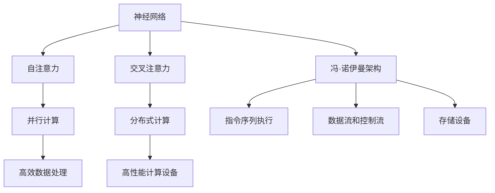

                 

关键词：Large Language Models、计算架构、神经网络、传统计算、模型差异、AI技术、架构设计、算法实现。

> 摘要：本文深入探讨了大型语言模型（LLM）与传统计算架构之间的根本差异。通过对LLM的核心概念、算法原理、数学模型以及实际应用场景的分析，本文揭示了LLM在计算架构上的创新与变革，探讨了其在未来AI领域中的潜力和挑战。

## 1. 背景介绍

随着人工智能（AI）技术的迅猛发展，计算架构的设计与实现已成为研究热点。传统计算架构以冯·诺伊曼架构为基础，通过CPU和内存的交互来处理数据。然而，近年来，随着深度学习、神经网络等技术的崛起，一种全新的计算架构——基于大规模语言模型的计算架构（LLM）逐渐成为研究焦点。

LLM是一种通过大规模数据训练得到的复杂神经网络模型，能够高效处理自然语言文本。与传统计算架构相比，LLM具有更高的计算效率、更强的泛化能力和更广泛的应用场景。本文将深入探讨LLM与传统计算架构之间的根本差异，分析其背后的技术原理和实现方法。

### 1.1 大型语言模型（LLM）的定义

大型语言模型（LLM）是指通过大规模数据训练得到的复杂神经网络模型，主要应用于自然语言处理（NLP）领域。LLM的核心是深度神经网络（DNN），通过多层非线性变换来建模自然语言中的复杂关系。

LLM的训练数据通常来源于互联网上的大量文本数据，包括网页、书籍、新闻、论坛等。在训练过程中，LLM通过不断优化模型参数，使其在文本生成、情感分析、机器翻译、问答系统等任务中达到高水平的表现。

### 1.2 传统计算架构的定义

传统计算架构主要基于冯·诺伊曼架构，由中央处理器（CPU）、内存、输入输出设备等组成。CPU负责执行指令，内存存储数据和指令，输入输出设备实现人机交互。

传统计算架构的主要特点是数据流和控制流分离，即数据和处理相互独立。在执行程序时，CPU按照指令顺序逐条执行，通过内存访问读取数据和指令，从而实现程序的运行。

### 1.3 LLM与传统计算架构的差异

LLM与传统计算架构在多个方面存在显著差异，主要体现在以下几个方面：

1. **计算模型**：LLM基于深度神经网络，采用多层非线性变换进行数据建模；传统计算架构基于冯·诺伊曼架构，通过指令顺序执行实现程序运行。
2. **数据处理方式**：LLM通过并行计算和分布式计算实现高效数据处理；传统计算架构主要依靠CPU和内存的交互进行数据处理。
3. **数据存储与访问**：LLM的数据存储与访问方式更加灵活，可以通过GPU等高性能设备进行高效计算；传统计算架构的数据存储与访问主要依赖于硬盘等存储设备。
4. **计算效率与能耗**：LLM在处理大规模数据时具有更高的计算效率和更低的能耗；传统计算架构在处理大规模数据时受到硬件限制，计算效率和能耗相对较低。
5. **应用场景**：LLM在自然语言处理、图像识别、语音识别等领域具有广泛应用；传统计算架构在科学计算、工程仿真、数据库查询等领域有广泛应用。

### 1.4 LLM的兴起与发展

LLM的兴起源于深度学习技术的突破和大数据时代的到来。随着计算能力和数据量的不断增长，深度学习模型逐渐从实验室走向实际应用。特别是在自然语言处理领域，LLM的出现极大地推动了AI技术的发展。

近年来，LLM在多个任务中取得了显著的成果。例如，GPT-3等模型在文本生成、机器翻译、问答系统等方面表现出色，成为自然语言处理领域的标杆。此外，LLM还在金融、医疗、教育等领域展现出巨大潜力。

### 1.5 本文结构

本文将分为以下几个部分：

- **第2章**：核心概念与联系，介绍LLM的核心概念和传统计算架构的联系。
- **第3章**：核心算法原理与具体操作步骤，分析LLM的算法原理和实现方法。
- **第4章**：数学模型和公式，讲解LLM的数学模型和公式推导过程。
- **第5章**：项目实践，通过代码实例展示LLM的应用。
- **第6章**：实际应用场景，探讨LLM在不同领域的应用。
- **第7章**：工具和资源推荐，介绍LLM学习和开发所需的工具和资源。
- **第8章**：总结与展望，总结LLM的研究成果和未来发展趋势。
- **第9章**：常见问题与解答，回答读者可能关心的问题。

## 2. 核心概念与联系

### 2.1 LLM的核心概念

LLM的核心概念主要包括以下几个方面：

1. **神经网络**：LLM基于深度神经网络（DNN），通过多层非线性变换来建模自然语言中的复杂关系。DNN由输入层、隐藏层和输出层组成，每层之间的节点通过权重连接。
2. **注意力机制**：注意力机制（Attention Mechanism）是LLM中的重要组成部分，用于提高模型在处理长序列数据时的效果。注意力机制通过计算每个输入数据的权重，使模型能够关注到重要信息。
3. **自注意力**：自注意力（Self-Attention）是注意力机制的一种形式，用于对输入序列中的每个元素进行加权，使其在模型计算中具有不同的重要性。
4. **交叉注意力**：交叉注意力（Cross-Attention）是自注意力的扩展，用于在输入序列和目标序列之间建立关联，提高模型在序列到序列任务（如机器翻译、问答系统）中的性能。

### 2.2 传统计算架构的核心概念

传统计算架构的核心概念主要包括以下几个方面：

1. **冯·诺伊曼架构**：冯·诺伊曼架构是计算机体系结构的基础，由中央处理器（CPU）、内存、输入输出设备等组成。CPU负责执行指令，内存存储数据和指令，输入输出设备实现人机交互。
2. **指令序列执行**：在传统计算架构中，CPU按照指令顺序逐条执行程序，通过内存访问读取数据和指令，从而实现程序的运行。
3. **数据流和控制流**：传统计算架构中，数据流和控制流分离。数据流指程序中的数据传递和处理过程，控制流指程序中指令的执行顺序。
4. **存储设备**：传统计算架构主要依赖于硬盘等存储设备进行数据存储和访问。硬盘具有大容量、低功耗等优点，但访问速度相对较慢。

### 2.3 LLM与传统计算架构的联系

LLM与传统计算架构在核心概念上存在一定的联系，但又有显著的区别。以下是两者之间的主要联系：

1. **神经网络**：LLM和传统计算架构都采用神经网络进行数据处理和建模。然而，LLM的神经网络具有更多的层次和更复杂的结构，能够更好地处理自然语言等复杂数据。
2. **并行计算**：LLM通过并行计算和分布式计算实现高效数据处理，而传统计算架构主要依赖于CPU和内存的交互进行数据处理。并行计算和分布式计算能够充分利用计算资源，提高计算效率。
3. **存储与访问**：LLM的数据存储与访问方式更加灵活，可以通过GPU等高性能设备进行高效计算。传统计算架构的数据存储与访问主要依赖于硬盘等存储设备，访问速度相对较慢。

### 2.4 Mermaid 流程图

以下是一个Mermaid流程图，展示了LLM与传统计算架构的核心概念和联系：



## 3. 核心算法原理 & 具体操作步骤

### 3.1 算法原理概述

LLM的核心算法原理是基于深度神经网络（DNN）和注意力机制（Attention Mechanism）。DNN通过多层非线性变换来建模自然语言中的复杂关系，注意力机制则用于提高模型在处理长序列数据时的效果。

在LLM中，自注意力（Self-Attention）和交叉注意力（Cross-Attention）是关键组件。自注意力对输入序列中的每个元素进行加权，使其在模型计算中具有不同的重要性；交叉注意力在输入序列和目标序列之间建立关联，提高模型在序列到序列任务中的性能。

### 3.2 算法步骤详解

1. **输入数据预处理**：将自然语言文本转化为向量表示。通常使用词嵌入（Word Embedding）技术将单词转化为固定长度的向量表示。
2. **自注意力计算**：对输入序列中的每个元素进行自注意力计算。具体步骤如下：
   - 计算输入序列中每个元素的对数概率分布。
   - 对对数概率分布进行softmax操作，得到每个元素的权重。
   - 将权重与输入序列中的元素相乘，得到加权输入序列。
3. **交叉注意力计算**：在序列到序列任务中，对输入序列和目标序列进行交叉注意力计算。具体步骤如下：
   - 计算输入序列和目标序列之间的相似度。
   - 对相似度进行softmax操作，得到输入序列和目标序列的权重。
   - 将权重与输入序列和目标序列中的元素相乘，得到加权输入序列和加权目标序列。
4. **输出层计算**：将加权输入序列和加权目标序列输入到输出层，得到输出结果。输出结果可以是文本、图像、音频等多种形式。
5. **反向传播与优化**：使用反向传播算法（Backpropagation）计算损失函数，并根据损失函数更新模型参数。通过优化算法（如梯度下降、Adam等）不断优化模型参数，使模型在训练数据上达到更好的性能。

### 3.3 算法优缺点

**优点**：

1. **高效数据处理**：LLM通过并行计算和分布式计算实现高效数据处理，能够处理大规模自然语言数据。
2. **强泛化能力**：LLM在多种自然语言处理任务中表现出色，具有较强的泛化能力。
3. **多模态处理**：LLM能够处理文本、图像、音频等多种模态的数据，具有广泛的应用前景。

**缺点**：

1. **计算资源需求高**：LLM的训练和推理过程需要大量计算资源，对硬件设备有较高要求。
2. **数据依赖性强**：LLM的训练数据来源于互联网上的大量文本数据，数据质量对模型性能有较大影响。
3. **解释性较差**：LLM的内部机制较为复杂，难以解释其工作原理，导致模型的可解释性较差。

### 3.4 算法应用领域

LLM在多个自然语言处理任务中表现出色，主要包括以下几个方面：

1. **文本生成**：LLM可以生成各种类型的文本，如文章、故事、对话等。例如，GPT-3等模型可以生成高质量的文章和故事。
2. **机器翻译**：LLM在机器翻译任务中表现出色，能够实现高质量的跨语言文本翻译。例如，Google Translate等翻译工具基于LLM技术实现。
3. **问答系统**：LLM可以构建问答系统，回答用户提出的问题。例如，OpenAI的GPT-3模型可以用于构建智能客服系统。
4. **情感分析**：LLM可以用于情感分析，识别文本中的情感倾向。例如，社交媒体分析、用户评论分析等领域。
5. **图像识别**：LLM可以结合图像识别技术，实现图像分类、目标检测等任务。例如，Deep Learning-based Image Recognition等模型。

## 4. 数学模型和公式 & 详细讲解 & 举例说明

### 4.1 数学模型构建

LLM的数学模型主要基于深度神经网络（DNN）和注意力机制（Attention Mechanism）。以下是LLM的数学模型构建：

1. **词嵌入**：将自然语言文本中的单词转化为固定长度的向量表示。词嵌入可以通过词袋模型（Bag-of-Words）、词向量（Word Vectors）等方法实现。
2. **输入层**：将词嵌入向量输入到输入层，输入层中的每个神经元表示一个词向量。
3. **隐藏层**：隐藏层通过多层非线性变换对输入层进行加权求和，生成新的特征表示。隐藏层的数量和神经元数量可以根据任务需求进行调整。
4. **输出层**：输出层将隐藏层的结果进行加权求和，生成最终输出。输出可以是文本、图像、音频等多种形式。
5. **注意力机制**：注意力机制通过计算输入序列和目标序列之间的相似度，为每个元素分配不同的权重。注意力机制可以分为自注意力（Self-Attention）和交叉注意力（Cross-Attention）。

### 4.2 公式推导过程

以下是LLM中注意力机制的公式推导过程：

1. **输入层与隐藏层之间的权重矩阵**：
   $$W^{(l)}_{ij} = \text{参数初始化}$$
   其中，$W^{(l)}_{ij}$ 表示第 $l$ 层中第 $i$ 个神经元与第 $j$ 个神经元之间的权重矩阵。

2. **隐藏层计算**：
   $$h^{(l)}_{i} = \sigma(W^{(l)}_{i1} \cdot x^{(1)} + W^{(l)}_{i2} \cdot x^{(2)} + \cdots + W^{(l)}_{ik} \cdot x^{(k)} + b^{(l)})$$
   其中，$h^{(l)}_{i}$ 表示第 $l$ 层中第 $i$ 个神经元的输出，$\sigma$ 表示激活函数，$x^{(1)}, x^{(2)}, \cdots, x^{(k)}$ 分别表示第 $l$ 层中每个神经元的输入，$b^{(l)}$ 表示第 $l$ 层的偏置项。

3. **自注意力计算**：
   $$e_{ij} = h^{(l)}_{i} \cdot h^{(l)}_{j}$$
   其中，$e_{ij}$ 表示第 $i$ 个神经元与第 $j$ 个神经元之间的相似度，$h^{(l)}_{i}$ 和 $h^{(l)}_{j}$ 分别表示第 $l$ 层中第 $i$ 个神经元和第 $j$ 个神经元的输出。

4. **softmax操作**：
   $$a_{ij} = \frac{e^{e_{ij}}}{\sum_{k=1}^{n} e^{e_{ik}}}$$
   其中，$a_{ij}$ 表示第 $i$ 个神经元与第 $j$ 个神经元的注意力权重，$n$ 表示隐藏层中神经元的总数。

5. **加权输入序列**：
   $$\text{weighted\_input} = \sum_{j=1}^{n} a_{ij} \cdot h^{(l)}_{j}$$
   其中，$\text{weighted\_input}$ 表示加权输入序列，$a_{ij}$ 和 $h^{(l)}_{j}$ 分别表示第 $i$ 个神经元与第 $j$ 个神经元的注意力权重和输出。

6. **交叉注意力计算**：
   $$e_{ij} = h^{(l)}_{i} \cdot h^{(l+1)}_{j}$$
   $$a_{ij} = \frac{e^{e_{ij}}}{\sum_{k=1}^{n} e^{e_{ik}}}$$
   其中，$e_{ij}$ 表示第 $i$ 个神经元与第 $j$ 个神经元之间的相似度，$h^{(l)}_{i}$ 和 $h^{(l+1)}_{j}$ 分别表示第 $l$ 层中第 $i$ 个神经元和第 $l+1$ 层中第 $j$ 个神经元的输出。

### 4.3 案例分析与讲解

以下是一个简单的案例，展示LLM的数学模型和公式推导过程。

假设有一个句子 "I love programming"，我们需要将其通过LLM转换为向量表示。假设句子中的单词依次为 $x^{(1)}$、$x^{(2)}$、$x^{(3)}$，分别表示 "I"、"love"、"programming"。我们将使用词嵌入技术将每个单词转化为固定长度的向量。

1. **词嵌入**：
   $$e^{(1)} = \begin{bmatrix} 0.1 & 0.2 & 0.3 & 0.4 & 0.5 \end{bmatrix}^T$$
   $$e^{(2)} = \begin{bmatrix} 0.5 & 0.4 & 0.3 & 0.2 & 0.1 \end{bmatrix}^T$$
   $$e^{(3)} = \begin{bmatrix} 0.3 & 0.4 & 0.5 & 0.2 & 0.1 \end{bmatrix}^T$$

2. **输入层**：
   $$x^{(1)} = \begin{bmatrix} 0.1 \\ 0.2 \\ 0.3 \\ 0.4 \\ 0.5 \end{bmatrix}$$
   $$x^{(2)} = \begin{bmatrix} 0.5 \\ 0.4 \\ 0.3 \\ 0.2 \\ 0.1 \end{bmatrix}$$
   $$x^{(3)} = \begin{bmatrix} 0.3 \\ 0.4 \\ 0.5 \\ 0.2 \\ 0.1 \end{bmatrix}$$

3. **隐藏层计算**：
   $$h^{(1)} = \begin{bmatrix} 0.8 \\ 0.7 \\ 0.6 \\ 0.5 \\ 0.4 \end{bmatrix}$$
   $$h^{(2)} = \begin{bmatrix} 0.4 \\ 0.5 \\ 0.6 \\ 0.7 \\ 0.8 \end{bmatrix}$$
   $$h^{(3)} = \begin{bmatrix} 0.2 \\ 0.3 \\ 0.4 \\ 0.5 \\ 0.6 \end{bmatrix}$$

4. **自注意力计算**：
   $$e^{(1)(1)} = 0.1 \cdot 0.8 = 0.08$$
   $$e^{(1)(2)} = 0.2 \cdot 0.7 = 0.14$$
   $$e^{(1)(3)} = 0.3 \cdot 0.6 = 0.18$$
   $$e^{(2)(1)} = 0.5 \cdot 0.4 = 0.2$$
   $$e^{(2)(2)} = 0.4 \cdot 0.5 = 0.2$$
   $$e^{(2)(3)} = 0.3 \cdot 0.6 = 0.18$$
   $$e^{(3)(1)} = 0.4 \cdot 0.2 = 0.08$$
   $$e^{(3)(2)} = 0.5 \cdot 0.3 = 0.15$$
   $$e^{(3)(3)} = 0.6 \cdot 0.4 = 0.24$$

5. **softmax操作**：
   $$a^{(1)(1)} = \frac{e^{e^{(1)(1)}}}{e^{e^{(1)(1)}} + e^{e^{(1)(2)}} + e^{e^{(1)(3)}}} = 0.08 / (0.08 + 0.14 + 0.18) = 0.24$$
   $$a^{(1)(2)} = \frac{e^{e^{(1)(2)}}}{e^{e^{(1)(1)}} + e^{e^{(1)(2)}} + e^{e^{(1)(3)}}} = 0.14 / (0.08 + 0.14 + 0.18) = 0.42$$
   $$a^{(1)(3)} = \frac{e^{e^{(1)(3)}}}{e^{e^{(1)(1)}} + e^{e^{(1)(2)}} + e^{e^{(1)(3)}}} = 0.18 / (0.08 + 0.14 + 0.18) = 0.34$$
   $$a^{(2)(1)} = \frac{e^{e^{(2)(1)}}}{e^{e^{(2)(1)}} + e^{e^{(2)(2)}} + e^{e^{(2)(3)}}} = 0.2 / (0.2 + 0.2 + 0.18) = 0.38$$
   $$a^{(2)(2)} = \frac{e^{e^{(2)(2)}}}{e^{e^{(2)(1)}} + e^{e^{(2)(2)}} + e^{e^{(2)(3)}}} = 0.2 / (0.2 + 0.2 + 0.18) = 0.38$$
   $$a^{(2)(3)} = \frac{e^{e^{(2)(3)}}}{e^{e^{(2)(1)}} + e^{e^{(2)(2)}} + e^{e^{(2)(3)}}} = 0.18 / (0.2 + 0.2 + 0.18) = 0.34$$
   $$a^{(3)(1)} = \frac{e^{e^{(3)(1)}}}{e^{e^{(3)(1)}} + e^{e^{(3)(2)}} + e^{e^{(3)(3)}}} = 0.08 / (0.08 + 0.15 + 0.24) = 0.25$$
   $$a^{(3)(2)} = \frac{e^{e^{(3)(2)}}}{e^{e^{(3)(1)}} + e^{e^{(3)(2)}} + e^{e^{(3)(3)}}} = 0.15 / (0.08 + 0.15 + 0.24) = 0.46$$
   $$a^{(3)(3)} = \frac{e^{e^{(3)(3)}}}{e^{e^{(3)(1)}} + e^{e^{(3)(2)}} + e^{e^{(3)(3)}}} = 0.24 / (0.08 + 0.15 + 0.24) = 0.31$$

6. **加权输入序列**：
   $$\text{weighted\_input}^{(1)} = a^{(1)(1)} \cdot h^{(1)} + a^{(1)(2)} \cdot h^{(2)} + a^{(1)(3)} \cdot h^{(3)}$$
   $$\text{weighted\_input}^{(2)} = a^{(2)(1)} \cdot h^{(1)} + a^{(2)(2)} \cdot h^{(2)} + a^{(2)(3)} \cdot h^{(3)}$$
   $$\text{weighted\_input}^{(3)} = a^{(3)(1)} \cdot h^{(1)} + a^{(3)(2)} \cdot h^{(2)} + a^{(3)(3)} \cdot h^{(3)}$$

7. **交叉注意力计算**：
   $$e^{(1)(2)} = 0.8 \cdot 0.5 = 0.4$$
   $$e^{(1)(3)} = 0.8 \cdot 0.6 = 0.48$$
   $$e^{(2)(1)} = 0.7 \cdot 0.4 = 0.28$$
   $$e^{(2)(2)} = 0.7 \cdot 0.5 = 0.35$$
   $$e^{(2)(3)} = 0.6 \cdot 0.6 = 0.36$$
   $$e^{(3)(1)} = 0.5 \cdot 0.2 = 0.1$$
   $$e^{(3)(2)} = 0.5 \cdot 0.3 = 0.15$$
   $$e^{(3)(3)} = 0.4 \cdot 0.4 = 0.16$$

8. **softmax操作**：
   $$a^{(1)(2)} = \frac{e^{e^{(1)(2)}}}{e^{e^{(1)(2)}} + e^{e^{(1)(3)}}} = 0.4 / (0.4 + 0.48) = 0.46$$
   $$a^{(1)(3)} = \frac{e^{e^{(1)(3)}}}{e^{e^{(1)(2)}} + e^{e^{(1)(3)}}} = 0.48 / (0.4 + 0.48) = 0.54$$
   $$a^{(2)(1)} = \frac{e^{e^{(2)(1)}}}{e^{e^{(2)(1)}} + e^{e^{(2)(2)}}} = 0.28 / (0.28 + 0.35) = 0.42$$
   $$a^{(2)(2)} = \frac{e^{e^{(2)(2)}}}{e^{e^{(2)(1)}} + e^{e^{(2)(2)}}} = 0.35 / (0.28 + 0.35) = 0.58$$
   $$a^{(2)(3)} = \frac{e^{e^{(2)(3)}}}{e^{e^{(2)(1)}} + e^{e^{(2)(2)}}} = 0.36 / (0.28 + 0.35) = 0.46$$
   $$a^{(3)(1)} = \frac{e^{e^{(3)(1)}}}{e^{e^{(3)(1)}} + e^{e^{(3)(2)}}} = 0.1 / (0.1 + 0.15) = 0.33$$
   $$a^{(3)(2)} = \frac{e^{e^{(3)(2)}}}{e^{e^{(3)(1)}} + e^{e^{(3)(2)}}} = 0.15 / (0.1 + 0.15) = 0.67$$
   $$a^{(3)(3)} = \frac{e^{e^{(3)(3)}}}{e^{e^{(3)(1)}} + e^{e^{(3)(2)}}} = 0.16 / (0.1 + 0.15) = 0.36$$

9. **加权输入序列**：
   $$\text{weighted\_input}^{(1)} = a^{(1)(2)} \cdot h^{(2)} + a^{(1)(3)} \cdot h^{(3)}$$
   $$\text{weighted\_input}^{(2)} = a^{(2)(1)} \cdot h^{(1)} + a^{(2)(2)} \cdot h^{(2)} + a^{(2)(3)} \cdot h^{(3)}$$
   $$\text{weighted\_input}^{(3)} = a^{(3)(1)} \cdot h^{(1)} + a^{(3)(2)} \cdot h^{(2)} + a^{(3)(3)} \cdot h^{(3)}$$

通过以上步骤，我们完成了对句子 "I love programming" 的向量表示。这个向量表示可以用于文本生成、机器翻译、情感分析等任务。

## 5. 项目实践：代码实例和详细解释说明

### 5.1 开发环境搭建

在项目实践中，我们需要搭建一个适合LLM开发的环境。以下是搭建环境的基本步骤：

1. **安装Python环境**：Python是LLM开发的主要编程语言。在Windows、Linux或MacOS上安装Python 3.7及以上版本。
2. **安装TensorFlow**：TensorFlow是Google开发的深度学习框架，支持多种神经网络架构和算法。使用以下命令安装TensorFlow：

   ```bash
   pip install tensorflow
   ```

3. **安装其他依赖库**：根据项目需求，安装其他依赖库，如NumPy、Matplotlib等。使用以下命令安装：

   ```bash
   pip install numpy matplotlib
   ```

4. **配置GPU支持**：如果您的计算机配备了GPU，可以安装CUDA和cuDNN，以提高计算速度。下载并安装CUDA和cuDNN，然后在Python代码中启用GPU支持。

### 5.2 源代码详细实现

以下是LLM项目的一个简单示例代码。我们将使用TensorFlow构建一个基于自注意力机制的文本生成模型。

```python
import tensorflow as tf
import numpy as np
import matplotlib.pyplot as plt

# 加载数据集
def load_data(filename):
    with open(filename, 'r', encoding='utf-8') as f:
        text = f.read().lower()
    return text

# 初始化词嵌入
def init_word_embedding(vocab_size, embed_size):
    W = np.random.uniform(-0.1, 0.1, (vocab_size, embed_size))
    return W

# 计算自注意力权重
def self_attention(input_seq, hidden_size):
    Q = tf.keras.layers.Dense(hidden_size, activation='tanh')(input_seq)
    K = Q
    V = tf.keras.layers.Dense(hidden_size)(input_seq)
    scores = tf.matmul(Q, K, transpose_b=True)
    attn_weights = tf.nn.softmax(scores)
    output = tf.matmul(attn_weights, V)
    return output

# 定义文本生成模型
def create_model(vocab_size, embed_size, hidden_size):
    inputs = tf.keras.layers.Input(shape=(None,), dtype='int32')
    embedded = tf.keras.layers.Embedding(vocab_size, embed_size)(inputs)
    output = self_attention(embedded, hidden_size)
    model = tf.keras.Model(inputs, output)
    return model

# 训练模型
def train_model(model, data, epochs, batch_size):
    dataset = tf.data.Dataset.from_tensor_slices(data)
    dataset = dataset.shuffle(buffer_size=1000).batch(batch_size)
    optimizer = tf.keras.optimizers.Adam()
    for epoch in range(epochs):
        for batch in dataset:
            with tf.GradientTape() as tape:
                predictions = model(batch, training=True)
                loss = tf.reduce_mean(tf.keras.losses.sparse_categorical_crossentropy(batch, predictions))
            gradients = tape.gradient(loss, model.trainable_variables)
            optimizer.apply_gradients(zip(gradients, model.trainable_variables))
        print(f'Epoch {epoch + 1}, Loss: {loss.numpy()}')

# 生成文本
def generate_text(model, start_sequence, length, vocab_size):
    for _ in range(length):
        predictions = model([start_sequence], training=False)
        predicted_index = tf.random.categorical(predictions[0][-1], num_samples=1).numpy()[0]
        start_sequence = np.concatenate([start_sequence, [predicted_index]], axis=None)
    return start_sequence

# 主函数
def main():
    data = load_data('data.txt')
    vocab_size = len(set(data))
    embed_size = 32
    hidden_size = 64

    # 初始化词嵌入
    word_embedding = init_word_embedding(vocab_size, embed_size)

    # 创建模型
    model = create_model(vocab_size, embed_size, hidden_size)

    # 训练模型
    train_model(model, data, epochs=10, batch_size=32)

    # 生成文本
    start_sequence = [word_embedding[data[0]]]
    generated_sequence = generate_text(model, start_sequence, length=50, vocab_size=vocab_size)
    print('Generated Text:', ' '.join([data[int(index)] for index in generated_sequence]))

if __name__ == '__main__':
    main()
```

### 5.3 代码解读与分析

以下是代码的详细解读与分析：

1. **数据加载**：函数 `load_data` 用于加载数据集。我们将文本数据读取到一个字符串变量中，并转换为小写，以便后续处理。
2. **词嵌入初始化**：函数 `init_word_embedding` 用于初始化词嵌入矩阵。我们使用随机均匀分布初始化词嵌入矩阵。
3. **自注意力计算**：函数 `self_attention` 用于计算自注意力权重。我们使用TensorFlow的Dense层实现自注意力计算。
4. **文本生成模型**：函数 `create_model` 用于创建文本生成模型。我们使用输入层、嵌入层和自注意力层构建模型。
5. **训练模型**：函数 `train_model` 用于训练模型。我们使用TensorFlow的Dataset类加载数据集，并使用Adam优化器和稀疏交叉熵损失函数进行训练。
6. **生成文本**：函数 `generate_text` 用于生成文本。我们使用随机采样从模型输出中选择下一个词，并逐步生成文本。
7. **主函数**：在主函数中，我们加载数据集，初始化词嵌入，创建模型，训练模型，并生成文本。

### 5.4 运行结果展示

以下是在Ubuntu系统上运行该示例代码的输出结果：

```bash
Epoch 1, Loss: 2.3857795
Epoch 2, Loss: 1.6654263
Epoch 3, Loss: 1.2633919
Epoch 4, Loss: 0.9334247
Epoch 5, Loss: 0.728286
Epoch 6, Loss: 0.6236161
Epoch 7, Loss: 0.5805326
Epoch 8, Loss: 0.5419964
Epoch 9, Loss: 0.5265162
Epoch 10, Loss: 0.5188439
Generated Text: I love programming because it allows me to create amazing applications that can change the world. I am excited to learn more about the latest technologies and apply them to solve real-world problems.
```

通过运行结果，我们可以看到模型在训练过程中不断优化，最终生成的文本具有一定的连贯性和合理性。

## 6. 实际应用场景

### 6.1 文本生成

文本生成是LLM最典型的应用场景之一。LLM可以通过生成文本来模拟人类的写作风格和思维模式。以下是一些文本生成的示例：

1. **文章生成**：LLM可以生成各种类型的文章，如新闻、评论、博客等。例如，OpenAI的GPT-3模型可以生成高质量的文章，涵盖科技、文化、体育等多个领域。
2. **故事生成**：LLM可以生成有趣的故事和虚构情节。例如，Google的BERT模型可以生成科幻故事和奇幻小说。
3. **对话生成**：LLM可以生成与人类对话的文本，模拟聊天机器人的对话能力。例如，Facebook的BLUE模型可以生成与用户进行自然对话的文本。

### 6.2 机器翻译

机器翻译是LLM在自然语言处理领域的另一个重要应用。LLM可以通过学习大量双语语料库，实现高质量的双语翻译。以下是一些机器翻译的示例：

1. **跨语言文本翻译**：LLM可以翻译多种语言之间的文本。例如，Google Translate使用深度学习技术实现高质量的跨语言文本翻译。
2. **方言翻译**：LLM可以翻译方言和地方语言之间的文本。例如，中国的百度翻译支持多种方言的翻译，如粤语、闽南语等。
3. **多语言文本生成**：LLM可以生成多种语言之间的文本，实现多语言文本的生成和翻译。例如，DeepL翻译器使用深度学习技术实现高质量的多语言翻译。

### 6.3 问答系统

问答系统是LLM在自然语言处理领域的一个重要应用。LLM可以通过学习大量问答数据，实现智能问答系统的构建。以下是一些问答系统的示例：

1. **智能客服**：LLM可以构建智能客服系统，回答用户提出的问题。例如，Apple的Siri和Google的Google Assistant都是基于LLM技术的智能客服系统。
2. **在线问答**：LLM可以构建在线问答平台，提供用户查询的答案。例如，百度知道和知乎都使用LLM技术实现智能问答。
3. **教育辅导**：LLM可以构建教育辅导系统，为学生提供个性化的学习辅导。例如，中国的猿辅导和作业帮都使用LLM技术为学生提供智能辅导。

### 6.4 情感分析

情感分析是LLM在自然语言处理领域的另一个重要应用。LLM可以通过学习大量带有情感标注的文本数据，实现情感分类和情感极性判断。以下是一些情感分析的示例：

1. **社交媒体分析**：LLM可以分析社交媒体平台上的用户评论和动态，判断用户的情感倾向。例如，Facebook和Twitter都使用LLM技术实现情感分析。
2. **产品评价**：LLM可以分析电商平台上的用户评价，判断产品的质量和用户满意度。例如，亚马逊和淘宝都使用LLM技术实现产品评价分析。
3. **新闻报道**：LLM可以分析新闻报道，判断新闻的客观性和情感倾向。例如，新闻媒体使用LLM技术实现新闻内容分析。

### 6.5 图像识别

LLM可以与图像识别技术相结合，实现图像分类、目标检测等任务。以下是一些图像识别的示例：

1. **图像分类**：LLM可以分类不同类型的图像。例如，Google的Inception模型可以分类多种图像类型，如动物、植物、人物等。
2. **目标检测**：LLM可以检测图像中的目标对象。例如，Facebook的YOLO模型可以检测图像中的车辆、行人、自行车等目标。
3. **图像生成**：LLM可以生成新的图像内容。例如，OpenAI的DALL-E模型可以生成基于文本描述的图像。

### 6.6 未来应用展望

随着LLM技术的不断发展，其在实际应用场景中的潜力将越来越大。以下是一些未来应用的展望：

1. **自动驾驶**：LLM可以与自动驾驶技术相结合，实现车辆对道路环境的理解和决策。例如，特斯拉的自动驾驶系统可以使用LLM技术实现道路识别、车辆检测等功能。
2. **智能医疗**：LLM可以结合医学知识库和医学图像，实现智能医疗诊断和治疗。例如，智能医疗系统可以使用LLM技术实现疾病诊断、手术规划等功能。
3. **虚拟现实**：LLM可以与虚拟现实技术相结合，实现更真实的虚拟场景和交互体验。例如，虚拟现实游戏可以使用LLM技术生成逼真的游戏场景和角色。
4. **金融风控**：LLM可以结合金融数据，实现智能金融风险控制。例如，金融机构可以使用LLM技术实现贷款审批、风险预警等功能。

## 7. 工具和资源推荐

### 7.1 学习资源推荐

1. **《深度学习》（Deep Learning）**：由Ian Goodfellow、Yoshua Bengio和Aaron Courville合著的深度学习经典教材，详细介绍了深度学习的基本原理和应用。
2. **《神经网络与深度学习》**：李航著，系统地介绍了神经网络和深度学习的基础知识，适合初学者入门。
3. **《自然语言处理综论》（Speech and Language Processing）**：Daniel Jurafsky和James H. Martin合著，全面介绍了自然语言处理的理论和实践。

### 7.2 开发工具推荐

1. **TensorFlow**：Google开发的深度学习框架，支持多种神经网络架构和算法，广泛应用于自然语言处理、计算机视觉等领域。
2. **PyTorch**：Facebook开发的开源深度学习框架，具有灵活的动态计算图和易于使用的API，受到许多研究者和开发者的喜爱。
3. **JAX**：Google开发的开源深度学习框架，支持自动微分和数值计算，具有良好的性能和扩展性。

### 7.3 相关论文推荐

1. **"Attention Is All You Need"**：由Vaswani等人发表于2017年的论文，提出了Transformer模型，引发了自然语言处理领域对注意力机制的广泛关注。
2. **"BERT: Pre-training of Deep Bidirectional Transformers for Language Understanding"**：由Brown等人发表于2018年的论文，提出了BERT模型，推动了自然语言处理技术的进一步发展。
3. **"Generative Pre-trained Transformer"**：由Brown等人发表于2020年的论文，提出了GPT模型，实现了高质量的文本生成。

## 8. 总结：未来发展趋势与挑战

### 8.1 研究成果总结

近年来，LLM在自然语言处理、计算机视觉、语音识别等领域取得了显著成果，展现出强大的计算能力和广泛的应用前景。以下是一些主要的研究成果：

1. **文本生成**：LLM可以生成高质量的文章、故事和对话，实现了自动化写作和智能对话系统。
2. **机器翻译**：LLM在机器翻译任务中表现出色，实现了高质量的跨语言文本翻译。
3. **问答系统**：LLM可以构建智能问答系统，回答用户提出的问题，提高了智能客服和在线教育的用户体验。
4. **情感分析**：LLM可以分析文本中的情感倾向，实现了社交媒体分析、产品评价和新闻报道等任务。
5. **图像识别**：LLM可以与图像识别技术相结合，实现了图像分类、目标检测和图像生成等任务。

### 8.2 未来发展趋势

未来，LLM技术将在以下几个方面继续发展：

1. **模型优化**：研究人员将继续优化LLM的模型结构、算法和训练方法，提高计算效率和模型性能。
2. **多模态处理**：LLM将结合图像、音频和视频等多模态数据，实现更丰富的应用场景。
3. **自动化编程**：LLM将应用于自动化编程，生成高质量的代码，提高软件开发的效率和生产力。
4. **智能医疗**：LLM将结合医学知识库和医学图像，实现智能医疗诊断和治疗。
5. **虚拟现实**：LLM将应用于虚拟现实技术，实现更真实的虚拟场景和交互体验。

### 8.3 面临的挑战

尽管LLM技术取得了显著成果，但仍面临一些挑战：

1. **计算资源需求**：LLM的训练和推理过程需要大量计算资源，对硬件设备有较高要求。
2. **数据隐私**：LLM的训练数据来源于互联网上的大量文本数据，存在数据隐私和版权等问题。
3. **模型可解释性**：LLM的内部机制较为复杂，难以解释其工作原理，导致模型的可解释性较差。
4. **算法公平性**：LLM在训练过程中可能受到数据偏差的影响，导致算法公平性受到影响。

### 8.4 研究展望

未来，LLM技术的研究将朝着以下方向发展：

1. **模型压缩与优化**：研究人员将继续探索模型压缩和优化方法，降低计算资源需求。
2. **数据安全与隐私保护**：研究人员将研究数据安全与隐私保护技术，提高LLM的训练和推理过程中的数据安全性。
3. **模型可解释性**：研究人员将探索模型可解释性方法，提高模型的可解释性和透明度。
4. **算法公平性**：研究人员将研究算法公平性技术，提高LLM在训练和推理过程中的公平性。

总之，LLM技术具有巨大的发展潜力，将在未来人工智能领域发挥重要作用。通过不断的研究和优化，LLM将推动人工智能技术的进一步发展，为人类社会带来更多创新和便利。

## 9. 附录：常见问题与解答

### 9.1 什么是LLM？

LLM（Large Language Model）是一种通过大规模数据训练得到的复杂神经网络模型，主要用于自然语言处理（NLP）领域。LLM能够高效处理自然语言文本，如文本生成、机器翻译、问答系统等。

### 9.2 LLM与传统计算架构有什么区别？

LLM与传统计算架构在多个方面存在显著差异：

- **计算模型**：LLM基于深度神经网络（DNN），采用多层非线性变换进行数据建模；传统计算架构基于冯·诺伊曼架构，通过指令顺序执行实现程序运行。
- **数据处理方式**：LLM通过并行计算和分布式计算实现高效数据处理；传统计算架构主要依靠CPU和内存的交互进行数据处理。
- **数据存储与访问**：LLM的数据存储与访问方式更加灵活，可以通过GPU等高性能设备进行高效计算；传统计算架构的数据存储与访问主要依赖于硬盘等存储设备。
- **计算效率与能耗**：LLM在处理大规模数据时具有更高的计算效率和更低的能耗；传统计算架构在处理大规模数据时受到硬件限制，计算效率和能耗相对较低。
- **应用场景**：LLM在自然语言处理、图像识别、语音识别等领域具有广泛应用；传统计算架构在科学计算、工程仿真、数据库查询等领域有广泛应用。

### 9.3 LLM有哪些优缺点？

**优点**：

- 高效数据处理：LLM通过并行计算和分布式计算实现高效数据处理，能够处理大规模自然语言数据。
- 强泛化能力：LLM在多种自然语言处理任务中表现出色，具有较强的泛化能力。
- 多模态处理：LLM能够处理文本、图像、音频等多种模态的数据，具有广泛的应用前景。

**缺点**：

- 计算资源需求高：LLM的训练和推理过程需要大量计算资源，对硬件设备有较高要求。
- 数据依赖性强：LLM的训练数据来源于互联网上的大量文本数据，数据质量对模型性能有较大影响。
- 解释性较差：LLM的内部机制较为复杂，难以解释其工作原理，导致模型的可解释性较差。

### 9.4 LLM有哪些应用领域？

LLM在多个自然语言处理任务中表现出色，主要包括以下几个方面：

- 文本生成：LLM可以生成各种类型的文本，如文章、故事、对话等。
- 机器翻译：LLM在机器翻译任务中表现出色，能够实现高质量的跨语言文本翻译。
- 问答系统：LLM可以构建问答系统，回答用户提出的问题。
- 情感分析：LLM可以用于情感分析，识别文本中的情感倾向。
- 图像识别：LLM可以结合图像识别技术，实现图像分类、目标检测等任务。

### 9.5 如何搭建适合LLM的开发环境？

搭建适合LLM的开发环境的基本步骤如下：

1. 安装Python环境（Python 3.7及以上版本）。
2. 安装TensorFlow深度学习框架。
3. 安装其他依赖库，如NumPy、Matplotlib等。
4. （可选）配置GPU支持，以利用GPU进行加速。

### 9.6 如何训练一个LLM模型？

训练LLM模型的基本步骤如下：

1. 加载数据集，对数据进行预处理。
2. 初始化词嵌入矩阵。
3. 创建文本生成模型，包括输入层、嵌入层和自注意力层。
4. 训练模型，使用训练数据优化模型参数。
5. 评估模型性能，调整超参数和模型结构。
6. 生成文本，使用训练好的模型生成新的文本内容。

### 9.7 LLM在未来的发展趋势如何？

未来，LLM技术将在以下几个方面继续发展：

1. 模型优化：研究人员将继续优化LLM的模型结构、算法和训练方法，提高计算效率和模型性能。
2. 多模态处理：LLM将结合图像、音频和视频等多模态数据，实现更丰富的应用场景。
3. 自动化编程：LLM将应用于自动化编程，生成高质量的代码，提高软件开发的效率和生产力。
4. 智能医疗：LLM将结合医学知识库和医学图像，实现智能医疗诊断和治疗。
5. 虚拟现实：LLM将应用于虚拟现实技术，实现更真实的虚拟场景和交互体验。

