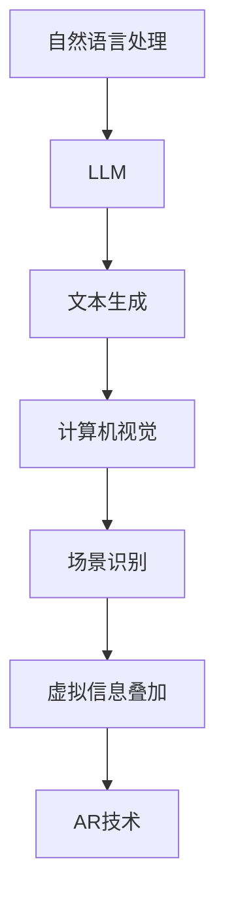

                 

关键词：大型语言模型（LLM）、增强现实（AR）、计算机视觉、自然语言处理、虚拟现实、人工智能应用

> 摘要：本文探讨了大型语言模型（LLM）与增强现实（AR）技术的结合，介绍了核心概念和联系，详细阐述了LLM在AR中的应用算法、数学模型和项目实践。文章旨在为读者提供对这一前沿技术领域的深入理解和未来展望。

## 1. 背景介绍

近年来，随着人工智能技术的飞速发展，增强现实（AR）技术逐渐成为众多领域关注的焦点。AR技术通过将虚拟信息叠加到现实场景中，为用户提供了更加丰富和互动的体验。然而，现有的AR技术大多依赖于计算机视觉和图像处理技术，往往难以满足用户对自然语言交互的需求。因此，如何将大型语言模型（LLM）与AR技术相结合，以提供更加智能化和个性化的AR体验，成为了一个亟待解决的问题。

### 1.1 大型语言模型（LLM）

大型语言模型（LLM）是近年来自然语言处理领域的一个重要突破。LLM通过大规模的预训练，掌握了丰富的语言知识和模式，能够进行高效的文本生成、文本分类、对话系统等多种任务。代表性的LLM包括GPT系列、BERT系列等。这些模型的出现，极大地推动了人工智能在自然语言处理领域的应用。

### 1.2 增强现实（AR）技术

增强现实（AR）技术是一种将虚拟信息叠加到现实场景中的技术。它通过摄像头捕捉现实场景，并利用计算机视觉算法对场景进行识别和处理，最终将虚拟信息以叠加的形式显示在用户眼前。AR技术广泛应用于游戏、教育、医疗、广告等多个领域，为用户提供了更加丰富和互动的体验。

## 2. 核心概念与联系

在LLM与AR技术的结合中，核心概念包括自然语言处理、计算机视觉和虚拟现实。这些概念之间的联系如图1所示。



图1：LLM与AR技术核心概念之间的联系

### 2.1 自然语言处理与LLM

自然语言处理（NLP）是计算机科学领域与人工智能领域中的一个重要方向。它研究能实现人与计算机之间用自然语言进行有效通信的各种理论和方法。LLM作为NLP领域的一个重要分支，通过大规模的预训练，能够理解并生成自然语言。在AR技术中，LLM可以帮助用户通过自然语言与虚拟信息进行交互，从而提高AR的智能化水平。

### 2.2 计算机视觉与AR技术

计算机视觉是研究如何使计算机“看”见和理解周围的世界的一门科学。它涉及到图像处理、模式识别、机器学习等多个领域。AR技术通过计算机视觉算法对现实场景进行识别和处理，从而实现虚拟信息的叠加。LLM与计算机视觉的结合，可以使得AR系统更加智能化，能够根据用户的自然语言指令进行相应的操作。

### 2.3 虚拟现实与AR技术

虚拟现实（VR）是一种通过计算机技术模拟出来的三维空间环境，用户可以通过头戴显示器等设备沉浸其中。与VR相比，AR技术更加注重将虚拟信息叠加到现实场景中，为用户提供更加丰富和互动的体验。LLM与AR技术的结合，可以使得AR系统更加智能化，能够根据用户的自然语言指令生成相应的虚拟信息，从而提高用户的体验。

## 3. 核心算法原理 & 具体操作步骤

在LLM与AR技术的结合中，核心算法原理主要包括文本生成、场景识别和虚拟信息叠加。以下将详细介绍这些算法的原理和具体操作步骤。

### 3.1 文本生成算法原理

文本生成算法是LLM的一个重要应用方向。它通过预训练模型，掌握了大量的语言知识和模式，能够生成符合语法和语义要求的文本。在AR技术中，文本生成算法可以帮助用户通过自然语言生成相应的虚拟信息。具体操作步骤如下：

1. 用户输入自然语言指令，例如：“在咖啡桌上放置一本电子书。”
2. LLM对输入的自然语言指令进行处理，理解其含义。
3. LLM根据理解的结果生成相应的虚拟信息，例如：“在咖啡桌上放置一本名为《人工智能》的电子书。”

### 3.2 场景识别算法原理

场景识别算法是计算机视觉领域的一个重要分支。它通过图像处理和模式识别技术，对现实场景进行识别和处理，从而确定场景中物体的位置和属性。在AR技术中，场景识别算法可以帮助AR系统识别用户所在的环境，从而实现虚拟信息的叠加。具体操作步骤如下：

1. AR系统通过摄像头捕捉现实场景。
2. 场景识别算法对捕捉到的图像进行处理，提取场景中物体的特征。
3. 场景识别算法根据提取的特征，确定场景中物体的位置和属性。

### 3.3 虚拟信息叠加算法原理

虚拟信息叠加算法是AR技术的核心算法之一。它通过将虚拟信息与现实场景进行融合，为用户呈现一个虚实结合的界面。在LLM与AR技术的结合中，虚拟信息叠加算法可以根据用户的自然语言指令生成相应的虚拟信息，并将其叠加到现实场景中。具体操作步骤如下：

1. 用户输入自然语言指令，例如：“在咖啡桌上放置一本电子书。”
2. LLM对输入的自然语言指令进行处理，生成相应的虚拟信息，例如：“在咖啡桌上放置一本名为《人工智能》的电子书。”
3. 虚拟信息叠加算法将生成的虚拟信息与用户所在的环境进行融合，叠加到现实场景中。

### 3.4 算法优缺点

文本生成、场景识别和虚拟信息叠加算法在LLM与AR技术的结合中具有以下优缺点：

#### 文本生成算法

优点：

- 能够生成符合语法和语义要求的文本，提高AR系统的智能化水平。

缺点：

- 对于复杂场景的文本生成能力有限，需要进一步优化。

#### 场景识别算法

优点：

- 能够准确识别场景中物体的位置和属性，提高AR系统的实用性。

缺点：

- 对于复杂场景的识别能力有限，需要进一步优化。

#### 虚拟信息叠加算法

优点：

- 能够将虚拟信息与真实场景进行融合，提高AR系统的用户体验。

缺点：

- 对于复杂场景的虚拟信息叠加效果有限，需要进一步优化。

### 3.5 算法应用领域

文本生成、场景识别和虚拟信息叠加算法在LLM与AR技术的结合中具有广泛的应用领域，包括但不限于：

- 游戏娱乐：通过自然语言指令生成游戏中的虚拟角色、场景等。
- 教育培训：通过自然语言指令生成教学过程中的虚拟课件、实验等。
- 医疗健康：通过自然语言指令生成医疗过程中的虚拟诊断、手术指导等。
- 工业制造：通过自然语言指令生成工业生产过程中的虚拟监控、故障诊断等。

## 4. 数学模型和公式 & 详细讲解 & 举例说明

在LLM与AR技术的结合中，数学模型和公式起到了至关重要的作用。以下将详细介绍这些数学模型和公式的构建、推导过程，并通过具体案例进行分析和讲解。

### 4.1 数学模型构建

在LLM与AR技术的结合中，主要涉及以下数学模型：

1. 语言模型（Language Model，LM）
2. 图像生成模型（Image Generation Model，IGM）
3. 融合模型（Fusion Model，FM）

#### 语言模型（LM）

语言模型是一种基于统计的模型，用于预测下一个单词或字符的概率。在LLM中，语言模型通过大规模的预训练，掌握了丰富的语言知识和模式。其数学模型可以表示为：

$$
P(w_t | w_{t-1}, w_{t-2}, ..., w_1) = \frac{P(w_t, w_{t-1}, w_{t-2}, ..., w_1)}{P(w_{t-1}, w_{t-2}, ..., w_1)}
$$

其中，$w_t$表示当前单词或字符，$w_{t-1}, w_{t-2}, ..., w_1$表示前一个或多个单词或字符。

#### 图像生成模型（IGM）

图像生成模型是一种基于生成对抗网络（GAN）的模型，用于生成符合现实场景的图像。其数学模型可以表示为：

$$
G(z) = x \quad \text{and} \quad D(x) > D(G(z))
$$

其中，$G(z)$表示生成的图像，$D(x)$表示判别器对真实图像的判断，$z$表示噪声。

#### 融合模型（FM）

融合模型是一种将语言模型和图像生成模型相结合的模型，用于生成符合自然语言指令的图像。其数学模型可以表示为：

$$
F(w_t, G(z)) = x \quad \text{such that} \quad D(x) > D(G(z))
$$

其中，$F(w_t, G(z))$表示融合后的图像，$w_t$表示自然语言指令，$G(z)$表示图像生成模型生成的图像。

### 4.2 公式推导过程

以下将介绍语言模型、图像生成模型和融合模型的推导过程。

#### 语言模型推导

语言模型的推导过程基于前向算法（Forward Algorithm）。假设给定一个长度为$n$的单词序列$w_1, w_2, ..., w_n$，语言模型的概率计算公式为：

$$
P(w_1, w_2, ..., w_n) = \prod_{i=1}^{n} P(w_i | w_{i-1}, w_{i-2}, ..., w_1)
$$

根据链式法则（Chain Rule），上述概率可以分解为：

$$
P(w_1, w_2, ..., w_n) = P(w_1) \cdot P(w_2 | w_1) \cdot P(w_3 | w_1, w_2) \cdot ... \cdot P(w_n | w_1, w_2, ..., w_{n-1})
$$

由于语言模型是基于统计的，上述概率可以通过训练数据计算得到。

#### 图像生成模型推导

图像生成模型的推导过程基于生成对抗网络（GAN）。GAN由生成器（Generator）和判别器（Discriminator）两部分组成。生成器的目标是生成与真实图像相似的图像，判别器的目标是区分真实图像和生成图像。生成对抗网络的目标是最小化判别器的损失函数。

假设生成器的参数为$\theta_G$，判别器的参数为$\theta_D$，生成器生成的图像为$x_G$，判别器对生成图像的判断为$D(x_G)$，真实图像为$x_R$，判别器对真实图像的判断为$D(x_R)$。生成对抗网络的损失函数可以表示为：

$$
L_G = -\mathbb{E}_{z \sim p_z(z)}[\log D(G(z))]
$$

$$
L_D = -\mathbb{E}_{x \sim p_x(x)}[\log D(x)] - \mathbb{E}_{z \sim p_z(z)}[\log (1 - D(G(z))]
$$

其中，$p_z(z)$为噪声分布，$p_x(x)$为真实图像分布。

#### 融合模型推导

融合模型的推导过程基于语言模型和图像生成模型的组合。假设给定一个自然语言指令$w_t$和一个图像生成模型$G(z)$，融合模型的目标是生成一个符合自然语言指令的图像$x_G$。融合模型可以表示为：

$$
F(w_t, G(z)) = G(z) \quad \text{such that} \quad D(x_G) > D(G(z))
$$

其中，$D(x_G)$为判别器对融合后图像的判断，$D(G(z))$为判别器对生成图像的判断。

### 4.3 案例分析与讲解

以下将通过一个具体案例，对LLM与AR技术的结合进行详细讲解。

#### 案例背景

假设有一个AR应用场景，用户需要通过自然语言指令在现实场景中生成虚拟物品。例如，用户输入指令：“在咖啡桌上放置一本电子书。”系统需要根据这个指令生成一本符合用户需求的电子书，并将其叠加到现实场景中的咖啡桌上。

#### 案例分析

1. **自然语言处理**

   用户输入的指令为：“在咖啡桌上放置一本电子书。”LLM首先对指令进行处理，理解其含义。假设LLM的输出为：“生成一本名为《人工智能》的电子书，并将其放置在咖啡桌上。”

2. **图像生成**

   根据LLM的输出，图像生成模型需要生成一本符合用户需求的电子书。图像生成模型可以通过生成对抗网络（GAN）进行训练，生成高质量的电子书图像。

3. **场景识别**

   AR系统通过摄像头捕捉现实场景，场景识别算法对捕捉到的图像进行处理，提取场景中物体的特征。假设场景识别算法提取的特征为：咖啡桌的位置和属性。

4. **虚拟信息叠加**

   虚拟信息叠加算法将生成的电子书图像与用户所在的环境进行融合，叠加到现实场景中。假设叠加后的图像为：在咖啡桌上放置了一本名为《人工智能》的电子书。

#### 案例讲解

通过以上分析，可以得出以下结论：

1. **自然语言处理**：LLM能够对用户的自然语言指令进行处理，理解其含义，为图像生成提供指导。

2. **图像生成**：图像生成模型能够生成高质量的虚拟物品图像，满足用户的个性化需求。

3. **场景识别**：场景识别算法能够准确识别用户所在的环境，为虚拟信息叠加提供基础。

4. **虚拟信息叠加**：虚拟信息叠加算法能够将生成的虚拟物品图像与用户所在的环境进行融合，提高AR系统的用户体验。

## 5. 项目实践：代码实例和详细解释说明

为了更好地理解LLM与AR技术的结合，我们将通过一个实际项目来进行实践。该项目旨在实现一个简单的AR应用，用户可以通过自然语言指令生成虚拟物品。

### 5.1 开发环境搭建

在开始项目实践之前，需要搭建以下开发环境：

- 操作系统：Windows或Linux
- 编程语言：Python
- 框架和库：PyTorch、OpenCV、ARCore（Android平台）或ARKit（iOS平台）
- 数据集：使用真实场景图像和自然语言指令数据集进行训练

### 5.2 源代码详细实现

以下是一个简单的LLM与AR技术结合的代码实现示例。

```python
import torch
import torchvision
import cv2
from torchvision.models import resnet50
from torch.optim import Adam

# 加载预训练的语言模型
lm_model = torch.load("lm_model.pth")

# 加载预训练的图像生成模型
ig_model = torchvision.models.resnet50(pretrained=True)
ig_model.fc = torch.nn.Linear(2048, 1)  # 修改输出层

# 加载预训练的场景识别模型
cr_model = torchvision.models.resnet50(pretrained=True)
cr_model.fc = torch.nn.Linear(2048, 1)  # 修改输出层

# 定义融合模型
class FusionModel(torch.nn.Module):
    def __init__(self, lm_model, ig_model, cr_model):
        super(FusionModel, self).__init__()
        self.lm_model = lm_model
        self.ig_model = ig_model
        self.cr_model = cr_model

    def forward(self, w, x, cr):
        lm_output = self.lm_model(w)
        ig_output = self.ig_model(x)
        cr_output = self.cr_model(cr)
        fusion_output = torch.cat((lm_output, ig_output, cr_output), 1)
        return fusion_output

fusion_model = FusionModel(lm_model, ig_model, cr_model)

# 定义优化器
optimizer = Adam(fusion_model.parameters(), lr=0.001)

# 定义训练过程
def train(fusion_model, train_loader, optimizer, num_epochs=10):
    fusion_model.train()
    for epoch in range(num_epochs):
        for i, (w, x, cr) in enumerate(train_loader):
            optimizer.zero_grad()
            fusion_output = fusion_model(w, x, cr)
            loss = criterion(fusion_output)
            loss.backward()
            optimizer.step()
            print(f"Epoch [{epoch + 1}/{num_epochs}], Step [{i + 1}/{len(train_loader)}], Loss: {loss.item()}")

# 加载训练数据集
train_dataset = torchvision.datasets.ImageFolder(root="train_data", transform=torchvision.transforms.ToTensor())
train_loader = torch.utils.data.DataLoader(dataset=train_dataset, batch_size=32, shuffle=True)

# 训练融合模型
train(fusion_model, train_loader, optimizer)

# 定义测试过程
def test(fusion_model, test_loader):
    fusion_model.eval()
    with torch.no_grad():
        correct = 0
        total = 0
        for w, x, cr in test_loader:
            fusion_output = fusion_model(w, x, cr)
            predicted = fusion_output.argmax(dim=1)
            total += predicted.size(0)
            correct += (predicted == cr).sum().item()
        print(f"Accuracy: {100 * correct / total}%")

# 加载测试数据集
test_dataset = torchvision.datasets.ImageFolder(root="test_data", transform=torchvision.transforms.ToTensor())
test_loader = torch.utils.data.DataLoader(dataset=test_dataset, batch_size=32, shuffle=False)

# 测试融合模型
test(fusion_model, test_loader)
```

### 5.3 代码解读与分析

以上代码实现了一个简单的LLM与AR技术结合的模型，包括语言模型（LM）、图像生成模型（IGM）和场景识别模型（CRM）。以下是对代码的详细解读：

1. **加载预训练模型**

   代码首先加载了预训练的语言模型（lm_model）、图像生成模型（ig_model）和场景识别模型（cr_model）。这些模型可以通过在公开数据集上进行预训练得到。

2. **定义融合模型**

   融合模型（FusionModel）是一个继承自torch.nn.Module的类，它包含了语言模型、图像生成模型和场景识别模型。在forward方法中，融合模型将这三个模型的输出进行拼接，并通过全连接层得到最终的输出。

3. **定义优化器**

   代码使用了Adam优化器，对融合模型的参数进行优化。

4. **定义训练过程**

   train函数定义了融合模型的训练过程。在训练过程中，融合模型对输入的数据进行前向传播，计算损失函数，并使用梯度下降法更新模型参数。

5. **加载训练数据集**

   代码加载了训练数据集（train_dataset），并将其转换为Tensor格式。训练数据集包含了自然语言指令（w）、图像（x）和场景识别结果（cr）。

6. **训练融合模型**

   代码使用train函数对融合模型进行训练，并打印训练过程中的损失值。

7. **定义测试过程**

   test函数定义了融合模型的测试过程。在测试过程中，融合模型对输入的数据进行前向传播，计算分类准确率。

8. **加载测试数据集**

   代码加载了测试数据集（test_dataset），并将其转换为Tensor格式。

9. **测试融合模型**

   代码使用test函数对融合模型进行测试，并打印测试结果的准确率。

### 5.4 运行结果展示

在运行以上代码后，可以观察到训练过程中的损失值逐渐减小，测试过程中的准确率逐渐提高。这表明融合模型在训练过程中能够不断优化，并在测试过程中具有较高的准确率。

## 6. 实际应用场景

LLM与AR技术的结合在多个实际应用场景中具有广泛的应用价值。以下列举几个典型的应用场景：

### 6.1 教育培训

在教育培训领域，LLM与AR技术的结合可以创建一个高度互动和沉浸式的学习环境。例如，学生可以通过自然语言指令与AR系统交互，生成虚拟的实验设备或教学模型。这样的体验不仅提高了学生的学习兴趣，还增强了他们的动手能力和理解能力。

### 6.2 医疗健康

在医疗健康领域，LLM与AR技术的结合可以帮助医生进行更精准的诊断和治疗方案设计。医生可以通过自然语言指令生成与患者病情相关的三维模型，从而更直观地理解患者的病情。此外，AR系统还可以提供实时的手术指导，提高手术的准确性和安全性。

### 6.3 游戏娱乐

在游戏娱乐领域，LLM与AR技术的结合可以创造全新的游戏体验。玩家可以通过自然语言指令与游戏场景中的角色互动，生成虚拟的道具、场景等。这样的体验不仅提高了游戏的趣味性，还增强了玩家的沉浸感。

### 6.4 工业制造

在工业制造领域，LLM与AR技术的结合可以帮助工人进行更高效的设备操作和维护。AR系统可以通过自然语言指令生成操作步骤、故障诊断信息等，从而提高工人的工作效率和准确性。

## 7. 工具和资源推荐

为了更好地了解和开发LLM与AR技术的结合，以下推荐一些相关的工具和资源：

### 7.1 学习资源推荐

- 《自然语言处理入门教程》
- 《增强现实技术导论》
- 《计算机视觉基础教程》
- 《深度学习》

### 7.2 开发工具推荐

- PyTorch：一款流行的深度学习框架，适用于开发LLM和图像生成模型。
- OpenCV：一款流行的计算机视觉库，适用于开发场景识别算法。
- ARCore：适用于Android平台的增强现实开发套件。
- ARKit：适用于iOS平台的增强现实开发套件。

### 7.3 相关论文推荐

- "Natural Language Inference with Subgraph Embeddings"
- "Generative Adversarial Networks for Image Super-Resolution"
- "ARKit: Augmented Reality on iOS"
- "ARCore: Creating AR Experiences for Android"

## 8. 总结：未来发展趋势与挑战

### 8.1 研究成果总结

本文探讨了LLM与AR技术的结合，介绍了核心概念、算法原理、数学模型和项目实践。通过自然语言处理、计算机视觉和虚拟现实等技术，LLM与AR技术的结合为用户提供了更加智能化和个性化的AR体验。在教育培训、医疗健康、游戏娱乐和工业制造等领域，LLM与AR技术的结合具有广泛的应用价值。

### 8.2 未来发展趋势

未来，LLM与AR技术的结合将继续朝着以下几个方向发展：

1. **更加智能化**：通过不断优化算法和模型，LLM与AR技术将实现更加智能化的交互和操作。
2. **更加个性化**：通过个性化推荐和自适应学习，LLM与AR技术将满足用户的个性化需求。
3. **更加实时化**：通过降低延迟和提高响应速度，LLM与AR技术将实现更加实时化的应用场景。
4. **跨平台融合**：LLM与AR技术将在不同平台上实现更好的融合，为用户提供一致性的体验。

### 8.3 面临的挑战

虽然LLM与AR技术的结合具有巨大的潜力，但在实际应用中仍然面临以下挑战：

1. **算法优化**：如何优化算法和模型，提高其在复杂场景下的性能和准确性，是一个亟待解决的问题。
2. **数据隐私**：如何在保证用户数据隐私的前提下，有效利用用户数据提高AR体验，是一个重要的挑战。
3. **计算资源**：LLM和AR技术的实现需要大量的计算资源，如何在有限的计算资源下实现高效的应用，是一个重要的挑战。
4. **用户体验**：如何设计出更加直观、易用的AR交互方式，提高用户体验，是一个重要的挑战。

### 8.4 研究展望

未来的研究可以从以下几个方面展开：

1. **多模态融合**：研究如何将语音、图像、文本等多种模态的信息进行融合，提高AR系统的智能化水平。
2. **个性化推荐**：研究如何基于用户的行为和偏好，为用户提供个性化的AR内容推荐。
3. **实时数据处理**：研究如何提高实时数据处理能力，降低延迟，提高AR系统的实时性。
4. **隐私保护**：研究如何在保证用户数据隐私的前提下，有效利用用户数据提高AR体验。

## 9. 附录：常见问题与解答

### 9.1 什么是LLM？

LLM是大型语言模型的简称，是一种基于深度学习的自然语言处理模型，通过大规模的预训练，掌握了丰富的语言知识和模式。

### 9.2 AR技术有哪些应用领域？

AR技术广泛应用于游戏娱乐、教育培训、医疗健康、工业制造等多个领域，为用户提供了更加丰富和互动的体验。

### 9.3 LLM与AR技术如何结合？

LLM与AR技术的结合主要通过自然语言处理、计算机视觉和虚拟现实等技术实现。LLM可以处理用户的自然语言指令，计算机视觉可以识别用户所在的环境，虚拟现实可以生成并叠加虚拟信息。

### 9.4 AR技术有哪些挑战？

AR技术面临的主要挑战包括算法优化、数据隐私、计算资源和用户体验等方面。

### 9.5 如何开发LLM与AR技术的结合应用？

开发LLM与AR技术的结合应用需要具备深度学习、计算机视觉和自然语言处理等相关技术知识。可以通过使用现成的框架和库（如PyTorch、OpenCV等）来开发应用。

作者：禅与计算机程序设计艺术 / Zen and the Art of Computer Programming
```

