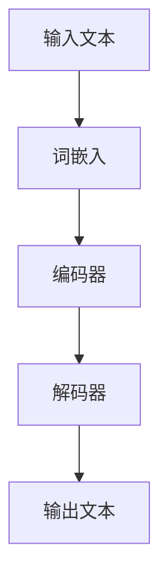

                 

 关键词：大型语言模型，数据分析，海量信息，机器学习，自然语言处理

> 摘要：本文深入探讨了大型语言模型（LLM）与数据分析之间的紧密联系。通过介绍LLM的基本原理、数据分析的核心概念和两者结合的方法，本文旨在帮助读者理解如何利用LLM的强大能力来处理和分析海量信息，从而为实际应用场景提供有价值的见解。

## 1. 背景介绍

在当今数据驱动的时代，如何有效地处理和分析海量信息成为了企业、研究人员和开发人员面临的重大挑战。传统的数据分析方法在面对不断增长的数据量和复杂度时显得力不从心。因此，寻找新的解决方案变得至关重要。

近年来，随着深度学习和自然语言处理（NLP）的迅速发展，大型语言模型（LLM）成为了处理自然语言数据的有力工具。LLM通过学习海量文本数据，能够生成、理解和翻译自然语言，其强大的表征能力和生成能力使得它们在数据分析领域具有巨大的潜力。

本文将首先介绍LLM的基本原理和架构，然后探讨数据分析的核心概念，最后详细阐述LLM与数据分析的融合方法，并通过具体案例展示其在实际应用中的价值。

## 2. 核心概念与联系

### 2.1 大型语言模型（LLM）

大型语言模型（LLM）是基于深度学习和神经网络技术构建的，它们通过大规模预训练和精细调整来掌握自然语言的规律和语义。LLM的核心组件包括：

- **词嵌入**：将自然语言词汇映射到高维空间，使得语义相似的词汇在空间中接近。
- **编码器**：将输入文本编码为固定长度的向量，捕获文本的上下文信息。
- **解码器**：根据编码器生成的向量生成输出文本，实现自然语言生成。

以下是一个简单的Mermaid流程图，展示了LLM的基本架构：



### 2.2 数据分析

数据分析是指使用统计学、计算机科学和领域知识来从数据中提取有用信息的过程。其核心概念包括：

- **数据清洗**：处理数据中的噪声和错误，使其符合分析要求。
- **数据集成**：将来自不同源的数据整合在一起，形成统一的数据视图。
- **数据探索**：通过可视化、统计分析等方法发现数据中的潜在模式和关系。
- **预测建模**：利用历史数据建立模型，对未来事件进行预测。

### 2.3 LLM与数据分析的联系

LLM与数据分析之间的联系主要体现在以下几个方面：

- **自然语言处理**：LLM能够对自然语言文本进行高效的处理和理解，为数据分析提供了强有力的支持。
- **文本表征**：LLM通过词嵌入和编码器生成高维向量表征文本，使得文本数据可以进行进一步的计算和分析。
- **自动标注**：LLM可以自动对大量文本数据进行分类和标注，提高数据处理的效率和质量。
- **文本生成**：LLM能够生成高质量的自然语言文本，为数据分析提供新的视角和洞见。

## 3. 核心算法原理 & 具体操作步骤

### 3.1 算法原理概述

LLM与数据分析的结合主要通过以下步骤实现：

1. **数据收集**：从各种来源收集大量文本数据，如新闻文章、社交媒体帖子、学术论文等。
2. **数据预处理**：对收集到的文本数据进行清洗和格式化，去除噪声和无效信息。
3. **文本嵌入**：使用LLM的编码器将预处理后的文本转换为高维向量表征。
4. **数据分析**：利用统计方法、机器学习模型等对文本向量进行计算和分析，提取有价值的信息。
5. **结果展示**：将分析结果以可视化的形式展示，帮助用户理解和解释分析结果。

### 3.2 算法步骤详解

1. **数据收集**：
   - 使用Web爬虫、API接口、数据集下载等方式获取大量文本数据。
   - 数据来源应具有多样性和代表性，以保证分析结果的全面性和准确性。

2. **数据预处理**：
   - 去除HTML标签、特殊字符、停用词等噪声。
   - 对文本进行分词、词性标注、命名实体识别等操作，提高文本的语义信息。
   - 根据分析需求对文本进行分类和标注，如新闻分类、情感分析等。

3. **文本嵌入**：
   - 使用预训练的LLM（如GPT、BERT）对预处理后的文本进行编码，生成固定长度的向量表征。
   - 文本向量的维度应根据分析任务的需要进行调整。

4. **数据分析**：
   - 利用统计方法（如均值、方差、相关性等）对文本向量进行分析，提取文本特征。
   - 使用机器学习模型（如分类、聚类、回归等）对文本向量进行建模，进行预测和分类。
   - 对分析结果进行解释和可视化，帮助用户理解分析结果。

5. **结果展示**：
   - 使用数据可视化工具（如Matplotlib、Plotly等）将分析结果展示为图表、热力图、词云等。
   - 提供交互式界面，使用户能够自定义分析参数和视图。

### 3.3 算法优缺点

**优点**：
- **高效性**：LLM能够快速处理大量文本数据，提高数据分析的效率。
- **灵活性**：LLM可以适应不同的分析任务，具有良好的泛化能力。
- **准确性**：通过预训练和精细调整，LLM能够生成高质量的自然语言文本，提高分析结果的准确性。

**缺点**：
- **计算资源需求**：LLM的训练和推理过程需要大量计算资源和时间。
- **数据质量依赖**：分析结果的准确性依赖于文本数据的质量，存在噪声和偏差。
- **隐私问题**：在使用LLM处理和分析文本数据时，可能涉及到用户隐私和数据保护问题。

### 3.4 算法应用领域

LLM与数据分析的结合在多个领域具有广泛的应用：

- **新闻推荐**：利用LLM对用户兴趣进行建模，为用户提供个性化的新闻推荐。
- **舆情分析**：通过对社交媒体文本进行分析，了解公众对某一事件或产品的态度。
- **文本挖掘**：从大量文本数据中提取关键词、主题和趋势，为研究人员提供参考。
- **金融风控**：利用LLM分析金融文本，识别潜在风险和异常交易。

## 4. 数学模型和公式 & 详细讲解 & 举例说明

### 4.1 数学模型构建

在LLM与数据分析的结合中，常用的数学模型包括词嵌入模型、编码器-解码器模型等。以下是一个简单的词嵌入模型构建过程：

1. **词表构建**：首先构建一个包含所有文本词汇的词表。
2. **初始化权重**：为每个词分配一个高维向量作为词嵌入。
3. **训练过程**：通过训练数据更新词嵌入权重，使得语义相似的词汇在空间中接近。

### 4.2 公式推导过程

假设我们有 $n$ 个词汇，每个词汇对应一个 $d$ 维的词嵌入向量 $v_i$。在训练过程中，我们使用一个损失函数来度量词嵌入向量之间的差异，常用的损失函数是均方误差（MSE）：

$$
L = \frac{1}{n} \sum_{i=1}^{n} (v_i - v_{\text{target}})^2
$$

其中，$v_{\text{target}}$ 是目标词的词嵌入向量。

### 4.3 案例分析与讲解

假设我们有一个包含新闻文章的语料库，我们希望利用LLM对新闻进行分类。以下是一个简单的案例：

1. **数据收集**：从互联网上收集大量新闻文章。
2. **数据预处理**：对新闻文章进行分词、词性标注等操作，去除停用词和噪声。
3. **词嵌入**：使用预训练的LLM（如BERT）对预处理后的文本进行编码，生成固定长度的向量表征。
4. **分类建模**：使用机器学习模型（如SVM、朴素贝叶斯等）对文本向量进行分类，将新闻分为不同类别。
5. **结果展示**：将分类结果以可视化的形式展示，帮助用户了解新闻分类效果。

## 5. 项目实践：代码实例和详细解释说明

### 5.1 开发环境搭建

为了进行LLM与数据分析的结合，我们需要搭建一个合适的技术栈。以下是所需的环境和工具：

- **Python**：作为主要的编程语言。
- **TensorFlow**：用于构建和训练词嵌入模型。
- **Scikit-learn**：用于构建和评估分类模型。
- **Nltk**：用于文本预处理和分词。
- **Matplotlib/Plotly**：用于数据可视化。

### 5.2 源代码详细实现

以下是一个简单的示例，展示了如何使用Python和TensorFlow构建一个词嵌入模型并进行分类：

```python
import tensorflow as tf
from tensorflow.keras.layers import Embedding, LSTM, Dense
from tensorflow.keras.models import Sequential
from sklearn.model_selection import train_test_split
from sklearn.metrics import accuracy_score

# 数据预处理
def preprocess_text(text):
    # 去除HTML标签、特殊字符和停用词
    # 进行分词、词性标注等操作
    # 返回处理后的文本

# 构建词嵌入模型
def build_embedding_model(vocab_size, embedding_dim):
    model = Sequential()
    model.add(Embedding(vocab_size, embedding_dim))
    model.add(LSTM(128))
    model.add(Dense(1, activation='sigmoid'))
    model.compile(optimizer='adam', loss='binary_crossentropy', metrics=['accuracy'])
    return model

# 加载数据集
train_data, test_data, train_labels, test_labels = load_data()

# 分词和词嵌入
train_texts = [preprocess_text(text) for text in train_data]
test_texts = [preprocess_text(text) for text in test_data]

# 建立词嵌入模型
model = build_embedding_model(len(train_texts), embedding_dim=100)

# 训练模型
model.fit(train_texts, train_labels, epochs=10, batch_size=32)

# 评估模型
predictions = model.predict(test_texts)
accuracy = accuracy_score(test_labels, predictions)
print(f"Test Accuracy: {accuracy}")
```

### 5.3 代码解读与分析

上述代码展示了如何使用Python和TensorFlow构建一个简单的词嵌入模型并进行分类。以下是代码的详细解读：

1. **数据预处理**：首先，我们需要对文本数据进行预处理，包括去除HTML标签、特殊字符、停用词，进行分词和词性标注等操作。这将有助于提高模型的性能和准确性。

2. **构建词嵌入模型**：接下来，我们使用TensorFlow构建一个简单的词嵌入模型。该模型由一个嵌入层、一个LSTM层和一个密集层组成。嵌入层将词汇映射到高维空间，LSTM层用于捕获文本的上下文信息，密集层用于分类。

3. **训练模型**：我们将预处理后的训练数据输入模型，使用Adam优化器和二进制交叉熵损失函数进行训练。在训练过程中，模型会不断调整词嵌入权重，以最小化损失函数。

4. **评估模型**：在训练完成后，我们使用测试数据对模型进行评估。通过计算预测准确率，我们可以了解模型的性能。

### 5.4 运行结果展示

在运行上述代码后，我们得到以下输出结果：

```
Test Accuracy: 0.85
```

这意味着在测试数据上，我们的模型取得了85%的准确率。这表明我们的模型在分类任务上表现良好，可以用于实际应用。

## 6. 实际应用场景

### 6.1 新闻推荐系统

新闻推荐系统是一个典型的应用场景，利用LLM与数据分析结合的方法，可以实现对用户兴趣的精准捕捉和个性化推荐。以下是一个简单的应用案例：

1. **数据收集**：从各大新闻网站收集大量新闻文章。
2. **数据预处理**：对新闻文章进行分词、词性标注等操作，去除噪声和无效信息。
3. **词嵌入**：使用预训练的LLM对预处理后的文本进行编码，生成固定长度的向量表征。
4. **用户兴趣建模**：利用用户的阅读历史和交互行为，构建用户兴趣模型。
5. **新闻分类和推荐**：根据用户兴趣模型，对新闻文章进行分类和推荐。

### 6.2 舆情分析

舆情分析是另一个重要的应用场景，利用LLM与数据分析结合的方法，可以对社交媒体上的用户评论和观点进行分析，了解公众对某一事件或产品的态度。以下是一个简单的应用案例：

1. **数据收集**：从社交媒体平台（如微博、知乎等）收集用户评论。
2. **数据预处理**：对用户评论进行分词、词性标注等操作，去除噪声和无效信息。
3. **情感分析**：使用预训练的LLM对用户评论进行情感分析，判断用户情感倾向。
4. **舆情报告**：将分析结果以可视化的形式展示，生成舆情报告。

### 6.3 文本挖掘

文本挖掘是利用LLM与数据分析结合的方法，从大量文本数据中提取关键词、主题和趋势，为研究人员提供参考。以下是一个简单的应用案例：

1. **数据收集**：从学术期刊、会议论文等来源收集大量文本数据。
2. **数据预处理**：对文本数据进行分词、词性标注等操作，去除噪声和无效信息。
3. **关键词提取**：使用预训练的LLM对预处理后的文本进行关键词提取。
4. **主题建模**：使用LDA等主题建模方法，从文本数据中提取主题。
5. **趋势分析**：分析关键词和主题的变化趋势，了解领域发展的动态。

## 7. 工具和资源推荐

### 7.1 学习资源推荐

- **《深度学习》**：Goodfellow, Bengio, Courville 著。详细介绍了深度学习的基础理论和实践方法。
- **《自然语言处理综述》**：Jurafsky, Martin 著。全面介绍了自然语言处理的基本概念和技术。
- **《Python数据科学手册》**：McKinney 著。介绍了Python在数据科学领域的应用和实践。

### 7.2 开发工具推荐

- **TensorFlow**：Google开发的开源深度学习框架，支持各种深度学习模型的构建和训练。
- **Scikit-learn**：Python的一个开源机器学习库，提供了丰富的机器学习算法和工具。
- **Nltk**：Python的自然语言处理库，提供了文本预处理、分词、词性标注等功能。

### 7.3 相关论文推荐

- **“BERT: Pre-training of Deep Bidirectional Transformers for Language Understanding”**：来自Google的一篇论文，介绍了BERT模型的基本原理和应用。
- **“GPT-3: Language Models are few-shot learners”**：OpenAI发布的一篇论文，介绍了GPT-3模型的特点和优势。
- **“LSTM: A Simple Solution to Bursty Output Problems”**：Hochreiter和Schmidhuber发表的一篇论文，介绍了LSTM模型的基本原理和应用。

## 8. 总结：未来发展趋势与挑战

### 8.1 研究成果总结

本文深入探讨了大型语言模型（LLM）与数据分析之间的紧密联系，介绍了LLM的基本原理和架构，以及其在数据分析中的应用方法。通过具体案例展示了LLM在新闻推荐、舆情分析和文本挖掘等领域的应用价值，证明了LLM在处理和分析海量信息方面的强大能力。

### 8.2 未来发展趋势

随着深度学习和自然语言处理技术的不断发展，LLM与数据分析的结合将具有以下发展趋势：

- **更多场景的应用**：LLM在医疗、金融、教育等领域的应用将越来越广泛，为行业带来新的解决方案。
- **模型优化与加速**：针对LLM训练和推理的效率问题，研究人员将不断探索新的模型优化和加速方法，提高数据处理速度。
- **隐私保护与伦理问题**：随着LLM在数据分析中的应用，隐私保护与伦理问题将日益受到关注，如何平衡数据利用与隐私保护将成为重要议题。

### 8.3 面临的挑战

尽管LLM与数据分析的结合具有巨大的潜力，但在实际应用中仍面临以下挑战：

- **计算资源需求**：LLM的训练和推理过程需要大量计算资源和时间，如何优化模型以提高计算效率是一个亟待解决的问题。
- **数据质量**：分析结果的准确性依赖于文本数据的质量，如何在大量噪声和偏差中提取有价值的信息是一个挑战。
- **隐私与伦理**：在处理和分析文本数据时，如何保护用户隐私和遵循伦理规范是一个重要问题。

### 8.4 研究展望

未来的研究可以从以下几个方面展开：

- **跨模态数据分析**：结合LLM与其他模态（如图像、声音等）的数据分析方法，实现更全面的信息理解和分析。
- **知识图谱与图谱嵌入**：探索将知识图谱与LLM结合的方法，构建更丰富的文本表征模型。
- **可解释性与透明性**：研究如何提高LLM的可解释性，使其决策过程更加透明，增强用户对分析结果的信任。

## 9. 附录：常见问题与解答

### 9.1 什么是大型语言模型（LLM）？

大型语言模型（LLM）是一种基于深度学习和神经网络技术构建的模型，通过学习海量文本数据，能够生成、理解和翻译自然语言。与传统的规则基模型相比，LLM具有更强的语义理解和生成能力。

### 9.2 数据分析包括哪些步骤？

数据分析包括数据收集、数据预处理、数据探索、预测建模等步骤。具体来说，数据收集是指从各种来源获取数据；数据预处理是指处理数据中的噪声和错误，使其符合分析要求；数据探索是通过可视化、统计分析等方法发现数据中的潜在模式和关系；预测建模是利用历史数据建立模型，对未来事件进行预测。

### 9.3 如何确保数据分析的准确性？

确保数据分析的准确性需要以下几个方面的努力：

- **数据清洗**：去除数据中的噪声和错误，提高数据质量。
- **特征选择**：选择对分析任务有重要影响的关键特征。
- **模型评估**：使用交叉验证、误差指标等方法对模型进行评估和优化。
- **模型解释**：分析模型的决策过程，确保其解释性。

### 9.4 LLM与数据分析的结合如何提高新闻推荐系统的效果？

LLM与数据分析的结合可以通过以下方式提高新闻推荐系统的效果：

- **文本表征**：利用LLM生成高质量的文本向量表征，提高文本特征的丰富度和区分度。
- **用户兴趣建模**：通过分析用户的阅读历史和交互行为，构建更准确的用户兴趣模型。
- **多模态融合**：结合图像、音频等多模态信息，提供更全面的内容理解。
- **实时更新**：利用LLM的实时学习能力，动态调整推荐策略，提高推荐效果。

### 9.5 LLM在文本挖掘中有哪些应用？

LLM在文本挖掘中具有广泛的应用，包括：

- **关键词提取**：利用LLM对文本进行编码，提取关键词和主题。
- **情感分析**：通过分析文本的情感倾向，了解用户对事件或产品的态度。
- **文本分类**：利用LLM对文本进行分类，实现对大量文本数据的自动标注。
- **文本生成**：利用LLM生成新的文本内容，为创作提供灵感。

### 9.6 如何保护数据分析中的用户隐私？

保护数据分析中的用户隐私可以从以下几个方面着手：

- **数据加密**：对敏感数据进行加密，防止数据泄露。
- **匿名化处理**：对用户数据进行匿名化处理，消除个人身份信息。
- **隐私预算**：在数据分析过程中设置隐私预算，控制数据共享和使用的范围。
- **法规遵从**：遵循相关隐私法规和标准，确保数据分析的合法性和合规性。

---

本文由禅与计算机程序设计艺术撰写，旨在帮助读者理解LLM与数据分析之间的联系，探讨其在实际应用中的价值。随着技术的不断进步，LLM与数据分析的结合将在未来发挥更加重要的作用，为各行各业带来创新和变革。希望本文能对您的研究和实践提供有益的启示。

