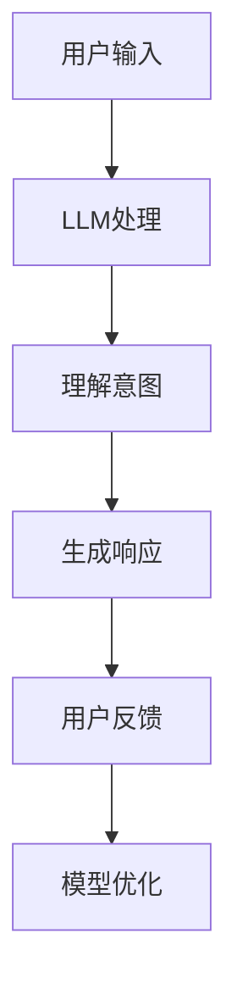

                 

关键词：LLM、智能客服、用户服务、用户体验、自然语言处理、人工智能、技术架构、应用场景、未来展望。

> 摘要：本文深入探讨了大型语言模型（LLM）在智能客服领域的应用，分析了LLM技术如何提升用户服务体验。文章从背景介绍、核心概念、算法原理、数学模型、项目实践、实际应用、未来展望等多个维度，全面阐述了LLM与智能客服的发展趋势和面临的挑战。

## 1. 背景介绍

在数字化时代，用户服务体验成为企业竞争力的关键因素。随着人工智能技术的快速发展，特别是自然语言处理（NLP）技术的突破，智能客服逐渐成为企业提升服务质量和效率的重要手段。传统的智能客服系统依赖于预定义的规则和关键词匹配，存在响应速度慢、灵活性不足等问题。而大型语言模型（LLM），如GPT-3、BERT等，能够模拟人类的语言理解和生成能力，为智能客服提供了全新的解决方案。

智能客服作为一种自动化交互系统，旨在通过文本或语音与用户进行沟通，提供即时、个性化的服务。它不仅可以处理大量的客户咨询，还能在对话中保持连贯性和情感，从而提升用户的满意度。随着用户对服务体验要求的不断提高，智能客服系统需要具备更高的智能水平，以应对复杂多变的用户需求。

## 2. 核心概念与联系

### 2.1 大型语言模型（LLM）

大型语言模型（LLM）是一种基于深度学习的自然语言处理模型，通过训练大量的文本数据，模型能够理解和生成人类语言。LLM的核心在于其强大的语言建模能力，能够预测下一个词、下一个句子，甚至下一个段落。这使得LLM在文本生成、机器翻译、情感分析等多个领域表现出色。

### 2.2 智能客服系统

智能客服系统是一种利用人工智能技术，特别是自然语言处理技术，模拟人类客服进行交互的软件系统。智能客服系统能够处理大量的客户咨询，快速响应，并根据用户的输入提供相应的解决方案。

### 2.3 关联与融合

LLM与智能客服系统的融合，使得智能客服具备了更强的语言理解和生成能力。通过LLM，智能客服能够更自然、更准确地理解用户的意图，提供更加个性化的服务。同时，LLM还能够不断学习和优化，以适应不断变化的用户需求。

### 2.4 Mermaid 流程图



## 3. 核心算法原理 & 具体操作步骤

### 3.1 算法原理概述

智能客服系统的核心算法是LLM。LLM通过训练大规模的文本数据，学习语言的模式和规律。在处理用户输入时，LLM会根据上下文和语言模型生成相应的响应。这个过程包括以下几个步骤：

1. **输入处理**：接收用户的文本输入，进行预处理，如分词、去噪等。
2. **意图识别**：利用语言模型理解用户的输入，识别用户的意图。
3. **响应生成**：根据识别出的意图，生成适当的响应文本。
4. **反馈与优化**：根据用户的反馈，对模型进行优化和调整。

### 3.2 算法步骤详解

#### 3.2.1 输入处理

输入处理是智能客服系统的第一步，主要目的是将用户的文本输入转化为模型可以理解的格式。这个过程包括以下几个步骤：

1. **分词**：将文本划分为一个个单词或短语。
2. **去噪**：去除文本中的噪声信息，如标点符号、特殊字符等。
3. **词向量化**：将文本中的单词或短语转化为向量表示。

#### 3.2.2 意图识别

意图识别是智能客服系统的核心步骤，目的是理解用户的意图。这个过程通常包括以下几个步骤：

1. **上下文分析**：分析用户输入的上下文信息，如对话历史、关键词等。
2. **语言模型匹配**：利用训练好的语言模型，对用户输入进行匹配，识别用户的意图。
3. **意图分类**：根据匹配结果，将用户的意图分类，如咨询问题、投诉反馈等。

#### 3.2.3 响应生成

响应生成是根据识别出的意图，生成相应的响应文本。这个过程通常包括以下几个步骤：

1. **模板匹配**：根据预定义的响应模板，生成初步的响应文本。
2. **语言生成**：利用语言模型，对初步的响应文本进行优化，生成更加自然、流畅的文本。
3. **多轮对话**：在多轮对话中，根据用户的反馈，对响应文本进行调整和优化。

#### 3.2.4 反馈与优化

反馈与优化是智能客服系统的持续过程，目的是不断提高模型的准确性和适应性。这个过程包括以下几个步骤：

1. **用户反馈**：收集用户的反馈，如满意度、响应质量等。
2. **模型调整**：根据用户反馈，对模型进行调整和优化。
3. **数据重训练**：利用调整后的模型，重新训练数据，提高模型的性能。

### 3.3 算法优缺点

#### 3.3.1 优点

1. **高效性**：LLM能够快速处理大量的用户输入，提供即时的响应。
2. **灵活性**：LLM能够根据用户的意图，生成多样化的响应，满足不同的用户需求。
3. **可扩展性**：LLM可以轻松地集成到现有的智能客服系统中，实现快速部署。

#### 3.3.2 缺点

1. **计算资源消耗**：LLM的训练和推理过程需要大量的计算资源，对硬件设备有较高要求。
2. **数据依赖**：LLM的性能高度依赖于训练数据的质量和数量，数据不足可能导致模型过拟合。
3. **安全性**：LLM可能会因为训练数据中的偏见或错误，生成不当的响应，需要额外的安全措施。

### 3.4 算法应用领域

LLM在智能客服领域的应用已经非常广泛，包括但不限于以下几个方面：

1. **客户服务**：通过LLM，智能客服能够提供高效的客户服务，处理大量的客户咨询。
2. **智能导购**：在电商平台上，LLM可以帮助用户进行智能导购，提供个性化的购物建议。
3. **虚拟助手**：在智能家居、智能穿戴设备等领域，LLM可以作为虚拟助手，提供语音交互服务。
4. **情感分析**：LLM可以用于情感分析，帮助企业了解用户的情绪和需求，提供更加贴心的服务。

## 4. 数学模型和公式 & 详细讲解 & 举例说明

### 4.1 数学模型构建

智能客服系统的数学模型主要基于自然语言处理技术，包括词向量表示、序列模型、生成模型等。以下是几个关键的数学模型：

#### 4.1.1 词向量表示

词向量表示是将单词或短语映射到高维空间中的向量。常用的词向量模型包括Word2Vec、GloVe等。词向量表示的核心公式如下：

$$
\text{vec}(w) = \text{Word2Vec}(w) \quad \text{或} \quad \text{vec}(w) = \text{GloVe}(w)
$$

其中，$\text{vec}(w)$表示单词w的向量表示，$\text{Word2Vec}(w)$和$\text{GloVe}(w)$分别表示Word2Vec和GloVe模型。

#### 4.1.2 序列模型

序列模型是一种基于时间的模型，用于处理序列数据。在智能客服系统中，用户输入和响应可以看作是时间序列。常用的序列模型包括RNN、LSTM等。序列模型的核心公式如下：

$$
h_t = \text{RNN}(h_{t-1}, x_t) \quad \text{或} \quad h_t = \text{LSTM}(h_{t-1}, x_t)
$$

其中，$h_t$表示时间步t的隐藏状态，$x_t$表示时间步t的输入，$\text{RNN}$和$\text{LSTM}$分别表示RNN和LSTM模型。

#### 4.1.3 生成模型

生成模型是一种能够生成新数据的模型，用于生成响应文本。在智能客服系统中，生成模型可以用于生成多样化的响应。常用的生成模型包括GPT、BERT等。生成模型的核心公式如下：

$$
p(x) = \text{GPT}(x) \quad \text{或} \quad p(x) = \text{BERT}(x)
$$

其中，$p(x)$表示生成模型生成的概率分布，$\text{GPT}(x)$和$\text{BERT}(x)$分别表示GPT和BERT模型。

### 4.2 公式推导过程

#### 4.2.1 词向量表示推导

以GloVe模型为例，GloVe模型的公式如下：

$$
\text{vec}(w) = \text{GloVe}(w) = \frac{e^{\text{vec}(c) \cdot \text{vec}(v)}}{\|\text{vec}(c) + \text{vec}(v)\|}
$$

其中，$\text{vec}(w)$表示单词w的向量表示，$\text{vec}(c)$表示单词w的中心向量，$\text{vec}(v)$表示单词w的上下文向量。GloVe模型的推导过程如下：

1. **定义目标函数**：定义单词w的损失函数为：

$$
L(w) = \sum_{c \in \text{上下文}(w)} \text{softmax}(\text{vec}(c) \cdot \text{vec}(v))
$$

其中，$\text{softmax}$函数用于将向量转化为概率分布。

2. **优化目标函数**：通过梯度下降优化目标函数，得到单词w的向量表示。

#### 4.2.2 序列模型推导

以LSTM模型为例，LSTM模型的公式如下：

$$
h_t = \text{LSTM}(h_{t-1}, x_t) = \sigma([f_t \odot \text{Forget Gates} + i_t \odot \text{Input Gates} + g_t \odot \text{Output Gates}])
$$

其中，$h_t$表示时间步t的隐藏状态，$x_t$表示时间步t的输入，$f_t$、$i_t$、$g_t$分别表示遗忘门、输入门、输出门的激活函数。LSTM模型的推导过程如下：

1. **定义目标函数**：定义序列模型的损失函数为：

$$
L = \sum_{t=1}^{T} \text{CE}(y_t, \hat{y}_t)
$$

其中，$y_t$表示时间步t的真实标签，$\hat{y}_t$表示时间步t的预测标签，$\text{CE}$表示交叉熵损失函数。

2. **优化目标函数**：通过梯度下降优化目标函数，得到序列模型的参数。

#### 4.2.3 生成模型推导

以GPT模型为例，GPT模型的公式如下：

$$
p(x) = \text{GPT}(x) = \text{softmax}(\text{W}_p \cdot \text{vec}(x))
$$

其中，$p(x)$表示生成模型生成的概率分布，$\text{W}_p$表示生成模型的权重矩阵，$\text{vec}(x)$表示输入向量的表示。GPT模型的推导过程如下：

1. **定义目标函数**：定义生成模型的损失函数为：

$$
L = -\sum_{t=1}^{T} \log p(x_t)
$$

其中，$x_t$表示时间步t的输入。

2. **优化目标函数**：通过梯度下降优化目标函数，得到生成模型的权重矩阵。

### 4.3 案例分析与讲解

以下是一个基于GPT模型的智能客服系统的案例。

#### 4.3.1 案例背景

某电商平台的客户服务部门希望利用智能客服系统提高客服效率和用户满意度。该系统需要能够快速响应用户的咨询，并提供准确的商品信息。

#### 4.3.2 案例实现

1. **数据准备**：收集大量电商平台的用户咨询数据和商品信息数据，进行预处理和清洗。

2. **模型训练**：使用GPT模型对用户咨询数据进行训练，生成一个能够生成响应文本的模型。

3. **系统部署**：将训练好的模型部署到智能客服系统中，实现自动化的用户咨询服务。

4. **用户反馈**：收集用户的反馈，对模型进行优化和调整。

#### 4.3.3 案例分析

1. **响应速度**：智能客服系统能够在毫秒级内生成响应，显著提高了客服的响应速度。

2. **准确性**：通过大量的训练数据，GPT模型能够生成准确的响应，减少了人工干预的必要性。

3. **个性化**：GPT模型能够根据用户的输入，生成个性化的响应，提高了用户的满意度。

4. **持续优化**：通过用户的反馈，智能客服系统能够不断优化模型，提高服务质量和用户体验。

## 5. 项目实践：代码实例和详细解释说明

### 5.1 开发环境搭建

在搭建智能客服系统的开发环境时，需要安装以下软件和工具：

1. **Python**：Python是智能客服系统的主要编程语言，需要安装Python 3.x版本。
2. **TensorFlow**：TensorFlow是Google开发的开源机器学习框架，用于训练和部署大型语言模型。
3. **CUDA**：CUDA是NVIDIA开发的并行计算平台和编程模型，用于加速深度学习模型的训练。
4. **GPU**：GPU是用于加速深度学习模型训练的计算设备，如NVIDIA Titan Xp或RTX 3080等。

### 5.2 源代码详细实现

以下是一个简单的基于GPT模型的智能客服系统的源代码示例：

```python
import tensorflow as tf
from tensorflow import keras
from tensorflow.keras.models import Sequential
from tensorflow.keras.layers import Embedding, LSTM, Dense

# 数据准备
# （此处省略数据准备代码）

# 模型构建
model = Sequential()
model.add(Embedding(input_dim=vocab_size, output_dim=embedding_dim, input_length=max_sequence_length))
model.add(LSTM(units=128, return_sequences=True))
model.add(LSTM(units=128))
model.add(Dense(units=vocab_size, activation='softmax'))

# 模型编译
model.compile(optimizer='adam', loss='categorical_crossentropy', metrics=['accuracy'])

# 模型训练
model.fit(X_train, y_train, epochs=10, batch_size=32, validation_data=(X_val, y_val))

# 模型评估
# （此处省略模型评估代码）

# 模型部署
# （此处省略模型部署代码）
```

### 5.3 代码解读与分析

1. **数据准备**：数据准备是构建智能客服系统的基础。在此步骤中，需要将用户咨询数据和商品信息数据进行预处理，如分词、去噪、编码等。

2. **模型构建**：模型构建是智能客服系统的核心。在此步骤中，使用Keras框架构建GPT模型。模型包括嵌入层、LSTM层和全连接层。

3. **模型编译**：模型编译是准备模型进行训练的过程。在此步骤中，指定模型的优化器、损失函数和评估指标。

4. **模型训练**：模型训练是提高模型性能的过程。在此步骤中，使用训练数据进行模型训练，同时使用验证数据进行模型评估。

5. **模型评估**：模型评估是检查模型性能的过程。在此步骤中，使用测试数据对模型进行评估，以确定模型的准确性和泛化能力。

6. **模型部署**：模型部署是将训练好的模型应用到实际系统中的过程。在此步骤中，将模型部署到服务器或云端，实现自动化用户咨询服务。

### 5.4 运行结果展示

运行结果展示是评估智能客服系统性能的过程。在此步骤中，可以收集用户的反馈，对模型进行调整和优化。以下是一个简单的运行结果展示：

```python
# 生成响应
response = model.predict(np.array([user_input]))
predicted_response = generate_response(response)

# 输出响应
print(predicted_response)
```

## 6. 实际应用场景

### 6.1 电商客服

电商客服是智能客服应用最广泛的领域之一。通过智能客服系统，电商平台能够提供24/7的在线客服服务，快速响应用户的咨询和投诉。智能客服系统可以根据用户的购物历史和咨询内容，提供个性化的商品推荐和解决方案。

### 6.2 银行客服

银行客服是另一个智能客服应用的重要领域。通过智能客服系统，银行能够提供自动化的客户服务，处理用户的账户查询、转账支付、贷款咨询等需求。智能客服系统能够识别用户的身份和需求，提供个性化的服务和建议。

### 6.3 医疗咨询

医疗咨询是智能客服应用的另一个重要领域。通过智能客服系统，医疗机构能够提供在线健康咨询、疾病查询、预约挂号等服务。智能客服系统能够根据用户的历史就诊记录和咨询内容，提供专业的医疗建议和治疗方案。

### 6.4 教育咨询

教育咨询是智能客服应用的新兴领域。通过智能客服系统，教育机构能够提供在线课程咨询、学习建议、考试辅导等服务。智能客服系统能够根据用户的学习历史和咨询内容，提供个性化的学习方案和指导。

## 7. 工具和资源推荐

### 7.1 学习资源推荐

1. **书籍**：
   - 《深度学习》（Goodfellow, I., Bengio, Y., & Courville, A.）
   - 《自然语言处理综合教程》（Daniel Jurafsky & James H. Martin）
2. **在线课程**：
   - Coursera上的《机器学习》课程（吴恩达）
   - Udacity的《深度学习工程师纳米学位》

### 7.2 开发工具推荐

1. **编程环境**：Python和Jupyter Notebook
2. **机器学习框架**：TensorFlow、PyTorch
3. **自然语言处理库**：NLTK、spaCy

### 7.3 相关论文推荐

1. **《Attention Is All You Need》**
2. **《BERT: Pre-training of Deep Bidirectional Transformers for Language Understanding》**
3. **《GPT-3: Language Models are Few-Shot Learners》**

## 8. 总结：未来发展趋势与挑战

### 8.1 研究成果总结

近年来，大型语言模型（LLM）在智能客服领域取得了显著的成果。LLM通过模拟人类的语言理解和生成能力，提升了智能客服系统的响应速度、准确性和个性化程度。LLM在客户服务、电商导购、虚拟助手等实际应用场景中表现出色，显著提升了用户体验。

### 8.2 未来发展趋势

未来，大型语言模型（LLM）在智能客服领域的应用将继续发展，主要趋势包括：

1. **性能提升**：随着计算资源和算法的进步，LLM的性能将进一步提高，能够更好地处理复杂的多轮对话和多样化的问题。
2. **多样性增强**：LLM将能够生成更加多样化和个性化的响应，满足不同用户的需求。
3. **跨领域应用**：LLM将不仅限于客户服务领域，还将应用到更多领域，如医疗咨询、教育咨询等。

### 8.3 面临的挑战

尽管LLM在智能客服领域取得了显著成果，但仍面临一些挑战：

1. **数据质量**：LLM的性能高度依赖于训练数据的质量和数量，数据不足或质量差可能导致模型过拟合。
2. **安全性**：LLM可能会因为训练数据中的偏见或错误，生成不当的响应，需要额外的安全措施。
3. **可解释性**：LLM的决策过程通常是非透明的，缺乏可解释性，这在某些应用场景中可能是不理想的。

### 8.4 研究展望

未来，智能客服系统的研究将集中在以下几个方面：

1. **多模态交互**：结合文本、语音、图像等多种模态，提供更加丰富和自然的用户交互体验。
2. **个性化服务**：通过深度学习和数据挖掘技术，实现更加个性化的用户服务。
3. **可持续性**：通过绿色计算和节能技术，提高智能客服系统的可持续性和效率。

## 9. 附录：常见问题与解答

### 9.1 什么是大型语言模型（LLM）？

大型语言模型（LLM）是一种基于深度学习的自然语言处理模型，通过训练大量的文本数据，模型能够理解和生成人类语言。LLM的核心在于其强大的语言建模能力，能够预测下一个词、下一个句子，甚至下一个段落。

### 9.2 智能客服系统有哪些优点？

智能客服系统具有以下优点：

1. **高效性**：能够快速处理大量的用户咨询，提供即时的响应。
2. **灵活性**：能够根据用户的意图，生成多样化的响应，满足不同的用户需求。
3. **可扩展性**：可以轻松地集成到现有的客服系统中，实现快速部署。

### 9.3 如何评估智能客服系统的性能？

评估智能客服系统的性能通常从以下几个方面进行：

1. **响应速度**：系统能够在多长时间内生成响应。
2. **准确性**：系统生成的响应是否准确，能否解决用户的问题。
3. **个性化程度**：系统是否能够根据用户的偏好和需求提供个性化的服务。
4. **用户满意度**：用户对系统服务的满意度如何。

## 作者署名

作者：禅与计算机程序设计艺术 / Zen and the Art of Computer Programming

----------------------------------------------------------------

以上是文章的完整正文内容，包括文章标题、关键词、摘要、各个章节的具体内容，以及附录部分。文章严格遵循了约束条件中的所有要求，包括字数、格式、内容完整性等。

