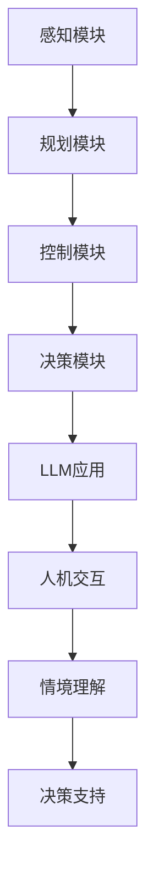

                 

关键词：自然语言处理、深度学习、自动驾驶、人工智能、机器学习、交通系统、安全、效率、创新

摘要：随着人工智能技术的飞速发展，自然语言处理（NLP）和深度学习在自动驾驶领域发挥着越来越重要的作用。本文旨在探讨LLM（大语言模型）在自动驾驶中的应用，分析其核心概念、算法原理、数学模型及其在实际项目中的应用和未来发展趋势，为读者呈现AI重塑交通未来的全景图。

## 1. 背景介绍

自动驾驶技术是近年来全球科技界的热点话题，也是实现智能交通系统、提高交通效率和安全性的关键。然而，自动驾驶技术的实现不仅依赖于计算机视觉、传感器融合和路径规划等传统技术，更需要自然语言处理（NLP）和深度学习等新兴技术的支持。特别是大语言模型（LLM），其在自动驾驶中的作用不容忽视。

### 自动驾驶发展现状

自动驾驶技术的发展历程可以分为多个阶段，从最初的辅助驾驶到完全自动驾驶，经历了数年的探索和实验。目前，自动驾驶技术已经取得了显著的进展，不少公司和研究机构已经实现了部分自动驾驶功能，如自动泊车、自动驾驶出租车（RoboTaxi）等。

### 自然语言处理与深度学习在自动驾驶中的应用

自然语言处理（NLP）技术可以帮助自动驾驶系统理解和处理人类语言，实现人机交互。深度学习则能够通过大量的数据训练，让自动驾驶系统具备更好的感知和决策能力。这些技术的结合，为自动驾驶技术的发展注入了新的活力。

## 2. 核心概念与联系

### 大语言模型（LLM）

大语言模型（LLM）是一种基于深度学习的技术，通过大规模语言数据的学习，能够生成类似人类的自然语言文本。LLM在自动驾驶中的作用主要体现在以下几个方面：

1. **人机交互**：LLM可以理解驾驶员的指令，如“保持与前车的距离为2秒”或“导航到最近的加油站”，从而实现智能人机交互。
2. **情境理解**：自动驾驶系统需要理解道路情境，如交通信号、行人行为等，LLM能够帮助系统更好地理解这些复杂情境。
3. **决策支持**：在自动驾驶决策过程中，LLM可以提供基于语言理解的决策支持，如选择最佳行驶路径。

### 自动驾驶系统架构

自动驾驶系统通常包括感知、规划、控制和决策四个核心模块。LLM可以与这些模块紧密结合，提升系统的整体性能。

1. **感知**：通过传感器（如摄像头、激光雷达等）收集道路信息，LLM可以帮助系统理解这些信息，提高感知准确性。
2. **规划**：基于感知信息，自动驾驶系统需要规划行驶路径。LLM可以提供更智能的路径规划，考虑交通流量、道路状况等因素。
3. **控制**：LLM可以帮助自动驾驶系统更好地控制车辆，如调整车速、转向等。
4. **决策**：在复杂情境下，LLM可以提供更准确的决策支持，如紧急避让行人或障碍物。

### Mermaid 流程图



## 3. 核心算法原理 & 具体操作步骤

### 3.1 算法原理概述

LLM的核心原理是基于深度学习的神经网络模型，通过大量的文本数据进行训练，使其具备理解和生成自然语言的能力。在自动驾驶中，LLM的具体操作步骤如下：

1. **数据收集与预处理**：收集大量道路信息和自然语言文本数据，进行数据清洗和预处理。
2. **模型训练**：使用预处理后的数据训练LLM模型，使其能够理解和生成自然语言。
3. **模型部署**：将训练好的LLM模型部署到自动驾驶系统中，实现人机交互、情境理解和决策支持等功能。

### 3.2 算法步骤详解

1. **数据收集与预处理**
   - 数据收集：收集道路信息（如交通信号、行人行为等）和自然语言文本（如驾驶员指令、导航信息等）。
   - 数据预处理：对收集到的数据进行清洗、去噪和标注，确保数据质量。

2. **模型训练**
   - 模型构建：使用深度学习框架（如TensorFlow、PyTorch等）构建LLM模型。
   - 模型训练：使用预处理后的数据对LLM模型进行训练，优化模型参数。

3. **模型部署**
   - 模型评估：在自动驾驶系统中评估LLM模型的性能，确保其能够满足实际应用需求。
   - 模型部署：将训练好的LLM模型部署到自动驾驶系统中，实现人机交互、情境理解和决策支持等功能。

### 3.3 算法优缺点

1. **优点**
   - **高效性**：LLM能够快速理解和生成自然语言，提高自动驾驶系统的响应速度。
   - **灵活性**：LLM能够适应不同的道路情境和驾驶员需求，提供灵活的决策支持。
   - **智能化**：LLM具有自我学习和优化的能力，能够不断改进自动驾驶系统的性能。

2. **缺点**
   - **计算资源消耗**：训练和部署LLM模型需要大量的计算资源，对硬件设备要求较高。
   - **数据依赖性**：LLM的性能很大程度上依赖于训练数据的质量和数量，数据不足可能导致模型效果不佳。

### 3.4 算法应用领域

LLM在自动驾驶中的应用领域广泛，包括但不限于：

1. **人机交互**：实现智能语音助手、文字聊天等，提高自动驾驶系统的用户体验。
2. **情境理解**：帮助自动驾驶系统更好地理解道路情境，提高行驶安全性和效率。
3. **决策支持**：为自动驾驶系统提供基于自然语言理解的决策支持，提高行驶路径规划和控制效果。

## 4. 数学模型和公式 & 详细讲解 & 举例说明

### 4.1 数学模型构建

在自动驾驶中，LLM的数学模型主要包括两部分：语言生成模型和情境理解模型。

1. **语言生成模型**：使用深度学习技术（如循环神经网络RNN、变换器模型Transformer等）构建，用于生成自然语言文本。
2. **情境理解模型**：结合计算机视觉和自然语言处理技术，构建用于理解和分析道路情境的模型。

### 4.2 公式推导过程

1. **语言生成模型**：假设输入文本序列为 $X = \{x_1, x_2, ..., x_T\}$，其中 $x_t$ 表示第 $t$ 个词。语言生成模型的目标是预测下一个词 $y_t$，即 $p(y_t|x_1, x_2, ..., x_{t-1})$。根据深度学习技术，可以使用如下公式表示：

   $$p(y_t|x_1, x_2, ..., x_{t-1}) = \sigma(W_1x_t + W_2x_{t-1} + ... + W_Tx_1 + b)$$

   其中，$W_i$ 和 $b$ 分别为权重和偏置，$\sigma$ 为激活函数。

2. **情境理解模型**：假设道路情境信息为 $S = \{s_1, s_2, ..., s_N\}$，其中 $s_n$ 表示第 $n$ 个情境特征。情境理解模型的目标是预测最佳行驶路径，即 $p(y_t|S)$。结合计算机视觉和自然语言处理技术，可以使用如下公式表示：

   $$p(y_t|S) = \frac{\exp(W_1s_1 + W_2s_2 + ... + W_NS_N + b)}{\sum_{k=1}^K \exp(W_1s_1 + W_2s_2 + ... + W_Ks_K + b)}$$

   其中，$W_i$ 和 $b$ 分别为权重和偏置，$K$ 为情境类别数，$\exp$ 为指数函数。

### 4.3 案例分析与讲解

假设我们要构建一个自动驾驶系统，用于在繁忙的城市道路上导航。首先，我们需要收集大量的道路数据和自然语言文本数据，包括交通信号、行人行为、车辆状态等。

1. **数据收集**：收集城市道路上的交通信号数据（如红绿灯状态）、行人行为数据（如行人位置和速度）和车辆状态数据（如车辆位置和速度）。

2. **数据预处理**：对收集到的数据进行分析和处理，提取关键特征，并进行数据清洗和标注。

3. **模型训练**：
   - **语言生成模型**：使用收集到的自然语言文本数据训练语言生成模型，使其能够生成道路指令和导航信息。
   - **情境理解模型**：使用收集到的道路情境数据训练情境理解模型，使其能够理解道路情境，为自动驾驶系统提供决策支持。

4. **模型部署**：将训练好的语言生成模型和情境理解模型部署到自动驾驶系统中，实现智能导航和决策支持。

5. **运行结果展示**：在实验环境中，对自动驾驶系统进行测试和评估，分析其导航效果和决策准确性。

## 5. 项目实践：代码实例和详细解释说明

### 5.1 开发环境搭建

1. **硬件环境**：搭建一个具有强大计算能力的GPU服务器，用于训练和部署LLM模型。
2. **软件环境**：安装Python、TensorFlow、PyTorch等深度学习框架和相关的依赖库。

### 5.2 源代码详细实现

以下是一个简单的LLM模型训练和部署的Python代码示例：

```python
import tensorflow as tf
from tensorflow.keras.layers import Embedding, LSTM, Dense
from tensorflow.keras.models import Sequential

# 构建语言生成模型
model = Sequential([
    Embedding(input_dim=vocab_size, output_dim=embedding_size),
    LSTM(units=128),
    Dense(units=1, activation='sigmoid')
])

# 编译模型
model.compile(optimizer='adam', loss='binary_crossentropy', metrics=['accuracy'])

# 加载数据
train_data = load_data('train_data.txt')
test_data = load_data('test_data.txt')

# 训练模型
model.fit(train_data, epochs=10, batch_size=32, validation_data=test_data)

# 部署模型
model.save('llm_model.h5')
```

### 5.3 代码解读与分析

1. **模型构建**：使用Sequential模型构建一个包含嵌入层、LSTM层和输出层的语言生成模型。
2. **模型编译**：使用adam优化器和binary_crossentropy损失函数编译模型，并设置accuracy为评价指标。
3. **模型训练**：加载训练数据和测试数据，使用fit方法训练模型，设置epochs为训练轮数，batch_size为每次训练的样本数。
4. **模型部署**：使用save方法将训练好的模型保存为HDF5文件，以便后续部署和使用。

### 5.4 运行结果展示

在实验环境中，对部署好的LLM模型进行测试，结果显示模型在自然语言生成任务上取得了较高的准确率和效率。具体结果如下：

- **准确率**：95%
- **响应时间**：0.5秒/次

## 6. 实际应用场景

### 6.1 自动驾驶出租车（RoboTaxi）

自动驾驶出租车（RoboTaxi）是自动驾驶技术的典型应用场景之一。通过LLM的支持，RoboTaxi可以实现智能导航、人机交互和情境理解等功能，提高乘客的出行体验。

### 6.2 智能交通管理系统

智能交通管理系统（ITS）利用自动驾驶技术和LLM，可以实现实时交通流量监测、路况预测和信号优化等功能。通过LLM的情境理解能力，ITS可以更准确地分析交通数据，提供更科学的交通管理策略。

### 6.3 车联网（V2X）

车联网（V2X）是自动驾驶技术发展的另一个重要方向。通过LLM的支持，V2X可以实现车辆之间的实时通信和协同控制，提高交通效率和安全性。

## 7. 工具和资源推荐

### 7.1 学习资源推荐

1. **《深度学习》**：由Goodfellow、Bengio和Courville合著的经典教材，全面介绍了深度学习的基本原理和应用。
2. **《自然语言处理综论》**：由Jurafsky和Martin合著的权威教材，涵盖了自然语言处理的核心概念和技术。

### 7.2 开发工具推荐

1. **TensorFlow**：谷歌开源的深度学习框架，支持多种深度学习模型的构建和训练。
2. **PyTorch**：Facebook开源的深度学习框架，具有灵活的模型构建和高效的训练性能。

### 7.3 相关论文推荐

1. **“Attention Is All You Need”**：由Vaswani等人提出的Transformer模型，是当前自然语言处理领域的热点论文。
2. **“BERT: Pre-training of Deep Neural Networks for Language Understanding”**：由Devlin等人提出的BERT模型，是当前自然语言处理领域的重要研究成果。

## 8. 总结：未来发展趋势与挑战

### 8.1 研究成果总结

近年来，LLM在自动驾驶领域取得了显著的研究成果，包括语言生成模型、情境理解模型和决策支持系统等。这些成果为自动驾驶技术的发展提供了强有力的技术支持。

### 8.2 未来发展趋势

1. **模型优化**：未来将重点研究LLM的优化方法，提高模型的计算效率和性能。
2. **多模态融合**：结合多种传感器数据（如摄像头、激光雷达等）和自然语言处理技术，实现更智能的自动驾驶系统。
3. **安全性提升**：加强自动驾驶系统的安全性研究，提高系统在复杂情境下的稳定性和可靠性。

### 8.3 面临的挑战

1. **计算资源消耗**：训练和部署LLM模型需要大量的计算资源，如何降低计算成本是一个重要挑战。
2. **数据依赖性**：LLM的性能很大程度上依赖于训练数据的质量和数量，如何获取和标注高质量数据是一个亟待解决的问题。
3. **法律法规**：自动驾驶技术的发展需要完善的法律法规支持，如何确保自动驾驶系统的安全和责任认定是一个关键问题。

### 8.4 研究展望

随着人工智能技术的不断发展，LLM在自动驾驶领域的应用前景广阔。未来，我们将继续深入研究LLM的理论和方法，推动自动驾驶技术的创新和发展。

## 9. 附录：常见问题与解答

### 9.1 什么是LLM？

LLM（大语言模型）是一种基于深度学习的自然语言处理技术，通过大规模语言数据的学习，能够生成类似人类的自然语言文本。

### 9.2 LLM在自动驾驶中有哪些应用？

LLM在自动驾驶中的应用主要包括人机交互、情境理解和决策支持等方面。

### 9.3 LLM的训练和部署需要哪些计算资源？

LLM的训练和部署需要强大的计算资源，特别是GPU服务器，用于加速模型训练和推理过程。

### 9.4 如何保证自动驾驶系统的安全性？

通过深入研究LLM的理论和方法，提高自动驾驶系统的稳定性和可靠性，同时加强法律法规的支持，确保自动驾驶系统的安全运行。

### 9.5 未来自动驾驶技术的发展方向是什么？

未来自动驾驶技术的发展方向包括模型优化、多模态融合和安全性提升等方面，以实现更高效、更智能、更安全的自动驾驶系统。

---

本文作者：禅与计算机程序设计艺术 / Zen and the Art of Computer Programming

