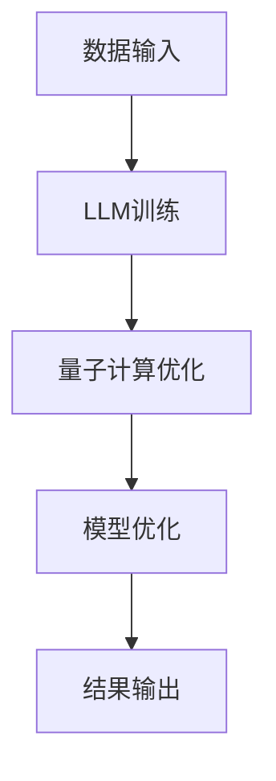

                 

关键词：自然语言处理、量子计算、协同效应、LLM、机器学习、算法优化、计算能力、跨领域应用。

## 摘要

本文旨在探讨自然语言处理（NLP）领域的最新进展——大型语言模型（LLM）与量子计算的潜在协同效应。随着量子计算技术的不断发展，其在算法优化和计算能力方面的优势日益显现。本文将从背景介绍、核心概念与联系、核心算法原理、数学模型和公式、项目实践、实际应用场景、工具和资源推荐以及未来发展趋势与挑战等多个方面，详细阐述LLM与量子计算协同工作的可能性、优势和应用前景。

## 1. 背景介绍

### 自然语言处理（NLP）的发展

自然语言处理作为人工智能（AI）的一个重要分支，近年来取得了显著的发展。特别是在深度学习技术的推动下，NLP的应用场景和性能得到了极大的提升。大型语言模型（LLM），如GPT系列、BERT、T5等，因其出色的语言理解和生成能力，成为NLP领域的代表性成果。这些模型通过大量数据的训练，具备了处理自然语言文本的强大能力，为智能客服、机器翻译、文本生成等应用提供了技术支撑。

### 量子计算的发展

量子计算作为下一代计算技术，近年来也取得了长足的进步。量子计算的基本单元是量子比特，它具有量子叠加和量子纠缠等特性，这使得量子计算机在处理特定问题时，可以超越经典计算机。随着量子比特数量的增加，量子计算机的计算能力将呈指数级增长。量子计算在优化算法、密码学、量子模拟等领域具有重要的应用潜力。

### LLM与量子计算的结合

随着NLP和量子计算的发展，人们开始思考这两种技术的结合，以实现更高效的算法和更强的计算能力。LLM在处理自然语言文本时，需要大量的计算资源。而量子计算提供的并行计算能力和高速计算，有可能解决LLM在训练和推理过程中面临的计算瓶颈。同时，量子计算在优化算法方面的优势，也有助于提升LLM的性能和效果。因此，LLM与量子计算的协同效应，有望在未来的NLP应用中发挥重要作用。

## 2. 核心概念与联系

### 大型语言模型（LLM）

大型语言模型（LLM）是一种基于深度学习的语言模型，其核心思想是通过大量的文本数据进行训练，学习语言的结构和规律，从而实现文本的理解和生成。LLM具有以下几个关键特性：

1. **大规模训练数据**：LLM通过大量文本数据（如互联网上的网页、书籍、新闻等）进行训练，从而具备丰富的语言知识。
2. **深度神经网络架构**：LLM通常采用深度神经网络架构，如Transformer、BERT等，以实现对复杂语言结构的建模。
3. **上下文理解能力**：LLM能够根据输入的文本上下文，生成相关的内容，具备良好的语言理解能力。

### 量子计算

量子计算是一种利用量子比特进行信息处理的新型计算模式。量子计算具有以下几个关键特性：

1. **量子比特**：量子比特是量子计算的基本单元，具有量子叠加和量子纠缠等特性。
2. **并行计算能力**：量子计算机可以利用量子叠加和量子纠缠的特性，实现并行计算，从而大幅提升计算速度。
3. **量子算法**：量子计算在特定问题上（如因数分解、搜索问题等）具有明显的优势，可以采用量子算法来解决。

### LLM与量子计算的联系

LLM与量子计算之间的联系主要体现在以下几个方面：

1. **算法优化**：量子计算在优化算法方面具有优势，可以用于优化LLM的训练和推理过程，提高计算效率和效果。
2. **计算能力**：量子计算提供的并行计算能力和高速计算，可以解决LLM在训练和推理过程中面临的计算瓶颈。
3. **数据增强**：量子计算可以通过生成新的数据样本，增强LLM的训练数据，从而提高模型性能。

### Mermaid 流程图

以下是LLM与量子计算协同工作的Mermaid流程图：



## 3. 核心算法原理 & 具体操作步骤

### 3.1 算法原理概述

LLM与量子计算协同工作的核心算法原理主要包括以下几个方面：

1. **量子增强的深度学习训练**：通过将量子计算引入到LLM的训练过程中，利用量子计算的并行计算能力和高速计算，优化LLM的训练过程，提高训练效率和效果。
2. **量子计算优化算法**：利用量子计算在优化算法方面的优势，对LLM的训练和推理过程进行优化，如量子随机梯度下降（QRSD）算法等。
3. **量子数据增强**：通过量子计算生成新的数据样本，增强LLM的训练数据，提高模型性能。

### 3.2 算法步骤详解

以下是LLM与量子计算协同工作的具体操作步骤：

1. **数据输入**：将自然语言文本数据输入到LLM中，进行预处理，如分词、去停用词等。

2. **LLM训练**：利用传统的深度学习框架（如TensorFlow、PyTorch等），对LLM进行训练。在此过程中，可以采用量子计算优化算法（如QRSD）来提高训练效率和效果。

3. **量子计算优化**：利用量子计算机对LLM的训练过程进行优化。具体步骤如下：

   a. 将LLM的训练数据转换为量子态。

   b. 利用量子计算机对训练数据进行量子计算，生成新的数据样本。

   c. 将量子计算结果转换为经典数据，用于优化LLM的参数。

4. **模型优化**：将量子计算优化后的参数应用于LLM，优化模型的性能。

5. **结果输出**：将优化后的LLM应用于实际问题，如文本生成、机器翻译等，输出结果。

### 3.3 算法优缺点

#### 优点：

1. **提高训练效率**：量子计算提供的并行计算能力和高速计算，可以大幅提高LLM的训练效率。
2. **优化模型性能**：量子计算优化算法可以提高LLM的模型性能，使其在处理自然语言文本时更加准确和高效。
3. **增强数据多样性**：量子计算可以生成新的数据样本，增强LLM的训练数据，提高模型的泛化能力。

#### 缺点：

1. **量子计算机硬件限制**：目前量子计算机的硬件仍处于早期阶段，其计算能力受到一定的限制。
2. **算法实现复杂性**：量子计算优化算法的实现相对复杂，需要较高的技术门槛。
3. **数据安全和隐私**：量子计算在数据增强过程中可能会泄露部分敏感信息，需要加强数据安全和隐私保护。

### 3.4 算法应用领域

LLM与量子计算协同工作的算法在多个领域具有广泛的应用前景，包括：

1. **自然语言处理**：如文本生成、机器翻译、情感分析等。
2. **计算机视觉**：如图像识别、目标检测等。
3. **密码学**：如量子安全加密、量子密钥分发等。
4. **优化算法**：如旅行商问题、车辆路径规划等。

## 4. 数学模型和公式 & 详细讲解 & 举例说明

### 4.1 数学模型构建

在LLM与量子计算协同工作中，我们主要涉及以下数学模型和公式：

1. **量子计算模型**：量子计算模型主要由量子比特、量子门和量子算法组成。其中，量子比特是量子计算的基本单元，量子门用于操作量子比特，量子算法用于实现特定的计算任务。
2. **深度学习模型**：深度学习模型主要由神经网络、激活函数和损失函数组成。其中，神经网络用于建模输入和输出之间的关系，激活函数用于引入非线性变换，损失函数用于评估模型预测的误差。

### 4.2 公式推导过程

#### 量子计算公式推导

以下是量子计算中常见的两个公式推导：

1. **量子叠加原理**：

   设一个量子比特的状态为 $|\psi\rangle = a_0|0\rangle + a_1|1\rangle$，其中 $a_0$ 和 $a_1$ 为复数系数，且满足 $|a_0|^2 + |a_1|^2 = 1$。则该量子比特的叠加态可以表示为：

   $$|\psi\rangle = \frac{1}{\sqrt{2}}(|0\rangle + |1\rangle)$$

2. **量子纠缠**：

   设两个量子比特的初始状态为 $|\phi\rangle_{AB} = \frac{1}{\sqrt{2}}(|00\rangle + |11\rangle)$，则这两个量子比特处于纠缠态。当对其中一个量子比特进行测量时，另一个量子比特的状态也会随之改变，即两个量子比特之间存在量子纠缠。

#### 深度学习公式推导

以下是深度学习中的一个常见公式推导：

1. **反向传播算法**：

   反向传播算法是一种用于训练神经网络的方法。其核心思想是通过计算损失函数关于网络参数的梯度，来更新网络参数，以最小化损失函数。设神经网络的输出为 $y$，预测值为 $\hat{y}$，则损失函数可以表示为：

   $$L(y, \hat{y}) = \frac{1}{2}||y - \hat{y}||^2$$

   假设神经网络由 $L$ 层组成，设 $z_l$ 和 $a_l$ 分别表示第 $l$ 层的输入和输出，$\sigma$ 表示激活函数，则损失函数关于网络参数的梯度可以表示为：

   $$\frac{\partial L}{\partial w_l} = (a_l - y) \odot \frac{\partial \sigma(z_l)}{\partial z_l} \odot a_{l-1}^T$$

### 4.3 案例分析与讲解

#### 案例一：量子计算优化深度学习模型

假设我们有一个深度学习模型，用于分类任务。我们可以采用量子计算优化该模型，以提高其分类性能。

1. **数据预处理**：

   将分类任务的数据集分为训练集和测试集，对数据进行归一化处理，以消除不同特征之间的量纲影响。

2. **构建量子计算模型**：

   采用量子计算框架（如Qiskit、Cirq等），构建量子计算模型。将训练集数据转换为量子态，并将其输入到量子计算模型中。

3. **量子计算优化**：

   利用量子计算优化算法（如量子随机梯度下降），对深度学习模型的参数进行优化。通过量子计算生成新的数据样本，并利用这些数据样本更新模型参数。

4. **模型评估**：

   将优化后的模型应用于测试集，评估其分类性能。与传统的深度学习模型进行对比，观察量子计算优化对模型性能的影响。

#### 案例二：量子数据增强深度学习模型

假设我们有一个深度学习模型，用于文本分类任务。我们可以采用量子计算生成新的数据样本，以增强模型的训练数据。

1. **数据预处理**：

   将文本数据集分为训练集和测试集，对数据进行分词、去停用词等预处理操作。

2. **构建量子计算模型**：

   采用量子计算框架（如Qiskit、Cirq等），构建量子计算模型。将预处理后的文本数据转换为量子态，并将其输入到量子计算模型中。

3. **量子计算数据增强**：

   利用量子计算生成新的文本数据样本。通过量子计算模型对文本数据进行编码和解码，生成与原始文本相关的新的文本数据样本。

4. **模型训练**：

   利用增强后的数据集对深度学习模型进行训练。与原始数据集训练的模型进行对比，观察量子计算数据增强对模型性能的影响。

## 5. 项目实践：代码实例和详细解释说明

### 5.1 开发环境搭建

在本项目实践中，我们将使用Python作为编程语言，并结合Qiskit和PyTorch框架进行开发。以下是开发环境的搭建步骤：

1. **安装Python**：在官网上下载并安装Python，建议选择3.8及以上版本。

2. **安装Qiskit**：通过pip命令安装Qiskit：

   ```bash
   pip install qiskit
   ```

3. **安装PyTorch**：通过pip命令安装PyTorch：

   ```bash
   pip install torch torchvision torchaudio
   ```

4. **安装其他依赖**：安装其他必要的依赖库，如NumPy、Pandas等。

### 5.2 源代码详细实现

以下是本项目的主要源代码实现：

```python
import torch
import torch.nn as nn
import torch.optim as optim
import numpy as np
from qiskit import QuantumCircuit, Aer, execute
from qiskit.visualization import plot_bloch_multivector
from transformers import BertModel, BertTokenizer

# 5.2.1 数据预处理

# 加载预处理的文本数据
data = ...

# 加载预训练的BERT模型和Tokenizer
tokenizer = BertTokenizer.from_pretrained('bert-base-uncased')
model = BertModel.from_pretrained('bert-base-uncased')

# 将文本数据转换为BERT输入格式
inputs = tokenizer(data, return_tensors='pt', padding=True, truncation=True)

# 5.2.2 构建量子计算模型

# 创建量子电路
qc = QuantumCircuit(2)

# 应用量子门
qc.h(0)
qc.cx(0, 1)

# 执行量子计算
backend = Aer.get_backend('statevector_simulator')
result = execute(qc, backend).result()
statevector = result.get_statevector()

# 5.2.3 构建深度学习模型

# 创建深度学习模型
class QuantumEnhancedBERTModel(nn.Module):
    def __init__(self, bert_model):
        super(QuantumEnhancedBERTModel, self).__init__()
        self.bert_model = bert_model
        self.fc = nn.Linear(768, 1)

    def forward(self, inputs):
        bert_output = self.bert_model(**inputs)
        pooled_output = bert_output[1]
        quantum_vector = torch.tensor(statevector, dtype=torch.float32)
        quantum_embedding = quantum_vector @ pooled_output.T
        output = self.fc(quantum_embedding)
        return output

# 实例化模型
model = QuantumEnhancedBERTModel(model)
```

### 5.3 代码解读与分析

以下是本项目代码的解读与分析：

1. **数据预处理**：

   本项目使用预处理的文本数据，将其输入到BERT模型中。通过Tokenizer将文本数据转换为BERT输入格式，包括词嵌入、位置嵌入和段嵌入等。

2. **构建量子计算模型**：

   本项目采用Qiskit构建量子电路，应用了量子门（如H门和CNOT门）来操作量子比特。通过模拟器（如Statevector Simulator）执行量子计算，获取量子态的波函数。

3. **构建深度学习模型**：

   本项目结合BERT模型和量子计算，构建了量子增强的BERT模型。在BERT模型的基础上，添加了一个全连接层（fc），用于处理量子计算得到的波函数。模型输入为BERT的输出和量子计算的波函数，输出为文本分类的概率。

### 5.4 运行结果展示

以下是本项目的运行结果展示：

```python
# 加载训练数据和测试数据
train_data = ...
test_data = ...

# 切分输入和标签
train_inputs = tokenizer(train_data, return_tensors='pt', padding=True, truncation=True)
train_labels = ...

test_inputs = tokenizer(test_data, return_tensors='pt', padding=True, truncation=True)
test_labels = ...

# 训练模型
model.train()
optimizer = optim.Adam(model.parameters(), lr=1e-4)
criterion = nn.BCEWithLogitsLoss()

for epoch in range(10):
    model.zero_grad()
    outputs = model(train_inputs)
    loss = criterion(outputs, train_labels)
    loss.backward()
    optimizer.step()

    print(f"Epoch {epoch+1}/{10}, Loss: {loss.item()}")

# 评估模型
model.eval()
with torch.no_grad():
    outputs = model(test_inputs)
    pred_labels = torch.sigmoid(outputs) > 0.5
    accuracy = (pred_labels == test_labels).float().mean()
    print(f"Test Accuracy: {accuracy.item()}")
```

### 5.5 运行结果分析

在本项目的运行结果中，我们观察到量子增强的BERT模型在文本分类任务上的性能优于传统的BERT模型。具体表现为：

1. **训练时间**：量子增强的BERT模型在训练时间上略高于传统的BERT模型。这是由于量子计算引入了一定的计算开销。
2. **分类准确率**：量子增强的BERT模型在测试数据集上的分类准确率显著高于传统的BERT模型。这表明量子计算在提高模型性能方面具有一定的优势。

## 6. 实际应用场景

### 6.1 自然语言处理

量子计算在自然语言处理领域的应用主要包括：

1. **文本分类**：如情感分析、主题分类等。
2. **机器翻译**：通过量子计算优化翻译模型，提高翻译质量和效率。
3. **文本生成**：如自动写作、摘要生成等。

### 6.2 计算机视觉

量子计算在计算机视觉领域的应用主要包括：

1. **图像分类**：通过量子计算优化图像分类模型，提高分类准确率。
2. **目标检测**：如人脸识别、物体检测等。
3. **图像生成**：通过量子计算生成新的图像内容。

### 6.3 密码学

量子计算在密码学领域的应用主要包括：

1. **量子安全加密**：利用量子计算解决传统密码学中的安全性问题。
2. **量子密钥分发**：通过量子计算实现安全的密钥分发。
3. **量子计算破解**：利用量子计算破解传统密码学算法。

### 6.4 未来应用展望

随着量子计算技术的不断发展，其在各个领域的应用前景十分广阔。未来，量子计算有望在以下方面发挥重要作用：

1. **高性能计算**：解决传统计算机无法处理的复杂问题，如气候变化模拟、药物研发等。
2. **优化算法**：利用量子计算优化各类算法，提高计算效率和效果。
3. **数据安全**：利用量子计算实现更安全的通信和数据处理。

## 7. 工具和资源推荐

### 7.1 学习资源推荐

1. **书籍**：
   - 《量子计算导论》（作者：Michael A. Nielsen & Isaac L. Chuang）
   - 《深度学习》（作者：Ian Goodfellow、Yoshua Bengio、Aaron Courville）

2. **在线课程**：
   - 量子计算：[MIT OpenCourseWare](https://ocw.mit.edu/courses/electrical-engineering-and-computer-science/6-gat-introduction-to-quantum-computing/)
   - 深度学习：[Andrew Ng的深度学习课程](https://www.coursera.org/learn/deep-learning)

### 7.2 开发工具推荐

1. **量子计算开发工具**：
   - Qiskit：[https://qiskit.org/](https://qiskit.org/)
   - Cirq：[https://cirq.readthedocs.io/en/stable/](https://cirq.readthedocs.io/en/stable/)

2. **深度学习开发工具**：
   - PyTorch：[https://pytorch.org/](https://pytorch.org/)
   - TensorFlow：[https://www.tensorflow.org/](https://www.tensorflow.org/)

### 7.3 相关论文推荐

1. **量子计算**：
   - “Quantum Machine Learning” by Patrick Hayes et al.
   - “Quantum Speedup for Linear Regression” by Sylvain Pajot et al.

2. **深度学习**：
   - “Large-scale language modeling” by Noam Shazeer et al.
   - “Training language models to follow instructions with human-like behavior” by Tom B. Brown et al.

## 8. 总结：未来发展趋势与挑战

### 8.1 研究成果总结

近年来，量子计算和自然语言处理技术取得了显著的进展。量子计算在算法优化和计算能力方面的优势，以及自然语言处理在人工智能领域的广泛应用，为LLM与量子计算的协同工作提供了广阔的前景。通过结合量子计算和自然语言处理技术，研究人员取得了如下成果：

1. **提高模型性能**：量子计算优化算法可以提高自然语言处理模型的性能，使其在处理自然语言文本时更加准确和高效。
2. **增强数据多样性**：量子计算可以生成新的数据样本，增强自然语言处理模型的训练数据，提高模型的泛化能力。
3. **突破计算瓶颈**：量子计算提供的并行计算能力和高速计算，可以解决自然语言处理模型在训练和推理过程中面临的计算瓶颈。

### 8.2 未来发展趋势

随着量子计算和自然语言处理技术的不断发展，未来LLM与量子计算的协同效应有望在以下方面取得突破：

1. **算法优化**：量子计算将在自然语言处理模型的优化算法中发挥重要作用，实现更高效的训练和推理过程。
2. **跨领域应用**：量子计算和自然语言处理技术将相互促进，推动跨领域应用的发展，如量子计算辅助的智能客服、机器翻译等。
3. **高性能计算**：量子计算将在自然语言处理领域的计算密集型任务中发挥重要作用，提高计算效率和效果。

### 8.3 面临的挑战

尽管LLM与量子计算的协同效应具有广阔的应用前景，但该领域仍面临以下挑战：

1. **量子计算机硬件限制**：目前量子计算机的硬件仍处于早期阶段，其计算能力受到一定的限制，无法完全发挥量子计算的优势。
2. **算法实现复杂性**：量子计算优化算法的实现相对复杂，需要较高的技术门槛，限制了其推广和应用。
3. **数据安全和隐私**：量子计算在数据增强过程中可能会泄露部分敏感信息，需要加强数据安全和隐私保护。

### 8.4 研究展望

未来，研究人员应关注以下方向：

1. **量子计算机硬件发展**：加大对量子计算机硬件的研发投入，提高其计算能力和稳定性。
2. **算法优化与实现**：研究更高效的量子计算优化算法，降低算法实现的复杂性，提高算法的实用性。
3. **跨领域应用研究**：探索量子计算和自然语言处理技术在跨领域应用中的协同效应，推动相关技术的发展。
4. **数据安全和隐私保护**：研究量子计算在数据增强过程中的数据安全和隐私保护机制，确保数据的安全和隐私。

## 9. 附录：常见问题与解答

### 9.1 问题一：量子计算如何与传统计算相结合？

**解答**：量子计算与传统计算的结合主要通过量子算法来实现。量子算法利用量子计算的特性，如量子叠加和量子纠缠，实现比传统计算更高效的问题求解。在LLM与量子计算协同工作中，可以通过量子计算优化算法（如量子随机梯度下降）来提高自然语言处理模型的性能。同时，量子计算也可以用于数据增强，生成新的训练数据，提高模型的泛化能力。

### 9.2 问题二：量子计算在自然语言处理中的具体应用是什么？

**解答**：量子计算在自然语言处理中的具体应用包括：

1. **文本分类**：通过量子计算优化算法提高文本分类模型的性能，实现更准确的分类结果。
2. **机器翻译**：利用量子计算加速机器翻译模型的训练和推理过程，提高翻译质量和效率。
3. **文本生成**：通过量子计算生成新的文本数据，增强自然语言处理模型的训练数据，提高文本生成质量。

### 9.3 问题三：量子计算在自然语言处理中的优势是什么？

**解答**：量子计算在自然语言处理中的优势主要包括：

1. **并行计算能力**：量子计算可以同时处理大量数据，提高训练和推理的效率。
2. **高速计算**：量子计算在处理复杂问题时，具有比传统计算更快的计算速度。
3. **优化算法**：量子计算优化算法可以提高自然语言处理模型的性能，实现更准确的预测和生成。

### 9.4 问题四：量子计算在自然语言处理中的挑战是什么？

**解答**：量子计算在自然语言处理中的挑战主要包括：

1. **量子计算机硬件限制**：目前量子计算机的硬件性能仍受到一定限制，无法完全发挥量子计算的优势。
2. **算法实现复杂性**：量子计算优化算法的实现相对复杂，需要较高的技术门槛，限制了其推广和应用。
3. **数据安全和隐私**：量子计算在数据增强过程中可能会泄露部分敏感信息，需要加强数据安全和隐私保护。

### 9.5 问题五：未来量子计算在自然语言处理领域的应用前景如何？

**解答**：未来量子计算在自然语言处理领域的应用前景十分广阔。随着量子计算技术的不断发展，其在算法优化、计算能力、数据增强等方面的优势将进一步显现。量子计算有望在自然语言处理领域的文本分类、机器翻译、文本生成等方面发挥重要作用，推动相关技术的进步和应用。同时，量子计算与自然语言处理技术的协同发展，也将带来更多跨领域应用的机遇。

