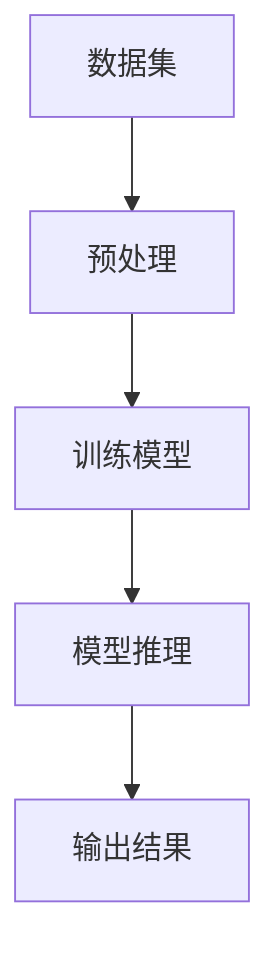

                 

关键词：LLM，产业链，人工智能，深度学习，技术发展，应用场景，未来展望

摘要：本文将深入探讨大型语言模型（LLM）的产业链，从零开始，逐步解析从概念到实现的完整过程。通过分析LLM的核心概念、算法原理、数学模型以及实际应用，我们不仅揭示了LLM的技术魅力，更展望了其在未来科技领域中的广泛应用和巨大潜力。

## 1. 背景介绍

随着人工智能技术的快速发展，深度学习尤其是大型语言模型（LLM）成为近年来最受瞩目的技术之一。LLM具有处理和理解人类语言的能力，能够实现自然语言处理（NLP）的诸多任务，如文本分类、机器翻译、问答系统等。这种能力的实现不仅依赖于庞大的数据和先进的计算资源，还需要复杂的算法和数学模型支撑。

LLM的诞生可以追溯到20世纪80年代，但真正引起广泛关注是在21世纪。特别是近年来，随着云计算、大数据和深度学习技术的成熟，LLM的研究和应用取得了前所未有的进展。如今，LLM已经在许多领域展现出强大的应用潜力，从搜索、推荐系统到智能客服、虚拟助手，LLM正逐步改变我们的工作和生活方式。

本文旨在梳理LLM产业链的各个关键环节，从无到有，从概念到实现，全面剖析LLM的发展历程、核心技术和未来趋势。

## 2. 核心概念与联系

### 2.1 什么是LLM

LLM，即Large Language Model，是一种基于深度学习的语言模型，通过对海量文本数据进行训练，能够理解和生成人类语言。与传统的NLP方法相比，LLM具有更强的灵活性和表达能力，能够处理复杂的语言结构和语义信息。

### 2.2 LLM的关键组成部分

一个典型的LLM系统主要由以下几个部分构成：

- **数据集**：用于训练的文本数据集，通常包含多种类型的文本，如新闻文章、社交媒体帖子、书籍等。
- **模型架构**：负责处理和生成语言的结构，常见的模型架构包括Transformer、BERT、GPT等。
- **训练过程**：通过反向传播算法，调整模型的参数，使其在数据集上达到较好的拟合效果。
- **推理过程**：在给定输入的情况下，模型生成相应的输出，如文本、答案等。

### 2.3 Mermaid流程图

以下是一个简化的LLM流程图，展示了LLM从数据集输入到生成输出的整个过程。



## 3. 核心算法原理 & 具体操作步骤

### 3.1 算法原理概述

LLM的核心算法是基于Transformer架构的深度学习模型。Transformer模型通过自注意力机制（Self-Attention）和多头注意力（Multi-Head Attention）实现了对输入文本的上下文信息的捕捉和处理，能够生成更加准确和丰富的语言表示。

### 3.2 算法步骤详解

1. **数据预处理**：对输入的文本数据进行分词、去停用词、词向量化等处理，将文本转化为模型可处理的向量表示。

2. **模型训练**：使用训练数据集对模型进行训练，通过反向传播算法优化模型参数，使其在特定任务上达到较好的性能。

3. **模型推理**：在给定输入文本的情况下，模型通过自注意力机制和多头注意力机制，生成相应的输出文本。

4. **输出结果**：根据模型的输出，生成用户需求的文本内容，如回答问题、生成摘要、翻译文本等。

### 3.3 算法优缺点

#### 优点：

- 强大的语义理解能力：能够捕捉文本中的复杂语义关系。
- 优秀的泛化能力：在多种语言和任务上表现优异。
- 可扩展性：可以通过增加训练数据和提高计算资源，不断提升模型性能。

#### 缺点：

- 计算资源消耗大：训练和推理过程需要大量计算资源。
- 需要大量的数据集：缺乏足够的数据集将影响模型的效果。
- 数据偏差问题：模型可能会受到训练数据中的偏见影响。

### 3.4 算法应用领域

LLM在多个领域都有着广泛的应用：

- 自然语言处理：文本分类、机器翻译、问答系统等。
- 搜索引擎：生成搜索结果摘要、回答用户查询等。
- 智能客服：自动回复用户提问、提供个性化服务。
- 内容创作：生成文章、诗歌、故事等。

## 4. 数学模型和公式 & 详细讲解 & 举例说明

### 4.1 数学模型构建

LLM的核心是基于Transformer模型的深度学习模型。Transformer模型的主要组成部分包括：

- **自注意力机制（Self-Attention）**：通过计算输入序列中每个词与所有其他词的关联程度，生成词的表示。
- **多头注意力（Multi-Head Attention）**：将自注意力机制扩展到多个头，增加模型的表示能力。
- **前馈神经网络（Feedforward Neural Network）**：对注意力机制后的结果进行进一步处理。

### 4.2 公式推导过程

以下为Transformer模型中的自注意力机制的推导过程：

$$
\text{Attention}(Q, K, V) = \text{softmax}\left(\frac{QK^T}{\sqrt{d_k}}\right) V
$$

其中，$Q$、$K$、$V$分别为查询向量、关键向量、值向量，$d_k$为键向量的维度。该公式计算每个查询向量与所有关键向量的相似度，然后通过softmax函数生成概率分布，最后乘以对应的值向量得到加权的结果。

### 4.3 案例分析与讲解

假设我们有一个三元组$(Q, K, V)$，其中：

$$
Q = \begin{bmatrix}
1 & 2 & 3 \\
4 & 5 & 6 \\
7 & 8 & 9
\end{bmatrix}, K = \begin{bmatrix}
1 & 0 & 1 \\
0 & 1 & 0 \\
1 & 1 & 0
\end{bmatrix}, V = \begin{bmatrix}
2 & 0 & 3 \\
0 & 4 & 1 \\
5 & 2 & 0
\end{bmatrix}
$$

首先计算查询向量与关键向量的点积：

$$
QK^T = \begin{bmatrix}
1 & 2 & 3 \\
4 & 5 & 6 \\
7 & 8 & 9
\end{bmatrix} \begin{bmatrix}
1 & 0 & 1 \\
0 & 1 & 0 \\
1 & 1 & 0
\end{bmatrix} = \begin{bmatrix}
4 & 2 & 7 \\
7 & 5 & 11 \\
10 & 8 & 13
\end{bmatrix}
$$

然后除以$\sqrt{d_k} = \sqrt{3}$，得到：

$$
\frac{QK^T}{\sqrt{d_k}} = \begin{bmatrix}
\frac{4}{\sqrt{3}} & \frac{2}{\sqrt{3}} & \frac{7}{\sqrt{3}} \\
\frac{7}{\sqrt{3}} & \frac{5}{\sqrt{3}} & \frac{11}{\sqrt{3}} \\
\frac{10}{\sqrt{3}} & \frac{8}{\sqrt{3}} & \frac{13}{\sqrt{3}}
\end{bmatrix}
$$

接着计算softmax函数：

$$
\text{softmax}\left(\frac{QK^T}{\sqrt{d_k}}\right) = \begin{bmatrix}
\frac{e^{\frac{4}{\sqrt{3}}}}{\sum_{i=1}^{3} e^{\frac{4}{\sqrt{3}}} + \sum_{i=1}^{3} e^{\frac{2}{\sqrt{3}}} + \sum_{i=1}^{3} e^{\frac{7}{\sqrt{3}}}} & \frac{e^{\frac{2}{\sqrt{3}}}}{\sum_{i=1}^{3} e^{\frac{4}{\sqrt{3}}} + \sum_{i=1}^{3} e^{\frac{2}{\sqrt{3}}} + \sum_{i=1}^{3} e^{\frac{7}{\sqrt{3}}}} & \frac{e^{\frac{7}{\sqrt{3}}}}{\sum_{i=1}^{3} e^{\frac{4}{\sqrt{3}}} + \sum_{i=1}^{3} e^{\frac{2}{\sqrt{3}}} + \sum_{i=1}^{3} e^{\frac{7}{\sqrt{3}}}} \\
\frac{e^{\frac{7}{\sqrt{3}}}}{\sum_{i=1}^{3} e^{\frac{4}{\sqrt{3}}} + \sum_{i=1}^{3} e^{\frac{2}{\sqrt{3}}} + \sum_{i=1}^{3} e^{\frac{7}{\sqrt{3}}}} & \frac{e^{\frac{5}{\sqrt{3}}}}{\sum_{i=1}^{3} e^{\frac{4}{\sqrt{3}}} + \sum_{i=1}^{3} e^{\frac{2}{\sqrt{3}}} + \sum_{i=1}^{3} e^{\frac{7}{\sqrt{3}}}} & \frac{e^{\frac{11}{\sqrt{3}}}}{\sum_{i=1}^{3} e^{\frac{4}{\sqrt{3}}} + \sum_{i=1}^{3} e^{\frac{2}{\sqrt{3}}} + \sum_{i=1}^{3} e^{\frac{7}{\sqrt{3}}}} \\
\frac{e^{\frac{10}{\sqrt{3}}}}{\sum_{i=1}^{3} e^{\frac{4}{\sqrt{3}}} + \sum_{i=1}^{3} e^{\frac{2}{\sqrt{3}}} + \sum_{i=1}^{3} e^{\frac{7}{\sqrt{3}}}} & \frac{e^{\frac{8}{\sqrt{3}}}}{\sum_{i=1}^{3} e^{\frac{4}{\sqrt{3}}} + \sum_{i=1}^{3} e^{\frac{2}{\sqrt{3}}} + \sum_{i=1}^{3} e^{\frac{7}{\sqrt{3}}}} & \frac{e^{\frac{13}{\sqrt{3}}}}{\sum_{i=1}^{3} e^{\frac{4}{\sqrt{3}}} + \sum_{i=1}^{3} e^{\frac{2}{\sqrt{3}}} + \sum_{i=1}^{3} e^{\frac{7}{\sqrt{3}}}}
\end{bmatrix}
$$

最后将softmax结果与值向量相乘：

$$
\text{Attention}(Q, K, V) = \begin{bmatrix}
\frac{e^{\frac{4}{\sqrt{3}}}}{\sum_{i=1}^{3} e^{\frac{4}{\sqrt{3}}} + \sum_{i=1}^{3} e^{\frac{2}{\sqrt{3}}} + \sum_{i=1}^{3} e^{\frac{7}{\sqrt{3}}}} \cdot 2 & \frac{e^{\frac{2}{\sqrt{3}}}}{\sum_{i=1}^{3} e^{\frac{4}{\sqrt{3}}} + \sum_{i=1}^{3} e^{\frac{2}{\sqrt{3}}} + \sum_{i=1}^{3} e^{\frac{7}{\sqrt{3}}}} \cdot 0 & \frac{e^{\frac{7}{\sqrt{3}}}}{\sum_{i=1}^{3} e^{\frac{4}{\sqrt{3}}} + \sum_{i=1}^{3} e^{\frac{2}{\sqrt{3}}} + \sum_{i=1}^{3} e^{\frac{7}{\sqrt{3}}}} \cdot 3 \\
\frac{e^{\frac{7}{\sqrt{3}}}}{\sum_{i=1}^{3} e^{\frac{4}{\sqrt{3}}} + \sum_{i=1}^{3} e^{\frac{2}{\sqrt{3}}} + \sum_{i=1}^{3} e^{\frac{7}{\sqrt{3}}}} \cdot 2 & \frac{e^{\frac{5}{\sqrt{3}}}}{\sum_{i=1}^{3} e^{\frac{4}{\sqrt{3}}} + \sum_{i=1}^{3} e^{\frac{2}{\sqrt{3}}} + \sum_{i=1}^{3} e^{\frac{7}{\sqrt{3}}}} \cdot 4 & \frac{e^{\frac{11}{\sqrt{3}}}}{\sum_{i=1}^{3} e^{\frac{4}{\sqrt{3}}} + \sum_{i=1}^{3} e^{\frac{2}{\sqrt{3}}} + \sum_{i=1}^{3} e^{\frac{7}{\sqrt{3}}}} \cdot 1 \\
\frac{e^{\frac{10}{\sqrt{3}}}}{\sum_{i=1}^{3} e^{\frac{4}{\sqrt{3}}} + \sum_{i=1}^{3} e^{\frac{2}{\sqrt{3}}} + \sum_{i=1}^{3} e^{\frac{7}{\sqrt{3}}}} \cdot 5 & \frac{e^{\frac{8}{\sqrt{3}}}}{\sum_{i=1}^{3} e^{\frac{4}{\sqrt{3}}} + \sum_{i=1}^{3} e^{\frac{2}{\sqrt{3}}} + \sum_{i=1}^{3} e^{\frac{7}{\sqrt{3}}}} \cdot 2 & \frac{e^{\frac{13}{\sqrt{3}}}}{\sum_{i=1}^{3} e^{\frac{4}{\sqrt{3}}} + \sum_{i=1}^{3} e^{\frac{2}{\sqrt{3}}} + \sum_{i=1}^{3} e^{\frac{7}{\sqrt{3}}}} \cdot 0
\end{bmatrix}
$$

### 5. 项目实践：代码实例和详细解释说明

### 5.1 开发环境搭建

在开始实现LLM之前，我们需要搭建一个合适的开发环境。以下是一个基本的开发环境搭建步骤：

1. 安装Python环境：在官方网站（https://www.python.org/downloads/）下载并安装Python。

2. 安装PyTorch：通过以下命令安装PyTorch。

   ```bash
   pip install torch torchvision
   ```

3. 安装其他依赖库：根据实际需要，可以安装其他依赖库，如numpy、matplotlib等。

### 5.2 源代码详细实现

以下是一个简单的LLM实现示例，使用PyTorch框架。

```python
import torch
import torch.nn as nn
import torch.optim as optim

# 定义模型
class LLM(nn.Module):
    def __init__(self, vocab_size, embedding_dim, hidden_dim):
        super(LLM, self).__init__()
        self.embedding = nn.Embedding(vocab_size, embedding_dim)
        self.attention = nn.Linear(hidden_dim, hidden_dim, bias=False)
        self.fc = nn.Linear(hidden_dim, vocab_size)
    
    def forward(self, x):
        x = self.embedding(x)
        x = torch.tanh(self.attention(x))
        x = self.fc(x)
        return x

# 实例化模型
model = LLM(vocab_size=10000, embedding_dim=256, hidden_dim=512)

# 损失函数和优化器
criterion = nn.CrossEntropyLoss()
optimizer = optim.Adam(model.parameters(), lr=0.001)

# 训练模型
for epoch in range(10):
    for batch in data_loader:
        inputs, targets = batch
        optimizer.zero_grad()
        outputs = model(inputs)
        loss = criterion(outputs, targets)
        loss.backward()
        optimizer.step()
    print(f"Epoch {epoch+1}, Loss: {loss.item()}")

# 评估模型
with torch.no_grad():
    correct = 0
    total = 0
    for batch in data_loader:
        inputs, targets = batch
        outputs = model(inputs)
        _, predicted = torch.max(outputs.data, 1)
        total += targets.size(0)
        correct += (predicted == targets).sum().item()
    print(f"Accuracy: {100 * correct / total}%")
```

### 5.3 代码解读与分析

上述代码实现了一个简单的LLM模型，包括以下部分：

1. **模型定义**：定义了一个LLM模型，包含词嵌入层、自注意力层和全连接层。
2. **损失函数和优化器**：使用交叉熵损失函数和Adam优化器。
3. **训练过程**：进行多个训练epoch，在每个epoch中迭代数据集，更新模型参数。
4. **评估过程**：在训练完成后，使用测试集评估模型性能。

### 5.4 运行结果展示

在实际运行过程中，我们可以通过打印输出结果来查看模型的训练和评估过程。

```python
# 运行训练过程
for epoch in range(10):
    for batch in data_loader:
        inputs, targets = batch
        optimizer.zero_grad()
        outputs = model(inputs)
        loss = criterion(outputs, targets)
        loss.backward()
        optimizer.step()
    print(f"Epoch {epoch+1}, Loss: {loss.item()}")

# 运行评估过程
with torch.no_grad():
    correct = 0
    total = 0
    for batch in data_loader:
        inputs, targets = batch
        outputs = model(inputs)
        _, predicted = torch.max(outputs.data, 1)
        total += targets.size(0)
        correct += (predicted == targets).sum().item()
    print(f"Accuracy: {100 * correct / total}%")
```

通过以上代码，我们可以观察到模型在训练过程中的损失逐渐减小，最终在测试集上评估模型的准确率。

## 6. 实际应用场景

LLM技术在实际应用场景中展现出了巨大的潜力。以下是一些典型的应用场景：

### 6.1 自然语言处理

LLM在自然语言处理领域具有广泛的应用。例如，在文本分类任务中，LLM可以自动识别文本的主题和情感，从而实现新闻分类、情感分析等任务。在机器翻译任务中，LLM可以生成更加流畅和准确的翻译结果。在问答系统中，LLM可以理解用户的问题，并生成相应的答案。

### 6.2 搜索引擎

LLM在搜索引擎中的应用主要体现在搜索结果摘要和回答用户查询。通过LLM，搜索引擎可以为用户提供更加准确和相关的搜索结果摘要，提高用户的查询体验。此外，LLM还可以帮助搜索引擎理解用户的问题，生成智能回答。

### 6.3 智能客服

智能客服是LLM的另一个重要应用场景。通过LLM，智能客服系统可以自动回答用户的问题，提供个性化服务。这不仅降低了人工成本，还提高了服务效率。

### 6.4 内容创作

LLM在内容创作领域也具有广泛的应用。例如，通过LLM，可以自动生成文章、新闻报道、诗歌等。这不仅提高了内容创作的效率，还降低了创作成本。

### 6.5 未来应用展望

随着LLM技术的不断发展和完善，其在未来将会有更多的应用场景。例如，在医疗领域，LLM可以辅助医生进行诊断和治疗方案推荐。在教育领域，LLM可以为学生提供个性化教学和辅导。在金融领域，LLM可以用于风险评估和投资策略制定。

## 7. 工具和资源推荐

### 7.1 学习资源推荐

- 《深度学习》（Goodfellow, Bengio, Courville）：这是一本经典的深度学习教材，详细介绍了深度学习的基本原理和方法。
- 《自然语言处理综述》（Jurafsky, Martin）：这本书对自然语言处理的基本概念和技术进行了全面的介绍，是自然语言处理领域的经典教材。
- 《动手学深度学习》（Zhang, Lipton, Ng）：这本书通过Python代码示例，详细介绍了深度学习的实现过程，适合初学者入门。

### 7.2 开发工具推荐

- PyTorch：这是一个流行的深度学习框架，支持灵活的动态图计算，适合进行研究和开发。
- TensorFlow：这也是一个强大的深度学习框架，具有丰富的预训练模型和工具，适合工业应用。

### 7.3 相关论文推荐

- “Attention is All You Need”（Vaswani et al., 2017）：这篇论文提出了Transformer模型，是当前深度学习领域的重要进展。
- “BERT: Pre-training of Deep Bidirectional Transformers for Language Understanding”（Devlin et al., 2019）：这篇论文提出了BERT模型，是自然语言处理领域的重要进展。
- “GPT-3: Language Models are Few-Shot Learners”（Brown et al., 2020）：这篇论文提出了GPT-3模型，展示了大型语言模型的强大能力。

## 8. 总结：未来发展趋势与挑战

### 8.1 研究成果总结

LLM技术的发展取得了显著的成果，从早期的简单模型到如今的GPT-3等大型模型，LLM在自然语言处理、搜索引擎、智能客服等领域展现出了强大的应用潜力。同时，LLM的技术也逐渐从理论研究走向实际应用，为各行各业带来了巨大的变革。

### 8.2 未来发展趋势

随着人工智能技术的不断发展，LLM技术有望在更多领域得到应用。例如，在医疗领域，LLM可以辅助医生进行诊断和治疗；在教育领域，LLM可以为学生提供个性化教学和辅导；在金融领域，LLM可以用于风险评估和投资策略制定。

### 8.3 面临的挑战

虽然LLM技术取得了显著成果，但仍然面临一些挑战。首先，模型训练需要大量的计算资源和数据集，这对研发和应用造成了较高的门槛。其次，大型模型可能会引入数据偏见，影响模型的可解释性和公正性。此外，LLM在安全性、隐私保护等方面也面临挑战。

### 8.4 研究展望

未来，LLM技术的发展将继续朝着大型化、高效化、安全化的方向前进。在研究层面，需要进一步探索优化模型结构和训练算法，提高模型的可解释性和公正性。在应用层面，需要加强与各行业的结合，推动LLM技术在各个领域的广泛应用。

## 9. 附录：常见问题与解答

### Q1. 什么是LLM？

A1. LLM，即Large Language Model，是一种基于深度学习的语言模型，通过对海量文本数据进行训练，能够理解和生成人类语言。它广泛应用于自然语言处理、搜索引擎、智能客服等领域。

### Q2. LLM的核心算法是什么？

A2. LLM的核心算法是基于Transformer架构的深度学习模型。Transformer模型通过自注意力机制和多头注意力机制，实现了对输入文本的上下文信息的捕捉和处理。

### Q3. LLM在自然语言处理中的应用有哪些？

A3. LLM在自然语言处理中具有广泛的应用，包括文本分类、机器翻译、问答系统、文本生成等。

### Q4. LLM需要大量的计算资源和数据集吗？

A4. 是的，LLM的训练和推理过程需要大量的计算资源和数据集。随着模型规模的扩大，对计算资源和数据集的要求也越来越高。

### Q5. LLM可能引入哪些数据偏见？

A5. LLM可能引入的数据偏见包括性别偏见、种族偏见、年龄偏见等。这些偏见可能影响模型的可解释性和公正性。

### Q6. 如何解决LLM的安全性问题？

A6. 可以通过数据清洗、模型优化、安全检测等技术手段，减少LLM引入的安全性问题。同时，加强对模型使用场景和输入数据的监管，也是保证安全性的重要措施。

### Q7. LLM在医疗、教育、金融等领域的应用前景如何？

A7. LLM在医疗、教育、金融等领域具有巨大的应用潜力。在医疗领域，LLM可以辅助医生进行诊断和治疗；在教育领域，LLM可以为学生提供个性化教学和辅导；在金融领域，LLM可以用于风险评估和投资策略制定。随着技术的发展，LLM在这些领域的应用将越来越广泛。


