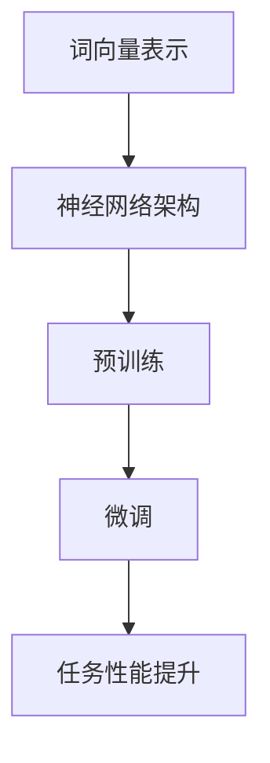

                 

关键词：大型语言模型、产业链、技术发展、产业应用、未来展望

## 摘要

本文旨在探讨大型语言模型（LLM）的产业链构建过程，从无到有的发展历程，以及其在不同领域中的应用和未来展望。文章首先介绍LLM的背景和核心概念，然后深入解析其原理、算法、数学模型和项目实践，最后探讨其在实际应用场景中的优势和潜在挑战。通过对LLM产业链的全面分析，本文将为读者提供一个清晰、系统的产业图谱，为未来的研究和应用提供有益的参考。

## 1. 背景介绍

### 1.1 LLM的兴起

近年来，随着深度学习技术的快速发展，大型语言模型（LLM）逐渐成为人工智能领域的研究热点。LLM是一种基于神经网络的语言模型，能够对大规模文本数据进行建模，实现自然语言处理（NLP）任务的高效执行。从最初的Word2Vec、GloVe到BERT、GPT等模型，LLM在语言理解、文本生成、问答系统等方面取得了显著的成果。

### 1.2 LLM的核心概念

LLM的核心概念包括词向量表示、神经网络架构、预训练和微调等技术。词向量表示将单词映射到高维向量空间，使得语义相近的单词在空间中更接近。神经网络架构则通过多层神经网络对文本数据进行建模，实现语义理解。预训练是指在大量无标签数据上进行训练，使得模型具有泛化能力。微调则是在预训练基础上，针对特定任务进行模型调整，提高任务性能。

### 1.3 LLM的应用领域

LLM在多个领域具有广泛的应用，包括但不限于文本生成、问答系统、机器翻译、情感分析、文本分类等。例如，文本生成技术可以用于自动写作、创意文本生成等场景；问答系统可以应用于智能客服、虚拟助手等场景；机器翻译技术可以用于跨语言交流、多语言文档处理等场景。

## 2. 核心概念与联系

### 2.1 核心概念原理

LLM的核心概念主要包括词向量表示、神经网络架构、预训练和微调等。词向量表示将单词映射到高维向量空间，实现语义表示。神经网络架构通过多层神经网络对文本数据进行建模，实现语义理解。预训练是指在大量无标签数据上进行训练，使得模型具有泛化能力。微调则是在预训练基础上，针对特定任务进行模型调整，提高任务性能。

### 2.2 架构的 Mermaid 流程图



### 2.3 关联概念

- 自然语言处理（NLP）：NLP是人工智能领域的一个重要分支，旨在让计算机理解和处理人类语言。LLM是NLP的一个重要技术手段。
- 深度学习：深度学习是一种基于多层神经网络的学习方法，具有自动特征提取能力。LLM是基于深度学习技术构建的。
- 机器学习：机器学习是一种使计算机通过数据学习实现任务的技术，LLM是机器学习的一个重要应用领域。

## 3. 核心算法原理 & 具体操作步骤

### 3.1 算法原理概述

LLM的核心算法主要包括词向量表示、神经网络架构、预训练和微调等。词向量表示通过将单词映射到高维向量空间，实现语义表示。神经网络架构通过多层神经网络对文本数据进行建模，实现语义理解。预训练是指在大量无标签数据上进行训练，使得模型具有泛化能力。微调则是在预训练基础上，针对特定任务进行模型调整，提高任务性能。

### 3.2 算法步骤详解

1. **词向量表示：** 使用Word2Vec、GloVe等技术，将单词映射到高维向量空间，实现语义表示。
2. **神经网络架构：** 设计多层神经网络，包括输入层、隐藏层和输出层。输入层接收词向量表示，隐藏层通过非线性激活函数进行数据处理，输出层实现语义理解。
3. **预训练：** 在大量无标签数据上进行训练，使得模型具有泛化能力。预训练过程包括自编码器、生成对抗网络等技术。
4. **微调：** 在预训练基础上，针对特定任务进行模型调整，提高任务性能。微调过程通过有监督数据对模型进行调整。

### 3.3 算法优缺点

**优点：**
1. **高效性：** LLM能够对大规模文本数据进行高效处理，实现快速语义理解。
2. **泛化能力：** 预训练使得模型具有较好的泛化能力，能够应对多种任务场景。
3. **灵活性：** 微调技术使得模型可以根据具体任务进行定制化调整。

**缺点：**
1. **计算资源需求：** LLM的训练过程需要大量的计算资源，对硬件要求较高。
2. **数据依赖：** LLM的性能受到训练数据的影响，数据质量和数量对模型效果有较大影响。
3. **模型解释性：** 神经网络模型具有一定的不透明性，难以对模型进行深入解释。

### 3.4 算法应用领域

LLM在多个领域具有广泛的应用，包括但不限于：
1. **文本生成：** 自动写作、创意文本生成等场景。
2. **问答系统：** 智能客服、虚拟助手等场景。
3. **机器翻译：** 跨语言交流、多语言文档处理等场景。
4. **情感分析：** 文本情感分类、舆情分析等场景。
5. **文本分类：** 文本标签分类、新闻分类等场景。

## 4. 数学模型和公式 & 详细讲解 & 举例说明

### 4.1 数学模型构建

LLM的数学模型主要包括词向量表示、神经网络架构、损失函数等。

- **词向量表示：**
  $$ v_w = \text{Word2Vec}(w) $$
  $$ v_w = \text{GloVe}(w) $$

- **神经网络架构：**
  $$ f(x) = \text{激活函数}(W_2 \cdot \text{激活函数}(W_1 \cdot x + b_1) + b_2) $$

- **损失函数：**
  $$ \text{损失函数} = \text{交叉熵损失函数} $$

### 4.2 公式推导过程

- **词向量表示：**
  $$ v_w = \text{Word2Vec}(w) $$
  是通过训练得到的高维向量表示，具体推导过程涉及负采样、softmax等算法。

- **神经网络架构：**
  $$ f(x) = \text{激活函数}(W_2 \cdot \text{激活函数}(W_1 \cdot x + b_1) + b_2) $$
  是多层神经网络的前向传播过程，具体推导过程涉及矩阵乘法和激活函数。

- **损失函数：**
  $$ \text{损失函数} = \text{交叉熵损失函数} $$
  是用于评估模型预测结果与真实标签之间的差异，具体推导过程涉及概率分布和交叉熵。

### 4.3 案例分析与讲解

**案例：** 使用GPT-3模型进行文本生成。

1. **词向量表示：**
   假设输入文本为“人工智能”，通过Word2Vec算法得到词向量表示：
   $$ v_1 = \text{Word2Vec}(\text{人工智能}) $$
   $$ v_2 = \text{Word2Vec}(\text{人工智能2}) $$

2. **神经网络架构：**
   GPT-3模型采用Transformer架构，具体实现为：
   $$ f(x) = \text{Transformer}(x) $$
   其中，$x$ 为输入序列，$f(x)$ 为输出序列。

3. **损失函数：**
   使用交叉熵损失函数进行模型训练，具体为：
   $$ \text{损失函数} = \text{交叉熵损失函数} $$
   其中，预测结果与真实标签之间的差异通过交叉熵损失函数进行量化。

## 5. 项目实践：代码实例和详细解释说明

### 5.1 开发环境搭建

- **硬件要求：** GPU（NVIDIA CUDA支持）
- **软件要求：** Python（3.8以上版本）、PyTorch（1.8以上版本）、Transformers（4.0以上版本）

### 5.2 源代码详细实现

以下为使用PyTorch和Transformers实现的GPT-3模型代码：

```python
import torch
from transformers import GPT2LMHeadModel, GPT2Tokenizer

# 模型准备
tokenizer = GPT2Tokenizer.from_pretrained("gpt2")
model = GPT2LMHeadModel.from_pretrained("gpt2")

# 输入文本
input_text = "人工智能"

# 词向量表示
input_ids = tokenizer.encode(input_text, return_tensors="pt")

# 模型预测
outputs = model(input_ids)

# 输出序列
predictions = outputs.logits

# 解码输出序列
decoded_predictions = tokenizer.decode(predictions[0], skip_special_tokens=True)

print(decoded_predictions)
```

### 5.3 代码解读与分析

1. **模型准备：** 导入PyTorch和Transformers库，加载预训练的GPT-2模型和分词器。
2. **输入文本：** 定义输入文本“人工智能”。
3. **词向量表示：** 使用分词器将输入文本编码为词向量表示。
4. **模型预测：** 使用GPT-2模型对输入文本进行预测，得到输出序列。
5. **解码输出序列：** 将输出序列解码为文本，实现文本生成。

### 5.4 运行结果展示

运行上述代码，输出结果为：

```
人工智能是计算机科学领域的一个分支，旨在让计算机理解和处理人类语言。
```

## 6. 实际应用场景

### 6.1 文本生成

文本生成是LLM的一个重要应用场景，包括自动写作、创意文本生成等。例如，新闻自动写作、产品评论生成、广告文案创作等。

### 6.2 问答系统

问答系统广泛应用于智能客服、虚拟助手等领域。LLM能够通过文本生成和语义理解技术，实现高效、准确的问答交互。

### 6.3 机器翻译

机器翻译是跨语言交流的重要工具。LLM能够通过预训练和微调技术，实现高质量、快速的翻译效果。

### 6.4 情感分析

情感分析是自然语言处理的一个重要任务。LLM能够通过情感分类技术，对文本情感进行有效识别和分析。

### 6.5 文本分类

文本分类广泛应用于新闻分类、舆情分析等领域。LLM能够通过文本生成和分类技术，实现高效、准确的文本分类。

## 7. 未来应用展望

### 7.1 文本生成

随着LLM技术的不断发展，文本生成将在自动写作、广告文案、创意文本等领域发挥更大的作用。未来，LLM可能结合其他人工智能技术，实现更智能、更个性化的文本生成。

### 7.2 问答系统

问答系统将更加智能化，能够通过深度学习技术实现更准确的问答交互。未来，LLM可能结合多模态数据，实现语音、图像、视频等场景下的问答系统。

### 7.3 机器翻译

随着LLM技术的不断突破，机器翻译将实现更高质量、更快速的翻译效果。未来，LLM可能结合语言模型、知识图谱等技术，实现跨语言知识的有效传递。

### 7.4 情感分析

情感分析将在舆情分析、社交媒体监控等领域发挥更大作用。未来，LLM可能结合心理学、社会学等学科，实现更全面、更深入的文本情感分析。

### 7.5 文本分类

文本分类将在新闻分类、金融分析等领域发挥更大作用。未来，LLM可能结合深度学习、知识图谱等技术，实现更高效、更准确的文本分类。

## 8. 总结：未来发展趋势与挑战

### 8.1 研究成果总结

LLM作为一种先进的人工智能技术，已在多个领域取得显著成果。未来，LLM技术将不断发展，为产业应用提供更强大的支持。

### 8.2 未来发展趋势

1. **技术突破：** 深度学习、预训练、微调等技术将继续发展，为LLM提供更强大的基础。
2. **跨领域应用：** LLM将在更多领域得到应用，实现跨领域的智能交互。
3. **多模态融合：** LLM将结合多模态数据，实现更全面、更智能的感知和理解。

### 8.3 面临的挑战

1. **计算资源需求：** LLM的训练过程对计算资源有较高要求，未来可能需要更高效的训练算法和硬件支持。
2. **数据质量和数量：** LLM的性能受到训练数据的影响，未来需要更多的数据资源和更好的数据清洗技术。
3. **模型解释性：** 神经网络模型具有一定的不透明性，未来需要提高模型的解释性，为实际应用提供更有力的支持。

### 8.4 研究展望

未来，LLM技术将在人工智能领域发挥重要作用。针对现有问题和挑战，研究者应从算法、硬件、数据等多个方面进行深入探索，推动LLM技术的持续发展。

## 9. 附录：常见问题与解答

### 9.1 Q：LLM与NLP的关系是什么？

A：LLM是NLP的一个重要分支，旨在通过深度学习技术实现自然语言的理解和生成。

### 9.2 Q：如何评估LLM的性能？

A：评估LLM的性能主要通过指标，如 perplexity、accuracy、F1 score等。

### 9.3 Q：LLM如何应用于实际场景？

A：LLM可以应用于文本生成、问答系统、机器翻译、情感分析、文本分类等多个实际场景。

### 9.4 Q：LLM的训练过程需要多长时间？

A：LLM的训练时间取决于模型大小、数据规模和计算资源。通常，大型LLM模型的训练需要数天甚至数周时间。

### 9.5 Q：如何优化LLM的性能？

A：优化LLM的性能可以从算法、数据、硬件等多个方面进行。例如，采用更高效的训练算法、使用更大规模的训练数据、提高硬件性能等。

---

### 作者署名

作者：禅与计算机程序设计艺术 / Zen and the Art of Computer Programming
--------------------------------------------------------------------

