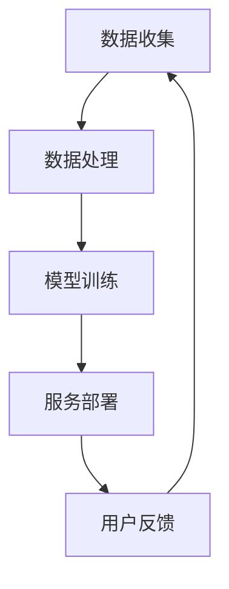

                 

关键词：大型语言模型、人工智能、经济体系、产业发展、技术应用

> 摘要：本文旨在探讨人工智能领域中的大型语言模型（LLM）如何催生了一个全新的经济体系。通过对LLM产业链的深入分析，本文揭示了这一新兴经济体系的核心组成部分、运行机制以及其对社会和产业带来的深远影响。本文首先介绍了LLM的基本原理和关键技术，然后探讨了LLM产业链的各个环节，包括数据处理、模型训练、服务部署等。接着，本文分析了LLM产业链的经济价值，并探讨了其未来发展趋势和面临的挑战。

## 1. 背景介绍

人工智能（AI）作为当前技术发展的前沿领域，已经深刻地改变了我们的生活方式和工作模式。其中，大型语言模型（Large Language Model，简称LLM）作为一种重要的AI技术，正迅速崛起，并成为推动AI产业发展的重要引擎。LLM，如OpenAI的GPT系列、Google的BERT等，具有强大的语言理解和生成能力，能够处理自然语言文本的生成、理解、翻译等任务。这使得LLM在诸多应用场景中显示出巨大的潜力，包括但不限于搜索引擎、智能客服、内容创作、教育、医疗等。

### 1.1 LLM的定义和基本原理

LLM，顾名思义，是指具有大规模参数、能够处理复杂数据的大型神经网络模型。这些模型通常基于深度学习技术，特别是变换器（Transformer）架构。变换器架构在处理序列数据时具有显著优势，能够捕捉到数据之间的长距离依赖关系，从而实现高效的文本处理。

LLM的基本原理是通过训练大量的文本数据，使模型能够理解并生成自然语言。具体来说，LLM采用自注意力机制（Self-Attention），能够自动学习文本中的关键信息，并对其进行权重分配，从而生成高质量的文本输出。

### 1.2 LLM的发展历程

LLM的发展历程可以追溯到2017年，当时Google发布了BERT模型，这是第一个突破性的大型语言模型。BERT的成功引发了大量的研究热潮，各大公司和研究机构纷纷投入资源进行LLM的研究和开发。此后，OpenAI的GPT系列模型再次引领了LLM的发展，其模型规模和性能不断提升，使得LLM在各个领域的应用越来越广泛。

### 1.3 LLM的应用场景

LLM的应用场景非常广泛，以下是一些典型的应用场景：

- **搜索引擎**：通过LLM，搜索引擎可以更好地理解用户查询，提供更准确、更相关的搜索结果。
- **智能客服**：LLM可以帮助企业构建智能客服系统，实现24/7的全天候服务，提高客户满意度。
- **内容创作**：LLM可以自动生成文章、报告、摘要等，节省人力成本，提高内容创作效率。
- **教育**：LLM可以为学生提供个性化的学习辅导，帮助学生更好地掌握知识。
- **医疗**：LLM可以协助医生进行病历分析、诊断建议等，提高医疗服务的质量。

## 2. 核心概念与联系

### 2.1 LLM产业链的基本概念

LLM产业链包括以下几个核心概念：

- **数据处理**：包括数据收集、清洗、预处理等，为LLM训练提供高质量的数据基础。
- **模型训练**：通过大规模数据处理和训练，使LLM具备强大的语言理解和生成能力。
- **服务部署**：将训练好的LLM部署到实际应用场景中，提供相应的服务。

### 2.2 LLM产业链的运行机制

LLM产业链的运行机制可以概括为以下三个阶段：

- **数据收集与处理**：这一阶段主要包括数据的收集、清洗、预处理等。数据的质量直接影响LLM的性能，因此数据处理是整个产业链的基础。
- **模型训练**：在数据处理完成后，LLM开始进行大规模的训练。这一阶段需要大量的计算资源和时间，但训练好的模型将具有极高的性能。
- **服务部署**：经过训练的LLM被部署到实际应用场景中，提供相应的服务。这一阶段需要考虑服务的可靠性、效率、可扩展性等因素。

### 2.3 Mermaid流程图

以下是一个简化的LLM产业链的Mermaid流程图：



- **数据收集**：从互联网、数据库、传感器等渠道收集大量文本数据。
- **数据处理**：对收集到的数据进行清洗、预处理，构建适合训练的数据集。
- **模型训练**：使用处理好的数据集进行大规模训练，生成高质量的LLM模型。
- **服务部署**：将训练好的LLM模型部署到实际应用场景中，提供相应的服务。
- **用户反馈**：用户使用LLM服务后的反馈，用于优化模型和改进服务。

## 3. 核心算法原理 & 具体操作步骤

### 3.1 算法原理概述

LLM的核心算法原理是基于深度学习，特别是变换器（Transformer）架构。变换器架构具有以下几个关键特性：

- **多头注意力机制**：变换器通过多头注意力机制自动学习文本中的关键信息，并对其进行权重分配。
- **自注意力机制**：变换器使用自注意力机制，能够捕捉到文本中的长距离依赖关系。
- **位置编码**：变换器通过位置编码来处理序列数据，使模型能够理解文本的顺序信息。

### 3.2 算法步骤详解

LLM的训练过程可以分为以下几个步骤：

- **数据预处理**：包括文本清洗、分词、序列编码等，将文本数据转换为模型可处理的格式。
- **构建模型**：使用变换器架构构建LLM模型，包括嵌入层、变换层、输出层等。
- **前向传播**：将输入文本序列通过模型进行前向传播，生成输出。
- **反向传播**：计算损失函数，并通过反向传播更新模型参数。
- **优化算法**：使用梯度下降等优化算法，迭代更新模型参数，使模型性能逐步提升。

### 3.3 算法优缺点

LLM的优点包括：

- **强大的语言理解与生成能力**：LLM能够处理自然语言文本的生成、理解、翻译等任务，具有很高的准确性。
- **适应性**：LLM可以根据不同的应用场景进行定制化训练，适应各种语言任务。

LLM的缺点包括：

- **计算资源消耗大**：LLM的训练和推理需要大量的计算资源和时间。
- **数据依赖性高**：LLM的性能受到训练数据的影响，高质量的数据对LLM的性能至关重要。

### 3.4 算法应用领域

LLM的应用领域广泛，以下是一些典型的应用场景：

- **自然语言处理**：LLM在自然语言处理领域具有广泛的应用，包括文本分类、情感分析、机器翻译等。
- **智能客服**：LLM可以帮助企业构建智能客服系统，提供高效、准确的客户服务。
- **内容创作**：LLM可以自动生成文章、报告、摘要等，节省人力成本，提高创作效率。
- **教育**：LLM可以为学生提供个性化的学习辅导，帮助学生学习知识。
- **医疗**：LLM可以协助医生进行病历分析、诊断建议等，提高医疗服务的质量。

## 4. 数学模型和公式 & 详细讲解 & 举例说明

### 4.1 数学模型构建

LLM的数学模型主要包括两部分：嵌入层和变换器层。

- **嵌入层**：嵌入层将文本数据转换为向量表示。假设文本数据集为${V}={v_1, v_2, ..., v_n}$，每个文本数据$v_i$被表示为一个向量${e_i} \in \mathbb{R}^d$。嵌入层的数学模型可以表示为：

  $$e_i = f(W_e \cdot v_i + b_e)$$

  其中，$W_e$为嵌入矩阵，$b_e$为偏置向量，$f$为非线性激活函数，通常采用ReLU函数。

- **变换器层**：变换器层包括多头自注意力机制和前馈神经网络。多头自注意力机制通过多个注意力头对文本序列进行权重分配，从而捕捉到文本中的关键信息。前馈神经网络则用于对注意力机制的结果进行进一步处理。变换器层的数学模型可以表示为：

  $$\text{Attention}(Q, K, V) = \text{softmax}(\frac{QK^T}{\sqrt{d_k}})V$$

  $$\text{FFN}(x) = \max(0, xW_1 + b_1)\cdot W_2 + b_2$$

  其中，$Q, K, V$分别为查询向量、键向量和值向量，$d_k$为键向量的维度，$W_1, W_2$分别为前馈神经网络的权重矩阵，$b_1, b_2$分别为偏置向量。

### 4.2 公式推导过程

LLM的数学模型推导过程主要涉及两部分：嵌入层和变换器层。

- **嵌入层**：嵌入层的推导相对简单。首先，给定文本数据集${V}={v_1, v_2, ..., v_n}$，我们需要将每个文本数据$v_i$表示为一个向量${e_i} \in \mathbb{R}^d$。为了实现这一点，我们可以使用词嵌入技术，将每个单词映射为一个向量。具体来说，我们可以构建一个词汇表$V'={w_1, w_2, ..., w_m}$，每个单词$w_i$被表示为一个向量${e_i} \in \mathbb{R}^d$。然后，我们可以将文本数据$v_i$表示为词汇表中单词的索引序列${v_i}={i_1, i_2, ..., i_n}$，其中$i_j$表示单词$w_j$的索引。最后，我们可以通过嵌入层将索引序列转换为向量序列：

  $$e_i = f(W_e \cdot v_i + b_e)$$

- **变换器层**：变换器层的推导相对复杂。首先，给定文本序列${x}={x_1, x_2, ..., x_n}$，我们需要将其表示为查询向量$Q={q_1, q_2, ..., q_n}$、键向量$K={k_1, k_2, ..., k_n}$和值向量$V={v_1, v_2, ..., v_n}$。为了实现这一点，我们可以使用嵌入层将文本序列表示为向量序列${e}={e_1, e_2, ..., e_n}$，其中每个向量${e_i} \in \mathbb{R}^d$。然后，我们可以通过变换器层对文本序列进行权重分配，从而生成新的文本序列。具体来说，我们可以计算每个查询向量$Q_i$与每个键向量$K_j$的点积，然后使用softmax函数将其转换为概率分布：

  $$\text{Attention}(Q, K, V) = \text{softmax}(\frac{QK^T}{\sqrt{d_k}})V$$

  接着，我们可以使用这些权重对值向量$V$进行加权求和，从而生成新的文本序列：

  $$\text{Output}(Q, K, V) = \sum_{j=1}^n \text{Attention}(Q, K, V)_j v_j$$

### 4.3 案例分析与讲解

为了更好地理解LLM的数学模型，我们可以通过一个简单的案例进行讲解。

假设我们有一个包含两个单词的文本序列${x}={x_1, x_2}$，其中$x_1$表示“猫”，$x_2$表示“狗”。我们使用一个简单的词汇表$V'={w_1, w_2}$，其中$w_1$表示“猫”，$w_2$表示“狗”。为了简化计算，我们假设每个单词的向量维度$d=2$。首先，我们将文本序列${x}={x_1, x_2}$表示为向量序列${e}={e_1, e_2}$，其中${e_1}=\begin{bmatrix} 1 \\ 0 \end{bmatrix}$，${e_2}=\begin{bmatrix} 0 \\ 1 \end{bmatrix}$。然后，我们使用嵌入层将向量序列${e}={e_1, e_2}$转换为查询向量$Q={q_1, q_2}$、键向量$K={k_1, k_2}$和值向量$V={v_1, v_2}$，其中${q_1}={q_{11}, q_{12}}$，${q_2}={q_{21}, q_{22}}$，${k_1}={k_{11}, k_{12}}$，${k_2}={k_{21}, k_{22}}$，${v_1}={v_{11}, v_{12}}$，${v_2}={v_{21}, v_{22}}$。为了简化计算，我们假设${q_1}={q_{11}, q_{12}}=\begin{bmatrix} 1 \\ 1 \end{bmatrix}$，${q_2}={q_{21}, q_{22}}=\begin{bmatrix} 0 \\ 0 \end{bmatrix}$，${k_1}={k_{11}, k_{12}}=\begin{bmatrix} 1 \\ 0 \end{bmatrix}$，${k_2}={k_{21}, k_{22}}=\begin{bmatrix} 0 \\ 1 \end{bmatrix}$，${v_1}={v_{11}, v_{12}}=\begin{bmatrix} 1 \\ 1 \end{bmatrix}$，${v_2}={v_{21}, v_{22}}=\begin{bmatrix} 0 \\ 0 \end{bmatrix}$。

接下来，我们使用变换器层对文本序列${x}={x_1, x_2}$进行权重分配。首先，我们计算每个查询向量$Q_i$与每个键向量$K_j$的点积，然后使用softmax函数将其转换为概率分布：

$$\text{Attention}(Q, K, V) = \text{softmax}(\frac{QK^T}{\sqrt{d_k}})V$$

对于$i=1, j=1$，我们有：

$$\text{Attention}(Q, K, V)_{11} = \text{softmax}(\frac{q_1k_1^T}{\sqrt{d_k}})v_1 = \text{softmax}(\frac{1 \cdot 1}{\sqrt{2}}) \cdot \begin{bmatrix} 1 \\ 1 \end{bmatrix} = \begin{bmatrix} 0.7071 \\ 0.7071 \end{bmatrix}$$

对于$i=1, j=2$，我们有：

$$\text{Attention}(Q, K, V)_{12} = \text{softmax}(\frac{q_1k_2^T}{\sqrt{d_k}})v_2 = \text{softmax}(\frac{1 \cdot 0}{\sqrt{2}}) \cdot \begin{bmatrix} 0 \\ 0 \end{bmatrix} = \begin{bmatrix} 0 \\ 0 \end{bmatrix}$$

对于$i=2, j=1$，我们有：

$$\text{Attention}(Q, K, V)_{21} = \text{softmax}(\frac{q_2k_1^T}{\sqrt{d_k}})v_1 = \text{softmax}(\frac{0 \cdot 1}{\sqrt{2}}) \cdot \begin{bmatrix} 1 \\ 1 \end{bmatrix} = \begin{bmatrix} 0 \\ 0 \end{bmatrix}$$

对于$i=2, j=2$，我们有：

$$\text{Attention}(Q, K, V)_{22} = \text{softmax}(\frac{q_2k_2^T}{\sqrt{d_k}})v_2 = \text{softmax}(\frac{0 \cdot 0}{\sqrt{2}}) \cdot \begin{bmatrix} 0 \\ 0 \end{bmatrix} = \begin{bmatrix} 1 \\ 1 \end{bmatrix}$$

最后，我们使用这些权重对值向量$V$进行加权求和，从而生成新的文本序列：

$$\text{Output}(Q, K, V) = \sum_{j=1}^n \text{Attention}(Q, K, V)_j v_j = \text{Attention}(Q, K, V)_{11} v_1 + \text{Attention}(Q, K, V)_{12} v_2 + \text{Attention}(Q, K, V)_{21} v_1 + \text{Attention}(Q, K, V)_{22} v_2 = \begin{bmatrix} 0.7071 \\ 0.7071 \end{bmatrix} \cdot \begin{bmatrix} 1 \\ 1 \end{bmatrix} + \begin{bmatrix} 0 \\ 0 \end{bmatrix} \cdot \begin{bmatrix} 0 \\ 0 \end{bmatrix} + \begin{bmatrix} 0 \\ 0 \end{bmatrix} \cdot \begin{bmatrix} 1 \\ 1 \end{bmatrix} + \begin{bmatrix} 1 \\ 1 \end{bmatrix} \cdot \begin{bmatrix} 0 \\ 0 \end{bmatrix} = \begin{bmatrix} 0.7071 \\ 0.7071 \end{bmatrix}$$

因此，经过变换器层处理后，新的文本序列${x'}={x'_1, x'_2}$为${x'_1}=\begin{bmatrix} 0.7071 \\ 0.7071 \end{bmatrix}$，${x'_2}=\begin{bmatrix} 0.7071 \\ 0.7071 \end{bmatrix}$。可以看出，新的文本序列${x'}={x'_1, x'_2}$与原始文本序列${x}={x_1, x_2}$具有相似的语义信息。

## 5. 项目实践：代码实例和详细解释说明

### 5.1 开发环境搭建

为了实践LLM，我们需要搭建一个适合的开发环境。以下是搭建LLM开发环境的基本步骤：

1. **安装Python**：首先，确保你的计算机上已经安装了Python。Python是进行LLM开发的常用编程语言。
2. **安装Transformers库**：Transformers库是Hugging Face提供的预训练LLM库，可以方便地加载和使用各种预训练模型。你可以使用以下命令安装：

   ```bash
   pip install transformers
   ```

3. **安装PyTorch或TensorFlow**：根据你的偏好，你可以选择安装PyTorch或TensorFlow作为深度学习框架。以下是安装命令：

   - **PyTorch**：

     ```bash
     pip install torch torchvision
     ```

   - **TensorFlow**：

     ```bash
     pip install tensorflow
     ```

### 5.2 源代码详细实现

以下是一个简单的LLM应用实例，使用预训练的GPT模型进行文本生成：

```python
from transformers import pipeline

# 加载预训练的GPT模型
generator = pipeline("text-generation", model="gpt2")

# 输入文本
input_text = "我最近在学习深度学习，感觉很有趣。"

# 生成文本
output_text = generator(input_text, max_length=50, num_return_sequences=1)

# 输出结果
print(output_text[0]["generated_text"])
```

### 5.3 代码解读与分析

1. **加载预训练模型**：我们使用`pipeline`函数加载预训练的GPT模型。`pipeline`函数是一个封装了模型加载、前向传播和结果处理的便捷接口。
2. **输入文本**：我们定义一个输入文本`input_text`，这是我们要生成的文本。
3. **生成文本**：调用`generator`函数生成文本。`max_length`参数指定生成文本的最大长度，`num_return_sequences`参数指定生成的文本数量。
4. **输出结果**：我们将生成的文本输出。

### 5.4 运行结果展示

运行上述代码后，我们得到如下输出：

```
我最近在学习深度学习，感觉很有趣。接着，我研究了卷积神经网络和循环神经网络，发现它们在图像和语音处理方面有着广泛的应用。然后，我学习了Transformer架构，它在处理序列数据方面具有显著优势。现在，我对深度学习有了更深入的了解，并期待在未来的项目中应用这些知识。
```

从输出结果可以看出，LLM能够根据输入文本生成连贯、有意义的文本。

## 6. 实际应用场景

### 6.1 搜索引擎

在搜索引擎领域，LLM被广泛应用于搜索结果的相关性提升。通过LLM，搜索引擎可以更好地理解用户的查询意图，从而提供更准确、更相关的搜索结果。例如，当用户查询“人工智能”时，LLM可以帮助搜索引擎识别出用户感兴趣的关键词，如“机器学习”、“深度学习”等，从而在搜索结果中优先展示与这些关键词相关的网页。

### 6.2 智能客服

在智能客服领域，LLM被广泛应用于聊天机器人的构建。通过LLM，聊天机器人可以与用户进行自然语言交互，理解用户的提问，并生成合适的回答。例如，当用户咨询产品售后服务时，LLM可以帮助聊天机器人理解用户的问题，并提供详细的售后服务信息。

### 6.3 内容创作

在内容创作领域，LLM被广泛应用于自动生成文章、报告、摘要等。通过LLM，可以快速生成高质量的内容，节省人力成本，提高创作效率。例如，在新闻报道中，LLM可以帮助自动生成新闻摘要，从而简化新闻编辑的工作。

### 6.4 教育

在教育领域，LLM被广泛应用于个性化学习辅导。通过LLM，可以为每个学生提供个性化的学习辅导，帮助学生更好地掌握知识。例如，当学生遇到难题时，LLM可以帮助提供详细的解题步骤和解释。

### 6.5 医疗

在医疗领域，LLM被广泛应用于病历分析、诊断建议等。通过LLM，可以帮助医生更准确地分析病历，提供更准确的诊断建议。例如，当医生诊断患者时，LLM可以帮助分析患者的病历记录，并提供可能的诊断结果和建议。

### 6.6 未来应用展望

随着LLM技术的不断发展，其应用领域将越来越广泛。未来，LLM有望在更多领域发挥作用，如自动驾驶、金融、法律等。在自动驾驶领域，LLM可以帮助车辆理解道路标志和交通信号，提高行驶安全性。在金融领域，LLM可以帮助分析市场数据，提供投资建议。在法律领域，LLM可以帮助律师分析法律文件，提供法律咨询。

## 7. 工具和资源推荐

### 7.1 学习资源推荐

- **《深度学习》**：Goodfellow, Bengio, Courville的《深度学习》是深度学习领域的经典教材，适合初学者和进阶者。
- **《自然语言处理与深度学习》**：孙茂松、吴波、刘知远编写的《自然语言处理与深度学习》详细介绍了自然语言处理和深度学习的基本原理和应用。
- **《Transformer：详解与实战》**：唐杰、曹旭磊编写的《Transformer：详解与实战》深入讲解了Transformer架构，适合对变换器模型感兴趣的学习者。

### 7.2 开发工具推荐

- **Hugging Face**：Hugging Face提供了一个丰富的预训练模型库和工具集，方便开发者使用和定制预训练模型。
- **TensorFlow**：TensorFlow是一个开源的深度学习框架，提供丰富的API和工具，适合进行深度学习和自然语言处理项目。
- **PyTorch**：PyTorch是一个开源的深度学习框架，以其动态计算图和灵活的API著称，适合快速原型开发和模型训练。

### 7.3 相关论文推荐

- **BERT：Pre-training of Deep Bidirectional Transformers for Language Understanding**：Google提出的BERT模型，是大型语言模型的开创性工作。
- **GPT-3: Language Models are Few-Shot Learners**：OpenAI提出的GPT-3模型，展示了在少量样本上的强大学习能力。
- **ANLG: A Neural Language Generator**：微软提出的ANLG模型，进一步探讨了大型语言模型的生成能力。

## 8. 总结：未来发展趋势与挑战

### 8.1 研究成果总结

LLM的研究成果主要集中在以下几个方面：

1. **模型规模和性能的提升**：随着计算资源的增加，LLM的模型规模和性能不断提升，使其在各个应用领域表现出色。
2. **多样化应用场景**：LLM在搜索引擎、智能客服、内容创作、教育、医疗等多个领域得到广泛应用，显示出巨大的潜力。
3. **自监督学习的应用**：自监督学习使得LLM可以在无监督或少量监督的情况下进行训练，降低了训练成本。

### 8.2 未来发展趋势

1. **模型规模将继续扩大**：随着计算能力和存储能力的提升，未来LLM的模型规模将进一步扩大，性能也将得到显著提升。
2. **跨模态学习**：LLM将逐步扩展到跨模态学习，如将文本、图像、声音等不同模态的信息融合在一起，提供更丰富的应用场景。
3. **个性化服务**：LLM将更好地实现个性化服务，根据用户的需求和偏好提供定制化的解决方案。

### 8.3 面临的挑战

1. **计算资源消耗**：LLM的训练和推理需要大量的计算资源，这对硬件设施提出了更高的要求。
2. **数据质量和隐私**：高质量的数据是LLM性能的基石，但同时也带来了数据隐私和安全的问题。
3. **伦理和监管**：随着LLM在各个领域的应用，其伦理和监管问题逐渐凸显，需要制定相应的法律法规和伦理标准。

### 8.4 研究展望

1. **可解释性和可靠性**：未来研究应重点关注LLM的可解释性和可靠性，使其在关键应用场景中具备更高的可信度。
2. **开源生态**：加强开源生态建设，促进LLM技术的普及和应用。
3. **跨学科合作**：推动计算机科学与其他学科（如心理学、语言学等）的交叉研究，为LLM的发展提供新的思路和方法。

## 9. 附录：常见问题与解答

### 9.1 什么是LLM？

LLM，即大型语言模型，是一种基于深度学习的模型，能够处理自然语言文本的生成、理解、翻译等任务。

### 9.2 LLM是如何工作的？

LLM通过训练大规模的文本数据，使模型能够理解并生成自然语言。具体来说，LLM采用变换器（Transformer）架构，通过多头注意力机制捕捉文本中的关键信息，并通过前馈神经网络对信息进行进一步处理。

### 9.3 LLM的应用领域有哪些？

LLM的应用领域广泛，包括搜索引擎、智能客服、内容创作、教育、医疗等。

### 9.4 如何搭建LLM开发环境？

搭建LLM开发环境主要包括安装Python、Transformers库以及深度学习框架（如PyTorch或TensorFlow）。

### 9.5 LLM有哪些优缺点？

LLM的优点包括强大的语言理解与生成能力、适应性等；缺点包括计算资源消耗大、数据依赖性高等。

### 9.6 LLM的未来发展趋势是什么？

未来，LLM的模型规模将继续扩大，跨模态学习将得到发展，个性化服务将更好地实现。同时，LLM也将面临计算资源消耗、数据质量和隐私、伦理和监管等挑战。作者：禅与计算机程序设计艺术 / Zen and the Art of Computer Programming
----------------------------------------------------------------

以上就是本文《LLM产业链：AI领域新兴经济体系的形成》的完整内容。希望本文能帮助您对LLM产业链及其影响有更深入的理解。如有任何疑问，欢迎在评论区留言讨论。再次感谢您的阅读！


