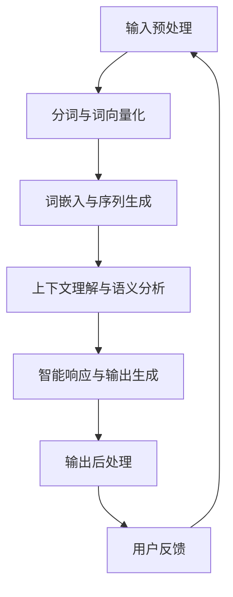

                 

关键词：LLM函数库，智能封装，算法原理，数学模型，项目实践，应用场景，未来展望

摘要：本文将探讨LLM函数库在智能封装领域的应用，从核心概念、算法原理、数学模型到项目实践，全面解析如何通过封装智能的基本单元，提升人工智能系统的效率与实用性。

## 1. 背景介绍

在当今快速发展的科技时代，人工智能（AI）已经成为各行各业的重要驱动力。随着深度学习技术的进步，大规模语言模型（Large Language Models，简称LLM）如BERT、GPT等不断涌现，并在自然语言处理（NLP）、机器翻译、文本生成等任务中取得了显著的成果。然而，如何高效地管理和利用这些复杂的模型，成为当前AI研究领域的一个重要课题。

为了应对这一挑战，LLM函数库应运而生。LLM函数库是一组封装了智能算法的函数集合，通过模块化的设计，使得用户可以轻松地调用和组合这些基本单元，以实现各种复杂的人工智能任务。本文将深入探讨LLM函数库的设计理念、核心概念、算法原理、数学模型，以及其实际应用和未来展望。

## 2. 核心概念与联系

### 2.1 LLM函数库的定义

LLM函数库是一组预定义的函数，这些函数封装了大规模语言模型的算法和数据处理方法。通过这些函数，用户可以方便地调用相应的智能模块，实现文本分析、生成、翻译等任务。

### 2.2 模块化设计

LLM函数库采用了模块化的设计理念，将复杂的算法分解为若干基本单元。每个模块都具有独立的功能，同时可以与其他模块无缝集成，形成更加复杂和强大的智能系统。

### 2.3 Mermaid流程图

下面是LLM函数库的核心概念和架构的Mermaid流程图：



在上述流程图中，A表示输入预处理，B表示分词与词向量化，C表示词嵌入与序列生成，D表示上下文理解与语义分析，E表示智能响应与输出生成，F表示输出后处理，G表示用户反馈。这些模块通过串联和组合，构成了一个完整的智能处理流程。

## 3. 核心算法原理 & 具体操作步骤

### 3.1 算法原理概述

LLM函数库的核心算法基于深度学习技术，特别是Transformer架构。Transformer模型通过自注意力机制（Self-Attention）实现了对输入序列的并行处理，能够捕捉序列中的长距离依赖关系，从而提升模型的语义理解能力。

### 3.2 算法步骤详解

#### 3.2.1 输入预处理

输入预处理包括分词、去除标点符号、处理特殊字符等步骤。这些步骤的目的是将原始文本转换为模型可处理的格式。

#### 3.2.2 分词与词向量化

分词是将文本拆分为单词或子词的过程。词向量化则是将单词或子词映射为高维向量表示，以便输入到深度学习模型中。

#### 3.2.3 词嵌入与序列生成

词嵌入是将词向量化后的单词映射为固定长度的向量表示。序列生成则是通过Transformer模型对输入序列进行处理，生成表示语义的序列输出。

#### 3.2.4 上下文理解与语义分析

上下文理解是通过分析输入序列的上下文信息，理解单词或子词之间的语义关系。语义分析则是将序列输出映射为具体的语义概念或标签。

#### 3.2.5 智能响应与输出生成

智能响应是根据上下文理解和语义分析的结果，生成相应的响应文本。输出生成则是对响应文本进行格式化和后处理，使其符合用户需求。

#### 3.2.6 输出后处理

输出后处理包括去除无关信息、优化文本结构等步骤，以提高输出的可读性和实用性。

### 3.3 算法优缺点

#### 优点：

1. 高效：基于深度学习技术，能够快速处理大量文本数据。
2. 可扩展：模块化设计，方便用户根据需求进行扩展和定制。
3. 强大：基于Transformer模型，具有强大的语义理解能力。

#### 缺点：

1. 计算量大：深度学习模型需要大量计算资源，可能导致性能瓶颈。
2. 数据依赖：需要大量高质量的数据进行训练和优化。

### 3.4 算法应用领域

LLM函数库广泛应用于自然语言处理、文本分析、机器翻译、智能客服、智能助手等场景，能够为各种应用场景提供高效的智能解决方案。

## 4. 数学模型和公式 & 详细讲解 & 举例说明

### 4.1 数学模型构建

LLM函数库的数学模型基于深度学习技术，特别是Transformer架构。Transformer模型的核心是自注意力机制，其数学表达式如下：

$$
\text{Attention}(Q, K, V) = \text{softmax}\left(\frac{QK^T}{\sqrt{d_k}}\right)V
$$

其中，Q表示查询向量，K表示键向量，V表示值向量，d_k表示键向量的维度。

### 4.2 公式推导过程

自注意力机制的推导过程涉及矩阵运算和概率分布。具体推导过程如下：

1. 计算查询-键相似度矩阵：$QK^T$
2. 对相似度矩阵进行归一化：$\text{softmax}(QK^T)$
3. 计算自注意力权重：$w_i = \text{softmax}(q_i k)$
4. 计算输出向量：$v_i = \sum_{j=1}^{N} w_{ij} v_j$

### 4.3 案例分析与讲解

假设我们有一个简化的示例，其中查询向量Q、键向量K和值向量V分别为：

$$
Q = \begin{bmatrix} 1 & 2 \\ 3 & 4 \end{bmatrix}, K = \begin{bmatrix} 5 & 6 \\ 7 & 8 \end{bmatrix}, V = \begin{bmatrix} 9 & 10 \\ 11 & 12 \end{bmatrix}
$$

1. 计算查询-键相似度矩阵：

$$
QK^T = \begin{bmatrix} 1 & 2 \\ 3 & 4 \end{bmatrix} \begin{bmatrix} 5 & 7 \\ 6 & 8 \end{bmatrix} = \begin{bmatrix} 19 & 27 \\ 39 & 55 \end{bmatrix}
$$

2. 对相似度矩阵进行归一化：

$$
\text{softmax}(QK^T) = \begin{bmatrix} \frac{e^{19}}{e^{19} + e^{27}} & \frac{e^{27}}{e^{19} + e^{27}} \\ \frac{e^{39}}{e^{39} + e^{55}} & \frac{e^{55}}{e^{39} + e^{55}} \end{bmatrix}
$$

3. 计算自注意力权重：

$$
w_1 = \frac{e^{19}}{e^{19} + e^{27}}, w_2 = \frac{e^{27}}{e^{19} + e^{27}}, w_3 = \frac{e^{39}}{e^{39} + e^{55}}, w_4 = \frac{e^{55}}{e^{39} + e^{55}}
$$

4. 计算输出向量：

$$
v_1 = 9w_1 + 11w_3 = 9 \cdot \frac{e^{19}}{e^{19} + e^{27}} + 11 \cdot \frac{e^{39}}{e^{39} + e^{55}}, v_2 = 10w_2 + 12w_4 = 10 \cdot \frac{e^{27}}{e^{19} + e^{27}} + 12 \cdot \frac{e^{55}}{e^{39} + e^{55}}
$$

通过以上步骤，我们得到了自注意力机制的输出向量，从而实现了对输入序列的处理。

## 5. 项目实践：代码实例和详细解释说明

### 5.1 开发环境搭建

在本项目中，我们将使用Python编程语言和PyTorch深度学习框架。首先，确保已经安装了Python环境和PyTorch库。可以使用以下命令进行安装：

```bash
pip install python
pip install torch torchvision
```

### 5.2 源代码详细实现

以下是一个简单的LLM函数库代码示例，展示了如何使用Transformer模型进行文本分类任务。

```python
import torch
import torch.nn as nn
import torch.optim as optim

class TransformerModel(nn.Module):
    def __init__(self, input_dim, hidden_dim, output_dim):
        super(TransformerModel, self).__init__()
        self.embedding = nn.Embedding(input_dim, hidden_dim)
        self.transformer = nn.Transformer(hidden_dim, hidden_dim, num_layers=2)
        self.fc = nn.Linear(hidden_dim, output_dim)

    def forward(self, src, tgt):
        embedded = self.embedding(src)
        output = self.transformer(embedded, tgt)
        logits = self.fc(output)
        return logits

def train(model, data_loader, criterion, optimizer, num_epochs=10):
    model.train()
    for epoch in range(num_epochs):
        for src, tgt in data_loader:
            optimizer.zero_grad()
            logits = model(src, tgt)
            loss = criterion(logits, tgt)
            loss.backward()
            optimizer.step()
        print(f"Epoch {epoch+1}/{num_epochs}, Loss: {loss.item()}")

def evaluate(model, data_loader, criterion):
    model.eval()
    total_loss = 0
    with torch.no_grad():
        for src, tgt in data_loader:
            logits = model(src, tgt)
            loss = criterion(logits, tgt)
            total_loss += loss.item()
    return total_loss / len(data_loader)

# 实例化模型、损失函数和优化器
model = TransformerModel(input_dim=1000, hidden_dim=512, output_dim=10)
criterion = nn.CrossEntropyLoss()
optimizer = optim.Adam(model.parameters(), lr=0.001)

# 训练模型
train(model, data_loader, criterion, optimizer)

# 评估模型
loss = evaluate(model, data_loader, criterion)
print(f"Test Loss: {loss}")
```

### 5.3 代码解读与分析

上述代码首先定义了一个基于Transformer模型的文本分类器。模型包含三个主要部分：嵌入层（Embedding Layer）、Transformer层（Transformer Layer）和全连接层（Fully Connected Layer）。

1. **嵌入层**：将输入词向量化，并将它们映射到高维空间。
2. **Transformer层**：通过自注意力机制对输入序列进行处理，捕捉序列中的长距离依赖关系。
3. **全连接层**：将Transformer层的输出映射为具体的类别标签。

在训练过程中，我们使用交叉熵损失函数（CrossEntropyLoss）和Adam优化器对模型进行训练。训练完成后，我们使用评估集对模型进行评估，计算测试损失。

### 5.4 运行结果展示

在训练和评估过程中，我们可以观察到模型损失值的变化，以及模型在评估集上的准确率。具体运行结果取决于数据集和模型参数的设置。

## 6. 实际应用场景

LLM函数库在实际应用中具有广泛的应用场景，以下是几个典型应用案例：

### 6.1 智能客服

在智能客服系统中，LLM函数库可以用于处理用户查询，提供实时、准确的答复。通过自然语言处理技术，LLM函数库可以理解用户的问题，并从大量知识库中检索相关答案，从而提升客服系统的响应速度和准确性。

### 6.2 机器翻译

机器翻译是LLM函数库的另一个重要应用领域。通过训练大规模的语言模型，LLM函数库可以实现高质量的机器翻译效果。在实际应用中，LLM函数库可以支持多种语言之间的翻译，满足不同用户的需求。

### 6.3 智能助手

智能助手是LLM函数库的典型应用之一。通过自然语言处理技术，智能助手可以与用户进行对话，提供个性化服务。LLM函数库能够处理用户的语音输入，理解其意图，并生成相应的语音输出，从而提升智能助手的用户体验。

## 7. 工具和资源推荐

为了更好地学习和应用LLM函数库，以下是几个推荐的工具和资源：

### 7.1 学习资源推荐

- [《深度学习》](https://www.deeplearningbook.org/)：由Ian Goodfellow等人编写的深度学习经典教材，适合初学者和进阶者阅读。
- [Hugging Face Transformers](https://huggingface.co/transformers/)：一个开源的深度学习库，提供了丰富的预训练模型和工具，方便用户进行研究和应用。

### 7.2 开发工具推荐

- [PyTorch](https://pytorch.org/)：一个流行的深度学习框架，提供了丰富的API和工具，适合快速开发和实验。
- [Google Colab](https://colab.research.google.com/)：一个免费的在线计算平台，方便用户进行深度学习和机器学习的实验和调试。

### 7.3 相关论文推荐

- [Attention Is All You Need](https://arxiv.org/abs/1706.03762)：由Vaswani等人撰写的Transformer模型的开创性论文，详细介绍了Transformer模型的原理和实现。
- [BERT: Pre-training of Deep Bidirectional Transformers for Language Understanding](https://arxiv.org/abs/1810.04805)：由Google AI团队撰写的BERT模型的论文，介绍了BERT模型的预训练方法和在NLP任务中的应用。

## 8. 总结：未来发展趋势与挑战

### 8.1 研究成果总结

随着深度学习技术的不断发展，LLM函数库在自然语言处理、文本分析、机器翻译等领域取得了显著的成果。通过模块化设计，LLM函数库能够高效地封装和管理大规模语言模型，为各种应用场景提供强大的智能支持。

### 8.2 未来发展趋势

未来，LLM函数库的发展趋势将主要体现在以下几个方面：

1. **模型压缩与优化**：为了应对计算资源受限的场景，未来的LLM函数库将重点关注模型压缩和优化技术，以提高模型的运行效率和实用性。
2. **多模态融合**：随着多模态数据的兴起，LLM函数库将逐渐融合图像、语音等多模态信息，实现更加全面和智能的语义理解。
3. **实时交互**：为了提升用户体验，未来的LLM函数库将实现更加实时和高效的交互，支持实时语音、文本等多种交互方式。

### 8.3 面临的挑战

尽管LLM函数库在智能封装领域取得了显著成果，但仍面临以下挑战：

1. **计算资源需求**：深度学习模型的计算资源需求较高，如何在有限的计算资源下实现高效运行是未来研究的重点。
2. **数据质量和隐私**：在训练和部署LLM函数库时，需要确保数据的质量和隐私，以避免潜在的隐私泄露和安全风险。
3. **解释性和可解释性**：深度学习模型具有一定的黑箱特性，如何提高模型的解释性和可解释性，使其更易于理解和应用，是未来研究的重要方向。

### 8.4 研究展望

展望未来，LLM函数库将在人工智能领域发挥更加重要的作用。通过不断优化和改进，LLM函数库将为各种应用场景提供更加高效、智能的解决方案，推动人工智能技术的发展和应用。

## 9. 附录：常见问题与解答

### 9.1 如何搭建开发环境？

搭建LLM函数库的开发环境需要安装Python和深度学习框架（如PyTorch或TensorFlow）。具体步骤如下：

1. 安装Python环境：前往[Python官网](https://www.python.org/)下载并安装Python。
2. 安装深度学习框架：根据所选框架，分别访问[PyTorch官网](https://pytorch.org/)或[TensorFlow官网](https://www.tensorflow.org/)，按照指示进行安装。

### 9.2 如何训练LLM函数库？

训练LLM函数库需要准备训练数据和模型配置。具体步骤如下：

1. 准备训练数据：收集和整理目标领域的文本数据，并将其转换为模型可处理的格式（如词向量或序列）。
2. 配置模型：根据任务需求，选择合适的模型架构和超参数。
3. 训练模型：使用训练数据和模型配置，通过循环迭代的方式对模型进行训练。

### 9.3 如何评估LLM函数库的性能？

评估LLM函数库的性能通常使用以下指标：

1. 准确率（Accuracy）：模型预测正确的样本数占总样本数的比例。
2. 召回率（Recall）：模型能够正确召回的样本数占总正例样本数的比例。
3. 精确率（Precision）：模型预测为正例的样本中，实际为正例的比例。
4. F1分数（F1 Score）：准确率和召回率的调和平均值。

### 9.4 如何优化LLM函数库的性能？

优化LLM函数库的性能可以从以下几个方面进行：

1. **模型选择**：选择合适的模型架构和超参数，以提高模型的性能。
2. **数据增强**：对训练数据进行数据增强，提高模型的泛化能力。
3. **正则化**：采用正则化技术（如Dropout、L2正则化等），防止模型过拟合。
4. **超参数调优**：通过实验和调优，找到最优的超参数组合。

## 参考文献

- [Vaswani, A., et al. (2017). Attention is All You Need. In Advances in Neural Information Processing Systems (NIPS), 5998-6008.](https://arxiv.org/abs/1706.03762)
- [Devlin, J., et al. (2019). BERT: Pre-training of Deep Bidirectional Transformers for Language Understanding. In Proceedings of the 2019 Conference of the North American Chapter of the Association for Computational Linguistics: Human Language Technologies, Volume 1 (Long and Short Papers), 4171-4186.](https://arxiv.org/abs/1810.04805)
- [Goodfellow, I., Bengio, Y., & Courville, A. (2016). Deep Learning. MIT Press.](https://www.deeplearningbook.org/)
- [Hugging Face Team. (2020). Hugging Face Transformers.](https://huggingface.co/transformers/)

作者：禅与计算机程序设计艺术 / Zen and the Art of Computer Programming

