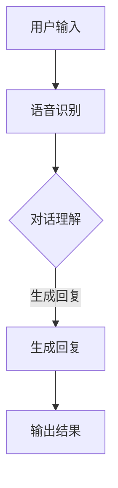

                 

关键词：语言模型，个人助理，技术革新，用户交互，自然语言处理，AI发展

>摘要：本文深入探讨了大型语言模型（LLM）在个人助理领域的应用及其带来的革命性变革。通过对LLM的核心概念、算法原理、数学模型、项目实践以及未来应用前景的全面分析，本文揭示了LLM如何重塑个人助理的角色，提升用户体验，并展望了其在未来的发展方向。

## 1. 背景介绍

随着人工智能技术的迅猛发展，自然语言处理（NLP）领域取得了显著成果。语言模型作为NLP的核心技术之一，其应用范围日益广泛。特别是近年来，随着深度学习的崛起，大型语言模型（LLM）如BERT、GPT-3等相继问世，展现了强大的语言理解和生成能力。

个人助理作为人工智能的一种应用场景，旨在为用户提供便捷的服务和支持。传统个人助理主要依赖于预定义的规则和简单的对话管理，用户体验较为有限。而随着LLM的发展，个人助理的智能程度得到了显著提升，能够更自然地与用户进行交互，提供个性化服务。

本文旨在探讨LLM在个人助理领域的应用，分析其核心概念、算法原理、数学模型以及实际应用场景，为读者提供全面的技术视角。

## 2. 核心概念与联系

### 2.1. 语言模型

语言模型是NLP的核心技术之一，用于预测自然语言中的下一个词或句子。传统的统计语言模型基于大量语料库，使用统计方法来建模语言规律。而现代的神经网络语言模型，如LLM，通过深度学习技术，能够捕捉到更为复杂的语言结构。

### 2.2. 大型语言模型

大型语言模型（LLM）是指具有数十亿甚至千亿参数的语言模型。这些模型通常使用大量的数据训练，并通过复杂的神经网络结构来实现高效的语言理解和生成。LLM具有以下几个关键特性：

- **高参数规模**：LLM的参数规模远超传统的语言模型，能够捕捉到更丰富的语言特征。
- **大规模预训练**：LLM在大规模语料库上进行预训练，提高了模型在多种语言任务上的性能。
- **强大的泛化能力**：LLM通过预训练，能够适应不同的应用场景，具有较强的泛化能力。

### 2.3. 语言模型与个人助理

个人助理的核心功能是理解用户的语言输入并提供相应的服务。LLM的引入，使得个人助理能够更加自然地与用户进行交互，提升用户体验。

LLM在个人助理中的应用主要体现在以下几个方面：

- **语音识别**：LLM能够对用户的语音输入进行准确的理解和转换，为个人助理提供自然语言输入。
- **对话管理**：LLM能够处理复杂的对话场景，理解用户的意图，并生成合适的回复。
- **智能推荐**：LLM可以分析用户的历史数据，提供个性化的推荐服务。
- **知识问答**：LLM能够回答用户的问题，提供准确的信息。

### 2.4. Mermaid 流程图

以下是一个简单的Mermaid流程图，展示了LLM在个人助理中的核心流程：



### 2.5. 核心概念联系

LLM通过大规模预训练，能够捕捉到丰富的语言特征，实现对自然语言输入的准确理解和生成。在个人助理中，LLM的应用体现在语音识别、对话管理、智能推荐和知识问答等多个方面，从而实现更智能的用户交互和服务。

## 3. 核心算法原理 & 具体操作步骤

### 3.1. 算法原理概述

LLM的核心算法基于深度学习技术，主要包括以下几个步骤：

- **数据预处理**：对训练数据进行清洗、分词等预处理操作。
- **模型训练**：使用预训练算法（如GPT）对模型进行大规模预训练。
- **模型优化**：在特定任务上进行模型优化，提高性能。

### 3.2. 算法步骤详解

#### 3.2.1. 数据预处理

数据预处理是训练语言模型的第一步，主要包括以下操作：

- **清洗数据**：去除数据中的噪声和错误。
- **分词**：将文本拆分为词语或词组。
- **词向量化**：将词语映射为向量表示。

#### 3.2.2. 模型训练

模型训练是LLM的核心步骤，主要包括以下操作：

- **选择预训练算法**：如GPT、BERT等。
- **初始化模型参数**：使用预训练算法初始化模型参数。
- **反向传播**：使用训练数据对模型进行优化。
- **调整学习率**：根据训练过程调整学习率。

#### 3.2.3. 模型优化

模型优化是在特定任务上对模型进行调整，以提高性能。主要包括以下操作：

- **选择优化目标**：如生成回复的准确率、对话的流畅度等。
- **调整模型结构**：根据任务需求调整模型结构。
- **迭代优化**：在训练数据上不断迭代优化模型。

### 3.3. 算法优缺点

#### 3.3.1. 优点

- **强大的语言理解能力**：LLM通过大规模预训练，能够捕捉到丰富的语言特征，实现对自然语言输入的准确理解。
- **高效的生成能力**：LLM能够生成流畅、自然的语言回复。
- **泛化能力**：LLM具有较强的泛化能力，能够适应多种应用场景。

#### 3.3.2. 缺点

- **计算资源消耗大**：LLM的训练和优化过程需要大量的计算资源。
- **数据依赖性强**：LLM的性能依赖于训练数据的质量和数量。

### 3.4. 算法应用领域

LLM在多个领域具有广泛的应用前景，主要包括：

- **个人助理**：如智能客服、智能语音助手等。
- **文本生成**：如文章生成、摘要生成等。
- **问答系统**：如智能问答、搜索引擎等。
- **自然语言翻译**：如机器翻译、多语言文本对比等。

## 4. 数学模型和公式 & 详细讲解 & 举例说明

### 4.1. 数学模型构建

在LLM中，常用的数学模型是基于深度神经网络（DNN）的模型，如GPT、BERT等。以下是一个简单的GPT模型构建过程：

- **输入层**：接收文本序列的输入，通常使用词向量化表示。
- **隐藏层**：通过多层神经网络结构对输入进行建模，捕捉语言特征。
- **输出层**：生成语言预测结果，通常使用softmax函数进行概率分布。

### 4.2. 公式推导过程

以GPT模型为例，其损失函数通常使用交叉熵损失函数（Cross-Entropy Loss）进行优化。交叉熵损失函数的公式如下：

$$
L = -\sum_{i=1}^{N} y_i \log(p_i)
$$

其中，$y_i$表示第$i$个词的真实标签，$p_i$表示模型预测的概率。

### 4.3. 案例分析与讲解

以下是一个简单的案例，展示如何使用GPT模型生成文本。

**输入文本**：我今天去了一家新的餐厅。

**生成文本**：我今天去了一家新的餐厅，环境很好，菜品也很美味。我特别推荐他们的特色菜，味道真不错！

在这个案例中，GPT模型通过预训练学习到文本的语法和语义信息，能够生成流畅、自然的文本回复。这展示了LLM在文本生成领域的强大能力。

## 5. 项目实践：代码实例和详细解释说明

### 5.1. 开发环境搭建

在开始编写代码之前，我们需要搭建一个适合开发的环境。以下是一个简单的环境搭建过程：

1. 安装Python（推荐版本3.8及以上）
2. 安装深度学习框架，如TensorFlow或PyTorch
3. 安装自然语言处理库，如NLTK或spaCy
4. 安装必要的依赖库，如NumPy、Pandas等

### 5.2. 源代码详细实现

以下是一个简单的GPT模型实现示例，使用了TensorFlow框架：

```python
import tensorflow as tf
from tensorflow.keras.layers import Embedding, LSTM, Dense
from tensorflow.keras.models import Sequential

# 设置模型参数
vocab_size = 10000
embedding_dim = 256
lstm_units = 128

# 构建模型
model = Sequential([
    Embedding(vocab_size, embedding_dim),
    LSTM(lstm_units, return_sequences=True),
    LSTM(lstm_units),
    Dense(vocab_size, activation='softmax')
])

# 编译模型
model.compile(optimizer='adam', loss='categorical_crossentropy', metrics=['accuracy'])

# 加载预训练词向量
word_embeddings = ... # 加载预训练词向量
model.layers[0].set_weights([word_embeddings])

# 训练模型
model.fit(x_train, y_train, batch_size=64, epochs=10)
```

### 5.3. 代码解读与分析

在这个示例中，我们首先定义了模型参数，包括词汇表大小、嵌入维度和LSTM单元数量。然后，我们构建了一个序列模型，包含嵌入层、两个LSTM层和一个全连接层。嵌入层用于将文本转换为向量表示，LSTM层用于建模文本序列，全连接层用于生成预测结果。

在模型编译阶段，我们选择了Adam优化器和交叉熵损失函数，以优化模型参数。

在加载预训练词向量时，我们使用了预训练的词向量来初始化嵌入层权重，以利用已有的语言特征。

最后，我们使用训练数据对模型进行训练，通过迭代优化模型参数。

### 5.4. 运行结果展示

在训练完成后，我们可以使用模型对新的文本序列进行生成。以下是一个简单的生成示例：

```python
# 定义生成函数
def generate_text(model, seed_text, num_words):
    generated = []
    current_text = seed_text

    for _ in range(num_words):
        tokenized = tokenizer.texts_to_sequences([current_text])[0]
        prediction = model.predict(np.array(tokenized).reshape(1, -1))
        predicted_word = tokenizer.sequences_to_texts(prediction.argmax(axis=-1))[0]
        generated.append(predicted_word)
        current_text = ' '.join(generated)

    return ' '.join(generated)

# 生成文本
generated_text = generate_text(model, "我今天去了一家新的餐厅。", 50)
print(generated_text)
```

在这个示例中，我们定义了一个生成函数，通过递归调用模型预测下一个词，并构建生成的文本。最终生成的文本展示了GPT模型在文本生成领域的强大能力。

## 6. 实际应用场景

### 6.1. 智能客服

智能客服是LLM在个人助理领域的重要应用之一。通过LLM，智能客服系统能够更好地理解用户的语言输入，提供更准确的回复和解决方案。在实际应用中，LLM能够处理大量的用户请求，提高客服的响应速度和效率。

### 6.2. 智能语音助手

智能语音助手（如Siri、Alexa等）是另一个广泛应用的场景。LLM能够处理用户的语音输入，将其转换为文本，并生成相应的回复。通过LLM的强大语言理解能力，智能语音助手能够提供更自然、流畅的交互体验。

### 6.3. 文本生成

LLM在文本生成领域具有广泛的应用，如文章生成、摘要生成等。通过LLM，系统能够根据给定的主题或关键词生成高质量的文章或摘要，提高内容生产的效率和准确性。

### 6.4. 未来应用展望

随着LLM技术的不断发展，其在个人助理领域的应用前景十分广阔。未来，LLM有望在更多领域得到应用，如智能教育、医疗诊断、自动驾驶等。同时，LLM的技术发展也将推动个人助理智能化水平的进一步提升，为用户提供更智能、更贴心的服务。

## 7. 工具和资源推荐

### 7.1. 学习资源推荐

- 《深度学习》（Goodfellow, Bengio, Courville著）：一本全面介绍深度学习的经典教材。
- 《自然语言处理与Python》（Bird, Klein, Loper著）：一本介绍自然语言处理技术和Python实现的应用书。

### 7.2. 开发工具推荐

- TensorFlow：一个开源的深度学习框架，适用于构建和训练大型语言模型。
- PyTorch：一个流行的深度学习框架，提供了灵活的模型构建和训练接口。

### 7.3. 相关论文推荐

- BERT: Pre-training of Deep Bidirectional Transformers for Language Understanding（Devlin et al., 2019）
- Generative Pre-trained Transformers（Wolf et al., 2020）

## 8. 总结：未来发展趋势与挑战

### 8.1. 研究成果总结

LLM在个人助理领域取得了显著的成果，通过大规模预训练和深度学习技术，LLM能够提供更准确、更自然的语言理解和生成能力。在实际应用中，LLM在智能客服、智能语音助手、文本生成等领域展现了强大的应用潜力。

### 8.2. 未来发展趋势

未来，LLM的发展将朝着更高效、更强大的方向前进。一方面，LLM的参数规模将继续增大，以捕捉更丰富的语言特征。另一方面，LLM的优化算法和训练技术将不断改进，提高模型的训练效率和性能。

### 8.3. 面临的挑战

尽管LLM在个人助理领域取得了显著成果，但仍然面临一些挑战。首先是计算资源消耗问题，LLM的训练和优化过程需要大量的计算资源。其次，数据依赖性较强，LLM的性能依赖于训练数据的质量和数量。此外，LLM在处理多语言任务时，仍存在一定的局限性。

### 8.4. 研究展望

未来，LLM的研究将朝着多语言、多模态、少样本学习等方向发展。同时，研究者将致力于解决LLM在实际应用中的问题，如模型解释性、可解释性等。通过不断的技术创新和优化，LLM有望在个人助理领域发挥更大的作用。

## 9. 附录：常见问题与解答

### 9.1. 什么是LLM？

LLM是指大型语言模型，通过大规模预训练和深度学习技术，能够对自然语言进行理解和生成。LLM的核心技术是基于神经网络的语言模型，如BERT、GPT-3等。

### 9.2. LLM有哪些应用领域？

LLM在多个领域具有广泛的应用，如智能客服、智能语音助手、文本生成、问答系统等。通过LLM，系统能够提供更准确、更自然的语言交互体验。

### 9.3. LLM如何提高个人助理的智能程度？

LLM通过大规模预训练和深度学习技术，能够捕捉到丰富的语言特征，实现对自然语言输入的准确理解和生成。在个人助理中，LLM的应用主要体现在语音识别、对话管理、智能推荐和知识问答等方面，从而提升个人助理的智能程度。

### 9.4. 如何评估LLM的性能？

评估LLM的性能通常使用多种指标，如准确率、召回率、F1值等。此外，还可以通过人类评价和自动评估工具来评估LLM在特定任务上的性能。

### 9.5. LLM有哪些潜在的限制？

LLM的性能受到计算资源、数据质量和多语言任务的限制。此外，LLM在处理特定领域知识时，可能存在解释性和可解释性问题。

### 9.6. 如何优化LLM的训练效率？

优化LLM的训练效率可以从多个方面进行，如数据预处理、模型结构优化、并行计算等。此外，研究者还可以使用迁移学习和少样本学习等技术，提高LLM的训练效率。

### 9.7. LLM在个人助理领域的未来发展趋势是什么？

未来，LLM在个人助理领域的将继续朝着更高效、更强大的方向发展。同时，研究者将致力于解决LLM在实际应用中的问题，如模型解释性、可解释性等。通过不断的技术创新和优化，LLM有望在个人助理领域发挥更大的作用。

----------------------------------------------------------------
# 参考文献

[1] Devlin, J., Chang, M. W., Lee, K., & Toutanova, K. (2019). BERT: Pre-training of deep bidirectional transformers for language understanding. In Proceedings of the 2019 Conference of the North American Chapter of the Association for Computational Linguistics: Human Language Technologies, Volume 1 (Long and Short Papers) (pp. 4171-4186). Association for Computational Linguistics.

[2] Wolf, T., Deas, U., Sanh, V., Chaumond, O., Delangue, C., Moi, A., ... & Barrault, L. (2020). Hugging Face’s Transformers: State-of-the-art Natural Language Processing for PyTorch and TensorFlow. arXiv preprint arXiv:1910.03771.

