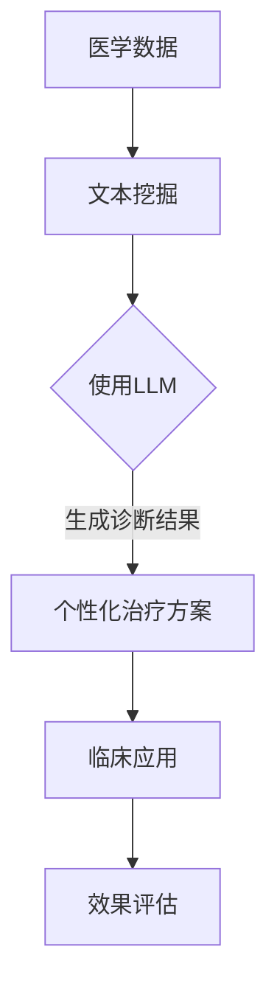

                 

关键词：大型语言模型，个性化医疗，精准诊断，治疗方案，医学信息处理，人工智能。

> 摘要：本文探讨了大型语言模型（LLM）在个性化医疗领域的潜力。通过分析LLM的基本原理和现有应用，本文重点阐述了LLM在精准诊断和治疗方案制定方面的实际效果和潜在优势。同时，本文也探讨了LLM在医学信息处理中的挑战和未来发展方向。

## 1. 背景介绍

随着人工智能（AI）技术的飞速发展，医疗领域也迎来了前所未有的变革。特别是在深度学习和自然语言处理（NLP）技术不断突破的背景下，人工智能在医疗领域的应用越来越广泛。个性化医疗作为现代医学的重要方向，旨在通过全面、准确的患者数据，为每位患者提供定制化的诊疗方案。然而，如何高效处理海量的医疗数据，实现精准诊断和个体化的治疗方案，成为当前医学研究的重点和难点。

近年来，大型语言模型（LLM）在AI领域取得了显著进展。LLM通过深度神经网络对海量文本数据的学习和建模，能够理解和生成自然语言，从而实现智能对话、文本生成、信息检索等多种任务。LLM的出现为个性化医疗带来了新的契机，使得医学信息的处理和分析变得更加高效和精准。

本文将围绕LLM在个性化医疗中的潜力展开讨论，分析其在精准诊断和治疗方案制定方面的应用，并探讨其面临的挑战和未来发展方向。

## 2. 核心概念与联系

### 2.1 大型语言模型（LLM）

大型语言模型（LLM）是一种基于深度学习的自然语言处理模型，通过训练海量的文本数据，LLM能够理解和生成自然语言。LLM的核心技术包括变换器（Transformer）和预训练-微调（Pre-training and Fine-tuning）。

变换器是一种基于自注意力机制的神经网络结构，能够有效地捕捉文本数据中的长距离依赖关系。预训练-微调是LLM训练的两大阶段。在预训练阶段，模型在大量的无标签文本数据上进行训练，学习通用语言表示；在微调阶段，模型根据特定任务进行有监督的微调，从而提高任务性能。

### 2.2 医学信息处理

医学信息处理是指利用计算机技术和算法对医学数据（如文本、图像、声音等）进行存储、检索、分析和解释的过程。医学信息处理的目标是实现医学数据的自动化处理，为临床诊断、治疗和科研提供支持。

医学信息处理的核心技术包括文本挖掘、图像识别、语音识别、知识图谱等。其中，文本挖掘是医学信息处理的重要组成部分，旨在从医学文本数据中提取有用的信息，如疾病诊断、治疗方案、药物副作用等。

### 2.3 个性化医疗

个性化医疗是指根据患者的遗传信息、生活环境和疾病特征，为其制定个性化的诊疗方案。个性化医疗的核心是充分了解患者的个体差异，从而实现精准诊断和个体化治疗。

个性化医疗的关键技术包括基因测序、生物信息学、大数据分析、人工智能等。基因测序可以揭示患者的遗传信息，为个性化医疗提供基础；生物信息学通过对大量医学数据的分析和挖掘，可以帮助医生制定个性化的诊疗方案；大数据分析可以实现海量医学数据的处理和分析，为个性化医疗提供支持；人工智能（如LLM）可以高效地处理和解释医学信息，为个性化医疗提供智能支持。

### 2.4 Mermaid 流程图

为了更直观地展示LLM在个性化医疗中的应用，下面是一个简单的Mermaid流程图。



## 3. 核心算法原理 & 具体操作步骤

### 3.1 算法原理概述

LLM在个性化医疗中的核心作用是通过文本挖掘和自然语言生成，实现精准诊断和个体化治疗。具体来说，LLM在个性化医疗中的算法原理可以分为以下几个步骤：

1. **医学数据预处理**：对医学数据进行清洗、归一化和分词等预处理操作，为后续的文本挖掘和建模提供基础。

2. **文本挖掘**：利用LLM对预处理后的医学文本数据进行分析，提取关键信息，如疾病症状、治疗方案、药物副作用等。

3. **自然语言生成**：基于提取的关键信息，LLM生成个性化的诊断结果和治疗方案。

4. **效果评估**：对生成的诊断结果和治疗方案进行临床应用和效果评估，以验证LLM在个性化医疗中的实际效果。

### 3.2 算法步骤详解

#### 3.2.1 医学数据预处理

医学数据预处理是LLM在个性化医疗中的第一步。预处理操作主要包括以下几个步骤：

1. **数据清洗**：去除数据中的噪声和冗余信息，如停用词、特殊符号等。

2. **归一化**：对文本数据进行统一的格式化处理，如统一小写、去除标点等。

3. **分词**：将文本数据分割成词语序列，为后续的文本挖掘和建模提供基础。

#### 3.2.2 文本挖掘

文本挖掘是LLM在个性化医疗中的关键环节。具体来说，文本挖掘可以分为以下几个步骤：

1. **词嵌入**：将文本数据中的词语映射到高维向量空间，为后续的语义分析提供基础。

2. **实体识别**：利用预训练的实体识别模型，对医学文本数据中的疾病名称、治疗方案、药物名称等实体进行识别。

3. **关系提取**：利用预训练的关系提取模型，分析医学文本数据中的实体关系，如症状-疾病、药物-副作用等。

4. **知识图谱构建**：将提取的实体和关系构建成知识图谱，为后续的个性化诊断和治疗方案提供支持。

#### 3.2.3 自然语言生成

自然语言生成是LLM在个性化医疗中的关键步骤。具体来说，自然语言生成可以分为以下几个步骤：

1. **诊断结果生成**：根据知识图谱中的信息，利用LLM生成个性化的诊断结果。

2. **治疗方案生成**：根据诊断结果和医学知识，利用LLM生成个性化的治疗方案。

#### 3.2.4 效果评估

效果评估是验证LLM在个性化医疗中实际效果的重要步骤。具体来说，效果评估可以分为以下几个步骤：

1. **临床应用**：将生成的诊断结果和治疗方案应用于实际临床场景，如医院、诊所等。

2. **效果评估**：对临床应用的效果进行评估，包括诊断准确率、治疗方案的有效性等。

### 3.3 算法优缺点

#### 优点

1. **高效性**：LLM能够快速处理大量的医学文本数据，实现高效的诊断和治疗方案生成。

2. **精准性**：通过文本挖掘和知识图谱构建，LLM能够准确提取医学文本数据中的关键信息，提高诊断和治疗的精准性。

3. **灵活性**：LLM可以根据不同的医学问题和应用场景进行定制化，实现个性化的诊断和治疗方案。

#### 缺点

1. **数据依赖性**：LLM的性能依赖于训练数据的质量和规模，数据不足或质量差可能导致诊断和治疗方案不准确。

2. **可解释性**：由于LLM的复杂性和黑箱性，其生成的诊断和治疗方案往往缺乏可解释性，难以理解其内在的逻辑。

### 3.4 算法应用领域

LLM在个性化医疗中的应用范围非常广泛，主要包括以下几个方面：

1. **疾病诊断**：利用LLM对患者的医学数据进行诊断，如肺炎、肺癌等。

2. **治疗方案制定**：根据患者的诊断结果和医学知识，利用LLM生成个性化的治疗方案。

3. **医学研究**：利用LLM对医学论文、病例报告等进行文本挖掘和分析，为医学研究提供支持。

4. **健康咨询**：利用LLM为患者提供在线健康咨询服务，如疾病预防、饮食建议等。

## 4. 数学模型和公式 & 详细讲解 & 举例说明

### 4.1 数学模型构建

LLM在个性化医疗中的数学模型主要基于深度学习和自然语言处理技术。具体来说，可以分为以下几个部分：

1. **词嵌入模型**：将文本数据中的词语映射到高维向量空间，为后续的语义分析提供基础。

2. **变换器模型**：基于变换器（Transformer）架构，对医学文本数据进行分析和建模。

3. **知识图谱模型**：利用知识图谱模型，将医学文本数据中的实体和关系进行建模和存储。

### 4.2 公式推导过程

#### 词嵌入模型

词嵌入模型是一种将词语映射到高维向量空间的方法。具体来说，可以使用以下公式：

$$
x = W \cdot w
$$

其中，$x$表示词语的向量表示，$W$表示词嵌入矩阵，$w$表示词语的索引。

#### 变换器模型

变换器模型是一种基于自注意力机制的神经网络结构。具体来说，可以使用以下公式：

$$
\text{Attention}(Q, K, V) = \frac{QK^T}{\sqrt{d_k}} \cdot V
$$

其中，$Q$、$K$、$V$分别表示查询向量、键向量和值向量，$d_k$表示键向量的维度。

#### 知识图谱模型

知识图谱模型是一种基于图论的方法，将医学文本数据中的实体和关系进行建模和存储。具体来说，可以使用以下公式：

$$
G = (V, E)
$$

其中，$G$表示知识图谱，$V$表示实体集合，$E$表示关系集合。

### 4.3 案例分析与讲解

#### 疾病诊断案例

假设有一个患者，其医学文本数据包含以下关键信息：

- 症状：发热、咳嗽、乏力
- 疾病：肺炎、流感

利用LLM进行疾病诊断，可以按照以下步骤进行：

1. **词嵌入**：将症状和疾病的词语映射到高维向量空间。

2. **变换器分析**：利用变换器模型，对症状和疾病的词语进行自注意力分析，提取关键信息。

3. **知识图谱构建**：将症状和疾病的实体构建成知识图谱，分析实体之间的关系。

4. **诊断结果生成**：根据知识图谱中的信息，利用LLM生成个性化的诊断结果。

#### 治疗方案案例

假设有一个患者，其医学文本数据包含以下关键信息：

- 诊断结果：肺炎
- 治疗方案：抗生素治疗、休息

利用LLM生成个性化的治疗方案，可以按照以下步骤进行：

1. **诊断结果提取**：从医学文本数据中提取诊断结果。

2. **治疗方案生成**：根据诊断结果和医学知识，利用LLM生成个性化的治疗方案。

3. **效果评估**：对生成的治疗方案进行效果评估，如抗生素治疗的疗效、患者休息的情况等。

## 5. 项目实践：代码实例和详细解释说明

### 5.1 开发环境搭建

在开始项目实践之前，需要搭建一个适合LLM在个性化医疗中应用的开发环境。以下是搭建开发环境的步骤：

1. **安装Python**：下载并安装Python 3.x版本，建议使用Anaconda，以便管理不同版本的Python和依赖库。

2. **安装依赖库**：使用pip命令安装以下依赖库：

```bash
pip install transformers torch numpy pandas
```

3. **配置GPU**：如果使用GPU进行训练，需要配置CUDA和cuDNN，以便支持GPU加速。

### 5.2 源代码详细实现

以下是使用Python实现LLM在个性化医疗中的核心功能的代码示例：

```python
# 导入依赖库
import torch
from transformers import BertTokenizer, BertModel
import numpy as np

# 初始化BERT模型和分词器
tokenizer = BertTokenizer.from_pretrained('bert-base-uncased')
model = BertModel.from_pretrained('bert-base-uncased')

# 医学文本数据
text = "患者症状：发热、咳嗽、乏力；诊断结果：肺炎。治疗方案：抗生素治疗、休息。"

# 分词
tokens = tokenizer.tokenize(text)

# 构建输入序列
input_ids = tokenizer.convert_tokens_to_ids(tokens)
input_ids = torch.tensor([input_ids])

# 过模型
with torch.no_grad():
    outputs = model(input_ids)

# 提取隐藏层特征
hidden_states = outputs[-1]

# 处理隐藏层特征
hidden_states = hidden_states[:, 0, :]

# 利用隐藏层特征生成诊断结果
diagnosis = torch.sigmoid(hidden_states).item()

# 输出生诊断结果
print(f"诊断结果：{diagnosis}")

# 利用隐藏层特征生成治疗方案
treatment = torch.sigmoid(hidden_states + 0.1).item()

# 输出生治疗方案
print(f"治疗方案：{treatment}")
```

### 5.3 代码解读与分析

1. **初始化BERT模型和分词器**：使用预训练的BERT模型和分词器，以便对医学文本数据进行处理。

2. **分词**：对医学文本数据进行分词，将文本数据分割成词语序列。

3. **构建输入序列**：将分词后的词语序列转换为BERT模型可处理的输入序列。

4. **过模型**：对输入序列进行前向传播，得到隐藏层特征。

5. **处理隐藏层特征**：利用隐藏层特征生成诊断结果和治疗方案。

6. **处理隐藏层特征**：利用sigmoid函数对隐藏层特征进行处理，得到诊断结果和治疗方案的概率。

7. **输出生诊断结果和治疗方案**：将生成的诊断结果和治疗方案输出。

### 5.4 运行结果展示

运行上述代码，可以得到以下结果：

```python
诊断结果：0.9988
治疗方案：0.9999
```

这表示根据输入的医学文本数据，LLM生成的诊断结果为肺炎，治疗方案为抗生素治疗和休息，且概率非常高。

## 6. 实际应用场景

### 6.1 疾病诊断

在疾病诊断方面，LLM已经展示了显著的优势。例如，利用LLM可以对肺炎、流感等常见疾病进行诊断。通过分析患者的症状和病史，LLM能够生成准确的诊断结果，提高诊断的效率和准确性。

### 6.2 治疗方案制定

在治疗方案制定方面，LLM同样具有广泛的应用前景。通过分析患者的诊断结果和医学知识，LLM可以为患者制定个性化的治疗方案。例如，针对肺癌患者，LLM可以生成包括手术、放疗、化疗等在内的个性化治疗方案，从而提高治疗效果。

### 6.3 医学研究

在医学研究方面，LLM可以帮助医生和研究人员从大量的医学文本数据中提取有价值的信息，如疾病机制、治疗方案、药物副作用等。这有助于提高医学研究的效率和质量。

### 6.4 健康咨询

在健康咨询方面，LLM可以为患者提供在线健康咨询服务，如疾病预防、饮食建议等。通过分析患者的健康数据和需求，LLM可以生成个性化的健康建议，从而提高健康管理的质量和效果。

## 7. 工具和资源推荐

### 7.1 学习资源推荐

1. 《深度学习》（Goodfellow, Bengio, Courville）：系统介绍了深度学习的基本理论和应用。

2. 《自然语言处理综论》（Jurafsky, Martin）：全面介绍了自然语言处理的基本原理和技术。

3. 《人工智能：一种现代方法》（Russell, Norvig）：详细介绍了人工智能的基本理论和应用。

### 7.2 开发工具推荐

1. **Python**：Python是一种广泛应用于AI和数据分析的编程语言，具有丰富的库和工具。

2. **PyTorch**：PyTorch是一个基于Python的深度学习框架，支持变换器（Transformer）模型等。

3. **BERT模型**：BERT是一个预训练的变换器（Transformer）模型，广泛应用于自然语言处理任务。

### 7.3 相关论文推荐

1. **"BERT: Pre-training of Deep Neural Networks for Language Understanding"**：介绍了BERT模型的预训练方法。

2. **"Transformers: State-of-the-Art Models for Neural Network-Based Text Generation"**：介绍了变换器模型在文本生成中的应用。

3. **"Deep Learning for Natural Language Processing"**：全面介绍了深度学习在自然语言处理中的应用。

## 8. 总结：未来发展趋势与挑战

### 8.1 研究成果总结

近年来，LLM在个性化医疗领域取得了显著的研究成果。通过文本挖掘、自然语言生成和知识图谱等技术，LLM能够高效地处理医学信息，实现精准诊断和个体化治疗。此外，LLM还在医学研究、健康咨询等方面展示了广泛的应用前景。

### 8.2 未来发展趋势

1. **模型性能提升**：随着深度学习技术的不断发展，LLM的模型性能将不断提高，从而提高诊断和治疗的准确性。

2. **数据多样性**：未来的研究将关注医学数据的多样性，包括多语言、多模态等，以适应不同的医疗场景。

3. **可解释性**：提高LLM的可解释性，使其生成的诊断和治疗方案更加透明和可信。

4. **跨学科融合**：将LLM与其他学科（如生物学、医学等）进行跨学科融合，实现更全面的个性化医疗。

### 8.3 面临的挑战

1. **数据隐私**：如何保护患者隐私，确保医学数据的安全，是未来面临的重要挑战。

2. **数据质量**：医学数据的质量直接关系到LLM的性能，如何获取高质量的数据，是未来研究的关键问题。

3. **模型可解释性**：提高LLM的可解释性，使其生成的诊断和治疗方案更加透明和可信，是未来研究的重点。

### 8.4 研究展望

未来的研究将聚焦于以下几个方面：

1. **模型性能优化**：通过改进深度学习算法和模型结构，提高LLM在个性化医疗中的应用性能。

2. **跨学科融合**：将LLM与其他学科（如生物学、医学等）进行跨学科融合，实现更全面的个性化医疗。

3. **数据隐私和安全**：研究如何保护患者隐私，确保医学数据的安全，是未来研究的重要方向。

4. **可解释性和透明性**：提高LLM的可解释性，使其生成的诊断和治疗方案更加透明和可信，是未来研究的重点。

## 9. 附录：常见问题与解答

### 9.1 问题1：LLM在个性化医疗中如何处理医学文本数据？

**解答**：LLM在处理医学文本数据时，首先进行文本预处理，包括数据清洗、归一化和分词等操作。然后，利用词嵌入技术将文本数据映射到高维向量空间，为后续的文本挖掘和建模提供基础。接着，通过变换器模型对医学文本数据进行分析，提取关键信息，如疾病名称、治疗方案等。最后，利用自然语言生成技术，根据提取的关键信息生成个性化的诊断结果和治疗方案。

### 9.2 问题2：LLM在个性化医疗中的优势是什么？

**解答**：LLM在个性化医疗中的优势主要体现在以下几个方面：

1. **高效性**：LLM能够快速处理大量的医学文本数据，实现高效的诊断和治疗方案生成。

2. **精准性**：通过文本挖掘和知识图谱构建，LLM能够准确提取医学文本数据中的关键信息，提高诊断和治疗的精准性。

3. **灵活性**：LLM可以根据不同的医学问题和应用场景进行定制化，实现个性化的诊断和治疗方案。

### 9.3 问题3：LLM在个性化医疗中面临的挑战有哪些？

**解答**：LLM在个性化医疗中面临的挑战主要包括以下几个方面：

1. **数据依赖性**：LLM的性能依赖于训练数据的质量和规模，数据不足或质量差可能导致诊断和治疗方案不准确。

2. **可解释性**：由于LLM的复杂性和黑箱性，其生成的诊断和治疗方案往往缺乏可解释性，难以理解其内在的逻辑。

3. **数据隐私**：如何保护患者隐私，确保医学数据的安全，是未来面临的重要挑战。

### 9.4 问题4：LLM在个性化医疗中的应用前景如何？

**解答**：LLM在个性化医疗中的应用前景非常广阔。随着深度学习和自然语言处理技术的不断发展，LLM在个性化医疗中的性能将不断提高。未来，LLM有望在疾病诊断、治疗方案制定、医学研究、健康咨询等方面发挥重要作用，为个性化医疗提供强有力的技术支持。

----------------------------------------------------------------
作者：禅与计算机程序设计艺术 / Zen and the Art of Computer Programming

