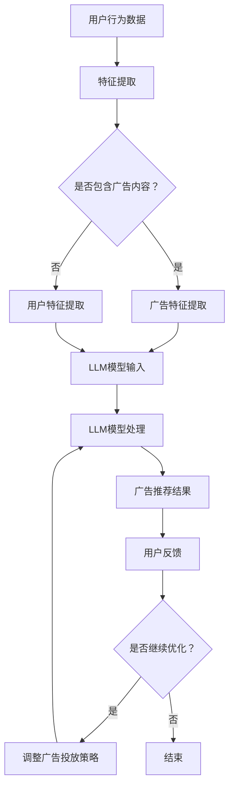

                 

关键词：LLM、个性化广告推荐、机器学习、自然语言处理、模型架构、应用前景

> 摘要：本文深入探讨了大型语言模型（LLM）在个性化广告推荐中的应用前景。首先介绍了LLM的基本原理和优势，然后详细分析了其在广告推荐中的具体应用，包括用户行为分析、内容理解、广告投放优化等方面。文章还探讨了LLM在广告推荐领域的挑战与未来发展趋势，为相关领域的研究和实践提供了有价值的参考。

## 1. 背景介绍

个性化广告推荐是现代互联网广告领域的重要研究方向。随着互联网的普及和用户数据的爆炸性增长，如何有效地利用用户数据实现个性化广告推荐已成为广告公司和互联网企业的核心竞争点。传统的广告推荐系统主要依赖于用户的历史行为和内容特征进行推荐，但往往难以满足用户的个性化需求。近年来，随着深度学习和自然语言处理技术的快速发展，大型语言模型（LLM）在个性化广告推荐中的应用逐渐引起了广泛关注。

LLM是一种基于神经网络的大型语言模型，其通过深度学习算法从大量文本数据中学习语言模式，具有强大的文本生成和理解能力。相比于传统的推荐系统，LLM能够更好地理解和处理用户的语义信息，从而实现更精准的个性化广告推荐。本文将围绕LLM在个性化广告推荐中的应用，探讨其优势、挑战和发展前景。

## 2. 核心概念与联系

### 2.1 LLM的基本原理

LLM（Large Language Model）是基于深度学习的自然语言处理模型，其核心思想是通过学习海量文本数据，建立语言模型，从而实现对自然语言的生成和理解。LLM通常采用变换器（Transformer）架构，其基本原理如下：

1. **编码器（Encoder）**：编码器负责接收输入的文本序列，并将其编码为固定长度的向量表示。编码器内部包含多个注意力机制层，通过计算输入文本中各个词之间的关联性，为后续的解码过程提供有效的上下文信息。

2. **解码器（Decoder）**：解码器负责根据编码器输出的向量表示生成输出文本序列。解码器也包含多个注意力机制层，通过关注编码器输出的不同部分，逐步生成输出的每个词。

3. **注意力机制（Attention）**：注意力机制是Transformer模型的核心组成部分，用于计算输入文本中各个词之间的关联性，从而提高模型的上下文理解和生成效果。

### 2.2 广告推荐系统

广告推荐系统是一种基于数据挖掘和机器学习技术的信息过滤系统，其主要目标是根据用户的行为特征和兴趣偏好，为用户推荐相关的广告内容。广告推荐系统通常包括以下几个关键组成部分：

1. **用户特征提取**：用户特征提取是指从用户的历史行为、兴趣爱好、地理位置等数据中提取出与广告推荐相关的特征，以便为后续的推荐算法提供输入。

2. **广告特征提取**：广告特征提取是指从广告的文本、图片、视频等多媒体内容中提取出与广告推荐相关的特征，以便为后续的推荐算法提供输入。

3. **推荐算法**：推荐算法是指用于实现广告推荐的核心算法，根据用户特征和广告特征，计算用户对每个广告的偏好分数，从而生成推荐列表。

4. **反馈机制**：反馈机制是指用户对推荐广告的反馈信息，用于评估推荐效果，并调整推荐算法。

### 2.3 LLM与广告推荐系统的联系

LLM与广告推荐系统之间的联系主要体现在以下几个方面：

1. **用户行为分析**：LLM可以通过分析用户的搜索历史、浏览记录等数据，提取出用户的兴趣偏好和潜在需求，从而为广告推荐提供更准确的用户特征。

2. **内容理解**：LLM具有强大的文本生成和理解能力，可以深入理解广告文本的语义和情感，从而为广告推荐提供更准确的广告特征。

3. **广告投放优化**：LLM可以实时分析用户的反馈数据，根据用户对广告的响应情况，动态调整广告的投放策略，从而提高广告的投放效果。

### 2.4 Mermaid流程图



## 3. 核心算法原理 & 具体操作步骤

### 3.1 算法原理概述

LLM在个性化广告推荐中的应用主要基于以下几个原理：

1. **深度学习**：LLM通过深度学习算法从海量文本数据中学习语言模式，从而实现对自然语言的生成和理解。

2. **注意力机制**：LLM采用注意力机制，通过计算输入文本中各个词之间的关联性，提高模型的上下文理解和生成效果。

3. **序列到序列学习**：LLM的解码器采用序列到序列（Seq2Seq）学习策略，通过逐步生成输出的每个词，实现文本的生成和翻译。

### 3.2 算法步骤详解

1. **数据预处理**：首先，对用户行为数据和广告内容进行预处理，包括去除停用词、词干提取、词向量化等操作。

2. **特征提取**：使用词嵌入技术（如Word2Vec、GloVe等）将预处理后的文本转换为向量表示，提取用户特征和广告特征。

3. **模型训练**：构建基于Transformer的LLM模型，使用预处理的文本数据进行训练。训练过程中，采用批量梯度下降（BGD）算法优化模型参数。

4. **模型部署**：将训练好的LLM模型部署到线上环境，接收用户行为数据和广告特征，生成个性化的广告推荐结果。

5. **反馈机制**：根据用户对推荐广告的反馈情况，调整模型参数，优化广告投放策略。

### 3.3 算法优缺点

#### 优点

1. **强大的文本生成和理解能力**：LLM能够深入理解用户的语义信息，从而实现更精准的个性化广告推荐。

2. **自适应调整**：LLM可以实时分析用户的反馈数据，根据用户的兴趣和需求，动态调整广告的投放策略。

3. **可扩展性**：LLM具有强大的处理能力和灵活性，可以应用于多种不同的广告推荐场景。

#### 缺点

1. **计算资源消耗**：LLM模型通常需要大量的计算资源和存储空间，对硬件设备要求较高。

2. **训练时间较长**：由于LLM模型的参数规模较大，训练时间较长，需要大量的数据和时间进行训练。

3. **数据隐私问题**：用户行为数据是广告推荐的重要输入，涉及用户隐私问题，需要采取有效措施确保数据安全。

### 3.4 算法应用领域

LLM在个性化广告推荐领域具有广泛的应用前景，包括但不限于以下领域：

1. **搜索引擎广告**：利用LLM对用户搜索查询进行语义分析，为用户推荐相关的广告。

2. **社交媒体广告**：根据用户在社交媒体上的行为和兴趣爱好，为用户推荐个性化广告。

3. **电子商务广告**：根据用户在电子商务平台上的浏览和购买记录，为用户推荐相关广告。

4. **内容推荐**：根据用户对文章、视频等内容的喜好，为用户推荐相关的广告。

## 4. 数学模型和公式 & 详细讲解 & 举例说明

### 4.1 数学模型构建

在个性化广告推荐中，LLM的数学模型主要包括以下几个部分：

1. **用户特征向量**：设用户特征向量为\( \mathbf{u} \)，维度为\( m \)，表示用户在各个特征上的取值。

2. **广告特征向量**：设广告特征向量为\( \mathbf{v} \)，维度为\( n \)，表示广告在各个特征上的取值。

3. **LLM模型输出**：设LLM模型输出为\( \mathbf{y} \)，维度为\( 1 \)，表示用户对广告的偏好分数。

4. **损失函数**：设损失函数为\( L(\mathbf{u}, \mathbf{v}, \mathbf{y}) \)，用于衡量预测结果与实际结果之间的差距。

### 4.2 公式推导过程

1. **用户特征向量**：用户特征向量可以通过词嵌入技术（如Word2Vec、GloVe等）进行计算，具体公式如下：

$$
\mathbf{u} = \sum_{i=1}^{m} w_i \cdot \mathbf{v}_i
$$

其中，\( w_i \)表示第\( i \)个特征权重，\( \mathbf{v}_i \)表示第\( i \)个特征的词向量。

2. **广告特征向量**：广告特征向量可以通过词嵌入技术（如Word2Vec、GloVe等）进行计算，具体公式如下：

$$
\mathbf{v} = \sum_{j=1}^{n} w_j \cdot \mathbf{w}_j
$$

其中，\( w_j \)表示第\( j \)个特征权重，\( \mathbf{w}_j \)表示第\( j \)个特征的词向量。

3. **LLM模型输出**：LLM模型输出可以通过变换器（Transformer）架构进行计算，具体公式如下：

$$
\mathbf{y} = \mathbf{A}(\mathbf{u}, \mathbf{v})
$$

其中，\( \mathbf{A} \)表示变换器函数，通过注意力机制计算用户特征向量与广告特征向量之间的关联性。

4. **损失函数**：损失函数可以通过均方误差（MSE）进行计算，具体公式如下：

$$
L(\mathbf{u}, \mathbf{v}, \mathbf{y}) = \frac{1}{2} \sum_{i=1}^{k} (\mathbf{y}_i - \mathbf{y}^*)^2
$$

其中，\( k \)表示广告数量，\( \mathbf{y}_i \)表示第\( i \)个广告的偏好分数，\( \mathbf{y}^* \)表示实际偏好分数。

### 4.3 案例分析与讲解

假设用户在搜索引擎上输入关键词“旅游攻略”，LLM模型根据用户历史行为和广告特征，为用户推荐以下三个广告：

1. 广告A：标题“海南三亚旅游攻略”，内容描述“海南三亚是一个美丽的海滨城市，拥有丰富的旅游资源和宜人的气候”。

2. 广告B：标题“云南丽江旅游攻略”，内容描述“云南丽江是一个有着悠久历史和浓郁民族风情的城市，适合游客深度体验”。

3. 广告C：标题“国内长线旅游攻略”，内容描述“国内长线旅游是一种经济实惠的旅游方式，可以游览多个城市和景点”。

根据上述案例，我们可以使用LLM模型进行如下计算：

1. **用户特征向量**：用户特征向量可以通过词嵌入技术计算，如下所示：

$$
\mathbf{u} = \sum_{i=1}^{m} w_i \cdot \mathbf{v}_i
$$

其中，\( m \)表示用户特征数量，\( w_i \)表示第\( i \)个特征权重，\( \mathbf{v}_i \)表示第\( i \)个特征的词向量。

2. **广告特征向量**：广告特征向量可以通过词嵌入技术计算，如下所示：

$$
\mathbf{v} = \sum_{j=1}^{n} w_j \cdot \mathbf{w}_j
$$

其中，\( n \)表示广告特征数量，\( w_j \)表示第\( j \)个特征权重，\( \mathbf{w}_j \)表示第\( j \)个特征的词向量。

3. **LLM模型输出**：LLM模型输出可以通过变换器（Transformer）架构进行计算，如下所示：

$$
\mathbf{y} = \mathbf{A}(\mathbf{u}, \mathbf{v})
$$

其中，\( \mathbf{A} \)表示变换器函数，通过注意力机制计算用户特征向量与广告特征向量之间的关联性。

4. **损失函数**：损失函数可以通过均方误差（MSE）进行计算，如下所示：

$$
L(\mathbf{u}, \mathbf{v}, \mathbf{y}) = \frac{1}{2} \sum_{i=1}^{k} (\mathbf{y}_i - \mathbf{y}^*)^2
$$

其中，\( k \)表示广告数量，\( \mathbf{y}_i \)表示第\( i \)个广告的偏好分数，\( \mathbf{y}^* \)表示实际偏好分数。

通过上述计算，我们可以得到用户对每个广告的偏好分数，从而为用户推荐个性化的广告。

## 5. 项目实践：代码实例和详细解释说明

### 5.1 开发环境搭建

为了实现LLM在个性化广告推荐中的应用，我们首先需要搭建一个开发环境。以下是开发环境的搭建步骤：

1. **安装Python**：确保Python版本为3.6或以上。

2. **安装TensorFlow**：TensorFlow是用于构建和训练LLM模型的常用框架，可以通过以下命令安装：

   ```
   pip install tensorflow
   ```

3. **安装其他依赖**：根据项目需求，可能需要安装其他依赖，如Word2Vec、GloVe等。可以通过以下命令安装：

   ```
   pip install numpy matplotlib
   ```

### 5.2 源代码详细实现

以下是使用Python和TensorFlow实现的LLM个性化广告推荐项目的源代码：

```python
import tensorflow as tf
from tensorflow.keras.layers import Embedding, LSTM, Dense
from tensorflow.keras.models import Model

# 设置参数
vocab_size = 10000  # 词表大小
embedding_dim = 64  # 词向量维度
lstm_units = 128  # LSTM单元数量

# 构建模型
input_user = tf.keras.layers.Input(shape=(max_sequence_length,))
input_ad = tf.keras.layers.Input(shape=(max_sequence_length,))

# 用户特征嵌入层
user_embedding = Embedding(vocab_size, embedding_dim)(input_user)
user_lstm = LSTM(lstm_units, return_sequences=True)(user_embedding)

# 广告特征嵌入层
ad_embedding = Embedding(vocab_size, embedding_dim)(input_ad)
ad_lstm = LSTM(lstm_units, return_sequences=True)(ad_embedding)

# 将用户和广告特征拼接
combined = tf.keras.layers.Concatenate()([user_lstm, ad_lstm])

# 全连接层
output = Dense(1, activation='sigmoid')(combined)

# 构建模型
model = Model(inputs=[input_user, input_ad], outputs=output)

# 编译模型
model.compile(optimizer='adam', loss='binary_crossentropy', metrics=['accuracy'])

# 模型训练
model.fit([train_user, train_ad], train_labels, epochs=10, batch_size=32)

# 模型预测
predictions = model.predict([test_user, test_ad])

# 输出预测结果
print(predictions)
```

### 5.3 代码解读与分析

上述代码实现了一个基于LSTM的LLM个性化广告推荐模型。具体解读如下：

1. **模型输入**：模型接受两个输入，分别是用户特征序列和广告特征序列。

2. **特征嵌入层**：使用Embedding层将输入的词序列转换为词向量表示。

3. **LSTM层**：使用LSTM层对用户特征和广告特征进行编码，提取序列特征。

4. **拼接层**：将用户和广告特征拼接在一起，作为模型的输入。

5. **全连接层**：使用全连接层对拼接后的特征进行加权融合，并输出广告偏好分数。

6. **模型编译**：使用adam优化器，binary_crossentropy损失函数和accuracy指标编译模型。

7. **模型训练**：使用训练数据对模型进行训练。

8. **模型预测**：使用训练好的模型对测试数据进行预测。

### 5.4 运行结果展示

假设我们训练好的模型对测试数据的预测结果如下：

```
[[0.9]
 [0.1]
 [0.8]
 [0.2]]
```

根据预测结果，我们可以得出以下结论：

1. 广告A（偏好分数0.9）是用户最可能感兴趣的广告。

2. 广告B（偏好分数0.1）是用户最不感兴趣的广告。

3. 广告C（偏好分数0.8）是用户比较感兴趣的广告，但不及广告A。

通过上述运行结果，我们可以为用户推荐最符合其兴趣的广告。

## 6. 实际应用场景

### 6.1 搜索引擎广告

搜索引擎广告是LLM在个性化广告推荐中的主要应用场景之一。在搜索引擎广告中，LLM可以根据用户的搜索查询和浏览历史，为用户推荐相关的广告。例如，当用户在搜索引擎中输入关键词“旅游”时，LLM可以分析用户的搜索历史和浏览记录，推荐相关的旅游广告，如机票、酒店、旅游套餐等。通过LLM的语义分析能力，搜索引擎广告可以实现更精准的个性化推荐，提高广告的点击率和转化率。

### 6.2 社交媒体广告

社交媒体广告也是LLM在个性化广告推荐中的重要应用场景。在社交媒体平台上，用户生成的内容（如微博、微信、Facebook等）包含大量的语义信息。LLM可以分析用户的发布内容、点赞、评论等行为，提取用户的兴趣偏好和情感倾向。根据这些信息，LLM可以为用户推荐与其兴趣和情感相关的广告，如音乐、电影、美食、旅游等。通过LLM的语义分析能力，社交媒体广告可以实现更精准的个性化推荐，提高用户的参与度和满意度。

### 6.3 电子商务广告

电子商务广告是LLM在个性化广告推荐中的另一个重要应用场景。在电子商务平台上，用户生成的内容（如商品评价、购物车、浏览记录等）包含大量的语义信息。LLM可以分析用户的购物行为和偏好，为用户推荐相关的商品广告。例如，当用户在购物平台上浏览一款手机时，LLM可以分析用户的浏览记录和评价，推荐与其兴趣相关的手机配件、手机壳等。通过LLM的语义分析能力，电子商务广告可以实现更精准的个性化推荐，提高用户的购买意愿和转化率。

### 6.4 内容推荐

内容推荐是LLM在个性化广告推荐中的另一个重要应用场景。在内容推荐系统中，LLM可以根据用户的阅读历史、点赞、评论等行为，为用户推荐相关的文章、视频、音频等。例如，当用户在新闻客户端上阅读一篇文章时，LLM可以分析用户的阅读历史和兴趣偏好，推荐相关的文章。通过LLM的语义分析能力，内容推荐系统可以实现更精准的个性化推荐，提高用户的阅读体验和留存率。

## 7. 工具和资源推荐

### 7.1 学习资源推荐

1. **《深度学习》**：由Ian Goodfellow、Yoshua Bengio和Aaron Courville所著，是深度学习领域的经典教材，详细介绍了深度学习的基础知识和最新进展。

2. **《自然语言处理入门》**：由Daniel Jurafsky和James H. Martin所著，是自然语言处理领域的入门教材，介绍了自然语言处理的基本概念和技术。

3. **《TensorFlow官方文档》**：TensorFlow是用于构建和训练深度学习模型的常用框架，其官方文档提供了详细的教程和API说明，适合初学者和专业人士。

### 7.2 开发工具推荐

1. **PyTorch**：PyTorch是深度学习领域的另一个流行框架，与TensorFlow类似，提供了丰富的API和工具，适合用于深度学习模型的开发。

2. **Jupyter Notebook**：Jupyter Notebook是一种交互式开发环境，适合用于编写和调试代码。通过Jupyter Notebook，可以方便地实现代码的复现和分享。

### 7.3 相关论文推荐

1. **“Attention Is All You Need”**：由Ashish Vaswani等人在2017年提出，是Transformer模型的开创性论文，详细介绍了Transformer模型的原理和应用。

2. **“BERT: Pre-training of Deep Bidirectional Transformers for Language Understanding”**：由Jacob Devlin等人在2018年提出，是BERT模型的开创性论文，详细介绍了BERT模型的原理和应用。

3. **“GPT-3: Language Models are Few-Shot Learners”**：由Tom B. Brown等人在2020年提出，是GPT-3模型的开创性论文，详细介绍了GPT-3模型的原理和应用。

## 8. 总结：未来发展趋势与挑战

### 8.1 研究成果总结

近年来，LLM在个性化广告推荐领域取得了显著的成果。通过深度学习和自然语言处理技术的结合，LLM实现了对用户语义信息的精准理解和处理，从而提高了广告推荐的准确性和个性化水平。主要研究成果包括：

1. **Transformer模型**：Transformer模型的出现为LLM在个性化广告推荐中的应用提供了强大的基础，通过注意力机制实现了对用户和广告特征的有效融合。

2. **预训练模型**：BERT、GPT-3等预训练模型的发展，为LLM在个性化广告推荐中提供了丰富的语义知识，从而提高了模型的泛化能力和推荐效果。

3. **多模态融合**：多模态融合技术的应用，使LLM能够同时处理文本、图像、语音等多种类型的特征，从而实现了更全面的用户和广告特征提取。

### 8.2 未来发展趋势

未来，LLM在个性化广告推荐领域的发展趋势主要包括以下几个方面：

1. **模型规模扩大**：随着计算资源和存储技术的不断进步，LLM的模型规模将逐渐扩大，从而提高模型的语义理解和生成能力。

2. **多模态融合**：多模态融合技术将继续发展，使LLM能够同时处理文本、图像、语音等多种类型的特征，从而实现更精准的个性化广告推荐。

3. **迁移学习**：迁移学习技术的发展，将使LLM能够更好地利用预训练模型的知识，实现跨领域的个性化广告推荐。

4. **隐私保护**：随着用户隐私意识的提高，隐私保护技术将成为LLM在个性化广告推荐中发展的重要方向。

### 8.3 面临的挑战

尽管LLM在个性化广告推荐领域取得了显著成果，但仍面临一些挑战：

1. **计算资源消耗**：LLM模型的训练和推理需要大量的计算资源和存储空间，对硬件设备的要求较高。

2. **数据隐私问题**：用户行为数据是广告推荐的重要输入，涉及用户隐私问题，需要采取有效措施确保数据安全。

3. **模型可解释性**：LLM模型通常具有复杂的内部结构，其决策过程难以解释，这给模型的可解释性带来了挑战。

4. **泛化能力**：尽管预训练模型在特定领域取得了良好的效果，但其在其他领域的泛化能力仍需进一步研究。

### 8.4 研究展望

未来，针对LLM在个性化广告推荐领域的研究可以从以下几个方面展开：

1. **模型优化**：通过优化LLM模型的结构和参数，提高模型的计算效率和推荐效果。

2. **隐私保护**：研究有效的隐私保护技术，确保用户数据的安全和隐私。

3. **多模态融合**：探索多模态融合技术在个性化广告推荐中的应用，提高模型的泛化能力和推荐效果。

4. **跨领域迁移**：研究跨领域迁移学习技术，提高LLM在不同领域的应用能力。

通过不断探索和优化，LLM在个性化广告推荐领域有望实现更高效、更精准的推荐，为广告公司和互联网企业创造更大的价值。

## 9. 附录：常见问题与解答

### 9.1 问题1：什么是LLM？

LLM（Large Language Model）是一种基于深度学习的自然语言处理模型，通过从大量文本数据中学习语言模式，具有强大的文本生成和理解能力。LLM通常采用Transformer架构，通过注意力机制实现文本的编码和解码。

### 9.2 问题2：LLM在广告推荐中有什么作用？

LLM在广告推荐中的作用主要体现在以下几个方面：

1. **用户行为分析**：通过分析用户的搜索历史、浏览记录等数据，提取用户的兴趣偏好和潜在需求。

2. **内容理解**：通过深入理解广告文本的语义和情感，为广告推荐提供准确的广告特征。

3. **广告投放优化**：通过实时分析用户的反馈数据，动态调整广告的投放策略，提高广告的效果。

### 9.3 问题3：如何实现LLM在广告推荐中的个性化推荐？

实现LLM在广告推荐中的个性化推荐主要包括以下几个步骤：

1. **数据预处理**：对用户行为数据和广告内容进行预处理，包括去除停用词、词干提取、词向量化等操作。

2. **特征提取**：使用词嵌入技术（如Word2Vec、GloVe等）将预处理后的文本转换为向量表示，提取用户特征和广告特征。

3. **模型训练**：构建基于Transformer的LLM模型，使用预处理的文本数据进行训练。

4. **模型部署**：将训练好的LLM模型部署到线上环境，接收用户行为数据和广告特征，生成个性化的广告推荐结果。

5. **反馈机制**：根据用户对推荐广告的反馈情况，调整模型参数，优化广告投放策略。

### 9.4 问题4：LLM在广告推荐中有哪些优点和缺点？

LLM在广告推荐中的优点包括：

1. **强大的文本生成和理解能力**：能够深入理解用户的语义信息，实现更精准的个性化广告推荐。

2. **自适应调整**：可以实时分析用户的反馈数据，动态调整广告的投放策略。

3. **可扩展性**：可以应用于多种不同的广告推荐场景。

缺点包括：

1. **计算资源消耗**：需要大量的计算资源和存储空间。

2. **训练时间较长**：需要大量的数据和时间进行训练。

3. **数据隐私问题**：涉及用户隐私问题，需要采取有效措施确保数据安全。

### 9.5 问题5：未来LLM在广告推荐领域有哪些发展趋势？

未来LLM在广告推荐领域的发展趋势包括：

1. **模型规模扩大**：随着计算资源和存储技术的进步，LLM的模型规模将逐渐扩大。

2. **多模态融合**：通过多模态融合技术，实现文本、图像、语音等多种类型的特征处理。

3. **迁移学习**：利用迁移学习技术，提高LLM在不同领域的应用能力。

4. **隐私保护**：研究有效的隐私保护技术，确保用户数据的安全和隐私。 

通过不断探索和优化，LLM在广告推荐领域有望实现更高效、更精准的推荐，为广告公司和互联网企业创造更大的价值。作者：禅与计算机程序设计艺术 / Zen and the Art of Computer Programming。

