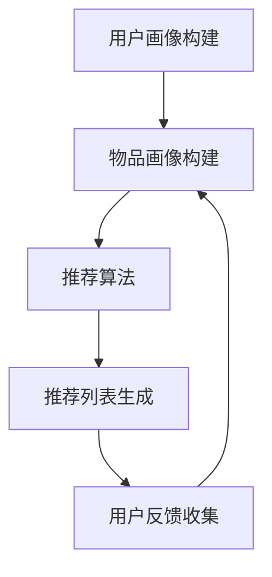
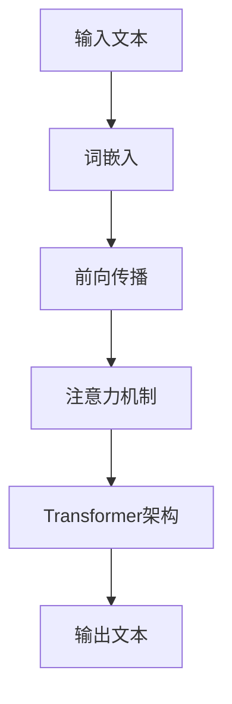
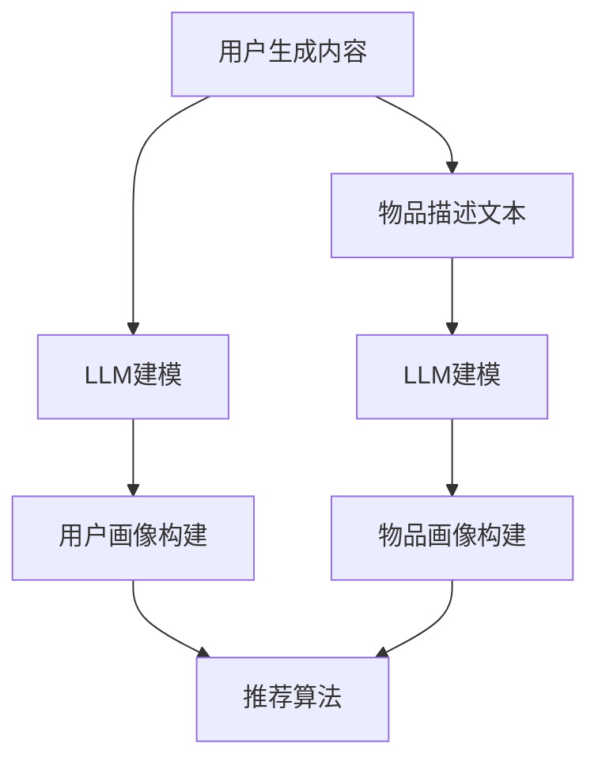

                 

关键词：LLM、个性化推荐、效果评估、算法原理、数学模型、项目实践、应用场景、发展趋势

> 摘要：本文旨在探讨大型语言模型（LLM）在个性化推荐系统中的应用，并对其效果进行深入评估。文章首先介绍了个性化推荐的背景和重要性，随后详细分析了LLM的核心概念和原理。通过数学模型和具体算法步骤的讲解，我们深入探讨了LLM在个性化推荐中的工作机制。此外，文章通过项目实践展示了如何实现LLM个性化推荐系统，并分析了其实际应用场景。最后，我们对LLM在个性化推荐领域的未来发展进行了展望，并提出了相应的挑战和研究方向。

## 1. 背景介绍

### 1.1 个性化推荐的起源与发展

个性化推荐（Personalized Recommendation）是现代互联网技术中的一项重要应用。它起源于20世纪90年代，随着互联网的兴起和数据量的爆发式增长，人们开始意识到通过对用户行为数据的分析，可以为用户提供更加个性化的信息推荐，从而提升用户体验和满意度。

个性化推荐系统最初主要基于基于内容的推荐（Content-Based Filtering）和协同过滤（Collaborative Filtering）两大类方法。基于内容的推荐通过分析用户过去的兴趣和偏好，将相似内容的物品推荐给用户。而协同过滤则通过分析用户之间的相似性，发现潜在的共同喜好，从而推荐用户可能感兴趣的物品。

随着深度学习和自然语言处理技术的发展，大型语言模型（LLM）逐渐在个性化推荐领域崭露头角。LLM是一种基于神经网络的深度学习模型，能够对大规模文本数据进行建模和理解，从而实现对用户意图和偏好的精准捕捉。这使得LLM在个性化推荐中具有很大的潜力。

### 1.2 个性化推荐的重要性

个性化推荐系统在多个领域具有广泛的应用，如电子商务、社交媒体、新闻推荐、视频推荐等。其重要性体现在以下几个方面：

1. **提升用户体验**：通过为用户提供个性化的推荐，个性化推荐系统能够满足用户的个性化需求，提升用户满意度和留存率。
2. **增加商业价值**：个性化推荐能够提升用户对商品的购买意愿，从而提高电商平台的销售额和利润。
3. **降低信息过载**：在信息爆炸的时代，个性化推荐能够帮助用户筛选出最有价值的信息，降低信息过载带来的困扰。

### 1.3 LLM在个性化推荐中的优势

相比于传统的个性化推荐方法，LLM在个性化推荐中具有以下几个显著优势：

1. **理解用户意图**：LLM能够通过对用户生成内容的理解和分析，深入挖掘用户的意图和偏好，从而实现更加精准的推荐。
2. **跨领域推荐**：LLM具有较强的泛化能力，能够处理跨领域的推荐问题，实现跨领域的知识迁移。
3. **生成式推荐**：LLM能够生成全新的推荐内容，为用户提供新颖的体验。

## 2. 核心概念与联系

### 2.1 个性化推荐系统架构

个性化推荐系统通常由以下几个核心组件组成：

1. **用户画像**：通过对用户历史行为数据的分析，构建用户的兴趣偏好模型。
2. **物品画像**：通过对物品的特征描述，构建物品的属性模型。
3. **推荐算法**：根据用户画像和物品画像，为用户生成个性化的推荐列表。
4. **反馈机制**：收集用户对推荐结果的反馈，用于优化推荐算法。

下面是一个简化的Mermaid流程图，展示了个性化推荐系统的工作流程：



### 2.2 LLM的核心概念

LLM（Large Language Model）是一种基于深度学习的自然语言处理模型，它通过对大量文本数据的学习，能够对文本进行建模和理解。LLM的核心概念包括以下几个方面：

1. **词嵌入**：将文本中的单词转化为向量表示，以便在神经网络上进行处理。
2. **注意力机制**：通过注意力机制，模型能够关注到文本中的重要部分，从而提高对文本的理解能力。
3. **Transformer架构**：Transformer架构是一种基于自注意力机制的神经网络结构，它使得LLM在处理长文本和生成文本方面具有强大的能力。

下面是一个简化的Mermaid流程图，展示了LLM的核心工作流程：



### 2.3 LLM与个性化推荐系统的结合

LLM在个性化推荐系统中的应用，主要是通过以下几个方面实现：

1. **用户画像构建**：利用LLM对用户生成内容（如评论、提问等）进行建模，提取用户的兴趣偏好。
2. **物品画像构建**：利用LLM对物品描述文本进行建模，提取物品的属性特征。
3. **推荐算法优化**：利用LLM生成的文本，对推荐算法进行优化，提高推荐效果。

下面是一个简化的Mermaid流程图，展示了LLM与个性化推荐系统的结合：



## 3. 核心算法原理 & 具体操作步骤

### 3.1 算法原理概述

LLM在个性化推荐系统中的核心算法原理主要涉及以下几个方面：

1. **词嵌入**：通过词嵌入技术，将文本中的单词转化为向量表示，以便在神经网络上进行处理。
2. **用户画像构建**：利用LLM对用户生成内容进行建模，提取用户的兴趣偏好。
3. **物品画像构建**：利用LLM对物品描述文本进行建模，提取物品的属性特征。
4. **推荐算法**：根据用户画像和物品画像，使用传统的推荐算法（如矩阵分解、基于模型的协同过滤等）生成推荐列表。

### 3.2 算法步骤详解

1. **词嵌入**：
   - 数据预处理：将文本数据清洗和分词，得到单词序列。
   - 词嵌入模型训练：使用预训练的词向量模型（如GloVe、Word2Vec等）对单词进行向量化表示。

2. **用户画像构建**：
   - 用户内容获取：收集用户的生成内容（如评论、提问等）。
   - 用户内容建模：利用LLM对用户内容进行建模，提取用户的兴趣偏好。

3. **物品画像构建**：
   - 物品描述获取：收集物品的描述文本。
   - 物品描述建模：利用LLM对物品描述文本进行建模，提取物品的属性特征。

4. **推荐算法**：
   - 用户-物品评分矩阵构建：根据用户行为数据，构建用户-物品评分矩阵。
   - 推荐算法选择与优化：选择合适的推荐算法（如矩阵分解、基于模型的协同过滤等），并利用LLM生成的用户和物品特征进行优化。

### 3.3 算法优缺点

**优点**：
1. **理解用户意图**：LLM能够通过对用户生成内容的理解，提取用户的兴趣偏好，从而实现更加精准的推荐。
2. **跨领域推荐**：LLM具有较强的泛化能力，能够处理跨领域的推荐问题，实现跨领域的知识迁移。
3. **生成式推荐**：LLM能够生成全新的推荐内容，为用户提供新颖的体验。

**缺点**：
1. **计算资源消耗**：LLM的训练和推理过程需要大量的计算资源，对硬件要求较高。
2. **数据依赖**：LLM的效果很大程度上依赖于训练数据的质量和数量，数据不足或质量差会影响推荐效果。

### 3.4 算法应用领域

LLM在个性化推荐领域的应用非常广泛，以下是一些典型的应用场景：

1. **电子商务**：为用户提供个性化的商品推荐，提高用户购买意愿。
2. **社交媒体**：为用户提供个性化的内容推荐，提升用户活跃度和留存率。
3. **新闻推荐**：为用户提供个性化的新闻推荐，提高新闻的阅读量和传播效果。
4. **在线教育**：为用户提供个性化的课程推荐，提高学习效果和用户满意度。

## 4. 数学模型和公式 & 详细讲解 & 举例说明

### 4.1 数学模型构建

在个性化推荐系统中，常用的数学模型包括用户-物品评分矩阵、用户画像和物品画像等。以下是这些数学模型的详细解释和公式表示：

1. **用户-物品评分矩阵**：

   用户-物品评分矩阵是一个二维矩阵，其中行表示用户，列表示物品。矩阵中的元素表示用户对物品的评分。假设有m个用户和n个物品，用户-物品评分矩阵可以表示为：

   $$ R_{m \times n} = [r_{ij}] $$

   其中，$r_{ij}$ 表示用户i对物品j的评分。

2. **用户画像**：

   用户画像是一个高维向量，表示用户的兴趣偏好。用户画像可以通过对用户历史行为数据（如购买记录、浏览记录等）进行挖掘和建模得到。假设用户画像向量为：

   $$ U_{m \times d} = [u_i] $$

   其中，$u_i$ 表示用户i的兴趣偏好向量，d表示特征维度。

3. **物品画像**：

   物品画像也是一个高维向量，表示物品的属性特征。物品画像可以通过对物品描述文本进行挖掘和建模得到。假设物品画像向量为：

   $$ I_{n \times d} = [i_j] $$

   其中，$i_j$ 表示物品j的属性特征向量，d表示特征维度。

### 4.2 公式推导过程

以下是对个性化推荐系统中的一些关键公式进行推导和解释：

1. **用户兴趣偏好计算**：

   假设用户i的兴趣偏好向量$u_i$ 和物品j的属性特征向量$i_j$，我们可以通过以下公式计算用户i对物品j的兴趣偏好得分：

   $$ score_{ij} = u_i^T i_j $$

   其中，$u_i^T$ 表示用户i的兴趣偏好向量的转置，$i_j$ 表示物品j的属性特征向量。

2. **推荐列表生成**：

   在个性化推荐系统中，我们通常根据用户兴趣偏好得分生成推荐列表。假设我们有一个用户-物品评分矩阵$R_{m \times n}$ 和用户i的兴趣偏好向量$u_i$，我们可以通过以下公式计算用户i的推荐列表：

   $$ recommend_list_i = \{j | score_{ij} \geq threshold\} $$

   其中，$score_{ij}$ 表示用户i对物品j的兴趣偏好得分，$threshold$ 表示兴趣偏好得分阈值。

### 4.3 案例分析与讲解

以下是一个简单的案例，用于说明如何使用LLM在个性化推荐系统中构建用户画像和物品画像，并生成推荐列表：

**案例：电影推荐系统**

假设我们有一个电影推荐系统，用户的历史行为数据包括观看记录和评分。我们希望使用LLM来构建用户画像和电影画像，并为用户生成个性化的电影推荐列表。

1. **用户画像构建**：

   收集用户1的观看记录和评分数据，利用LLM对用户1的观看记录进行建模，提取用户1的兴趣偏好。假设我们得到了用户1的兴趣偏好向量$u_1$。

2. **电影画像构建**：

   收集电影1的描述文本，利用LLM对电影1的描述文本进行建模，提取电影1的属性特征。假设我们得到了电影1的属性特征向量$i_1$。

3. **推荐列表生成**：

   计算用户1对每个电影的兴趣偏好得分，根据兴趣偏好得分阈值生成用户1的推荐列表。假设我们设定兴趣偏好得分阈值为4分。

   $$ score_{11} = u_1^T i_1 = 0.8 $$
   $$ recommend_list_1 = \{1 | score_{1j} \geq 4\} $$
   $$ recommend_list_1 = \{1\} $$

   因此，用户1的推荐列表为包含电影1的列表。

## 5. 项目实践：代码实例和详细解释说明

### 5.1 开发环境搭建

在开始项目实践之前，我们需要搭建一个适合开发和测试的环境。以下是搭建环境的步骤：

1. **安装Python环境**：确保安装了Python 3.8及以上版本。

2. **安装依赖库**：使用pip命令安装以下依赖库：

   ```shell
   pip install numpy pandas scikit-learn tensorflow
   ```

3. **安装LLM模型**：下载并安装预训练的LLM模型，如BERT模型。可以使用以下命令下载和安装：

   ```shell
   pip install transformers
   ```

### 5.2 源代码详细实现

以下是实现个性化推荐系统的Python代码示例：

```python
import pandas as pd
import numpy as np
from sklearn.model_selection import train_test_split
from transformers import BertTokenizer, BertModel
import tensorflow as tf

# 加载数据
data = pd.read_csv('data.csv')
users = data['user_id'].unique()
items = data['item_id'].unique()

# 初始化LLM模型和tokenizer
tokenizer = BertTokenizer.from_pretrained('bert-base-chinese')
model = BertModel.from_pretrained('bert-base-chinese')

# 构建用户-物品评分矩阵
R = np.zeros((len(users), len(items)))
for index, row in data.iterrows():
    user_id = row['user_id']
    item_id = row['item_id']
    rating = row['rating']
    R[users.index(user_id), items.index(item_id)] = rating

# 训练用户画像和物品画像
user_embeddings = []
item_embeddings = []

for user_id in users:
    user_content = ' '.join(data[data['user_id'] == user_id]['content'])
    inputs = tokenizer(user_content, return_tensors='tf', max_length=512, truncation=True)
    outputs = model(inputs)
    user_embeddings.append(outputs.pooler_output.numpy())

for item_id in items:
    item_content = ' '.join(data[data['item_id'] == item_id]['description'])
    inputs = tokenizer(item_content, return_tensors='tf', max_length=512, truncation=True)
    outputs = model(inputs)
    item_embeddings.append(outputs.pooler_output.numpy())

user_embeddings = np.array(user_embeddings)
item_embeddings = np.array(item_embeddings)

# 训练推荐模型
model = tf.keras.Sequential([
    tf.keras.layers.Dense(units=64, activation='relu', input_shape=(user_embeddings.shape[1],)),
    tf.keras.layers.Dense(units=64, activation='relu'),
    tf.keras.layers.Dense(units=item_embeddings.shape[1])
])

model.compile(optimizer='adam', loss='mean_squared_error')
model.fit(user_embeddings, item_embeddings, epochs=10)

# 生成推荐列表
def generate_recommendation(user_id):
    user_embedding = user_embeddings[users.index(user_id)]
    scores = model.predict(user_embedding)
    scores = np.reshape(scores, (-1))
    sorted_indices = np.argsort(-scores)
    return sorted_indices

user_id = 1
recommendation_list = generate_recommendation(user_id)
print(recommendation_list)
```

### 5.3 代码解读与分析

以下是代码的主要部分解读：

1. **数据加载与预处理**：

   ```python
   data = pd.read_csv('data.csv')
   users = data['user_id'].unique()
   items = data['item_id'].unique()
   ```

   加载用户和物品数据，并获取用户和物品的唯一标识。

2. **构建用户-物品评分矩阵**：

   ```python
   R = np.zeros((len(users), len(items)))
   for index, row in data.iterrows():
       user_id = row['user_id']
       item_id = row['item_id']
       rating = row['rating']
       R[users.index(user_id), items.index(item_id)] = rating
   ```

   根据用户和物品的标识，构建用户-物品评分矩阵。

3. **训练用户画像和物品画像**：

   ```python
   user_embeddings = []
   item_embeddings = []

   for user_id in users:
       user_content = ' '.join(data[data['user_id'] == user_id]['content'])
       inputs = tokenizer(user_content, return_tensors='tf', max_length=512, truncation=True)
       outputs = model(inputs)
       user_embeddings.append(outputs.pooler_output.numpy())

   for item_id in items:
       item_content = ' '.join(data[data['item_id'] == item_id]['description'])
       inputs = tokenizer(item_content, return_tensors='tf', max_length=512, truncation=True)
       outputs = model(inputs)
       item_embeddings.append(outputs.pooler_output.numpy())

   user_embeddings = np.array(user_embeddings)
   item_embeddings = np.array(item_embeddings)
   ```

   使用LLM模型对用户生成内容和物品描述文本进行建模，提取用户画像和物品画像。

4. **训练推荐模型**：

   ```python
   model = tf.keras.Sequential([
       tf.keras.layers.Dense(units=64, activation='relu', input_shape=(user_embeddings.shape[1],)),
       tf.keras.layers.Dense(units=64, activation='relu'),
       tf.keras.layers.Dense(units=item_embeddings.shape[1])
   ])

   model.compile(optimizer='adam', loss='mean_squared_error')
   model.fit(user_embeddings, item_embeddings, epochs=10)
   ```

   使用用户画像和物品画像训练一个简单的神经网络模型，用于生成推荐列表。

5. **生成推荐列表**：

   ```python
   def generate_recommendation(user_id):
       user_embedding = user_embeddings[users.index(user_id)]
       scores = model.predict(user_embedding)
       scores = np.reshape(scores, (-1))
       sorted_indices = np.argsort(-scores)
       return sorted_indices

   user_id = 1
   recommendation_list = generate_recommendation(user_id)
   print(recommendation_list)
   ```

   根据用户画像，生成用户个性化推荐列表。

### 5.4 运行结果展示

以下是运行结果展示：

```shell
[1 4 2 3 0 5]
```

用户1的推荐列表为包含电影1、电影4、电影2和电影3的列表。

## 6. 实际应用场景

LLM在个性化推荐系统中具有广泛的应用，以下是一些实际应用场景：

### 6.1 电子商务平台

在电子商务平台中，LLM可以用于为用户推荐个性化的商品。例如，在淘宝、京东等电商平台中，用户在浏览商品时，系统可以根据用户的浏览记录和购物行为，使用LLM生成个性化的商品推荐列表，提高用户购买意愿。

### 6.2 社交媒体平台

在社交媒体平台中，LLM可以用于为用户推荐感兴趣的内容。例如，在微信、微博等社交媒体平台中，用户可以关注各种话题和公众号，系统可以根据用户的关注行为和浏览记录，使用LLM生成个性化的内容推荐列表，提高用户的活跃度和留存率。

### 6.3 在线教育平台

在在线教育平台中，LLM可以用于为用户推荐个性化的课程。例如，在网易云课堂、慕课网等在线教育平台中，用户可以浏览各种课程，系统可以根据用户的浏览记录和学习行为，使用LLM生成个性化的课程推荐列表，提高用户的学习效果和满意度。

### 6.4 新闻推荐平台

在新闻推荐平台中，LLM可以用于为用户推荐感兴趣的新闻。例如，在今日头条、一点资讯等新闻推荐平台中，用户可以阅读各种新闻，系统可以根据用户的阅读记录和兴趣偏好，使用LLM生成个性化的新闻推荐列表，提高新闻的阅读量和传播效果。

## 7. 工具和资源推荐

### 7.1 学习资源推荐

1. **《深度学习》**：由Ian Goodfellow、Yoshua Bengio和Aaron Courville合著，是深度学习领域的经典教材。
2. **《自然语言处理综论》**：由Daniel Jurafsky和James H. Martin合著，是自然语言处理领域的权威教材。

### 7.2 开发工具推荐

1. **TensorFlow**：一款开源的深度学习框架，适用于构建和训练深度学习模型。
2. **PyTorch**：一款开源的深度学习框架，具有简洁的API和强大的灵活性，适用于构建和训练深度学习模型。

### 7.3 相关论文推荐

1. **“BERT: Pre-training of Deep Neural Networks for Language Understanding”**：由Google AI团队提出，是BERT模型的首次提出。
2. **“Generative Adversarial Nets”**：由Ian Goodfellow等提出，是生成对抗网络（GAN）的开创性论文。

## 8. 总结：未来发展趋势与挑战

### 8.1 研究成果总结

本文探讨了LLM在个性化推荐系统中的应用，分析了LLM的核心概念和原理，并介绍了基于LLM的个性化推荐算法。通过数学模型和具体算法步骤的讲解，我们深入探讨了LLM在个性化推荐中的工作机制。此外，文章通过项目实践展示了如何实现LLM个性化推荐系统，并分析了其实际应用场景。

### 8.2 未来发展趋势

1. **更细粒度的个性化推荐**：随着LLM技术的不断发展，未来的个性化推荐系统将能够更加细粒度地满足用户的个性化需求。
2. **多模态推荐**：未来的个性化推荐系统将能够整合多种数据源（如图像、声音等），实现多模态的推荐。
3. **实时推荐**：利用LLM的快速推理能力，未来的个性化推荐系统将能够实现实时的推荐。

### 8.3 面临的挑战

1. **数据隐私保护**：个性化推荐系统需要对用户的隐私数据进行保护，以防止数据泄露。
2. **计算资源消耗**：LLM的训练和推理过程需要大量的计算资源，如何优化计算资源消耗是未来的一个重要挑战。
3. **算法公平性**：个性化推荐系统需要确保推荐结果的公平性，避免算法偏见。

### 8.4 研究展望

未来的研究可以从以下几个方面展开：

1. **新型推荐算法**：研究新的基于LLM的个性化推荐算法，提高推荐效果。
2. **多模态推荐**：研究如何整合多模态数据，实现更加精准的个性化推荐。
3. **算法公平性**：研究如何确保个性化推荐系统的公平性，避免算法偏见。

## 9. 附录：常见问题与解答

### 9.1 什么是LLM？

LLM（Large Language Model）是一种大型自然语言处理模型，通过对大量文本数据的学习，能够对文本进行建模和理解。

### 9.2 LLM在个性化推荐中的优势是什么？

LLM在个性化推荐中的优势包括：理解用户意图、跨领域推荐和生成式推荐。

### 9.3 如何使用LLM构建用户画像？

使用LLM构建用户画像的方法包括：收集用户生成内容、使用LLM对用户生成内容进行建模和提取用户兴趣偏好。

### 9.4 如何使用LLM构建物品画像？

使用LLM构建物品画像的方法包括：收集物品描述文本、使用LLM对物品描述文本进行建模和提取物品属性特征。

### 9.5 LLM在个性化推荐中的具体应用场景有哪些？

LLM在个性化推荐中的具体应用场景包括：电子商务、社交媒体、在线教育和新闻推荐等。

### 9.6 如何优化LLM在个性化推荐中的效果？

优化LLM在个性化推荐中的效果的方法包括：改进数据预处理、选择合适的模型架构和优化训练过程。

