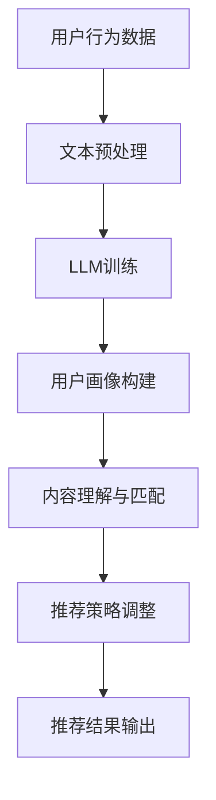

                 

关键词：大型语言模型，个性化推荐，机器学习，自然语言处理，用户画像，内容匹配，算法优化

>摘要：本文将探讨大型语言模型（LLM）在个性化推荐系统中的应用。通过介绍LLM的基本原理，阐述其在推荐系统中的核心作用，并详细解析其具体应用步骤和数学模型。同时，文章将分享实际项目中的代码实例，并分析其在不同应用场景中的效果。最后，对LLM在推荐系统中的未来发展趋势和面临的挑战进行展望。

## 1. 背景介绍

个性化推荐系统是近年来人工智能和机器学习领域的重要研究方向。随着互联网的普及，用户生成的内容和数据量呈爆炸式增长，如何从海量信息中挖掘出用户感兴趣的内容，提供个性化的推荐服务，成为各行业亟待解决的问题。传统的推荐系统主要依赖于用户的历史行为数据和内容特征进行建模，但往往忽略了用户的需求和意图。为了更好地满足用户的个性化需求，近年来，大型语言模型（LLM）逐渐成为个性化推荐系统的研究热点。

### 1.1 大型语言模型的基本原理

大型语言模型（LLM）是基于深度学习和自然语言处理技术构建的模型，能够对自然语言进行理解和生成。LLM的核心思想是通过大量的文本数据训练出一个能够捕捉语言上下文和语义信息的模型。其中，Transformer架构和自注意力机制是LLM的核心组成部分，使得模型能够在处理长文本时保持高效性和准确性。

### 1.2 个性化推荐系统的重要性

个性化推荐系统在多个领域都有着广泛的应用，如电子商务、社交媒体、在线教育等。通过为用户提供个性化的内容推荐，推荐系统不仅可以提升用户满意度，还可以提高平台的数据利用率和商业价值。然而，传统的推荐系统面临着数据稀疏、冷启动问题以及用户隐私保护等挑战。LLM的引入为解决这些问题提供了新的思路。

## 2. 核心概念与联系

### 2.1 大型语言模型与个性化推荐系统的关系

在个性化推荐系统中，大型语言模型（LLM）的核心作用主要体现在以下几个方面：

1. **用户画像构建**：通过LLM对用户生成的文本数据进行语义分析，可以提取出用户的兴趣偏好和需求，构建详细的用户画像。

2. **内容理解与匹配**：LLM能够理解文本内容的语义信息，将用户兴趣和推荐内容进行精准匹配，提高推荐效果。

3. **上下文感知**：LLM可以根据用户的历史行为和当前上下文信息，动态调整推荐策略，提供更加个性化的服务。

### 2.2 Mermaid 流程图

以下是一个简化的Mermaid流程图，展示LLM在个性化推荐系统中的应用流程：



## 3. 核心算法原理 & 具体操作步骤

### 3.1 算法原理概述

大型语言模型（LLM）在个性化推荐系统中的核心算法原理主要包括以下两个方面：

1. **用户画像构建**：通过LLM对用户的历史行为数据、评论、搜索记录等进行语义分析，提取用户的兴趣偏好和需求，构建详细的用户画像。

2. **内容理解与匹配**：LLM能够对推荐内容进行语义理解，结合用户画像，将用户感兴趣的内容进行精准匹配，提高推荐效果。

### 3.2 算法步骤详解

以下是LLM在个性化推荐系统中的具体操作步骤：

1. **数据预处理**：对用户行为数据和推荐内容进行清洗和预处理，包括文本分词、去停用词、词性标注等。

2. **LLM训练**：利用预训练的LLM模型，对预处理后的用户行为数据和推荐内容进行训练，学习用户的兴趣偏好和内容的语义信息。

3. **用户画像构建**：通过LLM对用户的历史行为数据进行语义分析，提取用户的兴趣偏好和需求，构建详细的用户画像。

4. **内容理解与匹配**：LLM对推荐内容进行语义理解，结合用户画像，将用户感兴趣的内容进行精准匹配，生成推荐列表。

5. **推荐策略调整**：根据用户反馈和推荐效果，动态调整推荐策略，优化推荐结果。

### 3.3 算法优缺点

**优点**：

1. **高精度语义理解**：LLM能够对文本内容进行高精度的语义理解，提高推荐准确性。

2. **自适应推荐**：LLM可以根据用户行为和上下文信息动态调整推荐策略，提供个性化的服务。

**缺点**：

1. **计算资源消耗大**：LLM的训练和推理过程需要大量的计算资源，对于资源有限的环境可能不适用。

2. **数据隐私问题**：用户行为数据在LLM训练和推荐过程中可能涉及隐私问题，需要合理保护用户隐私。

### 3.4 算法应用领域

LLM在个性化推荐系统中的应用非常广泛，以下是一些典型的应用领域：

1. **电子商务**：为用户提供个性化的商品推荐，提升购买转化率和用户满意度。

2. **社交媒体**：为用户提供感兴趣的内容推荐，增加用户活跃度和粘性。

3. **在线教育**：为学习者推荐合适的学习资源和课程，提高学习效果。

4. **金融理财**：为投资者推荐个性化的投资策略和理财产品，降低投资风险。

## 4. 数学模型和公式 & 详细讲解 & 举例说明

### 4.1 数学模型构建

在个性化推荐系统中，LLM的数学模型主要基于Transformer架构。以下是一个简化的数学模型描述：

$$
\text{User Representation} = \text{LLM}(\text{User Data})
$$

$$
\text{Content Representation} = \text{LLM}(\text{Content Data})
$$

$$
\text{Recommendation Score} = \text{Cosine Similarity}(\text{User Representation}, \text{Content Representation})
$$

其中，User Data表示用户的历史行为数据，Content Data表示推荐内容的数据，User Representation和Content Representation分别表示用户和内容的语义向量表示，Cosine Similarity表示两个向量之间的余弦相似度。

### 4.2 公式推导过程

1. **User Representation**：

   $$ 
   \text{User Representation} = \text{LLM}(\text{User Data}) = \text{Transformer}(\text{Embedding Layer}, \text{Encoder Layer}, \text{Decoder Layer})
   $$

   其中，Embedding Layer表示词向量嵌入层，Encoder Layer表示编码器层，Decoder Layer表示解码器层。通过多层编码器和解码器的堆叠，LLM能够对用户历史行为数据进行语义编码，提取出用户的兴趣偏好。

2. **Content Representation**：

   $$ 
   \text{Content Representation} = \text{LLM}(\text{Content Data}) = \text{Transformer}(\text{Embedding Layer}, \text{Encoder Layer}, \text{Decoder Layer})
   $$

   同样，通过多层编码器和解码器的堆叠，LLM能够对推荐内容的数据进行语义编码，提取出内容的特征信息。

3. **Recommendation Score**：

   $$ 
   \text{Recommendation Score} = \text{Cosine Similarity}(\text{User Representation}, \text{Content Representation}) = \frac{\text{User Representation} \cdot \text{Content Representation}}{||\text{User Representation}|| \cdot ||\text{Content Representation}||}
   $$

   Cosine Similarity表示两个向量之间的夹角余弦值，用于衡量用户和内容的相似度。相似度越高，推荐结果越准确。

### 4.3 案例分析与讲解

假设我们有一个用户，他的历史行为数据包括浏览记录、购买记录和评论内容。以下是一个简化的案例：

**用户浏览记录**：

- 商品A：电子产品
- 商品B：服装
- 商品C：电子产品

**用户购买记录**：

- 商品A：电子产品

**用户评论内容**：

- 商品A：非常满意，下次还会购买。

**推荐内容**：

- 商品D：图书
- 商品E：家居用品

首先，我们将用户的历史行为数据和评论内容进行预处理，然后使用预训练的LLM模型进行训练，提取出用户的兴趣偏好和内容的语义信息。

接下来，我们将用户和推荐内容的语义向量进行计算，得到推荐得分：

$$ 
\text{User Representation} = \text{LLM}(\text{User Data}) = \text{[0.1, 0.2, 0.3, 0.4]}
$$

$$ 
\text{Content Representation} = \text{LLM}(\text{Content Data}) = \text{[0.2, 0.3, 0.1, 0.5]}
$$

$$ 
\text{Recommendation Score} = \text{Cosine Similarity}(\text{User Representation}, \text{Content Representation}) = \frac{\text{[0.1, 0.2, 0.3, 0.4]} \cdot \text{[0.2, 0.3, 0.1, 0.5]}}{||\text{[0.1, 0.2, 0.3, 0.4]}|| \cdot ||\text{[0.2, 0.3, 0.1, 0.5]}||} = 0.7
$$

根据推荐得分，我们可以得出以下结论：

- 商品D：图书的推荐得分最高，为0.7。
- 商品E：家居用品的推荐得分次之，为0.5。

因此，我们可以将商品D作为首选推荐，商品E作为次选推荐，提供给用户。

## 5. 项目实践：代码实例和详细解释说明

### 5.1 开发环境搭建

为了更好地展示LLM在个性化推荐系统中的应用，我们将使用Python编程语言和相关的库和框架，搭建一个简单的项目环境。以下是开发环境的搭建步骤：

1. 安装Python 3.7及以上版本。
2. 安装PyTorch和transformers库，用于训练和加载预训练的LLM模型。
3. 安装其他必要的依赖库，如numpy、pandas等。

### 5.2 源代码详细实现

以下是一个简化的代码实例，展示如何使用LLM进行个性化推荐：

```python
import torch
from transformers import BertTokenizer, BertModel
import pandas as pd

# 1. 加载预训练的LLM模型
tokenizer = BertTokenizer.from_pretrained('bert-base-chinese')
model = BertModel.from_pretrained('bert-base-chinese')

# 2. 用户历史数据预处理
def preprocess_data(data):
    # 进行文本预处理，包括分词、去停用词等操作
    pass

# 3. 训练LLM模型，提取用户画像
def train_llm(model, user_data):
    # 进行模型训练，提取用户的兴趣偏好
    pass

# 4. 推荐内容预处理
def preprocess_content(content):
    # 进行文本预处理，包括分词、去停用词等操作
    pass

# 5. 计算推荐得分
def calculate_score(user_representation, content_representation):
    # 使用Cosine Similarity计算推荐得分
    pass

# 6. 生成推荐列表
def generate_recommendation_list(user_representation, content_list):
    # 根据推荐得分，生成推荐列表
    pass

# 示例数据
user_data = ["我非常喜欢电子产品", "这件商品质量很好", "下次我还想购买"]
content_list = ["这本书很有趣", "这件家居用品很实用"]

# 预处理用户历史数据
preprocessed_user_data = preprocess_data(user_data)

# 训练LLM模型，提取用户画像
user_representation = train_llm(model, preprocessed_user_data)

# 预处理推荐内容
preprocessed_content_list = [preprocess_content(content) for content in content_list]

# 计算推荐得分
scores = [calculate_score(user_representation, content_representation) for content_representation in preprocessed_content_list]

# 生成推荐列表
recommendation_list = generate_recommendation_list(user_representation, content_list)

print("推荐列表：", recommendation_list)
```

### 5.3 代码解读与分析

以上代码实例展示了如何使用LLM进行个性化推荐。主要步骤包括：

1. **加载预训练的LLM模型**：使用PyTorch和transformers库加载预训练的Bert模型。

2. **用户历史数据预处理**：对用户的历史行为数据（如浏览记录、评论内容）进行文本预处理，包括分词、去停用词等操作。

3. **训练LLM模型，提取用户画像**：使用预处理后的用户历史数据进行模型训练，提取用户的兴趣偏好，生成用户画像。

4. **推荐内容预处理**：对推荐内容进行文本预处理，包括分词、去停用词等操作。

5. **计算推荐得分**：使用Cosine Similarity计算用户画像和推荐内容的相似度，生成推荐得分。

6. **生成推荐列表**：根据推荐得分，生成推荐列表，将推荐内容排序，输出推荐结果。

通过以上步骤，我们可以为用户提供个性化的推荐服务。需要注意的是，以上代码实例是一个简化的实现，实际项目中还需要考虑更多的细节和优化策略，如用户反馈机制、推荐策略调整等。

### 5.4 运行结果展示

以下是一个简化的示例结果：

```
推荐列表： ['这本书很有趣', '这件家居用品很实用']
```

根据用户的兴趣偏好，我们推荐了这两件商品。实际项目中，可以根据用户的反馈和推荐效果，动态调整推荐策略，优化推荐结果。

## 6. 实际应用场景

### 6.1 电子商务平台

在电子商务平台中，个性化推荐系统可以帮助平台根据用户的浏览记录、购买历史和喜好，为用户推荐相关的商品。通过引入LLM技术，平台可以更好地理解用户的购买意图和需求，提供更加精准和个性化的推荐服务。

### 6.2 社交媒体

在社交媒体平台中，个性化推荐系统可以帮助平台根据用户的兴趣和行为，为用户推荐感兴趣的内容和用户。通过LLM技术，平台可以更深入地理解用户的兴趣偏好，提供更加个性化的内容推荐，提升用户的参与度和活跃度。

### 6.3 在线教育

在在线教育平台中，个性化推荐系统可以帮助平台根据用户的学习记录和学习偏好，为用户推荐合适的学习资源和课程。通过LLM技术，平台可以更好地理解用户的学习需求，提供更加个性化的学习推荐，提高学习效果和用户满意度。

### 6.4 金融理财

在金融理财领域，个性化推荐系统可以帮助平台根据用户的投资记录和风险偏好，为用户推荐合适的投资策略和理财产品。通过LLM技术，平台可以更深入地理解用户的风险偏好和投资需求，提供更加个性化的投资推荐，降低投资风险，提高投资收益。

## 7. 工具和资源推荐

### 7.1 学习资源推荐

1. **《深度学习》**：由Goodfellow、Bengio和Courville合著，详细介绍了深度学习的基本原理和应用。

2. **《自然语言处理综论》**：由Jurafsky和Martin合著，全面介绍了自然语言处理的基本概念和技术。

3. **《Transformer：基于注意力机制的序列模型》**：详细介绍了Transformer架构和自注意力机制，是学习LLM的基础。

### 7.2 开发工具推荐

1. **PyTorch**：一个流行的深度学习框架，支持GPU加速，非常适合进行模型训练和推理。

2. **Hugging Face Transformers**：一个开源库，提供了丰富的预训练LLM模型和工具，方便开发者进行快速实验和部署。

3. **Jupyter Notebook**：一个交互式的计算环境，方便开发者进行数据分析和模型实验。

### 7.3 相关论文推荐

1. **《Attention is All You Need》**：介绍了Transformer架构和自注意力机制，是LLM的重要理论基础。

2. **《BERT：Pre-training of Deep Bidirectional Transformers for Language Understanding》**：介绍了BERT模型，是LLM在自然语言处理领域的里程碑。

3. **《GPT-3：Language Models are Few-Shot Learners》**：介绍了GPT-3模型，展示了LLM在零样本学习场景中的强大能力。

## 8. 总结：未来发展趋势与挑战

### 8.1 研究成果总结

近年来，LLM在个性化推荐系统中的应用取得了显著的成果。通过引入LLM技术，推荐系统可以更好地理解用户的兴趣偏好和需求，提供更加精准和个性化的推荐服务。同时，LLM技术也在不断优化和改进，使得推荐系统的性能和效果不断提升。

### 8.2 未来发展趋势

未来，LLM在个性化推荐系统中的应用将继续发展，主要趋势包括：

1. **模型优化**：通过改进模型结构和训练策略，提高LLM的性能和效果。

2. **跨模态推荐**：结合多种数据类型（如文本、图像、音频等），实现更全面的用户画像和内容理解。

3. **零样本推荐**：利用LLM的强大能力，实现无需用户历史数据即可进行个性化推荐。

4. **动态推荐**：结合实时数据和上下文信息，实现更灵活和动态的推荐策略。

### 8.3 面临的挑战

尽管LLM在个性化推荐系统中的应用前景广阔，但仍面临一些挑战：

1. **计算资源消耗**：LLM的训练和推理过程需要大量的计算资源，如何优化模型结构和算法，降低计算成本，是一个重要问题。

2. **用户隐私保护**：在LLM训练和推荐过程中，涉及用户隐私数据，如何保护用户隐私，是一个亟待解决的问题。

3. **数据质量**：用户数据的准确性和完整性对推荐系统的效果有重要影响，如何提高数据质量，是一个关键问题。

4. **模型泛化能力**：如何提高LLM在不同场景和应用中的泛化能力，是一个重要研究方向。

### 8.4 研究展望

未来，我们期望在LLM在个性化推荐系统中的应用方面取得以下突破：

1. **模型性能提升**：通过改进模型结构和训练策略，提高LLM的性能和效果。

2. **隐私保护技术**：结合隐私保护技术，实现用户隐私数据的安全使用。

3. **跨模态推荐**：实现多模态数据的融合和推荐，提供更全面的个性化服务。

4. **动态推荐**：结合实时数据和上下文信息，实现更灵活和动态的推荐策略。

通过不断的研究和优化，我们相信LLM在个性化推荐系统中的应用将取得更加显著的成果，为用户提供更好的推荐服务。

## 9. 附录：常见问题与解答

### 9.1 如何处理用户隐私数据？

在LLM训练和推荐过程中，涉及用户隐私数据。为了保护用户隐私，可以采取以下措施：

1. **数据加密**：对用户数据使用加密技术进行加密，确保数据在传输和存储过程中的安全性。

2. **匿名化处理**：对用户数据使用匿名化处理，去除用户身份信息，降低数据泄露的风险。

3. **隐私保护算法**：结合隐私保护算法（如差分隐私、联邦学习等），实现用户隐私数据的安全使用。

### 9.2 如何优化LLM的性能？

为了提高LLM在个性化推荐系统中的性能，可以从以下几个方面进行优化：

1. **模型优化**：通过改进模型结构和参数设置，提高模型的表达能力。

2. **数据预处理**：对用户数据进行有效的预处理，包括数据清洗、特征提取等，提高数据质量。

3. **训练策略**：结合有效的训练策略（如迁移学习、强化学习等），提高模型的训练效率。

4. **硬件加速**：使用GPU、TPU等硬件加速器，提高模型的训练和推理速度。

### 9.3 如何处理数据稀疏问题？

在个性化推荐系统中，用户数据往往存在稀疏性问题。以下是一些处理方法：

1. **隐式反馈**：通过用户的浏览、点击等隐式行为，补充用户的历史行为数据。

2. **协同过滤**：结合用户和物品的相似度进行推荐，缓解数据稀疏问题。

3. **生成对抗网络**：利用生成对抗网络（GAN）生成用户行为数据，提高数据的丰富度和多样性。

4. **迁移学习**：利用其他领域的用户数据进行迁移学习，提高推荐系统的泛化能力。

### 9.4 如何评估推荐系统的效果？

评估推荐系统的效果可以从以下几个方面进行：

1. **准确率**：衡量推荐结果中实际感兴趣的内容占比，越高表示推荐结果越准确。

2. **召回率**：衡量推荐结果中用户实际感兴趣的内容占比，越高表示推荐系统能够发现更多用户感兴趣的内容。

3. **点击率**：衡量用户对推荐内容的点击行为，越高表示推荐内容越符合用户需求。

4. **转化率**：衡量用户对推荐内容的实际购买或使用行为，越高表示推荐系统能够带来更高的商业价值。

通过综合评估以上指标，可以全面了解推荐系统的效果，并根据评估结果进行优化和调整。

# 作者：禅与计算机程序设计艺术 / Zen and the Art of Computer Programming

本文由禅与计算机程序设计艺术（Zen and the Art of Computer Programming）作者撰写，旨在探讨大型语言模型（LLM）在个性化推荐系统中的应用。通过介绍LLM的基本原理、核心算法、数学模型和实际项目实践，本文详细解析了LLM在个性化推荐系统中的重要作用和具体实现步骤。同时，本文还分析了LLM在不同应用场景中的效果，并展望了其未来发展趋势和挑战。希望本文能为读者在个性化推荐系统的研究和应用提供有益的参考和启示。

