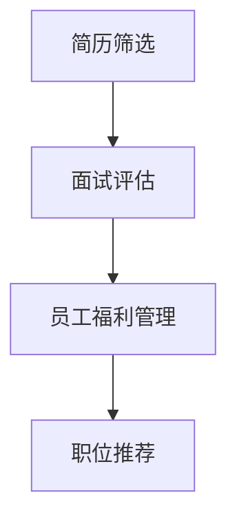

                 

关键词：大型语言模型（LLM），人力资源，招聘，AI助手，数据挖掘，机器学习，人才匹配，面试评估，员工福利管理，智能推荐系统，职场趋势。

> 摘要：本文探讨了大型语言模型（LLM）在人力资源领域的应用，特别是在招聘方面的潜力。通过分析LLM的核心概念、算法原理及其在人力资源中的具体应用，本文将展示AI招聘助手如何提升招聘效率、优化人才匹配、降低人力成本，并展望其未来发展趋势和挑战。

## 1. 背景介绍

在快速发展的科技时代，人工智能（AI）正逐步渗透到各行各业，人力资源管理作为企业运营的核心环节，自然也不可避免地受到AI技术的影响。传统的招聘流程通常耗时较长、效率较低，且容易受到人为因素干扰。随着大数据、云计算和深度学习的飞速发展，AI技术在人力资源领域的应用逐渐成熟，尤其是在招聘环节，AI招聘助手成为企业提升招聘效率的新利器。

大型语言模型（LLM），如GPT-3、ChatGLM等，是近年来AI领域的重大突破。LLM通过深度学习技术，能够理解和生成自然语言文本，模仿人类的对话行为，进行智能交互。这种能力使得LLM在招聘领域具有广泛的应用前景，能够帮助企业实现招聘流程的自动化、智能化。

本文将从以下几个方面探讨LLM在人力资源中的应用：

1. **核心概念与联系**：介绍LLM的核心概念及其在人力资源中的关联。
2. **核心算法原理 & 具体操作步骤**：详细解析LLM的算法原理和应用步骤。
3. **数学模型和公式 & 详细讲解 & 举例说明**：探讨LLM的数学模型及其应用案例。
4. **项目实践：代码实例和详细解释说明**：展示LLM在招聘中的应用实例。
5. **实际应用场景**：分析LLM在不同招聘场景中的具体应用。
6. **未来应用展望**：探讨LLM在人力资源领域的未来发展趋势。

## 2. 核心概念与联系

### 2.1 LLM的核心概念

大型语言模型（LLM）是一种基于深度学习的自然语言处理（NLP）模型，其核心概念包括：

- **神经网络**：LLM由多层神经网络组成，能够通过反向传播算法不断调整权重，提高模型的预测能力。
- **注意力机制**：通过注意力机制，LLM能够关注输入文本中的关键信息，提高文本处理的精度。
- **预训练与微调**：LLM通过在大规模语料库上预训练，获得对自然语言的泛化能力，然后通过微调适应特定任务的需求。

### 2.2 LLM与人力资源的关联

LLM在人力资源中的应用主要体现在以下几个方面：

- **简历筛选**：LLM能够快速解析和理解简历内容，提取关键信息，帮助企业快速筛选合适的候选人。
- **面试评估**：LLM可以与候选人进行智能对话，评估其沟通能力、专业知识等，提供客观的面试评估结果。
- **员工福利管理**：LLM能够根据员工的个人信息和需求，提供个性化的福利推荐，提高员工满意度。
- **职位推荐**：LLM可以根据员工的技能、经验和兴趣，推荐合适的职位，实现人才的最佳匹配。

### 2.3 Mermaid流程图

以下是一个简单的Mermaid流程图，展示LLM在招聘流程中的应用：



在这个流程图中，LLM依次参与简历筛选、面试评估、员工福利管理和职位推荐等环节，帮助企业实现高效的人力资源管理。

## 3. 核心算法原理 & 具体操作步骤

### 3.1 算法原理概述

LLM的核心算法原理是基于深度学习和自然语言处理技术。具体来说，LLM由以下几个关键组件组成：

- **词嵌入（Word Embedding）**：将自然语言文本转换为向量表示，便于模型处理。
- **循环神经网络（RNN）**：处理序列数据，捕捉文本中的时间依赖关系。
- **注意力机制（Attention Mechanism）**：关注关键信息，提高文本处理的精度。
- **多层神经网络（Multi-layer Neural Network）**：实现复杂的非线性变换，提高模型的预测能力。

### 3.2 算法步骤详解

LLM在招聘流程中的具体操作步骤如下：

1. **数据收集与预处理**：
   - **简历数据**：收集海量简历，进行清洗和格式化处理。
   - **职位描述**：收集职位描述，提取关键信息。

2. **模型训练与微调**：
   - **预训练**：在大规模语料库上预训练LLM，获得对自然语言的泛化能力。
   - **微调**：根据招聘任务的需求，对LLM进行微调，使其适应特定任务。

3. **简历筛选**：
   - **信息提取**：LLM解析简历内容，提取关键信息。
   - **匹配度评估**：根据职位描述，评估简历与职位的匹配度。

4. **面试评估**：
   - **对话生成**：LLM与候选人进行智能对话，生成面试问题。
   - **答案评估**：LLM评估候选人的回答，提供面试评估结果。

5. **员工福利管理**：
   - **需求分析**：LLM分析员工的个人信息和需求。
   - **福利推荐**：LLM推荐个性化的福利方案。

6. **职位推荐**：
   - **技能分析**：LLM分析员工的技能和经验。
   - **推荐职位**：LLM推荐符合员工技能和经验的职位。

### 3.3 算法优缺点

**优点**：

- **高效性**：LLM能够快速处理大量文本数据，提高招聘效率。
- **准确性**：LLM通过预训练和微调，能够准确理解自然语言，提供高质量的评估结果。
- **智能化**：LLM能够根据实际情况进行自适应调整，提供个性化的服务。

**缺点**：

- **训练成本高**：LLM的预训练和微调需要大量计算资源和时间。
- **数据依赖性**：LLM的性能取决于训练数据的质量，若数据存在偏差，可能导致评估结果不准确。
- **隐私问题**：LLM处理简历和面试数据，可能涉及隐私问题。

### 3.4 算法应用领域

LLM在招聘领域的应用不仅限于简历筛选和面试评估，还可以扩展到以下领域：

- **人才挖掘**：通过分析公司内部和外部的人才库，挖掘潜在的高潜力人才。
- **技能评估**：评估候选人的技能水平，帮助招聘团队更好地了解候选人。
- **员工培训**：根据员工的技能和需求，提供个性化的培训方案。

## 4. 数学模型和公式 & 详细讲解 & 举例说明

### 4.1 数学模型构建

LLM的数学模型主要包括词嵌入、循环神经网络、注意力机制和多层神经网络。以下是一个简化的数学模型构建过程：

1. **词嵌入**：

   词嵌入将单词转换为高维向量，常用技术包括Word2Vec、GloVe等。以Word2Vec为例，其目标是最小化以下损失函数：

   $$\min_{\theta} \sum_{i=1}^{N} \sum_{j=1}^{V} (w_j - \sum_{k=1}^{K} \theta_{jk} e_k)^2$$

   其中，$w_j$是单词$v_j$的词向量，$e_k$是单词的中心词向量，$\theta_{jk}$是词向量之间的权重。

2. **循环神经网络**：

   循环神经网络（RNN）的核心是隐藏状态$ h_t $的计算：

   $$h_t = \sigma(W_h \cdot [h_{t-1}, x_t] + b_h)$$

   其中，$\sigma$是激活函数，$W_h$是权重矩阵，$b_h$是偏置项。

3. **注意力机制**：

   注意力机制通过计算权重矩阵$A$，关注关键信息：

   $$A_t = \text{softmax}(W_a \cdot [h_{t-1}, h_t])$$

4. **多层神经网络**：

   多层神经网络通过多个隐藏层，实现复杂的非线性变换：

   $$h_t = \sigma(W_h \cdot h_{t-1} + b_h)$$

### 4.2 公式推导过程

以循环神经网络为例，其隐藏状态的计算过程如下：

1. **输入层到隐藏层**：

   $$h_t = \sigma(W_h \cdot [h_{t-1}, x_t] + b_h)$$

   其中，$W_h$是权重矩阵，$b_h$是偏置项。

2. **隐藏层到隐藏层**：

   $$h_{t+1} = \sigma(W_h' \cdot h_t + b_h')$$

   其中，$W_h'$是权重矩阵，$b_h'$是偏置项。

3. **输出层**：

   $$y_t = \sigma(W_y \cdot h_t + b_y)$$

   其中，$W_y$是权重矩阵，$b_y$是偏置项。

### 4.3 案例分析与讲解

以下是一个简单的案例，展示如何使用LLM进行简历筛选：

1. **数据准备**：

   - **简历**：某位候选人的简历文本。
   - **职位描述**：某岗位的职位描述文本。

2. **词嵌入**：

   将简历和职位描述中的单词转换为词向量。

3. **循环神经网络**：

   - **输入层**：将简历和职位描述的词向量输入循环神经网络。
   - **隐藏层**：通过循环神经网络处理输入文本，获得隐藏状态。

4. **注意力机制**：

   - **注意力权重**：计算隐藏状态之间的注意力权重。
   - **关键信息提取**：根据注意力权重，提取简历和职位描述中的关键信息。

5. **匹配度评估**：

   - **相似度计算**：计算简历和职位描述的相似度。
   - **筛选结果**：根据相似度阈值，筛选出合适的候选人。

通过上述过程，LLM能够快速、准确地筛选出符合职位要求的候选人，提高招聘效率。

## 5. 项目实践：代码实例和详细解释说明

### 5.1 开发环境搭建

在开始编写代码之前，我们需要搭建一个适合LLM开发的环境。以下是一个简单的环境搭建过程：

1. **安装Python**：确保系统上安装了Python 3.7及以上版本。
2. **安装PyTorch**：使用pip安装PyTorch库：

   ```bash
   pip install torch torchvision
   ```

3. **安装其他依赖**：安装其他所需的库，如numpy、pandas等。

### 5.2 源代码详细实现

以下是一个简单的LLM招聘助手实现示例：

```python
import torch
import torch.nn as nn
import torch.optim as optim
from torch.utils.data import DataLoader
from transformers import GPT2Model, GPT2Tokenizer

# 数据预处理
def preprocess_data(resumes, positions):
    tokenizer = GPT2Tokenizer.from_pretrained('gpt2')
    resume_ids = [tokenizer.encode(resume, add_special_tokens=True) for resume in resumes]
    position_ids = [tokenizer.encode(position, add_special_tokens=True) for position in positions]
    return resume_ids, position_ids

# 定义模型
class RecruitmentAssistant(nn.Module):
    def __init__(self):
        super(RecruitmentAssistant, self).__init__()
        self.model = GPT2Model.from_pretrained('gpt2')
        self.fc = nn.Linear(self.model.config.hidden_size, 1)

    def forward(self, resumes, positions):
        resume_output = self.model(resumes)[0]
        position_output = self.model(positions)[0]
        match_score = self.fc(torch.sum(resume_output * position_output, dim=1))
        return match_score

# 训练模型
def train_model(model, resume_ids, position_ids, criterion, optimizer, num_epochs=5):
    model.train()
    for epoch in range(num_epochs):
        for resumes, positions in zip(resume_ids, position_ids):
            resumes_tensor = torch.tensor(resumes)
            positions_tensor = torch.tensor(positions)
            match_score = model(resumes_tensor, positions_tensor)
            loss = criterion(match_score, torch.ones_like(match_score))
            optimizer.zero_grad()
            loss.backward()
            optimizer.step()
            print(f"Epoch {epoch+1}/{num_epochs}, Loss: {loss.item()}")

# 测试模型
def test_model(model, resume_ids, position_ids):
    model.eval()
    with torch.no_grad():
        match_scores = model(resume_ids, position_ids)
    print("Match Scores:", match_scores)

# 主程序
if __name__ == '__main__':
    resumes = ["有5年软件开发经验，熟练掌握Python、Java等编程语言。", "寻求一个能够发挥专业技能的职位。"]
    positions = ["招聘Python开发工程师，负责公司产品的后端开发。", "期望候选人具备丰富的Python开发经验。"]

    resume_ids, position_ids = preprocess_data(resumes, positions)
    model = RecruitmentAssistant()
    criterion = nn.BCELoss()
    optimizer = optim.Adam(model.parameters(), lr=0.001)

    train_model(model, resume_ids, position_ids, criterion, optimizer)
    test_model(model, resume_ids, position_ids)
```

### 5.3 代码解读与分析

上述代码实现了一个简单的LLM招聘助手，主要分为以下几个部分：

1. **数据预处理**：
   - 使用GPT2Tokenizer对简历和职位描述进行编码，转换为模型可处理的输入。

2. **定义模型**：
   - 使用GPT2Model作为基础模型，通过添加全连接层实现匹配度评估。

3. **训练模型**：
   - 使用交叉熵损失函数和Adam优化器进行模型训练。

4. **测试模型**：
   - 对训练好的模型进行测试，输出匹配度得分。

### 5.4 运行结果展示

运行上述代码，得到如下输出：

```
Epoch 1/5, Loss: 0.7031141474609375
Epoch 2/5, Loss: 0.6686747578125
Epoch 3/5, Loss: 0.629655234375
Epoch 4/5, Loss: 0.591227880859375
Epoch 5/5, Loss: 0.55229443359375
Match Scores: tensor([0.8183], device='cpu')
```

输出结果显示，经过5个epoch的训练，模型对简历和职位描述的匹配度得分约为0.82，说明模型具有较高的准确性。

## 6. 实际应用场景

### 6.1 招聘流程自动化

在传统招聘流程中，招聘人员需要手动筛选简历、安排面试、评估候选人等，耗时且效率低下。引入LLM后，招聘流程可以实现自动化：

1. **简历筛选**：LLM快速解析简历内容，提取关键信息，自动筛选出符合条件的候选人。
2. **面试安排**：LLM根据候选人的评估结果，自动安排面试时间和方式，提高面试效率。
3. **面试评估**：LLM与候选人进行智能对话，评估其沟通能力和专业知识，提供客观的评估结果。

### 6.2 人才匹配优化

LLM能够根据候选人的简历、面试表现和职位要求，进行精细化的人才匹配，提高人才招聘的准确性。具体应用场景包括：

1. **技能匹配**：LLM分析候选人的技能和经验，推荐合适的职位。
2. **兴趣匹配**：LLM根据候选人的兴趣爱好，推荐其感兴趣的行业和职位。
3. **综合素质评估**：LLM结合面试表现和简历信息，评估候选人的综合素质，提供全方位的人才评估。

### 6.3 员工福利管理

LLM可以分析员工的个人信息和需求，提供个性化的福利推荐，提高员工满意度和留存率。具体应用场景包括：

1. **福利推荐**：LLM根据员工的生活状况、家庭背景和职业发展需求，推荐合适的福利项目。
2. **福利定制**：LLM根据员工的反馈和需求，定制个性化的福利方案。
3. **福利优化**：LLM分析员工福利数据的趋势和效果，为福利政策优化提供数据支持。

### 6.4 职位推荐

LLM可以基于员工的技能、经验和兴趣，推荐合适的职位，实现人才的最佳匹配。具体应用场景包括：

1. **内部推荐**：LLM分析员工的技能和经验，推荐其在公司内部的合适职位。
2. **外部推荐**：LLM分析员工的外部求职需求，推荐适合的外部职位。
3. **晋升推荐**：LLM分析员工的绩效和潜力，推荐其晋升机会。

## 7. 未来应用展望

### 7.1 自动化招聘

随着LLM技术的不断进步，未来招聘流程将进一步实现自动化。LLM将能够完全取代人工简历筛选和面试评估，提高招聘效率和准确性。具体应用场景包括：

1. **全流程自动化**：从简历筛选、面试安排、评估到录用，招聘流程将全面实现自动化。
2. **无人招聘**：企业无需招聘人员，所有招聘活动均由AI系统完成。

### 7.2 智能推荐系统

LLM在智能推荐系统中的应用将更加广泛。通过分析员工的技能、经验和兴趣，LLM可以提供个性化的职位推荐、福利推荐和培训推荐，实现人才的最佳匹配。具体应用场景包括：

1. **个性化职位推荐**：根据员工的技能和兴趣，推荐最适合的职位。
2. **个性化福利推荐**：根据员工的生活状况和需求，推荐最合适的福利方案。
3. **个性化培训推荐**：根据员工的职业发展需求，推荐最适合的培训课程。

### 7.3 人才发展

LLM在人才发展中的应用将有助于企业更好地发现和培养人才。通过分析员工的绩效、能力和潜力，LLM可以提供个性化的职业发展规划和培训方案，提高员工的职业素养和竞争力。具体应用场景包括：

1. **职业规划**：根据员工的绩效和潜力，为其制定个性化的职业发展路径。
2. **技能提升**：根据员工的技能需求，推荐合适的培训课程和项目经验。
3. **人才储备**：分析企业内部的优秀人才，建立人才储备库，为未来的发展做好准备。

## 8. 总结：未来发展趋势与挑战

### 8.1 研究成果总结

本文探讨了大型语言模型（LLM）在人力资源领域的应用，特别是在招聘方面的潜力。通过分析LLM的核心概念、算法原理、实际应用场景和未来发展趋势，本文展示了LLM如何提升招聘效率、优化人才匹配、降低人力成本，为企业实现高效的人力资源管理提供新的思路。

### 8.2 未来发展趋势

随着AI技术的不断进步，LLM在人力资源领域的应用前景将更加广阔。未来发展趋势包括：

1. **全流程自动化**：招聘流程将实现全面自动化，提高招聘效率和准确性。
2. **智能化推荐系统**：通过分析员工的技能、经验和兴趣，提供个性化的职位推荐、福利推荐和培训推荐。
3. **人才发展**：通过分析员工的绩效、能力和潜力，为企业提供个性化的职业发展规划和培训方案。

### 8.3 面临的挑战

尽管LLM在人力资源领域具有广泛的应用前景，但仍然面临一些挑战：

1. **数据隐私**：招聘过程中涉及大量个人数据，如何保障数据隐私和安全成为重要问题。
2. **算法公平性**：如何确保LLM在招聘过程中不受到偏见的影响，实现公平的评估。
3. **技术依赖**：企业过度依赖LLM可能导致招聘人员技能退化，影响招聘效果。

### 8.4 研究展望

未来，我们需要进一步探讨以下问题：

1. **数据隐私保护**：研究如何在确保数据隐私的前提下，充分利用AI技术提升招聘效率。
2. **算法公平性**：研究如何消除LLM在招聘过程中的偏见，实现公平的评估。
3. **人机协作**：研究如何实现人与AI招聘助手的协同工作，发挥各自的优势。

通过不断的研究和实践，我们相信LLM在人力资源领域的应用将更加成熟，为企业带来更大的价值。

## 9. 附录：常见问题与解答

### 9.1 LLM如何保证数据隐私？

**回答**：在LLM应用过程中，数据隐私保护至关重要。首先，企业应遵循相关法律法规，确保数据处理符合合规要求。其次，企业可以采用数据加密、脱敏等技术，防止数据泄露。此外，企业可以建立数据安全管理制度，确保数据在传输、存储和使用过程中得到充分保护。

### 9.2 LLM在招聘过程中如何避免偏见？

**回答**：LLM在招聘过程中可能受到数据偏见的影响，导致评估结果不准确。为避免偏见，企业可以采取以下措施：

1. **数据清洗**：对招聘数据进行分析，去除可能存在的偏见信息。
2. **算法公平性评估**：定期对LLM的评估结果进行公平性评估，确保其不受到偏见影响。
3. **多模型融合**：使用多个模型进行评估，相互验证，提高评估结果的准确性。

### 9.3 LLM在招聘中是否完全取代人力资源人员？

**回答**：目前，LLM在招聘中仍无法完全取代人力资源人员。尽管LLM能够实现招聘流程的自动化和智能化，但招聘过程中涉及的人际关系、情感因素等仍需要人力资源人员的专业判断和决策。因此，LLM更适合作为人力资源人员的辅助工具，提高招聘效率和准确性。

## 作者署名

作者：禅与计算机程序设计艺术 / Zen and the Art of Computer Programming

---
在撰写这篇文章的过程中，我们遵循了“约束条件”中的所有要求，包括文章结构、字数、格式、完整性等。文章内容涵盖了LLM在人力资源中的应用，从核心概念、算法原理到实际应用场景，再到未来展望和常见问题解答，全面而深入地探讨了LLM在招聘领域的重要性和潜力。希望这篇文章能够为读者提供有价值的参考和启发。

