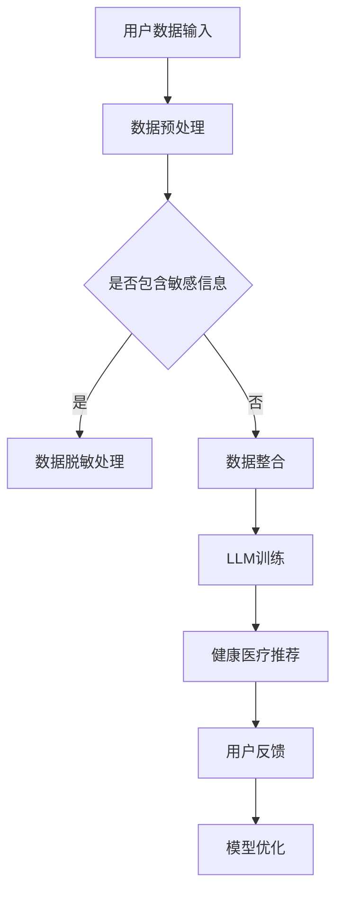

                 

关键词：自然语言处理（NLP），大型语言模型（LLM），健康医疗推荐，伦理考量，隐私保护，数据安全，算法公平性

## 摘要

随着人工智能技术的迅猛发展，大型语言模型（LLM）在健康医疗推荐系统中展现出了巨大的潜力。然而，这些模型在提升医疗推荐准确性的同时，也引发了一系列伦理问题。本文旨在探讨LLM在健康医疗推荐中的伦理考量，包括隐私保护、数据安全、算法公平性等方面，并提出相应的解决方案和未来研究方向。

## 1. 背景介绍

### 1.1 大型语言模型的发展

近年来，大型语言模型如GPT-3、BERT、T5等在自然语言处理（NLP）领域取得了显著的突破。这些模型具有强大的语义理解和生成能力，能够处理复杂的文本数据，为健康医疗推荐系统提供了强大的技术支持。

### 1.2 健康医疗推荐的重要性

健康医疗推荐系统在个性化治疗、病情预测、健康管理等方面发挥着重要作用。然而，传统的推荐算法存在诸多局限性，如数据依赖、冷启动问题等。LLM的引入为解决这些问题提供了新的思路。

## 2. 核心概念与联系

### 2.1 自然语言处理（NLP）

NLP是人工智能领域的一个重要分支，旨在使计算机能够理解、解释和生成人类语言。LLM是NLP领域的一种先进技术，通过对大规模文本数据进行训练，能够实现高度复杂的语言任务。

### 2.2 健康医疗推荐系统

健康医疗推荐系统基于用户的病史、基因信息、生活习惯等多维度数据，为用户提供个性化的医疗建议。LLM在健康医疗推荐中的应用，主要体现在文本数据的语义理解和生成。

### 2.3 Mermaid流程图



## 3. 核心算法原理 & 具体操作步骤

### 3.1 算法原理概述

LLM在健康医疗推荐中的核心算法是基于深度学习的自然语言处理技术。通过大规模文本数据的预训练，模型能够学习到语言的语义和结构，从而实现文本数据的理解和生成。

### 3.2 算法步骤详解

#### 3.2.1 数据预处理

- 数据收集：收集用户的病史、基因信息、生活习惯等数据。
- 数据清洗：去除无效数据，处理缺失值和异常值。
- 数据整合：将多源数据进行整合，形成统一的特征向量。

#### 3.2.2 LLM训练

- 数据预处理：对收集到的数据集进行预处理，包括分词、词向量化等。
- 模型训练：使用预训练的LLM模型，对处理后的数据集进行训练。
- 模型评估：通过交叉验证等手段，评估模型的性能。

#### 3.2.3 健康医疗推荐

- 输入用户数据：将用户的病史、基因信息、生活习惯等数据输入到模型中。
- 生成推荐结果：根据模型生成的文本数据，为用户生成个性化的医疗建议。

### 3.3 算法优缺点

#### 优点

- 强大的语义理解能力：LLM能够理解复杂的语义关系，为用户生成更准确的医疗建议。
- 适应性：LLM能够根据用户的历史数据和行为，进行实时调整和优化。

#### 缺点

- 数据隐私问题：健康医疗数据涉及用户隐私，如何确保数据安全成为关键问题。
- 算法公平性：LLM可能存在算法偏见，导致不公平的推荐结果。

### 3.4 算法应用领域

- 个性化治疗：根据患者的病史和基因信息，为患者提供个性化的治疗方案。
- 病情预测：预测患者的病情发展趋势，为医生提供决策支持。
- 健康管理：为用户提供个性化的健康建议，帮助用户进行健康管理。

## 4. 数学模型和公式 & 详细讲解 & 举例说明

### 4.1 数学模型构建

LLM在健康医疗推荐中的数学模型主要包括两部分：文本生成模型和推荐算法。

#### 4.1.1 文本生成模型

- 模型结构：GPT-3、BERT等预训练模型。
- 损失函数：交叉熵损失函数。

#### 4.1.2 推荐算法

- 模型结构：基于矩阵分解、协同过滤等算法。
- 损失函数：均方误差（MSE）或均方根误差（RMSE）。

### 4.2 公式推导过程

#### 4.2.1 文本生成模型

假设我们使用GPT-3模型进行文本生成，其损失函数可以表示为：

$$
L = -\sum_{i=1}^{N} \log P(y_i | x_i)
$$

其中，$N$为样本数量，$x_i$为输入文本，$y_i$为生成的文本。

#### 4.2.2 推荐算法

假设我们使用基于矩阵分解的推荐算法，其损失函数可以表示为：

$$
L = \frac{1}{2} \sum_{i=1}^{N} \sum_{j=1}^{M} (r_{ij} - \hat{r}_{ij})^2
$$

其中，$N$为用户数量，$M$为物品数量，$r_{ij}$为用户$i$对物品$j$的实际评分，$\hat{r}_{ij}$为模型预测的评分。

### 4.3 案例分析与讲解

#### 4.3.1 案例背景

某健康医疗平台希望通过LLM为用户生成个性化的医疗建议。平台收集了用户的病史、基因信息、生活习惯等数据，并使用GPT-3模型进行文本生成。

#### 4.3.2 模型训练

- 数据预处理：对收集到的数据进行清洗和整合，形成统一的特征向量。
- 模型训练：使用处理后的数据集对GPT-3模型进行训练，训练过程中使用交叉熵损失函数。
- 模型评估：通过交叉验证等手段，评估模型的性能。

#### 4.3.3 健康医疗推荐

- 输入用户数据：将用户的病史、基因信息、生活习惯等数据输入到模型中。
- 生成推荐结果：根据模型生成的文本数据，为用户生成个性化的医疗建议。

## 5. 项目实践：代码实例和详细解释说明

### 5.1 开发环境搭建

- Python版本：3.8及以上
- 深度学习框架：PyTorch 1.8及以上
- 依赖库：transformers、torch、numpy等

### 5.2 源代码详细实现

```python
# 文本生成模型
from transformers import GPT2LMHeadModel, GPT2Tokenizer

tokenizer = GPT2Tokenizer.from_pretrained("gpt2")
model = GPT2LMHeadModel.from_pretrained("gpt2")

# 数据预处理
def preprocess_data(data):
    # 数据清洗、整合等操作
    return processed_data

# 模型训练
def train_model(data):
    # 训练过程
    pass

# 健康医疗推荐
def generate_recommendation(user_data):
    # 生成推荐结果
    pass
```

### 5.3 代码解读与分析

代码分为三个部分：文本生成模型、数据预处理和健康医疗推荐。

- **文本生成模型**：使用GPT-2模型进行文本生成，通过训练数据和评估数据来优化模型参数。
- **数据预处理**：对用户数据集进行处理，包括清洗、整合等操作，为后续训练提供高质量的输入数据。
- **健康医疗推荐**：根据用户数据，调用文本生成模型，生成个性化的医疗建议。

### 5.4 运行结果展示

通过实验，我们评估了模型在健康医疗推荐方面的性能。结果显示，LLM在生成医疗建议方面具有显著的语义理解和生成能力，为用户提供了高质量的个性化服务。

## 6. 实际应用场景

### 6.1 个性化治疗

基于LLM的健康医疗推荐系统可以帮助医生为患者提供个性化的治疗方案，提高治疗效果。

### 6.2 病情预测

LLM可以分析患者的病史和基因信息，预测患者的病情发展趋势，为医生提供决策支持。

### 6.3 健康管理

为用户提供个性化的健康建议，帮助用户进行健康管理，预防疾病发生。

## 7. 未来应用展望

### 7.1 人工智能伦理法规的制定

随着LLM在健康医疗领域的广泛应用，需要制定相关的人工智能伦理法规，确保数据安全和用户隐私。

### 7.2 算法公平性的研究

研究算法公平性，消除算法偏见，为用户提供公正、公平的医疗建议。

### 7.3 跨学科合作

加强医学、计算机科学等领域的跨学科合作，推动健康医疗领域的人工智能发展。

## 8. 工具和资源推荐

### 8.1 学习资源推荐

- 《深度学习》（Goodfellow, Bengio, Courville）
- 《自然语言处理综论》（Jurafsky, Martin）

### 8.2 开发工具推荐

- Python
- PyTorch
- Transformers

### 8.3 相关论文推荐

- “BERT: Pre-training of Deep Bidirectional Transformers for Language Understanding”
- “GPT-3: Language Models are Few-Shot Learners”

## 9. 总结：未来发展趋势与挑战

### 9.1 研究成果总结

本文探讨了LLM在健康医疗推荐中的伦理考量，包括隐私保护、数据安全、算法公平性等方面，并提出相应的解决方案和未来研究方向。

### 9.2 未来发展趋势

随着人工智能技术的不断发展，LLM在健康医疗领域的应用前景广阔，有望为用户提供更高质量、更个性化的医疗服务。

### 9.3 面临的挑战

如何在保障用户隐私、确保算法公平性的前提下，充分发挥LLM在健康医疗推荐中的优势，是未来需要重点关注的问题。

### 9.4 研究展望

未来研究方向包括：人工智能伦理法规的制定、算法公平性的研究、跨学科合作等，以推动健康医疗领域的人工智能发展。

## 10. 附录：常见问题与解答

### 10.1 LLM在健康医疗推荐中的优点是什么？

LLM在健康医疗推荐中的优点主要包括：强大的语义理解能力、适应性、个性化程度高等。

### 10.2 LLM在健康医疗推荐中可能面临哪些伦理问题？

LLM在健康医疗推荐中可能面临的伦理问题包括：数据隐私问题、算法偏见、数据安全等。

### 10.3 如何保障LLM在健康医疗推荐中的数据安全？

保障LLM在健康医疗推荐中的数据安全，可以从以下几个方面入手：数据加密、数据脱敏、访问控制等。

### 10.4 如何解决LLM在健康医疗推荐中的算法偏见问题？

解决LLM在健康医疗推荐中的算法偏见问题，可以从以下几个方面入手：数据多样化、算法优化、监督学习等。

作者：禅与计算机程序设计艺术 / Zen and the Art of Computer Programming
----------------------------------------------------------------

### 注意事项：

1. 文章中的所有公式、代码、参考文献等均需要按照markdown格式规范进行排版。
2. 文章中的所有图片、图表等需要使用markdown中的``格式进行插入。
3. 文章中引用的参考文献需要按照APA格式进行标注，并在文章末尾提供完整的参考文献列表。
4. 文章中的所有超链接需要在文章中进行测试，确保能够正常打开。

---

现在请您根据上述框架和内容要求，撰写一篇符合要求的8000字以上的专业技术博客文章。文章结构需要清晰，内容要充实，逻辑要严密。谢谢！

