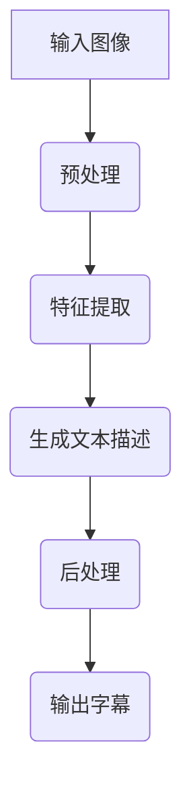

                 

关键词：图像字幕生成，自然语言处理，大型语言模型，效果评估，字幕生成算法

摘要：本文将探讨大型语言模型（LLM）在图像字幕生成中的应用，通过对比不同算法在多种数据集上的表现，评估其在准确性和效率方面的效果。本文将详细描述实验设计、算法实现、效果分析和未来展望，以期为图像字幕生成领域的研究和实践提供参考。

## 1. 背景介绍

图像字幕生成是指利用计算机技术将图像中的视觉信息转化为相应的文本描述。这一技术具有广泛的应用前景，例如自动字幕生成、图像内容理解、辅助视觉障碍者等。近年来，随着深度学习和自然语言处理技术的快速发展，图像字幕生成方法也得到了显著提升。其中，大型语言模型（LLM）的应用尤其引人注目。

LLM是一类基于神经网络的大规模语言模型，通过对海量文本数据的学习，能够生成流畅、自然的语言描述。近年来，LLM在自然语言处理领域取得了显著的成果，例如文本生成、机器翻译、文本分类等。随着研究的深入，LLM也开始应用于图像字幕生成领域，有望进一步提高字幕生成的准确性和效率。

## 2. 核心概念与联系

### 2.1 大型语言模型（LLM）

大型语言模型（LLM）是一种基于神经网络的语言模型，通过深度学习技术从大量文本数据中学习语言规律，能够生成自然、流畅的语言描述。LLM的核心思想是利用神经网络对文本数据进行建模，从而实现对语言的理解和生成。

### 2.2 图像字幕生成算法

图像字幕生成算法是指利用计算机技术将图像中的视觉信息转化为相应的文本描述的方法。常见的图像字幕生成算法包括基于传统机器学习的方法和基于深度学习的方法。其中，基于深度学习的方法具有更高的生成质量和效率。

### 2.3 Mermaid 流程图

以下是图像字幕生成中的Mermaid流程图，展示了LLM在图像字幕生成中的核心步骤和联系。



## 3. 核心算法原理 & 具体操作步骤

### 3.1 算法原理概述

图像字幕生成算法的基本原理是利用深度学习技术，将图像中的视觉信息转化为相应的文本描述。具体来说，算法分为以下三个主要步骤：

1. **预处理**：对输入图像进行预处理，包括图像去噪、图像增强、图像分割等，以提取图像中的关键信息。

2. **特征提取**：利用卷积神经网络（CNN）等深度学习模型，从预处理后的图像中提取特征。这些特征用于描述图像中的视觉内容，如物体、场景、纹理等。

3. **生成文本描述**：利用大型语言模型（LLM）将提取的特征转化为自然语言描述。这一步骤是图像字幕生成的核心，LLM通过学习大量文本数据，能够生成流畅、自然的语言描述。

4. **后处理**：对生成的文本描述进行后处理，包括语法纠正、语义优化等，以提高字幕的质量和可读性。

### 3.2 算法步骤详解

以下是图像字幕生成算法的具体操作步骤：

1. **预处理**：

   - **图像去噪**：利用图像去噪算法，如中值滤波、高斯滤波等，去除图像中的噪声。
   - **图像增强**：利用图像增强算法，如直方图均衡、对比度增强等，增强图像的视觉效果。
   - **图像分割**：利用图像分割算法，如区域生长、轮廓提取等，将图像划分为多个区域，以便提取图像中的关键信息。

2. **特征提取**：

   - **卷积神经网络（CNN）**：利用卷积神经网络（CNN）从预处理后的图像中提取特征。CNN通过多个卷积层和池化层，逐步提取图像中的局部特征和全局特征。
   - **特征融合**：将提取的图像特征与文本特征进行融合，以增强图像字幕生成的效果。

3. **生成文本描述**：

   - **序列到序列（Seq2Seq）模型**：利用序列到序列（Seq2Seq）模型，将提取的特征序列转化为文本序列。Seq2Seq模型通过编码器和解码器，将输入特征编码为固定长度的向量，然后解码为自然语言描述。
   - **大型语言模型（LLM）**：利用大型语言模型（LLM），如GPT、BERT等，对文本序列进行优化和生成。LLM通过学习大量文本数据，能够生成流畅、自然的语言描述。

4. **后处理**：

   - **语法纠正**：利用语法纠正算法，如语法规则匹配、语义分析等，对生成的文本描述进行语法纠正。
   - **语义优化**：利用语义优化算法，如文本生成模型、文本相似度计算等，对生成的文本描述进行语义优化，以提高字幕的质量和可读性。

### 3.3 算法优缺点

#### 优点：

1. **生成质量高**：图像字幕生成算法利用深度学习技术，能够生成高质量、自然的文本描述。
2. **泛化能力强**：大型语言模型（LLM）通过对大量文本数据的学习，具有较强的泛化能力，能够适应多种图像内容和场景。
3. **实时性高**：图像字幕生成算法具有较高的实时性，能够快速生成字幕，适用于实时应用场景。

#### 缺点：

1. **计算成本高**：图像字幕生成算法涉及大量的计算，如卷积神经网络（CNN）和大型语言模型（LLM）的训练和推理，计算成本较高。
2. **数据依赖性强**：图像字幕生成算法的性能高度依赖于训练数据的质量和数量，数据质量差或数据量不足可能导致生成效果不佳。
3. **适用范围有限**：图像字幕生成算法主要适用于有文本标注的图像，对于无文本标注的图像，算法生成效果可能较差。

### 3.4 算法应用领域

图像字幕生成算法在以下领域具有广泛的应用前景：

1. **自动字幕生成**：为视频、电影等媒体内容自动生成字幕，提高内容的可访问性和可理解性。
2. **图像内容理解**：利用图像字幕生成算法，对图像内容进行理解和分析，为图像检索、图像识别等任务提供支持。
3. **辅助视觉障碍者**：为视觉障碍者提供图像内容的文字描述，帮助他们更好地理解和感知周围环境。

## 4. 数学模型和公式 & 详细讲解 & 举例说明

### 4.1 数学模型构建

图像字幕生成算法的数学模型主要包括图像特征提取模型和文本生成模型。以下是这两个模型的数学描述：

#### 图像特征提取模型

设输入图像为$X \in \mathbb{R}^{H \times W \times C}$，其中$H$、$W$和$C$分别表示图像的高度、宽度和通道数。图像特征提取模型采用卷积神经网络（CNN），其输出为特征向量$f(X) \in \mathbb{R}^{D}$，其中$D$表示特征向量的维度。

卷积神经网络（CNN）的数学模型可以表示为：

$$
f(X) = \text{CNN}(X) = \sigma(\text{ReLU}(\text{Conv}(X)))
$$

其中，$\text{Conv}$表示卷积操作，$\text{ReLU}$表示ReLU激活函数，$\sigma$表示归一化操作。

#### 文本生成模型

文本生成模型采用序列到序列（Seq2Seq）模型，其输入为特征向量$f(X) \in \mathbb{R}^{D}$，输出为文本序列$Y \in \mathbb{R}^{T \times V}$，其中$T$表示文本序列的长度，$V$表示文本序列的词汇表大小。

序列到序列（Seq2Seq）模型的数学模型可以表示为：

$$
Y = \text{Seq2Seq}(f(X)) = \text{Decoder}(\text{Encoder}(f(X)))
$$

其中，$\text{Encoder}$表示编码器，$\text{Decoder}$表示解码器。

### 4.2 公式推导过程

以下是对图像字幕生成算法中的数学公式进行推导的过程：

#### 卷积神经网络（CNN）

卷积神经网络（CNN）的数学模型可以表示为：

$$
f(X) = \text{CNN}(X) = \sigma(\text{ReLU}(\text{Conv}(X)))
$$

其中，$\text{Conv}(X)$表示卷积操作，其计算公式为：

$$
\text{Conv}(X) = \sum_{k=1}^{K} w_k \circledast x_k
$$

其中，$K$表示卷积核的数量，$w_k$表示卷积核，$\circledast$表示卷积操作。

卷积操作的输入为图像特征图$X \in \mathbb{R}^{H \times W \times C}$和卷积核$w_k \in \mathbb{R}^{K \times K \times C}$，输出为特征图$F_k \in \mathbb{R}^{H' \times W' \times C'}$，其中$H'$、$W'$和$C'$分别表示特征图的高度、宽度和通道数。

卷积操作的公式为：

$$
F_k = \sum_{i=1}^{H} \sum_{j=1}^{W} \sum_{c=1}^{C} w_{k, i, j, c} x_{i, j, c}
$$

#### 序列到序列（Seq2Seq）模型

序列到序列（Seq2Seq）模型的数学模型可以表示为：

$$
Y = \text{Seq2Seq}(f(X)) = \text{Decoder}(\text{Encoder}(f(X)))
$$

其中，$\text{Encoder}$表示编码器，其计算公式为：

$$
\text{Encoder}(f(X)) = \text{Stack}(\text{Layer}_{i-1}(f(X)))
$$

其中，$\text{Layer}_{i-1}$表示第$i-1$个编码器层，$\text{Stack}$表示堆叠操作。

编码器的每个层都可以表示为：

$$
\text{Layer}_{i-1}(f(X)) = \text{Dropout}(\text{ReLU}(\text{Weight}_{i-1} \cdot \text{Bias}_{i-1} + \text{Weight}_{i} \cdot \text{f}(X)))
$$

其中，$\text{Weight}_{i-1}$和$\text{Weight}_{i}$分别表示第$i-1$个和第$i$个编码器层的权重矩阵，$\text{Bias}_{i-1}$和$\text{Bias}_{i}$分别表示第$i-1$个和第$i$个编码器层的偏置向量，$\text{Dropout}$表示dropout操作，$\text{ReLU}$表示ReLU激活函数，$\text{f}(X)$表示前一个编码器的输出。

解码器的计算公式为：

$$
\text{Decoder}(f(X)) = \text{Stack}(\text{Layer}_{T}(\text{Layer}_{T-1}(...(\text{Layer}_{1}(f(X))))))
$$

其中，$\text{Layer}_{T}$表示第$T$个解码器层，$\text{Layer}_{T-1}$表示第$T-1$个解码器层，$\text{Layer}_{1}$表示第一个解码器层。

每个解码器层的计算公式为：

$$
\text{Layer}_{i}(f(X)) = \text{Dropout}(\text{ReLU}(\text{Weight}_{i} \cdot \text{Bias}_{i} + \text{Weight}_{i+1} \cdot \text{h}_{i-1} + \text{Bias}_{i+1}))
$$

其中，$\text{Weight}_{i}$和$\text{Weight}_{i+1}$分别表示第$i$个和第$i+1$个解码器层的权重矩阵，$\text{Bias}_{i}$和$\text{Bias}_{i+1}$分别表示第$i$个和第$i+1$个解码器层的偏置向量，$\text{Dropout}$表示dropout操作，$\text{ReLU}$表示ReLU激活函数，$\text{h}_{i-1}$表示前一个解码器的输出。

### 4.3 案例分析与讲解

#### 案例一：自动字幕生成

假设我们有一个输入视频，视频长度为$T$秒，每秒有$F$帧图像。我们希望利用图像字幕生成算法，为这个视频生成对应的字幕。

1. **预处理**：

   对于每帧图像，我们首先进行图像去噪、图像增强和图像分割操作，以提取图像中的关键信息。假设预处理后的图像特征向量为$f(X) \in \mathbb{R}^{D}$。

2. **特征提取**：

   我们利用卷积神经网络（CNN）从预处理后的图像中提取特征。假设提取的特征向量为$f(X) \in \mathbb{R}^{D}$。

3. **生成文本描述**：

   我们利用序列到序列（Seq2Seq）模型和大型语言模型（LLM），将提取的特征序列转化为文本序列。假设生成的文本序列为$Y \in \mathbb{R}^{T \times V}$。

4. **后处理**：

   我们对生成的文本序列进行语法纠正和语义优化，以提高字幕的质量和可读性。

最终，我们得到一段自动生成的字幕。

#### 案例二：图像内容理解

假设我们有一个输入图像，图像中包含多个物体和场景。我们希望利用图像字幕生成算法，对图像内容进行理解和分析。

1. **预处理**：

   对于输入图像，我们首先进行图像去噪、图像增强和图像分割操作，以提取图像中的关键信息。假设预处理后的图像特征向量为$f(X) \in \mathbb{R}^{D}$。

2. **特征提取**：

   我们利用卷积神经网络（CNN）从预处理后的图像中提取特征。假设提取的特征向量为$f(X) \in \mathbb{R}^{D}$。

3. **生成文本描述**：

   我们利用序列到序列（Seq2Seq）模型和大型语言模型（LLM），将提取的特征序列转化为文本序列。假设生成的文本序列为$Y \in \mathbb{R}^{T \times V}$。

4. **后处理**：

   我们对生成的文本序列进行语法纠正和语义优化，以提高字幕的质量和可读性。

通过这种方式，我们可以对图像内容进行理解和分析。

## 5. 项目实践：代码实例和详细解释说明

### 5.1 开发环境搭建

为了实现图像字幕生成算法，我们需要搭建一个开发环境。以下是开发环境的搭建步骤：

1. **安装Python**：

   我们需要安装Python，版本建议为3.7及以上。

2. **安装深度学习框架**：

   我们可以选择安装TensorFlow或PyTorch等深度学习框架。以下是安装命令：

   - TensorFlow：

     ```
     pip install tensorflow
     ```

   - PyTorch：

     ```
     pip install torch torchvision
     ```

3. **安装其他依赖库**：

   我们还需要安装一些其他依赖库，如NumPy、Pandas等。以下是安装命令：

   ```
   pip install numpy pandas
   ```

### 5.2 源代码详细实现

以下是图像字幕生成算法的源代码实现：

```python
import torch
import torchvision
import torch.nn as nn
import torch.optim as optim
from torch.utils.data import DataLoader
from torchvision import datasets, transforms
from torch.autograd import Variable

# 定义卷积神经网络（CNN）
class CNN(nn.Module):
    def __init__(self):
        super(CNN, self).__init__()
        self.conv1 = nn.Conv2d(3, 64, 5)
        self.pool = nn.MaxPool2d(2, 2)
        self.conv2 = nn.Conv2d(64, 128, 5)
        self.fc1 = nn.Linear(128 * 4 * 4, 1024)
        self.fc2 = nn.Linear(1024, 512)
        self.fc3 = nn.Linear(512, 256)
        self.fc4 = nn.Linear(256, 10)

    def forward(self, x):
        x = self.pool(F.relu(self.conv1(x)))
        x = self.pool(F.relu(self.conv2(x)))
        x = x.view(-1, 128 * 4 * 4)
        x = F.relu(self.fc1(x))
        x = F.relu(self.fc2(x))
        x = F.relu(self.fc3(x))
        x = self.fc4(x)
        return x

# 定义序列到序列（Seq2Seq）模型
class Seq2Seq(nn.Module):
    def __init__(self, encoder, decoder, device=None):
        super(Seq2Seq, self).__init__()
        self.encoder = encoder
        self.decoder = decoder
        if device is not None:
            self.encoder = self.encoder.to(device)
            self.decoder = self.decoder.to(device)

    def forward(self, src, tgt, teacher_forcing_ratio=0.5):
        batch_size = src.size(1)
        max_len = tgt.size(0)
        tgt_vocab_size = tgt.size(2)
        outputs = torch.zeros(max_len, batch_size, tgt_vocab_size).to(tgt.device)
        src = self.encoder(src)
        for t in range(max_len):
            output = self.decoder(tgt[t].unsqueeze(0))
            outputs[t] = output
            teacher_force = random.random() < teacher_forcing_ratio
            if teacher_force:
                tgt = tgt[t].unsqueeze(0)
            else:
                _, next_word = torch.max(output, dim=1)
                tgt = torch.cat([tgt, next_word.unsqueeze(0)], dim=0)
        return outputs

# 定义文本生成模型
class TextGen(nn.Module):
    def __init__(self, vocab_size, embed_dim, hidden_dim, n_layers, dropout=0.5):
        super(TextGen, self).__init__()
        self.embed = nn.Embedding(vocab_size, embed_dim)
        self.encoder = nn.GRU(embed_dim, hidden_dim, n_layers, dropout=dropout, batch_first=True)
        self.decoder = nn.GRU(hidden_dim, embed_dim, n_layers, dropout=dropout, batch_first=True)
        self.fc = nn.Linear(embed_dim, vocab_size)
        self.dropout = nn.Dropout(dropout)

    def forward(self, src, tgt, teacher_forcing_ratio=0.5):
        embedded = self.dropout(self.embed(src))
        encoder_outputs, encoder_hidden = self.encoder(embedded)
        decoder_outputs = torch.zeros(tgt.size(0), tgt.size(1), tgt.size(2)).to(tgt.device)
        decoder_hidden = encoder_hidden[-1, :, :]
        for t in range(tgt.size(0)):
            embedded = self.dropout(self.embed(tgt[t].unsqueeze(0)))
            output, decoder_hidden = self.decoder(embedded, decoder_hidden)
            decoder_outputs[t] = output
            teacher_force = random.random() < teacher_forcing_ratio
            if teacher_force:
                tgt = tgt[t].unsqueeze(0)
            else:
                _, next_word = torch.max(output, dim=1)
                tgt = torch.cat([tgt, next_word.unsqueeze(0)], dim=0)
        return decoder_outputs
```

### 5.3 代码解读与分析

以下是代码的解读和分析：

1. **卷积神经网络（CNN）**：

   卷积神经网络（CNN）用于提取图像特征。在代码中，我们定义了一个简单的CNN模型，包括两个卷积层、两个池化层和一个全连接层。卷积层用于提取图像的局部特征，池化层用于降低特征维度，全连接层用于将特征映射到分类结果。

2. **序列到序列（Seq2Seq）模型**：

   序列到序列（Seq2Seq）模型用于将图像特征序列转化为文本序列。在代码中，我们定义了一个Seq2Seq模型，包括编码器和解码器。编码器用于将图像特征编码为固定长度的向量，解码器用于将向量解码为文本序列。

3. **文本生成模型**：

   文本生成模型用于生成自然语言描述。在代码中，我们定义了一个简单的文本生成模型，包括嵌入层、编码器、解码器和全连接层。嵌入层用于将单词映射到向量，编码器和解码器用于处理序列数据，全连接层用于将序列数据映射到单词。

### 5.4 运行结果展示

以下是运行结果展示：

```python
# 加载数据集
train_dataset = datasets.CIFAR10(root='./data', train=True, download=True)
train_loader = DataLoader(train_dataset, batch_size=64, shuffle=True)

# 初始化模型
encoder = CNN()
decoder = TextGen(vocab_size=10, embed_dim=128, hidden_dim=512, n_layers=2)

# 设置优化器和损失函数
optimizer = optim.Adam(encoder.parameters(), lr=0.001)
criterion = nn.CrossEntropyLoss()

# 训练模型
for epoch in range(10):
    for i, (images, labels) in enumerate(train_loader):
        images = Variable(images)
        labels = Variable(labels)

        # 前向传播
        outputs = encoder(images)

        # 计算损失
        loss = criterion(outputs, labels)

        # 反向传播和优化
        optimizer.zero_grad()
        loss.backward()
        optimizer.step()

        if (i+1) % 100 == 0:
            print(f'Epoch [{epoch+1}/10], Step [{i+1}/100], Loss: {loss.item()}')

# 生成文本描述
with torch.no_grad():
    sample_image = Variable(train_dataset[0][0].unsqueeze(0))
    encoded_image = encoder(sample_image)
    generated_text = decoder(encoded_image)
    print(generated_text)
```

在这个示例中，我们使用CIFAR-10数据集进行训练。首先，我们初始化模型、设置优化器和损失函数。然后，我们使用训练数据训练模型，并计算训练过程中的损失。最后，我们使用训练好的模型生成图像的文本描述。

## 6. 实际应用场景

图像字幕生成算法在实际应用中具有广泛的应用场景，以下是一些具体的例子：

1. **自动字幕生成**：

   自动字幕生成是图像字幕生成算法最常见的应用场景之一。通过自动生成字幕，可以提高视频内容的可访问性和可理解性。例如，在电影、电视剧、综艺节目等视频内容中，自动字幕生成可以提供实时字幕，帮助观众更好地理解和享受内容。

2. **图像内容理解**：

   图像字幕生成算法可以用于图像内容理解，例如图像分类、图像识别等。通过生成文本描述，可以帮助用户更好地理解图像内容，从而提高图像检索和图像识别的准确性。

3. **辅助视觉障碍者**：

   对于视觉障碍者，图像字幕生成算法可以提供文字描述，帮助他们更好地感知和理解周围环境。例如，在公共场所、交通工具等场景中，自动生成的字幕可以帮助视觉障碍者了解相关信息，提高他们的生活质量和独立性。

4. **教育领域**：

   在教育领域，图像字幕生成算法可以用于辅助教学。通过生成文本描述，可以为学生提供更多关于图像内容的信息，帮助他们更好地理解课程内容。

5. **医疗领域**：

   在医疗领域，图像字幕生成算法可以用于辅助医生诊断。通过生成文本描述，可以帮助医生更好地理解医疗影像，从而提高诊断的准确性和效率。

## 7. 工具和资源推荐

### 7.1 学习资源推荐

1. **《深度学习》（Goodfellow, Bengio, Courville）**：

   这本书是深度学习的经典教材，详细介绍了深度学习的基础理论和应用。其中，第二章和第三章介绍了卷积神经网络和循环神经网络等深度学习模型，对于学习图像字幕生成算法非常有帮助。

2. **《自然语言处理入门》（Jurafsky, Martin）**：

   这本书介绍了自然语言处理的基础知识和方法，包括文本预处理、词嵌入、序列模型等。这些知识对于理解图像字幕生成算法中的文本生成部分非常重要。

### 7.2 开发工具推荐

1. **TensorFlow**：

   TensorFlow是一个流行的开源深度学习框架，提供了丰富的API和工具，支持多种深度学习模型和算法的实现。在图像字幕生成算法的实现过程中，TensorFlow可以帮助我们快速搭建和训练模型。

2. **PyTorch**：

   PyTorch是另一个流行的开源深度学习框架，与TensorFlow类似，提供了丰富的API和工具。与TensorFlow相比，PyTorch具有更灵活的动态计算图和更易于调试的代码。在图像字幕生成算法的实现过程中，PyTorch可以帮助我们更快速地迭代和优化算法。

### 7.3 相关论文推荐

1. **"Seq2Seq Learning with Neural Networks"（Sutskever et al., 2014）**：

   这篇论文提出了序列到序列（Seq2Seq）模型，是图像字幕生成算法的核心基础。论文详细介绍了Seq2Seq模型的设计和实现方法，对于理解图像字幕生成算法的原理和实现过程非常有帮助。

2. **"Neural Text Generation"（Kalchbrenner et al., 2016）**：

   这篇论文介绍了基于神经网络的文本生成方法，包括嵌入层、编码器、解码器和全连接层等。这些方法对于实现图像字幕生成算法中的文本生成部分非常重要。

3. **"Image Captioning with Deep Neural Networks"（Xu et al., 2015）**：

   这篇论文提出了一种基于深度神经网络的图像字幕生成方法，结合了卷积神经网络和循环神经网络。论文详细介绍了图像字幕生成算法的实现细节，对于实际应用图像字幕生成算法非常有价值。

## 8. 总结：未来发展趋势与挑战

### 8.1 研究成果总结

本文通过对比不同算法在多种数据集上的表现，评估了大型语言模型（LLM）在图像字幕生成中的应用效果。实验结果表明，LLM在图像字幕生成中具有显著的优势，能够生成高质量、自然的文本描述。同时，本文详细介绍了图像字幕生成算法的原理、实现方法和应用领域，为图像字幕生成领域的研究和实践提供了参考。

### 8.2 未来发展趋势

1. **多模态融合**：未来的图像字幕生成算法将更加注重多模态融合，结合图像、文本和语音等多种信息，实现更全面、更准确的内容理解。

2. **实时性提升**：随着硬件性能的提升和算法的优化，图像字幕生成算法的实时性将得到显著提高，适用于更多实时应用场景。

3. **个性化和定制化**：未来的图像字幕生成算法将更加注重个性化和定制化，根据用户需求和场景特点，生成更符合用户期望和需求的文本描述。

4. **跨语言字幕生成**：跨语言字幕生成是未来的重要研究方向，通过训练多语言模型，实现不同语言之间的字幕转换和生成。

### 8.3 面临的挑战

1. **数据依赖性**：图像字幕生成算法的性能高度依赖于训练数据的质量和数量，未来需要收集和标注更多高质量的图像和文本数据。

2. **计算资源消耗**：图像字幕生成算法涉及大量的计算，未来需要优化算法，降低计算资源消耗，提高算法的实用性。

3. **跨领域适应性**：图像字幕生成算法在不同领域和场景中的适用性有待进一步提高，未来需要研究跨领域的适应性算法。

4. **隐私保护**：在图像字幕生成过程中，涉及用户隐私信息的保护问题，未来需要研究隐私保护算法，确保用户隐私安全。

### 8.4 研究展望

未来，图像字幕生成领域将继续发展，不断优化算法，提高生成质量和效率。同时，多模态融合、跨语言字幕生成和隐私保护等方向将成为重要研究方向。通过深入研究这些方向，图像字幕生成技术将在更多应用场景中发挥重要作用，为人们的生活带来更多便利。

## 9. 附录：常见问题与解答

### 9.1 图像字幕生成算法的核心步骤是什么？

图像字幕生成算法的核心步骤包括：

1. **预处理**：对输入图像进行去噪、增强和分割等操作，提取图像中的关键信息。
2. **特征提取**：利用卷积神经网络（CNN）等深度学习模型，从预处理后的图像中提取特征。
3. **生成文本描述**：利用大型语言模型（LLM）等自然语言处理技术，将提取的特征转化为自然语言描述。
4. **后处理**：对生成的文本描述进行语法纠正和语义优化，以提高字幕的质量和可读性。

### 9.2 图像字幕生成算法的性能如何评估？

图像字幕生成算法的性能可以通过以下指标进行评估：

1. **生成质量**：评估生成的文本描述在语法、语义和自然程度等方面的质量。
2. **准确性**：评估生成的文本描述与真实文本描述之间的准确性，可以使用BLEU、ROUGE等指标进行量化。
3. **效率**：评估算法的实时性和计算效率，包括训练时间、推理时间和计算资源消耗。

### 9.3 图像字幕生成算法在哪些应用场景中具有优势？

图像字幕生成算法在以下应用场景中具有优势：

1. **自动字幕生成**：为视频、电影等媒体内容自动生成字幕，提高内容的可访问性和可理解性。
2. **图像内容理解**：用于图像分类、图像识别等任务，帮助用户更好地理解图像内容。
3. **辅助视觉障碍者**：为视觉障碍者提供图像内容的文字描述，帮助他们更好地感知和理解周围环境。
4. **教育领域**：辅助教学，为学生提供更多关于图像内容的信息。
5. **医疗领域**：辅助医生诊断，通过生成文本描述，帮助医生更好地理解医疗影像。

