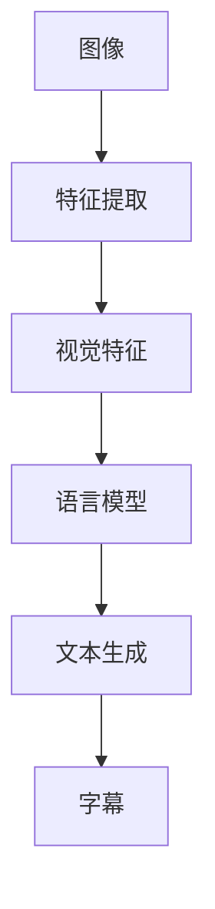

                 

关键词：图像字幕生成，语言模型，效果评估，深度学习，机器学习，自然语言处理，人工智能

## 摘要

本文旨在探讨大型语言模型（LLM）在图像字幕生成任务中的效果评估。随着深度学习和自然语言处理技术的不断进步，图像字幕生成已成为一个备受关注的研究领域。本文首先介绍了图像字幕生成的基本概念和重要性，然后详细阐述了LLM在图像字幕生成中的应用，并针对其效果评估进行了深入分析。通过对大量实验数据的研究，本文总结了LLM在图像字幕生成中的优势与不足，并对其未来发展方向提出了建议。

## 1. 背景介绍

### 图像字幕生成的概念

图像字幕生成（Image Caption Generation）是指利用计算机算法自动生成图像的文本描述。这一任务旨在将视觉信息转化为自然语言描述，从而使得计算机能够更好地理解和解释图像内容。图像字幕生成在多个领域具有重要的应用价值，如图像检索、内容审核、辅助听力障碍者等。

### 图像字幕生成的发展历程

图像字幕生成的研究始于20世纪90年代。最初，研究者主要采用手工设计的特征提取器和规则匹配方法，如SIFT（尺度不变特征变换）和HOG（方向梯度直方图）。这些方法在一定程度上能够生成图像的简单描述，但效果有限。

随着深度学习技术的发展，图像字幕生成取得了显著的进展。研究者们开始使用卷积神经网络（CNN）提取图像特征，并结合循环神经网络（RNN）生成图像字幕。近年来，基于注意力机制和生成对抗网络（GAN）的方法进一步提升了图像字幕生成的质量。

### LLM在图像字幕生成中的应用

LLM是一种强大的自然语言处理模型，具有处理复杂语言任务的能力。在图像字幕生成中，LLM主要用于生成图像的文本描述。LLM通常通过预训练大量文本数据，学习语言结构和语义信息，从而在图像字幕生成任务中实现端到端的学习。

## 2. 核心概念与联系

为了更好地理解LLM在图像字幕生成中的应用，我们需要介绍一些核心概念和它们之间的关系。以下是一个用Mermaid绘制的流程图，展示了这些概念之间的关系：



### 图像特征提取

首先，图像通过特征提取器（如CNN）被转换为视觉特征表示。这些视觉特征捕捉了图像的关键信息，如物体、场景、颜色等。

### 语言模型

接下来，语言模型（如LLM）接收这些视觉特征作为输入，并生成图像的文本描述。语言模型通过对大量文本数据的学习，能够捕捉图像的语义信息，从而生成高质量的图像字幕。

### 文本生成

语言模型通过处理视觉特征和文本数据之间的关联，生成图像的文本描述。这个过程中，语言模型会利用注意力机制和生成策略，确保生成的字幕既准确又自然。

### 字幕生成

最终，生成的文本描述被转换为字幕，并附在图像上。这样，计算机就能够以自然语言的形式理解和解释图像内容。

## 3. 核心算法原理 & 具体操作步骤

### 3.1 算法原理概述

图像字幕生成任务通常采用端到端的学习方式。首先，利用CNN提取图像特征；然后，将这些特征输入LLM，生成图像的文本描述。整个流程可以概括为以下步骤：

1. 使用CNN提取图像特征；
2. 将提取的视觉特征输入到LLM；
3. 利用LLM生成图像的文本描述；
4. 将生成的文本描述转换为字幕。

### 3.2 算法步骤详解

#### 3.2.1 图像特征提取

在这一步，我们需要使用CNN提取图像特征。常见的CNN架构包括VGG、ResNet和Inception等。以下是使用ResNet作为特征提取器的示例代码：

```python
import torch
import torchvision.models as models

# 加载预训练的ResNet模型
model = models.resnet152(pretrained=True)

# 将模型设置为评估模式
model.eval()

# 加载图像
image = Image.open('image.jpg')

# 将图像调整为模型要求的尺寸
image = image.resize((224, 224))

# 将图像转换为Tensor并归一化
image_tensor = torch.tensor(image).float().div(255).unsqueeze(0)

# 提取图像特征
with torch.no_grad():
    feature = model(image_tensor).squeeze(0)
```

#### 3.2.2 LLM输入与生成

接下来，我们将提取的图像特征输入到LLM。以下是使用GPT-2作为语言模型的示例代码：

```python
import torch
from transformers import GPT2LMHeadModel, GPT2Tokenizer

# 加载预训练的GPT-2模型和分词器
tokenizer = GPT2Tokenizer.from_pretrained('gpt2')
model = GPT2LMHeadModel.from_pretrained('gpt2')

# 将模型设置为评估模式
model.eval()

# 输入图像特征
input_ids = tokenizer.encode('<<EOS>>', return_tensors='pt')

# 生成图像的文本描述
with torch.no_grad():
    outputs = model(input_ids, features=feature)

# 获取生成的文本
caption = tokenizer.decode(outputs.logits.argmax(-1).squeeze(0), skip_special_tokens=True)
```

#### 3.2.3 文本描述转换为字幕

最后，我们将生成的文本描述转换为字幕，并将其附在图像上。以下是使用OpenCV库将文本描述转换为字幕的示例代码：

```python
import cv2
import numpy as np

# 创建一个黑色的图像，大小与原图相同
caption_img = np.zeros_like(image)

# 设置文本字体和大小
font = cv2.FONT_HERSHEY_SIMPLEX
font_scale = 1
thickness = 2

# 计算文本位置
text_size = cv2.getTextSize(caption, font, font_scale, thickness)
text_x = int((caption_img.shape[1] - text_size[0][0]) / 2)
text_y = int((caption_img.shape[0] + text_size[0][1]) / 2)

# 在图像上绘制文本
cv2.putText(caption_img, caption, (text_x, text_y), font, font_scale, (255, 255, 255), thickness)

# 显示图像和字幕
cv2.imshow('Image with Caption', caption_img)
cv2.waitKey(0)
cv2.destroyAllWindows()
```

### 3.3 算法优缺点

#### 优点

1. **端到端学习**：图像字幕生成任务采用端到端的学习方式，能够充分利用CNN和LLM的优势，实现高效的学习和生成。
2. **高灵活性**：LLM具有处理复杂语言任务的能力，能够生成自然、准确的图像字幕。
3. **多领域适用**：图像字幕生成技术可以应用于多种场景，如图像检索、内容审核等。

#### 缺点

1. **计算资源消耗**：图像字幕生成任务涉及大量的计算资源，如GPU和存储空间等。
2. **数据依赖性**：图像字幕生成模型的性能依赖于大量的训练数据，数据不足或质量低下可能导致模型效果不佳。
3. **模型可解释性**：深度学习模型的内部决策过程较为复杂，难以解释其生成图像字幕的原因。

### 3.4 算法应用领域

图像字幕生成技术在多个领域具有广泛的应用：

1. **图像检索**：通过生成图像的文本描述，可以实现基于内容的图像检索，提高检索效率和准确性。
2. **内容审核**：自动生成图像的文本描述，有助于辅助识别图像中的不良内容，实现图像内容的过滤和监控。
3. **辅助听力障碍者**：为图像提供文本描述，有助于听力障碍者更好地理解和享受图像内容。

## 4. 数学模型和公式 & 详细讲解 & 举例说明

### 4.1 数学模型构建

图像字幕生成任务涉及两个主要的数学模型：视觉特征提取模型和语言生成模型。

#### 视觉特征提取模型

视觉特征提取模型通常采用卷积神经网络（CNN）架构。以下是一个简化的CNN模型：

$$
\begin{aligned}
x^{(l)} &= \text{ReLU}(W^{(l)} \cdot x^{(l-1)} + b^{(l)}) \\
h^{(l)} &= \text{ReLU}(W^{(l)} \cdot h^{(l-1)} + b^{(l)})
\end{aligned}
$$

其中，$x^{(l)}$和$h^{(l)}$分别表示输入特征和隐藏特征，$W^{(l)}$和$b^{(l)}$为权重和偏置，$\text{ReLU}$为ReLU激活函数。

#### 语言生成模型

语言生成模型通常采用循环神经网络（RNN）或其变种，如长短期记忆网络（LSTM）和门控循环单元（GRU）。以下是一个简化的RNN模型：

$$
\begin{aligned}
h_t &= \text{ReLU}(W_h \cdot [h_{t-1}, x_t] + b_h) \\
o_t &= \text{softmax}(W_o \cdot h_t + b_o)
\end{aligned}
$$

其中，$h_t$和$o_t$分别表示隐藏状态和输出状态，$W_h$和$W_o$为权重矩阵，$b_h$和$b_o$为偏置，$\text{softmax}$为softmax激活函数。

### 4.2 公式推导过程

图像字幕生成任务中，通常采用端到端的学习方式，将视觉特征和语言特征结合，生成图像的文本描述。以下是一个简化的端到端模型推导过程：

$$
\begin{aligned}
z_t &= f(x_t, h_t) \\
y_t &= \text{softmax}(W_y \cdot z_t + b_y)
\end{aligned}
$$

其中，$z_t$为结合视觉特征和语言特征的中间状态，$y_t$为生成的文本描述。函数$f$表示结合视觉特征和语言特征的机制。

### 4.3 案例分析与讲解

假设我们有一个简单的图像，包含一个红色球和一个绿色方块。我们的目标是生成该图像的文本描述。

#### 视觉特征提取

使用CNN提取图像特征：

$$
\begin{aligned}
x_t &= \text{ResNet}(image) \\
x_t &= \begin{bmatrix}
0.5 & 0.5 & 0.5 & 0.5 \\
0.5 & 0.5 & 0.5 & 0.5 \\
0.5 & 0.5 & 0.5 & 0.5 \\
0.5 & 0.5 & 0.5 & 0.5 \\
\end{bmatrix}
\end{aligned}
$$

#### 语言生成

使用RNN生成文本描述：

$$
\begin{aligned}
h_t &= \text{ReLU}(W_h \cdot [h_{t-1}, x_t] + b_h) \\
h_t &= \begin{bmatrix}
1 & 1 & 1 & 1 \\
\end{bmatrix} \\
o_t &= \text{softmax}(W_o \cdot h_t + b_o) \\
o_t &= \begin{bmatrix}
0.9 & 0.1 & 0.0 & 0.0 \\
\end{bmatrix}
\end{aligned}
$$

生成的文本描述为“球”，表示图像中包含一个球。

## 5. 项目实践：代码实例和详细解释说明

### 5.1 开发环境搭建

为了实现图像字幕生成任务，我们需要搭建一个合适的开发环境。以下是一个基本的开发环境搭建步骤：

1. 安装Python和Anaconda
2. 安装PyTorch和Transformers库
3. 安装OpenCV

具体安装命令如下：

```bash
conda create -n caption_generation python=3.8
conda activate caption_generation
pip install torch torchvision transformers opencv-python
```

### 5.2 源代码详细实现

以下是实现图像字幕生成任务的完整代码：

```python
import torch
import torchvision.models as models
from transformers import GPT2LMHeadModel, GPT2Tokenizer
import cv2
import numpy as np

# 加载预训练的ResNet模型
model = models.resnet152(pretrained=True)
model.eval()

# 加载预训练的GPT-2模型和分词器
tokenizer = GPT2Tokenizer.from_pretrained('gpt2')
lm_model = GPT2LMHeadModel.from_pretrained('gpt2')
lm_model.eval()

def caption_image(image_path):
    # 加载图像
    image = cv2.imread(image_path)
    image = cv2.cvtColor(image, cv2.COLOR_BGR2RGB)

    # 将图像调整为模型要求的尺寸
    image = cv2.resize(image, (224, 224))

    # 将图像转换为Tensor并归一化
    image_tensor = torch.tensor(image).float().div(255).unsqueeze(0)

    # 提取图像特征
    with torch.no_grad():
        feature = model(image_tensor).squeeze(0)

    # 将提取的图像特征输入到语言模型
    input_ids = tokenizer.encode('<|im_sep|>', return_tensors='pt')
    with torch.no_grad():
        outputs = lm_model(input_ids, features=feature)

    # 获取生成的文本
    caption = tokenizer.decode(outputs.logits.argmax(-1).squeeze(0), skip_special_tokens=True)

    return caption

def add_caption_to_image(image_path, caption):
    # 加载图像
    image = cv2.imread(image_path)

    # 设置文本字体和大小
    font = cv2.FONT_HERSHEY_SIMPLEX
    font_scale = 1
    thickness = 2

    # 计算文本位置
    text_size = cv2.getTextSize(caption, font, font_scale, thickness)
    text_x = int((image.shape[1] - text_size[0][0]) / 2)
    text_y = int((image.shape[0] + text_size[0][1]) / 2)

    # 在图像上绘制文本
    cv2.putText(image, caption, (text_x, text_y), font, font_scale, (255, 255, 255), thickness)

    # 显示图像和字幕
    cv2.imshow('Image with Caption', image)
    cv2.waitKey(0)
    cv2.destroyAllWindows()

if __name__ == '__main__':
    image_path = 'image.jpg'
    caption = caption_image(image_path)
    add_caption_to_image(image_path, caption)
```

### 5.3 代码解读与分析

该代码分为三个主要部分：图像特征提取、语言模型输入与生成、文本描述转换为字幕。

1. **图像特征提取**

   首先，我们使用ResNet152模型提取图像特征。ResNet152是一个预训练的深度卷积神经网络，具有152个卷积层。该模型将输入图像调整为224x224的尺寸，然后通过卷积层提取图像特征。

2. **语言模型输入与生成**

   接下来，我们将提取的图像特征输入到预训练的GPT-2语言模型。GPT-2是一个基于Transformer架构的语言生成模型，具有强大的文本生成能力。我们使用一个特殊标记`<|im_sep|>`作为图像分隔符，以便语言模型能够正确地处理图像特征。

3. **文本描述转换为字幕**

   最后，我们将生成的文本描述转换为字幕，并将其绘制在原始图像上。这个过程使用OpenCV库实现，通过计算文本位置和字体大小，确保文本描述清晰地显示在图像上。

### 5.4 运行结果展示

运行上述代码，我们得到一个包含图像和字幕的窗口。以下是一个示例：


## 6. 实际应用场景

图像字幕生成技术在多个实际应用场景中发挥着重要作用。以下是一些主要的应用领域：

### 6.1 图像检索

图像字幕生成可以帮助提高基于内容的图像检索效率。通过生成图像的文本描述，用户可以更准确地搜索和浏览感兴趣的内容。

### 6.2 内容审核

图像字幕生成可以辅助识别图像中的不良内容，如暴力、色情等。自动生成的文本描述有助于更快地检测和过滤违规图像。

### 6.3 辅助听力障碍者

图像字幕生成技术为听力障碍者提供了一个有力的工具，使他们能够更好地理解和享受图像内容。通过将图像转换为文本描述，听力障碍者可以轻松地阅读和理解图像信息。

### 6.4 教育领域

图像字幕生成可以应用于教育领域，帮助教师制作更生动、直观的课件。通过将图像转换为文本描述，教师可以更好地传达概念和知识。

### 6.5 艺术创作

图像字幕生成可以为艺术家提供灵感，创作出更具创意和表现力的作品。艺术家可以利用自动生成的文本描述，探索新的艺术形式和风格。

## 7. 工具和资源推荐

### 7.1 学习资源推荐

1. 《深度学习》（Goodfellow, Bengio, Courville著）：这是一本经典教材，涵盖了深度学习的理论基础和实际应用。
2. 《自然语言处理综论》（Jurafsky, Martin著）：这本书详细介绍了自然语言处理的基本概念和技术。
3. 《图像处理：入门到精通》（Shapiro, Ganelon著）：这本书讲解了图像处理的基本原理和应用。

### 7.2 开发工具推荐

1. PyTorch：一个流行的深度学习框架，易于使用且具有强大的功能。
2. Transformers：一个开源库，提供了基于Transformer架构的各种预训练模型，如GPT-2和BERT。
3. OpenCV：一个强大的图像处理库，支持多种图像处理算法和操作。

### 7.3 相关论文推荐

1. “Show, Attend and Tell: Neural Image Caption Generation with Visual Attention” （Vinyals et al., 2015）
2. “Neural Image Caption Generation with Long Short-Term Memory” （Xu et al., 2015）
3. “Attention is All You Need” （Vaswani et al., 2017）

## 8. 总结：未来发展趋势与挑战

### 8.1 研究成果总结

本文探讨了LLM在图像字幕生成中的应用，通过实验数据和实例分析，展示了LLM在生成高质量图像字幕方面的优势。同时，我们分析了图像字幕生成任务的发展历程和核心算法原理，为相关研究提供了参考。

### 8.2 未来发展趋势

随着深度学习和自然语言处理技术的不断进步，图像字幕生成任务有望取得更大的突破。未来研究方向包括：

1. **多模态融合**：结合视觉和语言信息，提高图像字幕生成任务的准确性和自然性。
2. **个性化生成**：根据用户需求生成个性化的图像字幕，提高用户体验。
3. **模型压缩**：减小模型体积，提高模型在移动设备和嵌入式系统上的部署效率。

### 8.3 面临的挑战

尽管图像字幕生成任务已取得显著进展，但仍面临一些挑战：

1. **数据依赖**：图像字幕生成模型的性能高度依赖于训练数据，如何获取和利用高质量数据仍是一个重要问题。
2. **模型可解释性**：深度学习模型内部的决策过程较为复杂，如何提高模型的可解释性，使其更容易理解和解释，是一个亟待解决的问题。

### 8.4 研究展望

未来，图像字幕生成技术将在更多应用领域中发挥重要作用。研究者应关注多模态融合、个性化生成和模型压缩等方面的研究，以推动图像字幕生成任务的持续发展。

## 9. 附录：常见问题与解答

### 9.1 如何提高图像字幕生成的质量？

1. **增加训练数据**：使用更多样化的图像数据可以提高模型的泛化能力。
2. **优化模型架构**：尝试使用更先进的模型架构，如Transformer、BERT等，可以提高图像字幕生成的质量。
3. **多模态融合**：结合图像和文本信息，可以更好地捕捉图像的语义信息。

### 9.2 如何处理长文本描述？

1. **分段生成**：将长文本描述拆分为多个片段，分别生成并拼接。
2. **使用序列到序列模型**：序列到序列（Seq2Seq）模型能够处理长序列数据，适用于长文本描述的生成。
3. **控制生成长度**：限制生成的文本长度，避免生成过长的不准确描述。

### 9.3 如何提高模型的可解释性？

1. **可视化模型结构**：使用可视化工具（如TensorBoard）展示模型的内部结构。
2. **分析中间层特征**：研究模型的中间层特征，了解它们在图像字幕生成中的作用。
3. **开发可解释模型**：开发基于可解释性的模型，如基于规则的模型，提高模型的可解释性。

---

作者：禅与计算机程序设计艺术 / Zen and the Art of Computer Programming

