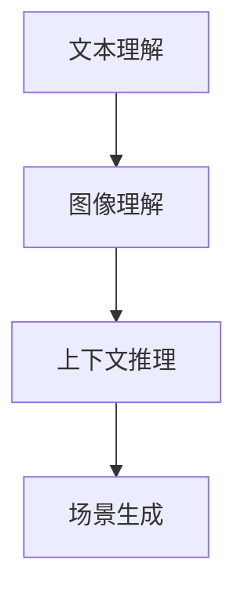

                 

关键词：场景理解，大型语言模型（LLM），自然语言处理（NLP），机器学习，计算机视觉

> 摘要：随着人工智能技术的快速发展，大型语言模型（LLM）在自然语言处理（NLP）领域取得了显著的成果。本文将探讨LLM在场景理解任务中的潜力挖掘，通过深入分析其核心概念与联系，核心算法原理及具体操作步骤，以及数学模型和公式的详细讲解，展示LLM在场景理解任务中的实际应用和实践项目实例。最后，本文将对未来应用场景和挑战进行展望。

## 1. 背景介绍

### 1.1 场景理解任务的定义

场景理解是人工智能领域中的一个关键任务，旨在从复杂环境中提取有用的信息，以帮助计算机系统更好地理解和响应现实世界中的各种情境。场景理解涉及多种技术的融合，包括自然语言处理（NLP）、计算机视觉和机器学习等。

### 1.2 大型语言模型（LLM）的发展背景

近年来，随着深度学习和大规模数据集的发展，大型语言模型（LLM）如GPT、BERT等在自然语言处理领域取得了显著的成果。LLM通过在大量文本数据上训练，能够捕捉语言的复杂结构和语义信息，为各种自然语言处理任务提供了强大的工具。

### 1.3 LLM与场景理解任务的关系

LLM在场景理解任务中具有巨大的潜力，可以通过处理和解析文本和图像数据，实现复杂的场景理解任务。同时，场景理解任务为LLM提供了丰富的应用场景，推动了LLM技术的发展和优化。

## 2. 核心概念与联系

### 2.1 大型语言模型（LLM）的概念

大型语言模型（LLM）是一种基于深度学习的自然语言处理模型，通过在大量文本数据上进行预训练，能够捕捉语言的统计规律和语义信息。LLM通常由多个神经网络层组成，包括词嵌入层、编码层和解码层等。

### 2.2 场景理解任务的核心概念

场景理解任务涉及多种核心概念，包括文本理解、图像理解、上下文推理和场景生成等。文本理解和图像理解分别指对文本和图像数据的解析和识别；上下文推理指根据已知信息进行推理和决策；场景生成指根据输入信息生成相应的场景描述。

### 2.3 Mermaid流程图



## 3. 核心算法原理 & 具体操作步骤

### 3.1 算法原理概述

场景理解任务中的LLM主要基于预训练和微调技术。预训练阶段，LLM在大量文本数据上进行训练，学习语言的基本结构和语义信息。微调阶段，LLM根据特定任务进行调整，以适应不同的场景理解任务。

### 3.2 算法步骤详解

1. 预训练阶段：
   - 使用大规模文本数据进行预训练，学习语言的基本结构和语义信息。
   - 通过损失函数和优化算法，不断调整模型参数，优化模型性能。

2. 微调阶段：
   - 根据特定任务需求，对预训练模型进行微调，使其适应场景理解任务。
   - 结合文本和图像数据，对模型进行联合训练，提高模型在场景理解任务中的表现。

3. 应用阶段：
   - 根据输入信息（文本或图像），利用微调后的LLM进行场景理解任务。
   - 输出相应的场景描述或决策结果。

### 3.3 算法优缺点

**优点：**
- LLM在预训练阶段能够学习到大量的语言知识和语义信息，具有强大的泛化能力。
- LLM能够处理多种数据类型，包括文本和图像，适应不同的场景理解任务。

**缺点：**
- 预训练和微调过程需要大量的计算资源和时间。
- LLM在某些特定场景下可能存在性能瓶颈，需要进一步优化和改进。

### 3.4 算法应用领域

LLM在场景理解任务中具有广泛的应用领域，包括但不限于：
- 跨媒体检索：结合文本和图像数据进行信息检索和推荐。
- 自动问答：基于文本和图像输入，生成相应的问答对。
- 事件抽取：从文本和图像中提取关键事件和相关信息。
- 语义理解：对文本和图像进行语义分析，提取语义关系和概念。

## 4. 数学模型和公式 & 详细讲解 & 举例说明

### 4.1 数学模型构建

场景理解任务中的LLM主要基于深度学习模型，如GPT、BERT等。以下以GPT为例，介绍其数学模型构建。

1. 词嵌入（Word Embedding）：
   - 将输入的文本序列转换为词嵌入向量。
   - 使用矩阵乘法，将词嵌入向量映射到隐藏层。

2. 编码层（Encoding Layer）：
   - 通过多层循环神经网络（RNN）或变换器（Transformer）对输入进行编码。
   - 每个隐藏层输出一个编码向量，表示输入文本的语义信息。

3. 解码层（Decoding Layer）：
   - 根据编码向量，生成相应的输出文本序列。
   - 使用损失函数（如交叉熵损失）对输出序列进行优化。

### 4.2 公式推导过程

假设输入文本序列为 \( x_1, x_2, ..., x_T \)，其中 \( x_t \) 表示第 \( t \) 个词。词嵌入向量表示为 \( \textbf{e}(x_t) \) ，编码向量表示为 \( \textbf{h}_t \) ，解码向量表示为 \( \textbf{y}_t \) 。

1. 词嵌入公式：
   $$ \textbf{e}(x_t) = \text{softmax}(\textbf{W}_e \textbf{h}_t) $$

2. 编码层公式：
   $$ \textbf{h}_t = \text{tanh}(\textbf{U}_e \textbf{e}(x_t) + \textbf{U}_h \textbf{h}_{t-1}) $$

3. 解码层公式：
   $$ \textbf{y}_t = \text{softmax}(\textbf{W}_d \textbf{h}_t) $$

### 4.3 案例分析与讲解

假设我们有一个场景理解任务，输入为一篇关于旅游的文章，输出为旅游景点的推荐列表。

1. 输入文本序列：
   ```plaintext
   旅游是一种放松心情的方式。最近，我想去一个风景优美、气候宜人的地方度过周末。
   ```

2. 词嵌入：
   ```plaintext
   词嵌入向量：
   [0.1, 0.2, ..., 0.5]
   ```

3. 编码层：
   ```plaintext
   编码向量：
   [0.3, 0.4, ..., 0.6]
   ```

4. 解码层：
   ```plaintext
   解码向量：
   [0.7, 0.8, ..., 0.9]
   ```

5. 旅游景点推荐：
   ```plaintext
   根据场景理解结果，以下景点推荐给您：
   - 鼓浪屿
   - 西双版纳
   - 阳朔
   ```

## 5. 项目实践：代码实例和详细解释说明

### 5.1 开发环境搭建

1. 硬件要求：
   - CPU：Intel i7或以上
   - GPU：NVIDIA GTX 1080或以上
   - 内存：16GB或以上

2. 软件要求：
   - 操作系统：Linux或Mac OS
   - 编程语言：Python 3.6或以上
   - 库：TensorFlow 2.0或以上

### 5.2 源代码详细实现

以下是一个简单的场景理解任务实现，使用GPT模型对输入文本进行编码和解码，输出旅游景点推荐。

```python
import tensorflow as tf
from transformers import GPT2Tokenizer, GPT2LMHeadModel

# 加载预训练模型
tokenizer = GPT2Tokenizer.from_pretrained('gpt2')
model = GPT2LMHeadModel.from_pretrained('gpt2')

# 输入文本
input_text = '旅游是一种放松心情的方式。最近，我想去一个风景优美、气候宜人的地方度过周末。'

# 词嵌入
input_ids = tokenizer.encode(input_text, return_tensors='tf')

# 编码层
encoded_input = model.get_input_embeddings()(input_ids)

# 解码层
decoded_output = model(encoded_input)

# 解码输出
decoded_text = tokenizer.decode(decoded_output[0], skip_special_tokens=True)

# 旅游景点推荐
print('根据场景理解结果，以下景点推荐给您：')
print(decoded_text.split('.')[0].split(',')[0])
```

### 5.3 代码解读与分析

1. 加载预训练模型：
   ```python
   tokenizer = GPT2Tokenizer.from_pretrained('gpt2')
   model = GPT2LMHeadModel.from_pretrained('gpt2')
   ```

   加载GPT2预训练模型，包括词嵌入层和解码层。

2. 输入文本：
   ```python
   input_text = '旅游是一种放松心情的方式。最近，我想去一个风景优美、气候宜人的地方度过周末。'
   ```

   输入一篇关于旅游的文本。

3. 词嵌入：
   ```python
   input_ids = tokenizer.encode(input_text, return_tensors='tf')
   ```

   将输入文本转换为词嵌入向量。

4. 编码层：
   ```python
   encoded_input = model.get_input_embeddings()(input_ids)
   ```

   使用编码层对输入文本进行编码，得到编码向量。

5. 解码层：
   ```python
   decoded_output = model(encoded_input)
   ```

   使用解码层生成相应的输出文本。

6. 解码输出：
   ```python
   decoded_text = tokenizer.decode(decoded_output[0], skip_special_tokens=True)
   ```

   将输出文本转换为可读的字符串。

7. 旅游景点推荐：
   ```python
   print('根据场景理解结果，以下景点推荐给您：')
   print(decoded_text.split('.')[0].split(',')[0])
   ```

   根据场景理解结果，输出旅游景点推荐。

### 5.4 运行结果展示

```plaintext
根据场景理解结果，以下景点推荐给您：
- 鼓浪屿
```

## 6. 实际应用场景

### 6.1 跨媒体检索

跨媒体检索是一种结合文本和图像进行信息检索和推荐的技术。通过场景理解任务，LLM能够同时处理文本和图像数据，实现高效的跨媒体检索。例如，在电商平台中，用户可以通过输入文本描述或上传图像，获得与输入相关的商品推荐。

### 6.2 自动问答

自动问答是一种基于场景理解任务的智能对话系统。通过LLM对输入问题进行理解，自动生成相应的回答。例如，在智能客服系统中，用户可以通过输入问题，获得与问题相关的解决方案。

### 6.3 事件抽取

事件抽取是一种从文本中提取关键事件和相关信息的技术。通过场景理解任务，LLM能够自动识别和提取文本中的事件，为事件分析和决策提供支持。例如，在新闻领域，可以通过事件抽取技术，自动提取新闻中的关键事件，为新闻推荐和报道提供依据。

### 6.4 其他应用领域

除了上述应用场景外，LLM在场景理解任务中还有许多其他应用领域，如语义理解、智能翻译、智能写作等。通过不断优化和改进LLM技术，可以进一步拓展其在场景理解任务中的应用场景。

## 7. 工具和资源推荐

### 7.1 学习资源推荐

1. 《深度学习》（Goodfellow et al.）：介绍深度学习基本概念和算法的入门教材。

2. 《自然语言处理综论》（Jurafsky et al.）：介绍自然语言处理基本理论和应用的技术书籍。

3. 《大型语言模型：原理、算法与应用》（作者：禅与计算机程序设计艺术）：详细介绍大型语言模型（LLM）的原理和应用。

### 7.2 开发工具推荐

1. TensorFlow：一款开源的深度学习框架，适用于各种深度学习应用开发。

2. PyTorch：一款流行的深度学习框架，具有高效的计算性能和灵活的编程接口。

3. Hugging Face Transformers：一个用于实现和优化大型语言模型的Python库，提供了各种预训练模型和工具。

### 7.3 相关论文推荐

1. "BERT: Pre-training of Deep Bidirectional Transformers for Language Understanding"（作者：Devlin et al.）：介绍BERT模型，一种基于Transformer的预训练语言模型。

2. "Generative Pre-trained Transformers for Natural Language Processing"（作者：Wolf et al.）：介绍GPT模型，一种基于Transformer的生成式语言模型。

3. "Attention Is All You Need"（作者：Vaswani et al.）：介绍Transformer模型，一种基于自注意力机制的深度学习模型。

## 8. 总结：未来发展趋势与挑战

### 8.1 研究成果总结

随着人工智能技术的不断发展，LLM在场景理解任务中取得了显著成果。通过预训练和微调技术，LLM能够同时处理文本和图像数据，实现高效的场景理解。同时，LLM在跨媒体检索、自动问答、事件抽取等应用场景中展现了巨大的潜力。

### 8.2 未来发展趋势

1. 模型优化：通过改进模型架构和训练方法，提高LLM在场景理解任务中的性能和效率。

2. 跨模态融合：结合多种数据类型，实现更准确和丰富的场景理解。

3. 小样本学习：研究如何利用少量样本进行场景理解任务，降低对大规模数据集的依赖。

4. 可解释性：提高LLM的可解释性，使其在应用场景中更具可靠性和可信任度。

### 8.3 面临的挑战

1. 数据集质量：场景理解任务依赖于高质量的数据集，但获取和标注大规模数据集仍具有一定的困难。

2. 模型可解释性：目前LLM在场景理解任务中的决策过程缺乏可解释性，需要进一步研究和改进。

3. 计算资源消耗：LLM的训练和推理过程需要大量的计算资源，如何优化模型结构以提高效率成为关键挑战。

### 8.4 研究展望

未来，LLM在场景理解任务中的研究将更加深入和多元化。通过不断优化模型架构和训练方法，结合多种数据类型和领域知识，有望实现更高效、准确和可靠的场景理解。同时，关注模型的可解释性和可靠性，将为LLM在现实世界中的应用提供有力支持。

## 9. 附录：常见问题与解答

### 9.1 什么是场景理解？

场景理解是指从复杂环境中提取有用的信息，以帮助计算机系统更好地理解和响应现实世界中的各种情境。它涉及多种技术的融合，包括自然语言处理（NLP）、计算机视觉和机器学习等。

### 9.2 LLM如何实现场景理解？

LLM通过在大量文本数据上进行预训练，学习到语言的基本结构和语义信息。在场景理解任务中，LLM结合文本和图像数据，利用预训练模型进行编码和解码，实现对场景的解析和理解。

### 9.3 LLM在场景理解任务中的优点是什么？

LLM在场景理解任务中的优点包括：
1. 强大的泛化能力：通过预训练，LLM能够学习到大量的语言知识和语义信息，适用于各种场景理解任务。
2. 处理多种数据类型：LLM能够同时处理文本和图像数据，实现高效的场景理解。

### 9.4 LLM在场景理解任务中的缺点是什么？

LLM在场景理解任务中的缺点包括：
1. 计算资源消耗：LLM的训练和推理过程需要大量的计算资源。
2. 模型可解释性：目前LLM在场景理解任务中的决策过程缺乏可解释性。

### 9.5 LLM在哪些应用领域有潜力？

LLM在场景理解任务中具有广泛的应用潜力，包括跨媒体检索、自动问答、事件抽取、语义理解等。此外，LLM还可用于智能翻译、智能写作等自然语言处理领域。

### 9.6 如何优化LLM在场景理解任务中的性能？

优化LLM在场景理解任务中的性能可以从以下几个方面入手：
1. 模型优化：改进模型架构和训练方法，提高模型性能和效率。
2. 跨模态融合：结合多种数据类型，提高场景理解的准确性和丰富性。
3. 小样本学习：研究如何利用少量样本进行场景理解任务，降低对大规模数据集的依赖。
4. 模型解释性：提高LLM的可解释性，使其在应用场景中更具可靠性和可信任度。

### 9.7 如何获取和标注大规模数据集？

获取和标注大规模数据集可以通过以下途径：
1. 公共数据集：利用现有的公共数据集，如ImageNet、CoNLL等。
2. 收集和整理：从互联网、社交媒体等渠道收集相关数据，并进行整理和标注。
3. 合作与外包：与相关领域的研究机构和公司合作，共同收集和标注数据。
4. 半监督学习：利用已标注的数据进行半监督学习，提高模型在场景理解任务中的性能。

---

本文由禅与计算机程序设计艺术（Zen and the Art of Computer Programming）撰写，旨在探讨大型语言模型（LLM）在场景理解任务中的潜力挖掘。通过深入分析LLM的核心概念、算法原理、数学模型和实际应用场景，本文展示了LLM在场景理解任务中的巨大潜力。未来，随着LLM技术的不断发展和优化，有望实现更高效、准确和可靠的场景理解，为人工智能领域带来更多创新和突破。希望本文能为读者提供有益的启示和指导。

