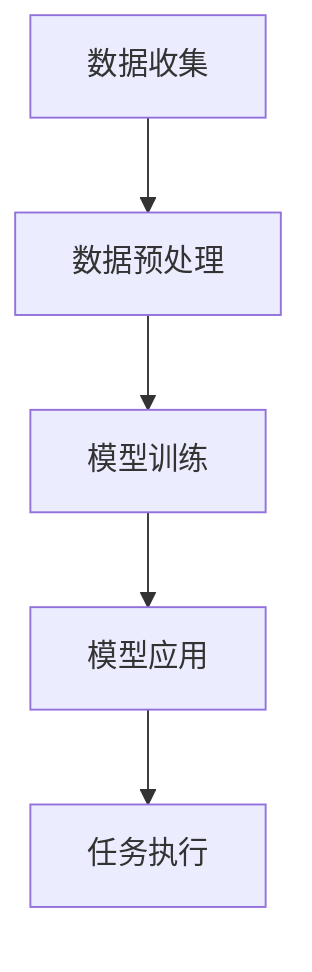

                 

在当今的科技时代，人工智能（AI）已经成为推动各个领域进步的重要力量。从医疗诊断到金融分析，AI的应用已经深入人心。然而，太空探索作为一项复杂且充满挑战的任务，同样可以从AI技术中获得极大的收益。本文将探讨大型语言模型（LLM）在太空探索中的应用，尤其是作为“AI宇航员”的角色。

> 关键词：LLM，太空探索，AI宇航员，人工智能，AI技术，AI应用，AI发展

> 摘要：本文将介绍LLM在太空探索中的关键作用，通过分析其原理和应用，展示AI如何为太空任务提供智能化支持。文章将探讨LLM在任务规划、实时决策、数据分析等方面的应用，并讨论其面临的挑战和未来发展方向。

## 1. 背景介绍

太空探索一直是人类探索未知世界的壮举。从1961年尤里·加加林成为首位进入太空的宇航员，到2021年中国“天问一号”探测器成功着陆火星，人类在太空领域取得了显著的成就。然而，太空环境极端且危险，包括微重力、辐射、温度波动等。因此，宇航员在进行太空任务时面临诸多挑战。

随着AI技术的快速发展，特别是在深度学习和自然语言处理（NLP）领域的突破，AI在许多复杂任务中的应用变得日益成熟。LLM作为一种强大的人工智能模型，具有处理大量文本数据的能力，能够从复杂的语言信息中提取知识和模式。这使得LLM在需要大量数据处理和智能决策的太空探索任务中具有极大的潜力。

## 2. 核心概念与联系

### 2.1 LLM的概念

LLM（Large Language Model）是一种基于深度学习的大型神经网络模型，它通过学习海量的文本数据来理解和生成自然语言。LLM的核心是一个巨大的参数矩阵，这个矩阵能够捕捉到语言中的复杂模式和关联。LLM的应用范围非常广泛，包括机器翻译、文本摘要、问答系统、语言生成等。

### 2.2 太空探索中的挑战与需求

太空探索面临的挑战包括：

- **环境极端**：微重力、辐射、温度波动等极端环境对宇航员和设备提出了极高的要求。
- **通信延迟**：太空任务通常需要与地球基地进行实时通信，但信号传输存在延迟，这对任务的实时决策和响应能力提出了挑战。
- **数据复杂性**：太空任务产生的数据量巨大，如何有效地分析和利用这些数据是一个重要问题。

针对这些挑战，LLM可以提供以下支持：

- **智能任务规划**：LLM能够处理和分析大量任务数据，为宇航员提供智能化的任务规划建议。
- **实时决策支持**：LLM可以快速理解任务场景和实时数据，提供决策支持，帮助宇航员在有限的时间内做出最优决策。
- **数据分析和解释**：LLM能够从复杂的太空数据中提取有价值的信息，辅助宇航员进行数据分析。

### 2.3 LLM与太空探索的关联

LLM在太空探索中的应用可以通过以下几个步骤实现：

1. **数据收集**：从太空任务中收集各种类型的数据，包括传感器数据、宇航员报告、历史任务数据等。
2. **数据预处理**：对收集到的数据进行清洗、格式化和标注，使其适合LLM处理。
3. **模型训练**：使用预处理后的数据训练LLM模型，使其能够理解和处理太空任务相关的语言信息。
4. **模型应用**：将训练好的LLM模型部署到太空任务中，为宇航员提供智能化的任务规划、决策支持和数据分析服务。

### 2.4 Mermaid流程图



## 3. 核心算法原理 & 具体操作步骤

### 3.1 算法原理概述

LLM的工作原理基于深度学习中的循环神经网络（RNN）和变压器（Transformer）模型。RNN能够捕捉到语言序列中的长期依赖关系，而Transformer模型通过自注意力机制（Self-Attention）实现了对输入数据的全局关注，从而提高了模型的处理能力和效果。

在太空探索中，LLM的核心功能包括：

- **自然语言理解**：理解宇航员的任务指令、报告和通信内容。
- **语言生成**：生成智能化的任务规划建议、决策建议和数据分析报告。
- **文本摘要**：从大量任务数据中提取关键信息，生成摘要，帮助宇航员快速获取重要信息。

### 3.2 算法步骤详解

1. **数据收集**：收集太空任务中的各种数据，包括传感器数据、宇航员报告、历史任务数据等。
2. **数据预处理**：对收集到的数据进行清洗、格式化和标注，将其转换为适合LLM处理的形式。
3. **模型训练**：使用预处理后的数据训练LLM模型。训练过程包括以下几个步骤：
   - **嵌入层**：将文本数据转换为稠密向量表示。
   - **编码器**：使用RNN或Transformer模型对输入文本进行编码，提取文本特征。
   - **解码器**：根据编码器的输出，生成目标文本。

4. **模型评估**：使用测试数据评估模型性能，包括自然语言理解、语言生成和文本摘要等指标。

5. **模型应用**：将训练好的LLM模型部署到太空任务中，为宇航员提供智能化的任务规划、决策支持和数据分析服务。

### 3.3 算法优缺点

#### 优点：

- **强大的文本处理能力**：LLM能够处理和理解复杂的文本数据，为太空任务提供智能化的支持。
- **自适应性强**：LLM能够根据任务需求和实时数据动态调整其行为，提高任务执行的效率。
- **广泛的应用领域**：LLM不仅适用于太空探索，还可以应用于其他领域，如医疗、金融、教育等。

#### 缺点：

- **计算资源消耗大**：训练和部署LLM模型需要大量的计算资源和存储空间。
- **数据隐私和安全**：太空任务数据涉及敏感信息，如何保护数据隐私和安全是一个重要问题。

### 3.4 算法应用领域

LLM在太空探索中的应用领域包括：

- **任务规划**：为宇航员提供智能化的任务规划建议，优化任务执行的效率和安全性。
- **实时决策支持**：为宇航员提供实时决策支持，帮助其在有限的时间内做出最优决策。
- **数据分析和解释**：从复杂的太空数据中提取有价值的信息，为宇航员提供数据分析报告。

## 4. 数学模型和公式 & 详细讲解 & 举例说明

### 4.1 数学模型构建

LLM的数学模型主要基于深度学习中的循环神经网络（RNN）和变压器（Transformer）模型。以下是一个简化的数学模型构建过程：

1. **嵌入层**：将文本数据转换为稠密向量表示。使用词嵌入（Word Embedding）技术，将每个单词映射为一个固定大小的向量。
   $$ x \in \mathbb{R}^{d} $$
   其中，$x$ 是输入词向量，$d$ 是向量维度。

2. **编码器**：使用RNN或Transformer模型对输入文本进行编码，提取文本特征。编码器的主要功能是捕捉输入文本中的长期依赖关系。
   $$ h = Encoder(x) $$
   其中，$h$ 是编码器的输出，表示输入文本的特征。

3. **解码器**：根据编码器的输出，生成目标文本。解码器的任务是从编码器的隐藏状态中预测下一个单词。
   $$ y = Decoder(h) $$
   其中，$y$ 是解码器的输出，表示生成的目标文本。

### 4.2 公式推导过程

以Transformer模型为例，以下是公式的推导过程：

1. **自注意力机制（Self-Attention）**：自注意力机制是一个核心组件，它能够对输入数据进行全局关注。
   $$ \text{Attention}(Q, K, V) = \text{softmax}\left(\frac{QK^T}{\sqrt{d_k}}\right) V $$
   其中，$Q, K, V$ 分别是查询向量、关键向量、值向量，$d_k$ 是关键向量的维度。

2. **编码器（Encoder）**：编码器的输出是通过自注意力机制和前馈神经网络（Feedforward Neural Network）得到的。
   $$ h = \text{Encoder}(x) = \text{MultiHeadAttention}(Q, K, V) + x $$
   $$ h = \text{FFN}(h) + h $$
   其中，$h$ 是编码器的输出，$FFN$ 是前馈神经网络。

3. **解码器（Decoder）**：解码器的输出是通过自注意力机制和编码器-解码器注意力（Encoder-Decoder Attention）得到的。
   $$ y = \text{Decoder}(h) = \text{MultiHeadAttention}(Q, K, V) + h $$
   $$ y = \text{FFN}(y) + h $$
   其中，$y$ 是解码器的输出。

### 4.3 案例分析与讲解

以下是一个简单的案例，说明如何使用LLM生成太空任务报告。

1. **输入数据**：宇航员的任务指令和实时数据，如“执行空间站维修任务，当前温度-50°C，氧气浓度正常”。

2. **预处理**：将输入数据转换为词向量表示，并将其输入到编码器。

3. **编码**：编码器提取输入数据的特征，并将其传递给解码器。

4. **解码**：解码器根据编码器的输出，生成太空任务报告，如“请小心执行空间站维修任务，注意保持体温，确保氧气供应正常”。

通过这个案例，我们可以看到LLM在处理自然语言数据方面的强大能力。它不仅能够理解输入数据，还能够生成符合上下文和逻辑的输出文本。

## 5. 项目实践：代码实例和详细解释说明

### 5.1 开发环境搭建

为了实现LLM在太空探索中的应用，我们需要搭建一个适合进行深度学习和自然语言处理的开发环境。以下是一个简化的环境搭建步骤：

1. **硬件配置**：一台具有较高计算能力的计算机，如配备NVIDIA GPU的服务器。
2. **操作系统**：安装Linux操作系统，如Ubuntu 20.04。
3. **深度学习框架**：安装TensorFlow 2.x或PyTorch 1.x，这些框架提供了丰富的API和工具，方便我们进行深度学习模型的训练和部署。
4. **自然语言处理库**：安装NLTK、spaCy等自然语言处理库，用于文本数据预处理。

### 5.2 源代码详细实现

以下是一个简单的LLM实现示例，用于生成太空任务报告。

```python
import tensorflow as tf
from tensorflow.keras.layers import Embedding, LSTM, Dense
from tensorflow.keras.models import Sequential

# 数据预处理
def preprocess_data(text):
    # 将文本数据转换为词向量表示
    # 这里使用简单的词袋模型作为示例
    word2index = {'<PAD>': 0, '<UNK>': 1}
    for word in text.split():
        if word not in word2index:
            word2index[word] = len(word2index)
    index2word = {v: k for k, v in word2index.items()}
    sequence = [word2index[word] for word in text.split()]
    return sequence, word2index, index2word

# 模型构建
def build_model(input_shape, output_shape):
    model = Sequential()
    model.add(Embedding(input_shape, output_shape, input_length=input_shape[1]))
    model.add(LSTM(128, return_sequences=True))
    model.add(Dense(output_shape, activation='softmax'))
    model.compile(optimizer='adam', loss='sparse_categorical_crossentropy', metrics=['accuracy'])
    return model

# 训练模型
def train_model(model, X_train, y_train):
    model.fit(X_train, y_train, epochs=10, batch_size=32)

# 生成报告
def generate_report(model, text, word2index, index2word):
    sequence, _, _ = preprocess_data(text)
    prediction = model.predict(np.array([sequence]))
    report = ' '.join([index2word[p] for p in prediction.argmax(axis=1)])
    return report

# 示例
text = "执行空间站维修任务，当前温度-50°C，氧气浓度正常"
sequence, word2index, index2word = preprocess_data(text)
model = build_model(len(word2index), len(index2word))
X_train = np.array([[word2index[word] for word in text.split()]])
y_train = np.array([word2index[word] for word in generate_report(model, text, word2index, index2word).split()])
train_model(model, X_train, y_train)
report = generate_report(model, text, word2index, index2word)
print(report)
```

### 5.3 代码解读与分析

这个示例展示了如何使用深度学习框架TensorFlow构建一个简单的LLM模型，并用于生成太空任务报告。以下是代码的详细解读：

1. **数据预处理**：首先，我们需要将输入文本数据转换为词向量表示。这里使用了一个简单的词袋模型作为示例。我们将每个单词映射为一个唯一的索引，并将其存储在`word2index`和`index2word`字典中。

2. **模型构建**：我们使用了一个序列模型，包括嵌入层、LSTM层和输出层。嵌入层将输入词向量映射到稠密向量表示。LSTM层用于提取输入文本的特征。输出层使用softmax激活函数，生成目标文本的词概率分布。

3. **训练模型**：使用训练数据对模型进行训练。这里我们使用了一个简单的数据集，其中每个样本都是一个长度为1的文本序列。

4. **生成报告**：使用训练好的模型生成太空任务报告。首先，我们对输入文本进行预处理，然后使用模型预测目标文本的词概率分布，并从中提取最有

