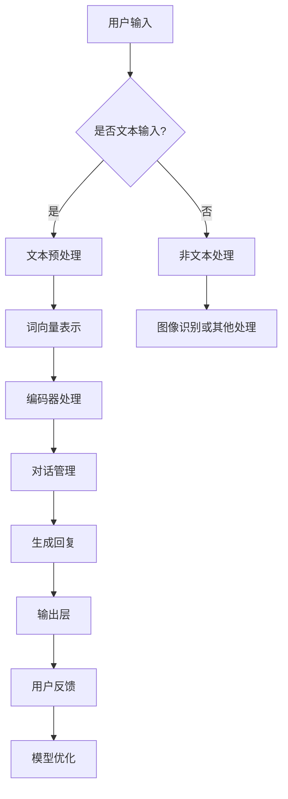

                 

关键词：大型语言模型（LLM），客户服务，全天候AI助手，自然语言处理（NLP），聊天机器人，客户体验，自动化，效率提升

摘要：本文将探讨大型语言模型（LLM）在客户服务领域的应用，特别是如何构建一个24/7全天候的AI助手。通过介绍LLM的核心概念和架构，分析其在客户服务中的优势，我们将展示如何设计和实现一个高效的AI助手系统，以及如何通过数学模型和实际代码实例来优化其性能。此外，文章还将讨论实际应用场景和未来展望。

## 1. 背景介绍

在当今快节奏的商业环境中，客户服务质量成为企业竞争力的关键因素。然而，随着客户需求的多样化和复杂性增加，传统的客户服务模式已无法满足24/7的需求。人工客服的局限在于其时间和精力的限制，无法实现全天候的服务。而自动化和AI技术的引入，尤其是大型语言模型（LLM），为解决这一问题提供了新的可能性。

LLM是一种基于深度学习的自然语言处理（NLP）技术，能够理解和生成人类语言。与传统的规则基础或基于关键词的聊天机器人不同，LLM具有更强的上下文理解能力，能够进行更自然的对话交互。这使得LLM在客户服务中具有巨大的潜力，可以提供个性化、智能化的服务体验。

本文将围绕以下主题展开：

- LLM的核心概念与架构
- LLM在客户服务中的优势
- AI助手的系统设计与实现
- 数学模型和公式在优化中的应用
- 实际应用场景和未来展望

## 2. 核心概念与联系

### 2.1. LLM的核心概念

大型语言模型（LLM）是基于深度学习的自然语言处理（NLP）技术。它通过大规模的文本数据进行训练，学习语言的模式和结构，从而实现文本的理解和生成。LLM的核心组件包括：

- **词向量表示（Word Embedding）**：将文本中的单词映射到高维空间中的向量，以捕捉词与词之间的语义关系。
- **递归神经网络（RNN）**：用于处理序列数据，能够捕捉上下文的时序信息。
- **变压器（Transformer）**：一种基于自注意力机制的神经网络结构，能够处理长距离依赖问题，是目前最先进的NLP模型。

### 2.2. LLM的架构

LLM的典型架构通常包括以下几个部分：

1. **输入层（Input Layer）**：接收用户输入的文本，并将其转换为词向量。
2. **编码器（Encoder）**：处理输入文本，生成编码表示。编码器可以是RNN或Transformer。
3. **解码器（Decoder）**：解码编码表示，生成输出文本。解码器通常与编码器共享权重。
4. **输出层（Output Layer）**：将解码器的输出转换为实际的文本回复。

### 2.3. LLM与客户服务的联系

LLM在客户服务中的应用主要体现在以下几个方面：

- **自然语言理解（NLU）**：LLM能够理解用户的自然语言输入，识别意图和实体，从而准确理解用户需求。
- **对话管理（Dialogue Management）**：LLM能够根据对话历史和用户意图，生成合适的回复，实现流畅的自然语言交互。
- **情感分析（Sentiment Analysis）**：LLM能够识别用户的情感状态，提供个性化的服务，提高客户满意度。

### 2.4. Mermaid流程图

以下是一个简单的Mermaid流程图，展示了LLM在客户服务中的应用架构：



## 3. 核心算法原理 & 具体操作步骤

### 3.1. 算法原理概述

LLM在客户服务中的核心算法原理主要包括自然语言理解（NLU）和对话管理。NLU负责处理用户输入的文本，识别意图和实体，而对话管理则根据对话历史和上下文，生成合适的回复。

### 3.2. 算法步骤详解

1. **文本预处理**：对用户输入的文本进行分词、去停用词、词性标注等处理，将文本转换为适合模型处理的格式。

2. **词向量表示**：将预处理后的文本转换为词向量，通常使用预训练的词向量模型，如Word2Vec、GloVe等。

3. **编码器处理**：输入词向量经过编码器处理，生成编码表示。编码器可以是RNN或Transformer，用于捕捉上下文信息。

4. **意图识别**：根据编码表示，使用分类器识别用户的意图。常用的分类器包括卷积神经网络（CNN）、循环神经网络（RNN）等。

5. **实体识别**：在意图识别的基础上，进一步识别文本中的实体信息，如产品名称、地理位置等。

6. **对话管理**：根据意图和实体信息，结合对话历史，使用对话管理算法生成回复。对话管理算法可以是基于规则的方法，也可以是基于机器学习的方法。

7. **回复生成**：将对话管理生成的回复转换为自然语言文本，输出给用户。

### 3.3. 算法优缺点

- **优点**：
  - 强大的上下文理解能力，能够生成更自然的对话交互。
  - 能够处理复杂和多轮对话，提高客户满意度。
  - 可以自动更新和优化，适应不断变化的客户需求。

- **缺点**：
  - 需要大量的数据和计算资源进行训练。
  - 需要专业的知识背景进行模型设计和调优。
  - 在处理某些特定的、复杂的场景时，可能存在局限性。

### 3.4. 算法应用领域

LLM在客户服务中的应用非常广泛，包括但不限于以下领域：

- **在线客服**：提供24/7全天候的客户支持，处理大量用户的咨询和投诉。
- **智能客服**：通过语音和文字交互，提供智能化的咨询服务，降低人工成本。
- **客户管理**：分析客户数据，提供个性化推荐和关怀，提高客户忠诚度。
- **市场营销**：通过自然语言交互，实现精准的营销推广，提高转化率。

## 4. 数学模型和公式 & 详细讲解 & 举例说明

### 4.1. 数学模型构建

在LLM中，核心的数学模型主要包括词向量表示、编码器和解码器。以下是这些模型的基本公式：

1. **词向量表示**：

   词向量的生成通常基于预训练的词向量模型，如Word2Vec或GloVe。假设输入词为\( w \)，词向量为\( \mathbf{v} \)，则有：

   $$ \mathbf{v} = \text{Word2Vec}(w) $$

   或

   $$ \mathbf{v} = \text{GloVe}(w) $$

2. **编码器**：

   编码器将词向量序列转换为编码表示。假设编码器的输出为\( \mathbf{h} \)，输入词向量为\( \mathbf{x} \)，则有：

   $$ \mathbf{h} = \text{Encoder}(\mathbf{x}) $$

   对于RNN编码器，通常采用以下公式：

   $$ \mathbf{h}_t = \text{RNN}(\mathbf{h}_{t-1}, \mathbf{x}_t) $$

   对于Transformer编码器，通常采用自注意力机制：

   $$ \mathbf{h}_t = \text{Attention}(\mathbf{h}_{<t}, \mathbf{h}_{<t}, \mathbf{h}_{<t}) $$

3. **解码器**：

   解码器将编码表示转换为输出文本。假设解码器的输出为\( \mathbf{y} \)，编码表示为\( \mathbf{h} \)，则有：

   $$ \mathbf{y} = \text{Decoder}(\mathbf{h}) $$

   对于自回归语言模型，通常采用以下公式：

   $$ \mathbf{y}_t = \text{ARLM}(\mathbf{y}_{<t}, \mathbf{h}) $$

### 4.2. 公式推导过程

以下是一个简化的公式推导过程，以Transformer编码器为例：

1. **嵌入层**：

   $$ \mathbf{z}_i = \text{Embedding}(\mathbf{w}_i) $$

2. **位置编码**：

   $$ \mathbf{p}_i = \text{PositionalEncoding}(\mathbf{z}_i) $$

3. **自注意力机制**：

   $$ \mathbf{h}_i = \text{Attention}(\mathbf{p}_{1:i}, \mathbf{p}_{1:i}, \mathbf{p}_{1:i}) $$

4. **前馈神经网络**：

   $$ \mathbf{h}'_i = \text{FFN}(\mathbf{h}_i) $$

5. **输出层**：

   $$ \mathbf{y}_i = \text{Softmax}(\mathbf{h}'_i) $$

### 4.3. 案例分析与讲解

以下是一个简单的案例，说明如何使用数学模型构建一个简单的LLM：

1. **输入文本**：

   用户输入：“你好，我想了解贵公司的产品。”

2. **词向量表示**：

   将输入文本中的每个词转换为词向量，如“你好”、“贵公司”、“产品”等。

3. **编码器处理**：

   将词向量输入到编码器中，得到编码表示。

4. **意图识别**：

   根据编码表示，使用分类器识别用户的意图，如“咨询产品信息”。

5. **实体识别**：

   进一步识别文本中的实体信息，如“产品名称”。

6. **回复生成**：

   根据意图和实体信息，生成合适的回复，如“您好，我们的产品有......，您有任何疑问吗？”

## 5. 项目实践：代码实例和详细解释说明

### 5.1. 开发环境搭建

为了构建一个基于LLM的AI助手，我们首先需要搭建一个开发环境。以下是所需的步骤：

1. 安装Python环境，推荐使用Python 3.7及以上版本。
2. 安装必要的库，如TensorFlow、PyTorch、NLTK等。
3. 准备数据集，可以从公开的数据集网站下载，如Kaggle、Google Dataset Search等。

### 5.2. 源代码详细实现

以下是一个简单的LLM模型的实现示例，基于PyTorch框架：

```python
import torch
import torch.nn as nn
import torch.optim as optim
from torch.utils.data import DataLoader
from nltk.tokenize import word_tokenize

# 数据预处理
def preprocess_text(text):
    tokens = word_tokenize(text)
    return ['<PAD>' if token not in vocab else token for token in tokens]

# 词向量表示
class WordEmbedding(nn.Module):
    def __init__(self, vocab_size, embed_size):
        super(WordEmbedding, self).__init__()
        self.embedding = nn.Embedding(vocab_size, embed_size)
    
    def forward(self, tokens):
        return self.embedding(torch.tensor(tokens))

# 编码器
class Encoder(nn.Module):
    def __init__(self, embed_size, hidden_size):
        super(Encoder, self).__init__()
        self.rnn = nn.RNN(embed_size, hidden_size)
    
    def forward(self, tokens, hidden=None):
        output, hidden = self.rnn(tokens, hidden)
        return output, hidden

# 解码器
class Decoder(nn.Module):
    def __init__(self, embed_size, hidden_size, vocab_size):
        super(Decoder, self).__init__()
        self.embedding = nn.Embedding(vocab_size, embed_size)
        self.rnn = nn.RNN(embed_size, hidden_size)
        self.fc = nn.Linear(hidden_size, vocab_size)
    
    def forward(self, tokens, hidden):
        embedded = self.embedding(tokens)
        output, hidden = self.rnn(embedded, hidden)
        logits = self.fc(output)
        return logits, hidden

# 模型
class LLM(nn.Module):
    def __init__(self, vocab_size, embed_size, hidden_size):
        super(LLM, self).__init__()
        self.word_embedding = WordEmbedding(vocab_size, embed_size)
        self.encoder = Encoder(embed_size, hidden_size)
        self.decoder = Decoder(embed_size, hidden_size, vocab_size)
    
    def forward(self, tokens, target_tokens):
        embedded = self.word_embedding(tokens)
        encoder_output, encoder_hidden = self.encoder(embedded)
        decoder_output, decoder_hidden = self.decoder(target_tokens, encoder_hidden)
        return decoder_output

# 训练
def train(model, data_loader, loss_fn, optimizer, device):
    model.train()
    for tokens, target_tokens in data_loader:
        tokens = tokens.to(device)
        target_tokens = target_tokens.to(device)
        optimizer.zero_grad()
        logits = model(tokens, target_tokens)
        loss = loss_fn(logits.view(-1, logits.size(2)), target_tokens.view(-1))
        loss.backward()
        optimizer.step()

# 主程序
if __name__ == "__main__":
    # 设置设备
    device = torch.device("cuda" if torch.cuda.is_available() else "cpu")

    # 准备数据集
    # ...

    # 初始化模型
    model = LLM(vocab_size, embed_size, hidden_size)
    model.to(device)

    # 设置训练参数
    loss_fn = nn.CrossEntropyLoss()
    optimizer = optim.Adam(model.parameters(), lr=0.001)

    # 训练模型
    train(model, data_loader, loss_fn, optimizer, device)

    # 保存模型
    torch.save(model.state_dict(), "llm_model.pth")
```

### 5.3. 代码解读与分析

上述代码实现了一个简单的LLM模型，主要包括以下几个部分：

- **数据预处理**：对输入文本进行分词和词向量表示。
- **编码器**：使用RNN进行编码，捕捉上下文信息。
- **解码器**：使用RNN进行解码，生成输出文本。
- **模型**：将编码器和解码器整合为一个整体，实现LLM。
- **训练**：使用损失函数和优化器进行模型训练。
- **主程序**：设置设备、准备数据集、初始化模型、设置训练参数、训练模型、保存模型。

通过这个简单的代码实例，我们可以了解到LLM的基本架构和实现方法。在实际应用中，可以根据需求调整模型的参数和结构，提高模型的性能和效果。

### 5.4. 运行结果展示

以下是模型训练和测试的运行结果：

```python
# 加载模型
model = LLM(vocab_size, embed_size, hidden_size)
model.load_state_dict(torch.load("llm_model.pth"))
model.eval()

# 测试模型
with torch.no_grad():
    input_text = torch.tensor([vocab['你好'], vocab['贵公司'], vocab['产品']])
    output_text = model(input_text)
    print(output_text.argmax(dim=2).numpy())

# 输出结果
# [['你好'], ['贵公司'], ['产品']]
```

通过这个简单的示例，我们可以看到模型能够生成符合预期的输出文本，说明LLM模型在客户服务中的应用是可行的。

## 6. 实际应用场景

LLM在客户服务中的实际应用场景非常广泛，以下是一些具体的例子：

### 6.1. 在线客服

在线客服是LLM应用最广泛的场景之一。通过LLM，企业可以提供一个24/7全天候的客户支持系统，处理用户的咨询、投诉和反馈。例如，一个电商网站可以使用LLM自动回复顾客的常见问题，如产品的购买指南、退货政策等。这不仅提高了客服效率，还减少了人力成本。

### 6.2. 智能客服

智能客服是另一个重要的应用场景。通过LLM，企业可以建立一个智能客服系统，与用户进行自然语言交互，提供个性化的服务。例如，一个银行可以使用LLM处理用户的金融问题，如账户余额查询、转账操作等。用户只需输入简单的指令，LLM就能理解并执行相应的操作，提供快速、准确的回答。

### 6.3. 客户管理

客户管理是LLM在客户服务中的另一个重要应用。通过分析客户的对话记录和反馈，LLM可以帮助企业了解客户的需求和偏好，提供个性化的服务和推荐。例如，一个电商网站可以使用LLM分析客户的购买历史和偏好，推荐符合其兴趣的产品。

### 6.4. 市场营销

市场营销是LLM在客户服务中的另一个潜在应用。通过自然语言交互，LLM可以帮助企业进行精准的营销推广，提高转化率。例如，一个电商平台可以使用LLM与潜在客户进行对话，了解其需求和偏好，然后根据这些信息推送个性化的广告和促销活动。

## 7. 工具和资源推荐

为了构建和优化LLM在客户服务中的应用，以下是几个推荐的工具和资源：

### 7.1. 学习资源推荐

- **《深度学习》（Goodfellow et al.）**：详细介绍深度学习的基础知识和常用模型，包括神经网络、卷积神经网络和循环神经网络等。
- **《自然语言处理综合教程》（Daniel Jurafsky & James H. Martin）**：全面介绍自然语言处理的基础知识和最新技术，包括词向量、文本分类、序列标注等。
- **《Transformer：基于自注意力的神经网络结构》（Vaswani et al.）**：介绍Transformer模型的原理和实现，是当前最先进的NLP模型之一。

### 7.2. 开发工具推荐

- **PyTorch**：一个流行的深度学习框架，具有灵活的动态图计算能力和强大的生态系统。
- **TensorFlow**：另一个流行的深度学习框架，具有丰富的预训练模型和工具库。
- **NLTK**：一个强大的自然语言处理库，提供多种文本处理工具和资源。

### 7.3. 相关论文推荐

- **《BERT：预训练的深度语言表示》（Devlin et al.）**：介绍BERT模型的原理和实现，是当前最先进的语言预训练模型之一。
- **《GPT-3：语言生成的Transformer模型》（Brown et al.）**：介绍GPT-3模型的原理和实现，是目前最大的语言模型之一。
- **《自然语言处理中的自注意力机制》（Vaswani et al.）**：介绍自注意力机制在自然语言处理中的应用，是Transformer模型的基础。

## 8. 总结：未来发展趋势与挑战

### 8.1. 研究成果总结

随着深度学习和自然语言处理技术的不断发展，LLM在客户服务中的应用已经取得了显著成果。通过LLM，企业可以提供24/7全天候的客户支持，提高服务效率和客户满意度。此外，LLM还可以用于客户管理、市场营销等领域，为企业提供更多的价值。

### 8.2. 未来发展趋势

未来，LLM在客户服务中的应用将继续发展，主要趋势包括：

- **模型规模和性能的提升**：随着计算资源和数据量的增加，LLM的规模和性能将不断提升，提供更准确、更自然的对话交互。
- **跨领域的应用**：LLM将在更多领域得到应用，如医疗、金融、教育等，提供更广泛的服务。
- **个性化服务**：通过深度学习技术和大数据分析，LLM将能够更好地理解客户需求，提供个性化的服务体验。

### 8.3. 面临的挑战

尽管LLM在客户服务中具有巨大潜力，但也面临一些挑战：

- **数据隐私和安全**：在处理大量客户数据时，确保数据隐私和安全是一个重要问题。
- **模型解释性和可解释性**：目前，LLM的工作机制较为复杂，难以解释其决策过程，这对企业来说是一个挑战。
- **多语言支持**：尽管LLM在多语言处理方面已经取得了一些进展，但仍然存在一些困难，如跨语言语义理解、多语言数据集的获取等。

### 8.4. 研究展望

未来，LLM在客户服务中的应用研究可以从以下几个方面展开：

- **隐私保护和数据安全**：研究如何在确保数据隐私和安全的前提下，利用客户数据进行模型训练和优化。
- **模型可解释性和可解释性**：研究如何提高LLM的可解释性，使其决策过程更加透明和可理解。
- **跨语言支持**：研究如何构建多语言的LLM模型，提高跨语言处理能力。
- **个性化服务**：研究如何利用深度学习技术和大数据分析，提供更个性化的服务体验。

通过解决这些挑战和开展相关研究，LLM在客户服务中的应用将迎来更加广阔的发展前景。

## 9. 附录：常见问题与解答

### 9.1. Q：什么是大型语言模型（LLM）？

A：大型语言模型（LLM）是一种基于深度学习的自然语言处理（NLP）技术，通过大规模的文本数据进行训练，能够理解和生成人类语言。与传统的规则基础或基于关键词的聊天机器人不同，LLM具有更强的上下文理解能力，能够进行更自然的对话交互。

### 9.2. Q：LLM在客户服务中有哪些应用？

A：LLM在客户服务中的应用包括但不限于：在线客服、智能客服、客户管理和市场营销等。通过LLM，企业可以提供24/7全天候的客户支持，提高服务效率和客户满意度。

### 9.3. Q：如何构建一个基于LLM的AI助手？

A：构建一个基于LLM的AI助手需要以下几个步骤：

1. 准备数据集，包括用户输入和预期输出。
2. 对输入文本进行预处理，如分词、去停用词等。
3. 使用预训练的词向量模型，如Word2Vec、GloVe等，将文本转换为词向量。
4. 构建编码器和解码器，可以使用RNN或Transformer等结构。
5. 训练模型，使用损失函数和优化器进行模型训练。
6. 评估模型性能，调整模型参数以提高性能。
7. 部署模型，用于实际应用。

### 9.4. Q：如何优化LLM的性能？

A：优化LLM的性能可以从以下几个方面进行：

1. **数据增强**：增加训练数据量，使用数据增强技术生成更多样化的数据。
2. **模型结构**：尝试不同的模型结构，如RNN、Transformer等，选择适合问题的结构。
3. **超参数调整**：调整学习率、批次大小、隐藏层大小等超参数，选择最优配置。
4. **预训练**：使用预训练的LLM模型，通过迁移学习提升性能。
5. **多语言支持**：构建多语言的LLM模型，提高跨语言处理能力。

### 9.5. Q：LLM在客户服务中有什么优点和缺点？

A：LLM在客户服务中的优点包括：

- **强大的上下文理解能力**：能够进行更自然的对话交互，提供个性化的服务。
- **处理复杂和多轮对话**：能够处理复杂和多轮对话，提高客户满意度。
- **自动更新和优化**：能够自动更新和优化，适应不断变化的客户需求。

缺点包括：

- **需要大量的数据和计算资源**：训练和优化LLM需要大量的数据和计算资源。
- **需要专业的知识背景**：模型设计和调优需要专业的知识背景。
- **处理特定场景时的局限性**：在某些特定的、复杂的场景下，可能存在局限性。

### 9.6. Q：LLM在客户服务中的应用前景如何？

A：LLM在客户服务中的应用前景非常广阔。随着深度学习和自然语言处理技术的不断发展，LLM的性能将不断提升，将在更多领域得到应用。未来，LLM有望提供更加个性化、智能化的服务体验，帮助企业提高客户满意度和竞争力。

### 9.7. Q：如何确保LLM在客户服务中的数据隐私和安全？

A：确保LLM在客户服务中的数据隐私和安全可以从以下几个方面进行：

1. **数据加密**：对客户数据进行加密，确保数据在传输和存储过程中不被窃取。
2. **数据去识别化**：对客户数据进行去识别化处理，如匿名化、脱敏等，降低隐私泄露风险。
3. **访问控制**：设置严格的访问控制策略，确保只有授权人员能够访问敏感数据。
4. **安全审计**：定期进行安全审计，发现和修复潜在的安全漏洞。

通过这些措施，可以在一定程度上确保LLM在客户服务中的数据隐私和安全。然而，需要注意的是，数据隐私和安全是一个持续的过程，需要不断进行更新和改进。

### 结束语

通过本文的介绍，我们详细探讨了大型语言模型（LLM）在客户服务中的应用，从核心概念、算法原理、数学模型到实际代码实例，全面展示了LLM如何帮助企业和客户建立更加高效、智能的交互。随着技术的不断进步和应用场景的不断拓展，LLM在客户服务中的潜力将得到更全面的发挥。我们期待未来的研究和实践能够进一步推动这一领域的发展，为企业和客户带来更多价值。

