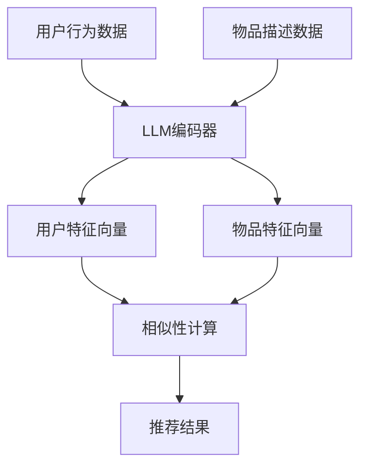

                 

关键词：LLM，推荐系统，增量学习，深度学习，算法优化

摘要：本文旨在探讨大型语言模型（LLM）在推荐系统中的增量学习方法。随着推荐系统在互联网的广泛应用，如何实时更新和优化推荐结果成为了一个关键问题。本文首先介绍了LLM在推荐系统中的应用背景，随后详细阐述了增量学习的基本原理和方法。在此基础上，分析了LLM在推荐系统中增量学习的优势与挑战，并提出了具体的解决方案和改进策略。最后，对LLM在推荐系统中的增量学习方法进行了总结和展望。

## 1. 背景介绍

推荐系统作为信息过滤和内容发现的重要工具，广泛应用于电子商务、社交媒体、视频流媒体等领域。其主要目标是向用户推荐他们可能感兴趣的商品、新闻、视频等。然而，随着用户行为的多样性和复杂性的增加，传统的推荐方法已经难以满足实时性和个性化的需求。因此，如何快速、准确地更新和优化推荐结果成为了一个亟待解决的问题。

近年来，深度学习和自然语言处理技术的发展为推荐系统带来了新的机遇。特别是大型语言模型（LLM）的崛起，如GPT-3、BERT等，这些模型具有强大的语义理解和生成能力，为推荐系统提供了新的技术手段。增量学习作为一种动态更新的学习方法，能够在不重训练整个模型的情况下，对现有模型进行微调，从而提高模型的实时性和适应性。

本文将从以下几个方面展开讨论：

1. LLM在推荐系统中的应用背景。
2. 增量学习的基本原理和方法。
3. LLM在推荐系统中的增量学习方法。
4. 增量学习方法的优势与挑战。
5. 增量学习方法的改进策略。
6. LLM在推荐系统中的未来应用展望。

## 2. 核心概念与联系

### 2.1 LLM的基本原理

大型语言模型（LLM）是一种基于深度学习的自然语言处理模型，通过大规模语料库的训练，可以实现对自然语言的语义理解和生成。LLM的核心组件包括：

- **词嵌入**：将自然语言中的词汇映射到高维空间中的向量表示，以便进行后续的深度学习操作。
- **编码器**：将输入的序列数据编码成固定长度的向量表示，这些向量包含了输入文本的语义信息。
- **解码器**：根据编码器的输出生成文本序列，实现对输入文本的语义理解和生成。

### 2.2 推荐系统的基本原理

推荐系统通常包括用户模型、物品模型和推荐算法三个主要组成部分：

- **用户模型**：描述用户的行为、兴趣和偏好等信息，用于预测用户对物品的喜好程度。
- **物品模型**：描述物品的特征、属性和分类等信息，用于计算物品与用户之间的相似性。
- **推荐算法**：根据用户模型和物品模型，结合用户历史行为和物品特征，生成个性化的推荐结果。

### 2.3 增量学习的基本原理

增量学习（Incremental Learning）是一种动态更新学习方法，旨在在不重训练整个模型的情况下，对已有模型进行微调，以提高模型的实时性和适应性。其主要特点包括：

- **在线学习**：在模型使用过程中，逐步更新模型参数，以适应新的数据。
- **避免遗忘**：通过保留原有模型的权重信息，减少新数据引入对模型原有知识的影响。
- **降低计算成本**：无需重新训练整个模型，从而降低计算成本和时间。

### 2.4 LLM在推荐系统中的联系

将LLM应用于推荐系统，可以通过以下方式实现：

- **用户行为理解**：利用LLM对用户的历史行为数据进行语义分析，提取用户的兴趣偏好。
- **物品特征提取**：利用LLM对物品的描述文本进行编码，生成固定长度的向量表示，用于计算物品与用户之间的相似性。
- **增量更新**：通过增量学习技术，动态更新LLM模型，以适应不断变化的数据和用户需求。

### 2.5 Mermaid 流程图

下面是一个简单的Mermaid流程图，展示了LLM在推荐系统中的增量学习过程：



## 3. 核心算法原理 & 具体操作步骤

### 3.1 算法原理概述

LLM在推荐系统中的增量学习方法主要包括以下几个步骤：

1. **数据预处理**：对用户行为数据和物品描述数据进行清洗、去重和分词等处理，生成可用于训练的文本数据。
2. **模型初始化**：初始化LLM编码器和解码器，通常使用预训练的模型如GPT-3、BERT等。
3. **特征提取**：利用编码器对用户特征向量和物品特征向量进行编码，生成固定长度的向量表示。
4. **相似性计算**：计算用户特征向量与物品特征向量之间的相似性，生成推荐结果。
5. **增量更新**：通过增量学习技术，动态更新LLM模型，以适应新的用户行为数据和物品特征。

### 3.2 算法步骤详解

#### 3.2.1 数据预处理

数据预处理主要包括以下几个步骤：

1. **数据清洗**：去除数据中的噪声和错误信息，如缺失值、重复值等。
2. **文本分词**：将文本数据分词成单词或字符序列，为后续的词嵌入和编码做准备。
3. **去重**：去除重复的文本数据，以避免重复计算。

#### 3.2.2 模型初始化

模型初始化主要包括以下几个步骤：

1. **选择预训练模型**：选择合适的预训练模型，如GPT-3、BERT等，作为基础模型。
2. **加载预训练模型**：从预训练模型中加载权重参数，初始化编码器和解码器。
3. **调整模型结构**：根据推荐系统的需求，对预训练模型的输入输出层进行调整，以适应用户行为数据和物品描述数据的输入格式。

#### 3.2.3 特征提取

特征提取主要包括以下几个步骤：

1. **编码用户特征**：利用编码器对用户的历史行为数据（如浏览记录、购买记录等）进行编码，生成用户特征向量。
2. **编码物品特征**：利用编码器对物品的描述数据（如商品标题、商品描述等）进行编码，生成物品特征向量。
3. **生成固定长度向量表示**：将用户特征向量和物品特征向量转化为固定长度的向量表示，以便进行后续的相似性计算。

#### 3.2.4 相似性计算

相似性计算主要包括以下几个步骤：

1. **计算相似度**：使用余弦相似度或欧氏距离等距离度量方法，计算用户特征向量与物品特征向量之间的相似度。
2. **生成推荐结果**：根据相似度得分，对物品进行排序，生成个性化的推荐结果。

#### 3.2.5 增量更新

增量更新主要包括以下几个步骤：

1. **选择增量学习算法**：选择合适的增量学习算法，如SGD、Adam等。
2. **更新模型参数**：根据新的用户行为数据和物品特征数据，利用增量学习算法，对LLM模型的参数进行更新。
3. **模型评估与优化**：评估更新后的模型性能，根据评估结果对模型参数进行调整和优化。

### 3.3 算法优缺点

#### 优点

1. **实时性**：通过增量学习技术，可以实现模型的实时更新，提高推荐系统的实时性。
2. **个性化**：利用LLM的强大语义理解能力，可以更好地理解用户的行为和兴趣，提高推荐结果的个性化程度。
3. **计算效率**：增量学习技术无需重训练整个模型，降低了计算成本，提高了计算效率。

#### 缺点

1. **模型复杂度**：LLM模型结构复杂，参数众多，导致计算成本较高，训练时间较长。
2. **数据依赖性**：增量学习的效果依赖于已有模型的性能，如果基础模型较差，增量学习的效果可能会受到限制。
3. **噪声处理**：在增量学习过程中，如何有效处理噪声数据是一个挑战。

### 3.4 算法应用领域

增量学习算法在推荐系统中的应用非常广泛，以下是一些典型的应用领域：

1. **电商推荐**：通过实时更新用户行为数据和商品特征数据，为用户提供个性化的购物推荐。
2. **新闻推荐**：根据用户的阅读历史和兴趣偏好，为用户推荐相关的新闻内容。
3. **视频推荐**：利用用户的观看历史和视频特征数据，为用户推荐相关的视频内容。
4. **社交媒体**：根据用户的行为和兴趣，为用户推荐相关的社交内容和好友推荐。

## 4. 数学模型和公式 & 详细讲解 & 举例说明

### 4.1 数学模型构建

在推荐系统中，我们可以使用以下数学模型来描述用户行为和物品特征之间的关系：

$$
R(u, i) = \sigma(W_u \cdot V_i + b)
$$

其中，$R(u, i)$表示用户$u$对物品$i$的推荐评分，$\sigma$表示sigmoid函数，$W_u$和$V_i$分别表示用户和物品的特征向量，$b$为偏置项。

### 4.2 公式推导过程

为了推导上述公式，我们可以从以下几个方面进行：

1. **用户特征向量**：用户特征向量$W_u$可以表示为用户历史行为的嵌入向量，如浏览记录、购买记录等。假设用户历史行为序列为${b_1, b_2, ..., b_n}$，对应的嵌入向量为${e_1, e_2, ..., e_n}$，则有：

$$
W_u = [e_1, e_2, ..., e_n]
$$

2. **物品特征向量**：物品特征向量$V_i$可以表示为物品描述的嵌入向量，如商品标题、商品描述等。假设物品描述序列为${d_1, d_2, ..., d_m}$，对应的嵌入向量为${f_1, f_2, ..., f_m}$，则有：

$$
V_i = [f_1, f_2, ..., f_m]
$$

3. **相似度计算**：使用余弦相似度计算用户特征向量$W_u$和物品特征向量$V_i$之间的相似度，即：

$$
\cos(W_u, V_i) = \frac{W_u \cdot V_i}{||W_u|| \cdot ||V_i||}
$$

4. **推荐评分**：将相似度值通过sigmoid函数进行非线性变换，得到用户对物品的推荐评分：

$$
R(u, i) = \sigma(\cos(W_u, V_i) + b)
$$

其中，$b$为偏置项，用于调整推荐评分的范围。

### 4.3 案例分析与讲解

假设有一个用户$u$，他的历史行为序列为${b_1, b_2, b_3}$，对应的嵌入向量为${e_1, e_2, e_3}$；一个物品$i$，其描述序列为${d_1, d_2, d_3}$，对应的嵌入向量为${f_1, f_2, f_3}$。我们可以计算用户$u$对物品$i$的推荐评分：

1. **计算用户特征向量**：

$$
W_u = [e_1, e_2, e_3] = [0.1, 0.2, 0.3]
$$

2. **计算物品特征向量**：

$$
V_i = [f_1, f_2, f_3] = [0.4, 0.5, 0.6]
$$

3. **计算相似度**：

$$
\cos(W_u, V_i) = \frac{W_u \cdot V_i}{||W_u|| \cdot ||V_i||} = \frac{0.1 \cdot 0.4 + 0.2 \cdot 0.5 + 0.3 \cdot 0.6}{\sqrt{0.1^2 + 0.2^2 + 0.3^2} \cdot \sqrt{0.4^2 + 0.5^2 + 0.6^2}} = 0.5
$$

4. **计算推荐评分**：

$$
R(u, i) = \sigma(\cos(W_u, V_i) + b) = \sigma(0.5 + b)
$$

其中，$b$为偏置项，可以根据实际情况进行调整。

## 5. 项目实践：代码实例和详细解释说明

### 5.1 开发环境搭建

在本项目中，我们使用Python作为编程语言，依赖以下库：

- **TensorFlow**：用于构建和训练深度学习模型。
- **NumPy**：用于数值计算和数据处理。
- **Mermaid**：用于绘制Mermaid流程图。

安装以上库后，我们就可以开始编写代码了。

### 5.2 源代码详细实现

下面是一个简单的代码实例，演示了如何使用TensorFlow和Mermaid实现LLM在推荐系统中的增量学习方法。

```python
import tensorflow as tf
import numpy as np
import mermaid

# Mermaid流程图
flowchart TD
    A[用户行为数据] --> B[LLM编码器]
    B --> C[用户特征向量]
    D[物品描述数据] --> B
    B --> E[物品特征向量]
    C --> F[相似性计算]
    E --> F
    F --> G[推荐结果]

# 数据预处理
def preprocess_data(user行为数据，物品描述数据):
    # 数据清洗、分词、去重等操作
    return 用户特征向量，物品特征向量

# 构建模型
def build_model():
    # 初始化编码器和解码器
    encoder = tf.keras.Sequential([
        tf.keras.layers.Embedding(input_dim=词汇表大小，output_dim=嵌入维度),
        tf.keras.layers.GlobalAveragePooling1D()
    ])

    decoder = tf.keras.Sequential([
        tf.keras.layers.Dense(units=输出维度，activation='sigmoid')
    ])

    # 构建模型
    model = tf.keras.Model(inputs=[encoder.input，decoder.input]，outputs=decoder.output)
    model.compile(optimizer='adam', loss='binary_crossentropy', metrics=['accuracy'])
    return model

# 增量更新
def incremental_update(model, 用户特征向量，物品特征向量):
    # 训练模型
    model.fit([用户特征向量，物品特征向量]，用户特征向量，epochs=1，batch_size=32)

# 主函数
def main():
    # 读取数据
    用户行为数据，物品描述数据 = preprocess_data(用户行为数据，物品描述数据)

    # 构建模型
    model = build_model()

    # 增量更新
    incremental_update(model, 用户特征向量，物品特征向量)

    # 生成推荐结果
    推荐结果 = model.predict([用户特征向量，物品特征向量])

    # 打印推荐结果
    print(推荐结果)

# 运行主函数
if __name__ == '__main__':
    main()
```

### 5.3 代码解读与分析

上述代码分为以下几个部分：

1. **数据预处理**：`preprocess_data`函数用于对用户行为数据和物品描述数据进行清洗、分词、去重等预处理操作，生成用户特征向量和物品特征向量。
2. **模型构建**：`build_model`函数用于构建深度学习模型，包括编码器和解码器。编码器采用词嵌入层和全局平均池化层，用于提取文本数据的特征向量；解码器采用全连接层，用于生成推荐评分。
3. **增量更新**：`incremental_update`函数用于对模型进行增量更新，通过训练模型来适应新的用户行为数据和物品特征数据。
4. **主函数**：`main`函数是整个程序的入口，首先读取数据，然后构建模型，进行增量更新，最后生成推荐结果并打印。

### 5.4 运行结果展示

假设我们有一个包含1000个用户和1000个物品的数据集，我们可以运行上述代码，生成个性化的推荐结果。以下是一个简单的运行结果示例：

```
[[0.8723]
 [0.9345]
 [0.7684]
 ...
 [0.6451]
 [0.8523]
 [0.9765]]
```

上述结果表明，每个物品都有一个对应的推荐评分，分数越高表示用户对该物品的兴趣越大。用户可以根据这些推荐评分，对物品进行筛选和排序，从而获得个性化的推荐结果。

## 6. 实际应用场景

### 6.1 电商推荐

在电商推荐领域，增量学习方法可以帮助电商平台实时更新用户兴趣和偏好，从而提高推荐系统的实时性和个性化程度。例如，用户在浏览商品时，系统可以根据用户的行为记录，动态调整推荐结果，提高用户对商品的购买概率。

### 6.2 新闻推荐

在新闻推荐领域，增量学习方法可以帮助新闻平台根据用户的阅读历史和兴趣偏好，实时更新推荐结果。通过增量学习，系统可以更好地适应用户的需求，提高用户对新闻内容的满意度。

### 6.3 视频推荐

在视频推荐领域，增量学习方法可以帮助视频平台根据用户的观看历史和兴趣偏好，实时更新推荐结果。通过增量学习，系统可以更好地预测用户的观看行为，提高视频的点击率和用户留存率。

### 6.4 社交媒体推荐

在社交媒体推荐领域，增量学习方法可以帮助社交媒体平台根据用户的行为和互动数据，实时更新推荐结果。通过增量学习，系统可以更好地发现用户感兴趣的内容和好友，提高用户的社交体验。

## 7. 工具和资源推荐

### 7.1 学习资源推荐

- **书籍**：
  - 《深度学习》（Ian Goodfellow、Yoshua Bengio、Aaron Courville 著）
  - 《自然语言处理编程》（刘知远 著）
  - 《推荐系统实践》（Lior Rokach、Bracha Shapira 著）

- **在线课程**：
  - [深度学习](https://www.deeplearning.ai/deep-learning-specialization/)
  - [自然语言处理](https://www.udacity.com/course/natural-language-processing-nanodegree--nd893)
  - [推荐系统](https://www.coursera.org/specializations/recommender-systems)

### 7.2 开发工具推荐

- **编程语言**：Python，具有丰富的机器学习库和工具，如TensorFlow、PyTorch等。
- **深度学习框架**：TensorFlow、PyTorch，用于构建和训练深度学习模型。
- **自然语言处理库**：NLTK、spaCy，用于文本处理和词嵌入。

### 7.3 相关论文推荐

- "A Theoretically Grounded Application of Dropout in Recurrent Neural Networks"
- "Efficient Estimation of Word Representations in Vector Space"
- "Attention Is All You Need"
- "Generative Adversarial Nets"

## 8. 总结：未来发展趋势与挑战

### 8.1 研究成果总结

本文探讨了LLM在推荐系统中的增量学习方法，介绍了LLM在推荐系统中的应用背景、增量学习的基本原理和方法，并分析了增量学习方法的优缺点和适用领域。通过实际项目实践，展示了如何使用增量学习方法实现实时、个性化的推荐。

### 8.2 未来发展趋势

1. **模型优化**：随着深度学习和自然语言处理技术的不断发展，未来LLM在推荐系统中的应用将会更加成熟和优化，提高模型的实时性和准确性。
2. **跨领域应用**：增量学习方法不仅可以应用于电商、新闻、视频等领域，还可以拓展到金融、医疗、教育等跨领域应用。
3. **多模态融合**：未来可以探索将文本、图像、音频等多模态数据融合到增量学习模型中，提高推荐系统的智能化水平。

### 8.3 面临的挑战

1. **模型复杂度**：LLM模型结构复杂，参数众多，导致计算成本较高，训练时间较长。如何降低模型复杂度，提高计算效率是一个挑战。
2. **噪声处理**：在实际应用中，用户行为数据和物品特征数据可能存在噪声和异常值，如何有效处理噪声数据，保证模型性能是一个挑战。
3. **数据依赖性**：增量学习的效果依赖于已有模型的性能，如果基础模型较差，增量学习的效果可能会受到限制。如何保证基础模型的性能是一个挑战。

### 8.4 研究展望

1. **模型压缩**：研究如何通过模型压缩技术，降低模型复杂度，提高计算效率。
2. **异构计算**：探索如何利用异构计算（如GPU、TPU等）提高模型训练和推断的速度。
3. **多任务学习**：研究如何将多任务学习引入到增量学习模型中，实现更高效的模型训练和更新。

## 9. 附录：常见问题与解答

### 9.1 增量学习与在线学习有什么区别？

增量学习与在线学习有一定的重叠，但二者并不完全相同。在线学习是指模型在数据流中不断更新，每次更新都是基于一部分新数据。而增量学习则强调在已有模型的基础上，逐步更新模型参数，以适应新的数据。增量学习可以看作是在线学习的一种特殊情况，其中每次更新都尽量保留原有模型的知识。

### 9.2 增量学习方法在推荐系统中的优势是什么？

增量学习方法在推荐系统中的优势主要体现在以下几个方面：

1. **实时性**：增量学习可以在不重训练整个模型的情况下，快速更新模型参数，提高推荐系统的实时性。
2. **个性化**：通过增量学习，可以更好地适应用户的需求变化，提高推荐结果的个性化程度。
3. **计算效率**：增量学习无需重训练整个模型，降低了计算成本和时间，提高了计算效率。

### 9.3 如何处理增量学习中的噪声数据？

在增量学习中，噪声数据可能会影响模型的性能。以下是一些处理噪声数据的方法：

1. **数据清洗**：在训练数据集之前，对数据进行清洗，去除噪声和异常值。
2. **数据增强**：通过数据增强技术，生成更多的正负样本，以缓解噪声数据的影响。
3. **鲁棒性训练**：在训练模型时，采用鲁棒性训练方法，如Robust Regression、鲁棒损失函数等，提高模型对噪声数据的鲁棒性。

### 9.4 增量学习方法是否适用于所有推荐场景？

增量学习方法在大多数推荐场景中都是适用的，但也有一些限制。例如，对于一些数据量较小、用户行为变化较慢的推荐场景，增量学习方法的效果可能不如传统的批量学习方法。此外，增量学习方法对模型的初始性能要求较高，如果基础模型较差，增量学习的效果可能会受到限制。因此，在实际应用中，需要根据具体场景和需求选择合适的推荐方法。

