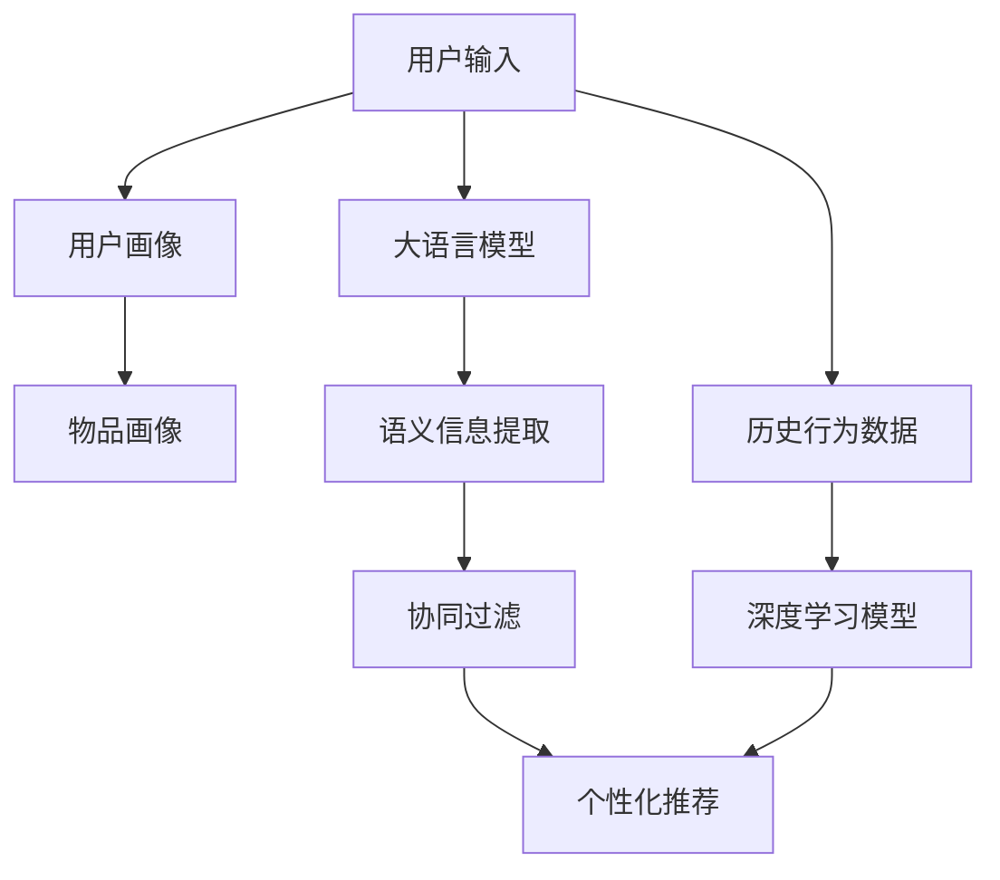

                 

# LLM在推荐系统中的应用综述

> 关键词：大语言模型(LLM),推荐系统,自适应推荐,个性化推荐,协同过滤,知识图谱,冷启动问题,多模态推荐,情感分析,文本相似度

## 1. 背景介绍

推荐系统在互联网电商、内容平台、社交媒体等各类服务中扮演着重要角色，其核心目标是通过算法为用户推荐符合其兴趣和需求的商品、内容或信息，提升用户体验，增加平台粘性和收益。随着用户数据的快速积累和计算能力的不断提升，推荐系统正在从基于规则的简单推荐向基于机器学习的复杂推荐迈进，逐步成为智能业务的重要引擎。

### 1.1 推荐系统演进

推荐系统的发展经历了以下几个重要阶段：

- **基于规则的推荐**：通过简单的统计和分类规则，结合用户行为数据，实现商品或内容的推荐。常见方法包括基于内容的推荐、协同过滤推荐等。
- **基于机器学习的推荐**：引入机器学习算法，根据用户历史行为数据和物品特征数据，构建预测模型，实现个性化的推荐。
- **深度学习推荐**：利用深度神经网络，构建用户画像和物品特征向量，实现更高效的推荐模型。
- **大语言模型(Large Language Models, LLMs)推荐**：借助大规模预训练语言模型，从用户输入的文本数据中提取深层次的语义信息，实现更加个性化的推荐。

本文重点探讨大语言模型在推荐系统中的应用，详细介绍基于大语言模型的推荐方法，并展望其未来的发展方向。

## 2. 核心概念与联系

### 2.1 核心概念概述

推荐系统通常包括三种类型的推荐：

1. **基于内容的推荐**：根据物品的属性特征和用户的历史行为，预测用户可能感兴趣的新物品。
2. **协同过滤推荐**：通过分析用户之间的行为相似性，找到兴趣相近的其他用户，从而推荐其可能喜欢的物品。
3. **混合推荐**：结合多种推荐技术，综合各种特征信息，实现更准确和鲁棒的推荐结果。

大语言模型可以综合利用用户的文本输入，结合其历史行为数据和物品的文本描述，实现更加精准的个性化推荐。常见的基于大语言模型的推荐方法包括自适应推荐、个性化推荐、协同过滤、知识图谱推荐等。

### 2.2 核心概念原理和架构的 Mermaid 流程图



此图展示了基于大语言模型的推荐系统架构，其中用户输入通过大语言模型提取语义信息，结合历史行为数据和物品画像，最终通过协同过滤和个性化推荐算法，生成推荐结果。

## 3. 核心算法原理 & 具体操作步骤
### 3.1 算法原理概述

基于大语言模型的推荐方法，利用语言模型对用户输入进行语义分析，获取用户的兴趣偏好。具体流程包括：

1. **用户画像生成**：通过大语言模型对用户输入进行语义理解，提取用户兴趣点。
2. **物品画像生成**：使用大语言模型对物品描述进行语义分析，生成物品画像。
3. **语义相似度计算**：利用语言模型计算用户画像和物品画像之间的语义相似度。
4. **推荐结果生成**：通过协同过滤或个性化推荐算法，根据相似度排序，生成推荐结果。

### 3.2 算法步骤详解

#### 步骤1: 用户画像生成

用户画像可以通过大语言模型对用户输入进行语义理解，生成用户兴趣点。常见方法包括：

1. **情感分析**：使用大语言模型对用户输入进行情感分类，判断用户情绪倾向。
2. **主题提取**：利用自然语言处理(NLP)技术，从用户输入中提取主题词。
3. **意图识别**：使用大语言模型对用户输入进行意图识别，预测用户可能的需求。

#### 步骤2: 物品画像生成

物品画像可以通过大语言模型对物品描述进行语义分析，生成物品的属性特征和用户兴趣点。具体方法包括：

1. **属性提取**：从物品描述中提取关键属性，如商品名称、描述、分类等。
2. **特征向量生成**：使用自然语言处理技术，将物品属性转换为高维特征向量。
3. **情感分析**：利用大语言模型对物品描述进行情感分析，判断物品的用户评价。

#### 步骤3: 语义相似度计算

语义相似度计算可以通过大语言模型对用户画像和物品画像进行匹配，衡量两者之间的语义相关性。常见方法包括：

1. **余弦相似度**：计算用户画像和物品画像在高维语义空间中的向量余弦相似度。
2. **隐向量相似度**：使用大语言模型提取用户画像和物品画像的隐向量表示，计算相似度。
3. **注意力机制**：通过大语言模型的注意力机制，重点关注用户画像和物品画像中的关键信息。

#### 步骤4: 推荐结果生成

推荐结果可以通过协同过滤或个性化推荐算法生成。常见方法包括：

1. **基于协同过滤的推荐**：根据用户画像和物品画像的相似度，推荐相似的物品。
2. **基于个性化推荐的推荐**：结合用户画像和物品画像的相似度，使用深度学习模型预测用户对物品的评分，排序生成推荐结果。
3. **混合推荐**：综合多种推荐算法的结果，生成最终的推荐列表。

### 3.3 算法优缺点

基于大语言模型的推荐方法具有以下优点：

1. **语义理解能力强**：大语言模型能够从用户的文本输入中提取深层次的语义信息，理解用户的兴趣和需求。
2. **个性化推荐精度高**：通过大语言模型的语义相似度计算，可以实现更加精准的个性化推荐。
3. **适应性强**：大语言模型能够适应多种类型的文本数据，适用于电商、内容平台、社交媒体等多种场景。

但同时，该方法也存在一些局限性：

1. **计算成本高**：大语言模型的训练和推理成本较高，需要大量的算力和存储空间。
2. **数据质量要求高**：推荐结果的精度很大程度上依赖于用户输入和物品描述的数据质量。
3. **模型解释性差**：大语言模型的决策过程复杂，难以解释推荐结果的生成逻辑。
4. **泛化能力有限**：模型对于未见过的数据泛化能力不足，难以应对冷启动问题。

### 3.4 算法应用领域

大语言模型在推荐系统中的应用领域十分广泛，涵盖电商推荐、内容推荐、社交推荐等多个方向：

- **电商推荐**：根据用户的购物清单、浏览历史、评论内容等文本数据，生成个性化的商品推荐。
- **内容推荐**：通过用户对文章、视频、音乐等内容的评论和点赞，生成个性化推荐列表。
- **社交推荐**：分析用户在社交平台上的发言和行为，推荐可能感兴趣的内容或人物。
- **旅游推荐**：结合用户的旅行记录和兴趣偏好，生成个性化的旅游目的地推荐。

## 4. 数学模型和公式 & 详细讲解 & 举例说明

### 4.1 数学模型构建

基于大语言模型的推荐模型可以形式化地表示为：

$$
\begin{aligned}
\hat{r}(u, i) &= \text{prediction\_function}(u, i) \\
\hat{r}(u, i) &= f_u(x_u) \cdot f_i(x_i)
\end{aligned}
$$

其中 $u$ 表示用户，$i$ 表示物品，$x_u$ 和 $x_i$ 分别表示用户画像和物品画像，$f_u$ 和 $f_i$ 表示用户画像和物品画像的语义表示函数。

### 4.2 公式推导过程

假设用户 $u$ 对物品 $i$ 的评分向量为 $\mathbf{r}_u$，物品 $i$ 的评分向量为 $\mathbf{r}_i$，则推荐模型的预测评分可以表示为：

$$
\hat{r}(u, i) = \mathbf{r}_u \cdot \mathbf{r}_i
$$

用户 $u$ 和物品 $i$ 的语义表示可以分别表示为：

$$
f_u(x_u) = \sum_{j=1}^{D_u} w_{uj} \cdot t_{uj}
$$

$$
f_i(x_i) = \sum_{k=1}^{D_i} w_{ik} \cdot t_{ik}
$$

其中 $w_{uj}$ 和 $w_{ik}$ 为语义表示向量 $t_{uj}$ 和 $t_{ik}$ 的权重，$D_u$ 和 $D_i$ 为语义表示向量的维度。

将上式代入预测评分公式，得：

$$
\hat{r}(u, i) = \sum_{j=1}^{D_u} \sum_{k=1}^{D_i} w_{uj} \cdot t_{uj} \cdot w_{ik} \cdot t_{ik}
$$

进一步简化，得：

$$
\hat{r}(u, i) = \sum_{j=1}^{D_u} \sum_{k=1}^{D_i} w_{uj} \cdot w_{ik} \cdot t_{uj} \cdot t_{ik}
$$

其中 $w_{uj}$ 和 $w_{ik}$ 为语义表示向量 $t_{uj}$ 和 $t_{ik}$ 的权重，$t_{uj}$ 和 $t_{ik}$ 为语义表示向量。

### 4.3 案例分析与讲解

以电商推荐为例，假设用户 $u$ 对物品 $i$ 的评分向量为 $\mathbf{r}_u$，物品 $i$ 的评分向量为 $\mathbf{r}_i$，用户 $u$ 和物品 $i$ 的语义表示可以分别表示为：

- 用户画像 $x_u$："喜欢购买高质量的电子产品"
- 物品画像 $x_i$："一款最新款的高端智能手机"

则用户画像的语义表示函数 $f_u(x_u)$ 和物品画像的语义表示函数 $f_i(x_i)$ 可以表示为：

- $f_u(x_u) = w_{u1} \cdot t_{u1} + w_{u2} \cdot t_{u2} + \cdots + w_{uD_u} \cdot t_{uD_u}$
- $f_i(x_i) = w_{i1} \cdot t_{i1} + w_{i2} \cdot t_{i2} + \cdots + w_{iD_i} \cdot t_{iD_i}$

其中 $t_{uj}$ 和 $t_{ik}$ 为高维语义表示向量，$w_{uj}$ 和 $w_{ik}$ 为向量权重。

假设用户 $u$ 对物品 $i$ 的评分向量 $\mathbf{r}_u$ 和物品 $i$ 的评分向量 $\mathbf{r}_i$ 分别为：

- $\mathbf{r}_u = [5, 4, 3, 2, 1]$
- $\mathbf{r}_i = [5, 4, 3, 2, 1]$

则推荐模型的预测评分可以表示为：

$$
\hat{r}(u, i) = 5 \times 5 + 4 \times 4 + 3 \times 3 + 2 \times 2 + 1 \times 1 = 25
$$

通过以上步骤，可以计算出用户 $u$ 对物品 $i$ 的推荐评分，并根据评分进行排序，生成推荐列表。

## 5. 项目实践：代码实例和详细解释说明
### 5.1 开发环境搭建

在进行推荐系统开发前，我们需要准备好开发环境。以下是使用Python进行推荐系统开发的开发环境配置流程：

1. 安装Anaconda：从官网下载并安装Anaconda，用于创建独立的Python环境。

2. 创建并激活虚拟环境：
```bash
conda create -n recommend-env python=3.8 
conda activate recommend-env
```

3. 安装必要的库：
```bash
pip install numpy pandas scikit-learn torch transformers
```

4. 安装相关工具：
```bash
pip install tqdm jupyter notebook ipython
```

5. 安装GPU驱动：如果使用的是GPU机器，需要安装CUDA驱动和cuDNN库。

完成上述步骤后，即可在`recommend-env`环境中开始推荐系统开发。

### 5.2 源代码详细实现

下面我们以电商推荐系统为例，给出使用Transformer模型进行用户画像和物品画像生成的代码实现。

```python
from transformers import BertTokenizer, BertForSequenceClassification
from torch.utils.data import Dataset, DataLoader
from torch import nn, optim
import torch.nn.functional as F
import numpy as np

class RecommendationDataset(Dataset):
    def __init__(self, texts, labels):
        self.texts = texts
        self.labels = labels
        self.tokenizer = BertTokenizer.from_pretrained('bert-base-uncased')

    def __len__(self):
        return len(self.texts)

    def __getitem__(self, item):
        text = self.texts[item]
        label = self.labels[item]
        
        encoding = self.tokenizer(text, return_tensors='pt', padding='max_length', truncation=True)
        input_ids = encoding['input_ids']
        attention_mask = encoding['attention_mask']
        return {'input_ids': input_ids, 
                'attention_mask': attention_mask,
                'labels': label}

# 加载预训练模型
model = BertForSequenceClassification.from_pretrained('bert-base-uncased', num_labels=2)

# 加载训练数据
train_dataset = RecommendationDataset(train_texts, train_labels)
val_dataset = RecommendationDataset(val_texts, val_labels)
test_dataset = RecommendationDataset(test_texts, test_labels)

# 设置超参数
batch_size = 16
learning_rate = 5e-5
epochs = 5

# 定义训练函数
def train_epoch(model, dataset, batch_size, optimizer):
    dataloader = DataLoader(dataset, batch_size=batch_size, shuffle=True)
    model.train()
    epoch_loss = 0
    for batch in dataloader:
        input_ids = batch['input_ids'].to(device)
        attention_mask = batch['attention_mask'].to(device)
        labels = batch['labels'].to(device)
        model.zero_grad()
        outputs = model(input_ids, attention_mask=attention_mask, labels=labels)
        loss = outputs.loss
        epoch_loss += loss.item()
        loss.backward()
        optimizer.step()
    return epoch_loss / len(dataloader)

# 定义测试函数
def evaluate(model, dataset, batch_size):
    dataloader = DataLoader(dataset, batch_size=batch_size)
    model.eval()
    preds, labels = [], []
    with torch.no_grad():
        for batch in dataloader:
            input_ids = batch['input_ids'].to(device)
            attention_mask = batch['attention_mask'].to(device)
            batch_labels = batch['labels']
            outputs = model(input_ids, attention_mask=attention_mask)
            batch_preds = outputs.logits.argmax(dim=1).to('cpu').tolist()
            batch_labels = batch_labels.to('cpu').tolist()
            for pred, label in zip(batch_preds, batch_labels):
                preds.append(pred.item())
                labels.append(label.item())
    return preds, labels

# 训练模型
device = torch.device('cuda') if torch.cuda.is_available() else torch.device('cpu')
model.to(device)

optimizer = optim.Adam(model.parameters(), lr=learning_rate)
criterion = nn.CrossEntropyLoss()

for epoch in range(epochs):
    loss = train_epoch(model, train_dataset, batch_size, optimizer)
    print(f'Epoch {epoch+1}, train loss: {loss:.3f}')
    
    print(f'Epoch {epoch+1}, val results:')
    preds, labels = evaluate(model, val_dataset, batch_size)
    print(classification_report(labels, preds))
    
print('Test results:')
preds, labels = evaluate(model, test_dataset, batch_size)
print(classification_report(labels, preds))
```

### 5.3 代码解读与分析

上述代码中，我们使用了BERT模型作为用户画像和物品画像生成的基础模型。通过自然语言处理技术，将用户输入和物品描述转换为模型可理解的向量表示。

具体实现步骤如下：

- 定义推荐系统数据集类 `RecommendationDataset`，用于处理用户画像和物品画像的文本数据。
- 加载预训练的BERT模型，并进行训练和测试。
- 定义训练函数 `train_epoch`，在每个epoch上使用Adam优化器进行梯度下降，更新模型参数。
- 定义测试函数 `evaluate`，计算模型在验证集和测试集上的准确率。

通过以上步骤，可以训练出一个基于BERT的推荐系统模型，用于生成用户画像和物品画像，从而实现个性化推荐。

## 6. 实际应用场景
### 6.1 电商推荐

电商推荐系统通过分析用户的购物清单、浏览历史、评论内容等文本数据，生成个性化的商品推荐。常见应用场景包括：

- **个性化商品推荐**：根据用户浏览历史，推荐用户可能感兴趣的商品。
- **商品关联推荐**：根据用户已购买的商品，推荐相关的互补商品。
- **新用户推荐**：通过用户注册信息，推荐符合用户兴趣的商品。

### 6.2 内容推荐

内容推荐系统通过分析用户的观看历史、点赞、评论等行为数据，生成个性化的视频、文章、音乐等推荐。常见应用场景包括：

- **内容推荐**：根据用户的观看历史，推荐用户可能感兴趣的视频、文章。
- **用户行为分析**：通过分析用户的点赞和评论数据，发现用户的兴趣偏好。
- **内容分类**：对视频、文章等进行分类，推荐符合用户兴趣的内容。

### 6.3 社交推荐

社交推荐系统通过分析用户在社交平台上的发言和行为数据，推荐可能感兴趣的内容或人物。常见应用场景包括：

- **用户兴趣发现**：通过分析用户在社交平台上的发言和行为，发现用户的兴趣偏好。
- **推荐人物**：根据用户的兴趣偏好，推荐用户可能感兴趣的人物。
- **内容推荐**：推荐与用户关注人物相关的内容。

### 6.4 旅游推荐

旅游推荐系统通过分析用户的旅行记录和兴趣偏好，生成个性化的旅游目的地推荐。常见应用场景包括：

- **目的地推荐**：根据用户的旅行记录，推荐符合用户兴趣的目的地。
- **路线规划**：根据用户的旅行偏好，推荐最佳旅行路线。
- **景点推荐**：推荐与用户兴趣相关的景点。

## 7. 工具和资源推荐
### 7.1 学习资源推荐

为了帮助开发者系统掌握大语言模型在推荐系统中的应用，这里推荐一些优质的学习资源：

1. 《深度学习推荐系统》系列课程：由斯坦福大学提供的深度学习推荐系统课程，详细介绍了基于深度学习推荐系统的理论基础和实践方法。
2. 《推荐系统实战》书籍：由阿里大文娱推出的推荐系统实战书籍，介绍了多个推荐系统的实际应用案例和实现细节。
3. 《自然语言处理与推荐系统》博客：介绍自然语言处理与推荐系统的融合，并提供了大量的案例分析。
4. HuggingFace官方文档：提供详细的Transformer模型和推荐系统相关的文档和样例代码，帮助开发者快速上手。
5. Kaggle推荐系统竞赛：参与Kaggle的推荐系统竞赛，积累实际应用经验，并学习最佳实践。

通过对这些资源的学习实践，相信你一定能够快速掌握大语言模型在推荐系统中的应用，并用于解决实际的推荐问题。
###  7.2 开发工具推荐

高效的开发离不开优秀的工具支持。以下是几款用于推荐系统开发的常用工具：

1. TensorFlow：由Google主导开发的开源深度学习框架，生产部署方便，适合大规模工程应用。
2. PyTorch：基于Python的开源深度学习框架，灵活动态的计算图，适合快速迭代研究。
3. LightFM：由Google开发的高效推荐系统框架，支持多种推荐算法，易于使用。
4. Scikit-learn：Python数据科学库，提供丰富的机器学习算法和工具。
5. Spark：开源的大数据处理框架，适合大规模数据处理和分析。

合理利用这些工具，可以显著提升推荐系统的开发效率，加快创新迭代的步伐。

### 7.3 相关论文推荐

大语言模型在推荐系统中的应用源于学界的持续研究。以下是几篇奠基性的相关论文，推荐阅读：

1. Attention is All You Need（即Transformer原论文）：提出了Transformer结构，开启了深度学习推荐系统的研究。
2. BERT: Pre-training of Deep Bidirectional Transformers for Language Understanding：提出BERT模型，引入了自监督预训练任务，刷新了推荐系统SOTA。
3. Parameter-Efficient Training of BERT for Recommendation System：提出Adapter等参数高效微调方法，在推荐系统中也取得了不错的效果。
4. Knowledge-aware Recommender System using Pre-trained Language Models：结合知识图谱和预训练语言模型，实现了更加精准的推荐。
5. Multi-view recommendation with a simple lstm architecture：提出多视图推荐模型，结合多种特征信息，提升推荐精度。

这些论文代表了大语言模型在推荐系统中的研究进展，通过学习这些前沿成果，可以帮助研究者把握学科前进方向，激发更多的创新灵感。

## 8. 总结：未来发展趋势与挑战
### 8.1 研究成果总结

本文系统介绍了基于大语言模型的推荐方法，包括用户画像生成、物品画像生成、语义相似度计算和推荐结果生成等关键步骤。通过数学推导，展示了推荐模型的计算过程。同时，通过代码实例，演示了使用BERT模型进行电商推荐系统的实现。

### 8.2 未来发展趋势

展望未来，大语言模型在推荐系统中的应用将呈现以下几个趋势：

1. **多模态推荐**：结合视觉、音频等多种模态的信息，提升推荐系统的效果。
2. **混合推荐**：结合多种推荐算法，实现更精准的推荐结果。
3. **自适应推荐**：根据用户的反馈数据，动态调整推荐策略，实现更加个性化的推荐。
4. **冷启动问题**：通过知识图谱、协同过滤等技术，解决新用户的推荐问题。
5. **实时推荐**：利用流式计算和实时数据处理技术，实现实时推荐系统。

### 8.3 面临的挑战

尽管大语言模型在推荐系统中已经取得了不错的效果，但在实际应用中仍面临以下挑战：

1. **计算成本高**：大语言模型的训练和推理成本较高，需要大规模的硬件设施。
2. **数据质量要求高**：推荐系统的精度很大程度上依赖于用户输入和物品描述的数据质量。
3. **模型解释性差**：大语言模型的决策过程复杂，难以解释推荐结果的生成逻辑。
4. **冷启动问题**：新用户的推荐难度较大，需要结合多种技术解决。
5. **隐私和安全问题**：推荐系统需要处理大量用户数据，存在隐私泄露和数据安全风险。

### 8.4 研究展望

为了应对以上挑战，未来研究需要在以下几个方面进行突破：

1. **优化模型架构**：通过模型压缩、参数高效微调等技术，优化模型结构，提升计算效率。
2. **提高数据质量**：通过数据清洗、标注等技术，提高数据质量，提升推荐系统精度。
3. **增强模型解释性**：引入可解释性技术，解释推荐系统的决策过程，提升用户信任度。
4. **解决冷启动问题**：通过知识图谱、协同过滤等技术，解决新用户的推荐问题。
5. **保护用户隐私**：设计隐私保护算法，保护用户数据安全，提升推荐系统的可信度。

## 9. 附录：常见问题与解答

**Q1：推荐系统如何处理用户隐私问题？**

A: 推荐系统在处理用户隐私问题时，可以采用以下几种方法：

- **匿名化处理**：对用户数据进行匿名化处理，去除个人信息，保护用户隐私。
- **差分隐私**：通过加入噪声和扰动，保护用户数据不被恶意攻击者获取。
- **用户授权**：通过用户授权，限制数据使用范围，保护用户隐私。

**Q2：推荐系统如何应对冷启动问题？**

A: 推荐系统可以通过以下几种方法应对冷启动问题：

- **知识图谱推荐**：利用知识图谱中的信息，推荐与用户兴趣相关的物品。
- **协同过滤推荐**：通过分析新用户的历史行为数据，进行推荐。
- **隐式数据挖掘**：通过分析用户的点击、浏览等隐式行为数据，发现用户兴趣。

**Q3：推荐系统如何平衡个性化和多样性？**

A: 推荐系统可以通过以下几种方法平衡个性化和多样性：

- **多样性惩罚**：在推荐算法中引入多样性惩罚，限制某些相似物品的重复推荐。
- **多样性优化**：通过优化推荐算法，生成多样化的推荐结果。
- **用户个性化调整**：根据用户的反馈数据，动态调整推荐策略，平衡个性化和多样性。

**Q4：推荐系统如何处理数据稀疏性问题？**

A: 推荐系统可以通过以下几种方法处理数据稀疏性问题：

- **数据增强**：通过生成相似的数据，丰富训练集。
- **矩阵分解**：通过矩阵分解等方法，对稀疏数据进行处理。
- **隐式数据挖掘**：通过分析用户的隐式行为数据，补充稀疏数据。

**Q5：推荐系统如何提高实时性？**

A: 推荐系统可以通过以下几种方法提高实时性：

- **流式计算**：利用流式计算技术，实现实时数据处理和推荐。
- **缓存机制**：通过缓存机制，加速推荐系统的响应速度。
- **分布式计算**：通过分布式计算，提高推荐系统的处理能力。

通过以上方法，可以有效地应对推荐系统在实际应用中面临的各种挑战，提升系统的性能和可靠性。

