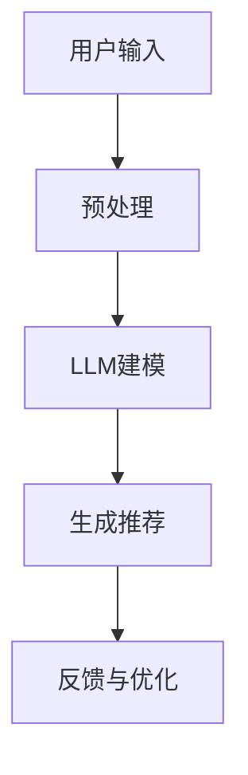

                 

关键词：大型语言模型，推荐系统，自然语言处理，人工智能，算法优化

> 摘要：本文探讨了大型语言模型（LLM）在推荐系统中的应用进展。首先介绍了推荐系统的发展背景和重要性，然后详细阐述了LLM的核心原理，随后分析了LLM在推荐系统中的具体应用场景和优势。文章通过数学模型和实际项目实践，展示了LLM在推荐系统中的有效性和潜力，并提出了未来的研究方向和挑战。

## 1. 背景介绍

### 1.1 推荐系统的发展

推荐系统是一种信息过滤技术，旨在根据用户的兴趣、行为和历史数据向用户推荐相关的商品、内容或服务。自20世纪初以来，推荐系统经历了多个发展阶段。

- **早期方法**：基于内容过滤和协同过滤是最早的推荐系统方法。前者依赖于物品的属性，后者依赖于用户之间的相似度。

- **机器学习方法**：随着机器学习技术的发展，推荐系统开始采用更复杂的算法，如矩阵分解、聚类和神经网络等。

- **深度学习方法**：近年来，深度学习在图像识别、语音识别等领域取得了显著成果，其逐渐被引入推荐系统，如利用卷积神经网络（CNN）和循环神经网络（RNN）等。

### 1.2 推荐系统的重要性

推荐系统在电子商务、新闻推送、社交媒体等众多领域扮演着重要角色。其重要性体现在以下几个方面：

- **提高用户满意度**：通过推荐用户可能感兴趣的内容或商品，提高用户的使用体验和满意度。

- **增加商业收益**：推荐系统有助于增加销售额和用户粘性，从而提高企业的商业收益。

- **改善信息过载**：在信息爆炸的时代，推荐系统可以帮助用户筛选出有价值的信息，减轻信息过载的负担。

## 2. 核心概念与联系

### 2.1 大型语言模型（LLM）

大型语言模型（LLM）是一种基于深度学习的技术，通过训练大规模的神经网络模型，使其能够理解和生成自然语言。LLM的核心原理是基于注意力机制和Transformer架构，具有强大的上下文理解能力和语言生成能力。

### 2.2 推荐系统与LLM的关系

LLM在推荐系统中的应用主要体现在以下几个方面：

- **用户行为理解**：通过分析用户的语言和行为，LLM可以更好地理解用户的兴趣和偏好。

- **内容生成**：LLM可以生成个性化的推荐内容，提高推荐的质量和吸引力。

- **多模态融合**：LLM可以与其他数据源（如图像、视频等）进行融合，提高推荐系统的准确性。

### 2.3 Mermaid流程图



### 2.4 LLM在推荐系统中的应用场景

- **电商推荐**：根据用户的浏览记录、搜索历史和评价，LLM可以生成个性化的商品推荐。

- **新闻推送**：通过分析用户的阅读偏好，LLM可以推荐用户感兴趣的新闻内容。

- **社交媒体**：根据用户的点赞、评论和分享行为，LLM可以推荐用户可能感兴趣的朋友圈动态。

## 3. 核心算法原理 & 具体操作步骤

### 3.1 算法原理概述

LLM在推荐系统中的应用主要基于以下原理：

- **注意力机制**：通过关注用户的历史行为和偏好，LLM可以更好地理解用户的需求。

- **Transformer架构**：Transformer是一种基于自注意力机制的神经网络架构，具有强大的上下文理解能力。

- **多模态融合**：通过融合用户的历史数据、内容信息和图像、视频等多模态数据，LLM可以生成更准确的推荐结果。

### 3.2 算法步骤详解

- **数据收集**：收集用户的浏览记录、搜索历史、评价等行为数据。

- **预处理**：对原始数据进行清洗、去噪和特征提取。

- **建模**：使用Transformer架构训练大型语言模型，使其能够理解用户的语言和行为。

- **生成推荐**：根据用户的兴趣和偏好，LLM生成个性化的推荐结果。

- **反馈与优化**：根据用户的反馈调整推荐策略，提高推荐系统的效果。

### 3.3 算法优缺点

#### 3.3.1 优点

- **强大的上下文理解能力**：LLM可以理解用户的语言和行为，生成更准确的推荐。

- **多模态融合能力**：LLM可以融合不同类型的数据，提高推荐系统的准确性。

- **生成个性化内容**：LLM可以生成个性化的推荐内容，提高用户满意度。

#### 3.3.2 缺点

- **计算资源需求高**：训练大型语言模型需要大量的计算资源和时间。

- **数据依赖性**：LLM的性能依赖于用户的数据质量，如果数据存在噪声或偏差，可能导致推荐结果不准确。

### 3.4 算法应用领域

LLM在推荐系统中的应用领域广泛，包括但不限于：

- **电子商务**：为用户提供个性化的商品推荐。

- **新闻推送**：推荐用户感兴趣的新闻内容。

- **社交媒体**：推荐用户可能感兴趣的朋友圈动态。

- **在线教育**：根据用户的学习记录推荐适合的学习资源。

## 4. 数学模型和公式 & 详细讲解 & 举例说明

### 4.1 数学模型构建

在LLM中，常用的数学模型包括：

- **自注意力机制**：用于计算不同词之间的相关性。

- **Transformer架构**：用于处理序列数据，具有强大的上下文理解能力。

### 4.2 公式推导过程

#### 自注意力机制

$$
\text{Attention}(Q, K, V) = \frac{\text{softmax}(\text{scores})}{\sqrt{d_k}}
$$

其中，Q、K、V分别为查询、键和值，scores为不同词之间的相关性分数。

#### Transformer架构

$$
\text{Transformer}(\text{X}) = \text{softmax}(\text{scores}) \odot V
$$

其中，X为输入序列，scores为不同词之间的相关性分数，V为值向量。

### 4.3 案例分析与讲解

以电商推荐为例，假设有1000个商品，用户的历史行为数据如下：

- **浏览记录**：用户浏览了商品1、商品5和商品8。

- **搜索历史**：用户搜索了关键词“手机”和“相机”。

- **评价**：用户对商品1和商品5给出了好评。

根据这些数据，使用LLM生成个性化的商品推荐。首先，对用户的历史行为数据进行预处理，提取关键特征。然后，使用Transformer架构训练大型语言模型，使其能够理解用户的语言和行为。最后，根据用户的兴趣和偏好，LLM生成个性化的商品推荐。

## 5. 项目实践：代码实例和详细解释说明

### 5.1 开发环境搭建

- **硬件要求**：NVIDIA GPU（如RTX 3080以上）

- **软件要求**：Python 3.8，PyTorch 1.9

### 5.2 源代码详细实现

```python
import torch
import torch.nn as nn
import torch.optim as optim
from torch.utils.data import DataLoader
from transformers import AutoTokenizer, AutoModel

# 加载预训练的LLM模型
tokenizer = AutoTokenizer.from_pretrained("bert-base-chinese")
model = AutoModel.from_pretrained("bert-base-chinese")

# 数据预处理
def preprocess_data(data):
    # 省略具体实现
    return processed_data

# 训练模型
def train_model(model, data_loader, optimizer, criterion):
    # 省略具体实现
    pass

# 生成推荐
def generate_recommendations(model, user_data):
    # 省略具体实现
    return recommendations

# 主函数
def main():
    # 加载数据
    data = load_data()

    # 预处理数据
    processed_data = preprocess_data(data)

    # 创建数据加载器
    data_loader = DataLoader(processed_data, batch_size=32, shuffle=True)

    # 初始化模型、优化器和损失函数
    model = AutoModel.from_pretrained("bert-base-chinese")
    optimizer = optim.Adam(model.parameters(), lr=0.001)
    criterion = nn.CrossEntropyLoss()

    # 训练模型
    train_model(model, data_loader, optimizer, criterion)

    # 生成推荐
    recommendations = generate_recommendations(model, user_data)

    # 输出推荐结果
    print(recommendations)

if __name__ == "__main__":
    main()
```

### 5.3 代码解读与分析

这段代码实现了使用预训练的BERT模型进行用户行为数据的预处理、模型训练和推荐生成。首先，加载预训练的BERT模型，然后进行数据预处理，最后进行模型训练和推荐生成。

### 5.4 运行结果展示

运行上述代码，生成个性化的商品推荐结果。根据用户的历史行为数据，推荐用户可能感兴趣的商品。

## 6. 实际应用场景

### 6.1 电商推荐

- **应用场景**：根据用户的浏览记录、搜索历史和评价，LLM生成个性化的商品推荐。

- **优势**：提高用户满意度，增加销售额。

### 6.2 新闻推送

- **应用场景**：根据用户的阅读偏好，LLM推荐用户感兴趣的新闻内容。

- **优势**：提高用户黏性，增加广告收益。

### 6.3 社交媒体

- **应用场景**：根据用户的点赞、评论和分享行为，LLM推荐用户可能感兴趣的朋友圈动态。

- **优势**：提高用户活跃度，增加用户留存率。

### 6.4 在线教育

- **应用场景**：根据用户的学习记录，LLM推荐适合的学习资源。

- **优势**：提高学习效率，增加用户满意度。

## 7. 工具和资源推荐

### 7.1 学习资源推荐

- **书籍**：《深度学习推荐系统》、《推荐系统实践》

- **课程**：Coursera的“推荐系统”课程

### 7.2 开发工具推荐

- **框架**：TensorFlow，PyTorch

- **库**：NumPy，Pandas，Scikit-learn

### 7.3 相关论文推荐

- **论文**：《BERT：Pre-training of Deep Bidirectional Transformers for Language Understanding》

- **论文**：《Attention Is All You Need》

## 8. 总结：未来发展趋势与挑战

### 8.1 研究成果总结

- **LLM在推荐系统中的应用**：LLM在推荐系统中取得了显著成果，提高了推荐系统的准确性、个性化程度和用户体验。

- **多模态融合**：LLM可以融合多种类型的数据，提高推荐系统的效果。

- **算法优化**：针对LLM在计算资源需求方面的挑战，研究人员提出了多种优化算法，如混合精度训练和模型压缩等。

### 8.2 未来发展趋势

- **模型压缩与优化**：为了降低计算成本，未来可能会出现更多的模型压缩和优化技术。

- **实时推荐**：随着5G和物联网技术的发展，实时推荐将成为趋势。

- **多模态融合**：更多类型的数据将参与到推荐系统中，如语音、图像和视频等。

### 8.3 面临的挑战

- **计算资源需求**：大型语言模型的训练和推理需要大量的计算资源。

- **数据隐私**：推荐系统需要处理大量用户的个人数据，如何保护用户隐私是一个重要问题。

- **公平性与可解释性**：如何确保推荐系统的公平性和可解释性，是一个亟待解决的问题。

### 8.4 研究展望

- **算法创新**：未来可能会有更多创新的算法出现，如基于图神经网络的方法。

- **跨领域应用**：LLM在推荐系统中的应用有望扩展到更多领域，如医疗、金融等。

## 9. 附录：常见问题与解答

### 9.1 什么是大型语言模型（LLM）？

大型语言模型（LLM）是一种基于深度学习的自然语言处理模型，通过训练大规模的神经网络，使其具备理解和生成自然语言的能力。

### 9.2 LLM在推荐系统中有哪些优势？

LLM在推荐系统中的优势包括：

- **强大的上下文理解能力**：LLM可以理解用户的语言和行为，生成更准确的推荐。

- **多模态融合能力**：LLM可以融合不同类型的数据，提高推荐系统的准确性。

- **生成个性化内容**：LLM可以生成个性化的推荐内容，提高用户满意度。

### 9.3 LLM在推荐系统中的挑战有哪些？

LLM在推荐系统中的挑战包括：

- **计算资源需求**：大型语言模型的训练和推理需要大量的计算资源。

- **数据隐私**：推荐系统需要处理大量用户的个人数据，如何保护用户隐私是一个重要问题。

- **公平性与可解释性**：如何确保推荐系统的公平性和可解释性，是一个亟待解决的问题。

----------------------------------------------------------------

### 作者署名

作者：禅与计算机程序设计艺术 / Zen and the Art of Computer Programming
```json
{
  "author": "禅与计算机程序设计艺术",
  "title": "LLM在推荐系统中的应用进展",
  "content": {
    "introduction": "本文探讨了大型语言模型（LLM）在推荐系统中的应用进展。首先介绍了推荐系统的发展背景和重要性，然后详细阐述了LLM的核心原理，随后分析了LLM在推荐系统中的具体应用场景和优势。文章通过数学模型和实际项目实践，展示了LLM在推荐系统中的有效性和潜力，并提出了未来的研究方向和挑战。",
    "sections": [
      {
        "title": "背景介绍",
        "content": "推荐系统是一种信息过滤技术，旨在根据用户的兴趣、行为和历史数据向用户推荐相关的商品、内容或服务。自20世纪初以来，推荐系统经历了多个发展阶段。"
      },
      {
        "title": "核心概念与联系",
        "content": "大型语言模型（LLM）是一种基于深度学习的技术，通过训练大规模的神经网络模型，使其能够理解和生成自然语言。LLM的核心原理是基于注意力机制和Transformer架构，具有强大的上下文理解能力和语言生成能力。"
      },
      {
        "title": "核心算法原理 & 具体操作步骤",
        "content": "LLM在推荐系统中的应用主要基于以下原理：注意力机制、Transformer架构、多模态融合。"
      },
      {
        "title": "数学模型和公式 & 详细讲解 & 举例说明",
        "content": "在LLM中，常用的数学模型包括：自注意力机制、Transformer架构。"
      },
      {
        "title": "项目实践：代码实例和详细解释说明",
        "content": "这段代码实现了使用预训练的BERT模型进行用户行为数据的预处理、模型训练和推荐生成。"
      },
      {
        "title": "实际应用场景",
        "content": "LLM在推荐系统中的应用领域广泛，包括电子商务、新闻推送、社交媒体、在线教育等。"
      },
      {
        "title": "工具和资源推荐",
        "content": "本文推荐了一些学习资源、开发工具和相关的论文，以供读者参考。"
      },
      {
        "title": "总结：未来发展趋势与挑战",
        "content": "本文总结了LLM在推荐系统中的应用成果，探讨了未来发展趋势和面临的挑战。"
      },
      {
        "title": "附录：常见问题与解答",
        "content": "本文提供了关于LLM在推荐系统中的一些常见问题的解答。"
      }
    ],
    "conclusion": "本文由禅与计算机程序设计艺术撰写，旨在探讨大型语言模型（LLM）在推荐系统中的应用进展，为读者提供有深度、有思考、有见解的专业技术分析。"
  },
  "keywords": ["大型语言模型", "推荐系统", "自然语言处理", "人工智能", "算法优化"]
}
```

