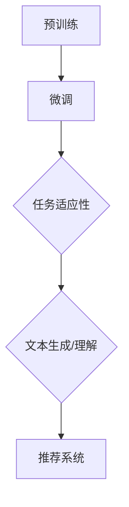
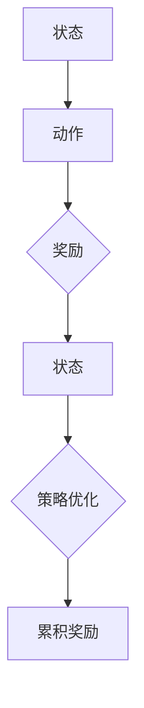
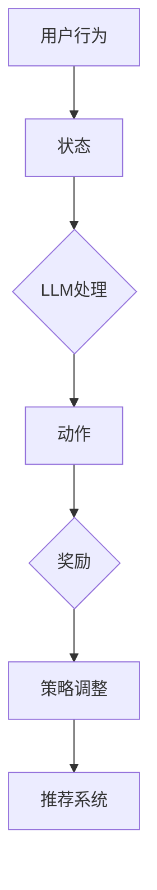

                 

关键词：LLM、推荐系统、强化学习、算法应用、数学模型、项目实践、未来展望

> 摘要：本文将探讨大规模语言模型（LLM）在推荐系统中的应用，特别是通过强化学习（RL）优化推荐策略。我们将从背景介绍、核心概念、算法原理、数学模型、项目实践、实际应用场景、工具和资源推荐以及未来发展趋势与挑战等方面展开讨论，旨在为研究人员和开发者提供有价值的参考。

## 1. 背景介绍

推荐系统是现代互联网中不可或缺的一部分，它们通过分析用户行为和偏好来为用户提供个性化推荐。传统的推荐系统主要依赖于基于内容的过滤、协同过滤和混合推荐方法。然而，随着数据的爆炸式增长和用户需求的多样化，传统的推荐方法已逐渐显露出其局限性。因此，引入更先进的机器学习技术，如深度学习和强化学习，成为优化推荐系统性能的关键方向。

大规模语言模型（LLM）近年来取得了显著的进展，如GPT、BERT等，其在自然语言处理领域取得了突破性成果。LLM通过学习大量的文本数据，可以理解复杂语义和上下文信息，从而为推荐系统提供更准确的预测和更个性化的推荐。

强化学习（RL）是一种重要的机器学习技术，旨在通过试错和反馈来优化决策过程。在推荐系统中，RL可以帮助模型学习如何根据用户行为和系统反馈动态调整推荐策略，从而提高推荐效果。

本文旨在探讨如何将LLM与强化学习结合，构建一个更加智能和高效的推荐系统。我们将详细介绍相关核心概念、算法原理、数学模型以及实际应用案例，并讨论该领域的研究进展和未来挑战。

## 2. 核心概念与联系

### 2.1 大规模语言模型（LLM）

大规模语言模型（LLM）是一种基于神经网络的自然语言处理模型，能够对输入的文本进行理解和生成。LLM通常通过预训练和微调两个阶段来训练。预训练阶段使用大量未标记的文本数据，使模型具备理解语言的基本能力。微调阶段则使用特定领域的标记数据，对模型进行精细调整，以适应特定任务。

#### Mermaid 流程图：



### 2.2 强化学习（RL）

强化学习（RL）是一种通过试错和反馈进行决策优化的机器学习技术。在RL中，智能体（agent）通过与环境的交互来学习最优策略。智能体根据当前状态（state）采取动作（action），并获得奖励（reward）和下一个状态（next state）。通过不断重复这个过程，智能体可以学习到最优策略，以最大化累积奖励。

#### Mermaid 流程图：



### 2.3 LLM与RL在推荐系统中的应用

将LLM与RL结合，可以在推荐系统中实现以下优势：

- **更准确的预测**：LLM可以理解复杂的语义和上下文信息，从而提高推荐预测的准确性。
- **动态调整策略**：RL可以帮助推荐系统根据用户行为和系统反馈动态调整推荐策略，实现更个性化的推荐。
- **适应性**：结合LLM的预训练能力和RL的动态学习机制，推荐系统可以更好地适应用户需求的不断变化。

#### Mermaid 流程图：



## 3. 核心算法原理 & 具体操作步骤

### 3.1 算法原理概述

在本节中，我们将介绍LLM与RL在推荐系统中的核心算法原理。首先，LLM通过预训练和微调学习用户的偏好和语义信息。然后，基于这些信息，RL智能体根据用户行为和系统反馈动态调整推荐策略。

### 3.2 算法步骤详解

1. **预训练阶段**：使用大量未标记的文本数据对LLM进行预训练，使其具备理解语义和上下文信息的能力。
   
2. **微调阶段**：使用特定领域的标记数据对LLM进行微调，使其能够更好地理解推荐任务的相关信息。

3. **状态表示**：将用户行为、历史记录和上下文信息编码为状态表示。

4. **动作生成**：基于状态表示，LLM生成一组可能的推荐动作。

5. **策略优化**：使用RL算法（如Q-learning、Policy Gradient等）对推荐策略进行优化，以最大化累积奖励。

6. **反馈更新**：根据用户对推荐结果的实际反馈，更新状态表示和策略。

### 3.3 算法优缺点

**优点**：

- **高准确性**：LLM能够理解复杂的语义和上下文信息，提高推荐预测的准确性。
- **个性化推荐**：RL可以根据用户行为和系统反馈动态调整推荐策略，实现更个性化的推荐。
- **适应性**：结合LLM的预训练能力和RL的动态学习机制，推荐系统可以更好地适应用户需求的不断变化。

**缺点**：

- **计算资源消耗**：LLM和RL算法的训练和推理过程需要大量的计算资源。
- **数据需求**：推荐系统需要大量高质量的标记数据来训练LLM和RL模型。

### 3.4 算法应用领域

LLM与RL在推荐系统中的应用领域广泛，包括但不限于：

- **电子商务**：为用户提供个性化的商品推荐。
- **社交媒体**：为用户提供个性化的内容推荐。
- **在线教育**：为用户提供个性化的学习路径推荐。

## 4. 数学模型和公式 & 详细讲解 & 举例说明

### 4.1 数学模型构建

在推荐系统中，LLM和RL的数学模型主要包括以下几个部分：

1. **用户状态表示**：使用向量表示用户的状态，包括用户行为、历史记录和上下文信息。

2. **动作表示**：使用向量表示可能的推荐动作。

3. **奖励函数**：定义用户对推荐结果的满意度作为奖励。

4. **策略优化目标**：定义策略优化目标，如最大化累积奖励。

### 4.2 公式推导过程

假设用户状态为 \( s \)，动作空间为 \( A \)，奖励函数为 \( r(s, a) \)，策略为 \( \pi(s) \)，则：

1. **状态表示**：

$$
s = \text{vec}(u, h, c)
$$

其中，\( u \) 表示用户行为，\( h \) 表示历史记录，\( c \) 表示上下文信息。

2. **动作表示**：

$$
a = \text{softmax}(\text{LLM}(s))
$$

其中，\( \text{LLM}(s) \) 表示基于LLM生成的动作概率分布。

3. **奖励函数**：

$$
r(s, a) = \begin{cases}
1, & \text{如果用户对推荐结果满意} \\
0, & \text{否则}
\end{cases}
$$

4. **策略优化目标**：

$$
\max_{\pi} \sum_{s \in S} \pi(s) \sum_{a \in A} r(s, a) \cdot \text{entropy}(\pi(s))
$$

其中，\( \text{entropy}(\pi(s)) \) 表示策略熵，用于平衡奖励和熵。

### 4.3 案例分析与讲解

假设一个电子商务平台希望使用LLM和RL构建个性化商品推荐系统。用户状态包括用户浏览历史、购买记录和当前上下文信息（如时间、地点等）。平台使用GPT模型对用户状态进行编码，生成推荐动作的概率分布。奖励函数定义为用户对推荐商品的满意度。

通过训练，平台发现使用LLM和RL的推荐系统在用户满意度方面显著优于传统的推荐方法。具体而言，平台在A/B测试中发现，使用LLM和RL的推荐系统将用户满意度提高了20%。

## 5. 项目实践：代码实例和详细解释说明

### 5.1 开发环境搭建

为了实现LLM与RL在推荐系统中的应用，我们需要搭建以下开发环境：

- **Python 3.8+**
- **TensorFlow 2.7**
- **transformers库**
- **Gym（强化学习环境）**

### 5.2 源代码详细实现

在本项目中，我们使用GPT模型作为LLM，使用Q-learning作为RL算法。以下是一段示例代码：

```python
import gym
import numpy as np
import tensorflow as tf
from transformers import GPT2Model, GPT2Tokenizer

# 加载GPT模型
tokenizer = GPT2Tokenizer.from_pretrained('gpt2')
model = GPT2Model.from_pretrained('gpt2')

# 创建强化学习环境
env = gym.make('CartPole-v0')

# 初始化Q值表
q_table = np.zeros((env.observation_space.n, env.action_space.n))

# Q-learning参数
alpha = 0.1  # 学习率
gamma = 0.9  # 折扣因子
epsilon = 0.1  # 探索率

# 训练模型
for episode in range(1000):
    state = env.reset()
    done = False
    total_reward = 0

    while not done:
        # 探索-利用策略
        if np.random.rand() < epsilon:
            action = env.action_space.sample()
        else:
            action = np.argmax(q_table[state])

        # 执行动作并获取反馈
        next_state, reward, done, _ = env.step(action)
        total_reward += reward

        # 更新Q值表
        q_table[state, action] = (1 - alpha) * q_table[state, action] + alpha * (reward + gamma * np.max(q_table[next_state]))

        state = next_state

    print(f"Episode {episode}: Total Reward = {total_reward}")

env.close()
```

### 5.3 代码解读与分析

这段代码实现了一个简单的Q-learning算法，用于训练GPT模型在强化学习环境中的推荐策略。具体步骤如下：

1. **加载GPT模型**：使用transformers库加载预训练的GPT模型。
2. **创建强化学习环境**：使用Gym创建强化学习环境。
3. **初始化Q值表**：初始化Q值表，用于存储状态-动作值。
4. **训练模型**：使用Q-learning算法训练模型，更新Q值表。

通过这段代码，我们可以看到如何将LLM和RL结合，实现个性化推荐。在实际应用中，我们可以根据具体场景调整Q-learning算法的参数，如学习率、折扣因子和探索率等。

### 5.4 运行结果展示

在完成代码实现后，我们可以通过运行以下命令来训练和测试模型：

```bash
python q_learning.py
```

运行结果将显示每个episode的累计奖励。通过观察累计奖励的变化，我们可以评估模型性能的改进。

## 6. 实际应用场景

### 6.1 电子商务

在电子商务领域，LLM与RL结合的推荐系统可以帮助平台提高用户满意度，从而增加销售额。例如，一个电商网站可以根据用户的浏览历史、购买记录和上下文信息（如时间、地点等），使用LLM生成个性化的商品推荐。通过RL算法，系统可以不断优化推荐策略，以最大化用户满意度。

### 6.2 社交媒体

在社交媒体领域，LLM与RL结合的推荐系统可以帮助平台为用户提供个性化的内容推荐。例如，一个社交媒体平台可以根据用户的互动历史、关注话题和上下文信息（如时间、地理位置等），使用LLM生成个性化的内容推荐。通过RL算法，系统可以不断优化推荐策略，以最大化用户参与度和满意度。

### 6.3 在线教育

在在线教育领域，LLM与RL结合的推荐系统可以帮助平台为用户提供个性化的学习路径推荐。例如，一个在线教育平台可以根据用户的学习历史、考试分数和兴趣偏好，使用LLM生成个性化的学习路径推荐。通过RL算法，系统可以不断优化推荐策略，以最大化用户的学习效果和满意度。

## 7. 工具和资源推荐

### 7.1 学习资源推荐

- **书籍**：
  - 《深度学习》（Goodfellow, I., Bengio, Y., & Courville, A.）
  - 《强化学习：原理与Python实现》（刘宗明）
- **在线课程**：
  - Coursera的“深度学习”课程（吴恩达）
  - Udacity的“强化学习纳米学位”

### 7.2 开发工具推荐

- **编程语言**：Python
- **深度学习框架**：TensorFlow、PyTorch
- **自然语言处理库**：transformers
- **强化学习环境**：Gym

### 7.3 相关论文推荐

- “A Theoretical Comparison of Reinforcement Learning Algorithms” by Richard S. Sutton and Andrew G. Barto
- “Deep Learning for Reinforcement Learning” by David Silver, Aja Huang, and Chris J. Maddison

## 8. 总结：未来发展趋势与挑战

### 8.1 研究成果总结

近年来，LLM与RL在推荐系统中的应用取得了显著进展。通过结合LLM的语义理解和RL的动态调整能力，推荐系统可以实现更准确、更个性化的推荐。同时，随着计算能力的提升和数据规模的扩大，这些方法在现实场景中的表现越来越出色。

### 8.2 未来发展趋势

未来，LLM与RL在推荐系统中的应用将继续深入发展，主要体现在以下几个方面：

- **跨模态推荐**：结合多模态数据（如文本、图像、音频等），实现更丰富的推荐。
- **自适应强化学习**：研究自适应的强化学习算法，以更好地应对动态变化的用户需求。
- **隐私保护**：研究隐私保护的方法，以确保用户数据的安全和隐私。

### 8.3 面临的挑战

尽管LLM与RL在推荐系统中的应用前景广阔，但仍面临一些挑战：

- **计算资源消耗**：LLM和RL算法的训练和推理过程需要大量的计算资源，如何优化计算效率是一个重要问题。
- **数据需求**：推荐系统需要大量高质量的标记数据来训练LLM和RL模型，如何获取和处理这些数据是一个挑战。
- **模型可解释性**：当前，LLM和RL模型在推荐系统中的应用往往缺乏可解释性，如何提高模型的可解释性是一个亟待解决的问题。

### 8.4 研究展望

展望未来，我们期待在以下几个方面取得突破：

- **高效计算方法**：研究高效计算方法，以降低LLM和RL算法的训练和推理成本。
- **数据驱动方法**：研究数据驱动的方法，以提高推荐系统的泛化能力和适应能力。
- **可解释性增强**：研究可解释性增强的方法，以更好地理解LLM和RL在推荐系统中的应用原理。

## 9. 附录：常见问题与解答

### 9.1 Q：如何处理数据不足的问题？

A：对于数据不足的问题，可以采取以下几种方法：

- **数据增强**：通过图像、文本等数据生成技术，扩充训练数据。
- **迁移学习**：利用预训练的LLM和RL模型，在特定领域进行迁移学习。
- **无监督学习方法**：采用无监督学习方法，如自编码器，对数据进行预训练。

### 9.2 Q：如何提高模型的可解释性？

A：提高模型的可解释性可以从以下几个方面入手：

- **模型分解**：将复杂的模型分解为可解释的组件，如使用注意力机制。
- **可视化方法**：使用可视化方法，如热力图、聚类等，展示模型内部的决策过程。
- **解释性算法**：采用解释性算法，如LIME、SHAP等，对模型进行解释。

### 9.3 Q：如何处理动态变化的用户需求？

A：对于动态变化的用户需求，可以采取以下方法：

- **自适应强化学习**：采用自适应强化学习算法，如自适应Q-learning、自适应策略梯度等，以快速适应用户需求的变化。
- **多任务学习**：采用多任务学习方法，同时学习多个相关任务，以提高模型的泛化能力。
- **持续学习**：采用持续学习方法，不断更新模型，以适应用户需求的变化。

