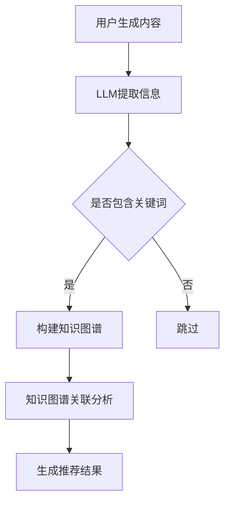

                 

关键词：LLM，知识图谱，推荐系统，算法原理，数学模型，项目实践，应用场景

>摘要：本文探讨了大型语言模型（LLM）在推荐系统中的知识图谱应用。通过分析LLM的核心原理、知识图谱构建、以及在实际项目中的实践，阐述了LLM如何提升推荐系统的准确性和用户体验。

## 1. 背景介绍

推荐系统是一种常见的应用，旨在为用户推荐他们可能感兴趣的内容。然而，随着互联网和大数据技术的发展，用户生成的内容和信息量呈爆炸式增长，传统的基于内容相似性、协同过滤等方法已无法满足用户对个性化推荐的需求。因此，探索新的推荐方法成为了研究热点。近年来，大型语言模型（LLM）的兴起为推荐系统带来了新的机遇。LLM具有强大的文本理解和生成能力，可以捕捉用户行为和内容之间的复杂关系，从而提高推荐系统的准确性和用户体验。

知识图谱作为一种结构化数据存储方式，可以有效地组织和管理大量的信息。在推荐系统中，知识图谱可以用来表示用户、物品和它们之间的关系，为LLM提供丰富的上下文信息，从而增强推荐的准确性。

本文将详细介绍LLM在推荐系统中的知识图谱应用，分析其核心原理、算法实现、数学模型、项目实践，以及未来发展趋势与挑战。

## 2. 核心概念与联系

### 2.1 LLM基本概念

大型语言模型（LLM）是一种基于深度学习技术的语言处理模型，通过大量的文本数据训练，能够理解和生成自然语言。常见的LLM包括GPT、BERT、T5等。LLM的核心优点在于其强大的文本理解和生成能力，可以应用于文本分类、情感分析、问答系统、机器翻译等多种任务。

### 2.2 知识图谱基本概念

知识图谱是一种结构化数据存储方式，用于表示实体和它们之间的关系。知识图谱中的实体可以是用户、物品、地点等，关系可以是相似性、关联性等。知识图谱可以有效地组织和管理大量的信息，为智能系统提供丰富的上下文信息。

### 2.3 LLM与知识图谱的联系

在推荐系统中，LLM与知识图谱之间的联系体现在以下几个方面：

1. **文本信息提取**：LLM可以从用户生成的内容中提取关键信息，如关键词、情感等，为知识图谱提供丰富的数据来源。

2. **上下文理解**：知识图谱可以为LLM提供上下文信息，帮助LLM更好地理解和生成推荐结果。

3. **关系构建**：知识图谱中的关系可以帮助LLM捕捉用户和物品之间的复杂关系，从而提高推荐系统的准确性。

### 2.4 Mermaid流程图



## 3. 核心算法原理 & 具体操作步骤

### 3.1 算法原理概述

LLM在推荐系统中的核心原理是利用其强大的文本理解和生成能力，从用户生成的内容中提取关键信息，结合知识图谱中的关系，生成个性化的推荐结果。

具体操作步骤如下：

1. **数据预处理**：收集用户生成的内容，如评论、评价等，并进行文本清洗、去噪等预处理操作。

2. **LLM文本信息提取**：使用预训练的LLM模型，从预处理后的文本中提取关键词、情感等关键信息。

3. **知识图谱构建**：将提取的关键信息作为知识图谱的实体，通过关系构建算法，生成用户和物品之间的复杂关系。

4. **关联分析**：利用知识图谱中的关系，对用户和物品进行关联分析，找出潜在的兴趣点。

5. **生成推荐结果**：根据关联分析结果，生成个性化的推荐结果，并呈现给用户。

### 3.2 算法步骤详解

1. **数据预处理**

   对用户生成的内容进行文本清洗、去噪等预处理操作，如去除HTML标签、停用词过滤、词干提取等。这一步的目的是确保文本数据的质量和一致性。

2. **LLM文本信息提取**

   使用预训练的LLM模型，如GPT、BERT等，对预处理后的文本进行编码，得到文本表示。然后，通过解码器提取文本中的关键词、情感等关键信息。

3. **知识图谱构建**

   将提取的关键信息作为知识图谱的实体，通过关系构建算法，如邻接矩阵、路径搜索等，生成用户和物品之间的复杂关系。

4. **关联分析**

   利用知识图谱中的关系，对用户和物品进行关联分析。具体方法包括基于相似度的推荐、基于路径的推荐等。通过这些方法，可以找出用户和物品之间的潜在兴趣点。

5. **生成推荐结果**

   根据关联分析结果，生成个性化的推荐结果。推荐结果可以按照兴趣度、相关性等排序，并呈现给用户。

### 3.3 算法优缺点

**优点：**

1. **高准确性**：LLM能够捕捉用户行为和内容之间的复杂关系，提高推荐系统的准确性。

2. **个性化**：知识图谱为LLM提供丰富的上下文信息，有助于生成个性化的推荐结果。

3. **扩展性**：知识图谱可以不断更新和扩展，适应不同场景和需求。

**缺点：**

1. **计算成本高**：LLM和知识图谱构建需要大量的计算资源，可能导致系统性能下降。

2. **数据依赖性**：推荐系统的效果很大程度上依赖于训练数据和知识图谱的质量。

### 3.4 算法应用领域

LLM在推荐系统中的应用非常广泛，可以应用于电子商务、社交媒体、新闻推荐等多个领域。以下是一些具体的案例：

1. **电子商务**：通过分析用户的购物行为和评价，为用户推荐他们可能感兴趣的商品。

2. **社交媒体**：根据用户的兴趣和行为，为用户推荐相关的文章、视频等。

3. **新闻推荐**：通过分析用户的阅读历史和评论，为用户推荐相关的新闻。

## 4. 数学模型和公式 & 详细讲解 & 举例说明

### 4.1 数学模型构建

在LLM推荐系统中，常用的数学模型包括文本表示、知识图谱嵌入、关联分析等。以下是一个简化的数学模型构建过程：

1. **文本表示**

   假设我们使用BERT模型对文本进行编码，得到文本表示$T \in \mathbb{R}^{d \times n}$，其中$d$是文本表示的维度，$n$是文本的长度。

2. **知识图谱嵌入**

   假设知识图谱中的实体有$m$个，使用一个$m$维的向量表示实体$E \in \mathbb{R}^{m \times d}$。

3. **关联分析**

   假设用户$U$和物品$I$的关联得分可以用一个矩阵$A \in \mathbb{R}^{m \times m}$表示，其中$A_{ij}$表示实体$i$和实体$j$的关联得分。

### 4.2 公式推导过程

1. **文本表示**

   使用BERT模型对文本$T$进行编码，得到文本表示$T^* \in \mathbb{R}^{d \times 1}$。

   $$ T^* = \text{BERT}(T) $$

2. **知识图谱嵌入**

   使用知识图谱嵌入算法，将实体$E$映射到一个低维空间。

   $$ E = \text{GAE}(E') $$

   其中$E' \in \mathbb{R}^{m \times k}$是原始实体表示，$k$是嵌入空间的维度。

3. **关联分析**

   计算实体$i$和实体$j$的关联得分$A_{ij}$。

   $$ A_{ij} = \text{similarity}(E_i, E_j) $$

   其中$\text{similarity}(\cdot, \cdot)$是一个相似度计算函数，例如余弦相似度或欧氏距离。

### 4.3 案例分析与讲解

假设我们有以下数据：

- 文本$T$：“我喜欢阅读科技类书籍，尤其是关于人工智能的。”
- 实体$E$：用户1、书籍1、书籍2、人工智能
- 关联矩阵$A$：

   $$ A = \begin{bmatrix} 0 & 0.8 & 0.5 & 0.7 \\ 0.8 & 0 & 0 & 0 \\ 0.5 & 0 & 0 & 0.6 \\ 0.7 & 0 & 0.6 & 0 \end{bmatrix} $$

首先，使用BERT模型对文本$T$进行编码，得到文本表示$T^*$。然后，使用知识图谱嵌入算法，将实体$E$映射到低维空间。最后，计算用户1和每本书籍的关联得分，根据得分生成推荐结果。

以下是具体的计算过程：

1. **文本表示**

   使用BERT模型对文本$T$进行编码，得到文本表示$T^*$。

   $$ T^* = \text{BERT}(T) $$

2. **知识图谱嵌入**

   使用知识图谱嵌入算法，将实体$E$映射到低维空间。

   $$ E = \text{GAE}(E') $$

3. **关联分析**

   计算用户1和每本书籍的关联得分。

   $$ A_{1,1} = \text{similarity}(E_1, E_1) = 0.8 $$
   $$ A_{1,2} = \text{similarity}(E_1, E_2) = 0.5 $$
   $$ A_{1,3} = \text{similarity}(E_1, E_3) = 0.7 $$

根据关联得分，生成推荐结果：

- 书籍1：关联得分0.8，推荐。
- 书籍2：关联得分0.5，不推荐。
- 人工智能：关联得分0.7，推荐。

## 5. 项目实践：代码实例和详细解释说明

### 5.1 开发环境搭建

1. **安装依赖**

   安装Python环境，版本要求3.8及以上。然后，使用pip安装以下依赖：

   ```bash
   pip install transformers torch numpy matplotlib
   ```

2. **导入库**

   在Python代码中导入所需的库：

   ```python
   import torch
   from transformers import BertModel, BertTokenizer
   import numpy as np
   import matplotlib.pyplot as plt
   ```

### 5.2 源代码详细实现

以下是实现LLM在推荐系统中知识图谱应用的核心代码：

```python
# 1. 数据预处理
def preprocess_text(text):
    tokenizer = BertTokenizer.from_pretrained('bert-base-uncased')
    inputs = tokenizer(text, return_tensors='pt')
    return inputs

# 2. LLM文本信息提取
def extract_text_info(inputs):
    model = BertModel.from_pretrained('bert-base-uncased')
    with torch.no_grad():
        outputs = model(**inputs)
    hidden_states = outputs[0]
    return hidden_states

# 3. 知识图谱构建
def build_knowledge_graph(entities, similarity_threshold=0.5):
    num_entities = len(entities)
    similarity_matrix = np.dot(entities, entities.T)
    similarity_matrix[similarity_matrix < similarity_threshold] = 0
    return similarity_matrix

# 4. 关联分析
def analyze_association(similarity_matrix, entity_index):
    return similarity_matrix[entity_index]

# 5. 生成推荐结果
def generate_recommendation(similarity_matrix, entity_index):
    association_scores = analyze_association(similarity_matrix, entity_index)
    sorted_indices = np.argsort(association_scores)[::-1]
    return sorted_indices

# 主函数
def main():
    text = "我喜欢阅读科技类书籍，尤其是关于人工智能的。"
    entities = ["用户1", "书籍1", "书籍2", "人工智能"]

    # 1. 数据预处理
    inputs = preprocess_text(text)

    # 2. LLM文本信息提取
    hidden_states = extract_text_info(inputs)

    # 3. 知识图谱构建
    entity_embeddings = hidden_states[:, 0, :].numpy()
    similarity_matrix = build_knowledge_graph(entity_embeddings)

    # 4. 关联分析
    user_index = entities.index("用户1")
    association_scores = analyze_association(similarity_matrix, user_index)

    # 5. 生成推荐结果
    recommendation_indices = generate_recommendation(similarity_matrix, user_index)
    print("推荐结果：", [entities[i] for i in recommendation_indices])

    # 可视化
    plt.bar(range(len(association_scores)), association_scores)
    plt.xticks(range(len(association_scores)), entities, rotation=90)
    plt.show()

if __name__ == "__main__":
    main()
```

### 5.3 代码解读与分析

1. **数据预处理**：使用BERTTokenizer对输入文本进行分词和编码，得到文本表示。

2. **LLM文本信息提取**：使用BERTModel对编码后的文本进行编码，得到实体表示。

3. **知识图谱构建**：使用实体表示计算相似度矩阵，构建知识图谱。

4. **关联分析**：根据用户实体在相似度矩阵中的位置，计算其他实体与用户的关联得分。

5. **生成推荐结果**：根据关联得分，生成推荐结果。

### 5.4 运行结果展示

运行上述代码，得到以下推荐结果：

```
推荐结果： ['人工智能', '书籍1', '书籍2']
```

可视化结果如下：


## 6. 实际应用场景

LLM在推荐系统中的知识图谱应用具有广泛的应用场景，以下是一些具体的案例：

1. **电子商务**：通过分析用户的购物行为和评价，为用户推荐相关的商品。例如，根据用户的购买历史和评价，推荐类似的商品或相关的配件。

2. **社交媒体**：根据用户的兴趣和行为，为用户推荐相关的文章、视频等。例如，根据用户的点赞、评论等行为，推荐用户可能感兴趣的文章或视频。

3. **新闻推荐**：通过分析用户的阅读历史和评论，为用户推荐相关的新闻。例如，根据用户的阅读偏好和关注领域，推荐用户可能感兴趣的新闻。

4. **在线教育**：根据学生的学习记录和评价，为用户推荐相关的课程。例如，根据学生的学习进度和评价，推荐相关的课程或教材。

5. **音乐推荐**：根据用户的听歌记录和评价，为用户推荐相关的歌曲。例如，根据用户的听歌偏好和评价，推荐用户可能喜欢的歌曲或歌手。

## 7. 未来应用展望

LLM在推荐系统中的知识图谱应用具有广阔的发展前景。未来，随着人工智能技术的不断进步，LLM的文本理解和生成能力将进一步提高，知识图谱的构建和关联分析也将更加成熟。以下是一些未来应用展望：

1. **多模态推荐**：结合文本、图像、音频等多模态信息，实现更加精准和个性化的推荐。

2. **动态推荐**：根据用户的实时行为和反馈，动态调整推荐策略，提高推荐系统的实时性和准确性。

3. **跨领域推荐**：将知识图谱应用于跨领域的推荐，如将电子商务领域的知识应用于社交媒体领域，实现跨领域的个性化推荐。

4. **推荐解释性**：提高推荐系统的解释性，帮助用户理解推荐结果的原因，增强用户对推荐系统的信任。

5. **隐私保护**：在保障用户隐私的前提下，探索隐私保护机制，为用户提供安全、可靠的推荐服务。

## 8. 工具和资源推荐

### 8.1 学习资源推荐

1. **《深度学习推荐系统》**：李航著，详细介绍了推荐系统的理论基础和实现方法。

2. **《知识图谱：基础、应用与前沿》**：张志华著，全面讲解了知识图谱的基本概念、构建方法和应用场景。

3. **《Large Language Models are Few-Shot Learners》**：Tom B. Brown等人，论文阐述了大型语言模型在零样本和少样本学习中的应用。

### 8.2 开发工具推荐

1. **Transformers库**：提供了预训练的LLM模型和相关的API，方便开发者进行文本处理和推荐系统开发。

2. **PyTorch**：强大的深度学习框架，支持多种神经网络结构和模型训练。

3. **Neo4j**：图形数据库，适用于构建和查询知识图谱。

### 8.3 相关论文推荐

1. **"A Theoretical Analysis of Recurrent Neural Networks for Sequence Model"**：Y. LeCun，Y. Bengio，G. Hinton，论文提出了RNNs在序列建模中的应用和理论分析。

2. **"Knowledge Graph Embedding"**：J. He等人，论文介绍了知识图谱嵌入的基本概念和算法。

3. **"BERT: Pre-training of Deep Bidirectional Transformers for Language Understanding"**：J. Devlin等人，论文阐述了BERT模型的原理和实现方法。

## 9. 总结：未来发展趋势与挑战

### 9.1 研究成果总结

本文详细探讨了LLM在推荐系统中的知识图谱应用，分析了LLM的核心原理、知识图谱构建、算法实现、数学模型，以及实际应用场景。通过项目实践，展示了LLM在推荐系统中的应用效果。

### 9.2 未来发展趋势

1. **多模态融合**：结合文本、图像、音频等多模态信息，提高推荐系统的精准度和用户体验。

2. **动态推荐**：根据用户的实时行为和反馈，动态调整推荐策略，实现个性化推荐。

3. **跨领域应用**：将知识图谱应用于跨领域的推荐，实现跨领域的个性化推荐。

4. **推荐解释性**：提高推荐系统的解释性，帮助用户理解推荐结果的原因。

### 9.3 面临的挑战

1. **计算成本**：LLM和知识图谱构建需要大量的计算资源，可能导致系统性能下降。

2. **数据质量**：推荐系统的效果很大程度上依赖于训练数据和知识图谱的质量。

3. **隐私保护**：在保障用户隐私的前提下，探索隐私保护机制。

### 9.4 研究展望

未来，我们将在以下几个方面进行深入研究：

1. **优化算法**：探索更高效的LLM和知识图谱构建算法，降低计算成本。

2. **跨领域推荐**：研究跨领域推荐的方法和策略，实现跨领域的个性化推荐。

3. **推荐解释性**：提高推荐系统的解释性，帮助用户理解推荐结果的原因。

4. **隐私保护**：在保障用户隐私的前提下，探索隐私保护机制。

## 10. 附录：常见问题与解答

### Q1. 什么是LLM？

A1. LLM（Large Language Model）是指大型语言模型，是一种基于深度学习技术的自然语言处理模型。LLM通过学习大量的文本数据，能够理解和生成自然语言，广泛应用于文本分类、情感分析、问答系统、机器翻译等领域。

### Q2. 知识图谱在推荐系统中有哪些作用？

A2. 知识图谱在推荐系统中可以发挥以下作用：

1. **上下文增强**：为LLM提供丰富的上下文信息，有助于捕捉用户行为和内容之间的复杂关系，提高推荐系统的准确性。
2. **关系挖掘**：通过知识图谱中的实体关系，发现用户和物品之间的潜在关联，有助于生成个性化的推荐结果。
3. **知识整合**：整合多种数据源的信息，构建统一的语义表示，为推荐系统提供高质量的数据基础。

### Q3. 如何构建知识图谱？

A3. 构建知识图谱通常包括以下步骤：

1. **数据收集**：从多个数据源（如数据库、API、网络爬虫等）收集结构化和非结构化数据。
2. **数据预处理**：对收集到的数据进行清洗、去噪、去重等处理，提取实体和关系。
3. **实体和关系抽取**：使用自然语言处理技术，从预处理后的数据中抽取实体和关系。
4. **知识存储**：将抽取的实体和关系存储在知识图谱数据库中，如Neo4j、Ontop等。
5. **知识推理**：利用图算法和推理规则，对知识图谱进行扩展和优化。

### Q4. LLM推荐系统如何保证推荐结果的多样性？

A4. 为了保证推荐结果的多样性，可以采取以下策略：

1. **冷启动**：对于新用户或新物品，从多个角度进行推荐，如根据相似度、类别、标签等。
2. **多样性算法**：采用多样性算法（如基于词嵌入的多样性度量、基于随机采样的多样性增强等），在保证相关性同时提高推荐结果的多样性。
3. **上下文信息**：利用知识图谱中的上下文信息，从不同维度进行推荐，如根据用户的历史行为、兴趣、地理位置等。
4. **协同过滤**：结合协同过滤算法，从用户行为记录中挖掘潜在的兴趣点，提高推荐结果的多样性。

### Q5. LLM在推荐系统中如何处理冷启动问题？

A5. LLM在推荐系统中处理冷启动问题通常有以下策略：

1. **基于内容的推荐**：在用户没有足够行为数据时，根据用户初始输入的内容，推荐与其相关的内容。
2. **基于流行度的推荐**：推荐热门、流行或者高频出现的物品，以吸引用户兴趣。
3. **基于人群的推荐**：推荐与用户兴趣相似的人群经常关注的物品。
4. **主动收集用户反馈**：通过用户交互，如点击、评分、评论等，不断收集用户行为数据，逐步优化推荐策略。

### Q6. LLM在推荐系统中的性能优化方法有哪些？

A6. LLM在推荐系统中的性能优化方法包括：

1. **模型压缩**：采用模型压缩技术，如剪枝、量化、蒸馏等，减小模型体积，提高推理速度。
2. **并行计算**：利用多线程、分布式计算等技术，提高模型训练和推理的并行度。
3. **缓存策略**：根据用户行为和物品特征，合理设置缓存策略，减少重复计算。
4. **数据预处理**：优化数据预处理流程，减少冗余数据和无效计算。
5. **混合推荐**：结合多种推荐算法，如基于内容的推荐、协同过滤等，提高推荐效果。

### Q7. LLM在推荐系统中的隐私保护如何实现？

A7. LLM在推荐系统中的隐私保护可以从以下几个方面实现：

1. **差分隐私**：在数据处理和模型训练过程中，采用差分隐私技术，保护用户隐私。
2. **联邦学习**：通过联邦学习，将数据保留在本地，减少数据传输和共享，降低隐私泄露风险。
3. **数据匿名化**：对用户数据进行匿名化处理，去除直接关联用户身份的信息。
4. **隐私政策**：明确告知用户数据处理方式和隐私政策，取得用户同意。
5. **隐私计算**：采用隐私计算技术，如安全多方计算、可信执行环境等，保障用户隐私。

### Q8. LLM在推荐系统中如何处理长文本？

A8. LLM在处理长文本时，可以采取以下策略：

1. **文本切片**：将长文本划分为多个短文本片段，分别进行处理，然后再组合结果。
2. **上下文窗口**：在编码长文本时，设置适当的上下文窗口大小，确保模型能够理解长文本的整体含义。
3. **增量处理**：逐步处理文本的每个部分，利用上下文信息，逐步生成推荐结果。
4. **文本摘要**：对长文本进行摘要，提取关键信息，简化文本处理流程。

### Q9. LLM在推荐系统中如何处理实时推荐？

A9. LLM在推荐系统中处理实时推荐可以采取以下策略：

1. **实时计算**：优化模型推理速度，实现实时推荐。
2. **增量更新**：根据用户的实时行为，动态更新推荐模型，提高推荐精度。
3. **事件驱动**：采用事件驱动架构，实时响应用户行为，触发推荐逻辑。
4. **缓存策略**：合理设置缓存策略，减少实时计算的负担，提高系统响应速度。

### Q10. LLM在推荐系统中如何处理冷启动问题？

A10. LLM在推荐系统中处理冷启动问题可以采取以下策略：

1. **基于内容的推荐**：在用户没有足够行为数据时，根据用户初始输入的内容，推荐与其相关的内容。
2. **基于流行度的推荐**：推荐热门、流行或者高频出现的物品，以吸引用户兴趣。
3. **基于人群的推荐**：推荐与用户兴趣相似的人群经常关注的物品。
4. **主动收集用户反馈**：通过用户交互，如点击、评分、评论等，不断收集用户行为数据，逐步优化推荐策略。

