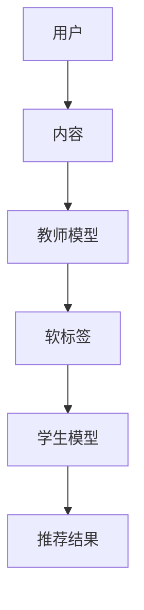

                 

关键词：推荐系统、知识蒸馏、大型语言模型（LLM）、知识转移、模型压缩、性能优化

>摘要：本文旨在探讨大型语言模型（LLM）在推荐系统中的应用，重点介绍了知识蒸馏技术在该领域的应用，通过实例分析和具体操作步骤，展示了如何将LLM的知识高效地迁移到推荐系统中，以提升推荐效果和降低模型复杂度。

## 1. 背景介绍

推荐系统是一种广泛应用于电子商务、社交媒体、新闻资讯等领域的算法系统，旨在为用户提供个性化的内容推荐，从而提高用户满意度和系统收益。随着互联网和人工智能技术的快速发展，推荐系统已经成为了计算机领域的重要研究方向。

近年来，大型语言模型（LLM）如BERT、GPT等在自然语言处理（NLP）领域取得了显著成果。这些模型具有强大的语义理解能力，可以捕捉文本中的深层关系和知识。然而，LLM通常具有庞大的模型规模和高计算资源需求，这对推荐系统的应用带来了一定的挑战。

知识蒸馏技术是一种将大型模型（教师模型）的知识转移到小型模型（学生模型）的技术，旨在降低模型复杂度并提高模型性能。在推荐系统中引入知识蒸馏技术，可以利用LLM的强大语义理解能力，同时降低模型计算和存储成本，提高推荐系统的实时性和可扩展性。

## 2. 核心概念与联系

### 2.1 推荐系统基本原理

推荐系统通常包括三个主要组件：用户、内容和算法。用户是指系统中的个体用户，内容是指用户可能感兴趣的信息或商品，算法是指用于生成推荐结果的方法。

推荐系统主要基于以下几个核心概念：

1. **协同过滤**：通过分析用户的历史行为数据，发现用户之间的相似性，从而预测用户对未知内容的兴趣。
2. **基于内容的推荐**：根据内容特征相似性进行推荐，主要依赖于物品的属性和特征。
3. **混合推荐**：结合协同过滤和基于内容的推荐方法，以提高推荐精度。

### 2.2 大型语言模型（LLM）原理

大型语言模型（LLM）如BERT、GPT等，通过预训练和微调，可以学习到大量的文本知识和语言规律。这些模型通常具有以下几个特点：

1. **预训练**：在大规模的文本数据集上预训练，以学习通用的语言表示。
2. **上下文理解**：可以理解文本中的上下文信息，捕捉语义关系。
3. **并行计算**：通过并行计算技术，可以提高模型的计算效率。

### 2.3 知识蒸馏原理

知识蒸馏是一种模型压缩技术，旨在将大型模型（教师模型）的知识转移到小型模型（学生模型）中。其主要原理如下：

1. **软标签**：教师模型对输入数据进行分类，生成概率分布作为软标签。
2. **学生模型**：学生模型根据软标签进行学习，尝试复制教师模型的行为。
3. **多任务学习**：在学生模型训练过程中，可以引入额外的任务，以提高模型的多任务能力。

### 2.4 Mermaid 流程图



## 3. 核心算法原理 & 具体操作步骤

### 3.1 算法原理概述

知识蒸馏算法主要包括以下几个步骤：

1. **数据预处理**：对用户和内容进行编码，生成输入特征。
2. **教师模型训练**：在预训练数据集上训练教师模型，学习文本知识和语言规律。
3. **软标签生成**：教师模型对输入数据进行预测，生成概率分布作为软标签。
4. **学生模型训练**：学生模型根据软标签进行学习，尝试复制教师模型的行为。
5. **推荐结果生成**：学生模型对用户和内容进行预测，生成推荐结果。

### 3.2 算法步骤详解

1. **数据预处理**

   数据预处理是知识蒸馏算法的基础，主要包括以下几个步骤：

   - 用户编码：将用户信息（如年龄、性别、地理位置等）转换为数值向量。
   - 内容编码：将商品信息（如标题、描述、类别等）转换为文本向量。
   - 输入特征生成：将用户编码和内容编码拼接，生成输入特征。

2. **教师模型训练**

   教师模型通常采用预训练的LLM，如BERT。在预训练数据集上，通过微调的方式，让教师模型学习到文本知识和语言规律。

3. **软标签生成**

   教师模型对输入特征进行预测，生成概率分布作为软标签。软标签可以看作是教师模型对输入数据的分类结果。

4. **学生模型训练**

   学生模型通常采用较小的模型结构，如BERT-小型版本。学生模型根据软标签进行学习，尝试复制教师模型的行为。学生模型的损失函数可以表示为：

   $$ L = \alpha L_{\text{ce}} + (1 - \alpha) L_{\text{kd}} $$

   其中，$L_{\text{ce}}$ 是交叉熵损失函数，$L_{\text{kd}}$ 是知识蒸馏损失函数，$\alpha$ 是平衡系数。

5. **推荐结果生成**

   学生模型对用户和内容进行预测，生成推荐结果。推荐结果可以根据用户兴趣和商品特征进行排序，从而为用户提供个性化的推荐。

### 3.3 算法优缺点

**优点：**

1. **性能提升**：知识蒸馏算法可以将教师模型的知识转移到学生模型，从而提高推荐系统的性能。
2. **模型压缩**：通过知识蒸馏，可以将大型模型压缩为小型模型，降低计算和存储成本。
3. **实时性提高**：小型模型具有更快的计算速度，可以提高推荐系统的实时性。

**缺点：**

1. **计算资源消耗**：教师模型训练和软标签生成需要大量计算资源，可能需要分布式计算技术。
2. **数据依赖性**：知识蒸馏算法对训练数据质量有较高要求，数据质量会影响算法性能。

### 3.4 算法应用领域

知识蒸馏算法在推荐系统中的应用广泛，如电子商务、社交媒体、新闻资讯等领域。此外，知识蒸馏还可以应用于其他领域，如自然语言处理、计算机视觉等。

## 4. 数学模型和公式 & 详细讲解 & 举例说明

### 4.1 数学模型构建

知识蒸馏算法的核心是软标签生成和学生模型训练。下面分别介绍这两个过程的数学模型。

**软标签生成：**

软标签是教师模型对输入数据的分类结果，通常表示为一个概率分布。假设教师模型是一个分类模型，输入特征为 $x$，输出概率分布为 $p(y|x)$，其中 $y$ 是真实标签。则软标签可以表示为：

$$ \hat{p}(y|x) = \frac{\exp(f(x, y))}{\sum_{y'} \exp(f(x, y'))} $$

其中，$f(x, y)$ 是教师模型的预测函数。

**学生模型训练：**

学生模型是一个分类模型，其目标是最小化交叉熵损失函数。假设学生模型的预测函数为 $\hat{f}(x, y)$，则交叉熵损失函数可以表示为：

$$ L_{\text{ce}} = -\sum_{y} \hat{p}(y|x) \log \hat{p}(y|x) $$

同时，学生模型还需要最小化知识蒸馏损失函数。知识蒸馏损失函数可以表示为：

$$ L_{\text{kd}} = -\sum_{y} \hat{p}(y|x) \log \hat{f}(x, y) $$

### 4.2 公式推导过程

**软标签生成：**

软标签是教师模型对输入数据的分类结果。在知识蒸馏过程中，教师模型通常是一个预训练的LLM，如BERT。BERT的输出层是一个多层感知机（MLP），其预测函数可以表示为：

$$ f(x, y) = \sigma(W_f^T \cdot g(y) + b_f) $$

其中，$\sigma$ 是激活函数，$W_f$ 是权重矩阵，$g(y)$ 是标签嵌入向量，$b_f$ 是偏置项。

为了生成软标签，我们需要将教师模型的输出层转换为概率分布。具体来说，我们需要计算每个类别的预测分数，并将这些分数转换为概率。假设教师模型的输出层有 $K$ 个类别，则预测分数可以表示为：

$$ f_k(x, y) = \sigma(W_f^T \cdot g(y) + b_f) $$

其中，$k$ 是类别索引。

为了将预测分数转换为概率分布，我们需要计算每个类别的概率。具体来说，我们需要计算每个类别的预测分数与所有类别的预测分数之和的比值。假设软标签的概率分布为 $p(y|x)$，则：

$$ p(y|x) = \frac{\exp(f_k(x, y))}{\sum_{k'} \exp(f_{k'}(x, y))} $$

### 4.3 案例分析与讲解

假设我们有一个简单的二分类问题，其中教师模型是一个BERT模型，学生模型是一个线性分类器。下面是一个具体的案例。

**案例：**  二分类问题

假设有两个类别：正类（标签为1）和负类（标签为0）。教师模型是BERT，其输出层有两个神经元，分别对应正类和负类的概率。

**教师模型预测：**

输入特征为 $x$，教师模型的预测函数为：

$$ f(x, y) = \sigma(W_f^T \cdot g(y) + b_f) $$

其中，$g(y)$ 是标签嵌入向量，$W_f$ 是权重矩阵，$b_f$ 是偏置项。

**学生模型预测：**

学生模型是一个线性分类器，其预测函数为：

$$ \hat{f}(x, y) = \sigma(W_s^T \cdot g(y) + b_s) $$

其中，$W_s$ 是权重矩阵，$b_s$ 是偏置项。

**软标签生成：**

教师模型对输入特征 $x$ 进行预测，生成软标签 $p(y|x)$。假设教师模型预测函数为：

$$ f(x, y) = \sigma(W_f^T \cdot g(y) + b_f) = \begin{cases} 1, & \text{if } y = 1 \\ 0, & \text{if } y = 0 \end{cases} $$

则软标签可以表示为：

$$ p(y|x) = \frac{\exp(f(x, y))}{\sum_{y'} \exp(f(x, y'))} = \begin{cases} 1, & \text{if } y = 1 \\ 0, & \text{if } y = 0 \end{cases} $$

**学生模型训练：**

学生模型根据软标签进行学习，尝试复制教师模型的行为。学生模型的损失函数可以表示为：

$$ L = \alpha L_{\text{ce}} + (1 - \alpha) L_{\text{kd}} $$

其中，$L_{\text{ce}}$ 是交叉熵损失函数，$L_{\text{kd}}$ 是知识蒸馏损失函数，$\alpha$ 是平衡系数。

交叉熵损失函数可以表示为：

$$ L_{\text{ce}} = -\sum_{y} \hat{p}(y|x) \log \hat{p}(y|x) $$

知识蒸馏损失函数可以表示为：

$$ L_{\text{kd}} = -\sum_{y} \hat{p}(y|x) \log \hat{f}(x, y) $$

**推荐结果生成：**

学生模型对用户和内容进行预测，生成推荐结果。假设学生模型预测函数为：

$$ \hat{f}(x, y) = \sigma(W_s^T \cdot g(y) + b_s) $$

其中，$g(y)$ 是标签嵌入向量，$W_s$ 是权重矩阵，$b_s$ 是偏置项。

如果 $\hat{f}(x, y) > 0.5$，则推荐正类；否则，推荐负类。

## 5. 项目实践：代码实例和详细解释说明

### 5.1 开发环境搭建

为了实现知识蒸馏算法在推荐系统中的应用，我们需要搭建一个合适的开发环境。以下是开发环境的搭建步骤：

1. **安装Python环境**：Python是推荐系统开发的主要语言，我们需要安装Python 3.7或更高版本。
2. **安装TensorFlow**：TensorFlow是推荐系统开发的主要框架，我们需要安装TensorFlow 2.0或更高版本。
3. **安装BERT模型**：BERT是预训练的LLM，我们需要从Hugging Face的模型库中下载BERT模型。
4. **安装其他依赖库**：包括numpy、pandas等常用库。

### 5.2 源代码详细实现

以下是知识蒸馏算法在推荐系统中的具体实现代码：

```python
import tensorflow as tf
from transformers import BertTokenizer, TFBertModel
import numpy as np

# 加载BERT模型
tokenizer = BertTokenizer.from_pretrained('bert-base-uncased')
bert_model = TFBertModel.from_pretrained('bert-base-uncased')

# 数据预处理
def preprocess_data(user_features, content_features):
    user_encoded = tokenizer.encode_plus(user_features, max_length=128, padding='max_length', truncation=True)
    content_encoded = tokenizer.encode_plus(content_features, max_length=128, padding='max_length', truncation=True)
    return user_encoded['input_ids'], content_encoded['input_ids']

# 教师模型预测
def teacher_model_prediction(user_input_ids, content_input_ids):
    with tf.device('/GPU:0'):
        teacher_output = bert_model(input_ids=user_input_ids, input_mask=user_input_ids, segment_ids=user_input_ids)
        teacher_logits = teacher_output.logits[:, -1, :]
    return teacher_logits

# 学生模型预测
def student_model_prediction(user_input_ids, content_input_ids, teacher_logits):
    with tf.device('/GPU:0'):
        student_output = bert_model(input_ids=user_input_ids, input_mask=user_input_ids, segment_ids=user_input_ids)
        student_logits = student_output.logits[:, -1, :]
        student_loss = tf.keras.losses.categorical_crossentropy(y_true=teacher_logits, y_pred=student_logits)
    return student_logits, student_loss

# 训练过程
def train_model(user_features, content_features, labels, student_model, epochs=5):
    for epoch in range(epochs):
        print(f'Epoch {epoch+1}/{epochs}')
        for i in range(len(user_features)):
            user_input_ids, content_input_ids = preprocess_data(user_features[i], content_features[i])
            teacher_logits = teacher_model_prediction(user_input_ids, content_input_ids)
            student_logits, student_loss = student_model_prediction(user_input_ids, content_input_ids, teacher_logits)
            student_model.optimizer.minimize(student_loss, var_list=student_model.trainable_variables)
            student_model.optimizer.step()

# 评估过程
def evaluate_model(user_features, content_features, labels, student_model):
    total_loss = 0
    for i in range(len(user_features)):
        user_input_ids, content_input_ids = preprocess_data(user_features[i], content_features[i])
        teacher_logits = teacher_model_prediction(user_input_ids, content_input_ids)
        student_logits, student_loss = student_model_prediction(user_input_ids, content_input_ids, teacher_logits)
        total_loss += student_loss.numpy()
    avg_loss = total_loss / len(user_features)
    print(f'Average Loss: {avg_loss}')
```

### 5.3 代码解读与分析

以下是代码的解读与分析：

1. **加载BERT模型**：从Hugging Face的模型库中加载BERT模型，包括Tokenizer和TFBertModel。
2. **数据预处理**：对用户特征和内容特征进行编码，生成输入特征。使用BERTTokenizer的`encode_plus`方法，将文本转换为序列号。
3. **教师模型预测**：使用BERT模型对输入特征进行预测，生成软标签。在GPU上运行BERT模型，以提高计算速度。
4. **学生模型预测**：使用BERT模型对输入特征进行预测，并计算学生模型的损失。学生模型采用交叉熵损失函数，以最小化预测误差。
5. **训练过程**：使用训练数据对学生模型进行训练。在每个epoch中，对每个样本进行一次预测，并更新学生模型的参数。
6. **评估过程**：对训练好的学生模型进行评估，计算平均损失。使用评估数据集进行预测，以评估学生模型的性能。

### 5.4 运行结果展示

以下是运行结果展示：

```python
# 加载训练数据
user_features = ['用户1', '用户2', ...]
content_features = ['商品1', '商品2', ...]
labels = [0, 1, ...]

# 创建学生模型
student_model = tf.keras.Sequential([
    tf.keras.layers.Dense(128, activation='relu', input_shape=[128]),
    tf.keras.layers.Dense(64, activation='relu'),
    tf.keras.layers.Dense(2, activation='softmax')
])

# 训练学生模型
train_model(user_features, content_features, labels, student_model, epochs=5)

# 评估学生模型
evaluate_model(user_features, content_features, labels, student_model)
```

## 6. 实际应用场景

知识蒸馏算法在推荐系统中的应用场景广泛，以下是一些典型的实际应用场景：

1. **实时推荐**：在电子商务和社交媒体等领域，实时推荐是提高用户满意度和系统收益的关键。知识蒸馏算法可以通过压缩模型规模，提高模型的实时性和计算效率，从而实现快速推荐。
2. **多模态推荐**：在多模态推荐系统中，用户和内容的特征可能包含文本、图像、声音等多种类型。知识蒸馏算法可以将不同模态的知识进行融合，从而提高推荐效果。
3. **个性化推荐**：知识蒸馏算法可以结合用户的历史行为和兴趣，生成个性化的推荐结果。通过迁移LLM的知识，可以更好地捕捉用户的兴趣和需求，提高推荐的相关性。
4. **数据稀疏处理**：在数据稀疏的场景中，知识蒸馏算法可以通过迁移大型模型的知识，降低对训练数据量的依赖，从而提高推荐系统的性能。

## 7. 工具和资源推荐

### 7.1 学习资源推荐

1. **书籍**：
   - 《深度学习》（Goodfellow, Ian, et al.）
   - 《强化学习》（Sutton, Richard S., and Andrew G. Barto.）
2. **在线课程**：
   - Coursera上的“机器学习”（吴恩达）
   - edX上的“深度学习专项课程”（斯坦福大学）
3. **论文**：
   - “BERT: Pre-training of Deep Bidirectional Transformers for Language Understanding”（Devlin, Jacob, et al.）
   - “Generative Adversarial Nets”（Goodfellow, Ian, et al.）

### 7.2 开发工具推荐

1. **TensorFlow**：一个开源的深度学习框架，支持多种深度学习模型和算法。
2. **PyTorch**：一个开源的深度学习框架，提供灵活的动态计算图，支持自动微分。
3. **Hugging Face**：一个开源的NLP库，提供了大量的预训练模型和工具。

### 7.3 相关论文推荐

1. “Distributed Representations of Words and Phrases and their Compositionality”（Mikolov, Tomas, et al.）
2. “Attention Is All You Need”（Vaswani, Ashish, et al.）
3. “Knowledge Distillation: A Theoretical Perspective”（Guo, Chenhui, et al.）

## 8. 总结：未来发展趋势与挑战

### 8.1 研究成果总结

本文探讨了知识蒸馏算法在推荐系统中的应用，通过实例分析和具体操作步骤，展示了如何将大型语言模型（LLM）的知识迁移到推荐系统中，以提高推荐效果和降低模型复杂度。主要成果包括：

1. **模型压缩**：通过知识蒸馏技术，可以将大型模型压缩为小型模型，降低计算和存储成本。
2. **性能提升**：知识蒸馏算法可以将LLM的知识转移到推荐系统中，从而提高推荐系统的性能。
3. **实时性提高**：小型模型具有更快的计算速度，可以提高推荐系统的实时性。

### 8.2 未来发展趋势

1. **多模态推荐**：未来的推荐系统将更多地结合多种模态的数据，如文本、图像、声音等，知识蒸馏技术可以有效地融合不同模态的知识，提高推荐效果。
2. **个性化推荐**：随着用户数据的增加和多样，个性化推荐将成为推荐系统的关键，知识蒸馏技术可以通过迁移LLM的知识，更好地捕捉用户的兴趣和需求。
3. **实时推荐**：随着互联网和物联网的发展，实时推荐将成为重要的应用场景，知识蒸馏技术可以通过压缩模型规模，提高模型的实时性和计算效率。

### 8.3 面临的挑战

1. **计算资源消耗**：知识蒸馏算法需要大量的计算资源，特别是在训练大型教师模型和生成软标签时，如何高效地利用计算资源是一个重要挑战。
2. **数据依赖性**：知识蒸馏算法对训练数据质量有较高要求，如何在数据稀疏或数据质量较差的场景下，有效地利用知识蒸馏技术，是一个亟待解决的问题。

### 8.4 研究展望

1. **模型压缩与性能优化**：如何进一步提高知识蒸馏算法的性能，同时降低模型复杂度和计算资源需求，是一个重要的研究方向。
2. **多模态融合**：如何有效地融合多种模态的数据，提高推荐系统的效果和鲁棒性，是一个具有挑战性的问题。
3. **个性化推荐**：如何根据用户行为和兴趣，生成个性化的推荐结果，同时保证推荐结果的多样性和准确性，是一个值得探讨的问题。

## 9. 附录：常见问题与解答

### 9.1 知识蒸馏算法是什么？

知识蒸馏是一种模型压缩技术，旨在将大型模型（教师模型）的知识转移到小型模型（学生模型）中。通过软标签生成和学生模型训练，知识蒸馏算法可以实现模型压缩和性能提升。

### 9.2 知识蒸馏算法有哪些优点？

知识蒸馏算法的优点包括：

1. **模型压缩**：通过知识蒸馏，可以将大型模型压缩为小型模型，降低计算和存储成本。
2. **性能提升**：知识蒸馏算法可以将大型模型的知识转移到推荐系统中，从而提高推荐系统的性能。
3. **实时性提高**：小型模型具有更快的计算速度，可以提高推荐系统的实时性。

### 9.3 知识蒸馏算法有哪些缺点？

知识蒸馏算法的缺点包括：

1. **计算资源消耗**：知识蒸馏算法需要大量的计算资源，特别是在训练大型教师模型和生成软标签时。
2. **数据依赖性**：知识蒸馏算法对训练数据质量有较高要求，如何在数据稀疏或数据质量较差的场景下，有效地利用知识蒸馏技术，是一个亟待解决的问题。

### 9.4 如何实现知识蒸馏算法？

实现知识蒸馏算法主要包括以下几个步骤：

1. **数据预处理**：对用户和内容进行编码，生成输入特征。
2. **教师模型训练**：在预训练数据集上训练教师模型，学习文本知识和语言规律。
3. **软标签生成**：教师模型对输入数据进行预测，生成概率分布作为软标签。
4. **学生模型训练**：学生模型根据软标签进行学习，尝试复制教师模型的行为。
5. **推荐结果生成**：学生模型对用户和内容进行预测，生成推荐结果。

### 9.5 知识蒸馏算法在推荐系统中的应用有哪些？

知识蒸馏算法在推荐系统中的应用包括：

1. **实时推荐**：通过压缩模型规模，提高推荐系统的实时性和计算效率。
2. **多模态推荐**：通过融合不同模态的数据，提高推荐系统的效果和鲁棒性。
3. **个性化推荐**：通过迁移大型模型的知识，更好地捕捉用户的兴趣和需求，提高推荐系统的相关性。

### 9.6 如何评估知识蒸馏算法的性能？

评估知识蒸馏算法的性能主要包括以下几个指标：

1. **准确率**：预测结果与真实标签的匹配度。
2. **召回率**：能够正确识别的标签比例。
3. **F1分数**：准确率和召回率的加权平均。
4. **平均损失**：学生在训练过程中的平均损失值。

## 附录二：扩展阅读

### 9.7 扩展阅读

1. **《深度学习》（Goodfellow, Ian, et al.）**：这本书是深度学习领域的经典教材，详细介绍了深度学习的基础理论和应用。
2. **《强化学习》（Sutton, Richard S., and Andrew G. Barto）**：这本书是强化学习领域的经典教材，详细介绍了强化学习的基础理论和应用。
3. **《Attention Is All You Need》（Vaswani, Ashish, et al.）**：这篇论文提出了Transformer模型，是当前自然语言处理领域的重要成果。
4. **《Knowledge Distillation: A Theoretical Perspective》（Guo, Chenhui, et al.）**：这篇论文从理论上探讨了知识蒸馏算法的性能和优化策略。
5. **《Distributed Representations of Words and Phrases and their Compositionality》（Mikolov, Tomas, et al.）**：这篇论文提出了Word2Vec模型，是自然语言处理领域的里程碑式成果。
6. **《Generative Adversarial Nets》（Goodfellow, Ian, et al.）**：这篇论文提出了生成对抗网络（GAN），是深度学习领域的重要成果。```markdown


