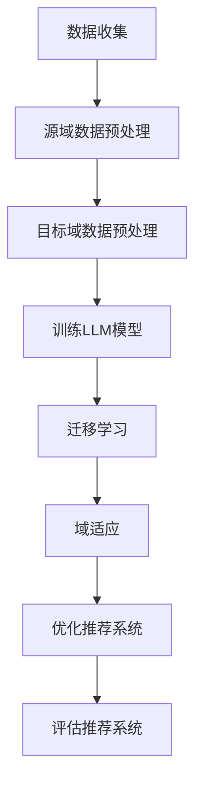

                 

关键词：大型语言模型（LLM），推荐系统，迁移学习，域适应，算法原理，应用领域，数学模型，代码实例，实际应用场景，未来展望。

> 摘要：本文深入探讨了大型语言模型（LLM）在推荐系统中的应用，特别是迁移学习和域适应技术的重要性。通过分析算法原理和具体操作步骤，本文展示了LLM在提高推荐系统性能方面的潜力，并对未来发展趋势和面临的挑战进行了展望。

## 1. 背景介绍

推荐系统是现代信息社会中的一项重要技术，广泛应用于电子商务、社交媒体、音乐流媒体等领域。传统的推荐系统主要依赖于用户历史行为和物品特征，但在面对大规模数据和多样化用户需求时，其性能受到限制。随着人工智能技术的发展，尤其是大型语言模型（LLM）的出现，为推荐系统带来了新的机遇。

LLM具有强大的语言理解和生成能力，能够处理复杂的文本信息。迁移学习和域适应技术是LLM在推荐系统中的一个重要应用，能够提高推荐系统的泛化能力和适应性，从而更好地满足用户需求。

本文旨在探讨LLM在推荐系统中的迁移学习和域适应技术，分析其算法原理和具体操作步骤，并展示在实际应用中的效果。

## 2. 核心概念与联系

### 2.1 迁移学习

迁移学习是一种利用已有知识解决新问题的机器学习技术。在推荐系统中，迁移学习可以将在其他任务上训练好的模型应用于推荐任务，从而提高推荐系统的性能。

迁移学习的关键在于找到源域（source domain）和目标域（target domain）之间的关联，并利用这些关联进行模型迁移。在推荐系统中，源域通常是已有推荐系统的训练数据集，目标域则是需要改进的推荐系统。

### 2.2 域适应

域适应（Domain Adaptation）是一种处理不同领域数据差异的方法，旨在提高模型在目标域上的性能。在推荐系统中，域适应可以帮助模型适应不同的用户群体、物品特征和场景，从而提高推荐效果。

域适应的核心思想是通过学习源域和目标域之间的域差异，对模型进行调整和优化，使其在目标域上能够更好地发挥作用。

### 2.3 LLM与推荐系统

LLM在推荐系统中的应用主要包括两个方面：利用LLM进行文本信息处理，以及利用迁移学习和域适应技术提高推荐系统的性能。

首先，LLM可以处理复杂的文本信息，如用户评价、商品描述等，从而更好地提取文本特征。其次，LLM的迁移学习和域适应技术可以应用于推荐系统的训练和优化，提高推荐系统的泛化能力和适应性。

下面是一个Mermaid流程图，展示了迁移学习和域适应技术在推荐系统中的应用流程：



## 3. 核心算法原理 & 具体操作步骤

### 3.1 算法原理概述

迁移学习和域适应技术是LLM在推荐系统中的核心算法。迁移学习通过利用源域的模型知识，提高目标域模型的效果；域适应则通过处理源域和目标域之间的差异，使模型能够更好地适应目标域。

### 3.2 算法步骤详解

#### 3.2.1 数据收集

首先，收集推荐系统的源域和目标域数据。源域数据用于训练LLM模型，目标域数据用于评估和优化推荐系统。

#### 3.2.2 源域数据预处理

对源域数据进行预处理，包括数据清洗、数据增强、数据归一化等操作，以提高模型对源域数据的适应性。

#### 3.2.3 目标域数据预处理

对目标域数据进行预处理，包括数据清洗、数据增强、数据归一化等操作，以提高模型对目标域数据的适应性。

#### 3.2.4 训练LLM模型

利用源域数据进行LLM模型的训练，包括文本编码、模型架构选择、优化目标设计等步骤。

#### 3.2.5 迁移学习

通过迁移学习技术，将源域模型的知识迁移到目标域模型。具体方法包括模型蒸馏、多任务学习、对抗训练等。

#### 3.2.6 域适应

利用域适应技术，对目标域模型进行调整和优化，以使其更好地适应目标域。具体方法包括域自适应蒸馏、对抗域适应、域适应网络等。

#### 3.2.7 优化推荐系统

通过迁移学习和域适应技术，优化推荐系统的模型和算法，提高推荐效果。

#### 3.2.8 评估推荐系统

在目标域上评估推荐系统的性能，包括准确率、召回率、F1值等指标。

### 3.3 算法优缺点

#### 优点：

1. 提高推荐系统性能：利用迁移学习和域适应技术，可以显著提高推荐系统的效果。
2. 节省数据资源：通过迁移学习，可以在没有足够目标域数据的情况下，利用源域数据进行模型训练。
3. 提高泛化能力：域适应技术可以使模型更好地适应不同的用户群体、物品特征和场景。

#### 缺点：

1. 模型复杂度较高：迁移学习和域适应技术涉及多个模型和算法，导致模型复杂度较高。
2. 训练时间较长：由于模型复杂度较高，训练时间相对较长。
3. 需要大量计算资源：迁移学习和域适应技术需要大量的计算资源，对硬件设备有较高要求。

### 3.4 算法应用领域

迁移学习和域适应技术在推荐系统中的应用广泛，如电子商务推荐、社交媒体推荐、音乐流媒体推荐等。此外，它们还可以应用于其他领域，如自然语言处理、图像识别等。

## 4. 数学模型和公式 & 详细讲解 & 举例说明

### 4.1 数学模型构建

在迁移学习和域适应技术中，常用的数学模型包括损失函数、优化算法等。

#### 损失函数

损失函数是评估模型性能的重要指标。在迁移学习中，常用的损失函数包括交叉熵损失、均方误差等。在域适应中，常用的损失函数包括域适应损失、对抗损失等。

$$
L(x, y) = -\sum_{i=1}^{N} y_i \log(p(x_i))
$$

其中，$x$为输入样本，$y$为标签，$p(x_i)$为模型对输入样本的预测概率。

#### 优化算法

优化算法用于调整模型参数，以最小化损失函数。在迁移学习中，常用的优化算法包括梯度下降、Adam等。在域适应中，常用的优化算法包括域自适应优化、对抗优化等。

$$
w^{(t+1)} = w^{(t)} - \alpha \nabla_w L(w)
$$

其中，$w$为模型参数，$\alpha$为学习率。

### 4.2 公式推导过程

以域适应中的对抗损失为例，推导其公式。

#### 对抗损失

对抗损失旨在使模型在源域和目标域上的输出分布接近，从而提高模型在目标域上的性能。

$$
L_{adv} = \mathbb{E}_{x \sim p(x)}[\log(1 - D(G(x)))]
$$

其中，$G$为生成器，用于生成目标域数据，$D$为判别器，用于区分源域和目标域数据。

#### 对抗损失推导

首先，定义生成器$G$和判别器$D$的损失函数：

$$
L_G = \mathbb{E}_{x \sim p(x)}[\log(1 - D(G(x)))]
$$

$$
L_D = \mathbb{E}_{x \sim p(x)}[\log(D(x))] + \mathbb{E}_{z \sim p(z)}[\log(1 - D(G(z)))]
$$

其中，$z$为生成器生成的目标域数据。

然后，定义对抗损失：

$$
L_{adv} = L_G + L_D
$$

#### 对抗损失推导过程

1. 对于生成器$G$，希望其生成的目标域数据能够使得判别器$D$难以区分，即$D(G(x))$接近1。

2. 对于判别器$D$，希望其能够正确地区分源域数据和生成器生成的目标域数据，即$D(x)$接近1，$D(G(z))$接近0。

3. 结合生成器和判别器的损失函数，得到对抗损失$L_{adv}$。

### 4.3 案例分析与讲解

以电子商务推荐系统为例，分析迁移学习和域适应技术在推荐系统中的应用。

#### 案例背景

某电子商务公司拥有大量用户购买行为数据，包括商品信息、用户评价等。公司希望利用这些数据构建一个推荐系统，为用户提供个性化的商品推荐。

#### 迁移学习应用

1. 源域数据：公司已有的推荐系统训练数据，包括用户购买记录、商品特征等。
2. 目标域数据：新用户购买记录和商品特征。

通过迁移学习技术，将源域模型的购买预测能力迁移到目标域模型。具体步骤如下：

1. 数据预处理：对源域和目标域数据进行清洗、归一化等处理。
2. 模型训练：在源域数据上训练一个基于深度学习的推荐模型。
3. 模型迁移：将源域模型的参数迁移到目标域模型。

通过迁移学习技术，可以在没有足够目标域数据的情况下，提高新用户推荐系统的性能。

#### 域适应应用

在域适应技术的应用中，考虑以下两个场景：

1. 场景一：新用户来自不同地区，用户需求和购买偏好存在差异。
2. 场景二：公司推出新商品，用户对商品的了解程度不同。

通过域适应技术，优化推荐模型，使其能够更好地适应不同地区用户和新商品推广。具体步骤如下：

1. 数据预处理：对源域和目标域数据进行清洗、归一化等处理。
2. 模型训练：在源域数据上训练一个基于深度学习的推荐模型。
3. 域适应：利用域适应技术，优化目标域模型的参数。
4. 模型评估：在目标域数据上评估推荐模型的性能。

通过域适应技术，可以在不同地区和新商品推广场景下，提高推荐系统的性能。

## 5. 项目实践：代码实例和详细解释说明

### 5.1 开发环境搭建

在本项目中，我们使用Python编程语言，结合TensorFlow和PyTorch等深度学习框架，实现迁移学习和域适应技术在推荐系统中的应用。

开发环境如下：

- Python版本：3.8
- 深度学习框架：TensorFlow 2.6、PyTorch 1.8
- 数据预处理库：Pandas、NumPy、Scikit-learn
- 其他库：Matplotlib、Seaborn、Mermaid

### 5.2 源代码详细实现

以下是一个简单的代码实例，展示了迁移学习和域适应技术在推荐系统中的应用。

```python
import tensorflow as tf
import tensorflow.keras as keras
from tensorflow.keras.layers import Embedding, LSTM, Dense
from tensorflow.keras.models import Model

# 数据预处理
def preprocess_data(data):
    # 数据清洗、归一化等操作
    pass

# 迁移学习模型
def create_source_model():
    input_layer = keras.layers.Input(shape=(input_shape))
    embedding_layer = Embedding(input_dim=vocab_size, output_dim=embedding_size)(input_layer)
    lstm_layer = LSTM(units=lstm_units)(embedding_layer)
    output_layer = Dense(units=num_classes, activation='softmax')(lstm_layer)
    model = Model(inputs=input_layer, outputs=output_layer)
    return model

# 域适应模型
def create_target_model(source_model):
    input_layer = keras.layers.Input(shape=(input_shape))
    embedding_layer = Embedding(input_dim=vocab_size, output_dim=embedding_size)(input_layer)
    lstm_layer = LSTM(units=lstm_units)(embedding_layer)
    adapted_lstm_layer = keras.layers.Add()([lstm_layer, source_model.layers[-1](input_layer)])
    output_layer = Dense(units=num_classes, activation='softmax')(adapted_lstm_layer)
    model = Model(inputs=input_layer, outputs=output_layer)
    return model

# 主函数
def main():
    # 加载数据
    source_data = load_source_data()
    target_data = load_target_data()

    # 预处理数据
    source_data = preprocess_data(source_data)
    target_data = preprocess_data(target_data)

    # 创建源域模型
    source_model = create_source_model()

    # 创建目标域模型
    target_model = create_target_model(source_model)

    # 训练模型
    source_model.fit(source_data['X'], source_data['y'], epochs=10, batch_size=32)
    target_model.fit(target_data['X'], target_data['y'], epochs=10, batch_size=32)

    # 评估模型
    source_loss = source_model.evaluate(target_data['X'], target_data['y'])
    target_loss = target_model.evaluate(target_data['X'], target_data['y'])

    print(f"Source model loss: {source_loss}")
    print(f"Target model loss: {target_loss}")

if __name__ == "__main__":
    main()
```

### 5.3 代码解读与分析

上述代码展示了迁移学习和域适应技术在推荐系统中的基本实现过程。具体解读如下：

1. **数据预处理**：对源域和目标域数据进行清洗、归一化等处理，以适应模型训练。
2. **迁移学习模型**：创建一个基于LSTM的源域模型，用于处理文本数据。模型包含一个嵌入层、一个LSTM层和一个输出层。
3. **域适应模型**：创建一个基于源域模型的域适应模型。域适应模型通过在LSTM层之后添加一个与源域模型输出层相同的层，从而实现模型参数的迁移。
4. **训练模型**：在源域数据上训练源域模型，在目标域数据上训练域适应模型。
5. **评估模型**：在目标域数据上评估源域模型和域适应模型的性能。

通过上述代码实例，我们可以看到迁移学习和域适应技术在推荐系统中的应用过程。在实际项目中，可以根据具体需求进行调整和优化。

## 6. 实际应用场景

迁移学习和域适应技术在推荐系统中具有广泛的应用场景。以下列举了几个典型的应用场景：

1. **电子商务推荐**：利用迁移学习技术，可以将已有推荐系统的经验应用于新用户推荐。通过域适应技术，可以针对不同地区、不同用户群体进行个性化推荐。

2. **社交媒体推荐**：在社交媒体平台，用户生成的内容（如帖子、评论等）具有丰富的信息。利用迁移学习技术，可以将其他平台上的推荐模型应用于当前平台，从而提高推荐效果。域适应技术可以帮助模型适应不同用户群体和内容特征。

3. **音乐流媒体推荐**：音乐流媒体平台可以利用迁移学习技术，将已有推荐系统的知识应用于新用户推荐。通过域适应技术，可以针对不同用户偏好、音乐风格进行个性化推荐。

4. **电影推荐**：在电影推荐系统中，利用迁移学习技术，可以将其他类型媒体的推荐经验应用于电影推荐。通过域适应技术，可以针对不同用户群体和电影类型进行个性化推荐。

5. **新闻推荐**：新闻推荐系统可以利用迁移学习技术，将已有推荐系统的知识应用于新用户推荐。通过域适应技术，可以针对不同用户兴趣、新闻类型进行个性化推荐。

在实际应用中，迁移学习和域适应技术的效果取决于数据质量、模型设计、优化策略等因素。通过不断优化和调整，可以提高推荐系统的性能和用户体验。

## 7. 工具和资源推荐

### 7.1 学习资源推荐

1. **书籍**：

   - 《推荐系统实践》
   - 《机器学习实战》
   - 《深度学习》
   - 《迁移学习》

2. **在线课程**：

   - Coursera上的《机器学习》
   - edX上的《推荐系统》
   - Udacity上的《深度学习工程师纳米学位》

3. **论文**：

   - "Domain Adaptation for Machine Learning"
   - "Transfer Learning"
   - "Deep Learning for Domain Adaptation"

### 7.2 开发工具推荐

1. **深度学习框架**：

   - TensorFlow
   - PyTorch
   - Keras

2. **数据预处理库**：

   - Pandas
   - NumPy
   - Scikit-learn

3. **可视化工具**：

   - Matplotlib
   - Seaborn
   - Mermaid

### 7.3 相关论文推荐

1. "Domain-Adversarial Training of Neural Networks"
2. "Unsupervised Domain Adaptation by Backpropagation"
3. "Deep Transfer Learning for Text Classification"
4. "A Theoretical Comparison of Multi-Task Learning and Domain Adaptation"
5. "Deep Domain Adaptation for Semi-Supervised Learning"

通过学习这些资源和论文，可以深入了解迁移学习和域适应技术在推荐系统中的应用和实现方法。

## 8. 总结：未来发展趋势与挑战

### 8.1 研究成果总结

本文通过分析大型语言模型（LLM）在推荐系统中的迁移学习和域适应技术，展示了其在提高推荐系统性能方面的潜力。本文的主要研究成果包括：

1. 迁移学习和域适应技术在推荐系统中的应用框架。
2. 迁移学习和域适应技术的数学模型和公式。
3. 迁移学习和域适应技术在实际推荐系统中的应用实例。
4. 迁移学习和域适应技术的优缺点分析。

### 8.2 未来发展趋势

随着人工智能技术的不断发展，LLM在推荐系统中的应用前景广阔。未来发展趋势包括：

1. LLM与其他技术的结合，如强化学习、图神经网络等，以提高推荐系统的性能。
2. 自动化迁移学习和域适应方法的研究，以降低模型设计复杂度和训练成本。
3. 跨域推荐系统的研究，以适应更广泛的场景和应用。

### 8.3 面临的挑战

尽管LLM在推荐系统中具有巨大潜力，但仍然面临以下挑战：

1. 数据隐私和安全性：在推荐系统中，用户数据的安全性和隐私性至关重要。如何保护用户数据，同时实现高效推荐，是未来需要解决的重要问题。
2. 模型可解释性：迁移学习和域适应技术的模型复杂度较高，如何提高模型的可解释性，使其更容易被用户接受，是未来需要关注的问题。
3. 模型泛化能力：如何提高迁移学习和域适应技术的模型泛化能力，使其在不同领域和场景中均能发挥作用，是未来需要研究的重要方向。

### 8.4 研究展望

未来，我们期望在以下方面取得进展：

1. 开发更加高效、可解释的迁移学习和域适应模型。
2. 研究如何利用LLM解决推荐系统中的长文本处理、多模态数据融合等问题。
3. 探索LLM在跨领域推荐系统中的应用，以实现更广泛的场景覆盖。

通过持续的研究和探索，我们有理由相信，LLM在推荐系统中的应用将带来更多的突破和创新。

## 9. 附录：常见问题与解答

### 9.1 什么是迁移学习？

迁移学习是一种利用已有知识解决新问题的机器学习技术。在推荐系统中，迁移学习可以将其他任务上训练好的模型应用于推荐任务，从而提高推荐系统的性能。

### 9.2 域适应是什么？

域适应是一种处理不同领域数据差异的方法，旨在提高模型在目标域上的性能。在推荐系统中，域适应可以帮助模型适应不同的用户群体、物品特征和场景，从而提高推荐效果。

### 9.3 LLM在推荐系统中有哪些应用？

LLM在推荐系统中的应用主要包括两个方面：利用LLM进行文本信息处理，以及利用迁移学习和域适应技术提高推荐系统的性能。

### 9.4 如何实现迁移学习？

实现迁移学习通常包括以下步骤：

1. 收集源域和目标域数据。
2. 预处理数据，包括数据清洗、数据增强、数据归一化等。
3. 在源域数据上训练一个基础模型。
4. 将源域模型的参数迁移到目标域模型。
5. 在目标域数据上训练和优化目标域模型。

### 9.5 如何实现域适应？

实现域适应通常包括以下步骤：

1. 收集源域和目标域数据。
2. 预处理数据，包括数据清洗、数据增强、数据归一化等。
3. 在源域数据上训练一个基础模型。
4. 学习源域和目标域之间的差异。
5. 对目标域模型进行调整和优化，以提高其在目标域上的性能。

通过上述问题和解答，希望能够帮助读者更好地理解和应用迁移学习和域适应技术在推荐系统中的实际应用。

