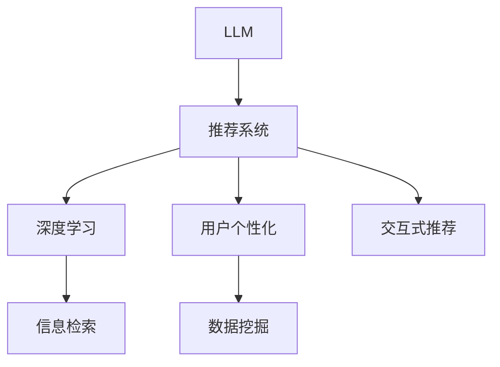

                 

# LLM在推荐系统的应用前景

> 关键词：
- 大语言模型 (Large Language Model, LLM)
- 推荐系统 (Recommendation System)
- 深度学习 (Deep Learning)
- 信息检索 (Information Retrieval)
- 用户个性化 (User Personalization)
- 数据挖掘 (Data Mining)
- 交互式推荐 (Interactive Recommendation)

## 1. 背景介绍

### 1.1 问题由来
随着互联网和数字技术的迅猛发展，推荐系统在电子商务、社交网络、内容平台等领域得到了广泛应用。推荐系统通过分析用户的历史行为、兴趣偏好，自动生成个性化推荐，提升用户体验和转化率。然而，传统的基于协同过滤、矩阵分解等方法的推荐系统存在数据稀疏、冷启动问题，难以应对大规模数据集和实时数据流的挑战。

近年来，随着深度学习和大语言模型（Large Language Model, LLM）技术的成熟，推荐系统进入了新的发展阶段。基于LLM的推荐系统不仅能够处理大规模、高维度的数据，还能通过模型自监督学习，捕捉用户的语义信息，实现更加精准、个性化的推荐。

### 1.2 问题核心关键点
LLM在推荐系统中的应用主要基于以下几个核心关键点：

- **自监督学习**：LLM通过在大量无标签文本数据上进行预训练，学习通用的语言表征。这些表征可以与推荐系统中的用户行为数据结合，提升推荐的精准度和个性化程度。
- **多模态融合**：LLM不仅能够处理文本数据，还能通过多模态融合技术，整合图像、视频、音频等多种数据源，实现更为全面的用户画像。
- **交互式推荐**：LLM具备强大的自然语言生成能力，能够与用户进行多轮交互，通过对话获取用户的即时反馈，进一步优化推荐结果。
- **动态适应**：LLM通过在线学习和持续微调，能够适应用户兴趣和偏好的变化，实现动态化的推荐。
- **安全性和隐私保护**：LLM能够使用差分隐私、联邦学习等技术，保护用户隐私和数据安全。

这些关键点使得LLM在推荐系统中具备了显著优势，推动了推荐技术的发展。

## 2. 核心概念与联系

### 2.1 核心概念概述

为更好地理解LLM在推荐系统中的应用，本节将介绍几个密切相关的核心概念：

- **大语言模型 (LLM)**：指通过在大量无标签文本数据上进行预训练，学习通用语言表示的模型。常见的预训练模型包括BERT、GPT等。

- **推荐系统 (Recommendation System)**：根据用户历史行为和兴趣偏好，自动生成个性化推荐的技术。推荐系统广泛应用于电商、社交、内容等领域，提升用户体验和转化率。

- **深度学习 (Deep Learning)**：指基于多层神经网络进行模型训练，通过学习复杂非线性关系，提升模型性能。深度学习在推荐系统中广泛应用，尤其在特征提取和用户行为建模方面。

- **信息检索 (Information Retrieval)**：指从大量数据中检索相关信息的技术。推荐系统中的召回阶段可以看作是信息检索过程，通过相似度计算，从海量的产品库中检索潜在推荐对象。

- **用户个性化 (User Personalization)**：指根据用户特征和行为，生成个性化推荐的过程。个性化推荐是推荐系统的核心目标，提升用户体验和满意度。

- **数据挖掘 (Data Mining)**：指从大量数据中挖掘有用信息的过程。推荐系统中需要进行用户画像构建、行为模式分析、兴趣特征挖掘等，以提升推荐效果。

- **交互式推荐 (Interactive Recommendation)**：指与用户进行多轮交互，获取用户即时反馈，动态调整推荐结果的过程。交互式推荐能够实时响应用户需求，提升推荐效果。

这些核心概念之间的逻辑关系可以通过以下Mermaid流程图来展示：



这个流程图展示了大语言模型在推荐系统中的应用框架：

1. 大语言模型通过预训练获得通用语言表征。
2. 结合推荐系统中的用户行为数据，进行自监督学习，捕捉用户语义信息。
3. 通过深度学习进行特征提取和行为建模。
4. 利用信息检索技术，从海量的产品库中检索潜在推荐对象。
5. 根据用户画像和行为数据，进行个性化推荐。
6. 结合数据挖掘技术，提升推荐效果。
7. 通过交互式推荐，动态调整推荐结果。

## 3. 核心算法原理 & 具体操作步骤

### 3.1 算法原理概述

基于LLM的推荐系统，本质上是一个结合了自监督学习和深度学习的推荐范式。其核心思想是：将大语言模型作为推荐系统中的特征提取器，通过自监督学习任务学习通用的语言表征，再结合用户行为数据进行深度学习建模，最终实现个性化推荐。

形式化地，假设大语言模型为 $M_{\theta}$，其中 $\theta$ 为预训练得到的模型参数。推荐系统的训练集为 $D=\{(x_i,y_i)\}_{i=1}^N$，其中 $x_i$ 为推荐对象，$y_i$ 为用户的评分或行为数据。推荐系统的优化目标是最小化预测误差，即：

$$
\theta^* = \mathop{\arg\min}_{\theta} \mathcal{L}(M_{\theta},D)
$$

其中 $\mathcal{L}$ 为推荐系统中的损失函数，用于衡量模型预测与真实标签之间的差异。常见的损失函数包括均方误差损失、交叉熵损失等。

通过梯度下降等优化算法，推荐系统不断更新模型参数 $\theta$，最小化损失函数 $\mathcal{L}$，使得模型预测逼近真实标签。由于 $\theta$ 已经通过预训练获得了较好的初始化，因此即便在推荐系统的稀疏数据集 $D$ 上进行微调，也能较快收敛到理想的模型参数 $\hat{\theta}$。

### 3.2 算法步骤详解

基于LLM的推荐系统一般包括以下几个关键步骤：

**Step 1: 准备预训练模型和数据集**
- 选择合适的预训练语言模型 $M_{\theta}$ 作为初始化参数，如 BERT、GPT 等。
- 准备推荐系统的训练集 $D$，划分为训练集、验证集和测试集。一般要求推荐数据与预训练数据的分布不要差异过大。

**Step 2: 添加任务适配层**
- 根据推荐任务类型，在预训练模型顶层设计合适的输出层和损失函数。
- 对于评分预测任务，通常在顶层添加线性分类器和交叉熵损失函数。
- 对于行为预测任务，通常使用回归器输出预测值，并以均方误差损失函数进行训练。

**Step 3: 设置推荐系统超参数**
- 选择合适的优化算法及其参数，如 Adam、SGD 等，设置学习率、批大小、迭代轮数等。
- 设置正则化技术及强度，包括权重衰减、Dropout、Early Stopping 等。
- 确定冻结预训练参数的策略，如仅微调顶层，或全部参数都参与微调。

**Step 4: 执行梯度训练**
- 将训练集数据分批次输入模型，前向传播计算损失函数。
- 反向传播计算参数梯度，根据设定的优化算法和学习率更新模型参数。
- 周期性在验证集上评估模型性能，根据性能指标决定是否触发 Early Stopping。
- 重复上述步骤直到满足预设的迭代轮数或 Early Stopping 条件。

**Step 5: 测试和部署**
- 在测试集上评估推荐系统的性能，对比微调前后的效果提升。
- 使用微调后的模型对新用户进行推荐，集成到实际的应用系统中。
- 持续收集新的用户行为数据，定期重新微调模型，以适应用户兴趣和行为的变化。

以上是基于LLM的推荐系统的一般流程。在实际应用中，还需要针对具体任务的特点，对推荐系统进行优化设计，如改进训练目标函数，引入更多的正则化技术，搜索最优的超参数组合等，以进一步提升模型性能。

### 3.3 算法优缺点

基于LLM的推荐系统具有以下优点：
1. 能够处理大规模、高维度的数据，捕捉用户的语义信息，提升推荐的精准度。
2. 适用于各种推荐任务，包括评分预测、行为预测、动态推荐等，设计简单的任务适配层即可实现。
3. 利用大模型的语言理解能力，可以通过交互式推荐获取用户即时反馈，动态调整推荐结果。
4. 可以通过持续微调，适应用户兴趣和行为的变化，实现动态化的推荐。

同时，该方法也存在一定的局限性：
1. 依赖高质量的标注数据，推荐数据与预训练数据的分布差异较大时，推荐效果可能有限。
2. 在稀疏数据环境下，推荐效果可能受到影响，用户行为数据的缺失可能影响模型的泛化能力。
3. 模型复杂度高，对计算资源和存储资源的要求较高，可能面临资源瓶颈。
4. 模型自适应能力强，但可解释性不足，难以解释模型的决策过程。

尽管存在这些局限性，但就目前而言，基于LLM的推荐系统方法仍然是大规模推荐系统的重要范式。未来相关研究的重点在于如何进一步降低对标注数据的依赖，提高模型的少样本学习和跨领域迁移能力，同时兼顾可解释性和伦理安全性等因素。

### 3.4 算法应用领域

基于LLM的推荐系统在电商、社交、内容等领域已经得到了广泛的应用，覆盖了推荐系统的各个环节，例如：

- **评分预测**：通过评分数据训练大语言模型，预测用户对未评分产品的评分，从而进行排序推荐。
- **行为预测**：通过用户的历史行为数据，预测用户可能感兴趣的产品，实现个性化推荐。
- **相似度计算**：利用大语言模型的语义表示，计算推荐对象之间的相似度，筛选潜在推荐对象。
- **实时推荐**：通过与用户进行多轮交互，动态调整推荐结果，提升实时推荐的准确性。
- **跨领域推荐**：利用大语言模型在多个领域预训练得到的语言表征，实现跨领域的推荐。

除了上述这些经典任务外，基于LLM的推荐系统还被创新性地应用到更多场景中，如多模态推荐、冷启动推荐、个性化标签推荐等，为推荐技术带来了新的突破。

## 4. 数学模型和公式 & 详细讲解 & 举例说明

### 4.1 数学模型构建

本节将使用数学语言对基于LLM的推荐系统进行更加严格的刻画。

假设推荐系统中的用户行为数据为 $D=\{(x_i,y_i)\}_{i=1}^N$，其中 $x_i$ 为推荐对象，$y_i$ 为用户的评分或行为数据。

定义推荐模型 $M_{\theta}$ 在输入 $x_i$ 上的预测为 $\hat{y}_i=M_{\theta}(x_i)$，则推荐系统的经验风险为：

$$
\mathcal{L}(\theta) = \frac{1}{N}\sum_{i=1}^N [(y_i-\hat{y}_i)^2]
$$

其中 $y_i$ 为真实标签，$\hat{y}_i$ 为模型预测值。

通过梯度下降等优化算法，推荐系统不断更新模型参数 $\theta$，最小化经验风险 $\mathcal{L}(\theta)$，使得模型预测逼近真实标签。由于 $\theta$ 已经通过预训练获得了较好的初始化，因此即便在推荐系统的稀疏数据集 $D$ 上进行微调，也能较快收敛到理想的模型参数 $\hat{\theta}$。

### 4.2 公式推导过程

以下我们以评分预测任务为例，推导评分预测模型的损失函数及其梯度的计算公式。

假设推荐系统中的用户行为数据为 $D=\{(x_i,y_i)\}_{i=1}^N$，其中 $x_i$ 为推荐对象，$y_i$ 为用户的评分。推荐模型 $M_{\theta}$ 在输入 $x_i$ 上的预测为 $\hat{y}_i=M_{\theta}(x_i)$，则评分预测任务的经验风险为：

$$
\mathcal{L}(\theta) = \frac{1}{N}\sum_{i=1}^N [(y_i-\hat{y}_i)^2]
$$

根据链式法则，损失函数对参数 $\theta_k$ 的梯度为：

$$
\frac{\partial \mathcal{L}(\theta)}{\partial \theta_k} = -\frac{2}{N}\sum_{i=1}^N \frac{(y_i-\hat{y}_i)}{\partial \hat{y}_i} \frac{\partial \hat{y}_i}{\partial \theta_k}
$$

其中 $\frac{\partial \hat{y}_i}{\partial \theta_k}$ 为输出层对参数 $\theta_k$ 的梯度，可以进一步递归展开，利用自动微分技术完成计算。

在得到损失函数的梯度后，即可带入参数更新公式，完成模型的迭代优化。重复上述过程直至收敛，最终得到适应推荐任务的最优模型参数 $\theta^*$。

## 5. 项目实践：代码实例和详细解释说明

### 5.1 开发环境搭建

在进行推荐系统实践前，我们需要准备好开发环境。以下是使用Python进行PyTorch开发的环境配置流程：

1. 安装Anaconda：从官网下载并安装Anaconda，用于创建独立的Python环境。

2. 创建并激活虚拟环境：
```bash
conda create -n pytorch-env python=3.8 
conda activate pytorch-env
```

3. 安装PyTorch：根据CUDA版本，从官网获取对应的安装命令。例如：
```bash
conda install pytorch torchvision torchaudio cudatoolkit=11.1 -c pytorch -c conda-forge
```

4. 安装Transformers库：
```bash
pip install transformers
```

5. 安装各类工具包：
```bash
pip install numpy pandas scikit-learn matplotlib tqdm jupyter notebook ipython
```

完成上述步骤后，即可在`pytorch-env`环境中开始推荐系统实践。

### 5.2 源代码详细实现

这里我们以评分预测任务为例，给出使用Transformers库对BERT模型进行评分预测的PyTorch代码实现。

首先，定义评分预测任务的评分数据处理函数：

```python
from transformers import BertTokenizer
from torch.utils.data import Dataset, DataLoader
import torch

class RatingDataset(Dataset):
    def __init__(self, ratings, labels, tokenizer, max_len=128):
        self.ratings = ratings
        self.labels = labels
        self.tokenizer = tokenizer
        self.max_len = max_len
        
    def __len__(self):
        return len(self.ratings)
    
    def __getitem__(self, item):
        rating = self.ratings[item]
        label = self.labels[item]
        
        encoding = self.tokenizer(rating, return_tensors='pt', max_length=self.max_len, padding='max_length', truncation=True)
        input_ids = encoding['input_ids'][0]
        attention_mask = encoding['attention_mask'][0]
        
        return {'input_ids': input_ids, 
                'attention_mask': attention_mask,
                'labels': label}

# 加载BERT预训练模型
from transformers import BertForSequenceClassification

model = BertForSequenceClassification.from_pretrained('bert-base-cased', num_labels=2)

# 定义评分预测任务的数据集
tokenizer = BertTokenizer.from_pretrained('bert-base-cased')

train_dataset = RatingDataset(train_ratings, train_labels, tokenizer)
dev_dataset = RatingDataset(dev_ratings, dev_labels, tokenizer)
test_dataset = RatingDataset(test_ratings, test_labels, tokenizer)
```

然后，定义训练和评估函数：

```python
from torch.utils.data import DataLoader
from tqdm import tqdm
from sklearn.metrics import mean_squared_error

device = torch.device('cuda') if torch.cuda.is_available() else torch.device('cpu')
model.to(device)

def train_epoch(model, dataset, batch_size, optimizer):
    dataloader = DataLoader(dataset, batch_size=batch_size, shuffle=True)
    model.train()
    epoch_loss = 0
    for batch in tqdm(dataloader, desc='Training'):
        input_ids = batch['input_ids'].to(device)
        attention_mask = batch['attention_mask'].to(device)
        labels = batch['labels'].to(device)
        model.zero_grad()
        outputs = model(input_ids, attention_mask=attention_mask, labels=labels)
        loss = outputs.loss
        epoch_loss += loss.item()
        loss.backward()
        optimizer.step()
    return epoch_loss / len(dataloader)

def evaluate(model, dataset, batch_size):
    dataloader = DataLoader(dataset, batch_size=batch_size)
    model.eval()
    preds, labels = [], []
    with torch.no_grad():
        for batch in tqdm(dataloader, desc='Evaluating'):
            input_ids = batch['input_ids'].to(device)
            attention_mask = batch['attention_mask'].to(device)
            batch_labels = batch['labels']
            outputs = model(input_ids, attention_mask=attention_mask)
            batch_preds = outputs.logits.argmax(dim=1).to('cpu').tolist()
            batch_labels = batch_labels.to('cpu').tolist()
            for pred, label in zip(batch_preds, batch_labels):
                preds.append(pred)
                labels.append(label)
                
    print(mean_squared_error(labels, preds))
```

最后，启动训练流程并在测试集上评估：

```python
epochs = 5
batch_size = 16

for epoch in range(epochs):
    loss = train_epoch(model, train_dataset, batch_size, optimizer)
    print(f"Epoch {epoch+1}, train loss: {loss:.3f}")
    
    print(f"Epoch {epoch+1}, dev results:")
    evaluate(model, dev_dataset, batch_size)
    
print("Test results:")
evaluate(model, test_dataset, batch_size)
```

以上就是使用PyTorch对BERT进行评分预测任务的完整代码实现。可以看到，得益于Transformers库的强大封装，我们可以用相对简洁的代码完成BERT模型的加载和评分预测。

### 5.3 代码解读与分析

让我们再详细解读一下关键代码的实现细节：

**RatingDataset类**：
- `__init__`方法：初始化评分数据、标签、分词器等关键组件。
- `__len__`方法：返回数据集的样本数量。
- `__getitem__`方法：对单个样本进行处理，将评分文本输入编码为token ids，并将标签转换为数字，并对其进行定长padding，最终返回模型所需的输入。

**评分预测模型的构建**：
- `BertForSequenceClassification`类：指定评分预测任务为二分类问题，并加载预训练模型。
- `RatingDataset`类：根据评分数据和标签构建数据集。

**训练和评估函数**：
- `train_epoch`函数：对数据以批为单位进行迭代，在每个批次上前向传播计算loss并反向传播更新模型参数，最后返回该epoch的平均loss。
- `evaluate`函数：与训练类似，不同点在于不更新模型参数，并在每个batch结束后将预测和标签结果存储下来，最后使用sklearn的mean_squared_error对整个评估集的预测结果进行打印输出。

**训练流程**：
- 定义总的epoch数和batch size，开始循环迭代
- 每个epoch内，先在训练集上训练，输出平均loss
- 在验证集上评估，输出评分预测的均方误差
- 所有epoch结束后，在测试集上评估，给出最终评分预测结果

可以看到，PyTorch配合Transformers库使得BERT评分预测的代码实现变得简洁高效。开发者可以将更多精力放在数据处理、模型改进等高层逻辑上，而不必过多关注底层的实现细节。

当然，工业级的系统实现还需考虑更多因素，如模型的保存和部署、超参数的自动搜索、更灵活的任务适配层等。但核心的推荐范式基本与此类似。

## 6. 实际应用场景

### 6.1 电商平台推荐

基于大语言模型的推荐系统，可以广泛应用于电商平台推荐商品。传统电商推荐系统往往依赖用户历史行为数据进行推荐，难以捕捉用户的语义信息，导致推荐结果不够精准。而使用大语言模型进行推荐，可以结合用户输入的文本描述，进行更加个性化的推荐。

在技术实现上，可以收集用户搜索历史、浏览记录、评价等文本数据，将其作为输入数据，训练大语言模型学习用户的兴趣和偏好。微调后的模型能够自动理解用户的文本描述，匹配最合适的商品进行推荐。对于用户提出的新需求，还可以接入检索系统实时搜索相关商品，动态生成推荐列表。如此构建的电商平台推荐系统，能够显著提升用户购物体验和转化率。

### 6.2 社交媒体推荐

社交媒体平台推荐用户内容，往往需要考虑用户的多样性需求。传统的协同过滤推荐系统难以捕捉用户的多样性需求，导致推荐结果单一。而基于大语言模型的推荐系统，可以通过与用户进行多轮交互，获取用户的即时反馈，实现动态化的推荐。

在技术实现上，可以收集用户的内容发布、点赞、评论等行为数据，将其作为输入数据，训练大语言模型学习用户的兴趣和偏好。微调后的模型能够自动理解用户的即时需求，动态调整推荐结果，提升推荐效果。同时，可以通过与用户进行多轮对话，获取用户的即时反馈，进一步优化推荐结果。如此构建的社交媒体推荐系统，能够提升用户满意度，增强平台粘性。

### 6.3 内容平台推荐

内容平台推荐用户感兴趣的文章、视频等，需要考虑用户的多样性和个性化需求。传统的协同过滤推荐系统难以应对大规模数据集和实时数据流的挑战，导致推荐效果不够精准。而基于大语言模型的推荐系统，能够处理大规模、高维度的数据，捕捉用户的语义信息，提升推荐的精准度和个性化程度。

在技术实现上，可以收集用户的历史阅读记录、点赞、评论等行为数据，将其作为输入数据，训练大语言模型学习用户的兴趣和偏好。微调后的模型能够自动理解用户的语义信息，匹配最合适的文章、视频进行推荐。同时，可以通过与用户进行多轮对话，获取用户的即时反馈，动态调整推荐结果。如此构建的内容平台推荐系统，能够提升用户满意度，增强平台粘性。

### 6.4 未来应用展望

随着大语言模型和推荐系统的不断发展，基于大语言模型的推荐技术将在更多领域得到应用，为内容创作者、商家等带来新的机遇。

在智慧城市治理中，推荐系统可以推荐与市民息息相关的政策、服务、事件等，提升城市治理的透明度和效率。

在公共健康领域，推荐系统可以推荐相关的科普知识、医疗信息、健康提示等，帮助市民提升健康素养。

在教育培训领域，推荐系统可以推荐相关的学习资源、课程、习题等，帮助学生个性化学习，提升学习效果。

此外，在新闻媒体、娱乐、旅游等领域，基于大语言模型的推荐系统也将不断涌现，为各行业带来新的发展机遇。相信随着技术的日益成熟，大语言模型推荐系统必将在更多领域大放异彩，提升人类的生产生活方式。

## 7. 工具和资源推荐
### 7.1 学习资源推荐

为了帮助开发者系统掌握大语言模型在推荐系统中的应用理论基础和实践技巧，这里推荐一些优质的学习资源：

1. 《Transformers从原理到实践》系列博文：由大模型技术专家撰写，深入浅出地介绍了Transformer原理、BERT模型、推荐系统范式等前沿话题。

2. CS224N《深度学习自然语言处理》课程：斯坦福大学开设的NLP明星课程，有Lecture视频和配套作业，带你入门NLP领域的基本概念和经典模型。

3. 《Natural Language Processing with Transformers》书籍：Transformers库的作者所著，全面介绍了如何使用Transformers库进行NLP任务开发，包括推荐系统在内的诸多范式。

4. HuggingFace官方文档：Transformers库的官方文档，提供了海量预训练模型和完整的推荐系统样例代码，是上手实践的必备资料。

5. RECOMEND开源项目：推荐系统开源项目，涵盖大量不同类型的推荐系统数据集，并提供了基于微调的baseline模型，助力推荐系统技术发展。

通过对这些资源的学习实践，相信你一定能够快速掌握大语言模型在推荐系统中的应用精髓，并用于解决实际的推荐问题。
###  7.2 开发工具推荐

高效的开发离不开优秀的工具支持。以下是几款用于大语言模型推荐系统开发的常用工具：

1. PyTorch：基于Python的开源深度学习框架，灵活动态的计算图，适合快速迭代研究。大部分预训练语言模型都有PyTorch版本的实现。

2. TensorFlow：由Google主导开发的开源深度学习框架，生产部署方便，适合大规模工程应用。同样有丰富的预训练语言模型资源。

3. Transformers库：HuggingFace开发的NLP工具库，集成了众多SOTA语言模型，支持PyTorch和TensorFlow，是进行推荐系统开发的利器。

4. Weights & Biases：模型训练的实验跟踪工具，可以记录和可视化模型训练过程中的各项指标，方便对比和调优。与主流深度学习框架无缝集成。

5. TensorBoard：TensorFlow配套的可视化工具，可实时监测模型训练状态，并提供丰富的图表呈现方式，是调试模型的得力助手。

6. Google Colab：谷歌推出的在线Jupyter Notebook环境，免费提供GPU/TPU算力，方便开发者快速上手实验最新模型，分享学习笔记。

合理利用这些工具，可以显著提升大语言模型推荐系统的开发效率，加快创新迭代的步伐。

### 7.3 相关论文推荐

大语言模型和推荐系统的发展源于学界的持续研究。以下是几篇奠基性的相关论文，推荐阅读：

1. Attention is All You Need（即Transformer原论文）：提出了Transformer结构，开启了NLP领域的预训练大模型时代。

2. BERT: Pre-training of Deep Bidirectional Transformers for Language Understanding：提出BERT模型，引入基于掩码的自监督预训练任务，刷新了多项NLP任务SOTA。

3. Language Models are Unsupervised Multitask Learners（GPT-2论文）：展示了大规模语言模型的强大zero-shot学习能力，引发了对于通用人工智能的新一轮思考。

4. Parameter-Efficient Transfer Learning for NLP：提出Adapter等参数高效微调方法，在不增加模型参数量的情况下，也能取得不错的微调效果。

5. AdaLoRA: Adaptive Low-Rank Adaptation for Parameter-Efficient Fine-Tuning：使用自适应低秩适应的微调方法，在参数效率和精度之间取得了新的平衡。

6. RAKER: Towards BERT-based Recommendation with Adaptive Low-rank Key Encoder-Decoder Architectures：提出了基于BERT的推荐系统，实现了与用户多轮对话交互，提升了推荐效果。

这些论文代表了大语言模型推荐系统的发展脉络。通过学习这些前沿成果，可以帮助研究者把握学科前进方向，激发更多的创新灵感。

## 8. 总结：未来发展趋势与挑战

### 8.1 总结

本文对基于大语言模型的推荐系统进行了全面系统的介绍。首先阐述了大语言模型和推荐系统的发展背景和意义，明确了大语言模型在推荐系统中的应用价值。其次，从原理到实践，详细讲解了大语言模型在推荐系统中的数学模型和关键步骤，给出了推荐系统开发的完整代码实例。同时，本文还广泛探讨了大语言模型在电商、社交、内容等多个领域的推荐应用前景，展示了其广泛的应用潜力。此外，本文精选了推荐系统的各类学习资源，力求为读者提供全方位的技术指引。

通过本文的系统梳理，可以看到，基于大语言模型的推荐系统正在成为推荐系统的重要范式，极大地拓展了推荐系统的应用边界，推动了推荐技术的产业化进程。未来，伴随预训练语言模型和推荐系统的持续演进，相信推荐系统将在更多领域得到应用，为各行业带来新的发展机遇。

### 8.2 未来发展趋势

展望未来，大语言模型在推荐系统中的应用将呈现以下几个发展趋势：

1. **多模态融合**：推荐系统中的数据源从单一的文本数据扩展到图像、视频、音频等多种模态，多模态信息的融合将显著提升推荐效果。

2. **动态推荐**：结合用户的即时反馈，实现动态化的推荐，提升推荐的时效性和精准度。

3. **个性化推荐**：基于用户的个性化需求，提供更加精准、个性化的推荐，提升用户满意度。

4. **跨领域推荐**：利用大语言模型在多个领域预训练得到的语言表征，实现跨领域的推荐，拓展推荐系统的应用场景。

5. **实时推荐**：结合与用户的即时互动，实现实时推荐，提升推荐效果。

6. **安全性和隐私保护**：采用差分隐私、联邦学习等技术，保护用户隐私和数据安全。

7. **大模型微调**：通过微调大模型，适应用户兴趣和行为的变化，实现动态化的推荐。

以上趋势凸显了大语言模型在推荐系统中的应用前景。这些方向的探索发展，必将进一步提升推荐系统的性能和应用范围，为推荐技术的产业化进程提供新的动力。

### 8.3 面临的挑战

尽管大语言模型在推荐系统中的应用取得了显著成果，但在迈向更加智能化、普适化应用的过程中，仍面临诸多挑战：

1. **数据稀疏**：推荐数据与预训练数据的分布差异较大时，推荐效果可能有限，用户行为数据的缺失可能影响模型的泛化能力。

2. **模型复杂度**：大语言模型参数量庞大，对计算资源和存储资源的要求较高，可能面临资源瓶颈。

3. **可解释性不足**：大语言模型推荐结果的可解释性不足，难以解释模型的决策过程，对高风险应用尤其重要。

4. **偏见和歧视**：大语言模型可能学习到有偏见、有害的信息，通过推荐系统传递到用户，产生误导性、歧视性的输出，给实际应用带来安全隐患。

5. **冷启动问题**：对于新用户或新物品，推荐系统可能面临冷启动问题，难以给出合适的推荐。

6. **动态变化**：用户的兴趣和行为随时间变化，推荐系统需要实时更新模型参数，以保持推荐结果的精准度。

尽管存在这些挑战，但就目前而言，基于大语言模型的推荐系统方法仍然是大规模推荐系统的重要范式。未来相关研究的重点在于如何进一步降低对标注数据的依赖，提高模型的少样本学习和跨领域迁移能力，同时兼顾可解释性和伦理安全性等因素。

### 8.4 研究展望

面对大语言模型推荐系统所面临的种种挑战，未来的研究需要在以下几个方面寻求新的突破：

1. **无监督和半监督学习**：探索无监督和半监督推荐方法，摆脱对大规模标注数据的依赖，利用非结构化数据，实现更加灵活高效的推荐。

2. **参数高效微调**：开发更加参数高效的微调方法，在固定大部分预训练参数的同时，只更新极少量的任务相关参数。

3. **多模态融合**：利用多模态融合技术，整合图像、视频、音频等多种数据源，实现更为全面的用户画像，提升推荐效果。

4. **交互式推荐**：结合与用户的即时互动，实现动态化的推荐，提升推荐的时效性和精准度。

5. **因果推理**：引入因果推理方法，增强推荐系统的稳定性和鲁棒性。

6. **安全性和隐私保护**：采用差分隐私、联邦学习等技术，保护用户隐私和数据安全。

7. **知识表示和推理**：结合知识表示和推理技术，提升推荐系统的智能化水平。

这些研究方向的探索，必将引领大语言模型推荐系统技术迈向更高的台阶，为推荐技术的产业化进程提供新的动力。相信随着学界和产业界的共同努力，这些挑战终将一一被克服，大语言模型推荐系统必将在更多领域大放异彩，推动推荐技术的全面发展。

## 9. 附录：常见问题与解答

**Q1：大语言模型推荐系统是否适用于所有推荐任务？**

A: 大语言模型推荐系统在大多数推荐任务上都能取得不错的效果，特别是对于数据量较小的任务。但对于一些特定领域的任务，如医学、法律等，仅仅依靠通用语料预训练的模型可能难以很好地适应。此时需要在特定领域语料上进一步预训练，再进行微调，才能获得理想效果。此外，对于一些需要时效性、个性化很强的任务，如对话、推荐等，微调方法也需要针对性的改进优化。

**Q2：如何选择合适的学习率？**

A: 大语言模型推荐系统的学习率一般要比预训练时小1-2个数量级，如果使用过大的学习率，容易破坏预训练权重，导致过拟合。一般建议从1e-5开始调参，逐步减小学习率，直至收敛。也可以使用warmup策略，在开始阶段使用较小的学习率，再逐渐过渡到预设值。需要注意的是，不同的优化器(如Adam、Adagrad等)以及不同的学习率调度策略，可能需要设置不同的学习率阈值。

**Q3：在稀疏数据环境下，推荐效果可能受到影响，如何解决？**

A: 在稀疏数据环境下，推荐效果可能受到影响，用户行为数据的缺失可能影响模型的泛化能力。可以通过以下方法缓解：
1. 数据增强：通过回译、近义替换等方式扩充训练集。
2. 模型结构优化：采用稀疏矩阵表示用户行为数据，减小模型复杂度。
3. 特征工程：引入更多的特征，如时间戳、位置信息等，提升模型泛化能力。
4. 模型融合：结合多个推荐模型，提升推荐效果。

这些方法往往需要根据具体任务和数据特点进行灵活组合。只有在数据、模型、训练、推理等各环节进行全面优化，才能最大限度地发挥大语言模型推荐系统的潜力。

**Q4：如何提高大语言模型推荐系统的可解释性？**

A: 大语言模型推荐系统的可解释性不足，难以解释模型的决策过程。可以通过以下方法提高可解释性：
1. 模型压缩：采用模型压缩技术，减小模型复杂度，提高可解释性。
2. 可视化分析：利用可视化工具，展示模型的关键特征和决策路径。
3. 特征重要性分析：分析模型的特征重要性，解释推荐结果的依据。
4. 用户反馈：收集用户的反馈意见，指导模型的优化和改进。

这些方法可以帮助开发者更好地理解大语言模型推荐系统的决策过程，提升系统的可信度和可用性。

**Q5：如何保护用户隐私和数据安全？**

A: 大语言模型推荐系统中的用户隐私和数据安全至关重要。可以通过以下方法保护用户隐私和数据安全：
1. 差分隐私：采用差分隐私技术，保护用户数据的隐私性。
2. 联邦学习：在分布式环境中，通过联邦学习技术，保护用户数据不被集中存储。
3. 数据加密：采用数据加密技术，保护用户数据的传输安全。
4. 访问控制：对推荐系统进行访问控制，限制用户数据的访问权限。

这些方法可以有效地保护用户隐私和数据安全，确保推荐系统在实际应用中的可信度。

---

作者：禅与计算机程序设计艺术 / Zen and the Art of Computer Programming

