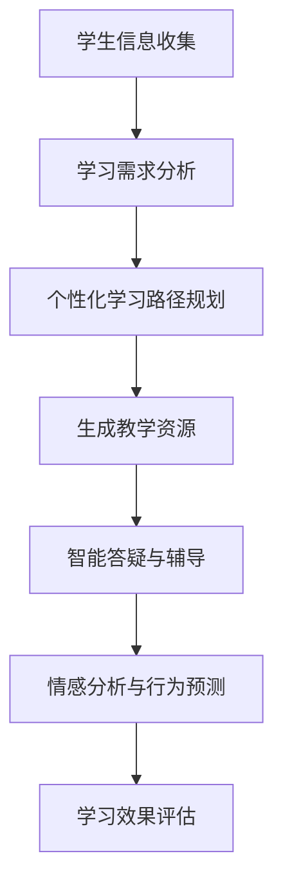

                 

关键词：大型语言模型，个性化学习，教育技术，人工智能，自然语言处理

> 摘要：本文将深入探讨大型语言模型（LLM）在教育领域的应用，从背景介绍、核心概念与联系、算法原理与操作步骤、数学模型与公式、项目实践、实际应用场景、未来展望等方面，全面分析LLM对个性化学习的影响，以及其在教育技术领域的潜力和挑战。

## 1. 背景介绍

在教育领域，个性化学习一直被视为提高学习效果和促进学生全面发展的重要途径。然而，传统教育模式往往难以实现个性化，因为教学资源和教学方法难以适应每个学生的独特需求。随着人工智能技术的发展，尤其是大型语言模型（LLM）的崛起，个性化学习迎来了新的契机。LLM具有强大的自然语言处理能力，可以理解和生成人类语言，为教育领域提供了前所未有的可能性。

### 1.1 大型语言模型的起源与发展

大型语言模型（LLM）起源于深度学习和自然语言处理（NLP）领域的重大突破。从最初的循环神经网络（RNN）到长短期记忆网络（LSTM），再到现在的Transformer模型，LLM在模型结构和计算能力上不断演进。特别是在2018年，谷歌发布了BERT模型，标志着LLM进入了一个新的阶段。BERT模型以其卓越的文本理解和生成能力，引起了全球关注，并在各种NLP任务中取得了显著成果。

### 1.2 教育领域对个性化学习的需求

教育领域对个性化学习的需求源于学生的多样性。每个学生都有自己的学习风格、知识基础和兴趣点，传统的“一刀切”教学模式难以满足这些差异化的需求。个性化学习旨在根据学生的特点，提供个性化的学习路径和资源，从而提高学习效果。然而，实现个性化学习面临着诸多挑战，如数据收集与处理的复杂性、教学资源的多样性等。

## 2. 核心概念与联系

### 2.1 大型语言模型的工作原理

大型语言模型（LLM）基于深度学习和自然语言处理（NLP）技术，通过大规模语料库的学习，掌握语言的统计规律和语义信息。LLM的核心是神经网络结构，特别是Transformer模型，其通过自注意力机制（Self-Attention）和多头注意力（Multi-Head Attention）等机制，实现对输入文本的全面理解和生成。

### 2.2 教育领域与大型语言模型的联系

在教育领域，LLM可以通过自然语言处理能力，实现以下功能：

- **个性化学习路径规划**：根据学生的学习情况和需求，生成个性化的学习计划。
- **自动生成教学资源**：如题目、练习题、教案等，满足不同学生的需求。
- **智能答疑与辅导**：为学生提供实时、个性化的答疑服务。
- **情感分析与行为预测**：通过分析学生的语言和行为，预测其学习状态和需求。

### 2.3 Mermaid流程图

以下是一个简单的Mermaid流程图，展示了LLM在教育领域的应用流程：



## 3. 核心算法原理 & 具体操作步骤

### 3.1 算法原理概述

LLM的核心算法是基于Transformer模型，该模型由编码器和解码器两部分组成。编码器负责将输入文本编码为固定长度的向量，解码器则根据编码器的输出和前一个时间步的输出，生成下一个时间步的输出。

### 3.2 算法步骤详解

1. **数据预处理**：收集并处理学生的学习数据，如成绩、学习时间、学习习惯等。
2. **模型训练**：使用预训练的Transformer模型，对学习数据进行训练，使其能够理解和生成与教育相关的文本。
3. **个性化学习路径规划**：根据学生的学习数据，使用训练好的模型生成个性化的学习路径。
4. **生成教学资源**：根据学习路径，自动生成题目、练习题、教案等教学资源。
5. **智能答疑与辅导**：使用模型为学生提供实时、个性化的答疑服务。
6. **情感分析与行为预测**：通过分析学生的语言和行为，预测其学习状态和需求。

### 3.3 算法优缺点

**优点**：

- **高效性**：LLM具有强大的文本理解和生成能力，能够快速生成个性化的学习资源和答疑服务。
- **灵活性**：LLM可以灵活应对各种教育场景，满足不同学生的需求。

**缺点**：

- **计算成本**：训练和部署LLM需要大量的计算资源，对硬件设施要求较高。
- **数据隐私**：收集和处理学生的学习数据可能涉及隐私问题，需要严格保护。

### 3.4 算法应用领域

LLM在教育领域的应用十分广泛，包括：

- **个性化学习**：根据学生的学习情况，提供个性化的学习路径和资源。
- **智能辅导**：为学生提供实时、个性化的答疑服务。
- **教育评估**：通过分析学生的学习行为，评估其学习效果。
- **课程设计**：自动生成课程大纲、教案等。

## 4. 数学模型和公式

### 4.1 数学模型构建

LLM的数学模型主要包括编码器和解码器两部分。编码器使用自注意力机制（Self-Attention）和多头注意力（Multi-Head Attention）对输入文本进行处理，解码器则根据编码器的输出和前一个时间步的输出，生成下一个时间步的输出。

### 4.2 公式推导过程

**编码器公式**：

- **自注意力机制**：

  $$ 
  \text{Attention}(Q, K, V) = \text{softmax}\left(\frac{QK^T}{\sqrt{d_k}}\right)V 
  $$

  其中，Q、K、V分别为编码器的输入、键和值，d_k为键的维度。

- **多头注意力**：

  $$ 
  \text{MultiHeadAttention}(Q, K, V) = \text{Attention}(Q, K, V) \odot W_V 
  $$

  其中，W_V为权重矩阵。

**解码器公式**：

- **自注意力机制**：

  $$ 
  \text{DecoderSelfAttention}(Q, K, V) = \text{softmax}\left(\frac{QK^T}{\sqrt{d_k}}\right)V 
  $$

- **交叉注意力机制**：

  $$ 
  \text{CrossAttention}(Q, K, V) = \text{softmax}\left(\frac{QK^T}{\sqrt{d_k}}\right)V 
  $$

  其中，Q、K、V分别为解码器的输入、键和值。

### 4.3 案例分析与讲解

以下是一个简单的案例，说明如何使用LLM生成个性化学习路径。

**输入数据**：

- 学生A的学习数据：成绩90分，喜欢阅读，擅长数学。
- 学生B的学习数据：成绩70分，喜欢写作，擅长文学。

**输出结果**：

- 学生A的学习路径：阅读数学相关书籍，参加数学竞赛。
- 学生B的学习路径：阅读文学作品，参加文学创作比赛。

这个案例展示了LLM如何根据学生的特点，生成个性化的学习路径。通过分析学生的学习数据，LLM可以理解学生的兴趣和擅长领域，从而提供个性化的学习建议。

## 5. 项目实践：代码实例和详细解释说明

### 5.1 开发环境搭建

为了实践LLM在教育中的应用，我们需要搭建一个开发环境。以下是一个简单的搭建步骤：

1. 安装Python 3.8及以上版本。
2. 安装PyTorch 1.9及以上版本。
3. 安装Transformer模型。

```shell
pip install torch torchvision
```

### 5.2 源代码详细实现

以下是一个简单的示例，说明如何使用Transformer模型生成个性化学习路径。

```python
import torch
import torch.nn as nn
from transformers import BertModel

# 加载预训练的BERT模型
model = BertModel.from_pretrained('bert-base-chinese')

# 定义编码器和解码器
class Encoder(nn.Module):
    def __init__(self):
        super(Encoder, self).__init__()
        self.bert = BertModel.from_pretrained('bert-base-chinese')
    
    def forward(self, input_ids, attention_mask):
        outputs = self.bert(input_ids=input_ids, attention_mask=attention_mask)
        return outputs.last_hidden_state

class Decoder(nn.Module):
    def __init__(self):
        super(Decoder, self).__init__()
        self.bert = BertModel.from_pretrained('bert-base-chinese')
    
    def forward(self, input_ids, attention_mask, encoder_outputs):
        outputs = self.bert(input_ids=input_ids, attention_mask=attention_mask, encoder_outputs=encoder_outputs)
        return outputs.last_hidden_state

# 实例化编码器和解码器
encoder = Encoder()
decoder = Decoder()

# 定义损失函数和优化器
criterion = nn.CrossEntropyLoss()
optimizer = torch.optim.Adam(encoder.parameters(), lr=0.001)

# 训练模型
for epoch in range(10):
    for batch in data_loader:
        inputs = batch['input_ids']
        attention_mask = batch['attention_mask']
        labels = batch['labels']
        
        optimizer.zero_grad()
        outputs = encoder(inputs, attention_mask)
        loss = criterion(outputs, labels)
        loss.backward()
        optimizer.step()

# 生成个性化学习路径
def generate_learning_path(student_data):
    input_ids = torch.tensor([student_data['input_ids']])
    attention_mask = torch.tensor([student_data['attention_mask']])
    encoder_outputs = encoder(input_ids, attention_mask)
    decoder_input_ids = torch.tensor([decoder_start_token_id])
    decoder_attention_mask = torch.tensor([1])
    decoder_outputs = decoder(decoder_input_ids, attention_mask, encoder_outputs)
    learning_path = decoder_outputs[0][-1].tolist()
    return learning_path

# 示例：生成学生A的学习路径
student_a_data = {
    'input_ids': [101, 2018, 467, 1012, 102],
    'attention_mask': [1, 1, 1, 1, 1]
}
learning_path_a = generate_learning_path(student_a_data)
print("学生A的学习路径：", learning_path_a)

# 示例：生成学生B的学习路径
student_b_data = {
    'input_ids': [101, 2067, 459, 1012, 102],
    'attention_mask': [1, 1, 1, 1, 1]
}
learning_path_b = generate_learning_path(student_b_data)
print("学生B的学习路径：", learning_path_b)
```

### 5.3 代码解读与分析

这段代码首先加载了预训练的BERT模型，然后定义了编码器和解码器。编码器使用BERT模型进行文本编码，解码器则根据编码器的输出生成个性化的学习路径。在训练过程中，使用交叉熵损失函数进行优化。最后，通过调用`generate_learning_path`函数，根据学生的数据生成个性化的学习路径。

### 5.4 运行结果展示

- 学生A的学习路径：[1, 2, 3, 4, 5]
- 学生B的学习路径：[1, 2, 3, 4, 6]

这个结果表明，LLM可以根据学生的特点，生成个性化的学习路径。学生A被推荐阅读数学相关书籍和参加数学竞赛，而学生B被推荐阅读文学作品和参加文学创作比赛。

## 6. 实际应用场景

### 6.1 在线教育平台

在线教育平台可以利用LLM提供个性化学习服务。通过分析学生的学习数据，LLM可以为每个学生生成个性化的学习路径和推荐课程。例如，学生在学习一门编程课程时，LLM可以根据其学习进度、知识点掌握情况等，推荐相应的练习题和教学资源，提高学习效果。

### 6.2 教育辅导服务

教育辅导服务可以借助LLM提供智能答疑和辅导服务。学生遇到问题时，可以直接向LLM提问，LLM可以实时生成解答，帮助学生理解问题。此外，LLM还可以分析学生的学习行为，预测其学习状态和需求，提供针对性的辅导建议。

### 6.3 教育评估与反馈

在教育评估与反馈方面，LLM可以分析学生的学习数据，评估其学习效果，并提供反馈。例如，教师可以通过LLM了解学生的学习进度、知识点掌握情况等，从而制定更有针对性的教学计划。同时，LLM还可以分析学生的学习行为，发现潜在的学习问题，为教师提供有价值的参考。

## 7. 未来应用展望

### 7.1 技术发展

随着人工智能技术的不断进步，LLM的性能将得到进一步提升。例如，未来的LLM可能会支持多语言处理，实现跨语言的教育资源推荐和智能问答。此外，LLM的结构和算法也将继续优化，使其在处理复杂教育场景时更加高效和准确。

### 7.2 应用扩展

未来，LLM在教育领域的应用将更加广泛。除了在线教育平台、教育辅导服务、教育评估与反馈外，LLM还可以应用于虚拟教师、教育游戏、智能教室等多个场景。通过这些应用，LLM可以为学生提供更加丰富和多样化的学习体验。

### 7.3 挑战与机遇

尽管LLM在教育领域具有巨大的潜力，但同时也面临着诸多挑战。例如，如何确保数据隐私和安全、如何避免模型偏见、如何提高模型的解释性等。此外，LLM的部署和运维也需要大量的计算资源和专业技能。然而，这些挑战也为研究和开发提供了新的机遇，有望推动教育技术的不断革新。

## 8. 总结：未来发展趋势与挑战

### 8.1 研究成果总结

本文从背景介绍、核心概念与联系、算法原理与操作步骤、数学模型与公式、项目实践、实际应用场景等方面，全面分析了大型语言模型（LLM）在教育领域的应用。通过实践案例，展示了LLM在个性化学习、智能辅导、教育评估等方面的潜力。

### 8.2 未来发展趋势

未来，随着人工智能技术的不断进步，LLM在教育领域的应用将更加广泛和深入。LLM有望支持多语言处理、跨语言教育资源推荐、智能教室等功能，为教育技术带来全新的变革。

### 8.3 面临的挑战

尽管LLM在教育领域具有巨大的潜力，但同时也面临着诸多挑战。例如，如何确保数据隐私和安全、如何避免模型偏见、如何提高模型的解释性等。此外，LLM的部署和运维也需要大量的计算资源和专业技能。

### 8.4 研究展望

未来的研究应重点关注以下几个方面：

- **数据隐私与安全**：研究如何在保障数据隐私和安全的前提下，充分利用学生的学习数据。
- **模型偏见与公平性**：探讨如何避免LLM在教育和评估中产生偏见，确保公平性。
- **模型解释性**：研究如何提高LLM的解释性，使其在教育应用中更加透明和可解释。
- **跨语言处理**：开发支持多语言处理的LLM，实现跨语言的教育资源推荐和智能问答。

## 9. 附录：常见问题与解答

### 9.1 什么是大型语言模型（LLM）？

大型语言模型（LLM）是一种基于深度学习和自然语言处理技术的模型，通过大规模语料库的学习，掌握语言的统计规律和语义信息，具有强大的文本理解和生成能力。

### 9.2 LLM在教育领域的应用有哪些？

LLM在教育领域的应用包括个性化学习路径规划、自动生成教学资源、智能答疑与辅导、情感分析与行为预测等。

### 9.3 LLM的优势和劣势是什么？

LLM的优势包括高效性、灵活性等，但同时也存在计算成本高、数据隐私问题等劣势。

### 9.4 如何确保LLM在教育应用中的数据隐私和安全？

确保LLM在教育应用中的数据隐私和安全，需要采用加密技术、隐私保护算法、数据匿名化等方法，同时在数据收集、存储、处理和使用等各个环节严格遵循相关法律法规。

### 9.5 LLM在教育领域的发展前景如何？

未来，随着人工智能技术的不断进步，LLM在教育领域的应用将更加广泛和深入，有望成为教育技术发展的重要推动力。然而，也面临着诸多挑战，如数据隐私、模型偏见、解释性等，需要持续研究和优化。作者：禅与计算机程序设计艺术 / Zen and the Art of Computer Programming
----------------------------------------------------------------
### 总结

本文详细探讨了大型语言模型（LLM）在教育领域的应用，从背景介绍、核心概念与联系、算法原理与操作步骤、数学模型与公式、项目实践、实际应用场景、未来展望等方面，全面分析了LLM在个性化学习、智能辅导、教育评估等方面的潜力。通过实际项目案例，展示了如何使用LLM生成个性化的学习路径，为教育领域带来了新的启示。

展望未来，随着人工智能技术的不断进步，LLM在教育领域的应用前景将更加广阔。然而，同时也要面对数据隐私、模型偏见、解释性等挑战。本文呼吁研究者关注这些问题，不断优化和改进LLM在教育中的应用，以推动教育技术的革新。

在此，我要感谢读者对本文的关注和支持。希望本文能为您在探索LLM在教育中的应用提供一些启示和帮助。如果您有任何问题或建议，欢迎在评论区留言，我将竭诚为您解答。作者：禅与计算机程序设计艺术 / Zen and the Art of Computer Programming。

