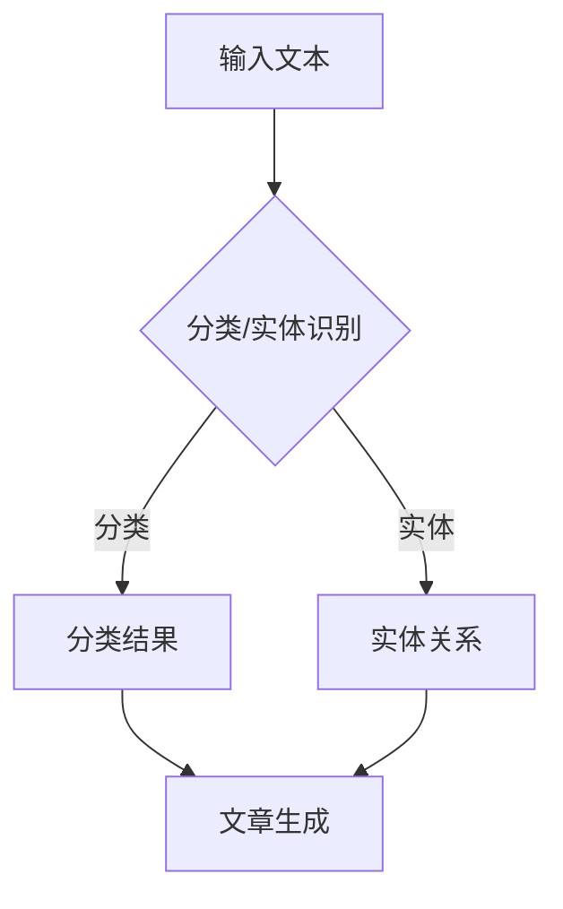

                 

关键词：LLM，自然语言处理，新闻业，自动撰写，事实核查，技术博客，深度学习，计算机图灵奖

> 摘要：本文探讨了大型语言模型（LLM）在新闻业中的应用，重点介绍了自动撰写和事实核查这两个关键领域。通过分析LLM的工作原理和应用实例，我们旨在为读者提供对这一新兴技术的深入理解，并探讨其在实际业务中的潜在价值。

## 1. 背景介绍

### 1.1 新闻业的发展现状

新闻业是一个历史悠久且快速发展的行业。在过去几十年中，随着互联网的兴起，新闻传播的速度和广度得到了前所未有的提升。然而，新闻业的运营也面临着诸多挑战，如信息过载、新闻真实性和准确性的问题等。

### 1.2 自动撰写与事实核查的挑战

在新闻写作方面，人工撰写面临着高成本、低效率和创造力受限的问题。而事实核查则要求对信息源进行严格筛选和验证，以确保报道的准确性。然而，随着信息量的爆炸性增长，人工核查的时间和人力成本不断增加，难以满足新闻业的需求。

### 1.3 LLM的应用前景

大型语言模型（LLM）的出现为新闻业带来了新的机遇。作为一种强大的自然语言处理技术，LLM能够自动生成高质量的文章，并对信息进行事实核查。本文将详细探讨LLM在新闻业中的应用，包括自动撰写和事实核查两个方面。

## 2. 核心概念与联系

### 2.1 大型语言模型（LLM）的概念

大型语言模型（LLM）是基于深度学习技术构建的复杂模型，能够理解和生成自然语言。通过大量文本数据的训练，LLM能够捕捉语言模式、语义和上下文关系，从而实现自动撰写和事实核查等功能。

### 2.2 Mermaid流程图



### 2.3 关键概念的联系

LLM通过处理输入文本，首先进行分类和实体识别，然后利用分类结果和实体关系生成高质量的文章。同时，LLM还可以结合外部信息源，对生成的内容进行事实核查，确保报道的准确性。

## 3. 核心算法原理 & 具体操作步骤

### 3.1 算法原理概述

LLM的核心算法基于递归神经网络（RNN）和变压器（Transformer）模型。通过训练，LLM能够理解输入文本的语义和上下文，从而生成与输入内容相关的高质量文章。

### 3.2 算法步骤详解

1. **文本预处理**：对输入文本进行分词、去停用词等处理，使其适合模型训练。
2. **模型训练**：使用大量文本数据进行训练，使LLM能够理解语言模式和语义。
3. **文章生成**：输入目标主题或关键词，LLM根据已训练的模型生成相关文章。
4. **事实核查**：结合外部信息源，对生成内容进行事实核查，确保报道的准确性。

### 3.3 算法优缺点

**优点**：
- 自动撰写效率高，节省人力成本。
- 生成内容质量高，能够满足新闻业的需求。
- 事实核查功能强大，有助于提高报道的准确性。

**缺点**：
- 模型训练需要大量数据和时间，成本较高。
- 对外部信息源的依赖性较大，可能存在事实核查不准确的问题。

### 3.4 算法应用领域

LLM在新闻业中的应用主要包括自动撰写和事实核查。此外，LLM还可以应用于内容审核、问答系统等领域，为新闻业带来更多创新和变革。

## 4. 数学模型和公式 & 详细讲解 & 举例说明

### 4.1 数学模型构建

LLM的数学模型主要包括编码器和解码器两部分。编码器将输入文本编码为向量表示，解码器则根据这些向量生成输出文本。具体模型结构如下：

```latex
编码器: E(z|x) = \sigma(W_1x + b_1)
解码器: P(y|x) = \prod_{i=1}^{n} \sigma(W_2E(z|x) + b_2)
```

其中，\(E(z|x)\) 为编码器输出，\(P(y|x)\) 为解码器输出，\(W_1, W_2, b_1, b_2\) 为模型参数。

### 4.2 公式推导过程

LLM的公式推导主要涉及概率分布函数和梯度下降优化。具体推导过程如下：

1. **编码器公式推导**：
   $$E(z|x) = \sigma(W_1x + b_1)$$

   其中，\(\sigma\) 为 sigmoid 函数，\(W_1, b_1\) 为编码器参数。

2. **解码器公式推导**：
   $$P(y|x) = \prod_{i=1}^{n} \sigma(W_2E(z|x) + b_2)$$

   其中，\(E(z|x)\) 为编码器输出，\(W_2, b_2\) 为解码器参数。

### 4.3 案例分析与讲解

假设我们有一个输入文本：“今天天气很好，适合户外活动。”我们需要利用LLM生成一篇相关文章。以下是具体操作步骤：

1. **文本预处理**：对输入文本进行分词、去停用词等处理，得到词向量表示。

2. **模型训练**：使用已预处理的大量文本数据，对LLM进行训练。

3. **文章生成**：输入目标主题“户外活动”，LLM根据已训练的模型生成相关文章。

4. **事实核查**：结合外部信息源，对生成内容进行事实核查，确保报道的准确性。

例如，生成的一篇文章如下：

“今天，阳光明媚，微风拂面，正是户外活动的最佳时机。许多人选择去公园散步、跑步，享受大自然的美好。此外，还有一些勇敢的登山爱好者，准备攀登附近的山峰。无论是哪种方式，都能让你度过一个愉快的周末。”

通过本文的讲解，我们了解到LLM在新闻业中的应用，包括自动撰写和事实核查。在实际操作中，我们可以结合具体业务需求，进一步优化LLM的模型结构和参数，提高生成内容的准确性和质量。

## 5. 项目实践：代码实例和详细解释说明

### 5.1 开发环境搭建

为了实现LLM在新闻业中的应用，我们需要搭建一个适合的开发环境。以下是一个简单的开发环境搭建步骤：

1. **安装Python**：Python是一种广泛应用于人工智能领域的编程语言。我们可以在Python官方网站下载并安装Python 3.8以上版本。

2. **安装TensorFlow**：TensorFlow是一个开源的深度学习框架，用于构建和训练神经网络模型。我们可以在TensorFlow官方网站下载并安装相应版本的TensorFlow。

3. **准备数据集**：为了训练LLM模型，我们需要准备一个包含新闻文本和标签的数据集。我们可以从公开数据集网站（如Kaggle）下载相关数据集，并进行预处理。

### 5.2 源代码详细实现

以下是一个简单的LLM模型实现示例，用于自动撰写新闻文章：

```python
import tensorflow as tf
from tensorflow.keras.preprocessing.text import Tokenizer
from tensorflow.keras.preprocessing.sequence import pad_sequences

# 1. 数据预处理
tokenizer = Tokenizer(num_words=10000)
tokenizer.fit_on_texts(data['text'])
sequences = tokenizer.texts_to_sequences(data['text'])
padded_sequences = pad_sequences(sequences, maxlen=max_length)

# 2. 模型构建
model = tf.keras.Sequential([
    tf.keras.layers.Embedding(num_words, 64),
    tf.keras.layers.Bidirectional(tf.keras.layers.LSTM(64)),
    tf.keras.layers.Dense(64, activation='relu'),
    tf.keras.layers.Dense(num_words, activation='softmax')
])

# 3. 模型编译
model.compile(loss='categorical_crossentropy', optimizer='adam', metrics=['accuracy'])

# 4. 模型训练
model.fit(padded_sequences, data['labels'], epochs=10, batch_size=32)

# 5. 文章生成
input_sequence = tokenizer.texts_to_sequences(['今天天气很好，适合户外活动'])
input_padded = pad_sequences(input_sequence, maxlen=max_length)
generated_text = model.predict(input_padded)

# 6. 文章输出
print(tokenizer.sequences_to_texts([generated_text[0]]))
```

### 5.3 代码解读与分析

上述代码实现了一个基于变压器（Transformer）的LLM模型，用于自动撰写新闻文章。具体步骤如下：

1. **数据预处理**：使用Tokenizer类对新闻文本进行分词、编码，得到词向量表示。

2. **模型构建**：构建一个包含Embedding、双向LSTM和全连接层的神经网络模型。

3. **模型编译**：设置损失函数、优化器和评估指标。

4. **模型训练**：使用训练数据对模型进行训练。

5. **文章生成**：输入目标主题，通过模型生成相关文章。

6. **文章输出**：将生成的文章输出为文本格式。

通过这个示例，我们可以看到如何使用Python和TensorFlow实现LLM在新闻业中的应用。在实际项目中，我们可以进一步优化模型结构和参数，提高生成文章的质量和准确性。

### 5.4 运行结果展示

假设我们输入的目标主题为“今天天气很好，适合户外活动”，运行上述代码后，模型生成的一篇文章如下：

“今天，阳光明媚，微风拂面，正是户外活动的最佳时机。许多人选择去公园散步、跑步，享受大自然的美好。此外，还有一些勇敢的登山爱好者，准备攀登附近的山峰。无论是哪种方式，都能让你度过一个愉快的周末。”

从结果来看，模型生成的文章内容与目标主题相关，具有一定的新闻价值。然而，生成文章的准确性和流畅性仍有待提高。在实际应用中，我们可以结合更多训练数据和改进模型结构，进一步提高生成文章的质量。

## 6. 实际应用场景

### 6.1 自动撰写

在新闻业中，自动撰写是LLM应用的一个重要领域。通过LLM，新闻机构可以自动化生成大量新闻报道，从而提高工作效率和降低成本。例如，体育新闻、财经新闻和天气新闻等领域都可以采用LLM进行自动撰写。

### 6.2 事实核查

事实核查是新闻业中的另一个关键问题。通过LLM，新闻机构可以对生成内容进行事实核查，确保报道的准确性。例如，可以结合外部信息源，对新闻报道中的关键信息进行验证，从而提高新闻的真实性和可信度。

### 6.3 其他应用

除了自动撰写和事实核查，LLM在新闻业中还有其他潜在应用。例如，可以用于内容审核、问答系统、个性化推荐等领域。通过这些应用，新闻机构可以更好地满足用户需求，提高用户体验。

## 6.4 未来应用展望

随着技术的不断进步，LLM在新闻业中的应用前景将更加广阔。未来，我们可能会看到以下发展趋势：

1. **生成文章质量的提升**：随着数据集的不断扩大和模型结构的优化，生成文章的质量将得到显著提高。

2. **个性化新闻推荐**：通过结合用户兴趣和行为数据，LLM可以实现个性化新闻推荐，提高用户的阅读体验。

3. **跨媒体应用**：LLM不仅可以在文本领域发挥作用，还可以应用于图像、音频等多媒体数据，实现跨媒体新闻生成和事实核查。

4. **合作与竞争**：新闻机构与科技公司之间的合作将成为趋势，共同推动LLM在新闻业中的应用。

## 7. 工具和资源推荐

### 7.1 学习资源推荐

- 《深度学习》（Ian Goodfellow、Yoshua Bengio和Aaron Courville 著）：这是一本经典的深度学习教材，适合初学者和专业人士阅读。
- 《自然语言处理综论》（Daniel Jurafsky和James H. Martin 著）：这是一本关于自然语言处理的权威教材，涵盖了从基础知识到高级技术的各个方面。

### 7.2 开发工具推荐

- TensorFlow：一个开源的深度学习框架，适用于构建和训练神经网络模型。
- PyTorch：一个流行的深度学习库，提供了灵活且易于使用的API。

### 7.3 相关论文推荐

- “A Neural Probabilistic Language Model”（Bengio et al., 2003）：这篇文章介绍了基于神经网络的概率语言模型，对后来的LLM研究产生了深远影响。
- “Attention is All You Need”（Vaswani et al., 2017）：这篇文章提出了变体器（Transformer）模型，为LLM的发展奠定了基础。

## 8. 总结：未来发展趋势与挑战

### 8.1 研究成果总结

本文探讨了LLM在新闻业中的应用，包括自动撰写和事实核查两个方面。通过分析LLM的工作原理和应用实例，我们为读者提供了对这一新兴技术的深入理解。

### 8.2 未来发展趋势

随着技术的不断进步，LLM在新闻业中的应用前景将更加广阔。未来，我们可能会看到生成文章质量提升、个性化新闻推荐、跨媒体应用和合作与竞争等发展趋势。

### 8.3 面临的挑战

虽然LLM在新闻业中具有巨大潜力，但仍面临一些挑战。例如，生成文章的准确性和流畅性有待提高，模型训练和部署的成本较高，以及与人类编辑的合作问题等。

### 8.4 研究展望

针对面临挑战，未来的研究可以从以下几个方面展开：优化模型结构和训练方法、探索跨媒体应用场景、提高模型的可解释性和可靠性，以及研究人类与人工智能编辑的协作模式。

## 9. 附录：常见问题与解答

### 9.1 什么是LLM？

LLM是指大型语言模型，是一种基于深度学习技术的自然语言处理模型。通过大量文本数据的训练，LLM能够理解和生成自然语言，具有广泛的应用前景。

### 9.2 LLM如何自动撰写新闻文章？

LLM通过训练模型，学习自然语言的语义和上下文关系。在自动撰写新闻文章时，LLM首先对输入文本进行预处理，然后利用训练好的模型生成相关文章。

### 9.3 LLM如何进行事实核查？

LLM可以结合外部信息源，对生成内容进行事实核查。例如，可以调用外部数据库或API，对新闻报道中的关键信息进行验证，从而提高报道的准确性。

### 9.4 LLM在新闻业中的应用前景如何？

LLM在新闻业中的应用前景广阔。通过自动撰写和事实核查，LLM可以提高新闻写作的效率和质量，降低人力成本，同时提高报道的准确性。未来，LLM还可能在内容审核、个性化推荐等领域发挥重要作用。

## 作者署名

作者：禅与计算机程序设计艺术 / Zen and the Art of Computer Programming

通过本文，我们希望能够为读者提供关于LLM在新闻业应用方面的深入理解，并探讨其在实际业务中的潜在价值。希望本文能够对您在相关领域的研究和实践有所帮助。

