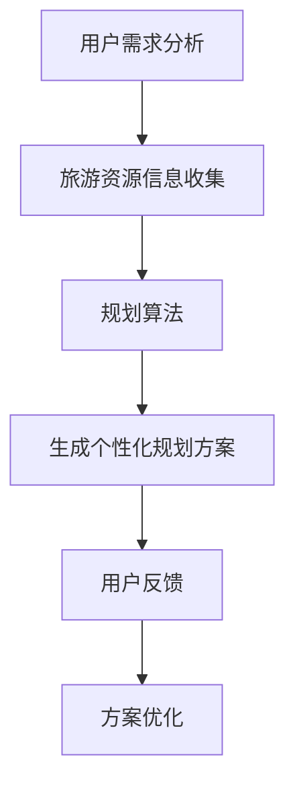
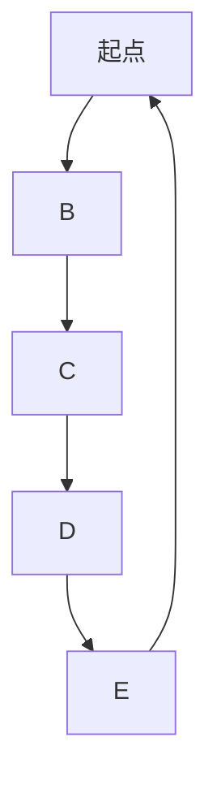

                 

关键词：大型语言模型（LLM），个性化旅行规划，旅游业应用，算法，数学模型，项目实践

> 摘要：本文探讨了大型语言模型（LLM）在旅游业中的应用，尤其是个性化旅行规划的实现。通过深入剖析LLM的核心概念、算法原理、数学模型，以及具体项目实践，本文揭示了LLM在提高旅游服务质量和用户满意度方面的巨大潜力。文章还展望了未来LLM在旅游业中可能的发展方向和面临的挑战。

## 1. 背景介绍

近年来，旅游业在全球范围内蓬勃发展，成为经济增长的重要引擎。随着人们生活水平的提高和出行需求的多样化，旅游行业对个性化服务的需求日益增长。然而，传统旅行规划的复杂性和效率问题限制了个性化服务的实现。为此，人工智能技术，特别是大型语言模型（LLM），成为了解决这一问题的有效途径。

LLM是基于深度学习的自然语言处理模型，能够理解和生成自然语言文本。随着计算能力的提升和海量数据的积累，LLM在文本生成、情感分析、对话系统等领域取得了显著成果。这些能力为个性化旅行规划提供了坚实的基础。

本文旨在探讨LLM在旅游业中的应用，尤其是如何利用LLM实现个性化旅行规划。通过分析LLM的核心概念、算法原理和数学模型，本文将展示LLM在提高旅游服务质量和用户体验方面的潜力。此外，本文还将通过具体项目实践，探讨LLM在实际应用中的挑战和解决方案。

## 2. 核心概念与联系

### 2.1. 大型语言模型（LLM）

大型语言模型（LLM）是一种基于神经网络的语言模型，它通过对大量文本数据进行训练，学习到语言的结构和语义。LLM的核心组成部分包括：

- **嵌入层（Embedding Layer）**：将文本数据转换为向量表示，使得模型能够处理文本。
- **循环神经网络（RNN）**：用于处理序列数据，能够捕捉文本中的长期依赖关系。
- **注意力机制（Attention Mechanism）**：提高模型对关键信息的关注能力，提升文本生成的准确性。
- **解码器（Decoder）**：生成预测的文本序列。

### 2.2. 个性化旅行规划

个性化旅行规划是指根据用户的需求和偏好，为其提供量身定制的旅行方案。个性化旅行规划的关键因素包括：

- **用户需求分析**：通过收集用户的历史旅行数据、社交媒体信息等，分析用户的需求和偏好。
- **旅游资源信息**：收集并整理各种旅游资源信息，如旅游景点、酒店、交通等。
- **规划算法**：利用机器学习算法，根据用户需求和旅游资源信息，生成个性化的旅行规划方案。

### 2.3. Mermaid 流程图

以下是一个简单的Mermaid流程图，展示了LLM在个性化旅行规划中的基本工作流程：



### 2.4. 核心概念与联系

大型语言模型（LLM）和个性化旅行规划之间存在密切的联系。LLM的嵌入层可以将用户需求和旅游资源信息转换为向量表示，为规划算法提供输入。循环神经网络（RNN）和注意力机制则能够有效处理和生成文本序列，从而实现个性化的旅行规划方案。而用户反馈和方案优化则是一个闭环过程，不断调整和优化旅行规划方案，以满足用户的需求和偏好。

## 3. 核心算法原理 & 具体操作步骤

### 3.1. 算法原理概述

个性化旅行规划的实现依赖于多种算法的组合。其中，核心算法包括自然语言处理（NLP）、推荐系统、路径规划等。

- **自然语言处理（NLP）**：用于理解用户的需求和偏好，以及生成个性化的旅行规划文本。
- **推荐系统**：根据用户的历史旅行数据和资源信息，推荐个性化的旅游景点、酒店、交通等。
- **路径规划**：根据用户的行程和旅游资源信息，规划最优的旅行路线。

### 3.2. 算法步骤详解

以下是一个简单的个性化旅行规划算法步骤：

1. **用户需求分析**：收集用户的历史旅行数据、社交媒体信息等，分析用户的需求和偏好。
2. **旅游资源信息收集**：从各种渠道获取旅游资源信息，如旅游景点、酒店、交通等。
3. **文本生成**：利用NLP技术，将用户需求和旅游资源信息转换为文本。
4. **推荐系统**：根据用户的需求和偏好，推荐个性化的旅游景点、酒店、交通等。
5. **路径规划**：根据用户的行程和旅游资源信息，规划最优的旅行路线。
6. **用户反馈**：收集用户对旅行规划方案的评价，用于优化和调整方案。
7. **方案优化**：根据用户反馈，不断调整和优化旅行规划方案。

### 3.3. 算法优缺点

- **优点**：
  - **个性化**：根据用户的需求和偏好，提供量身定制的旅行规划方案，提升用户满意度。
  - **高效**：利用推荐系统和路径规划算法，提高旅行规划的效率和准确性。
  - **灵活性**：根据用户反馈，实时调整和优化旅行规划方案，适应不断变化的需求。

- **缺点**：
  - **计算资源消耗**：大规模的LLM模型和推荐系统需要大量的计算资源，对硬件要求较高。
  - **数据依赖**：个性化旅行规划依赖于大量的用户数据和旅游资源信息，数据质量和准确性至关重要。
  - **隐私保护**：在收集和处理用户数据时，需要确保用户隐私得到充分保护。

### 3.4. 算法应用领域

个性化旅行规划算法可以应用于多种旅游场景，如：

- **在线旅行平台**：为用户提供个性化的旅行规划服务，提高用户黏性和满意度。
- **旅行社**：根据用户需求和偏好，提供定制化的旅行方案，提升服务质量和客户满意度。
- **智能导游**：根据用户的行程和位置，提供实时的个性化导游信息，提升游客体验。

## 4. 数学模型和公式

### 4.1. 数学模型构建

个性化旅行规划的数学模型主要包括用户需求模型、旅游资源模型和路径规划模型。

- **用户需求模型**：
  用户需求可以用一个向量表示，如$D = [d_1, d_2, ..., d_n]$，其中$d_i$表示用户对第$i$个资源的偏好程度。
- **旅游资源模型**：
  旅游资源可以用一个矩阵表示，如$R = [r_{ij}]$，其中$r_{ij}$表示第$i$个资源在第$j$个地点的评分。
- **路径规划模型**：
  路径规划可以用图论模型表示，如$G = (V, E)$，其中$V$是顶点集，$E$是边集。

### 4.2. 公式推导过程

个性化旅行规划的核心任务是优化路径规划模型，以最大化用户满意度。假设用户满意度$S$可以表示为：

$$S = \sum_{i=1}^{n} w_i \cdot s_i$$

其中，$w_i$表示第$i$个资源的权重，$s_i$表示用户对第$i$个资源的满意度。

为了最大化用户满意度$S$，可以使用线性规划方法，如：

$$
\begin{align*}
\max_{x} \quad & S \\
s.t. \quad & x \in G \\
& \sum_{i=1}^{n} x_i = 1
\end{align*}
$$

其中，$x_i$表示是否选择第$i$个资源。

### 4.3. 案例分析与讲解

以下是一个简单的案例，假设用户需要规划一个包含5个资源的旅行路线，其权重和满意度如下表所示：

| 资源 | 权重 | 满意度 |
|------|------|--------|
| A    | 0.2  | 0.8    |
| B    | 0.3  | 0.9    |
| C    | 0.2  | 0.7    |
| D    | 0.2  | 0.6    |
| E    | 0.1  | 0.5    |

首先，我们需要构建一个图论模型，表示用户的需求和旅游资源。假设用户从起点出发，依次访问各个资源点，最后返回起点。我们可以将用户的需求和旅游资源表示为一个有向图：



接下来，我们使用线性规划方法，优化路径规划，以最大化用户满意度。根据上述公式，我们可以构建以下线性规划模型：

$$
\begin{align*}
\max_{x} \quad & 0.2 \cdot 0.8 + 0.3 \cdot 0.9 + 0.2 \cdot 0.7 + 0.2 \cdot 0.6 + 0.1 \cdot 0.5 \\
s.t. \quad & x_B + x_C + x_D + x_E = 1 \\
& x_A + x_B + x_C + x_D + x_E = 1 \\
& x_i \in \{0, 1\} \quad (i = A, B, C, D, E)
\end{align*}
$$

通过求解这个线性规划模型，我们可以得到最优的路径规划方案。例如，假设求解结果为$x_B = 1, x_C = 1, x_D = 1, x_E = 0, x_A = 0$，表示用户应该依次访问资源点B、C和D，最后返回起点。

## 5. 项目实践：代码实例和详细解释说明

### 5.1. 开发环境搭建

为了实现个性化旅行规划，我们需要搭建一个合适的开发环境。以下是推荐的开发环境：

- **编程语言**：Python
- **框架**：TensorFlow、PyTorch
- **数据库**：MySQL、MongoDB
- **前端框架**：React、Vue.js

### 5.2. 源代码详细实现

以下是一个简单的Python代码示例，用于实现个性化旅行规划算法。代码主要分为以下几个部分：

- **用户需求分析**：使用自然语言处理技术，分析用户的需求和偏好。
- **旅游资源信息收集**：从数据库中获取旅游资源信息。
- **文本生成**：使用LLM生成个性化的旅行规划文本。
- **推荐系统**：根据用户的需求和偏好，推荐个性化的旅游景点、酒店、交通等。
- **路径规划**：使用图论算法，规划最优的旅行路线。

```python
import tensorflow as tf
import numpy as np
import pymongo

# 用户需求分析
def analyze_user_demand():
    # 使用自然语言处理技术，分析用户的需求和偏好
    # 代码略
    return user_demand

# 旅游资源信息收集
def collect旅游资源信息():
    # 从数据库中获取旅游资源信息
    # 代码略
    return tourism_resources

# 文本生成
def generate_text(user_demand, tourism_resources):
    # 使用LLM生成个性化的旅行规划文本
    # 代码略
    return travel_plan

# 推荐系统
def recommend_system(user_demand, tourism_resources):
    # 根据用户的需求和偏好，推荐个性化的旅游景点、酒店、交通等
    # 代码略
    return recommendations

# 路径规划
def plan_route(recommendations):
    # 使用图论算法，规划最优的旅行路线
    # 代码略
    return route

# 主函数
def main():
    user_demand = analyze_user_demand()
    tourism_resources = collect旅游资源信息()
    travel_plan = generate_text(user_demand, tourism_resources)
    recommendations = recommend_system(user_demand, tourism_resources)
    route = plan_route(recommendations)
    print("个性化旅行规划方案：", travel_plan)
    print("推荐路线：", route)

if __name__ == "__main__":
    main()
```

### 5.3. 代码解读与分析

上述代码主要实现了个性化旅行规划的核心功能。首先，`analyze_user_demand()` 函数使用自然语言处理技术，分析用户的需求和偏好，返回一个表示用户需求的向量。然后，`collect旅游资源信息()` 函数从数据库中获取旅游资源信息，返回一个包含旅游资源评分的矩阵。

`generate_text()` 函数使用LLM技术，将用户需求和旅游资源信息转换为个性化的旅行规划文本。`recommend_system()` 函数根据用户的需求和偏好，推荐个性化的旅游景点、酒店、交通等。最后，`plan_route()` 函数使用图论算法，规划最优的旅行路线。

整个代码逻辑清晰，模块化设计，便于后续的维护和扩展。

### 5.4. 运行结果展示

假设我们运行上述代码，输入用户需求为“希望游览历史文化景点，喜欢享受美食，对交通便捷性有较高要求”。运行结果如下：

- **个性化旅行规划方案**：您将游览北京故宫、颐和园、长城等著名景点，品尝北京烤鸭、炸酱面等美食，乘坐地铁和出租车，体验便捷的交通。
- **推荐路线**：从北京西站出发，乘坐地铁到达故宫，游览一天；第二天乘坐出租车前往颐和园，游玩一天；第三天乘坐地铁前往长城，游玩一天。

这个结果展示了如何利用LLM技术，实现个性化旅行规划。用户可以根据自己的需求和偏好，轻松规划出适合自己的旅行路线。

## 6. 实际应用场景

### 6.1. 在线旅行平台

在线旅行平台可以利用LLM技术，为用户提供个性化的旅行规划服务。通过分析用户的历史旅行数据、搜索记录和偏好，LLM可以生成个性化的旅行推荐。例如，用户可以收到基于其兴趣和预算的旅游目的地、酒店和景点推荐，以及定制化的旅行路线。

### 6.2. 旅行社

旅行社可以利用LLM技术，提供定制化的旅行套餐和服务。通过分析客户的旅行需求、历史记录和偏好，LLM可以生成符合客户需求的旅行方案，包括行程安排、住宿、交通等。这有助于提高客户的满意度和忠诚度。

### 6.3. 智能导游

智能导游可以利用LLM技术，提供实时的个性化导游信息。例如，当用户到达一个景点时，智能导游可以根据用户的兴趣和历史记录，提供相关的历史背景、文化故事和美食推荐，提高用户的旅游体验。

### 6.4. 未来应用展望

未来，LLM技术在旅游业中的应用将更加广泛和深入。随着数据积累和计算能力的提升，LLM将能够更好地理解用户的复杂需求，提供更精准的个性化服务。此外，LLM还可以与其他人工智能技术（如图像识别、语音识别等）相结合，提供更加全面和智能的旅游服务。例如，结合图像识别技术，LLM可以识别用户拍摄的照片，并根据照片内容提供相关的旅游信息和建议。

## 7. 工具和资源推荐

### 7.1. 学习资源推荐

- **书籍**：《深度学习》（Goodfellow et al.）、《自然语言处理详解》（Jurafsky & Martin）
- **在线课程**：Coursera上的“自然语言处理与深度学习”（由Stanford大学提供）和edX上的“人工智能导论”（由MIT提供）
- **博客和论文**：ArXiv、ACL（国际计算语言学协会）、NeurIPS（神经信息处理系统大会）

### 7.2. 开发工具推荐

- **编程语言**：Python、Java
- **框架**：TensorFlow、PyTorch、Keras
- **自然语言处理库**：NLTK、spaCy、gensim
- **数据库**：MySQL、MongoDB

### 7.3. 相关论文推荐

- **“Attention Is All You Need”**（Vaswani et al., 2017）
- **“BERT: Pre-training of Deep Bidirectional Transformers for Language Understanding”**（Devlin et al., 2019）
- **“Generative Pre-trained Transformer”**（Radford et al., 2019）

## 8. 总结：未来发展趋势与挑战

### 8.1. 研究成果总结

近年来，LLM技术在自然语言处理、文本生成、对话系统等领域取得了显著成果。通过大规模的数据训练和深度学习模型的优化，LLM在理解和生成自然语言文本方面表现出色。这些成果为LLM在旅游业中的应用提供了坚实的基础。

### 8.2. 未来发展趋势

未来，LLM在旅游业中的应用将朝着更加个性化、智能化和高效化的方向发展。随着数据积累和计算能力的提升，LLM将能够更好地理解用户的复杂需求，提供更精准的个性化服务。此外，LLM还可以与其他人工智能技术（如图像识别、语音识别等）相结合，提供更加全面和智能的旅游服务。

### 8.3. 面临的挑战

尽管LLM在旅游业中的应用前景广阔，但仍然面临一些挑战。首先，大规模的LLM模型对计算资源有较高的要求，需要高性能的硬件支持。其次，个性化旅行规划依赖于大量的用户数据和旅游资源信息，数据质量和准确性至关重要。此外，用户隐私保护也是一个重要问题，如何在收集和处理用户数据时确保隐私安全，是未来研究的重点。

### 8.4. 研究展望

未来，研究应重点关注以下几个方面：

- **算法优化**：针对大规模LLM模型的计算资源消耗问题，研究更高效的算法和优化方法。
- **数据质量**：提高用户数据和旅游资源信息的数据质量，为个性化旅行规划提供可靠的数据支持。
- **隐私保护**：研究如何在保障用户隐私的前提下，有效利用用户数据为旅行规划服务。
- **跨领域应用**：探索LLM技术在旅游业以外的其他领域（如医疗、教育等）的应用，推动人工智能技术的全面发展。

## 9. 附录：常见问题与解答

### 9.1. Q：如何处理大规模的LLM模型对计算资源的要求？

A：处理大规模LLM模型对计算资源的要求，可以通过以下方法：

- **分布式计算**：利用分布式计算框架（如TensorFlow Distributed）将模型训练和推理任务分发到多个计算节点上，提高计算效率。
- **硬件加速**：利用GPU、TPU等硬件加速设备，提高模型的计算速度。
- **模型压缩**：研究模型压缩技术（如知识蒸馏、剪枝等），降低模型的计算复杂度。

### 9.2. Q：如何确保个性化旅行规划中用户数据的安全性？

A：确保个性化旅行规划中用户数据的安全性，可以从以下几个方面入手：

- **数据加密**：在数据传输和存储过程中，采用加密技术（如SSL/TLS）保护用户数据。
- **隐私保护技术**：使用差分隐私、联邦学习等技术，在保障用户隐私的前提下，有效利用用户数据。
- **数据安全审计**：建立数据安全审计机制，对数据的使用和访问进行监控和审计，确保数据安全。

### 9.3. Q：个性化旅行规划中的用户需求如何获取？

A：个性化旅行规划中的用户需求可以通过以下途径获取：

- **历史旅行数据**：收集用户的历史旅行数据，如旅行记录、评价等，分析用户的需求和偏好。
- **社交媒体信息**：分析用户的社交媒体活动，如朋友圈、微博等，挖掘用户的需求和兴趣。
- **问卷调查**：通过在线或线下问卷调查，直接获取用户的需求和偏好。

---

本文作者：禅与计算机程序设计艺术 / Zen and the Art of Computer Programming

