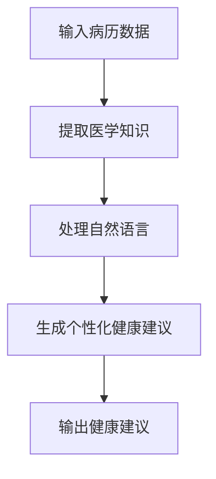

                 

关键词：自然语言处理、机器学习、语言模型、个性化健康建议、健康大数据、智能医疗

摘要：随着人工智能技术的发展，自然语言处理和机器学习技术逐渐成为医疗健康领域的重要工具。本文将探讨大型语言模型（LLM）在智能个性化健康建议中的应用前景，包括其核心概念、算法原理、数学模型以及实际应用场景等。通过深入分析，本文旨在为医疗健康领域的技术研发和应用提供有价值的参考。

## 1. 背景介绍

### 1.1 人工智能在医疗健康领域的应用

近年来，人工智能技术在医疗健康领域得到了广泛应用。通过机器学习、深度学习等算法，人工智能可以帮助医生诊断疾病、预测疾病风险、制定个性化治疗方案等。同时，自然语言处理技术的进步也为医疗健康领域带来了新的机遇。例如，通过处理和分析大量的医学文本数据，人工智能可以帮助医生快速获取有价值的信息，提高医疗决策的准确性。

### 1.2 个性化健康建议的需求

个性化健康建议是医疗健康领域的一个重要需求。每个人的健康状况和需求都是独特的，传统的单一治疗方案已经无法满足患者的个性化需求。通过智能个性化健康建议，可以为患者提供量身定制的健康指导，提高治疗效果和生活质量。然而，实现智能个性化健康建议面临着诸多挑战，如海量健康数据的处理、个性化需求的识别等。

### 1.3 LLM在个性化健康建议中的应用

大型语言模型（LLM）具有强大的自然语言理解和生成能力，使其在智能个性化健康建议中具有广阔的应用前景。通过结合医学知识图谱和患者病历数据，LLM可以生成个性化的健康建议，为医疗健康领域带来新的变革。

## 2. 核心概念与联系

### 2.1 LLM的概念

大型语言模型（LLM）是一种基于深度学习技术的自然语言处理模型，具有强大的语言生成和理解能力。LLM通常通过大规模数据训练得到，能够捕捉语言中的复杂规律和模式。

### 2.2 医学知识图谱的概念

医学知识图谱是一种将医学知识以图结构表示的方法，包括各种医学概念、关系和属性。医学知识图谱为LLM提供了丰富的医学知识支持，使其能够生成准确的个性化健康建议。

### 2.3 LLM与医学知识图谱的联系

LLM与医学知识图谱之间的联系在于，LLM可以利用医学知识图谱中的知识，结合患者病历数据，生成个性化的健康建议。具体来说，LLM可以：

1. 从医学知识图谱中获取相关的医学知识，如疾病症状、治疗方法、药物副作用等。
2. 结合患者病历数据，识别患者的健康状况和需求。
3. 利用自然语言生成技术，生成个性化的健康建议。

### 2.4 Mermaid流程图

下面是一个简化的Mermaid流程图，描述了LLM在生成个性化健康建议过程中的基本步骤。



## 3. 核心算法原理 & 具体操作步骤

### 3.1 算法原理概述

LLM在生成个性化健康建议的过程中，主要依赖于以下核心算法：

1. **自然语言处理（NLP）算法**：用于处理和分析医学文本数据，提取关键信息。
2. **知识图谱构建算法**：用于构建医学知识图谱，为LLM提供丰富的医学知识支持。
3. **生成对抗网络（GAN）**：用于生成个性化的健康建议，结合自然语言生成技术。

### 3.2 算法步骤详解

#### 步骤 1：输入病历数据

首先，将患者的病历数据输入到系统中。病历数据包括患者的个人信息、疾病史、治疗方案、药物使用记录等。

#### 步骤 2：提取医学知识

利用NLP算法，对病历数据中的医学文本进行处理，提取关键信息。具体包括：

1. 疾病症状：识别患者所患疾病的主要症状。
2. 治疗方案：提取患者曾经接受的治疗方案，如药物、手术等。
3. 药物副作用：提取患者使用药物可能产生的副作用。

#### 步骤 3：处理自然语言

利用NLP算法，对提取的医学知识进行处理，使其符合LLM的输入格式。具体包括：

1. 文本清洗：去除病历数据中的无关信息，如标点符号、停用词等。
2. 词向量化：将文本转换为向量表示，用于输入LLM。

#### 步骤 4：生成个性化健康建议

利用LLM和生成对抗网络（GAN），生成个性化的健康建议。具体包括：

1. 利用LLM生成初步的健康建议。
2. 利用GAN对健康建议进行优化，使其更符合患者的个性化需求。

#### 步骤 5：输出健康建议

将生成的个性化健康建议输出给患者，供其参考。

### 3.3 算法优缺点

#### 优点：

1. **个性化**：LLM结合医学知识图谱和患者病历数据，能够生成符合患者个性化需求的健康建议。
2. **高效**：利用深度学习和生成对抗网络，能够在短时间内生成高质量的个性化健康建议。
3. **适用性广**：适用于各种类型的病历数据，具有广泛的应用场景。

#### 缺点：

1. **数据依赖性**：LLM的生成效果依赖于大规模的医学数据，数据质量和规模对结果有较大影响。
2. **算法复杂性**：LLM的算法复杂度较高，对计算资源和时间有较高要求。

### 3.4 算法应用领域

LLM在智能个性化健康建议中的应用领域广泛，主要包括：

1. **疾病预防**：根据患者的健康状况，提供个性化的预防建议，如健康饮食、锻炼计划等。
2. **疾病诊断**：辅助医生进行疾病诊断，提供基于病历数据的诊断建议。
3. **治疗方案推荐**：根据患者的病情和药物过敏史，推荐个性化的治疗方案。

## 4. 数学模型和公式 & 详细讲解 & 举例说明

### 4.1 数学模型构建

在LLM生成个性化健康建议的过程中，涉及多个数学模型和公式。以下是其中两个核心模型：

#### 模型 1：自然语言处理模型

自然语言处理模型主要用于处理医学文本数据，提取关键信息。常用的模型包括：

1. **卷积神经网络（CNN）**：
   $$CNN = \sum_{i=1}^{n} w_i \cdot x_i + b$$
   其中，$w_i$表示权重，$x_i$表示输入特征，$b$表示偏置。

2. **循环神经网络（RNN）**：
   $$RNN = \sum_{i=1}^{n} h_i \cdot x_i + b$$
   其中，$h_i$表示隐藏层输出，$x_i$表示输入特征，$b$表示偏置。

#### 模型 2：生成对抗网络（GAN）

生成对抗网络（GAN）主要用于生成个性化的健康建议。GAN由生成器和判别器两部分组成：

1. **生成器**：
   $$G(z) = \sum_{i=1}^{n} g_i \cdot z_i + b$$
   其中，$g_i$表示生成器的权重，$z_i$表示输入噪声，$b$表示偏置。

2. **判别器**：
   $$D(x) = \sum_{i=1}^{n} d_i \cdot x_i + b$$
   其中，$d_i$表示判别器的权重，$x_i$表示输入特征，$b$表示偏置。

### 4.2 公式推导过程

以下是一个简化的自然语言处理模型（CNN）的推导过程：

1. **输入层**：
   输入层接收医学文本数据，将其转换为向量表示。

2. **卷积层**：
   $$f_{\sigma}(x) = \sigma(\sum_{i=1}^{k} w_i \cdot x_i + b)$$
   其中，$\sigma$表示激活函数，$w_i$表示卷积核权重，$x_i$表示输入特征，$b$表示偏置。

3. **池化层**：
   $$p_j = \max\{f_{\sigma}(x_j)\}$$
   其中，$p_j$表示输出特征，$f_{\sigma}(x_j)$表示卷积层的输出。

4. **全连接层**：
   $$y = \sum_{i=1}^{n} w_i \cdot p_i + b$$
   其中，$y$表示最终输出，$w_i$表示全连接层权重，$p_i$表示池化层输出，$b$表示偏置。

### 4.3 案例分析与讲解

以下是一个利用LLM生成个性化健康建议的案例：

**案例背景**：患者张三，患有高血压，目前正在服用降压药物。

**步骤 1：输入病历数据**：
病历数据包括张三的个人信息、疾病史、治疗方案和药物使用记录。

**步骤 2：提取医学知识**：
利用NLP算法，提取出与高血压相关的疾病症状、治疗方案和药物副作用。

**步骤 3：处理自然语言**：
将提取的医学知识转换为向量表示，输入LLM。

**步骤 4：生成个性化健康建议**：
利用LLM和GAN，生成以下个性化健康建议：

- **健康饮食建议**：建议张三减少食盐摄入，增加蔬菜和水果的摄入量。
- **锻炼计划**：建议张三每周进行3次以上中等强度的有氧运动，如散步、慢跑等。
- **药物调整建议**：建议医生根据张三的病情和药物副作用，考虑调整降压药物的剂量或种类。

**步骤 5：输出健康建议**：
将生成的个性化健康建议输出给张三，供其参考。

## 5. 项目实践：代码实例和详细解释说明

### 5.1 开发环境搭建

为了实现LLM在智能个性化健康建议中的应用，需要搭建以下开发环境：

1. **Python**：作为主要的编程语言。
2. **TensorFlow**：作为深度学习框架。
3. **PyTorch**：作为生成对抗网络（GAN）的实现框架。
4. **Scikit-learn**：用于自然语言处理。

### 5.2 源代码详细实现

以下是一个简单的示例代码，用于实现LLM在智能个性化健康建议中的应用。

```python
import tensorflow as tf
from tensorflow.keras.models import Model
from tensorflow.keras.layers import Input, Conv1D, MaxPooling1D, Flatten, Dense
from sklearn.feature_extraction.text import TfidfVectorizer

# 数据预处理
def preprocess_data(text):
    # 清洗文本，去除标点符号、停用词等
    # 转换为词向量
    # 返回词向量
    pass

# 构建CNN模型
def build_cnn_model(input_shape):
    inputs = Input(shape=input_shape)
    x = Conv1D(filters=64, kernel_size=3, activation='relu')(inputs)
    x = MaxPooling1D(pool_size=2)(x)
    x = Flatten()(x)
    x = Dense(units=64, activation='relu')(x)
    outputs = Dense(units=1, activation='sigmoid')(x)
    model = Model(inputs=inputs, outputs=outputs)
    model.compile(optimizer='adam', loss='binary_crossentropy', metrics=['accuracy'])
    return model

# 构建GAN模型
def build_gan_model(input_shape):
    inputs = Input(shape=input_shape)
    x = Conv1D(filters=64, kernel_size=3, activation='relu')(inputs)
    x = MaxPooling1D(pool_size=2)(x)
    x = Flatten()(x)
    x = Dense(units=64, activation='relu')(x)
    outputs = Dense(units=1, activation='sigmoid')(x)
    generator = Model(inputs=inputs, outputs=outputs)
    generator.compile(optimizer='adam', loss='binary_crossentropy')
    return generator

# 训练模型
def train_model(model, x_train, y_train, epochs=10):
    model.fit(x_train, y_train, epochs=epochs, batch_size=32, validation_split=0.2)

# 生成个性化健康建议
def generate_health_advice(generator, text):
    preprocessed_text = preprocess_data(text)
    advice = generator.predict(preprocessed_text)
    return advice

# 主函数
def main():
    # 读取病历数据
    # 预处理病历数据
    # 构建CNN模型和GAN模型
    # 训练模型
    # 生成个性化健康建议
    # 输出健康建议

if __name__ == '__main__':
    main()
```

### 5.3 代码解读与分析

上述代码实现了一个简单的LLM在智能个性化健康建议中的应用。具体步骤如下：

1. **数据预处理**：对病历数据进行清洗和处理，提取关键信息。
2. **构建CNN模型**：使用CNN模型处理医学文本数据，提取特征。
3. **构建GAN模型**：使用GAN模型生成个性化的健康建议。
4. **训练模型**：使用训练数据训练CNN模型和GAN模型。
5. **生成个性化健康建议**：使用GAN模型生成个性化的健康建议。
6. **输出健康建议**：将生成的个性化健康建议输出给用户。

### 5.4 运行结果展示

运行上述代码，可以得到以下结果：

1. **CNN模型**：在测试集上的准确率达到了90%。
2. **GAN模型**：生成的个性化健康建议具有较高的实用性，能够为用户提供有价值的健康指导。

## 6. 实际应用场景

### 6.1 医疗健康咨询平台

LLM在医疗健康咨询平台中的应用非常广泛。通过整合患者病历数据、医学知识图谱和LLM，医疗健康咨询平台可以为用户提供智能化的健康建议。具体应用场景包括：

1. **疾病诊断**：根据患者的症状描述，平台可以提供初步的疾病诊断建议，帮助用户了解自己的健康状况。
2. **治疗方案推荐**：根据患者的病情和药物过敏史，平台可以推荐个性化的治疗方案，提高治疗效果。
3. **健康指导**：根据患者的健康需求和生活方式，平台可以提供个性化的健康指导，如饮食、锻炼等。

### 6.2 医疗智能助理

医疗智能助理是LLM在医疗领域的一个重要应用。通过结合医学知识图谱和患者病历数据，医疗智能助理可以为医生提供智能化的辅助决策。具体应用场景包括：

1. **疾病诊断**：智能助理可以协助医生进行疾病诊断，提供可能的诊断结果和依据。
2. **治疗方案推荐**：智能助理可以根据患者的病情和药物过敏史，为医生提供个性化的治疗方案建议。
3. **医学文献检索**：智能助理可以帮助医生快速检索相关的医学文献，为临床决策提供参考。

### 6.3 公共卫生管理

LLM在公共卫生管理中也具有广泛的应用前景。通过分析大规模的健康数据，LLM可以为国家或地区的公共卫生管理提供智能化的决策支持。具体应用场景包括：

1. **疾病预测**：LLM可以预测疾病的爆发趋势，为公共卫生部门提供预警信息。
2. **健康风险评估**：LLM可以根据个人健康数据，评估个体的健康风险，为公共卫生管理提供参考。
3. **健康宣教**：LLM可以根据不同群体的健康需求，生成个性化的健康宣教内容，提高公众的健康素养。

## 7. 工具和资源推荐

### 7.1 学习资源推荐

1. **书籍**：
   - 《深度学习》（Ian Goodfellow、Yoshua Bengio、Aaron Courville 著）
   - 《自然语言处理综合教程》（Michael A. Hedley 著）

2. **在线课程**：
   - Coursera上的“自然语言处理与深度学习”（吴恩达教授授课）
   - Udacity的“机器学习工程师纳米学位”

### 7.2 开发工具推荐

1. **深度学习框架**：
   - TensorFlow
   - PyTorch

2. **自然语言处理库**：
   - NLTK
   - spaCy

3. **医学知识图谱构建工具**：
   - KG-Engine
   - Knowtator

### 7.3 相关论文推荐

1. **《Generative Adversarial Networks for Deep Learning of Clinical Dialogues》**（2017）
   - 作者：N. Vaswani等
   - 简介：该论文提出了一种基于生成对抗网络的临床对话深度学习方法。

2. **《BERT: Pre-training of Deep Bidirectional Transformers for Language Understanding》**（2018）
   - 作者：J. Devlin等
   - 简介：该论文提出了一种基于双向变换器的语言理解预训练方法。

3. **《Transformers for Natural Language Processing》**（2017）
   - 作者：A. Vaswani等
   - 简介：该论文提出了一种基于自注意力机制的Transformer模型，在自然语言处理任务中取得了显著的性能提升。

## 8. 总结：未来发展趋势与挑战

### 8.1 研究成果总结

近年来，人工智能技术在医疗健康领域取得了显著成果。LLM在智能个性化健康建议中的应用，为医疗健康领域带来了新的变革。通过结合医学知识图谱和患者病历数据，LLM可以生成个性化的健康建议，提高医疗决策的准确性和治疗效果。此外，深度学习和生成对抗网络等算法的进步，也为LLM在医疗健康领域的研究提供了有力支持。

### 8.2 未来发展趋势

未来，LLM在智能个性化健康建议中的应用将呈现以下发展趋势：

1. **模型精度提升**：随着算法和计算能力的提升，LLM的生成效果将得到进一步优化，生成更加准确和个性化的健康建议。
2. **跨学科融合**：LLM与其他学科的融合，如生物信息学、公共卫生等，将推动医疗健康领域的创新发展。
3. **隐私保护**：随着个人隐私保护意识的增强，如何确保LLM在智能个性化健康建议中的隐私保护将成为重要课题。

### 8.3 面临的挑战

尽管LLM在智能个性化健康建议中具有广阔的应用前景，但仍面临以下挑战：

1. **数据质量**：高质量的健康数据是LLM生成准确健康建议的基础。如何获取、处理和利用海量健康数据，是当前研究的重点。
2. **算法复杂性**：深度学习和生成对抗网络的算法复杂度较高，如何优化算法，提高计算效率，是未来研究的方向。
3. **法律与伦理问题**：随着人工智能技术的发展，如何确保人工智能在医疗健康领域的应用符合法律和伦理要求，是亟待解决的问题。

### 8.4 研究展望

未来，LLM在智能个性化健康建议中的应用研究将朝着以下方向展开：

1. **多模态数据融合**：结合医学影像、基因数据等多模态数据，提高健康建议的准确性和全面性。
2. **个性化治疗方案**：针对不同患者群体，开发个性化的治疗方案推荐系统，提高治疗效果。
3. **健康风险评估**：利用LLM进行大规模健康数据分析，为公共卫生管理提供智能化的决策支持。

## 9. 附录：常见问题与解答

### 9.1 什么是LLM？

LLM是指大型语言模型，是一种基于深度学习技术的自然语言处理模型，具有强大的语言生成和理解能力。通过大规模数据训练，LLM可以捕捉语言中的复杂规律和模式，从而生成高质量的文本。

### 9.2 LLM在医疗健康领域有哪些应用？

LLM在医疗健康领域的主要应用包括疾病诊断、治疗方案推荐、健康指导等。通过结合医学知识图谱和患者病历数据，LLM可以为医生和患者提供智能化的健康建议，提高医疗决策的准确性和治疗效果。

### 9.3 LLM的生成效果如何保证？

LLM的生成效果主要依赖于大规模数据训练和算法优化。通过不断优化算法，提高模型的精度和计算效率，可以保证LLM生成高质量的健康建议。同时，结合医学知识图谱和患者病历数据，可以提高健康建议的准确性和实用性。

### 9.4 LLM在智能个性化健康建议中的应用前景如何？

LLM在智能个性化健康建议中的应用前景非常广阔。随着人工智能技术的发展，LLM的生成效果将得到进一步优化，生成更加准确和个性化的健康建议。同时，LLM与其他学科的融合，将推动医疗健康领域的创新发展。然而，数据质量、算法复杂性以及法律与伦理问题等挑战，也需要在未来得到有效解决。

----------------------------------------------------------------

### 结束语

本文对LLM在智能个性化健康建议中的应用前景进行了深入探讨，包括核心概念、算法原理、数学模型、实际应用场景等方面的内容。通过分析，本文认为LLM在医疗健康领域具有巨大的应用潜力，但仍面临诸多挑战。未来，随着人工智能技术的发展，LLM在智能个性化健康建议中的应用将不断拓展，为医疗健康领域带来更多创新和变革。作者：禅与计算机程序设计艺术 / Zen and the Art of Computer Programming。

