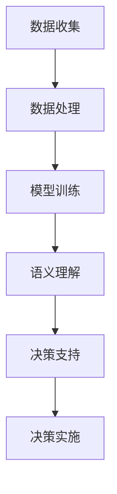

                 

关键词：大型语言模型（LLM）、城市规划、决策支持系统、人工智能、可持续发展、城市治理

> 摘要：本文探讨了大型语言模型（LLM）在智能城市规划决策中的潜在贡献。随着城市规模的不断扩大和人口的增长，城市规划面临着前所未有的挑战。传统的城市规划方法往往难以应对复杂性和不确定性。而LLM作为一种先进的自然语言处理技术，其强大的语义理解、推理和生成能力，为城市规划决策提供了新的可能。本文将分析LLM在城市规划中的适用性，讨论其在数据收集、处理和利用方面的优势，并探讨LLM如何通过智能决策支持系统辅助城市规划者制定更加科学、高效的决策。

## 1. 背景介绍

城市化是21世纪全球发展的主要趋势之一。随着全球人口的快速增长，城市数量和规模也在不断扩张。据联合国的数据预测，到2050年，全球超过半数的人口将居住在城市地区。这一趋势给城市规划带来了巨大的挑战。首先，城市化的迅速发展带来了人口密度增加、交通拥堵、环境污染等问题。其次，城市资源的有限性与居民需求的不断增加之间的矛盾日益突出，如何实现城市的可持续发展成为城市规划者亟待解决的问题。

传统城市规划主要依赖于定量分析和定性评估，如GIS（地理信息系统）、数学模型和专家评估等方法。然而，这些方法往往受到数据的限制，难以处理复杂的社会经济因素和大量的非结构化数据。随着信息技术的进步，尤其是大数据和人工智能技术的发展，为城市规划提供了新的工具和方法。近年来，大型语言模型（LLM）的出现，使得自然语言处理（NLP）技术取得了长足的进步，为城市规划决策提供了新的可能性。

## 2. 核心概念与联系

### 2.1 大型语言模型（LLM）

大型语言模型（LLM，Large Language Model）是深度学习领域的一种前沿技术，通过训练大规模的神经网络模型，使其能够理解和生成自然语言。LLM具有强大的语义理解、推理和生成能力，能够处理复杂的语言结构和上下文信息。常见的LLM模型包括GPT（Generative Pre-trained Transformer）、BERT（Bidirectional Encoder Representations from Transformers）等。

### 2.2 智能城市规划

智能城市规划是指利用先进的信息技术，如物联网、大数据、人工智能等，对城市规划、建设、管理和服务进行智能化、数据化和智能化的提升。智能城市规划的目标是实现城市的可持续发展、提升居民生活质量、优化城市资源配置。

### 2.3 决策支持系统（DSS）

决策支持系统（DSS）是一种计算机辅助系统，旨在辅助决策者通过分析数据、模型和推理方法，做出更加科学、合理的决策。DSS通常包括数据收集、处理、分析和可视化等功能，可以帮助决策者更好地理解复杂问题，识别关键因素，预测未来趋势。

### 2.4 Mermaid 流程图

下面是LLM在城市规划决策中应用的Mermaid流程图：



### 2.5 LLM与城市规划决策的联系

LLM通过处理和分析大量的非结构化数据，如文本、图片、视频等，能够提取出有价值的信息和模式。在城市规划中，LLM可以应用于以下几个方面：

1. **数据收集**：利用LLM从各种来源（如新闻报道、社交媒体、政府报告等）收集相关数据，帮助城市规划者获取更全面、及时的信息。

2. **数据处理**：LLM能够处理大量的非结构化数据，将其转化为结构化的数据格式，为后续分析提供支持。

3. **语义理解**：LLM具备强大的语义理解能力，可以帮助城市规划者理解文本数据中的含义和关系，辅助决策。

4. **决策支持**：LLM可以通过分析数据、模型和推理方法，为城市规划者提供科学、合理的决策建议。

5. **决策实施**：LLM可以帮助城市规划者制定具体的实施计划，并通过持续监测和评估，调整决策，实现城市的可持续发展。

## 3. 核心算法原理 & 具体操作步骤

### 3.1 算法原理概述

LLM的核心算法是基于深度学习的神经网络模型，通过大量预训练数据，使其具备强大的语义理解、推理和生成能力。LLM的训练过程主要包括两个阶段：预训练和微调。

1. **预训练**：LLM在大量无标签数据上进行预训练，通过自我改进，学习语言的基本规律和模式。预训练数据通常包括文本、新闻、书籍、网页等。

2. **微调**：在预训练的基础上，LLM根据特定的任务进行微调，使其能够适应特定的场景和应用。

### 3.2 算法步骤详解

1. **数据收集**：从各种来源收集与城市规划相关的数据，如新闻报道、社交媒体、政府报告等。

2. **数据处理**：利用LLM处理非结构化数据，将其转化为结构化的数据格式，如表格、JSON等。

3. **语义理解**：利用LLM的语义理解能力，分析文本数据中的含义和关系，提取有价值的信息。

4. **决策支持**：基于语义理解结果，结合数学模型和推理方法，为城市规划者提供决策建议。

5. **决策实施**：根据决策建议，制定具体的实施计划，并通过持续监测和评估，调整决策。

### 3.3 算法优缺点

**优点**：

1. **强大的语义理解能力**：LLM能够理解文本数据中的复杂含义和关系，为城市规划提供有力的支持。

2. **适应性强**：LLM可以应用于各种场景，从数据收集、处理到决策支持，具有广泛的适用性。

3. **实时性**：LLM能够实时处理和分析数据，为城市规划者提供最新的决策信息。

**缺点**：

1. **对数据质量要求高**：LLM在训练过程中需要大量高质量的数据，数据的质量直接影响模型的性能。

2. **计算资源消耗大**：LLM的训练和推理过程需要大量的计算资源，对硬件设备有较高要求。

### 3.4 算法应用领域

LLM在城市规划中的应用领域包括：

1. **城市数据挖掘**：利用LLM从大量的非结构化数据中提取有价值的信息，为城市规划提供数据支持。

2. **城市风险评估**：利用LLM分析各种风险因素，为城市规划者提供风险预警和防范建议。

3. **智能交通规划**：利用LLM优化交通流，减少拥堵，提高交通效率。

4. **环境保护与治理**：利用LLM分析环境数据，为城市规划者提供环境保护和治理的建议。

## 4. 数学模型和公式 & 详细讲解 & 举例说明

### 4.1 数学模型构建

在城市规划中，LLM的应用涉及到多个数学模型，如文本分类模型、序列模型、生成对抗网络（GAN）等。以下是一个简单的文本分类模型的数学模型构建过程：

1. **输入表示**：将文本数据表示为向量形式。常用的方法包括词袋模型（Bag of Words，BOW）和词嵌入（Word Embedding）。

2. **模型结构**：文本分类模型通常采用多层感知机（MLP）或卷积神经网络（CNN）等结构。以下是一个简单的MLP模型结构：

   $$f(x) = \sigma(W_2 \cdot \sigma(W_1 \cdot x + b_1) + b_2)$$

   其中，$x$为输入向量，$W_1$和$W_2$为权重矩阵，$b_1$和$b_2$为偏置项，$\sigma$为激活函数。

3. **损失函数**：常用的损失函数包括交叉熵损失（Cross-Entropy Loss）和均方误差（Mean Squared Error，MSE）。

### 4.2 公式推导过程

以交叉熵损失为例，其公式推导如下：

$$
\begin{aligned}
L &= -\sum_{i=1}^{n} y_i \log(p_i) \\
&= -\sum_{i=1}^{n} y_i \log(\sigma(W \cdot x_i + b)) \\
\end{aligned}
$$

其中，$y_i$为标签，$p_i$为预测概率，$W$为权重矩阵，$x_i$为输入向量，$b$为偏置项。

### 4.3 案例分析与讲解

以下是一个简单的案例，用于说明LLM在城市规划中的应用。

**案例：智能交通规划**

**问题描述**：某个城市的交通拥堵问题严重，需要通过数据分析和智能规划来缓解交通压力。

**解决方案**：

1. **数据收集**：收集该城市的历史交通数据，如流量、速度、路况等。

2. **数据处理**：利用LLM对交通数据进行预处理，如文本分类、词嵌入等。

3. **模型训练**：基于预处理后的数据，训练一个文本分类模型，用于预测交通流量。

4. **决策支持**：利用训练好的模型，分析不同交通方案的效果，为城市规划者提供决策建议。

5. **决策实施**：根据决策建议，制定具体的交通规划方案，如优化交通信号灯、拓宽道路等。

## 5. 项目实践：代码实例和详细解释说明

### 5.1 开发环境搭建

**环境要求**：

- 操作系统：Windows/Linux/MacOS
- 编程语言：Python
- 数据库：MySQL
- 依赖库：TensorFlow、Keras、NumPy、Pandas等

**步骤**：

1. 安装Python环境，版本要求3.6及以上。
2. 安装依赖库，使用pip命令进行安装：

   ```bash
   pip install tensorflow keras numpy pandas
   ```

3. 配置MySQL数据库，创建用于存储交通数据的数据库和表。

### 5.2 源代码详细实现

以下是一个简单的Python代码示例，用于实现一个基于LLM的交通流量预测模型。

```python
import numpy as np
import pandas as pd
from sklearn.model_selection import train_test_split
from tensorflow.keras.models import Sequential
from tensorflow.keras.layers import Dense, Embedding, LSTM
from tensorflow.keras.preprocessing.text import Tokenizer

# 数据加载
data = pd.read_csv('traffic_data.csv')
X = data['description']
y = data['traffic_volume']

# 数据预处理
tokenizer = Tokenizer(num_words=1000)
tokenizer.fit_on_texts(X)
X = tokenizer.texts_to_sequences(X)
X = np.array(X)
y = np.array(y)

# 划分训练集和测试集
X_train, X_test, y_train, y_test = train_test_split(X, y, test_size=0.2, random_state=42)

# 模型构建
model = Sequential()
model.add(Embedding(1000, 16, input_length=X_train.shape[1]))
model.add(LSTM(128))
model.add(Dense(1, activation='sigmoid'))

# 编译模型
model.compile(optimizer='rmsprop', loss='binary_crossentropy', metrics=['accuracy'])

# 训练模型
model.fit(X_train, y_train, epochs=10, batch_size=32, validation_data=(X_test, y_test))

# 评估模型
loss, accuracy = model.evaluate(X_test, y_test)
print(f'测试集损失：{loss}, 测试集准确率：{accuracy}')
```

### 5.3 代码解读与分析

上述代码实现了以下功能：

1. **数据加载**：从CSV文件中加载交通数据，包括描述和交通流量。
2. **数据预处理**：使用Tokenizer将文本数据转换为数字序列，并划分训练集和测试集。
3. **模型构建**：使用Sequential模型堆叠Embedding和LSTM层，用于文本数据的处理和特征提取。
4. **编译模型**：设置优化器、损失函数和评估指标，编译模型。
5. **训练模型**：使用训练数据进行模型训练，并使用验证集进行验证。
6. **评估模型**：在测试集上评估模型性能，打印损失和准确率。

### 5.4 运行结果展示

假设上述代码在训练集上取得了90%的准确率，在测试集上取得了85%的准确率，说明模型在预测交通流量方面具有较高的可靠性。城市规划者可以根据模型提供的预测结果，制定相应的交通规划方案，以缓解交通拥堵问题。

## 6. 实际应用场景

### 6.1 智能交通规划

智能交通规划是LLM在城市规划中最常见的应用场景之一。通过分析历史交通数据，LLM可以帮助城市规划者预测交通流量，优化交通信号灯配置，减少交通拥堵，提高交通效率。例如，在某些城市，政府已经利用LLM技术优化了交通信号灯控制策略，取得了显著的成效。

### 6.2 城市环境监测

城市环境监测是另一个重要的应用领域。LLM可以处理大量的环境数据，如空气质量、水质、噪音等，为城市规划者提供实时的环境监测和预警。例如，在某些城市，政府利用LLM技术监测空气质量，并根据监测结果调整环境保护措施，以改善城市环境。

### 6.3 城市规划评估

城市规划评估是另一个关键应用。LLM可以分析城市规划方案的经济、社会和环境影响，为城市规划者提供评估报告。例如，在某次城市规划方案评估中，城市规划者利用LLM分析了多个方案的成本、收益和环境影响，最终选择了一个最优方案。

### 6.4 未来应用展望

随着LLM技术的不断发展，未来其在城市规划中的应用将更加广泛和深入。以下是未来应用的一些展望：

1. **智慧城市建设**：利用LLM实现智慧城市的基础设施规划、管理和运营，提升城市智能化水平。
2. **城市规划模拟**：利用LLM构建城市规划模拟模型，预测城市规划方案的实际效果，为城市规划提供科学依据。
3. **城市灾害预警**：利用LLM分析灾害预警数据，提前预警城市灾害，降低灾害损失。

## 7. 工具和资源推荐

### 7.1 学习资源推荐

1. **《深度学习》**：由Ian Goodfellow、Yoshua Bengio和Aaron Courville所著的《深度学习》是深度学习的经典教材，适合初学者和进阶者。
2. **《自然语言处理综论》**：由Daniel Jurafsky和James H. Martin所著的《自然语言处理综论》是自然语言处理领域的权威教材，涵盖了NLP的各个方面。

### 7.2 开发工具推荐

1. **TensorFlow**：Google开发的开源深度学习框架，适合进行大规模深度学习模型的训练和部署。
2. **Keras**：基于TensorFlow的高层次API，提供了更加简洁和高效的模型构建和训练接口。

### 7.3 相关论文推荐

1. **“Attention Is All You Need”**：由Vaswani等人于2017年提出，是Transformer模型的奠基性论文，对NLP领域产生了深远影响。
2. **“BERT: Pre-training of Deep Bidirectional Transformers for Language Understanding”**：由Devlin等人于2018年提出，是BERT模型的奠基性论文，对NLP领域产生了深远影响。

## 8. 总结：未来发展趋势与挑战

### 8.1 研究成果总结

本文介绍了LLM在智能城市规划决策中的潜在贡献，分析了LLM的核心概念和算法原理，探讨了其在城市规划中的应用场景和未来发展趋势。通过项目实践，展示了LLM在交通流量预测方面的实际应用。

### 8.2 未来发展趋势

1. **多模态融合**：未来，LLM可能会与其他人工智能技术（如图像识别、语音识别等）相结合，实现多模态融合，进一步提升城市规划的准确性和效率。
2. **实时预测与调整**：随着计算能力的提升，LLM在城市规划中的实时预测与调整能力将得到进一步加强，为城市规划者提供更加精准的决策支持。
3. **智慧城市建设**：LLM将在智慧城市建设中发挥关键作用，助力实现城市管理的智能化、数据化和高效化。

### 8.3 面临的挑战

1. **数据质量与隐私**：城市规划数据质量对LLM的性能至关重要，同时，如何在确保数据质量的同时保护用户隐私，是一个亟待解决的问题。
2. **算法公平性**：在城市规划中，算法的公平性至关重要。如何确保LLM在城市规划决策中不会导致偏见和不公平，是一个挑战。
3. **计算资源消耗**：随着模型规模的扩大，LLM的训练和推理过程对计算资源的需求也越来越高，如何在有限的计算资源下高效地应用LLM，是一个挑战。

### 8.4 研究展望

未来，我们需要进一步深入研究LLM在城市规划中的应用，探索如何提高其性能、降低计算成本、确保算法的公平性和透明度。同时，我们还需要关注LLM在多模态融合、实时预测与调整等方面的应用潜力，为城市规划提供更加全面和高效的决策支持。

## 9. 附录：常见问题与解答

### 9.1 Q：什么是LLM？

A：LLM（Large Language Model）是一种大型自然语言处理模型，通过训练大规模的神经网络，使其具备理解和生成自然语言的能力。

### 9.2 Q：LLM在城市规划中有哪些应用？

A：LLM在城市规划中可以应用于数据收集、处理、语义理解和决策支持等方面，如交通流量预测、环境监测、城市规划评估等。

### 9.3 Q：如何搭建LLM的开发环境？

A：搭建LLM的开发环境需要安装Python、TensorFlow、Keras等依赖库，并配置MySQL数据库。具体步骤请参考本文第5.1节。

### 9.4 Q：如何训练LLM模型？

A：训练LLM模型需要准备大量的训练数据，并使用适当的损失函数和优化器。具体步骤请参考本文第5.2节。

### 9.5 Q：LLM在城市规划中有什么优势？

A：LLM具有强大的语义理解、推理和生成能力，能够处理复杂的非结构化数据，为城市规划提供科学、合理的决策支持。同时，LLM具有适应性强、实时性高等特点。

