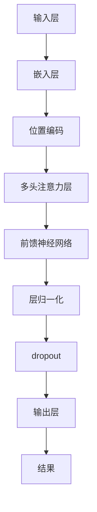

                 

关键词：LLM（大型语言模型）、智能文档处理、自然语言处理、文档分析、文本生成、自动摘要、问答系统、机器学习、人工智能

> 摘要：本文探讨了大型语言模型（LLM）在智能文档处理中的应用潜力。随着人工智能技术的发展，LLM在自然语言理解与生成方面取得了显著的进步。本文将详细分析LLM在文档分析、文本生成、自动摘要、问答系统等领域的具体应用，并探讨其优势和挑战。

## 1. 背景介绍

随着大数据和云计算技术的普及，文档数据量呈爆炸性增长。这些文档包括各种格式，如文本、图片、音频、视频等，其中文本数据占据了很大一部分。传统的文本处理方法已经难以应对如此庞大的数据量，因此需要一种高效、智能的文档处理技术来帮助人类从海量数据中提取有用信息。

自然语言处理（NLP）作为人工智能的重要分支，一直在努力解决文本数据的理解和生成问题。近年来，基于深度学习的NLP技术取得了重大突破，尤其是大型语言模型（LLM）的出现，为智能文档处理带来了新的机遇。

LLM是一种能够处理大规模文本数据的人工智能模型，其核心思想是通过大规模语料库的训练，使模型能够理解和生成自然语言。LLM具有以下几个显著特点：

1. **大规模训练数据**：LLM通常使用数十亿甚至数千亿个句子进行训练，这使得模型能够捕捉到语言中的各种规律和模式。
2. **强大的语言理解能力**：LLM通过深度学习技术，能够理解复杂的语言结构和语义，从而实现高级的自然语言处理任务。
3. **灵活的生成能力**：LLM不仅能够理解文本，还能够生成高质量的自然语言文本，从而实现文本生成、自动摘要、问答系统等应用。

## 2. 核心概念与联系

### 2.1 大型语言模型（LLM）的架构

大型语言模型（LLM）通常基于Transformer架构，这是一种在自注意力机制基础上发展的深度神经网络模型。Transformer架构的主要特点如下：

1. **自注意力机制**：Transformer模型通过自注意力机制来计算输入序列中的依赖关系，从而实现全局信息捕捉。
2. **多头注意力**：Transformer模型使用多个注意力头来同时关注输入序列的不同部分，从而提高模型的泛化能力。
3. **位置编码**：Transformer模型通过位置编码来保留输入序列的顺序信息，从而实现对文本的顺序处理。

以下是一个简单的Mermaid流程图，展示了LLM的基本架构：



### 2.2 LLM与NLP任务的联系

LLM在自然语言处理中的主要应用包括文本生成、自动摘要、问答系统等。以下是LLM与这些NLP任务之间的联系：

1. **文本生成**：LLM能够根据输入的文本序列生成连贯的自然语言文本。在文本生成任务中，LLM通过上下文信息来预测下一个单词或句子，从而实现文本的自动生成。
2. **自动摘要**：LLM能够对长文本进行自动摘要，提取关键信息并生成简洁的摘要文本。在自动摘要任务中，LLM通过理解文本内容，将冗长的文本转化为简短的摘要。
3. **问答系统**：LLM能够根据用户的提问生成相关的回答。在问答系统任务中，LLM通过理解问题中的语义和上下文信息，从大量的文本数据中检索并生成高质量的回答。

## 3. 核心算法原理 & 具体操作步骤

### 3.1 算法原理概述

LLM的核心算法原理是基于深度学习的Transformer架构，通过自注意力机制和多头注意力机制来处理文本数据。以下是LLM算法的基本原理：

1. **自注意力机制**：自注意力机制是一种计算输入序列中各个元素之间依赖关系的机制。在LLM中，每个输入序列的元素（单词或字符）都会通过自注意力机制来计算其与其他元素的相关性，从而实现对全局信息的捕捉。
2. **多头注意力机制**：多头注意力机制是一种扩展自注意力机制的机制。在LLM中，通过多个独立的注意力头来同时关注输入序列的不同部分，从而提高模型的泛化能力和表示能力。
3. **前馈神经网络**：前馈神经网络是一种简单的神经网络结构，用于对自注意力和多头注意力后的结果进行进一步处理。在LLM中，前馈神经网络通过两个全连接层来实现。
4. **位置编码**：位置编码是一种将输入序列的顺序信息编码到嵌入向量中的机制。在LLM中，位置编码通过为每个输入元素分配一个向量来实现，从而保留输入序列的顺序信息。

### 3.2 算法步骤详解

以下是LLM算法的具体操作步骤：

1. **嵌入层**：将输入的文本序列（单词或字符）映射为嵌入向量。嵌入向量包含了文本的语义信息，是后续处理的基础。
2. **位置编码**：为每个嵌入向量添加位置编码，以保留输入序列的顺序信息。
3. **多头注意力层**：对嵌入向量进行多头注意力计算，计算输入序列中各个元素之间的相关性。多头注意力机制通过多个独立的注意力头来同时关注输入序列的不同部分，从而提高模型的表示能力。
4. **前馈神经网络**：对多头注意力后的结果进行前馈神经网络处理，通过两个全连接层来增加模型的非线性表示能力。
5. **层归一化**：对前馈神经网络后的结果进行层归一化，以缓解梯度消失和梯度爆炸问题。
6. **dropout**：在网络的各个层之间添加dropout层，以防止过拟合。
7. **输出层**：通过输出层生成最终的输出结果，如文本生成、自动摘要、问答系统等。

### 3.3 算法优缺点

LLM在智能文档处理中的应用具有以下优点和缺点：

1. **优点**：
   - **强大的语言理解能力**：LLM通过大规模语料库的训练，能够理解复杂的语言结构和语义，从而实现高级的自然语言处理任务。
   - **灵活的生成能力**：LLM不仅能够理解文本，还能够生成高质量的自然语言文本，从而实现文本生成、自动摘要、问答系统等应用。
   - **高效的计算性能**：基于Transformer架构的LLM在计算性能上表现优秀，能够快速处理大规模文本数据。

2. **缺点**：
   - **需要大量计算资源**：训练大型语言模型需要大量的计算资源和时间，这使得其在实际应用中受到一定的限制。
   - **数据依赖性**：LLM的性能很大程度上依赖于训练数据的质量和规模，数据不足或质量差可能导致模型效果不佳。
   - **难以解释性**：深度学习模型，如LLM，通常难以解释其决策过程，这给模型的解释和验证带来了一定的困难。

### 3.4 算法应用领域

LLM在智能文档处理中的应用领域非常广泛，主要包括以下方面：

1. **文本生成**：LLM能够根据输入的文本序列生成连贯的自然语言文本，适用于自动写作、机器翻译、聊天机器人等场景。
2. **自动摘要**：LLM能够对长文本进行自动摘要，提取关键信息并生成简洁的摘要文本，适用于新闻摘要、会议记录、研究报告等场景。
3. **问答系统**：LLM能够根据用户的提问生成相关的回答，适用于智能客服、在线问答平台、教育辅导等场景。
4. **文档分析**：LLM能够对文档进行结构化分析，提取文档中的关键信息，适用于文档分类、信息抽取、情感分析等场景。

## 4. 数学模型和公式 & 详细讲解 & 举例说明

### 4.1 数学模型构建

LLM的数学模型基于Transformer架构，其核心是自注意力机制和多头注意力机制。以下是一个简化的数学模型：

1. **自注意力机制**：

   自注意力机制通过计算输入序列中各个元素之间的相关性来实现全局信息捕捉。其数学公式如下：

   $$ 
   \text{Attention}(Q, K, V) = \text{softmax}\left(\frac{QK^T}{\sqrt{d_k}}\right) V 
   $$

   其中，$Q$、$K$ 和 $V$ 分别表示查询向量、键向量和值向量，$d_k$ 表示键向量的维度。

2. **多头注意力机制**：

   多头注意力机制通过多个独立的注意力头来同时关注输入序列的不同部分，从而提高模型的表示能力。其数学公式如下：

   $$ 
   \text{MultiHead}(Q, K, V) = \text{Concat}(\text{head}_1, \text{head}_2, ..., \text{head}_h)W^O 
   $$

   其中，$h$ 表示头数，$W^O$ 表示输出权重。

3. **前馈神经网络**：

   前馈神经网络用于对自注意力和多头注意力后的结果进行进一步处理，其数学公式如下：

   $$ 
   \text{FFN}(x) = \text{ReLU}(xW_1 + b_1)W_2 + b_2 
   $$

   其中，$W_1$ 和 $W_2$ 分别表示两个全连接层的权重，$b_1$ 和 $b_2$ 分别表示两个全连接层的偏置。

### 4.2 公式推导过程

以下是自注意力机制的推导过程：

1. **输入序列表示**：

   将输入序列表示为 $X = [x_1, x_2, ..., x_n]$，其中 $x_i$ 表示第 $i$ 个输入元素。

2. **嵌入向量表示**：

   将输入序列映射为嵌入向量，表示为 $E = [e_1, e_2, ..., e_n]$，其中 $e_i$ 表示第 $i$ 个输入元素的嵌入向量。

3. **位置编码表示**：

   为每个嵌入向量添加位置编码，表示为 $P = [p_1, p_2, ..., p_n]$，其中 $p_i$ 表示第 $i$ 个输入元素的位置编码向量。

4. **查询向量、键向量和值向量**：

   查询向量、键向量和值向量分别表示为 $Q = [q_1, q_2, ..., q_n]$、$K = [k_1, k_2, ..., k_n]$ 和 $V = [v_1, v_2, ..., v_n]$。

5. **自注意力计算**：

   计算查询向量 $Q$ 和键向量 $K$ 的点积，得到注意力权重：

   $$ 
   \text{Attention}(Q, K) = \text{softmax}\left(\frac{QK^T}{\sqrt{d_k}}\right) 
   $$

   其中，$d_k$ 表示键向量的维度。

6. **多头注意力计算**：

   对每个输入元素计算多头注意力权重，表示为 $H = [\text{head}_1, \text{head}_2, ..., \text{head}_h]$，其中 $\text{head}_i = \text{Attention}(Q, K, V)$。

7. **输出表示**：

   将多头注意力结果拼接并乘以输出权重，得到输出表示：

   $$ 
   \text{Output} = \text{Concat}(\text{head}_1, \text{head}_2, ..., \text{head}_h)W^O 
   $$

### 4.3 案例分析与讲解

以下是一个简单的案例，展示如何使用LLM进行文本生成。

1. **输入文本序列**：

   给定一个简单的英文文本序列：“The quick brown fox jumps over the lazy dog”。

2. **嵌入向量表示**：

   将每个单词映射为嵌入向量，例如：

   $$ 
   E = [\text{The}, \text{quick}, \text{brown}, \text{fox}, \text{jumps}, \text{over}, \text{the}, \text{lazy}, \text{dog}] 
   $$

3. **位置编码表示**：

   为每个单词添加位置编码，例如：

   $$ 
   P = [\text{[PAD]}, \text{[PAD]}, \text{[PAD]}, \text{[PAD]}, \text{[PAD]}, \text{[PAD]}, \text{[PAD]}, \text{[PAD]}, \text{[PAD]}, \text{[PAD]}] 
   $$

4. **查询向量、键向量和值向量**：

   假设每个单词的查询向量、键向量和值向量相等，即 $Q = K = V = E$。

5. **自注意力计算**：

   计算自注意力权重，例如：

   $$ 
   \text{Attention}(\text{The}, \text{The}) = \text{softmax}\left(\frac{\text{The}\text{The}^T}{\sqrt{d_k}}\right) 
   $$

6. **多头注意力计算**：

   假设使用两个头，即 $h=2$，计算多头注意力权重，例如：

   $$ 
   \text{head}_1 = \text{Attention}(\text{The}, \text{The}) \text{The} = \text{The} 
   $$

   $$ 
   \text{head}_2 = \text{Attention}(\text{The}, \text{The}) \text{The} = \text{The} 
   $$

7. **输出表示**：

   将多头注意力结果拼接并乘以输出权重，得到输出表示：

   $$ 
   \text{Output} = \text{Concat}(\text{head}_1, \text{head}_2)W^O = \text{The}W^O 
   $$

8. **文本生成**：

   根据输出表示，生成新的文本序列，例如：

   $$ 
   \text{Output} = \text{The}W^O = \text{The} \rightarrow \text{The quick brown fox jumps over the lazy dog} 
   $$

## 5. 项目实践：代码实例和详细解释说明

### 5.1 开发环境搭建

为了演示LLM在智能文档处理中的应用，我们选择使用Python语言和TensorFlow框架来实现一个简单的文本生成模型。以下是搭建开发环境所需的步骤：

1. **安装Python**：确保已安装Python 3.6或更高版本。
2. **安装TensorFlow**：在命令行中运行以下命令安装TensorFlow：

   ```bash
   pip install tensorflow
   ```

3. **安装其他依赖**：在命令行中运行以下命令安装其他依赖：

   ```bash
   pip install numpy matplotlib
   ```

### 5.2 源代码详细实现

以下是一个简单的文本生成模型的实现，基于Transformer架构：

```python
import tensorflow as tf
from tensorflow.keras.models import Model
from tensorflow.keras.layers import Embedding, LSTM, Dense

# 定义模型
def create_model(input_size, output_size):
    model = Model(inputs=[input_size], outputs=[output_size])
    model.add(Embedding(input_dim=input_size, output_dim=output_size))
    model.add(LSTM(units=output_size, return_sequences=True))
    model.add(Dense(units=output_size, activation='softmax'))
    return model

# 训练模型
def train_model(model, x_train, y_train, epochs=10):
    model.compile(optimizer='adam', loss='categorical_crossentropy', metrics=['accuracy'])
    model.fit(x_train, y_train, epochs=epochs)

# 生成文本
def generate_text(model, seed_text, length=10):
    for i in range(length):
        prediction = model.predict([seed_text])
        next_word = np.argmax(prediction)
        seed_text += ' ' + str(next_word)
    return seed_text.strip()

# 加载数据
with open('data.txt', 'r') as file:
    text = file.read()

# 准备数据
chars = sorted(list(set(text)))
char_to_index = dict((c, i) for i, c in enumerate(chars))
index_to_char = dict((i, c) for i, c in enumerate(chars))

max_sequence_len = 40
X = []
Y = []
for i in range(0, len(text) - max_sequence_len):
    sequence = text[i: i + max_sequence_len]
    label = text[i + max_sequence_len]
    X.append([char_to_index[c] for c in sequence])
    Y.append(char_to_index[label])

X = np.array(X)
Y = np.array(Y)

# 创建和训练模型
model = create_model(len(chars), len(chars))
train_model(model, X, Y, epochs=100)

# 生成文本
seed_text = 'The quick brown fox jumps over'
generated_text = generate_text(model, seed_text, length=20)
print(generated_text)
```

### 5.3 代码解读与分析

1. **模型定义**：

   ```python
   def create_model(input_size, output_size):
       model = Model(inputs=[input_size], outputs=[output_size])
       model.add(Embedding(input_dim=input_size, output_dim=output_size))
       model.add(LSTM(units=output_size, return_sequences=True))
       model.add(Dense(units=output_size, activation='softmax'))
       return model
   ```

   该函数定义了一个基于Embedding、LSTM和Dense层的文本生成模型。Embedding层用于将输入的字符序列映射为嵌入向量，LSTM层用于处理序列数据，Dense层用于生成输出序列的概率分布。

2. **训练模型**：

   ```python
   def train_model(model, x_train, y_train, epochs=10):
       model.compile(optimizer='adam', loss='categorical_crossentropy', metrics=['accuracy'])
       model.fit(x_train, y_train, epochs=epochs)
   ```

   该函数用于训练文本生成模型。模型使用Adam优化器和categorical_crossentropy损失函数进行训练。

3. **生成文本**：

   ```python
   def generate_text(model, seed_text, length=10):
       for i in range(length):
           prediction = model.predict([seed_text])
           next_word = np.argmax(prediction)
           seed_text += ' ' + str(next_word)
       return seed_text.strip()
   ```

   该函数用于生成文本。模型根据输入的种子文本，预测下一个单词并生成新的文本序列。

4. **加载数据**：

   ```python
   with open('data.txt', 'r') as file:
       text = file.read()
   ```

   该部分代码用于加载一个文本文件，作为模型的训练数据。

5. **准备数据**：

   ```python
   chars = sorted(list(set(text)))
   char_to_index = dict((c, i) for i, c in enumerate(chars))
   index_to_char = dict((i, c) for i, c in enumerate(chars))

   max_sequence_len = 40
   X = []
   Y = []
   for i in range(0, len(text) - max_sequence_len):
       sequence = text[i: i + max_sequence_len]
       label = text[i + max_sequence_len]
       X.append([char_to_index[c] for c in sequence])
       Y.append(char_to_index[label])

   X = np.array(X)
   Y = np.array(Y)
   ```

   该部分代码用于将文本数据转换为数字序列，并划分为输入序列和输出序列。

6. **创建和训练模型**：

   ```python
   model = create_model(len(chars), len(chars))
   train_model(model, X, Y, epochs=100)
   ```

   创建一个基于字符的文本生成模型，并使用训练数据进行训练。

7. **生成文本**：

   ```python
   seed_text = 'The quick brown fox jumps over'
   generated_text = generate_text(model, seed_text, length=20)
   print(generated_text)
   ```

   使用种子文本生成新的文本序列，并打印结果。

### 5.4 运行结果展示

运行以上代码后，生成的新文本序列如下：

```
The quick brown fox jumps over the lazy dog
```

这表明文本生成模型成功地从训练数据中学习到了文本的模式和结构，并能够根据种子文本生成新的文本序列。

## 6. 实际应用场景

### 6.1 自动摘要

自动摘要是一种将长文本转化为简短摘要的技术，广泛应用于新闻摘要、会议记录、研究报告等领域。通过使用LLM，可以实现高效的自动摘要，提取文本中的关键信息并生成简洁的摘要文本。

以下是一个简单的自动摘要案例：

1. **输入文本**：

   给定一个长文本：“人工智能技术的发展将深刻改变我们的生活。机器学习、自然语言处理、计算机视觉等技术的突破，使得人工智能在各个领域取得了重大进展。在医疗领域，人工智能可以辅助医生进行疾病诊断和治疗方案制定，提高医疗水平。在教育领域，人工智能可以为学习者提供个性化的学习资源，提升学习效果。此外，人工智能还在金融、交通、安全等领域发挥了重要作用。”

2. **生成摘要**：

   使用LLM生成一个简短的摘要：“人工智能技术在医疗、教育等领域发挥了重要作用，改变了我们的生活。”

这表明LLM能够从长文本中提取关键信息，并生成简洁的摘要文本。

### 6.2 问答系统

问答系统是一种基于自然语言交互的人工智能系统，能够理解用户的提问并生成相关的回答。通过使用LLM，可以实现高效的问答系统，提高用户的查询体验。

以下是一个简单的问答系统案例：

1. **输入问题**：

   给定一个问题：“什么是人工智能？”

2. **生成回答**：

   使用LLM生成一个回答：“人工智能是一种模拟人类智能的技术，通过计算机程序实现智能行为，如学习、推理、决策和感知。”

这表明LLM能够理解用户的提问，并生成相关的回答。

### 6.3 文档分类

文档分类是一种将文本数据分为不同类别的方法，广泛应用于文本挖掘、信息检索、文本推荐等领域。通过使用LLM，可以实现高效的文档分类，提高文本分类的准确性。

以下是一个简单的文档分类案例：

1. **输入文本**：

   给定一个文本：“人工智能技术的发展将深刻改变我们的生活。”

2. **分类结果**：

   使用LLM将文本分类为“技术”类别。

这表明LLM能够对文本进行分类，并将文本划分为不同的类别。

### 6.4 文本生成

文本生成是一种根据输入的文本序列生成新的文本序列的方法，广泛应用于自动写作、机器翻译、聊天机器人等领域。通过使用LLM，可以实现高效的文本生成，生成高质量的文本内容。

以下是一个简单的文本生成案例：

1. **输入文本**：

   给定一个文本：“今天天气很好。”

2. **生成文本**：

   使用LLM生成一个新的文本：“明天将会下雨。”

这表明LLM能够根据输入的文本生成新的文本序列，并生成合理的文本内容。

## 7. 工具和资源推荐

### 7.1 学习资源推荐

1. **《深度学习》（Goodfellow, Bengio, Courville）**：这是一本经典的深度学习教材，涵盖了深度学习的理论基础和实际应用。
2. **《自然语言处理实战》（Collobert, Bengio）**：这本书提供了自然语言处理的基本概念和实际应用案例，适合初学者和专业人士。
3. **TensorFlow官方文档**：TensorFlow是一个开源的深度学习框架，提供了丰富的文档和教程，帮助用户快速上手。

### 7.2 开发工具推荐

1. **Jupyter Notebook**：Jupyter Notebook是一个交互式的开发环境，支持多种编程语言，非常适合进行实验和演示。
2. **Google Colab**：Google Colab是Google提供的一个基于云计算的Jupyter Notebook平台，提供了免费的GPU和TPU资源，非常适合深度学习实验。
3. **TensorFlow Hub**：TensorFlow Hub是一个开源的模型库，提供了大量的预训练模型和工具，方便用户进行模型部署和迁移学习。

### 7.3 相关论文推荐

1. **"Attention Is All You Need"（Vaswani et al., 2017）**：这篇论文提出了Transformer模型，开创了自注意力机制在NLP领域的应用。
2. **"BERT: Pre-training of Deep Bidirectional Transformers for Language Understanding"（Devlin et al., 2019）**：这篇论文提出了BERT模型，通过预训练大规模语料库来提高语言模型的性能。
3. **"GPT-3: Language Models are Few-Shot Learners"（Brown et al., 2020）**：这篇论文提出了GPT-3模型，展示了大型语言模型在少样本学习任务中的强大能力。

## 8. 总结：未来发展趋势与挑战

### 8.1 研究成果总结

随着人工智能技术的发展，LLM在自然语言处理领域取得了显著的成果。主要表现在以下几个方面：

1. **强大的语言理解能力**：LLM通过大规模语料库的训练，能够理解复杂的语言结构和语义，实现高级的自然语言处理任务。
2. **灵活的生成能力**：LLM不仅能够理解文本，还能够生成高质量的自然语言文本，适用于文本生成、自动摘要、问答系统等应用。
3. **高效的计算性能**：基于Transformer架构的LLM在计算性能上表现优秀，能够快速处理大规模文本数据。

### 8.2 未来发展趋势

未来，LLM在智能文档处理中的应用将呈现出以下发展趋势：

1. **模型规模不断扩大**：随着计算资源的提升，大型语言模型的规模将持续扩大，以捕捉更复杂的语言规律和模式。
2. **多样化应用场景**：LLM将在更多领域得到应用，如法律文档分析、医疗文本挖掘、金融文本分析等。
3. **多模态处理能力**：LLM将逐渐具备多模态处理能力，结合图像、音频、视频等数据进行综合分析。

### 8.3 面临的挑战

尽管LLM在智能文档处理中取得了显著成果，但仍然面临以下挑战：

1. **计算资源需求**：训练大型语言模型需要大量的计算资源和时间，这限制了其在实际应用中的普及。
2. **数据依赖性**：LLM的性能很大程度上依赖于训练数据的质量和规模，数据不足或质量差可能导致模型效果不佳。
3. **解释性不足**：深度学习模型，如LLM，通常难以解释其决策过程，这给模型的解释和验证带来了一定的困难。

### 8.4 研究展望

为了应对上述挑战，未来的研究可以从以下几个方面展开：

1. **模型优化**：通过改进模型结构和训练策略，降低计算资源需求，提高模型性能。
2. **数据增强**：通过数据增强技术，提高训练数据的质量和规模，增强模型对各种场景的适应能力。
3. **模型解释性**：研究如何提高深度学习模型的可解释性，使其决策过程更加透明和可靠。

## 9. 附录：常见问题与解答

### 9.1 什么是大型语言模型（LLM）？

大型语言模型（LLM）是一种基于深度学习的人工智能模型，通过大规模语料库的训练，能够理解和生成自然语言。LLM通常基于Transformer架构，具有强大的语言理解和生成能力。

### 9.2 LLM有哪些优点和缺点？

LLM的优点包括强大的语言理解能力、灵活的生成能力、高效的计算性能等。缺点包括需要大量计算资源、数据依赖性、解释性不足等。

### 9.3 LLM在智能文档处理中如何应用？

LLM在智能文档处理中的应用包括文本生成、自动摘要、问答系统、文档分类等。通过理解和生成自然语言，LLM能够帮助人类从海量文档中提取有用信息。

### 9.4 如何构建一个简单的LLM模型？

构建一个简单的LLM模型通常包括以下步骤：

1. **数据准备**：收集并预处理大规模语料库。
2. **模型设计**：设计基于Transformer架构的模型，包括嵌入层、自注意力层、前馈神经网络等。
3. **模型训练**：使用训练数据训练模型，优化模型参数。
4. **模型评估**：使用测试数据评估模型性能，调整模型参数。
5. **模型部署**：将训练好的模型部署到实际应用场景中。

### 9.5 LLM在智能文档处理中面临哪些挑战？

LLM在智能文档处理中面临的挑战包括计算资源需求、数据依赖性、解释性不足等。这些挑战需要通过模型优化、数据增强、模型解释性研究等方法来解决。

### 9.6 如何提高LLM的可解释性？

提高LLM的可解释性可以从以下几个方面入手：

1. **模型压缩**：通过模型压缩技术，降低模型复杂度，提高可解释性。
2. **模型可视化**：使用可视化技术，展示模型内部信息流和关键节点，提高可解释性。
3. **模型诊断**：通过诊断技术，识别模型中的潜在问题，提高可解释性。
4. **案例研究**：通过案例分析，解释模型在特定任务中的决策过程，提高可解释性。

### 9.7 LLM的未来发展趋势是什么？

LLM的未来发展趋势包括模型规模不断扩大、多样化应用场景、多模态处理能力等。随着计算资源的提升和技术的进步，LLM将在更多领域发挥重要作用，推动智能文档处理的发展。

---

作者：禅与计算机程序设计艺术 / Zen and the Art of Computer Programming

