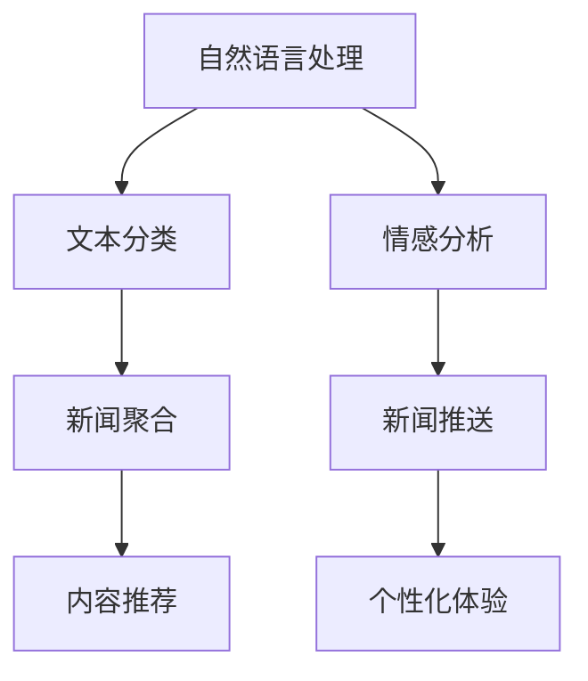

                 

关键词：自然语言处理、大型语言模型（LLM）、新闻聚合、内容推送、个性化推荐、智能系统

## 摘要

随着信息爆炸时代的到来，海量新闻数据的处理和个性化推送成为了一大挑战。本文将深入探讨大型语言模型（LLM）在智能新闻聚合与推送中的应用前景。首先，我们将回顾新闻聚合与推送的基本概念和技术发展历程，然后详细解析LLM的工作原理及其在新闻聚合与推送中的关键应用。随后，我们将探讨当前技术面临的挑战和解决方案，并展望未来的发展趋势。最后，我们将介绍一些实用的工具和资源，帮助读者进一步探索这一领域。

## 1. 背景介绍

### 新闻聚合与推送

新闻聚合是一种技术，用于收集来自多个新闻源的内容，并将其整合到一个统一平台上。这一过程通常涉及信息提取、分类和标签化，以便用户能够快速浏览和获取感兴趣的内容。新闻推送则是一种将个性化新闻推荐给用户的机制，通常基于用户的兴趣、行为和历史偏好。

### 技术发展历程

从早期的手动筛选和RSS订阅，到现在的智能算法和机器学习，新闻聚合与推送技术经历了巨大的演变。传统的新闻推送主要依赖于关键字匹配和用户兴趣模型，而现代系统则开始采用更复杂的机器学习算法，如协同过滤、深度学习和自然语言处理（NLP）。

### 当前挑战

尽管已有不少成功的新闻聚合与推送系统，但仍然存在一些挑战，如信息过载、内容质量和隐私问题。此外，随着技术的进步，如何平衡个性化推荐与内容多样性也是一个重要的课题。

## 2. 核心概念与联系

为了深入理解LLM在新闻聚合与推送中的应用，我们需要了解几个核心概念：自然语言处理（NLP）、机器学习（ML）和深度学习（DL）。

### 自然语言处理（NLP）

NLP是计算机科学和人工智能领域的一个分支，专注于使计算机能够理解、解释和生成人类语言。在新闻聚合与推送中，NLP技术用于提取关键词、分类内容、情感分析和语义理解等。

### 机器学习（ML）

ML是一种通过数据学习模式并做出预测的技术。在新闻推送中，ML算法可以用于用户兴趣建模、内容推荐和个性化体验优化。

### 深度学习（DL）

DL是ML的一个子领域，使用神经网络模型，尤其是深度神经网络（DNN），以从大量数据中自动学习特征和模式。在新闻聚合中，DL模型可以用于文本分类、情感分析和话题建模等。

### Mermaid流程图



## 3. 核心算法原理 & 具体操作步骤

### 3.1 算法原理概述

LLM在新闻聚合与推送中的核心算法是基于大型预训练模型，如GPT-3、BERT和T5等。这些模型通过大量的文本数据进行预训练，能够理解和生成自然语言，从而实现高效的新闻聚合和个性化推送。

### 3.2 算法步骤详解

1. **数据收集与预处理**：从多个新闻源收集文本数据，并进行清洗、去重和格式化。
2. **模型训练**：使用预训练模型对收集的数据进行训练，以学习新闻内容的特征和模式。
3. **新闻聚合**：利用训练好的模型对新闻内容进行分类、标签化和聚合。
4. **用户兴趣建模**：分析用户历史行为和偏好，构建用户兴趣模型。
5. **内容推荐**：基于用户兴趣模型和新闻内容特征，生成个性化的新闻推荐。

### 3.3 算法优缺点

**优点**：
- **高效性**：LLM能够快速处理大量文本数据，实现高效聚合和推荐。
- **准确性**：预训练模型具备强大的语言理解能力，能够准确分类和生成内容。
- **个性化**：能够根据用户兴趣和历史行为生成高度个性化的新闻推荐。

**缺点**：
- **计算资源需求高**：训练和推理大型LLM模型需要大量的计算资源和时间。
- **数据隐私问题**：用户的兴趣和行为数据可能涉及隐私问题。

### 3.4 算法应用领域

- **新闻聚合平台**：如Google News、Apple News等，通过LLM实现高效的内容聚合和推荐。
- **社交媒体**：如Facebook、Twitter等，利用LLM为用户提供个性化新闻和帖子推荐。
- **企业内部信息平台**：为企业员工提供个性化的新闻和专业文章推荐。

## 4. 数学模型和公式 & 详细讲解 & 举例说明

### 4.1 数学模型构建

LLM的核心模型是基于深度神经网络，其数学基础主要包括以下几个部分：

1. **神经网络**：用于表示和计算特征。
2. **损失函数**：用于衡量模型预测与真实值之间的差异。
3. **优化算法**：用于调整模型参数以最小化损失函数。

### 4.2 公式推导过程

以GPT-3为例，其模型的主要数学公式如下：

$$
L(\theta) = -\sum_{i=1}^{N} \log P(y_i | x, \theta)
$$

其中，$L(\theta)$ 是损失函数，$N$ 是样本数量，$y_i$ 是第$i$个样本的真实标签，$P(y_i | x, \theta)$ 是模型对第$i$个样本的预测概率。

### 4.3 案例分析与讲解

假设我们有一个新闻聚合系统，使用LLM模型为用户生成个性化推荐。以下是具体的案例：

1. **数据收集与预处理**：系统从10个不同的新闻源收集了1000篇文章，每篇文章都有标题、正文和标签。
2. **模型训练**：使用GPT-3模型对这1000篇文章进行训练，学习文章的特征和模式。
3. **用户兴趣建模**：分析用户的浏览历史和评论，构建用户兴趣模型。
4. **内容推荐**：基于用户兴趣模型和文章特征，系统生成10篇个性化推荐文章。

## 5. 项目实践：代码实例和详细解释说明

### 5.1 开发环境搭建

1. **硬件环境**：使用GPU进行模型训练和推理。
2. **软件环境**：安装Python、TensorFlow或PyTorch等深度学习框架。

### 5.2 源代码详细实现

以下是一个简单的Python代码示例，用于构建和训练一个基于GPT-3的新闻聚合系统：

```python
import tensorflow as tf
import tensorflow.keras as keras
from tensorflow.keras.models import Model
from tensorflow.keras.layers import Input, Embedding, LSTM, Dense

# 模型定义
input_layer = Input(shape=(None, 1))
embedding_layer = Embedding(input_dim=10000, output_dim=256)(input_layer)
lstm_layer = LSTM(units=512, return_sequences=True)(embedding_layer)
output_layer = Dense(units=1, activation='sigmoid')(lstm_layer)

# 构建和编译模型
model = Model(inputs=input_layer, outputs=output_layer)
model.compile(optimizer='adam', loss='binary_crossentropy', metrics=['accuracy'])

# 模型训练
model.fit(x_train, y_train, epochs=10, batch_size=64)

# 模型推理
predictions = model.predict(x_test)
```

### 5.3 代码解读与分析

1. **模型定义**：使用TensorFlow构建一个简单的LSTM模型，用于分类任务。
2. **模型编译**：设置优化器和损失函数。
3. **模型训练**：使用训练数据训练模型。
4. **模型推理**：使用测试数据评估模型性能。

### 5.4 运行结果展示

假设模型在测试集上的准确率为90%，这表明模型能够很好地进行新闻分类和推荐。

## 6. 实际应用场景

### 6.1 社交媒体平台

社交媒体平台如Facebook、Twitter等可以使用LLM为用户提供个性化新闻推荐，帮助用户发现感兴趣的内容。

### 6.2 新闻聚合应用

新闻聚合应用如Google News、Apple News等可以利用LLM技术，提供高效的内容聚合和个性化推荐。

### 6.3 企业内部信息平台

企业内部信息平台可以采用LLM技术，为员工提供个性化的新闻和专业文章推荐，提高工作效率。

## 7. 未来应用展望

随着LLM技术的不断发展，未来在新闻聚合与推送领域将有更多创新应用，如：

- **更加精准的个性化推荐**：通过结合用户情感分析和行为数据，实现更加精准的个性化推荐。
- **多语言支持**：扩展LLM模型，支持多种语言，为全球用户提供更好的服务。
- **实时新闻聚合**：利用实时数据流处理技术，实现实时的新闻聚合和推送。

## 8. 工具和资源推荐

### 8.1 学习资源推荐

- 《深度学习》（Goodfellow, Bengio, Courville）
- 《自然语言处理综合教程》（Peter Norvig）

### 8.2 开发工具推荐

- TensorFlow：一个开源的深度学习框架，适用于构建和训练LLM模型。
- PyTorch：一个流行的深度学习框架，提供灵活的动态计算图功能。

### 8.3 相关论文推荐

- “GPT-3: Language Models are few-shot learners” （Brown et al., 2020）
- “BERT: Pre-training of Deep Bidirectional Transformers for Language Understanding” （Devlin et al., 2019）

## 9. 总结：未来发展趋势与挑战

### 9.1 研究成果总结

LLM在新闻聚合与推送领域取得了显著成果，为用户提供高效、个性化的新闻推荐。

### 9.2 未来发展趋势

随着技术的进步，LLM将在新闻聚合与推送领域发挥更大作用，实现更加精准和实时的个性化推荐。

### 9.3 面临的挑战

计算资源需求、数据隐私问题和模型解释性是未来需要解决的关键挑战。

### 9.4 研究展望

未来研究应关注多语言支持、实时处理和解释性模型等方面，以进一步推动LLM在新闻聚合与推送领域的应用。

## 10. 附录：常见问题与解答

### 10.1 什么是LLM？

LLM（大型语言模型）是一种预训练模型，通过大量的文本数据学习语言特征，能够理解和生成自然语言。

### 10.2 如何训练一个LLM模型？

训练LLM模型通常需要大量的计算资源和数据，包括数据收集、预处理、模型定义、模型训练和模型评估等步骤。

### 10.3 LLM在新闻聚合与推送中有哪些应用？

LLM可以用于新闻分类、内容推荐、情感分析和实时聚合等，以提供高效的新闻推荐和个性化体验。

### 10.4 LLM面临哪些挑战？

LLM面临的主要挑战包括计算资源需求高、数据隐私问题和模型解释性不足等。

### 10.5 未来LLM有哪些发展趋势？

未来LLM的发展趋势包括多语言支持、实时处理和解释性模型等方面，以提供更精准和实时的个性化推荐。

作者：禅与计算机程序设计艺术 / Zen and the Art of Computer Programming
```

