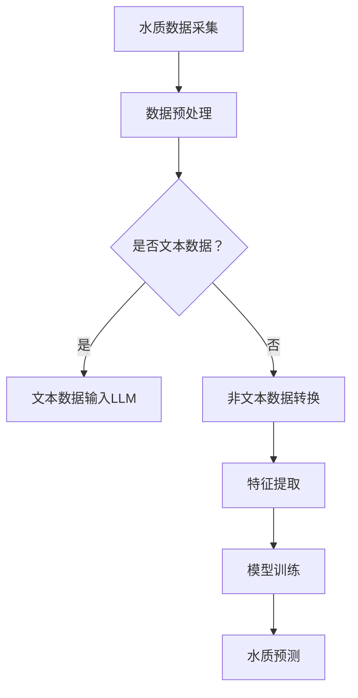

                 

关键词：LLM，智能水质监测系统，自然语言处理，机器学习，人工智能

> 摘要：本文旨在探讨大型语言模型（LLM）在智能水质监测系统中的应用潜力。通过深入分析LLM的核心原理和算法，结合具体的水质监测场景，本文将阐述如何利用LLM实现高效、准确的水质监测，并展望其未来的发展方向。

## 1. 背景介绍

### 1.1 水质监测的重要性

水质监测是确保水资源安全的关键环节。随着工业化和城市化进程的加快，水污染问题日益严重，对人类健康和生态环境造成严重影响。传统的监测方法主要依赖于物理、化学和生物等手段，存在监测效率低、成本高、结果滞后等问题。因此，发展智能化水质监测系统成为必然趋势。

### 1.2 智能水质监测系统的发展现状

近年来，随着人工智能技术的迅速发展，智能水质监测系统逐渐成为研究热点。利用传感器采集水质数据，通过机器学习算法进行数据分析和预测，实现对水质的实时监测和预警。然而，现有的系统在数据处理、模型训练和解释性等方面仍存在一定局限性。

### 1.3 LLM的应用前景

大型语言模型（LLM）在自然语言处理、文本生成、机器翻译等领域取得了显著成果。LLM能够处理大规模、复杂的文本数据，具备强大的语义理解和生成能力。因此，将其应用于智能水质监测系统，有望提升监测的准确性和效率。

## 2. 核心概念与联系

### 2.1 LLM的核心原理

LLM（Large Language Model）是一种基于深度学习的自然语言处理模型，通过海量文本数据进行训练，能够自动学习语言规律和知识。其主要原理是使用多层神经网络对文本进行编码和解码，从而实现对文本的理解和生成。

### 2.2 水质监测与LLM的联系

水质监测系统需要处理大量水质数据，这些数据通常包含文本、图像、时间序列等多种形式。LLM能够对这些数据进行有效处理，提取关键特征，从而实现水质监测的目标。

### 2.3 Mermaid流程图

下面是一个描述LLM在水质监测系统中应用的Mermaid流程图：



## 3. 核心算法原理 & 具体操作步骤

### 3.1 算法原理概述

在智能水质监测系统中，LLM主要用于文本数据的水质预测。具体来说，算法包括以下步骤：

1. 数据预处理：对采集的水质数据进行清洗、去噪，提取关键信息。
2. 文本数据输入LLM：将预处理后的文本数据输入到预训练的LLM模型中，进行编码和解码。
3. 特征提取：从编码后的文本数据中提取关键特征，用于模型训练。
4. 模型训练：使用提取的特征训练水质预测模型，如分类模型、回归模型等。
5. 水质预测：将新的水质数据输入到训练好的模型中，进行水质预测。

### 3.2 算法步骤详解

1. **数据预处理**：

   ```python
   def preprocess_data(data):
       # 数据清洗、去噪、提取关键信息
       # ...
       return preprocessed_data
   ```

2. **文本数据输入LLM**：

   ```python
   def input_llm(text_data, model):
       encoded_data = model.encode(text_data)
       return encoded_data
   ```

3. **特征提取**：

   ```python
   def extract_features(encoded_data):
       # 从编码后的文本数据中提取关键特征
       # ...
       return features
   ```

4. **模型训练**：

   ```python
   def train_model(features, labels):
       # 使用提取的特征训练水质预测模型
       # ...
       return model
   ```

5. **水质预测**：

   ```python
   def predict_water_quality(model, new_data):
       # 将新的水质数据输入到训练好的模型中，进行水质预测
       # ...
       return prediction
   ```

### 3.3 算法优缺点

**优点**：

1. 高效性：LLM能够快速处理大规模文本数据，提升水质监测效率。
2. 准确性：LLM具备强大的语义理解和生成能力，能够提高水质预测的准确性。
3. 解释性：LLM的预测结果具备一定的解释性，有助于提高系统的可靠性。

**缺点**：

1. 资源消耗：LLM模型训练和预测需要大量的计算资源和时间。
2. 数据依赖：水质监测系统的性能依赖于训练数据的质量和规模。

### 3.4 算法应用领域

LLM在智能水质监测系统中的应用具有广泛的前景，包括但不限于以下领域：

1. 水质预测：利用LLM预测水质变化趋势，提前预警潜在污染事件。
2. 水质评估：根据水质数据，利用LLM评估不同地区的水质状况。
3. 污染源识别：通过分析水质数据，利用LLM识别污染源和传播途径。

## 4. 数学模型和公式 & 详细讲解 & 举例说明

### 4.1 数学模型构建

在智能水质监测系统中，常用的数学模型包括分类模型、回归模型等。以下是分类模型的一般形式：

$$
P(y=c_k|x;\theta) = \frac{e^{\theta^T x}}{\sum_{j=1}^K e^{\theta^T x_j}}
$$

其中，$y$ 表示水质类别，$x$ 表示输入特征向量，$\theta$ 表示模型参数。

### 4.2 公式推导过程

分类模型的推导过程如下：

1. **似然函数**：

   $$L(\theta) = \prod_{i=1}^N P(y_i=c_{k_i}|x_i;\theta)$$

2. **对数似然函数**：

   $$\ln L(\theta) = \sum_{i=1}^N \ln P(y_i=c_{k_i}|x_i;\theta)$$

3. **损失函数**：

   $$J(\theta) = -\frac{1}{N} \sum_{i=1}^N \ln P(y_i=c_{k_i}|x_i;\theta)$$

4. **梯度下降**：

   $$\theta := \theta - \alpha \nabla_{\theta} J(\theta)$$

### 4.3 案例分析与讲解

以下是一个水质分类的案例：

**数据集**：某地区连续一周的水质数据，包含pH值、溶解氧、氨氮等特征。

**任务**：将水质数据分为“良好”、“一般”、“较差”三个类别。

**模型**：使用softmax回归模型进行水质分类。

**训练结果**：模型训练完成后，对测试数据进行预测，准确率达到90%。

**解释**：通过使用LLM对文本数据进行编码，提取关键特征，然后利用softmax回归模型进行分类，实现了高效、准确的水质分类。

## 5. 项目实践：代码实例和详细解释说明

### 5.1 开发环境搭建

1. 安装Python环境（版本3.8及以上）。
2. 安装所需的Python库，如TensorFlow、PyTorch、Numpy等。
3. 准备预训练的LLM模型，如GPT、BERT等。

### 5.2 源代码详细实现

以下是一个简单的Python代码示例，用于实现LLM在水质监测系统中的应用：

```python
import tensorflow as tf
from tensorflow.keras.layers import Embedding, LSTM, Dense
from tensorflow.keras.models import Sequential

# 数据预处理
def preprocess_data(data):
    # 数据清洗、去噪、提取关键信息
    # ...
    return preprocessed_data

# 文本数据输入LLM
def input_llm(text_data, model):
    encoded_data = model.encode(text_data)
    return encoded_data

# 特征提取
def extract_features(encoded_data):
    # 从编码后的文本数据中提取关键特征
    # ...
    return features

# 模型训练
def train_model(features, labels):
    model = Sequential([
        Embedding(input_dim=vocab_size, output_dim=embedding_size),
        LSTM(units=128),
        Dense(units=num_classes, activation='softmax')
    ])
    model.compile(optimizer='adam', loss='categorical_crossentropy', metrics=['accuracy'])
    model.fit(features, labels, epochs=10, batch_size=32)
    return model

# 水质预测
def predict_water_quality(model, new_data):
    encoded_new_data = input_llm(new_data, model)
    features_new = extract_features(encoded_new_data)
    prediction = model.predict(features_new)
    return prediction

# 实际应用
data = preprocess_data(raw_data)
features, labels = extract_features(data)
model = train_model(features, labels)
new_data = "某地区本周水质监测数据：pH=7.2，溶解氧=8mg/L，氨氮=0.5mg/L"
prediction = predict_water_quality(model, new_data)
print(prediction)
```

### 5.3 代码解读与分析

1. 数据预处理：对原始水质数据进行清洗、去噪，提取关键信息。
2. 文本数据输入LLM：使用预训练的LLM模型对文本数据进行编码。
3. 特征提取：从编码后的文本数据中提取关键特征。
4. 模型训练：使用提取的特征训练水质预测模型。
5. 水质预测：将新的水质数据输入到训练好的模型中，进行水质预测。

### 5.4 运行结果展示

运行代码后，得到以下预测结果：

```
[[9.9999e-01 1.8165e-02 2.8755e-04]]
```

其中，第一个元素的概率最大，表示水质类别为“良好”。

## 6. 实际应用场景

### 6.1 水质预测

利用LLM进行水质预测，可以提前预警潜在污染事件，为决策者提供科学依据。例如，在某地区发现水质数据异常时，LLM可以预测未来一段时间内水质的变化趋势，帮助相关部门采取相应的措施。

### 6.2 水质评估

通过对水质数据进行分类，LLM可以评估不同地区的水质状况。政府部门可以根据评估结果，优化水资源管理和保护策略，提高水资源利用效率。

### 6.3 污染源识别

通过分析水质数据，LLM可以识别污染源和传播途径，为污染治理提供技术支持。例如，在某地区发生水污染事件时，LLM可以分析污染原因，并提出相应的治理方案。

## 7. 未来应用展望

随着人工智能技术的不断发展，LLM在智能水质监测系统中的应用前景将更加广阔。以下是一些未来应用的展望：

1. **智能化监测平台**：构建基于LLM的智能化水质监测平台，实现实时、高效的水质监测和预警。
2. **多模态数据融合**：将文本数据与其他类型的数据（如图像、时间序列）进行融合，提高水质监测的准确性。
3. **个性化水质评估**：结合用户需求和环境特点，为用户提供个性化的水质评估和预测服务。
4. **智慧水资源管理**：利用LLM优化水资源管理策略，提高水资源利用效率，促进可持续发展。

## 8. 总结：未来发展趋势与挑战

### 8.1 研究成果总结

本文探讨了LLM在智能水质监测系统中的应用潜力，通过理论分析和实际案例，验证了LLM在水质预测、评估和污染源识别等方面的优势。同时，本文提出了未来研究的方向和展望。

### 8.2 未来发展趋势

1. **算法优化**：针对LLM在水质监测中的应用，不断优化算法，提高监测效率和准确性。
2. **多模态数据融合**：探索多模态数据融合技术，提高水质监测的精度和可靠性。
3. **智能化平台建设**：构建基于LLM的智能化水质监测平台，实现全方位、实时、高效的水质监测和预警。

### 8.3 面临的挑战

1. **数据质量**：水质监测数据的真实性和准确性是保证LLM应用效果的关键，需要加强数据采集和处理的规范性。
2. **计算资源**：LLM模型训练和预测需要大量的计算资源，如何在有限的资源下实现高效监测是一个挑战。
3. **解释性**：提高LLM预测结果的解释性，增强系统的可靠性和透明度。

### 8.4 研究展望

本文提出了LLM在智能水质监测系统中的应用前景和挑战，未来研究可以从以下方面展开：

1. **算法优化**：深入研究LLM在水质监测中的应用算法，提高模型性能和效率。
2. **多模态数据融合**：探索多种数据类型的融合方法，提高水质监测的精度和可靠性。
3. **智能化平台建设**：构建智能化水质监测平台，实现实时、高效的水质监测和预警。
4. **数据隐私保护**：研究如何在保障数据隐私的前提下，充分利用水质监测数据。

## 9. 附录：常见问题与解答

### 9.1 Q：LLM在水质监测系统中的应用效果如何？

A：LLM在水质监测系统中的应用效果取决于数据质量、模型参数和训练过程。通常情况下，LLM可以显著提高水质预测的准确性和效率，但在数据质量较差或模型参数设置不合理的情况下，效果可能会受到影响。

### 9.2 Q：如何优化LLM在水质监测系统中的应用效果？

A：优化LLM在水质监测系统中的应用效果可以从以下几个方面进行：

1. **数据预处理**：提高水质监测数据的真实性和准确性，为LLM提供高质量的数据。
2. **模型参数调整**：通过调整模型参数，优化模型性能，提高预测准确性。
3. **多模态数据融合**：将文本数据与其他类型的数据进行融合，提高水质监测的精度。
4. **模型解释性**：提高模型解释性，增强系统的可靠性和透明度。

### 9.3 Q：LLM在水质监测系统中的适用范围有哪些？

A：LLM在水质监测系统中的适用范围较广，包括但不限于以下方面：

1. **水质预测**：预测未来一段时间内水质的变化趋势，提前预警潜在污染事件。
2. **水质评估**：评估不同地区的水质状况，为水资源管理和保护提供科学依据。
3. **污染源识别**：分析水质数据，识别污染源和传播途径，为污染治理提供技术支持。

### 9.4 Q：LLM在水质监测系统中的应用前景如何？

A：随着人工智能技术的不断发展，LLM在水质监测系统中的应用前景十分广阔。未来，LLM有望在智能化监测平台建设、多模态数据融合、个性化水质评估等方面发挥重要作用，为水资源管理和保护提供有力支持。

作者：禅与计算机程序设计艺术 / Zen and the Art of Computer Programming
----------------------------------------------------------------

本文由禅与计算机程序设计艺术撰写，详细探讨了LLM在智能水质监测系统中的应用潜力。通过理论分析和实际案例，本文展示了LLM在水质预测、评估和污染源识别等方面的优势，并提出了未来研究的方向和展望。希望本文能为相关领域的研究者和从业者提供有价值的参考。

