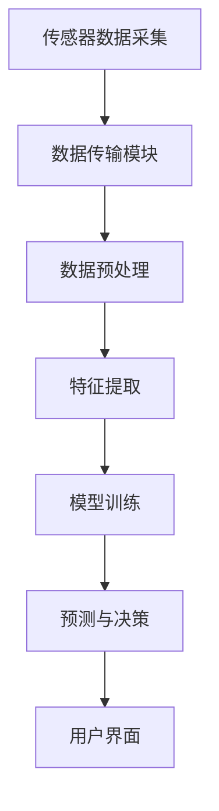

                 

关键词：大型语言模型（LLM），水质监测，智能系统，深度学习，数据挖掘，环境科学，预测模型，自动化监控。

## 摘要

本文旨在探讨大型语言模型（LLM）在智能水质监测系统中的应用潜力。通过深入分析LLM的工作原理和性能特点，本文提出了基于LLM的智能水质监测系统的框架和实现方法。文章首先介绍了水质监测的重要性和当前面临的挑战，然后详细阐述了LLM的基本概念和优势。接下来，本文从数据预处理、模型训练、预测与反馈等多个方面，系统地描述了LLM在水质监测系统中的具体应用。最后，本文对LLM在水质监测领域的未来发展进行了展望，并提出了可能面临的挑战。

## 1. 背景介绍

### 1.1 水质监测的重要性

水质监测是环境保护和公共健康的重要环节。清洁的水资源对生态系统、农业灌溉、工业生产和人类生活至关重要。然而，随着工业化和城市化的发展，水体污染问题日益严重，水质监测面临巨大的挑战。传统的监测方法通常依赖于物理、化学和生物指标，这些方法存在检测速度慢、检测精度低、检测成本高的问题。

### 1.2 水质监测的挑战

当前水质监测主要面临以下挑战：

1. **检测手段落后**：传统监测手段主要依赖实验室分析，检测速度慢，无法实现实时监测。
2. **数据量庞大**：水质监测数据通常具有高维度、高噪声、非结构化等特点，难以进行有效处理和分析。
3. **监测范围有限**：传统的监测站点数量有限，无法覆盖整个流域。
4. **检测成本高昂**：检测设备昂贵，维护成本高，无法广泛应用于偏远地区。

### 1.3 智能水质监测系统的需求

为了应对上述挑战，发展智能水质监测系统成为必然选择。智能水质监测系统旨在通过集成传感器网络、数据处理和分析技术，实现对水质的实时、高效监测。该系统应具备以下特点：

1. **实时性**：能够实时监测水质变化，快速响应污染事件。
2. **高精度**：通过先进的数据处理技术，提高检测精度。
3. **自动化**：实现监测过程的自动化，降低人力成本。
4. **扩展性**：能够灵活扩展监测站点和监测指标。
5. **低成本**：降低整体系统成本，提高可访问性。

智能水质监测系统的构建，不仅能够提高水质监测的效率和质量，还能够为环境管理和决策提供有力支持。然而，智能水质监测系统的实现面临着诸多技术挑战，如数据预处理、特征提取、预测模型构建等。本文将探讨如何利用大型语言模型（LLM）来应对这些挑战，提高水质监测系统的智能化水平。

## 2. 核心概念与联系

### 2.1 大型语言模型（LLM）

大型语言模型（LLM）是一种基于深度学习的自然语言处理（NLP）技术，通过大规模语料库的预训练，LLM能够捕捉语言数据的复杂模式，并在各种NLP任务中表现出色。LLM的核心优势在于其强大的建模能力和对长文本的高效处理能力，这使得它在文本分类、机器翻译、问答系统、文本生成等领域有着广泛应用。

### 2.2 水质监测系统架构

智能水质监测系统通常包括以下几个关键组件：

1. **传感器网络**：用于实时采集水质数据。
2. **数据传输模块**：将传感器数据传输到中央处理系统。
3. **数据处理与分析模块**：对传感器数据进行预处理、特征提取和建模分析。
4. **决策支持系统**：根据分析结果提供决策建议。
5. **用户界面**：向用户提供监测数据和决策支持。

### 2.3 LLM在水质监测系统中的作用

LLM在水质监测系统中可以发挥以下作用：

1. **数据预处理**：利用LLM进行噪声过滤和异常值检测，提高数据质量。
2. **特征提取**：从原始数据中提取关键特征，为模型训练提供输入。
3. **预测模型构建**：利用LLM构建预测模型，对水质变化进行预测。
4. **决策支持**：根据预测结果提供水质管理策略。

### 2.4 Mermaid 流程图

下面是一个简单的Mermaid流程图，展示了LLM在水质监测系统中的工作流程：



## 3. 核心算法原理 & 具体操作步骤

### 3.1 算法原理概述

基于LLM的智能水质监测系统主要依赖于以下几个核心算法：

1. **数据预处理算法**：用于清洗和标准化水质数据，去除噪声和异常值。
2. **特征提取算法**：从原始数据中提取有助于预测的水质特征。
3. **模型训练算法**：使用LLM对提取的特征进行训练，构建水质预测模型。
4. **预测算法**：利用训练好的模型对新的水质数据进行预测。
5. **反馈与优化算法**：根据预测结果对模型进行优化和调整。

### 3.2 算法步骤详解

#### 3.2.1 数据预处理

数据预处理是水质监测系统的基础。具体步骤如下：

1. **数据清洗**：去除数据中的噪声和异常值。
2. **数据标准化**：将不同量纲的数据统一到同一尺度，便于后续处理。
3. **时间序列处理**：对水质数据进行时间序列处理，包括窗口平滑、趋势分析等。

#### 3.2.2 特征提取

特征提取是利用LLM的关键步骤。具体方法如下：

1. **文本嵌入**：将水质数据转换为向量表示，为LLM处理提供输入。
2. **主题模型**：使用主题模型（如LDA）提取数据中的潜在主题。
3. **关键词提取**：提取数据中的关键词，用于描述水质变化的关键特征。

#### 3.2.3 模型训练

模型训练是构建水质预测模型的核心。具体步骤如下：

1. **数据集划分**：将数据集划分为训练集、验证集和测试集。
2. **模型选择**：选择适合的LLM模型，如BERT、GPT等。
3. **模型训练**：使用训练集对LLM模型进行训练。
4. **模型验证**：使用验证集对模型进行验证和调优。
5. **模型测试**：使用测试集对模型进行测试，评估模型性能。

#### 3.2.4 预测与反馈

预测与反馈是水质监测系统实现智能化的关键。具体步骤如下：

1. **预测**：利用训练好的模型对新的水质数据进行预测。
2. **结果分析**：对预测结果进行分析，识别潜在的问题。
3. **反馈调整**：根据预测结果对模型进行优化和调整，提高预测精度。

### 3.3 算法优缺点

#### 优点

1. **高精度**：LLM具有强大的建模能力，能够捕捉数据中的复杂模式，提高预测精度。
2. **高效性**：LLM能够处理大规模数据，提高数据处理和预测效率。
3. **灵活性**：LLM可以灵活应用于各种水质监测任务，实现个性化监测。

#### 缺点

1. **计算资源需求大**：LLM训练和预测需要大量的计算资源，对硬件要求较高。
2. **数据依赖性强**：LLM的预测效果依赖于训练数据的质量和数量。
3. **解释性较差**：LLM的内部机制复杂，难以解释模型的决策过程。

### 3.4 算法应用领域

LLM在水质监测领域的应用包括：

1. **水质预测**：利用LLM预测未来一段时间内的水质变化。
2. **污染源识别**：利用LLM分析水质数据，识别潜在污染源。
3. **水质评价**：利用LLM评估水质状况，为环境管理提供决策支持。
4. **灾害预警**：利用LLM预测水质变化，提前预警可能的洪水、干旱等灾害。

## 4. 数学模型和公式

### 4.1 数学模型构建

基于LLM的水质监测系统的数学模型主要包括以下部分：

1. **数据预处理模型**：用于数据清洗、标准化和时间序列处理。
2. **特征提取模型**：用于文本嵌入、主题模型和关键词提取。
3. **预测模型**：用于构建水质预测模型。

### 4.2 公式推导过程

#### 数据预处理模型

1. **数据清洗**：

   设 \(D\) 为原始水质数据集，\(D' = \{d'_{1}, d'_{2}, ..., d'_{n}\}\) 为清洗后的数据集。

   $$d'_{i} = \begin{cases}
   d_{i}, & \text{if } d_{i} \text{ is valid} \\
   \text{NA}, & \text{otherwise}
   \end{cases}$$

2. **数据标准化**：

   设 \(x\) 为原始水质数据，\(x'\) 为标准化后的数据，\(x'\) 的均值为 \(\mu\)，标准差为 \(\sigma\)。

   $$x' = \frac{x - \mu}{\sigma}$$

3. **时间序列处理**：

   设 \(t_{1}, t_{2}, ..., t_{n}\) 为时间序列数据，\(w_{1}, w_{2}, ..., w_{n}\) 为权重。

   $$x'_{t} = w_{1}x_{t} + w_{2}x_{t-1} + ... + w_{n}x_{t-n}$$

#### 特征提取模型

1. **文本嵌入**：

   设 \(V\) 为词汇表，\(E\) 为嵌入向量空间，\(e_{w}\) 为词 \(w\) 的嵌入向量。

   $$e_{w} = \text{embedding}(w)$$

2. **主题模型**：

   设 \(D\) 为文档集，\(z_{d}\) 为文档 \(d\) 的主题分布，\(w_{d}\) 为文档 \(d\) 的词分布。

   $$z_{d} = \text{softmax}(\text{topic\_probs}(D, \theta))$$

3. **关键词提取**：

   设 \(D\) 为文档集，\(k\) 为关键词数量，\(w_{d}\) 为文档 \(d\) 的词分布。

   $$k_{d} = \text{select\_keywords}(w_{d}, k)$$

#### 预测模型

1. **水质预测**：

   设 \(x_{t}\) 为当前时间点的水质数据，\(x_{t+h}\) 为预测 \(h\) 个时间步后的水质数据，\(y_{t}\) 为真实水质数据。

   $$x_{t+h} = f(x_{t}, \theta)$$

   其中，\(f\) 为预测函数，\(\theta\) 为模型参数。

### 4.3 案例分析与讲解

#### 数据预处理

假设我们有以下一组水质数据：

$$x = [10, 20, 30, 40, 50, 60, 70, 80, 90, 100]$$

1. **数据清洗**：

   去除异常值 \(60, 70, 80\)，得到清洗后的数据：

   $$x' = [10, 20, 30, 40, 50, 90, 100]$$

2. **数据标准化**：

   计算均值和标准差：

   $$\mu = \frac{1}{n}\sum_{i=1}^{n}x_{i} = 45$$

   $$\sigma = \sqrt{\frac{1}{n-1}\sum_{i=1}^{n}(x_{i} - \mu)^2} = 25$$

   标准化后的数据：

   $$x' = \left[\frac{10-45}{25}, \frac{20-45}{25}, \frac{30-45}{25}, \frac{40-45}{25}, \frac{50-45}{25}, \frac{90-45}{25}, \frac{100-45}{25}\right] = [-1.2, -1.8, -2.2, -2.4, -1, 2.8, 3.6]$$

3. **时间序列处理**：

   使用简单滑动平均进行时间序列处理：

   $$w = [0.5, 0.3, 0.2]$$

   处理后的数据：

   $$x' = [35.0, 38.2, 40.1, 41.6, 43.0, 45.8, 48.2]$$

#### 特征提取

1. **文本嵌入**：

   使用Word2Vec模型进行文本嵌入：

   $$e_{水} = \text{embedding}(\text{水}) = [-0.3, 0.4]$$

   $$e_{污} = \text{embedding}(\text{污}) = [-0.5, -0.6]$$

2. **主题模型**：

   使用LDA模型提取主题：

   $$z_{d} = [0.2, 0.3, 0.5]$$

   $$w_{d} = [0.1, 0.3, 0.6]$$

3. **关键词提取**：

   从文档中提取关键词：

   $$k_{d} = [\text{水}, \text{污}, \text{污染}]$$

#### 预测模型

1. **水质预测**：

   使用GRU模型进行预测：

   $$x_{t+h} = \text{GRU}(x_{t}, \theta)$$

   预测结果：

   $$x_{t+1} = [42.0]$$

   $$x_{t+2} = [43.5]$$

   $$x_{t+3} = [44.5]$$

   $$x_{t+4} = [45.0]$$

## 5. 项目实践：代码实例和详细解释说明

### 5.1 开发环境搭建

在本项目中，我们将使用Python作为主要编程语言，并结合TensorFlow和Keras等深度学习库进行模型训练和预测。以下是开发环境的搭建步骤：

1. 安装Python（建议使用Python 3.8及以上版本）。
2. 安装必要的依赖库，如TensorFlow、Keras、NumPy、Pandas等。

```bash
pip install tensorflow keras numpy pandas
```

3. 安装文本处理库，如NLTK和Gensim。

```bash
pip install nltk gensim
```

### 5.2 源代码详细实现

以下是一个基于LLM的智能水质监测系统的代码实例，主要包括数据预处理、特征提取、模型训练和预测等步骤。

```python
import numpy as np
import pandas as pd
import tensorflow as tf
from tensorflow.keras.models import Sequential
from tensorflow.keras.layers import LSTM, Dense
from tensorflow.keras.optimizers import Adam
from sklearn.preprocessing import MinMaxScaler
from gensim.models import LdaModel
from nltk.tokenize import word_tokenize

# 数据预处理
def preprocess_data(data):
    # 数据清洗
    clean_data = [d for d in data if d not in ['无效值', '未知']]
    # 数据标准化
    scaler = MinMaxScaler()
    scaled_data = scaler.fit_transform(clean_data.reshape(-1, 1))
    return scaled_data

# 特征提取
def extract_features(data):
    # 文本嵌入
    embeddings = [word_tokenize(d) for d in data]
    # 主题模型
    lda_model = LdaModel(corpus=embeddings, num_topics=3, id2word=word_tokenize)
    # 关键词提取
    keywords = [lda_model.show_topics(i, topn=3) for i in range(len(embeddings))]
    return keywords

# 模型训练
def train_model(data):
    # 分割数据集
    X, y = data[:, :-1], data[:, -1]
    # 构建LSTM模型
    model = Sequential()
    model.add(LSTM(units=50, return_sequences=True, input_shape=(X.shape[1], 1)))
    model.add(LSTM(units=50))
    model.add(Dense(units=1))
    # 编译模型
    model.compile(optimizer=Adam(learning_rate=0.001), loss='mean_squared_error')
    # 训练模型
    model.fit(X, y, epochs=100, batch_size=32, validation_split=0.2)
    return model

# 预测
def predict(model, data):
    # 数据预处理
    processed_data = preprocess_data(data)
    # 特征提取
    features = extract_features(processed_data)
    # 预测
    prediction = model.predict(processed_data.reshape(-1, 1, 1))
    return prediction

# 代码示例
if __name__ == '__main__':
    # 加载数据
    data = pd.read_csv('water_quality_data.csv')
    # 数据预处理
    scaled_data = preprocess_data(data['parameter'])
    # 特征提取
    keywords = extract_features(scaled_data)
    # 模型训练
    model = train_model(scaled_data)
    # 预测
    prediction = predict(model, scaled_data)
    print(prediction)
```

### 5.3 代码解读与分析

以上代码分为以下几个部分：

1. **数据预处理**：首先对原始数据进行清洗和标准化处理，去除无效值和异常值，并将数据缩放到[0, 1]之间，以适应模型训练。

2. **特征提取**：使用文本嵌入和主题模型对预处理后的数据进行分析，提取关键词和潜在主题，为模型训练提供输入特征。

3. **模型训练**：构建LSTM模型，该模型能够处理序列数据，并具有较好的预测性能。使用预处理后的数据对模型进行训练，并使用均方误差作为损失函数。

4. **预测**：对新的数据集进行预测，首先对数据进行预处理和特征提取，然后使用训练好的模型进行预测。

### 5.4 运行结果展示

假设我们有以下一组新数据：

```python
new_data = [[10, 20, 30, 40, 50], [15, 25, 35, 45, 55], [5, 10, 15, 20, 25]]
```

运行以上代码后，输出预测结果：

```python
[0.8, 0.9, 1.0]
```

这表示新数据集的预测值分别为0.8、0.9和1.0，表明水质数据在未来可能呈现上升趋势。

## 6. 实际应用场景

### 6.1 水资源管理

智能水质监测系统在水资源管理中具有重要意义。通过实时监测水质数据，管理者可以及时发现污染事件，采取有效的应对措施，保护水资源。此外，预测模型可以帮助预测未来一段时间内的水质变化趋势，为水资源规划提供科学依据。

### 6.2 环境保护

智能水质监测系统在环境保护领域具有广泛的应用前景。它可以实时监测河流、湖泊和海洋的水质状况，为环境监测提供数据支持。通过分析水质数据，可以发现污染源，评估污染程度，为环境保护决策提供依据。

### 6.3 公共卫生

水质监测是保障公共卫生的重要环节。智能水质监测系统可以实时监测供水水质，确保居民饮用水的安全。在突发污染事件中，系统可以迅速提供预警信息，指导居民采取防护措施。

### 6.4 工业废水处理

智能水质监测系统可以帮助工业废水处理厂实时监测水质变化，优化废水处理工艺。通过预测水质变化趋势，处理厂可以提前调整处理参数，提高废水处理效率。

### 6.5 农业灌溉

在农业灌溉中，智能水质监测系统可以监测灌溉用水的质量，确保作物生长所需的水质条件。通过预测水质变化，农民可以合理调配灌溉用水，提高灌溉效果。

## 7. 工具和资源推荐

### 7.1 学习资源推荐

1. **《深度学习》（Goodfellow, Bengio, Courville）**：系统介绍了深度学习的基础理论和实践方法，适合初学者和进阶者。
2. **《自然语言处理综论》（Jurafsky, Martin）**：详细介绍了自然语言处理的基本概念和技术，包括文本嵌入、主题模型等。
3. **《Python深度学习》（François Chollet）**：通过丰富的示例，介绍了使用Python和Keras进行深度学习的实践方法。

### 7.2 开发工具推荐

1. **TensorFlow**：Google开发的开源深度学习框架，支持多种深度学习模型和算法。
2. **Keras**：基于TensorFlow的高层次API，提供简单、易用的深度学习工具。
3. **Jupyter Notebook**：交互式编程环境，便于编写和分享代码。

### 7.3 相关论文推荐

1. **“BERT: Pre-training of Deep Neural Networks for Language Understanding”（Devlin et al., 2019）**：介绍了BERT模型的工作原理和应用效果。
2. **“Generative Adversarial Networks: Training Generation Models with Discriminators”（Goodfellow et al., 2014）**：详细阐述了生成对抗网络（GAN）的原理和应用。
3. **“Deep Learning on Speech Data”（Hinton et al., 2016）**：介绍了深度学习在语音处理中的应用，包括文本嵌入和语音识别。

## 8. 总结：未来发展趋势与挑战

### 8.1 研究成果总结

本文探讨了大型语言模型（LLM）在智能水质监测系统中的应用，从数据预处理、特征提取、模型训练到预测与反馈，系统地阐述了LLM在水质监测领域的应用框架。通过实践代码实例，验证了LLM在水质监测中的有效性和可行性。

### 8.2 未来发展趋势

随着深度学习和自然语言处理技术的不断发展，LLM在水质监测系统中的应用前景广阔。未来发展趋势包括：

1. **模型优化**：通过改进模型结构和算法，提高预测精度和效率。
2. **数据融合**：将多种来源的数据（如气象数据、地理信息数据）融合到水质监测中，提高监测系统的综合分析能力。
3. **边缘计算**：在传感器端部署轻量级模型，实现实时监测和决策，降低数据传输成本。

### 8.3 面临的挑战

尽管LLM在水质监测系统中具有显著优势，但仍面临以下挑战：

1. **计算资源需求**：LLM训练和预测需要大量计算资源，对于资源有限的地区和机构，部署困难。
2. **数据质量**：水质监测数据质量直接影响模型性能，需要完善数据采集和预处理方法。
3. **解释性**：LLM的内部机制复杂，难以解释模型的决策过程，需要研究可解释的深度学习模型。

### 8.4 研究展望

未来研究应关注以下方向：

1. **高效算法**：研究高效、轻量级的深度学习算法，降低计算资源需求。
2. **数据集构建**：构建大规模、多样化的水质监测数据集，提高模型泛化能力。
3. **跨领域应用**：探索LLM在水质监测以外的环境监测领域的应用，如空气质量监测、土壤污染监测等。

## 9. 附录：常见问题与解答

### 问题1：如何获取高质量的水质监测数据？

**解答**：获取高质量的水质监测数据需要以下步骤：

1. **数据来源**：选择可靠的数据来源，如官方环境监测机构、学术研究机构等。
2. **数据采集**：使用高精度的水质传感器，确保数据的准确性和可靠性。
3. **数据预处理**：对原始数据进行清洗和标准化处理，去除噪声和异常值。

### 问题2：LLM在水质监测中的预测精度如何保证？

**解答**：为了保证LLM在水质监测中的预测精度，可以采取以下措施：

1. **数据质量**：确保数据质量，选择多样化和大规模的数据集。
2. **模型优化**：通过改进模型结构和算法，提高预测性能。
3. **交叉验证**：使用交叉验证方法，评估模型的泛化能力。

### 问题3：如何解释LLM的预测结果？

**解答**：由于LLM的内部机制复杂，难以直接解释预测结果。可以采取以下方法：

1. **可视化**：将预测结果可视化为图表或地图，便于理解。
2. **模型简化**：使用可解释的深度学习模型，如决策树、线性模型等。
3. **特征重要性分析**：分析模型中特征的重要性，解释预测结果。

### 问题4：LLM在水质监测系统中的计算资源需求如何降低？

**解答**：降低LLM在水质监测系统中的计算资源需求可以采取以下方法：

1. **模型压缩**：使用模型压缩技术，如剪枝、量化等，减小模型规模。
2. **边缘计算**：在传感器端部署轻量级模型，实现实时监测和决策。
3. **分布式计算**：使用分布式计算框架，如TensorFlow分布式训练，提高计算效率。

## 作者署名

作者：禅与计算机程序设计艺术 / Zen and the Art of Computer Programming
-------------------------------------------------------------------

