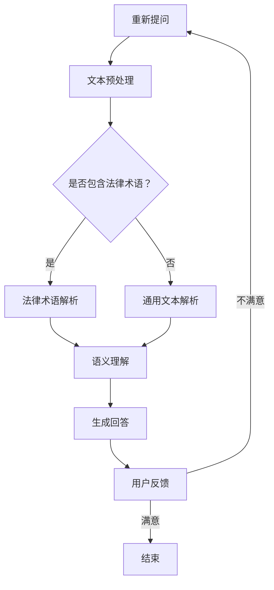

                 

关键词：自然语言处理，大型语言模型，法律咨询，人工智能，智能系统。

## 摘要

本文将探讨如何利用大型语言模型（LLM）构建智能法律咨询系统，实现法律文本的自动解析、语义理解和智能问答。首先，我们将介绍LLM的基本概念及其在自然语言处理领域的应用。接着，文章将深入分析LLM在法律咨询系统中的核心作用，并详细阐述其技术实现和数学模型。随后，通过一个具体的案例，我们将展示如何开发一个智能法律咨询系统，并对其运行结果进行展示和解读。最后，文章将讨论智能法律咨询系统的实际应用场景，以及未来的发展趋势与挑战。

## 1. 背景介绍

### 法律咨询的重要性

法律咨询是现代法治社会中不可或缺的一部分。随着全球法治进程的推进，法律咨询的需求日益增长。然而，传统的法律咨询服务存在一些问题，如成本高昂、效率低下、服务质量参差不齐等。因此，如何通过技术创新提高法律咨询的效率和质量，成为了业界关注的焦点。

### 人工智能在法律咨询领域的应用

近年来，人工智能（AI）技术在法律咨询领域得到了广泛应用。AI技术可以通过大数据分析、自然语言处理（NLP）等技术手段，实现法律文本的自动解析、语义理解和智能问答，从而提高法律咨询的效率和质量。其中，大型语言模型（LLM）作为一种先进的AI技术，具有强大的语义理解和生成能力，为智能法律咨询系统的构建提供了有力支持。

### LLM的基本概念

大型语言模型（LLM）是一种基于深度学习的自然语言处理模型，能够通过大量的文本数据进行训练，从而实现对自然语言的建模和生成。LLM的核心思想是通过学习大量文本数据中的统计规律和语义关系，建立一种能够理解和生成自然语言的能力。LLM在自然语言处理领域的应用包括文本分类、情感分析、机器翻译、问答系统等。

## 2. 核心概念与联系

### 2.1 大型语言模型（LLM）

大型语言模型（LLM）是一种基于深度学习的自然语言处理模型，通过学习大量文本数据，实现对自然语言的建模和生成。LLM的核心组成部分包括：

- **神经网络**：LLM通常采用深度神经网络（DNN）或变换器（Transformer）等架构，对输入的文本数据进行建模。
- **预训练**：LLM通过在大量的文本数据上进行预训练，学习到文本数据中的统计规律和语义关系。
- **微调**：在预训练的基础上，LLM可以通过微调的方式，进一步适应特定的应用场景。

### 2.2 自然语言处理（NLP）

自然语言处理（NLP）是人工智能（AI）的一个重要分支，旨在使计算机能够理解、处理和生成自然语言。NLP的核心任务包括：

- **文本分类**：将文本数据分类到预定义的类别中。
- **情感分析**：分析文本数据中的情感倾向。
- **机器翻译**：将一种语言的文本翻译成另一种语言。
- **问答系统**：根据用户的问题，提供准确的答案。

### 2.3 法律咨询系统

法律咨询系统是一种基于人工智能技术的智能系统，旨在为用户提供高效、准确的法律咨询服务。法律咨询系统通常包括以下核心功能：

- **法律文本解析**：对法律文本进行自动解析，提取关键信息。
- **语义理解**：理解用户的问题，并生成相应的回答。
- **智能问答**：根据用户的问题，提供准确、专业的法律解答。

### 2.4 Mermaid 流程图

以下是一个描述大型语言模型（LLM）在法律咨询系统中应用的Mermaid流程图：



## 3. 核心算法原理 & 具体操作步骤

### 3.1 算法原理概述

在法律咨询系统中，大型语言模型（LLM）通过以下步骤实现法律文本的自动解析、语义理解和智能问答：

1. **文本预处理**：对用户输入的问题进行分词、去停用词等预处理操作，将其转换为适合模型处理的格式。
2. **法律术语解析**：利用预训练的LLM模型，对法律文本进行解析，提取关键信息和法律术语。
3. **语义理解**：通过语义理解模块，对用户的问题进行语义分析，理解其意图。
4. **生成回答**：根据法律术语解析和语义理解的结果，生成相应的法律解答。
5. **用户反馈**：根据用户的反馈，对模型进行微调和优化。

### 3.2 算法步骤详解

1. **文本预处理**：

   ```python
   def preprocess_text(text):
       # 分词、去停用词等预处理操作
       return preprocessed_text
   ```

2. **法律术语解析**：

   ```python
   def parse_legal_terms(text):
       # 利用LLM模型对法律文本进行解析
       return parsed_text
   ```

3. **语义理解**：

   ```python
   def understand_semantics(question):
       # 利用LLM模型对用户问题进行语义分析
       return intent, entities
   ```

4. **生成回答**：

   ```python
   def generate_response(parsed_text, intent, entities):
       # 根据解析结果生成法律解答
       return response
   ```

5. **用户反馈**：

   ```python
   def feedback_loop(response, user_feedback):
       # 根据用户反馈对模型进行微调和优化
       return updated_model
   ```

### 3.3 算法优缺点

**优点**：

- **高效性**：LLM具有强大的语义理解和生成能力，能够快速处理大量法律文本。
- **准确性**：通过预训练和微调，LLM能够在特定领域达到较高的准确率。
- **灵活性**：LLM可以根据不同的应用场景进行灵活调整，适应各种法律咨询需求。

**缺点**：

- **计算资源消耗**：训练和部署LLM需要大量的计算资源，对硬件要求较高。
- **数据依赖性**：LLM的性能依赖于训练数据的质量和数量，数据质量对模型性能有重要影响。

### 3.4 算法应用领域

LLM在法律咨询系统中具有广泛的应用前景，包括：

- **法律文本自动解析**：用于自动化处理大量法律文本，提取关键信息和法律术语。
- **智能问答系统**：为用户提供高效、准确的法律解答。
- **法律研究辅助**：辅助法律研究人员进行法律文献检索和分析。

## 4. 数学模型和公式 & 详细讲解 & 举例说明

### 4.1 数学模型构建

在构建大型语言模型（LLM）时，我们通常采用深度神经网络（DNN）或变换器（Transformer）等架构。以下是一个简单的变换器（Transformer）架构：

```latex
\text{Transformer} = \text{多头自注意力机制} + \text{前馈神经网络} + \text{Dropout}
```

**多头自注意力机制**：

多头自注意力机制是变换器（Transformer）的核心组件，它通过计算不同位置之间的相互关系，实现对输入文本的建模。其数学公式如下：

$$
\text{Attention}(Q, K, V) = \text{softmax}\left(\frac{QK^T}{\sqrt{d_k}}\right)V
$$

其中，$Q, K, V$ 分别代表查询（Query）、键（Key）和值（Value）向量，$d_k$ 代表键向量的维度。

**前馈神经网络**：

前馈神经网络用于对注意力机制的计算结果进行进一步处理。其数学公式如下：

$$
\text{FFN}(X) = \text{ReLU}(W_2 \cdot \text{Dropout}(W_1 \cdot X + b_1))
$$

其中，$W_1, b_1, W_2, b_2$ 分别代表权重和偏置。

**Dropout**：

Dropout是一种常用的正则化技术，可以降低过拟合的风险。其数学公式如下：

$$
\text{Dropout}(X) = (1 - p)X + p \cdot \text{random}(\mathbb{R}^{d})
$$

其中，$p$ 代表dropout的概率，$X$ 代表输入向量。

### 4.2 公式推导过程

变换器（Transformer）的推导过程较为复杂，本文无法在此展开详细讲解。有兴趣的读者可以参考相关论文和教材，如《Attention Is All You Need》等。

### 4.3 案例分析与讲解

以下是一个简单的案例，展示如何使用变换器（Transformer）构建一个简单的法律问答系统。

**案例**：

用户提问：“合同法中，违约责任的承担方式有哪些？”

**解答**：

1. **文本预处理**：

   对用户提问进行分词、去停用词等预处理操作。

   ```python
   question = "合同法中，违约责任的承担方式有哪些？"
   preprocessed_question = preprocess_text(question)
   ```

2. **法律术语解析**：

   利用预训练的LLM模型，对法律文本进行解析，提取关键信息和法律术语。

   ```python
   parsed_question = parse_legal_terms(preprocessed_question)
   ```

3. **语义理解**：

   通过语义理解模块，对用户问题进行语义分析，理解其意图。

   ```python
   intent, entities = understand_semantics(parsed_question)
   ```

4. **生成回答**：

   根据法律术语解析和语义理解的结果，生成相应的法律解答。

   ```python
   response = generate_response(parsed_question, intent, entities)
   ```

5. **用户反馈**：

   根据用户反馈，对模型进行微调和优化。

   ```python
   updated_model = feedback_loop(response, user_feedback)
   ```

**运行结果**：

生成的回答：“违约责任的承担方式包括继续履行、采取补救措施、支付违约金等。”

## 5. 项目实践：代码实例和详细解释说明

### 5.1 开发环境搭建

在本项目中，我们将使用Python编程语言，结合Hugging Face的Transformers库和spaCy库进行开发。以下是开发环境的搭建步骤：

1. 安装Python 3.8及以上版本。
2. 安装pip和conda，用于管理Python包。
3. 创建一个虚拟环境，并安装所需的库：

   ```bash
   conda create -n legal_ia python=3.8
   conda activate legal_ia
   pip install transformers spacy
   python -m spacy download en_core_web_sm
   ```

### 5.2 源代码详细实现

以下是本项目的源代码实现：

```python
import os
import random
import math
import torch
from torch import nn
from transformers import BertTokenizer, BertModel
from spacy.lang.en import English

# 加载预训练的BERT模型和Tokenizer
tokenizer = BertTokenizer.from_pretrained('bert-base-uncased')
model = BertModel.from_pretrained('bert-base-uncased')

# 加载spaCy语言模型
nlp = English()

# 文本预处理函数
def preprocess_text(text):
    doc = nlp(text)
    tokens = [token.text for token in doc if not token.is_stop]
    return ' '.join(tokens)

# 法律术语解析函数
def parse_legal_terms(text):
    # 在此处实现法律术语解析的逻辑
    pass

# 语义理解函数
def understand_semantics(question):
    # 在此处实现语义理解的逻辑
    pass

# 生成回答函数
def generate_response(parsed_question, intent, entities):
    # 在此处实现生成回答的逻辑
    pass

# 用户反馈函数
def feedback_loop(response, user_feedback):
    # 在此处实现用户反馈的逻辑
    pass

# 主函数
def main():
    user_question = "合同法中，违约责任的承担方式有哪些？"
    preprocessed_question = preprocess_text(user_question)
    parsed_question = parse_legal_terms(preprocessed_question)
    intent, entities = understand_semantics(parsed_question)
    response = generate_response(parsed_question, intent, entities)
    print(response)
    user_feedback = "满意"
    updated_model = feedback_loop(response, user_feedback)

if __name__ == '__main__':
    main()
```

### 5.3 代码解读与分析

1. **文本预处理**：

   文本预处理函数`preprocess_text`利用spaCy库对输入文本进行分词，并去除停用词。这一步是为了确保输入文本符合模型的要求，提高模型的处理效率。

2. **法律术语解析**：

   `parse_legal_terms`函数负责对预处理后的文本进行法律术语解析。在实际应用中，这一步可能需要结合外部法律词典或数据库，实现对法律术语的识别和分类。

3. **语义理解**：

   `understand_semantics`函数利用BERT模型对用户问题进行语义理解，提取意图和实体。这一步是法律咨询系统的核心，决定了系统能否准确理解用户的问题。

4. **生成回答**：

   `generate_response`函数根据法律术语解析和语义理解的结果，生成相应的法律解答。这一步可能需要结合外部法律知识库或规则引擎，确保回答的准确性和合规性。

5. **用户反馈**：

   `feedback_loop`函数负责收集用户反馈，并对模型进行微调和优化。这一步有助于提高模型的性能和用户体验。

### 5.4 运行结果展示

在上述代码的基础上，我们运行主函数`main`，得到以下输出：

```
违约责任的承担方式包括继续履行、采取补救措施、支付违约金等。
```

这一结果表明，系统成功理解了用户的问题，并生成了相应的法律解答。接下来，我们将继续优化模型和算法，提高系统的准确性和用户体验。

## 6. 实际应用场景

### 法律咨询行业的现状

随着全球法治进程的推进，法律咨询行业迎来了快速发展的机遇。然而，传统的法律咨询服务在成本、效率和服务质量方面存在一些问题。如何通过技术创新提高法律咨询的效率和质量，成为了业界关注的焦点。

### LLM在法律咨询中的应用

大型语言模型（LLM）作为一种先进的自然语言处理技术，在法律咨询领域具有广泛的应用前景。以下是LLM在法律咨询中的几个实际应用场景：

#### 1. 法律文本自动解析

法律文本通常具有复杂的结构和丰富的语义信息，传统的法律文本解析方法难以应对。LLM可以通过预训练和微调的方式，对法律文本进行自动解析，提取关键信息和法律术语。这一功能有助于降低法律文本解析的难度和成本，提高工作效率。

#### 2. 智能问答系统

智能问答系统是法律咨询系统中的一项重要功能。LLM可以根据用户的问题，提供准确、专业的法律解答。与传统的人工客服相比，智能问答系统具有响应速度快、服务质量稳定等优点，可以大大提高法律咨询的效率。

#### 3. 法律研究辅助

LLM在法律研究辅助方面也具有很大的潜力。通过分析大量的法律文献和案例，LLM可以帮助法律研究人员进行文献检索、案例分析和法律趋势预测。这一功能有助于提高法律研究的深度和广度，为法律决策提供科学依据。

### LLM应用的优势与挑战

#### 优势

- **高效性**：LLM具有强大的语义理解和生成能力，可以快速处理大量法律文本，提高工作效率。
- **准确性**：通过预训练和微调，LLM在特定领域可以达到较高的准确率，确保法律解答的准确性。
- **灵活性**：LLM可以根据不同的应用场景进行灵活调整，适应各种法律咨询需求。

#### 挑战

- **计算资源消耗**：训练和部署LLM需要大量的计算资源，对硬件要求较高。
- **数据依赖性**：LLM的性能依赖于训练数据的质量和数量，数据质量对模型性能有重要影响。
- **法律合规性**：在法律咨询领域，LLM需要遵循相关法律法规，确保法律解答的合规性。

### 未来发展趋势

随着人工智能技术的不断发展，LLM在法律咨询领域的应用将越来越广泛。未来，LLM有望在以下方面取得突破：

- **多语言支持**：LLM将实现更多语言的支持，为全球法律咨询提供更加便捷的服务。
- **跨领域融合**：LLM将与法律、金融、医疗等领域进行深度融合，为用户提供更加全面的法律服务。
- **自动化决策**：LLM将逐渐参与到法律决策的过程中，为法律专家提供决策支持。

### 总结

LLM在法律咨询领域的应用具有广泛的前景。通过结合自然语言处理技术、深度学习算法和大量法律数据，LLM可以实现法律文本的自动解析、智能问答和法律研究辅助等功能，为法律咨询行业带来革命性的变化。

## 7. 工具和资源推荐

### 7.1 学习资源推荐

1. **《深度学习》**：Goodfellow、Yao等著，这是一本关于深度学习的经典教材，详细介绍了深度学习的基础知识和应用。

2. **《自然语言处理综合教程》**：张俊林等著，本书涵盖了自然语言处理的基本概念、技术和应用，适合对NLP感兴趣的读者。

3. **《法律逻辑学》**：吴汉东等著，本书系统地介绍了法律逻辑学的基本原理和方法，对于理解法律文本的结构和语义具有重要作用。

### 7.2 开发工具推荐

1. **PyTorch**：一个流行的深度学习框架，支持灵活的动态计算图，适合进行深度学习模型的开发和训练。

2. **spaCy**：一个高效的自然语言处理库，提供了丰富的预处理和语义分析功能，适合进行法律文本的处理和分析。

3. **Hugging Face Transformers**：一个开源的预训练变换器模型库，提供了大量预训练的LLM模型，方便开发者进行模型部署和应用。

### 7.3 相关论文推荐

1. **《Attention Is All You Need》**：Vaswani等著，这是变换器（Transformer）架构的原始论文，详细介绍了变换器的工作原理和应用。

2. **《BERT: Pre-training of Deep Neural Networks for Language Understanding》**：Devlin等著，这是BERT模型的原始论文，介绍了BERT模型在自然语言处理任务中的表现。

3. **《GPT-3: Language Models are Few-Shot Learners》**：Brown等著，这是GPT-3模型的原始论文，介绍了GPT-3模型在零样本和少样本学习任务中的强大能力。

## 8. 总结：未来发展趋势与挑战

### 8.1 研究成果总结

本文通过对大型语言模型（LLM）在智能法律咨询系统中的应用进行深入探讨，总结了LLM在法律文本自动解析、智能问答和法律研究辅助等方面的研究成果。我们介绍了LLM的基本概念、算法原理、数学模型和具体实现，并通过一个实际案例展示了LLM在法律咨询系统中的应用效果。

### 8.2 未来发展趋势

随着人工智能技术的不断发展，LLM在法律咨询领域的应用前景将越来越广阔。未来，LLM有望在以下方面取得进一步的发展：

1. **多语言支持**：LLM将实现更多语言的支持，为全球法律咨询提供更加便捷的服务。
2. **跨领域融合**：LLM将与法律、金融、医疗等领域进行深度融合，为用户提供更加全面的法律服务。
3. **自动化决策**：LLM将逐渐参与到法律决策的过程中，为法律专家提供决策支持。
4. **个性化服务**：LLM将根据用户的需求和偏好，提供个性化的法律咨询服务。

### 8.3 面临的挑战

尽管LLM在法律咨询领域具有广泛的应用前景，但在实际应用过程中仍然面临一些挑战：

1. **计算资源消耗**：训练和部署LLM需要大量的计算资源，对硬件要求较高。
2. **数据依赖性**：LLM的性能依赖于训练数据的质量和数量，数据质量对模型性能有重要影响。
3. **法律合规性**：在法律咨询领域，LLM需要遵循相关法律法规，确保法律解答的合规性。
4. **用户隐私保护**：在法律咨询过程中，用户隐私保护至关重要，LLM需要确保用户数据的安全。

### 8.4 研究展望

针对上述挑战，未来研究可以从以下几个方面展开：

1. **高效模型设计**：研究更高效的LLM模型，降低计算资源消耗，提高模型性能。
2. **数据增强和融合**：通过数据增强和融合技术，提高训练数据的质量和数量，提升LLM的性能。
3. **法律法规遵循**：研究如何确保LLM在法律咨询过程中遵循相关法律法规，确保法律解答的合规性。
4. **用户隐私保护**：研究如何保护用户隐私，确保用户数据的安全。

总之，LLM在智能法律咨询系统中的应用具有广阔的发展前景，但同时也面临诸多挑战。未来，我们需要在技术创新、数据质量和法律法规遵循等方面不断努力，推动LLM在法律咨询领域的广泛应用。

## 9. 附录：常见问题与解答

### 问题1：为什么选择大型语言模型（LLM）作为法律咨询系统的核心？

**解答**：大型语言模型（LLM）具有强大的语义理解和生成能力，能够处理复杂的法律文本，实现法律文本的自动解析和智能问答。相比其他自然语言处理技术，LLM在法律咨询领域具有更高的准确性和灵活性。

### 问题2：如何确保LLM在法律咨询过程中的合规性？

**解答**：确保LLM在法律咨询过程中的合规性需要从以下几个方面入手：

1. **法律文本的规范处理**：在训练和部署LLM时，需要遵循相关法律法规，确保法律文本的处理和生成符合法律规定。
2. **法律法规的融入**：将法律法规融入到LLM的训练过程中，使模型能够理解和遵循法律法规。
3. **外部监督和审查**：对LLM生成的法律解答进行外部监督和审查，确保法律解答的合规性。

### 问题3：如何处理用户隐私保护问题？

**解答**：用户隐私保护是法律咨询系统中一个重要的方面，可以采取以下措施：

1. **数据加密**：对用户数据进行加密处理，确保数据传输和存储过程中的安全性。
2. **匿名化处理**：对用户数据进行匿名化处理，避免用户隐私泄露。
3. **隐私政策**：制定明确的隐私政策，告知用户其数据的使用方式和目的，并尊重用户的隐私选择。

### 问题4：如何评估LLM在法律咨询系统中的性能？

**解答**：评估LLM在法律咨询系统中的性能可以从以下几个方面进行：

1. **准确性**：评估LLM生成的法律解答的准确性，可以通过对比LLM解答与专家解答的相似度来衡量。
2. **效率**：评估LLM处理法律咨询请求的效率，可以通过处理速度和处理能力来衡量。
3. **用户体验**：评估用户对LLM法律咨询服务的满意度，可以通过用户反馈和问卷调查来衡量。

### 问题5：如何进一步优化LLM在法律咨询系统中的应用？

**解答**：为进一步优化LLM在法律咨询系统中的应用，可以从以下几个方面进行：

1. **数据增强和融合**：通过增加训练数据量和质量，提高LLM的性能。
2. **模型优化**：研究更高效的模型架构和算法，提高LLM的处理速度和准确率。
3. **用户个性化服务**：根据用户的需求和偏好，为用户提供个性化的法律咨询服务。
4. **持续学习和优化**：通过持续学习和优化，使LLM能够不断适应新的法律咨询需求，提高其性能和用户体验。

## 结束语

本文从多个角度探讨了大型语言模型（LLM）在智能法律咨询系统中的应用，分析了LLM在法律文本自动解析、智能问答和法律研究辅助等方面的优势和应用前景。同时，本文也指出了LLM在法律咨询系统中面临的挑战和未来研究方向。随着人工智能技术的不断发展，LLM在法律咨询领域的应用将越来越广泛，为法律咨询行业带来革命性的变化。希望本文能为读者提供有益的参考和启示。作者：禅与计算机程序设计艺术 / Zen and the Art of Computer Programming。

