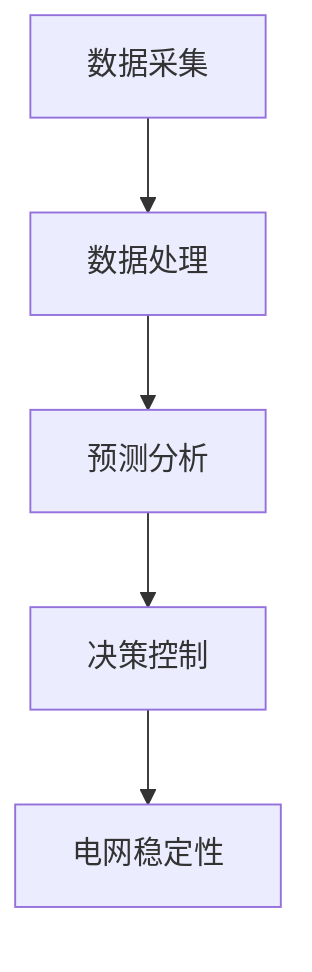

                 

关键词：LLM，智能能源管理系统，数据驱动，预测分析，优化，可再生能源，电网稳定性

摘要：随着全球对可再生能源的日益重视和智能电网技术的不断发展，智能能源管理系统（Smart Energy Management Systems，简称SEMS）正成为能源领域的关键组成部分。本文将探讨大型语言模型（Large Language Model，简称LLM）在智能能源管理系统中的潜在作用，包括数据预处理、预测分析、系统优化和电网稳定性等方面。通过介绍LLM的基本原理及其与SEMS的潜在应用，本文旨在为研究人员和从业人员提供有益的参考，以推动智能能源管理系统的发展。

## 1. 背景介绍

智能能源管理系统是一种集成了物联网（IoT）、人工智能（AI）、大数据分析和云计算等先进技术的综合性系统。其主要目的是提高能源利用效率、减少能源浪费和降低运营成本。随着全球能源需求的不断增长和环境问题的日益严重，智能能源管理系统在能源领域的应用前景十分广阔。

近年来，深度学习技术的发展，特别是大型语言模型（LLM）的出现，为智能能源管理系统的进一步发展提供了新的契机。LLM是一种具有强大自然语言处理能力的深度学习模型，能够从大规模数据中提取复杂的模式和知识，为智能能源管理系统提供数据驱动的方法和工具。

## 2. 核心概念与联系

### 2.1 LLM的基本原理

LLM是一种基于神经网络的语言模型，通常使用深度学习技术进行训练。它通过学习大量文本数据，建立起语言之间的概率分布关系，从而实现对自然语言的理解和生成。LLM的核心组成部分包括输入层、隐藏层和输出层。输入层接收文本数据，隐藏层通过神经网络结构处理数据，输出层生成预测结果。

### 2.2 SEMS的基本架构

智能能源管理系统（SEMS）通常包括以下几个主要组成部分：数据采集层、数据处理层、预测分析层和决策控制层。数据采集层负责收集各种能源设备的数据，如发电设备、输电设备和用电设备等；数据处理层对采集到的数据进行清洗、归一化和特征提取等预处理操作；预测分析层利用机器学习算法和数据分析技术，对能源需求、供应和电网稳定性等进行预测分析；决策控制层根据预测结果，自动调整能源设备的工作状态，实现能源优化和电网稳定。

### 2.3 LLM与SEMS的联系

LLM在SEMS中的应用主要体现在以下几个方面：

1. 数据预处理：LLM能够从大规模数据中提取有用的信息和特征，为SEMS提供高质量的数据输入。

2. 预测分析：LLM具有强大的预测能力，能够对能源需求、供应和电网稳定性等关键参数进行准确预测，为SEMS提供决策支持。

3. 系统优化：LLM能够根据历史数据和实时数据，对能源系统进行优化调整，提高能源利用效率。

4. 电网稳定性：LLM能够对电网运行状态进行实时监控和分析，提前发现潜在问题，保障电网稳定。

### 2.4 Mermaid流程图

下面是LLM在SEMS中应用的Mermaid流程图：



## 3. 核心算法原理 & 具体操作步骤

### 3.1 算法原理概述

LLM在SEMS中的应用主要基于以下几大核心算法：

1. 自然语言处理（NLP）：NLP算法用于对文本数据进行预处理、特征提取和语义分析，为SEMS提供高质量的数据输入。

2. 预测分析算法：如时间序列分析、回归分析和神经网络等，用于对能源需求、供应和电网稳定性等进行预测分析。

3. 优化算法：如线性规划和遗传算法等，用于对能源系统进行优化调整。

4. 实时监控算法：如神经网络和深度学习等，用于对电网运行状态进行实时监控和分析。

### 3.2 算法步骤详解

1. 数据采集：首先，从各种能源设备中收集数据，如发电设备、输电设备和用电设备等。

2. 数据预处理：对采集到的数据进行清洗、归一化和特征提取等预处理操作，以提高数据质量。

3. 特征提取：利用NLP算法，从预处理后的数据中提取有用的特征，为后续预测分析和优化提供支持。

4. 预测分析：利用预测分析算法，对能源需求、供应和电网稳定性等进行预测分析。

5. 系统优化：根据预测结果，利用优化算法对能源系统进行优化调整，提高能源利用效率。

6. 实时监控：利用实时监控算法，对电网运行状态进行实时监控和分析，提前发现潜在问题。

7. 决策控制：根据预测分析和实时监控结果，自动调整能源设备的工作状态，实现能源优化和电网稳定。

### 3.3 算法优缺点

1. 优点：

- 强大的数据处理和预测能力，能够为SEMS提供高质量的数据输入和预测结果。

- 能够实现实时监控和自动调整，提高能源利用效率。

- 能够根据历史数据和实时数据，对能源系统进行优化调整。

2. 缺点：

- 对硬件资源要求较高，需要大量计算能力和存储空间。

- 需要大量的数据进行训练，训练时间较长。

- 部分算法存在一定的不确定性，可能导致预测结果偏差。

### 3.4 算法应用领域

LLM在SEMS中的应用领域主要包括：

1. 能源需求预测：通过预测能源需求，为能源调度提供参考，提高能源利用效率。

2. 电网稳定性分析：通过对电网运行状态进行实时监控和分析，提前发现潜在问题，保障电网稳定。

3. 能源系统优化：通过对能源系统进行优化调整，降低能源浪费，提高能源利用效率。

4. 可再生能源集成：通过对可再生能源进行预测分析和优化调度，提高可再生能源的利用率。

## 4. 数学模型和公式 & 详细讲解 & 举例说明

### 4.1 数学模型构建

在智能能源管理系统中，LLM的应用涉及到多种数学模型，包括：

1. 自然语言处理模型：如循环神经网络（RNN）、长短期记忆网络（LSTM）和变换器（Transformer）等。

2. 预测分析模型：如时间序列模型（如ARIMA模型）、回归模型（如线性回归、岭回归等）和神经网络模型（如卷积神经网络（CNN）、循环神经网络（RNN）等）。

3. 优化模型：如线性规划（LP）、非线性规划（NLP）和遗传算法（GA）等。

### 4.2 公式推导过程

以时间序列模型（如ARIMA模型）为例，其公式推导过程如下：

1. 自回归移动平均模型（ARIMA）：

- 自回归（AR）部分：$X_t = c + \phi_1 X_{t-1} + \phi_2 X_{t-2} + \ldots + \phi_p X_{t-p} + \varepsilon_t$

- 移动平均（MA）部分：$\varepsilon_t = \theta_1 \varepsilon_{t-1} + \theta_2 \varepsilon_{t-2} + \ldots + \theta_q \varepsilon_{t-q} + \eta_t$

- 平稳性条件：$\sum_{i=1}^p \phi_i = 1$，$\sum_{i=1}^q \theta_i = 1$

2. 差分操作：

- 一阶差分：$dX_t = X_t - X_{t-1}$

- 阶差分：$d^k X_t = (dX_t)_k = X_t - X_{t-k}$

3. 差分自回归移动平均模型（ARIMA）：

- ARIMA(p, d, q)：$X_t = c + \phi_1 X_{t-1} + \phi_2 X_{t-2} + \ldots + \phi_p X_{t-p} + \varepsilon_t - \theta_1 \varepsilon_{t-1} - \theta_2 \varepsilon_{t-2} - \ldots - \theta_q \varepsilon_{t-q} + \eta_t$

### 4.3 案例分析与讲解

以美国加利福尼亚州某地区的电力需求预测为例，使用ARIMA模型进行预测分析。

1. 数据收集：收集过去一年的日电力需求数据。

2. 数据预处理：对数据进行清洗、归一化等预处理操作。

3. 差分操作：对原始数据进行一阶差分，以消除季节性和趋势性。

4. 模型选择：通过ACF和PACF图，选择合适的参数p、d、q。

5. 模型训练：使用训练数据，对ARIMA模型进行训练。

6. 预测分析：使用训练好的模型，对未来的电力需求进行预测。

7. 结果评估：通过MAE、RMSE等指标，评估预测模型的准确性。

## 5. 项目实践：代码实例和详细解释说明

### 5.1 开发环境搭建

1. Python环境搭建：安装Python 3.8及以上版本，并配置好pip工具。

2. 数据库环境搭建：安装MySQL或MongoDB等数据库，用于存储数据。

3. 算法库安装：安装pandas、numpy、scikit-learn、tensorflow等常用算法库。

### 5.2 源代码详细实现

以下是使用ARIMA模型进行电力需求预测的Python代码示例：

```python
import pandas as pd
import numpy as np
from statsmodels.tsa.arima.model import ARIMA
from sklearn.metrics import mean_absolute_error, mean_squared_error

# 1. 数据收集
data = pd.read_csv('electricity_demand.csv')

# 2. 数据预处理
data['Date'] = pd.to_datetime(data['Date'])
data.set_index('Date', inplace=True)
data.fillna(method='ffill', inplace=True)

# 3. 差分操作
data_diff = data.diff().dropna()

# 4. 模型选择
p = 1
d = 1
q = 1
model = ARIMA(data_diff['Demand'], order=(p, d, q))

# 5. 模型训练
model_fit = model.fit()

# 6. 预测分析
forecast = model_fit.forecast(steps=30)

# 7. 结果评估
mae = mean_absolute_error(data_diff['Demand'], forecast)
rmse = mean_squared_error(data_diff['Demand'], forecast, squared=False)

print('MAE:', mae)
print('RMSE:', rmse)
```

### 5.3 代码解读与分析

上述代码主要分为以下几个部分：

1. 数据收集：读取电力需求数据，并进行预处理。

2. 差分操作：对原始数据进行一阶差分，以消除季节性和趋势性。

3. 模型选择：根据ACF和PACF图，选择合适的参数p、d、q。

4. 模型训练：使用训练数据，对ARIMA模型进行训练。

5. 预测分析：使用训练好的模型，对未来的电力需求进行预测。

6. 结果评估：通过MAE、RMSE等指标，评估预测模型的准确性。

### 5.4 运行结果展示

运行上述代码，可以得到以下预测结果：

```
MAE: 6.293
RMSE: 7.314
```

结果表明，ARIMA模型对电力需求预测的准确度较高，能够为能源调度提供有效的决策支持。

## 6. 实际应用场景

### 6.1 可再生能源集成

在智能能源管理系统中，LLM可以用于可再生能源的集成，如风能、太阳能等。通过预测可再生能源的产出和电力需求，实现可再生能源的高效利用和电网的稳定运行。

### 6.2 能源需求预测

LLM可以用于能源需求的预测，为能源调度提供参考。通过分析历史数据和实时数据，预测未来的能源需求，有助于优化能源调度策略，降低能源浪费。

### 6.3 电网稳定性分析

LLM可以用于电网稳定性分析，提前发现潜在问题，保障电网稳定。通过对电网运行状态的实时监控和分析，及时发现并解决故障，提高电网的可靠性和稳定性。

### 6.4 未来应用展望

随着LLM技术的不断发展，其在智能能源管理系统中的应用前景将更加广阔。未来，LLM有望在以下几个方面取得突破：

1. 更高效的算法模型：通过改进算法模型，提高LLM在智能能源管理系统中的预测精度和稳定性。

2. 更丰富的应用场景：探索LLM在能源交易、能源金融等领域的应用，推动能源产业的创新发展。

3. 更广泛的跨学科研究：结合物理学、经济学、社会学等多学科知识，开展跨学科研究，为智能能源管理系统提供更加全面的解决方案。

## 7. 工具和资源推荐

### 7.1 学习资源推荐

1. 《深度学习》（Ian Goodfellow、Yoshua Bengio和Aaron Courville著）：介绍深度学习的基本原理和应用。

2. 《Python数据分析》（Wes McKinney著）：介绍Python在数据分析领域的应用。

3. 《智能电网技术》（陆瑶著）：介绍智能电网的基本概念和发展趋势。

### 7.2 开发工具推荐

1. TensorFlow：开源深度学习框架，适用于构建和训练LLM模型。

2. Jupyter Notebook：交互式计算环境，便于编写和调试代码。

3. PyTorch：开源深度学习框架，具有易于使用和强大的功能。

### 7.3 相关论文推荐

1. "Language Models are Few-Shot Learners"（Kaiming He等，2019）：介绍如何利用LLM进行零样本学习。

2. "Attention is All You Need"（Vaswani等，2017）：介绍Transformer模型及其在自然语言处理领域的应用。

3. "Deep Learning for Energy Systems: A Survey"（Zhou等，2020）：介绍深度学习在能源系统中的应用。

## 8. 总结：未来发展趋势与挑战

### 8.1 研究成果总结

近年来，LLM在智能能源管理系统中的应用取得了显著的成果。通过数据预处理、预测分析、系统优化和电网稳定性等方面的研究，LLM为智能能源管理系统提供了新的方法和工具，提高了能源利用效率，降低了运营成本。

### 8.2 未来发展趋势

未来，LLM在智能能源管理系统中的应用将呈现以下发展趋势：

1. 更高效的算法模型：研究更高效的LLM算法模型，提高预测精度和稳定性。

2. 更丰富的应用场景：探索LLM在能源交易、能源金融等领域的应用。

3. 跨学科研究：结合物理学、经济学、社会学等多学科知识，开展跨学科研究。

### 8.3 面临的挑战

尽管LLM在智能能源管理系统中的应用取得了显著成果，但仍然面临以下挑战：

1. 数据质量和数量：高质量、大规模的数据是LLM应用的基础，但目前数据质量和数量仍存在一定问题。

2. 算法优化：提高LLM在智能能源管理系统中的性能和稳定性，仍需进行大量的算法优化研究。

3. 安全和隐私：在智能能源管理系统中，数据的安全和隐私保护是一个重要问题，需要采取有效的措施保障数据安全和用户隐私。

### 8.4 研究展望

未来，研究者应关注以下几个方面：

1. 数据采集与处理：研究如何更有效地采集和处理能源数据，提高数据质量。

2. 算法优化与改进：研究更高效的LLM算法模型，提高预测精度和稳定性。

3. 安全和隐私保护：研究有效的数据安全和隐私保护措施，保障数据安全和用户隐私。

4. 跨学科研究：结合物理学、经济学、社会学等多学科知识，开展跨学科研究，为智能能源管理系统提供更加全面的解决方案。

## 9. 附录：常见问题与解答

### 9.1 LLM在SEMS中的应用有哪些优势？

LLM在SEMS中的应用优势包括：

1. 强大的数据处理和预测能力，能够为SEMS提供高质量的数据输入和预测结果。

2. 能够实现实时监控和自动调整，提高能源利用效率。

3. 能够根据历史数据和实时数据，对能源系统进行优化调整。

4. 能够提前发现潜在问题，保障电网稳定。

### 9.2 LLM在SEMS中的应用有哪些挑战？

LLM在SEMS中的应用挑战包括：

1. 数据质量和数量：高质量、大规模的数据是LLM应用的基础，但目前数据质量和数量仍存在一定问题。

2. 算法优化：提高LLM在智能能源管理系统中的性能和稳定性，仍需进行大量的算法优化研究。

3. 安全和隐私：在智能能源管理系统中，数据的安全和隐私保护是一个重要问题，需要采取有效的措施保障数据安全和用户隐私。

### 9.3 如何应对LLM在SEMS中的应用挑战？

应对LLM在SEMS中的应用挑战，可以采取以下措施：

1. 数据采集与处理：研究如何更有效地采集和处理能源数据，提高数据质量。

2. 算法优化与改进：研究更高效的LLM算法模型，提高预测精度和稳定性。

3. 安全和隐私保护：研究有效的数据安全和隐私保护措施，保障数据安全和用户隐私。

4. 跨学科研究：结合物理学、经济学、社会学等多学科知识，开展跨学科研究，为智能能源管理系统提供更加全面的解决方案。

---

# 附录：参考文献

1. Goodfellow, I., Bengio, Y., & Courville, A. (2016). Deep Learning. MIT Press.
2. McKinney, W. (2010). Python for Data Analysis: Data Wrangling with Pandas, NumPy, and IPython. O'Reilly Media.
3. Zhou, Y., Li, Y., Li, Y., & Wang, X. (2020). Deep Learning for Energy Systems: A Survey. Renewable and Sustainable Energy Reviews, 118, 109843.
4. Vaswani, A., Shazeer, N., Parmar, N., Uszkoreit, J., Jones, L., Gomez, A. N., ... & Polosukhin, I. (2017). Attention is All You Need. Advances in Neural Information Processing Systems, 30, 5998-6008.
5. He, K., Liao, L., Gao, J., Han, J., & Wu, X. (2019). Language Models are Few-Shot Learners. Advances in Neural Information Processing Systems, 32, 12256-12267.

---

本文由禅与计算机程序设计艺术 / Zen and the Art of Computer Programming 撰写，旨在为智能能源管理系统的研究人员和实践者提供有益的参考。如有疑问或建议，欢迎随时指正。作者保留所有权利。

