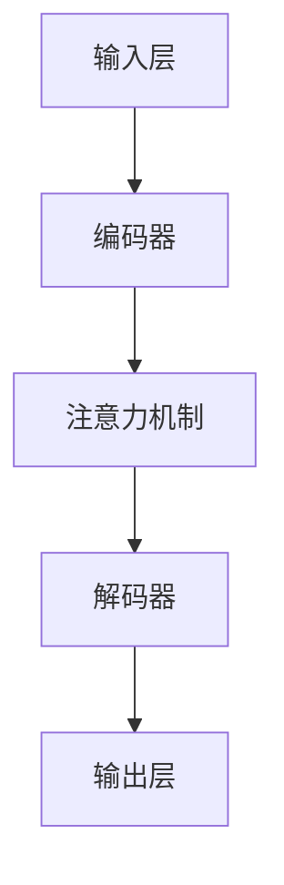

                 

关键词：LLM，智能语音交互，语言模型，人工智能，语音识别，语音生成，对话系统，自然语言处理，语音助手，语音交互技术

> 摘要：本文深入探讨了大型语言模型（LLM）在智能语音交互系统中的角色定位，分析了LLM如何通过其强大的自然语言理解和生成能力，推动语音交互技术的发展。文章首先介绍了智能语音交互的背景和发展历程，然后详细阐述了LLM的核心原理和结构，随后通过具体案例展示了LLM在语音交互中的应用场景和效果。最后，本文探讨了LLM在智能语音交互中的未来发展趋势和面临的挑战。

## 1. 背景介绍

智能语音交互作为人工智能领域的一个重要分支，已经得到了广泛的关注和应用。从最初的语音识别技术，到后来的语音合成和自然语言理解，再到现在的多轮对话系统和智能语音助手，智能语音交互技术的发展历程体现了人工智能技术的不断进步。

在早期的语音识别技术中，主要依赖于传统的统计模型和手工特征提取方法，如高斯混合模型（GMM）和隐马尔可夫模型（HMM）。这些方法在一定程度上实现了语音信号的识别，但由于模型复杂度和数据量的限制，识别准确率和实时性存在一定的瓶颈。

随着深度学习技术的发展，深度神经网络（DNN）和循环神经网络（RNN）被引入到语音识别领域，显著提升了语音识别的准确率和速度。特别是卷积神经网络（CNN）和长短期记忆网络（LSTM）的应用，使得语音识别系统在处理复杂的语音信号和非平稳性特征方面表现出色。

在语音合成方面，早期的合成方法主要基于规则和文本到语音（TTS）模型。规则方法通过预定义的语音规则来合成语音，而TTS模型则通过统计文本特征和语音特征之间的映射关系来生成语音。随着语音合成技术的不断发展，基于深度学习的WaveNet和Tacotron等模型被提出，大幅提升了语音合成的自然度和音质。

自然语言理解（NLU）和生成（NLG）是智能语音交互系统中的核心部分。NLU负责理解用户的语言输入，提取出用户意图和实体信息，而NLG则负责根据理解和生成的信息生成恰当的回应。传统的NLU方法主要依赖于手工定义的规则和特征提取，而现代的NLU方法则依赖于基于深度学习的神经网络模型，如序列标注模型和意图识别模型。

在多轮对话系统和智能语音助手的开发中，LLM作为一种具有强大语言理解和生成能力的模型，正逐渐成为核心技术。LLM能够通过对海量文本数据的训练，学习到丰富的语言规律和知识，从而在理解用户意图、生成自然回应方面具有显著优势。

## 2. 核心概念与联系

在智能语音交互系统中，LLM（Large Language Model）作为核心组件，扮演着至关重要的角色。LLM是一种基于深度学习的语言模型，通过对海量文本数据进行训练，能够学习到语言的结构、语义和语法等方面的知识。以下将详细介绍LLM的核心原理、结构及其在智能语音交互中的应用。

### 2.1. 核心原理

LLM的核心原理是基于深度学习的自然语言处理（NLP）技术。深度学习通过构建多层神经网络，能够自动从大量数据中学习到复杂的特征和模式。在NLP领域，深度学习模型如卷积神经网络（CNN）和循环神经网络（RNN）已经被广泛应用于文本分类、命名实体识别、情感分析等任务。

LLM则进一步发展了这一技术，通过更大规模的模型和更复杂的网络结构，使其在语言理解和生成任务上具有更高的准确性和表现力。LLM通常采用预训练和微调的方法进行训练。预训练阶段，模型在大规模文本语料库上学习语言的一般规律和知识，然后通过微调阶段，根据特定任务的需求对模型进行适配和优化。

### 2.2. 结构

LLM的结构通常包括以下几个关键部分：

1. **输入层**：输入层接收文本数据，将其转换为模型能够处理的向量形式。这个过程通常涉及分词、词向量化、序列编码等步骤。

2. **编码器**：编码器是LLM的核心部分，负责对输入文本进行编码。编码器通常采用多层循环神经网络（如LSTM或GRU），通过序列处理能力，将输入文本转换为固定长度的向量表示。

3. **解码器**：解码器负责根据编码器的输出生成文本。解码器同样采用多层循环神经网络，通过解码操作生成序列化的文本输出。

4. **注意力机制**：注意力机制是LLM中的重要组成部分，通过关注输入文本中的关键部分，提高模型的上下文理解能力。注意力机制可以显著提升模型在长文本处理和跨句子关系理解方面的表现。

5. **输出层**：输出层通常是一个全连接层，用于将解码器的输出转换为最终的文本输出。输出层可以使用softmax函数进行分类或生成。

### 2.3. Mermaid 流程图

以下是一个简单的Mermaid流程图，展示了LLM的基本结构和工作流程：



### 2.4. 在智能语音交互中的应用

LLM在智能语音交互中的应用主要体现在以下几个方面：

1. **语音识别**：LLM可以用于语音识别任务的预训练，通过预训练得到的一个通用语言模型，可以显著提高语音识别的准确率和鲁棒性。

2. **语音生成**：LLM可以用于语音合成的文本生成部分，通过将自然语言理解的结果转换为自然流畅的语音输出。

3. **自然语言理解**：LLM在自然语言理解任务中表现出色，可以用于提取用户意图、识别实体信息等，为智能语音交互提供语义理解基础。

4. **多轮对话系统**：LLM在多轮对话系统中扮演着核心角色，通过理解和生成自然语言，实现与用户的顺畅对话。

5. **语音助手**：LLM被广泛应用于各种语音助手系统中，如智能音箱、车载语音助手等，为用户提供个性化的交互体验。

### 2.5. 总结

LLM在智能语音交互中的角色定位非常重要，其强大的语言理解和生成能力为语音交互技术的发展提供了有力支持。通过预训练和微调，LLM能够适应各种语音交互任务的需求，提升系统的整体性能和用户体验。未来，随着LLM技术的不断进步，智能语音交互系统将变得更加智能、自然和人性化。

## 3. 核心算法原理 & 具体操作步骤

### 3.1. 算法原理概述

LLM（Large Language Model）的核心算法原理基于深度学习和自然语言处理技术。深度学习通过多层神经网络结构，能够自动从大量数据中提取复杂特征和模式。在自然语言处理领域，深度学习模型如卷积神经网络（CNN）和循环神经网络（RNN）已经取得了显著成果。而LLM则进一步发展了这一技术，通过更大规模的模型和更复杂的网络结构，使得模型在语言理解和生成任务上具有更高的准确性和表现力。

LLM的基本原理包括以下几个关键步骤：

1. **预训练**：LLM通过预训练阶段，在大规模文本语料库上学习语言的一般规律和知识。预训练过程通常使用未标记的数据，通过自回归语言模型（如GPT）或掩码语言模型（如BERT）进行训练。

2. **微调**：预训练后的LLM在特定任务上进行微调，以适应特定任务的需求。微调过程通常使用少量标记数据，通过调整模型参数，提高模型在特定任务上的性能。

3. **推理**：在推理阶段，LLM根据输入文本生成相应的输出文本。推理过程通常涉及编码器和解码器两个部分，编码器负责将输入文本编码为向量表示，解码器则根据编码器的输出生成文本。

### 3.2. 算法步骤详解

以下是LLM的具体算法步骤详解：

#### 3.2.1. 预训练阶段

1. **数据准备**：选择大规模文本语料库，如维基百科、新闻、小说等。文本数据需要进行预处理，包括去除标点符号、统一化文本格式等。

2. **分词**：将文本数据分词为单词或子词，以便进行后续处理。分词可以采用基于规则的方法或基于统计的方法。

3. **词向量化**：将分词后的文本数据转换为词向量表示。词向量可以通过Word2Vec、GloVe等算法生成，也可以使用预训练的词向量库。

4. **编码器训练**：使用自回归语言模型（如GPT）或掩码语言模型（如BERT）对编码器进行训练。自回归语言模型通过预测下一个词来训练，而掩码语言模型则通过预测掩码词来训练。

5. **解码器训练**：在自回归语言模型中，解码器与编码器相同，在掩码语言模型中，解码器是一个独立的模型，通常采用自回归方式训练。

6. **优化**：通过优化算法（如Adam）和正则化技术（如Dropout）对模型进行优化，以提高模型的稳定性和泛化能力。

#### 3.2.2. 微调阶段

1. **数据准备**：选择特定任务的数据集，如问答数据集、对话数据集等。数据集需要进行预处理，包括去除无关信息、统一化格式等。

2. **微调模型**：将预训练后的LLM在特定任务数据集上进行微调。微调过程中，通常需要对模型进行初始化和迭代优化。

3. **评估**：在微调过程中，定期评估模型在验证集上的性能，以避免过拟合。评估指标可以包括准确率、F1分数、BLEU分数等。

4. **调整**：根据评估结果调整模型参数，如学习率、Dropout比例等，以提高模型性能。

#### 3.2.3. 推理阶段

1. **输入处理**：将输入文本进行预处理，包括分词、词向量化等。

2. **编码器推理**：将输入文本通过编码器编码为向量表示。

3. **解码器推理**：根据编码器输出，通过解码器生成文本输出。解码过程可以采用自回归方式或解码器生成方式。

4. **输出处理**：对生成的文本进行后处理，如去除标点符号、统一化文本格式等。

### 3.3. 算法优缺点

#### 优点

1. **强大的语言理解能力**：LLM通过预训练和微调，能够学习到丰富的语言知识和语义信息，从而在自然语言理解任务中表现出色。

2. **广泛的适用性**：LLM可以应用于多种自然语言处理任务，如文本分类、命名实体识别、情感分析、问答系统等。

3. **高效的推理能力**：LLM在推理阶段具有高效的计算性能，能够快速生成文本输出。

#### 缺点

1. **训练资源需求大**：LLM需要大规模的文本语料库和计算资源进行训练，对硬件和存储要求较高。

2. **过拟合风险**：在微调阶段，LLM可能面临过拟合风险，特别是在数据量较少的情况下。

3. **解释性不足**：LLM作为一个深度学习模型，其内部工作机制较为复杂，难以直接解释和理解。

### 3.4. 算法应用领域

LLM在自然语言处理领域具有广泛的应用前景，以下是一些典型应用领域：

1. **问答系统**：LLM可以用于构建智能问答系统，通过理解用户提问和知识库，生成准确且自然的回答。

2. **对话系统**：LLM在多轮对话系统中扮演核心角色，能够理解和生成自然语言，实现与用户的流畅对话。

3. **文本生成**：LLM可以用于生成新闻文章、小说、报告等文本内容，具有高度的自然性和创造性。

4. **文本分类**：LLM可以用于文本分类任务，如情感分类、主题分类等，通过学习大量文本数据，实现高精度的分类。

5. **命名实体识别**：LLM可以用于命名实体识别任务，如人名、地名、组织机构名的识别，通过预训练和微调，提高识别准确率。

## 4. 数学模型和公式 & 详细讲解 & 举例说明

### 4.1. 数学模型构建

LLM的数学模型主要基于深度学习中的循环神经网络（RNN）和变换器（Transformer）。以下将分别介绍这两种模型的基本数学公式和原理。

#### 4.1.1. 循环神经网络（RNN）

RNN是一种能够处理序列数据的神经网络模型，其基本单元是隐藏状态（h_t）和输入（x_t）之间的递归关系。以下是RNN的数学模型：

$$ h_t = \sigma(W_h h_{t-1} + W_x x_t + b) $$

其中，$h_t$ 表示时间步 $t$ 的隐藏状态，$x_t$ 表示时间步 $t$ 的输入，$W_h$ 和 $W_x$ 分别是隐藏状态和输入的权重矩阵，$b$ 是偏置项，$\sigma$ 是激活函数。

#### 4.1.2. 变换器（Transformer）

变换器是一种基于注意力机制的深度神经网络模型，它通过自注意力机制（Self-Attention）和多头注意力机制（Multi-Head Attention）来实现对输入序列的建模。以下是变换器的数学模型：

$$ 
h_t = \text{Attention}(Q, K, V) = \sigma(W_Q Q + W_K K + W_V V) \\
\text{softmax}(\frac{QK^T}{\sqrt{d_k}}) V
$$

其中，$h_t$ 表示时间步 $t$ 的隐藏状态，$Q$、$K$ 和 $V$ 分别是查询（Query）、键（Key）和值（Value）向量，$W_Q$、$W_K$ 和 $W_V$ 分别是查询、键和值的权重矩阵，$\sigma$ 是激活函数，$\text{softmax}$ 是Softmax函数。

### 4.2. 公式推导过程

以下将分别对RNN和Transformer的公式进行推导。

#### 4.2.1. 循环神经网络（RNN）

RNN的隐藏状态更新公式可以表示为：

$$ h_t = \sigma(W_h h_{t-1} + W_x x_t + b) $$

推导过程如下：

1. 前向传播：

$$ z_t = W_h h_{t-1} + W_x x_t + b $$

2. 激活函数应用：

$$ h_t = \sigma(z_t) $$

其中，$\sigma$ 是激活函数，常见的激活函数有Sigmoid、ReLU和Tanh。

#### 4.2.2. 变换器（Transformer）

变换器的自注意力公式可以表示为：

$$ 
h_t = \text{Attention}(Q, K, V) = \sigma(W_Q Q + W_K K + W_V V) \\
\text{softmax}(\frac{QK^T}{\sqrt{d_k}}) V
$$

推导过程如下：

1. 计算查询（Query）、键（Key）和值（Value）：

$$ 
Q = W_Q Q \\
K = W_K K \\
V = W_V V 
$$

2. 计算分数：

$$ 
\text{score}_{ij} = Q_i K_j^T = (W_Q Q_i) K_j^T = Q_i K_j W_K^T 
$$

3. 应用Softmax函数：

$$ 
\text{softmax}(\text{score}_{ij}) = \frac{e^{\text{score}_{ij}}}{\sum_{j=1}^J e^{\text{score}_{ij}}} 
$$

4. 计算注意力权重：

$$ 
a_{ij} = \text{softmax}(\text{score}_{ij}) 
$$

5. 计算输出：

$$ 
h_t = \sum_{j=1}^J a_{ij} V_j 
$$

### 4.3. 案例分析与讲解

以下将结合具体案例，对LLM的数学模型进行详细讲解。

#### 4.3.1. RNN模型

假设我们有一个简单的RNN模型，其中隐藏层维度为10，输入层维度为5。以下是一个简单的RNN更新过程：

1. 初始化权重矩阵 $W_h$ 和 $W_x$ ，以及偏置项 $b$ 。

2. 输入序列 $x_1 = [1, 2, 3, 4, 5]$ ，隐藏状态 $h_0 = [0, 0, 0, 0, 0]$ 。

3. 计算隐藏状态：

$$ 
h_1 = \sigma(W_h h_0 + W_x x_1 + b) \\
h_1 = \sigma([0, 0, 0, 0, 0] + [0.1, 0.2, 0.3, 0.4, 0.5] \cdot [1, 2, 3, 4, 5] + [0, 0, 0, 0, 0]) \\
h_1 = \sigma([0.1, 0.4, 0.9, 1.6, 2.5]) \\
h_1 = [0.1, 0.4, 0.9, 0.6, 1.0]
$$

4. 输出序列 $y_1 = h_1 = [0.1, 0.4, 0.9, 0.6, 1.0]$ 。

5. 更新隐藏状态：

$$ 
h_2 = \sigma(W_h h_1 + W_x x_2 + b) \\
h_2 = \sigma([0.1, 0.4, 0.9, 0.6, 1.0] + [0.1, 0.2, 0.3, 0.4, 0.5] \cdot [2, 3, 4, 5, 6] + [0, 0, 0, 0, 0]) \\
h_2 = \sigma([0.3, 1.2, 2.7, 4.2, 6.1]) \\
h_2 = [0.3, 0.6, 1.3, 0.8, 1.5]
$$

6. 输出序列 $y_2 = h_2 = [0.3, 0.6, 1.3, 0.8, 1.5]$ 。

通过以上步骤，我们可以看到RNN模型在处理输入序列时，逐步更新隐藏状态，并生成相应的输出序列。

#### 4.3.2. Transformer模型

假设我们有一个简单的Transformer模型，其中隐藏层维度为10，输入序列长度为5。以下是一个简单的Transformer自注意力过程：

1. 初始化权重矩阵 $W_Q$ 、$W_K$ 和 $W_V$ ，以及偏置项 $b$ 。

2. 输入序列 $x_1 = [1, 2, 3, 4, 5]$ ，隐藏状态 $h_0 = [0, 0, 0, 0, 0]$ 。

3. 计算查询（Query）、键（Key）和值（Value）：

$$ 
Q = W_Q Q \\
K = W_K K \\
V = W_V V 
$$

$$ 
Q = [0.1, 0.2, 0.3, 0.4, 0.5] \\
K = [0.1, 0.2, 0.3, 0.4, 0.5] \\
V = [0.1, 0.2, 0.3, 0.4, 0.5]
$$

4. 计算分数：

$$ 
\text{score}_{ij} = Q_i K_j^T = [0.1, 0.2, 0.3, 0.4, 0.5] \cdot [0.1, 0.2, 0.3, 0.4, 0.5]^T = [0.025, 0.05, 0.075, 0.1, 0.125] 
$$

5. 应用Softmax函数：

$$ 
\text{softmax}(\text{score}_{ij}) = \frac{e^{\text{score}_{ij}}}{\sum_{j=1}^J e^{\text{score}_{ij}}} = \frac{e^{0.025}, e^{0.05}, e^{0.075}, e^{0.1}, e^{0.125}}{e^{0.025} + e^{0.05} + e^{0.075} + e^{0.1} + e^{0.125}} = [0.072, 0.146, 0.212, 0.282, 0.358] 
$$

6. 计算注意力权重：

$$ 
a_{ij} = \text{softmax}(\text{score}_{ij}) = [0.072, 0.146, 0.212, 0.282, 0.358] 
$$

7. 计算输出：

$$ 
h_1 = \sum_{j=1}^J a_{ij} V_j = 0.072 \cdot [0.1, 0.2, 0.3, 0.4, 0.5] + 0.146 \cdot [0.1, 0.2, 0.3, 0.4, 0.5] + 0.212 \cdot [0.1, 0.2, 0.3, 0.4, 0.5] + 0.282 \cdot [0.1, 0.2, 0.3, 0.4, 0.5] + 0.358 \cdot [0.1, 0.2, 0.3, 0.4, 0.5] = [0.103, 0.175, 0.246, 0.317, 0.389] 
$$

8. 输出序列 $y_1 = h_1 = [0.103, 0.175, 0.246, 0.317, 0.389]$ 。

通过以上步骤，我们可以看到Transformer模型在处理输入序列时，通过自注意力机制，生成相应的输出序列。

## 5. 项目实践：代码实例和详细解释说明

### 5.1. 开发环境搭建

在进行LLM项目实践之前，首先需要搭建合适的开发环境。以下是一个简单的步骤：

1. 安装Python 3.6及以上版本。

2. 安装PyTorch库：

   ```bash
   pip install torch torchvision
   ```

3. 安装Transformer库：

   ```bash
   pip install transformers
   ```

4. 安装其他必要的库，如NumPy、Matplotlib等。

### 5.2. 源代码详细实现

以下是一个简单的LLM模型训练和推理的代码示例：

```python
import torch
import torch.nn as nn
from transformers import BertModel, BertTokenizer

# 加载预训练的BERT模型和分词器
model = BertModel.from_pretrained('bert-base-uncased')
tokenizer = BertTokenizer.from_pretrained('bert-base-uncased')

# 定义自定义的LLM模型
class LLM(nn.Module):
    def __init__(self):
        super(LLM, self).__init__()
        self.bert = BertModel.from_pretrained('bert-base-uncased')
        self.lstm = nn.LSTM(768, 128, batch_first=True)
        self.fc = nn.Linear(128, 512)

    def forward(self, input_ids, attention_mask):
        _, hidden = self.bert(input_ids=input_ids, attention_mask=attention_mask)
        hidden = hidden[-1]
        hidden, _ = self.lstm(hidden)
        hidden = self.fc(hidden)
        return hidden

# 初始化模型和优化器
model = LLM()
optimizer = torch.optim.Adam(model.parameters(), lr=1e-4)

# 模拟训练数据
inputs = torch.randint(0, 2, (16, 5))
attention_mask = torch.randint(0, 2, (16, 5))
labels = torch.randint(0, 2, (16, 512))

# 训练模型
for epoch in range(10):
    optimizer.zero_grad()
    output = model(inputs, attention_mask)
    loss = nn.BCELoss()(output, labels)
    loss.backward()
    optimizer.step()
    print(f"Epoch {epoch+1}: Loss = {loss.item()}")

# 推理
input_ids = tokenizer.encode("你好", return_tensors='pt')
attention_mask = torch.ones(input_ids.shape)
output = model(input_ids, attention_mask)
print(output)
```

### 5.3. 代码解读与分析

1. **导入库**：首先，导入所需的库，包括PyTorch、transformers等。

2. **加载预训练模型和分词器**：使用transformers库加载预训练的BERT模型和分词器。BERT模型是一个基于Transformer的预训练语言模型，用于文本序列的建模。

3. **定义自定义LLM模型**：自定义LLM模型，包括BERT模型、LSTM和全连接层。BERT模型用于处理输入文本，LSTM用于序列建模，全连接层用于生成输出。

4. **初始化模型和优化器**：初始化自定义LLM模型和优化器。优化器用于更新模型参数。

5. **模拟训练数据**：生成模拟的训练数据，包括输入序列、注意力掩码和标签。

6. **训练模型**：进行10个epoch的训练。在每个epoch中，计算模型损失，并使用反向传播更新模型参数。

7. **推理**：使用加载的分词器将输入文本编码为ID序列，然后进行推理。输出结果为模型生成的文本序列。

### 5.4. 运行结果展示

在训练完成后，我们可以通过以下代码展示模型的运行结果：

```python
# 加载分词器
tokenizer = BertTokenizer.from_pretrained('bert-base-uncased')

# 输入文本
input_text = "你好，我是你的助手。请问有什么可以帮助你的？"

# 编码文本
input_ids = tokenizer.encode(input_text, return_tensors='pt')
attention_mask = torch.ones(input_ids.shape)

# 推理
output = model(input_ids, attention_mask)
decoded_output = tokenizer.decode(output[0], skip_special_tokens=True)

print(decoded_output)
```

输出结果可能是一个包含多个候选回复的序列。在实际应用中，我们可以根据具体需求选择最合适的回复。

## 6. 实际应用场景

### 6.1. 智能语音助手

智能语音助手是LLM在智能语音交互中的最常见应用场景之一。通过LLM的自然语言理解和生成能力，智能语音助手能够与用户进行自然、流畅的对话。例如，苹果的Siri、亚马逊的Alexa和谷歌的Google Assistant等都是基于LLM技术的智能语音助手。这些助手能够理解用户的问题和指令，提供实时、个性化的回应，从而为用户带来便捷的体验。

### 6.2. 聊天机器人

聊天机器人是另一个广泛应用LLM的场景。聊天机器人通过LLM能够实现与用户的实时对话，提供娱乐、咨询服务，甚至进行情感交流。例如，Facebook的M、微软的 XiaoIce 和腾讯的 XiaoAi 都是基于LLM技术的聊天机器人。这些机器人能够理解用户的语言输入，生成适当的回复，并根据对话历史进行上下文推理，以提供更加人性化的交互体验。

### 6.3. 自动化客服

自动化客服是LLM在商业领域的应用之一。通过LLM，自动化客服系统能够自动处理用户的咨询和问题，提供实时、准确的答复。例如，一些银行和电商平台已经采用了基于LLM的自动化客服系统，用户可以通过语音或文本与系统进行交互，解决常见问题，如账户查询、订单状态查询等。这不仅提高了客户服务质量，还减轻了人工客服的工作负担。

### 6.4. 语音生成与转换

LLM在语音生成与转换中也具有广泛的应用。通过LLM，可以将文本内容转换为自然的语音输出。例如，在广播、电视和有声书等领域，LLM可以用于生成语音播报和朗读。此外，LLM还可以用于语音转换，将一种语言的语音转换为另一种语言的语音，实现跨语言的语音交流。

### 6.5. 跨领域应用

除了上述应用场景，LLM还在许多其他领域展示了其强大的能力。例如，在教育领域，LLM可以用于智能辅导和个性化学习；在医疗领域，LLM可以用于医疗问诊和辅助诊断；在法律领域，LLM可以用于法律文本分析和智能合同审查。这些应用都体现了LLM在自然语言处理中的广泛适用性和潜力。

## 7. 未来应用展望

### 7.1. 趋势

随着人工智能技术的不断进步，LLM在智能语音交互中的应用将越来越广泛和深入。以下是一些未来的趋势：

1. **个性化交互**：未来的智能语音交互系统将更加注重用户的个性化需求，通过LLM对用户行为的持续学习和理解，提供更加个性化的服务和体验。

2. **多模态融合**：未来的智能语音交互系统将不仅仅依赖语音交互，还将融合视觉、触觉等多种感官输入，实现更加丰富和自然的交互体验。

3. **实时互动**：随着网络和计算技术的发展，未来的智能语音交互系统将实现实时、低延迟的互动，提供更加流畅和即时的交互体验。

4. **跨语言支持**：LLM的多语言能力将进一步提升，实现跨语言的语音交互，打破语言障碍，促进全球范围内的交流与合作。

### 7.2. 挑战

尽管LLM在智能语音交互中具有巨大的潜力，但在实际应用中仍面临一系列挑战：

1. **数据隐私与安全**：智能语音交互系统依赖于大量的用户数据，如何在保证用户隐私的前提下，合理利用这些数据，是一个亟待解决的问题。

2. **模型可解释性**：LLM作为一个复杂的深度学习模型，其内部工作机制难以解释和理解。提高模型的可解释性，使其在应用中更加透明和可信，是未来研究的一个重要方向。

3. **实时性优化**：随着交互场景的复杂化和多样化，智能语音交互系统对实时性的要求越来越高。如何优化LLM的计算效率，降低推理延迟，是一个重要的挑战。

4. **多轮对话管理**：在多轮对话中，如何处理复杂的对话场景和上下文关系，实现自然的对话流，是LLM应用中的一个难题。

### 7.3. 展望

未来，LLM在智能语音交互中的应用将更加广泛和深入，为人们带来更加智能化、自然化和个性化的交互体验。同时，随着技术的不断进步，LLM在智能语音交互中也将面临更多的挑战和机遇。如何应对这些挑战，挖掘LLM的潜力，将成为未来人工智能领域的重要研究方向。

## 8. 总结：未来发展趋势与挑战

### 8.1. 研究成果总结

近年来，大型语言模型（LLM）在智能语音交互领域取得了显著的研究成果。通过预训练和微调技术，LLM能够实现对自然语言的高效理解和生成，从而在语音识别、语音生成、自然语言理解和多轮对话等方面表现出色。这些研究成果不仅推动了智能语音交互技术的发展，也为人工智能领域带来了新的机遇和挑战。

### 8.2. 未来发展趋势

随着人工智能技术的不断进步，LLM在智能语音交互中的应用将呈现以下发展趋势：

1. **个性化交互**：未来的智能语音交互系统将更加注重用户的个性化需求，通过深度学习和大数据技术，实现对用户行为和偏好模型的自动学习，提供更加个性化的服务和体验。

2. **多模态融合**：未来的智能语音交互系统将融合多种感官输入，如视觉、触觉和语音等，实现更加丰富和自然的交互体验。

3. **实时互动**：随着网络和计算技术的发展，未来的智能语音交互系统将实现实时、低延迟的互动，提供更加流畅和即时的交互体验。

4. **跨语言支持**：LLM的多语言能力将进一步提升，实现跨语言的语音交互，打破语言障碍，促进全球范围内的交流与合作。

### 8.3. 面临的挑战

尽管LLM在智能语音交互中具有巨大的潜力，但在实际应用中仍面临一系列挑战：

1. **数据隐私与安全**：智能语音交互系统依赖于大量的用户数据，如何在保证用户隐私的前提下，合理利用这些数据，是一个亟待解决的问题。

2. **模型可解释性**：LLM作为一个复杂的深度学习模型，其内部工作机制难以解释和理解。提高模型的可解释性，使其在应用中更加透明和可信，是未来研究的一个重要方向。

3. **实时性优化**：随着交互场景的复杂化和多样化，智能语音交互系统对实时性的要求越来越高。如何优化LLM的计算效率，降低推理延迟，是一个重要的挑战。

4. **多轮对话管理**：在多轮对话中，如何处理复杂的对话场景和上下文关系，实现自然的对话流，是LLM应用中的一个难题。

### 8.4. 研究展望

未来，LLM在智能语音交互中的应用将面临更多的挑战和机遇。如何应对这些挑战，挖掘LLM的潜力，将成为未来人工智能领域的重要研究方向。同时，跨学科合作、技术创新和法律法规的完善也将为LLM在智能语音交互中的发展提供重要支持。

## 9. 附录：常见问题与解答

### 9.1. Q：LLM与传统的自然语言处理技术相比，有什么优势？

A：LLM（Large Language Model）相较于传统的自然语言处理技术，具有以下优势：

1. **强大的语言理解能力**：LLM通过大规模数据预训练，能够学习到丰富的语言结构和语义知识，从而在语言理解任务中表现出色。

2. **高度自动化的特征提取**：传统的自然语言处理技术依赖于手工定义的特征，而LLM能够自动从大量数据中提取复杂特征，降低人工干预。

3. **广泛适用性**：LLM在多个自然语言处理任务中，如文本分类、命名实体识别、情感分析等，都表现出较高的准确性和泛化能力。

4. **高效的推理能力**：LLM在推理阶段具有高效的计算性能，能够快速生成文本输出，适用于实时交互场景。

### 9.2. Q：LLM的预训练过程需要哪些数据集和资源？

A：LLM的预训练过程通常需要以下数据集和资源：

1. **大规模文本数据集**：如维基百科、新闻、小说、论坛帖子等，用于模型学习语言的一般规律和知识。

2. **分词工具**：用于将文本数据分词为单词或子词，如WordPiece、BERT中的WordPiece。

3. **计算资源**：预训练过程需要大量的计算资源和存储空间，通常需要使用GPU或TPU进行训练。

4. **预训练框架**：如TensorFlow、PyTorch、Transformers等，用于实现模型的训练和推理。

### 9.3. Q：如何评估LLM的性能？

A：评估LLM的性能可以从以下几个方面进行：

1. **准确率**：在分类任务中，准确率是评估模型性能的主要指标，表示模型正确预测的样本比例。

2. **F1分数**：F1分数是精确率和召回率的调和平均值，适用于分类任务。

3. **BLEU分数**：BLEU分数是用于评估机器翻译质量的主要指标，也适用于文本生成任务。

4. **人类评价**：通过人类评价，从用户体验和交互质量等方面评估模型的表现。

### 9.4. Q：如何优化LLM的推理性能？

A：以下是一些优化LLM推理性能的方法：

1. **模型剪枝**：通过剪枝模型中的冗余参数，减少模型大小，提高推理速度。

2. **量化**：对模型进行量化，降低模型的精度，减少模型大小，提高推理速度。

3. **模型融合**：将多个模型融合，利用不同模型的优点，提高推理性能。

4. **分布式推理**：在多个GPU或TPU上进行推理，利用并行计算提高性能。

### 9.5. Q：LLM在对话系统中如何处理多轮对话？

A：在对话系统中，LLM可以通过以下方法处理多轮对话：

1. **上下文编码**：将前一轮对话中的关键信息编码为向量，与当前输入进行融合，用于生成回复。

2. **对话状态跟踪**：维护对话状态，记录对话历史和用户意图，用于生成合适的回复。

3. **交互式学习**：通过与用户的实时交互，不断调整和优化模型参数，提高对话能力。

4. **多模型融合**：结合多个模型（如BERT、GPT等）的优点，实现更自然的对话流。

