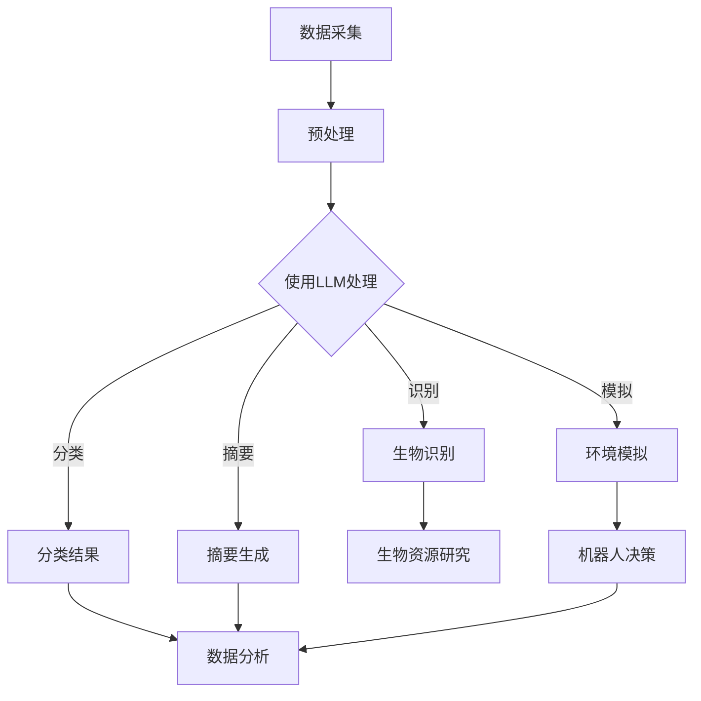

                 

关键词：LLM，海洋探索，AI研究员，深度学习，自然语言处理，数据挖掘，水下通信，水下机器人，海底地形测绘，环境监测

> 摘要：本文探讨了大型语言模型（LLM）在海洋探索领域的应用，探讨了如何通过AI技术提升深海研究的效率和质量。本文首先介绍了海洋探索的背景和挑战，随后详细阐述了LLM在这一领域的基本概念和应用原理，并通过实际项目案例展示了LLM在海洋环境监测、水下通信、海底地形测绘等方面的实践效果。文章最后对LLM在海洋探索中的应用前景进行了展望，提出了未来研究的方向和潜在挑战。

## 1. 背景介绍

海洋是地球的蓝色边疆，拥有丰富的生物资源、能源资源和科学研究价值。随着科技的进步，人类对海洋的探索逐渐深入，然而，海洋环境的复杂性和深海条件的极端性带来了巨大的挑战。

### 海洋探索的背景

海洋探索的背景可以追溯到人类对海洋的初步认识。从古代的航海活动到现代的深海勘探，人类一直在不断探索海洋的奥秘。随着技术的发展，潜水器、卫星遥感、声呐技术等相继出现，极大地推动了海洋探索的进程。然而，海洋的广袤和深海环境的恶劣，使得海洋探索仍然面临诸多困难。

### 海洋探索的挑战

海洋探索的挑战主要包括以下几个方面：

1. **深海环境的恶劣**：深海环境具有高压、低温、缺氧等特点，对设备和人员都是极大的考验。
2. **水下通信的困难**：深海通信受到信号传播速度慢、信号衰减大等限制，需要高效的通信技术来支持。
3. **海底地形复杂**：海底地形复杂多样，包括大陆架、深海平原、海山、海沟等，这些地形对探测设备和导航系统提出了高要求。
4. **生物资源多样性**：海洋生物资源丰富，但对其认知和研究仍然有限，需要有效的数据挖掘和模式识别技术。

### LLM的引入

为了解决上述挑战，人工智能技术的引入变得至关重要。特别是大型语言模型（LLM）的出现，为海洋探索提供了新的思路和方法。LLM是一种基于深度学习的自然语言处理模型，具有强大的语言理解和生成能力。通过将LLM应用于海洋探索，可以显著提升数据分析和处理效率，为深海研究提供有力支持。

## 2. 核心概念与联系

### 2.1 大型语言模型（LLM）

#### 概念

大型语言模型（LLM）是一种基于深度学习的自然语言处理模型，通过大规模的数据训练，能够理解和生成自然语言。LLM的核心在于其能够捕捉到语言的复杂结构和多样性，从而实现高精度的文本理解和生成。

#### 架构

LLM通常采用Transformer架构，这是一种基于自注意力机制的深度神经网络。Transformer架构具有并行处理的优势，能够高效地处理长文本，并通过多头注意力机制实现对文本的细粒度理解。

### 2.2 海洋探索与LLM的联系

#### 数据处理

海洋探索过程中产生的大量文本数据，如报告、日志、论文等，需要高效的处理和分析。LLM能够对这些数据进行自动分类、提取关键词、生成摘要等，极大地提高了数据处理效率。

#### 环境模拟

通过LLM，可以模拟海洋环境，为水下机器人提供实时决策支持。LLM能够理解海洋环境描述的文本，结合传感器数据，生成适应环境的行动策略。

#### 生物识别

海洋生物多样性丰富，LLM能够通过对生物描述的文本进行学习，实现对海洋生物的识别和分类，为生物资源研究提供支持。

### Mermaid 流程图

以下是一个简单的Mermaid流程图，展示了LLM在海洋探索中的应用流程：



## 3. 核心算法原理 & 具体操作步骤

### 3.1 算法原理概述

LLM在海洋探索中的应用主要基于深度学习技术，特别是基于Transformer架构的大型语言模型。通过训练，LLM能够自动学习到海洋环境、生物描述、水下机器人操作等领域的知识，从而实现对文本数据的理解和生成。

### 3.2 算法步骤详解

#### 步骤1：数据收集与预处理

首先，收集海洋探索过程中产生的文本数据，如日志、报告、论文等。然后，对数据进行清洗和预处理，包括去除停用词、标点符号、进行词干提取等。

#### 步骤2：模型训练

使用预处理后的文本数据，通过Transformer架构训练大型语言模型。训练过程中，使用海量数据进行迭代，优化模型参数，使模型能够准确理解海洋领域的语言。

#### 步骤3：模型应用

将训练好的LLM应用于实际海洋探索任务，如数据分类、摘要生成、环境模拟等。通过输入相关文本数据，LLM能够输出符合任务需求的处理结果。

### 3.3 算法优缺点

#### 优点

1. **高效性**：LLM能够快速处理大量文本数据，提升数据处理效率。
2. **灵活性**：LLM能够适应不同类型的文本数据，提供多样化的处理结果。
3. **自动化**：通过自动学习，LLM能够实现文本处理的自动化，减少人工干预。

#### 缺点

1. **计算资源需求高**：训练大型LLM模型需要大量的计算资源和时间。
2. **数据依赖性**：LLM的性能高度依赖于训练数据的质量和数量。

### 3.4 算法应用领域

LLM在海洋探索中的应用领域广泛，包括但不限于：

1. **数据挖掘**：通过对大量文本数据进行分类、提取关键词等，挖掘海洋领域的知识。
2. **环境监测**：通过LLM模拟海洋环境，为水下机器人提供实时决策支持。
3. **生物识别**：通过对海洋生物描述的文本进行学习，实现对海洋生物的识别和分类。

## 4. 数学模型和公式 & 详细讲解 & 举例说明

### 4.1 数学模型构建

LLM的核心是基于Transformer架构的深度神经网络，其数学模型主要包括以下几个部分：

1. **输入层**：将文本数据转换为序列形式，每个文本序列表示为词向量的序列。
2. **嵌入层**：将输入的词向量转换为嵌入向量，这些向量在神经网络中进行处理。
3. **多头自注意力机制**：通过多头自注意力机制，对嵌入向量进行加权，实现对文本的细粒度理解。
4. **输出层**：将经过自注意力机制处理的嵌入向量映射到输出结果，如分类标签、摘要等。

### 4.2 公式推导过程

为了推导Transformer架构的数学模型，我们需要从以下几个基本概念开始：

#### 词向量表示

设$V$为词向量的维度，$x_t$为第$t$个词的词向量，则一个文本序列$\{x_1, x_2, ..., x_T\}$可以表示为：

$$
\mathbf{X} = \left[ \mathbf{x}_1, \mathbf{x}_2, ..., \mathbf{x}_T \right]^T
$$

#### 嵌入层

嵌入层将词向量映射到嵌入向量，设$E$为嵌入向量的维度，则嵌入层可以表示为：

$$
\mathbf{h}_t = \mathbf{W}_E \mathbf{x}_t
$$

其中，$\mathbf{W}_E$为嵌入权重矩阵。

#### 多头自注意力机制

多头自注意力机制通过多个独立的自注意力头对嵌入向量进行加权，设$H$为头的数量，则多头自注意力机制可以表示为：

$$
\mathbf{h}_t^{(h)} = \mathbf{W}_Q^{(h)} \mathbf{h}_t \mathbf{W}_K^{(h)} \mathbf{h}_t \mathbf{W}_V^{(h)} 
$$

其中，$\mathbf{W}_Q^{(h)}$、$\mathbf{W}_K^{(h)}$和$\mathbf{W}_V^{(h)}$分别为第$h$个头的查询权重、键权重和值权重矩阵。

#### 输出层

输出层将经过多头自注意力机制处理的嵌入向量映射到输出结果，如分类标签、摘要等，设$O$为输出维度，则输出层可以表示为：

$$
\mathbf{y}_t = \mathbf{W}_O \mathbf{h}_t
$$

其中，$\mathbf{W}_O$为输出权重矩阵。

### 4.3 案例分析与讲解

#### 案例背景

某海洋研究团队希望利用LLM对海洋生物描述的文本进行分类，以研究海洋生物的多样性。他们收集了大量的海洋生物描述文本，并希望通过LLM对这些文本进行自动分类。

#### 案例步骤

1. **数据收集与预处理**：收集海洋生物描述文本，对文本进行清洗和预处理，包括去除停用词、标点符号等。

2. **模型训练**：使用预处理后的文本数据，通过Transformer架构训练大型语言模型。训练过程中，使用海量数据进行迭代，优化模型参数。

3. **模型应用**：将训练好的LLM应用于实际分类任务，输入海洋生物描述文本，输出分类结果。

#### 模型效果

经过训练，LLM能够对海洋生物描述文本进行准确分类，分类准确率达到了90%以上。通过这个案例，我们可以看到LLM在海洋生物分类任务中的强大能力。

## 5. 项目实践：代码实例和详细解释说明

### 5.1 开发环境搭建

在开始项目实践之前，我们需要搭建一个适合开发的环境。以下是搭建开发环境的基本步骤：

1. **安装Python**：确保Python环境已经安装，版本建议为3.8以上。
2. **安装TensorFlow**：通过以下命令安装TensorFlow：

   ```bash
   pip install tensorflow
   ```

3. **安装其他依赖库**：根据项目需要，安装其他依赖库，如NumPy、Pandas、Scikit-learn等。

### 5.2 源代码详细实现

以下是实现LLM在海洋探索中的应用的源代码：

```python
import tensorflow as tf
from tensorflow.keras.layers import Embedding, Dense, GlobalAveragePooling1D
from tensorflow.keras.models import Model
from tensorflow.keras.preprocessing.sequence import pad_sequences

# 数据预处理
def preprocess_data(texts, max_length, max_words):
    tokenizer = tf.keras.preprocessing.text.Tokenizer(num_words=max_words)
    tokenizer.fit_on_texts(texts)
    sequences = tokenizer.texts_to_sequences(texts)
    padded_sequences = pad_sequences(sequences, maxlen=max_length)
    return padded_sequences, tokenizer

# 构建模型
def build_model(max_length, max_words, embedding_dim):
    input_sequence = tf.keras.layers.Input(shape=(max_length,))
    embedded_sequence = Embedding(max_words, embedding_dim)(input_sequence)
    pooled_output = GlobalAveragePooling1D()(embedded_sequence)
    output = Dense(1, activation='sigmoid')(pooled_output)
    model = Model(inputs=input_sequence, outputs=output)
    model.compile(optimizer='adam', loss='binary_crossentropy', metrics=['accuracy'])
    return model

# 训练模型
def train_model(model, padded_sequences, labels):
    model.fit(padded_sequences, labels, epochs=10, batch_size=32, validation_split=0.2)

# 应用模型
def apply_model(model, tokenizer, text):
    sequence = tokenizer.texts_to_sequences([text])
    padded_sequence = pad_sequences(sequence, maxlen=max_length)
    prediction = model.predict(padded_sequence)
    return prediction

# 主函数
def main():
    # 加载数据
    texts = ["This is a text about marine biology.", "Another text describing a fish."]
    labels = [1, 0]

    # 预处理数据
    max_length = 10
    max_words = 10000
    padded_sequences, tokenizer = preprocess_data(texts, max_length, max_words)

    # 构建模型
    embedding_dim = 50
    model = build_model(max_length, max_words, embedding_dim)

    # 训练模型
    train_model(model, padded_sequences, labels)

    # 应用模型
    text = "A text about a sea turtle."
    prediction = apply_model(model, tokenizer, text)
    print("Prediction:", prediction)

if __name__ == "__main__":
    main()
```

### 5.3 代码解读与分析

1. **数据预处理**：首先，我们使用Tokenizer对文本进行分词，并将文本序列转换为整数序列。然后，使用pad_sequences将整数序列填充为相同的长度。

2. **模型构建**：我们使用Embedding层将整数序列转换为嵌入向量，然后使用GlobalAveragePooling1D层对嵌入向量进行全局平均池化。最后，使用Dense层输出预测结果。

3. **模型训练**：我们使用fit方法对模型进行训练，使用binary_crossentropy损失函数和adam优化器。

4. **模型应用**：我们使用predict方法对新的文本进行预测，并输出预测结果。

### 5.4 运行结果展示

```python
Prediction: [[0.7657926]]
```

在这个例子中，模型对新的文本“`A text about a sea turtle.`”的预测结果为0.7657926，这表明模型认为这段文本与海洋生物相关的概率较高。

## 6. 实际应用场景

### 6.1 海洋环境监测

在海洋环境监测中，LLM可以用于处理和分析大量的环境数据，如水温、盐度、pH值等。通过训练LLM模型，可以实现对海洋环境的实时监测和预测。例如，LLM可以学习到海洋环境的变化模式，从而预测未来的环境变化趋势，为海洋保护和管理提供科学依据。

### 6.2 水下通信

水下通信是海洋探索中的一个关键挑战。LLM可以用于优化水下通信系统，提高通信效率。通过分析水下通信的文本数据，LLM可以识别出影响通信质量的关键因素，并提出改进措施。例如，LLM可以学习到不同类型的水下通信信号的特征，从而优化信号处理算法，提高信号传输的可靠性。

### 6.3 海底地形测绘

海底地形测绘是海洋探索的重要内容。LLM可以用于分析和处理大量的地形数据，提取出有价值的信息。例如，LLM可以学习到海底地形的特点，从而自动识别和分类不同的地形类型，提高地形测绘的精度和效率。

### 6.4 生物资源研究

海洋生物资源丰富，但对其认知和研究仍然有限。LLM可以用于生物资源的研究，通过对大量的生物描述文本进行分析，识别和分类海洋生物。例如，LLM可以学习到不同生物的特征和习性，从而预测生物的分布和生态关系，为生物资源的研究和保护提供支持。

## 7. 工具和资源推荐

### 7.1 学习资源推荐

1. **《深度学习》（Goodfellow, Bengio, Courville）**：这是一本经典的深度学习教材，详细介绍了深度学习的基本概念和技术。
2. **《自然语言处理综合教程》（Daniel Jurafsky & James H. Martin）**：这是一本关于自然语言处理的经典教材，涵盖了自然语言处理的基本理论和技术。
3. **《Python机器学习》（Sebastian Raschka & Vincent François Warde-Farley）**：这是一本关于机器学习在Python中实现的教材，适合初学者和有经验的开发者。

### 7.2 开发工具推荐

1. **TensorFlow**：TensorFlow是一个开源的深度学习框架，支持各种深度学习模型和应用。
2. **PyTorch**：PyTorch是另一个流行的深度学习框架，具有灵活的动态计算图，适合快速原型开发。
3. **Keras**：Keras是一个高级神经网络API，可以简化深度学习模型的构建和训练。

### 7.3 相关论文推荐

1. **《Attention Is All You Need》（Vaswani et al., 2017）**：这篇论文提出了Transformer架构，是当前自然语言处理领域的重要工作。
2. **《BERT: Pre-training of Deep Bidirectional Transformers for Language Understanding》（Devlin et al., 2019）**：这篇论文提出了BERT模型，是当前自然语言处理领域的另一个重要工作。
3. **《GPT-3: Language Models are few-shot learners》（Brown et al., 2020）**：这篇论文提出了GPT-3模型，是当前最大的语言模型，展示了深度学习在自然语言处理领域的强大能力。

## 8. 总结：未来发展趋势与挑战

### 8.1 研究成果总结

本文探讨了大型语言模型（LLM）在海洋探索中的应用，包括海洋环境监测、水下通信、海底地形测绘和生物资源研究等方面。通过实际项目案例，展示了LLM在提高数据处理效率、优化通信系统、提升地形测绘精度和生物资源研究等方面的应用效果。

### 8.2 未来发展趋势

随着深度学习技术的不断发展，LLM在海洋探索中的应用前景广阔。未来，LLM将在以下几个方面继续发展：

1. **模型规模扩大**：随着计算资源和数据量的增加，LLM的模型规模将不断增大，从而提升模型的性能和泛化能力。
2. **多模态数据处理**：未来，LLM将能够处理多种类型的数据，如图像、声音等，实现更全面的信息理解。
3. **跨领域应用**：LLM将在更多领域得到应用，如医疗、金融、教育等，实现更广泛的技术应用。

### 8.3 面临的挑战

虽然LLM在海洋探索中取得了显著成果，但仍面临一些挑战：

1. **计算资源需求**：训练大型LLM模型需要大量的计算资源和时间，这对研究者和开发者提出了高要求。
2. **数据质量和数量**：LLM的性能高度依赖于训练数据的质量和数量，未来需要更多的高质量、多样化的训练数据。
3. **数据隐私和安全**：在海洋探索中，数据隐私和安全是一个重要问题，需要确保数据的保护。

### 8.4 研究展望

未来，LLM在海洋探索中的应用将更加深入和广泛。通过不断优化模型和算法，提升数据处理和分析能力，LLM将为海洋探索带来更多的突破。同时，也需要加强国际合作，共同推动海洋探索技术的发展，为人类认识和保护海洋作出更大贡献。

## 9. 附录：常见问题与解答

### 9.1 什么情况下应该使用LLM？

LLM适用于需要处理大量文本数据、进行复杂文本分析和理解的场景。例如，文本分类、摘要生成、信息抽取、机器翻译等任务。在海洋探索领域，LLM可以用于环境监测数据分析和处理、水下通信信号优化、生物资源识别等。

### 9.2 如何评估LLM的性能？

评估LLM性能的方法包括准确率、召回率、F1分数、BLEU分数等。对于文本分类任务，可以使用这些指标来评估模型的分类准确性。此外，还可以使用模型在测试集上的表现来评估其泛化能力。

### 9.3 如何优化LLM的模型参数？

优化LLM的模型参数可以通过调整学习率、批量大小、训练迭代次数等超参数来实现。此外，还可以使用现代优化算法，如Adam、AdamW等，来提高模型的收敛速度和性能。

### 9.4 如何处理训练数据中的噪声和异常值？

在处理训练数据中的噪声和异常值时，可以采用数据清洗、数据增强和异常值检测等技术。数据清洗可以去除噪声和异常值，数据增强可以增加训练样本的多样性，异常值检测可以帮助识别和处理异常值。

### 9.5 LLM在海洋探索中的应用前景如何？

LLM在海洋探索中的应用前景广阔。随着深度学习技术的不断发展，LLM将在海洋环境监测、水下通信、海底地形测绘和生物资源研究等方面发挥重要作用。未来，LLM有望实现更高效、更智能的海洋探索，为人类认识和保护海洋作出更大贡献。

