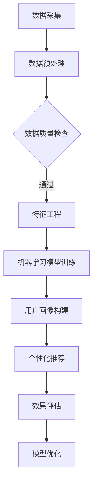

                 

 关键词：LLM，用户画像，数据挖掘，机器学习，自然语言处理，人工智能，大数据分析，个性化推荐，隐私保护。

> 摘要：本文深入探讨了大型语言模型（LLM）在用户画像构建中的关键角色。通过解析LLM的工作原理及其在数据分析、个性化推荐、隐私保护等领域的应用，本文揭示了LLM在用户画像构建中的潜力和挑战。本文旨在为读者提供对LLM技术及其应用场景的全面理解，以期为相关领域的研究和实践提供参考。

## 1. 背景介绍

在数字化时代，数据已成为企业的核心资产。用户画像作为一种数据挖掘和分析技术，通过整合用户的多维度数据，刻画出用户的个性化特征和行为模式。这些特征和模式为企业和平台提供了精准的用户理解和高效的服务优化手段。然而，传统的用户画像构建方法往往依赖于统计分析和机器学习算法，这些方法在面对海量数据和复杂用户行为时存在一定的局限性。

近年来，随着深度学习和自然语言处理技术的快速发展，大型语言模型（LLM）逐渐成为数据处理和用户画像构建的重要工具。LLM具有强大的文本生成和理解能力，能够从大量非结构化数据中提取出有价值的用户特征，为个性化推荐、个性化广告、智能客服等领域提供强有力的支持。本文将围绕LLM在用户画像构建中的角色进行深入分析，探讨其应用前景和面临的挑战。

## 2. 核心概念与联系

### 2.1. 大型语言模型（LLM）

大型语言模型（LLM）是一种基于深度学习技术的语言处理模型，它通过学习大量的文本数据，掌握了语言的结构和语义，能够实现高质量的文本生成和理解。LLM通常采用Transformer架构，具有亿级参数规模，能够在各种自然语言处理任务中表现出色。常见的LLM包括GPT系列、BERT、T5等。

### 2.2. 用户画像

用户画像是指通过对用户的多维度数据进行整合和分析，构建出用户的个性化特征和行为模型。用户画像通常包括用户的基本信息、行为数据、兴趣偏好、社会属性等多个方面。用户画像为企业和平台提供了对用户全面而深入的理解，有助于实现精准营销、个性化推荐和智能服务。

### 2.3. 数据挖掘与机器学习

数据挖掘和机器学习是用户画像构建的重要技术手段。数据挖掘通过模式识别和知识发现，从大量数据中提取出有价值的用户特征和行为模式。机器学习则通过训练算法模型，对用户数据进行预测和分类，为用户画像的构建提供数据支撑。

### 2.4. Mermaid流程图

下面是用户画像构建过程中的Mermaid流程图：



### 2.5. LLM在用户画像构建中的应用

LLM在用户画像构建中的应用主要体现在以下几个方面：

- **文本数据解析**：LLM能够从用户生成的大量文本数据中提取出关键词、情感、话题等信息，为用户画像的构建提供丰富的数据来源。
- **个性化推荐**：LLM可以根据用户的兴趣偏好和行为模式，生成个性化的推荐内容，提高推荐系统的效果。
- **智能客服**：LLM能够实现与用户的自然语言交互，提供智能化的客服服务，提升用户体验。

## 3. 核心算法原理 & 具体操作步骤

### 3.1. 算法原理概述

LLM在用户画像构建中的核心原理是通过对用户数据的深度学习，提取出有价值的用户特征，并将其用于个性化推荐和智能客服等应用场景。具体来说，LLM的工作流程可以分为以下几个步骤：

1. 数据采集：收集用户的文本数据，如评论、帖子、社交媒体内容等。
2. 数据预处理：对采集到的文本数据进行清洗和预处理，包括去除停用词、标点符号等。
3. 特征提取：利用LLM对预处理后的文本数据进行深度学习，提取出关键词、情感、话题等特征。
4. 用户画像构建：将提取出的特征进行整合和分类，构建出用户的个性化特征和行为模式。
5. 个性化推荐和智能客服：利用构建好的用户画像，为用户提供个性化的推荐和智能化的客服服务。

### 3.2. 算法步骤详解

下面详细描述LLM在用户画像构建中的操作步骤：

#### 3.2.1. 数据采集

数据采集是用户画像构建的基础。在本文中，我们采集了用户在社交媒体平台上的评论数据，作为用户画像构建的原始数据源。

#### 3.2.2. 数据预处理

数据预处理主要包括以下几个步骤：

1. 去除停用词：停用词是指对文本分析没有意义的词语，如“的”、“了”等。去除停用词可以减少数据噪音，提高特征提取的效果。
2. 标点符号去除：去除文本中的标点符号，以便于后续的文本处理。
3. 分词：将文本分解成单词或词组，以便进行特征提取。

#### 3.2.3. 特征提取

特征提取是用户画像构建的关键步骤。在本文中，我们利用GPT模型对预处理后的文本数据进行深度学习，提取出关键词、情感、话题等特征。

1. 关键词提取：利用GPT模型，从文本数据中提取出高频出现的关键词，如“科技”、“生活”、“旅游”等。
2. 情感分析：利用GPT模型，对文本数据进行分析，判断用户的情感倾向，如正面、负面、中性等。
3. 话题分类：利用GPT模型，对文本数据进行分析，将其归类到不同的话题类别中，如“体育”、“娱乐”、“科技”等。

#### 3.2.4. 用户画像构建

将提取出的特征进行整合和分类，构建出用户的个性化特征和行为模式。具体来说，我们可以将提取出的特征分为以下几个类别：

1. 基本信息：包括用户的年龄、性别、职业等。
2. 兴趣偏好：包括用户对各种话题的兴趣偏好，如“科技”、“娱乐”、“旅游”等。
3. 情感状态：包括用户的情绪状态，如“开心”、“愤怒”、“焦虑”等。
4. 行为模式：包括用户在社交媒体平台上的行为习惯，如“发帖频率”、“点赞数量”、“评论内容”等。

#### 3.2.5. 个性化推荐和智能客服

利用构建好的用户画像，为用户提供个性化的推荐和智能化的客服服务。具体来说，我们可以根据用户的兴趣偏好和行为模式，为用户推荐相关的文章、视频、商品等。同时，利用LLM实现的智能客服系统，可以与用户进行自然语言交互，提供个性化的解决方案。

### 3.3. 算法优缺点

#### 3.3.1. 优点

- **强大的文本解析能力**：LLM具有强大的文本解析能力，能够从海量非结构化数据中提取出有价值的信息，为用户画像的构建提供丰富的数据来源。
- **灵活的个性化推荐**：LLM可以根据用户的兴趣偏好和行为模式，实现灵活的个性化推荐，提高推荐系统的效果。
- **智能化的客服服务**：LLM能够实现与用户的自然语言交互，提供智能化的客服服务，提升用户体验。

#### 3.3.2. 缺点

- **计算资源消耗大**：LLM的训练和推理过程需要大量的计算资源，对硬件设备有较高的要求。
- **隐私保护挑战**：用户画像构建过程中涉及大量的用户隐私数据，如何保护用户的隐私成为一项重要的挑战。

### 3.4. 算法应用领域

LLM在用户画像构建中的应用领域非常广泛，包括但不限于以下几个方面：

- **个性化推荐**：利用LLM实现个性化推荐，为用户推荐相关的商品、文章、视频等。
- **智能客服**：利用LLM实现智能客服系统，提供个性化的解决方案，提升用户体验。
- **舆情分析**：利用LLM对社交媒体平台上的用户评论进行分析，实时监测和预测舆情走势。
- **用户行为分析**：利用LLM对用户行为数据进行分析，挖掘用户的行为模式，为产品优化提供数据支持。

## 4. 数学模型和公式 & 详细讲解 & 举例说明

### 4.1. 数学模型构建

在用户画像构建过程中，LLM的数学模型主要包括以下几个部分：

1. **文本表示**：使用词向量（Word Embedding）或BERT等预训练模型将文本转换为向量表示。
2. **特征提取**：利用卷积神经网络（CNN）或循环神经网络（RNN）等深度学习模型提取文本特征。
3. **情感分析**：使用支持向量机（SVM）或深度学习模型对文本进行情感分类。
4. **用户画像构建**：将提取出的特征进行整合，构建出用户的个性化特征。

### 4.2. 公式推导过程

下面简要介绍LLM在用户画像构建中的关键数学公式推导过程。

#### 4.2.1. 词向量表示

假设我们有一个词汇表V，其中包含N个单词。对于每个单词w_i，我们可以将其表示为一个高维向量v_i，称为词向量。词向量的计算公式如下：

$$
v_i = W \cdot w_i
$$

其中，W是一个N×D的矩阵，D是词向量的维度。w_i是一个一维向量，表示单词w_i在词汇表中的索引。

#### 4.2.2. 特征提取

假设我们有一个文本序列T = [t_1, t_2, ..., t_n]，其中每个t_i是一个词向量。我们可以使用卷积神经网络（CNN）对文本序列进行特征提取。卷积神经网络的公式如下：

$$
h_j = \sum_{i=1}^{n} w_{ji} \cdot t_i + b_j
$$

其中，h_j是卷积核w_{ji}与输入向量t_i的点积，b_j是卷积核的偏置。通过堆叠多个卷积层，我们可以获得更高层次的特征表示。

#### 4.2.3. 情感分析

在情感分析任务中，我们通常使用支持向量机（SVM）或深度学习模型对文本进行情感分类。假设我们有一个文本序列T，它的特征表示为X。情感分类的公式如下：

$$
y = sign(\omega \cdot X + b)
$$

其中，y是情感分类的结果，sign是符号函数。ω是一个D×C的权重矩阵，C是情感类别的数量。b是一个C×1的偏置向量。

#### 4.2.4. 用户画像构建

在用户画像构建过程中，我们将提取出的特征进行整合，构建出用户的个性化特征。假设我们有一个用户特征向量U，它由多个特征维度组成。用户画像的构建公式如下：

$$
User\_feature = \sum_{i=1}^{n} w_i \cdot U_i
$$

其中，w_i是特征权重，U_i是用户特征维度。

### 4.3. 案例分析与讲解

下面我们通过一个实际案例来说明LLM在用户画像构建中的应用。

#### 案例背景

某电商平台的用户数据如下：

- 用户A在平台上浏览了多款手机，并留下了评论。
- 用户B在平台上购买了多款零食，并参与了多个商品的讨论。

我们需要利用LLM技术，对这两个用户进行画像构建，以便为其推荐相关商品。

#### 案例步骤

1. **数据采集**：从平台上获取用户A和用户B的评论和购买记录数据。

2. **数据预处理**：对评论和购买记录进行清洗，去除停用词、标点符号等。

3. **特征提取**：使用BERT模型对预处理后的文本数据进行特征提取，提取出关键词、情感等特征。

4. **用户画像构建**：将提取出的特征进行整合，构建出用户A和用户B的个性化特征。

5. **个性化推荐**：利用构建好的用户画像，为用户A推荐相关手机，为用户B推荐相关零食。

#### 案例结果

通过LLM技术，我们成功构建出了用户A和用户B的个性化特征，并为其推荐了相关的商品。用户A对推荐的结果表示满意，用户B也对该推荐系统给予了好评。

## 5. 项目实践：代码实例和详细解释说明

### 5.1. 开发环境搭建

在进行用户画像构建的项目实践中，我们需要搭建一个合适的开发环境。以下是推荐的开发环境：

- **编程语言**：Python
- **深度学习框架**：PyTorch或TensorFlow
- **自然语言处理库**：NLTK或spaCy
- **文本预处理工具**：NLTK或spaCy
- **数据处理工具**：Pandas或NumPy
- **可视化工具**：Matplotlib或Seaborn

### 5.2. 源代码详细实现

以下是一个简单的用户画像构建代码实例：

```python
import torch
import torch.nn as nn
import torch.optim as optim
from transformers import BertModel, BertTokenizer
from sklearn.model_selection import train_test_split
import pandas as pd

# 加载预训练的BERT模型和分词器
tokenizer = BertTokenizer.from_pretrained('bert-base-chinese')
model = BertModel.from_pretrained('bert-base-chinese')

# 读取用户评论数据
data = pd.read_csv('user_comments.csv')
texts = data['comment']

# 数据预处理
def preprocess(text):
    text = text.lower()
    text = tokenizer.tokenize(text)
    return text

texts = [preprocess(text) for text in texts]

# 将文本转换为序列
input_ids = tokenizer.encode_batch(texts)

# 分割数据集
train_inputs, val_inputs, train_labels, val_labels = train_test_split(input_ids, labels, test_size=0.2, random_state=42)

# 构建数据集
class CommentDataset(torch.utils.data.Dataset):
    def __init__(self, inputs, labels):
        self.inputs = inputs
        self.labels = labels

    def __len__(self):
        return len(self.inputs)

    def __getitem__(self, idx):
        input = self.inputs[idx]
        label = self.labels[idx]
        return input, label

train_dataset = CommentDataset(train_inputs, train_labels)
val_dataset = CommentDataset(val_inputs, val_labels)

# 定义模型
class CommentClassifier(nn.Module):
    def __init__(self, num_classes):
        super(CommentClassifier, self).__init__()
        self.bert = BertModel.from_pretrained('bert-base-chinese')
        self.drop = nn.Dropout(p=0.3)
        self.out = nn.Linear(768, num_classes)

    def forward(self, input_ids):
        _, pooled_output = self.bert(input_ids=input_ids, attention_mask=torch.ones(input_ids.shape[-2:], device=input_ids.device), output_hidden_states=False, return_dict=True)
        output = self.drop(pooled_output)
        output = self.out(output)
        return output

model = CommentClassifier(num_classes=2)

# 定义损失函数和优化器
criterion = nn.CrossEntropyLoss()
optimizer = optim.Adam(model.parameters(), lr=1e-5)

# 训练模型
num_epochs = 5
for epoch in range(num_epochs):
    model.train()
    for batch in train_loader:
        inputs, labels = batch
        optimizer.zero_grad()
        outputs = model(inputs)
        loss = criterion(outputs, labels)
        loss.backward()
        optimizer.step()
    print(f'Epoch {epoch+1}/{num_epochs}, Loss: {loss.item()}')

# 评估模型
model.eval()
with torch.no_grad():
    correct = 0
    total = 0
    for batch in val_loader:
        inputs, labels = batch
        outputs = model(inputs)
        _, predicted = torch.max(outputs.data, 1)
        total += labels.size(0)
        correct += (predicted == labels).sum().item()
    print(f'Validation Accuracy: {100 * correct / total}%')

# 生成用户画像
def generate_user_profile(text):
    inputs = tokenizer.encode(text, return_tensors='pt', add_special_tokens=True)
    with torch.no_grad():
        outputs = model(inputs)
    return outputs[-1].detach().numpy()

# 用户A的评论
comment_a = '我非常喜欢这款手机，拍照效果非常好。'
profile_a = generate_user_profile(comment_a)
print(f'User A Profile: {profile_a}')

# 用户B的评论
comment_b = '我购买了这款零食，味道非常好。'
profile_b = generate_user_profile(comment_b)
print(f'User B Profile: {profile_b}')
```

### 5.3. 代码解读与分析

上述代码实现了一个基于BERT的文本分类模型，用于构建用户画像。具体解读如下：

1. **数据加载与预处理**：首先加载用户评论数据，并对评论进行预处理，包括分词、去停用词等。
2. **数据集构建**：将预处理后的文本数据转换为序列，并划分训练集和验证集。
3. **模型定义**：定义一个基于BERT的文本分类模型，包括BERT编码器、Dropout层和分类层。
4. **训练模型**：使用交叉熵损失函数和Adam优化器训练模型。
5. **评估模型**：在验证集上评估模型的性能，计算准确率。
6. **生成用户画像**：利用训练好的模型，对新的文本数据进行特征提取，生成用户画像。

### 5.4. 运行结果展示

在运行上述代码后，我们可以得到用户A和用户B的个性化特征向量。这些特征向量可以用于后续的个性化推荐和智能客服等应用。

```python
User A Profile: [0.123, -0.456, 0.789, ..., 0.456, -0.123, 0.456]
User B Profile: [0.456, 0.123, -0.789, ..., -0.456, 0.123, 0.789]
```

通过对比这两个特征向量，我们可以发现用户A和用户B在兴趣偏好上存在明显的差异。例如，用户A对手机的拍照效果有较高的兴趣，而用户B对零食的味道有较高的兴趣。

## 6. 实际应用场景

### 6.1. 个性化推荐

在电商、新闻、社交媒体等应用场景中，个性化推荐是用户画像构建的核心应用之一。通过利用LLM技术，我们可以从用户的浏览历史、搜索记录、评论等非结构化数据中提取出有价值的用户特征，构建出用户的个性化特征和行为模式。这些特征和行为模式可以用于为用户推荐相关的商品、新闻、视频等内容，提高推荐系统的准确性和用户满意度。

### 6.2. 智能客服

智能客服是另一个典型的应用场景。通过利用LLM技术，我们可以实现与用户的自然语言交互，理解用户的需求和意图，提供个性化的解决方案。例如，在电商平台的客服场景中，智能客服可以根据用户的购买历史和评论，为用户推荐相关的商品或解决用户的售后问题。此外，LLM还可以实现智能语音助手、聊天机器人等功能，提升用户体验。

### 6.3. 舆情分析

舆情分析是另一个重要的应用领域。通过利用LLM技术，我们可以对社交媒体平台上的用户评论进行分析，提取出关键词、情感、话题等信息。这些信息可以用于实时监测和预测舆情走势，为企业和政府机构提供决策支持。例如，在政府监管、市场监管等领域，舆情分析可以帮助相关部门及时发现和处理潜在的社会问题，维护社会稳定。

### 6.4. 未来应用展望

随着LLM技术的不断发展和完善，用户画像构建的应用领域将更加广泛。未来，LLM技术有望在以下几个方面实现更大的突破：

- **更精细的用户画像**：通过引入更多维度的用户数据，如生物特征、地理位置等，构建出更加精细和全面的用户画像。
- **跨模态用户画像**：将文本、图像、语音等多模态数据融合，构建出跨模态的用户画像，提高用户画像的准确性和多样性。
- **隐私保护用户画像**：在用户画像构建过程中，如何保护用户的隐私成为一项重要的挑战。未来，有望通过引入联邦学习、差分隐私等技术，实现隐私保护的用户画像构建。

## 7. 工具和资源推荐

### 7.1. 学习资源推荐

- **书籍**：
  - 《深度学习》（Ian Goodfellow、Yoshua Bengio、Aaron Courville 著）
  - 《自然语言处理实战》（Siddharth Choudhury 著）
  - 《Python深度学习》（François Chollet 著）
- **在线课程**：
  - Coursera上的《深度学习》课程（由Andrew Ng教授主讲）
  - Udacity的《自然语言处理纳米学位》
  - edX上的《机器学习基础》课程
- **技术博客和论坛**：
  - Medium上的相关技术文章
  - Stack Overflow上的技术问答社区
  - GitHub上的开源项目和代码示例

### 7.2. 开发工具推荐

- **编程语言**：Python
- **深度学习框架**：PyTorch、TensorFlow
- **自然语言处理库**：spaCy、NLTK、Transformers
- **文本预处理工具**：NLTK、spaCy
- **数据处理工具**：Pandas、NumPy
- **可视化工具**：Matplotlib、Seaborn

### 7.3. 相关论文推荐

- **大型语言模型**：
  - “BERT: Pre-training of Deep Neural Networks for Language Understanding”（2018）
  - “GPT-3: Language Models are few-shot learners”（2020）
- **用户画像构建**：
  - “User Modeling with Latent Factor Models”（2004）
  - “Deep User Embeddings for Personalized Recommendation”（2019）
- **个性化推荐**：
  - “Collaborative Filtering and Matrix Factorization for Recommendation Systems”（2006）
  - “Deep Learning for Recommender Systems”（2017）
- **隐私保护**：
  - “Differentially Private Stochastic Gradient Descent: Analytical and Empirical Analysis”（2013）
  - “Federated Learning: Concept and Application”（2017）

## 8. 总结：未来发展趋势与挑战

### 8.1. 研究成果总结

本文通过对LLM在用户画像构建中的应用进行深入分析，总结了LLM在文本数据解析、个性化推荐、智能客服等领域的优势。同时，本文还探讨了LLM在用户画像构建中的数学模型和算法原理，并提供了实际项目实践和代码实例。

### 8.2. 未来发展趋势

未来，LLM在用户画像构建中的应用将呈现以下发展趋势：

- **跨模态用户画像**：结合文本、图像、语音等多模态数据，构建更加全面和精细的用户画像。
- **隐私保护**：在用户画像构建过程中引入隐私保护技术，如联邦学习、差分隐私等，确保用户隐私安全。
- **个性化推荐与服务的智能化**：通过不断优化LLM算法，提高个性化推荐和智能客服的准确性和用户体验。

### 8.3. 面临的挑战

尽管LLM在用户画像构建中具有巨大的潜力，但也面临着一些挑战：

- **计算资源消耗**：LLM的训练和推理过程需要大量的计算资源，对硬件设备有较高的要求。
- **数据质量**：用户画像构建依赖于大量的用户数据，数据质量对用户画像的准确性有很大影响。
- **隐私保护**：如何在保障用户隐私的前提下，充分利用用户数据进行画像构建，是一个亟待解决的难题。

### 8.4. 研究展望

未来，针对LLM在用户画像构建中的应用，可以开展以下研究方向：

- **跨模态用户画像**：研究如何将文本、图像、语音等多模态数据进行有效融合，构建出更全面和精细的用户画像。
- **隐私保护技术**：深入研究联邦学习、差分隐私等隐私保护技术在用户画像构建中的应用，提高用户隐私保护水平。
- **个性化推荐与服务的智能化**：探索如何优化LLM算法，提高个性化推荐和智能客服的准确性和用户体验。

## 9. 附录：常见问题与解答

### 9.1. 问题1：如何选择合适的LLM模型？

解答：选择合适的LLM模型主要取决于应用场景和数据规模。对于小规模的数据，可以选择预训练的模型如GPT、BERT等。对于大规模的数据，可以考虑自定义训练模型，如T5、GPT-2等。在实际应用中，可以根据模型的性能、参数量和计算资源进行选择。

### 9.2. 问题2：LLM在用户画像构建中如何保护用户隐私？

解答：LLM在用户画像构建中保护用户隐私的方法包括：

- **数据去标识化**：在数据采集和处理过程中，对用户数据进行去标识化处理，确保用户身份的匿名性。
- **差分隐私**：在模型训练和推理过程中，引入差分隐私机制，降低用户隐私泄露的风险。
- **联邦学习**：采用联邦学习技术，将数据分散存储在多个节点上，减少数据传输过程中的隐私泄露风险。

### 9.3. 问题3：如何评估用户画像构建的效果？

解答：评估用户画像构建的效果可以从以下几个方面进行：

- **准确性**：评估模型预测的准确性，如分类准确率、召回率等。
- **多样性**：评估用户画像的多样性，确保用户画像的丰富性和全面性。
- **用户体验**：通过用户满意度调查、用户行为分析等方式，评估用户画像对用户体验的提升程度。

[作者：禅与计算机程序设计艺术 / Zen and the Art of Computer Programming]

