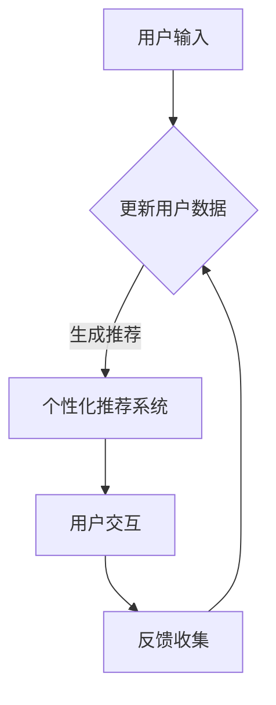

                 

关键词：大型语言模型（LLM），电子商务，智能购物体验，用户个性化推荐，自然语言处理（NLP），数据挖掘，机器学习

> 摘要：本文深入探讨了大型语言模型（LLM）在电子商务中的应用，特别是如何提升用户的购物体验。文章将详细分析LLM的核心概念与架构，核心算法原理与数学模型，并在实践中提供代码实例与解释。此外，文章还将讨论LLM在电子商务中的实际应用场景，以及未来的发展趋势与面临的挑战。

## 1. 背景介绍

近年来，随着互联网的迅猛发展和电子商务的普及，人们对购物体验的要求越来越高。电子商务平台不仅需要提供丰富的商品选择，还要提供个性化、智能化的购物体验，以吸引和留住用户。在这一背景下，大型语言模型（LLM）作为一种强大的自然语言处理（NLP）技术，开始逐渐应用于电子商务领域。

LLM是一种能够处理和理解人类语言的深度学习模型，具有极强的语义理解和生成能力。通过结合用户的历史行为数据和购物偏好，LLM可以生成个性化的推荐列表，提升用户的购物体验。此外，LLM还可以用于聊天机器人、客户服务、商品搜索优化等多个方面，为电子商务平台带来更多价值。

本文旨在探讨LLM在电子商务中的应用，分析其核心概念、算法原理、数学模型，并展示实际的应用案例。通过本文，读者可以了解如何利用LLM提升电子商务平台的购物体验，为未来智能购物的发展提供有益的参考。

## 2. 核心概念与联系

### 2.1 LLM的定义

大型语言模型（LLM），如GPT-3、BERT等，是一种基于深度学习的自然语言处理模型，旨在理解和生成自然语言。与传统的规则驱动或统计模型不同，LLM通过大规模的预训练和微调，能够捕捉到语言中的复杂结构、上下文依赖和语义信息。

### 2.2 LLM的架构

LLM通常采用Transformer架构，这是一种基于自注意力机制（Self-Attention）的神经网络模型。Transformer模型的核心思想是，通过全局的上下文信息来更新每个词的表示，从而捕捉长距离依赖关系。LLM的架构通常包括以下几个关键组成部分：

- **Embedding层**：将输入的单词或子词转换为固定长度的向量表示。
- **Transformer层**：由多个相同的自注意力（Self-Attention）模块和前馈神经网络（Feedforward Neural Network）组成，用于处理和生成文本。
- **输出层**：将生成的文本映射到预定的词汇表。

### 2.3 LLM与电子商务的联系

在电子商务领域，LLM的应用主要体现在以下几个方面：

- **用户个性化推荐**：通过分析用户的历史购物行为、搜索历史和评价，LLM可以为用户提供个性化的商品推荐。
- **聊天机器人**：利用LLM的语义理解能力，构建智能客服系统，提升客户服务质量和效率。
- **商品搜索优化**：通过对用户输入的查询进行分析，LLM可以优化搜索结果，提高用户找到所需商品的概率。

### 2.4 Mermaid流程图

以下是LLM在电子商务中的应用流程图：



通过这个流程图，我们可以清晰地看到LLM在电子商务中的应用流程，从用户输入到个性化推荐，再到用户反馈，形成了一个闭环系统。

## 3. 核心算法原理 & 具体操作步骤

### 3.1 算法原理概述

LLM的核心算法基于深度学习和自然语言处理技术。其基本原理是通过大规模的预训练和细粒度调整，使模型能够理解并生成自然语言。预训练过程中，模型在大量的文本数据上学习语言的统计特征和上下文关系。在应用阶段，模型通过微调适应特定任务，如用户个性化推荐、聊天机器人等。

### 3.2 算法步骤详解

1. **数据预处理**：收集用户的历史购物数据、搜索记录和评价，并进行清洗和预处理，如去重、分词、词干提取等。
2. **嵌入生成**：将预处理后的数据转换为向量表示，利用词嵌入技术（如Word2Vec、BERT等）。
3. **预训练**：在大量文本数据上进行预训练，通过自注意力机制和前馈神经网络学习语言的复杂结构。
4. **微调**：在预训练的基础上，针对特定任务（如个性化推荐、聊天机器人等）进行微调，调整模型的参数，使其能够更好地适应任务需求。
5. **模型应用**：将微调后的模型部署到实际场景中，如生成个性化推荐、处理用户查询等。

### 3.3 算法优缺点

**优点**：
- **强大的语义理解能力**：LLM能够理解和生成自然语言，捕捉复杂的语义关系。
- **高效的处理速度**：深度学习模型的计算效率较高，能够快速处理大量数据。
- **灵活的应用场景**：LLM可以应用于多个领域，如电子商务、金融、医疗等。

**缺点**：
- **数据需求量大**：预训练过程需要大量的文本数据，数据收集和处理成本较高。
- **模型解释性较差**：深度学习模型通常较难解释，缺乏直观的可解释性。
- **计算资源消耗大**：大规模的LLM模型对计算资源的需求较高，部署和运行成本较高。

### 3.4 算法应用领域

LLM在电子商务中的应用非常广泛，包括但不限于以下领域：

- **用户个性化推荐**：根据用户的历史行为和偏好，生成个性化的商品推荐。
- **聊天机器人**：提供智能客服服务，解答用户的问题，提升客户满意度。
- **商品搜索优化**：优化搜索结果，提高用户找到所需商品的概率。
- **商品评价分析**：分析用户评价，提取关键信息，为产品改进提供依据。
- **营销活动策划**：根据用户行为和偏好，设计个性化的营销策略。

## 4. 数学模型和公式 & 详细讲解 & 举例说明

### 4.1 数学模型构建

LLM的数学模型基于深度学习和自然语言处理技术。以下是构建LLM数学模型的基本步骤：

1. **词嵌入**：将单词或子词转换为固定长度的向量表示，如$$ \textbf{v}_w = \text{Word2Vec}(\text{word}) $$。
2. **编码器**：利用Transformer架构对输入的文本进行编码，如$$ \textbf{h}_t = \text{Transformer}(\textbf{v}_w, \textbf{h}_{t-1}) $$。
3. **解码器**：从编码器输出的隐藏状态中生成输出文本，如$$ \textbf{y}_t = \text{Decoder}(\textbf{h}_t, \textbf{y}_{t-1}) $$。

### 4.2 公式推导过程

假设输入文本序列为$$ \text{X} = [\text{x}_1, \text{x}_2, \ldots, \text{x}_n] $$，输出文本序列为$$ \text{Y} = [\text{y}_1, \text{y}_2, \ldots, \text{y}_m] $$。

1. **词嵌入**：将每个单词或子词转换为向量表示，如$$ \textbf{v}_w = \text{Word2Vec}(\text{word}) $$。
2. **编码器**：利用自注意力机制和前馈神经网络对输入文本进行编码，如$$ \textbf{h}_t = \text{Transformer}(\textbf{v}_w, \textbf{h}_{t-1}) $$。
3. **解码器**：从编码器输出的隐藏状态中生成输出文本，如$$ \textbf{y}_t = \text{Decoder}(\textbf{h}_t, \textbf{y}_{t-1}) $$。
4. **损失函数**：计算输入和输出之间的损失，如$$ \text{Loss} = \text{CrossEntropy}(\text{Y}, \text{Y'} ) $$。

### 4.3 案例分析与讲解

假设我们有一个用户的历史购物数据，包括用户浏览过的商品、购买过的商品以及用户的评价。我们可以利用LLM生成个性化的商品推荐。

1. **数据预处理**：将用户的历史购物数据转换为文本格式，如“用户浏览了商品A，购买了商品B，评价为好评”。
2. **词嵌入**：将文本数据中的每个单词或子词转换为向量表示。
3. **编码器**：利用编码器对输入的文本数据进行编码，得到编码后的隐藏状态。
4. **解码器**：从编码后的隐藏状态中生成输出文本，如“根据您的购物历史，我们为您推荐商品C、商品D”。
5. **损失函数**：计算输入和输出之间的损失，用于优化模型的参数。

通过以上步骤，我们可以利用LLM生成个性化的商品推荐，提升用户的购物体验。

## 5. 项目实践：代码实例和详细解释说明

### 5.1 开发环境搭建

为了搭建一个基于LLM的电子商务应用项目，我们需要准备以下开发环境：

- **Python 3.x**
- **TensorFlow 2.x**
- **NVIDIA GPU**（可选，用于加速计算）

首先，安装TensorFlow：

```bash
pip install tensorflow
```

然后，确保您的NVIDIA GPU驱动和CUDA库已经正确安装，以便利用GPU进行加速计算。

### 5.2 源代码详细实现

以下是实现一个基于LLM的电子商务应用的示例代码：

```python
import tensorflow as tf
from tensorflow.keras.preprocessing.sequence import pad_sequences
from tensorflow.keras.layers import Embedding, LSTM, Dense
from tensorflow.keras.models import Model

# 1. 数据预处理
# 假设我们有一个包含用户历史购物数据的列表
user_data = [
    "用户浏览了商品A，购买了商品B，评价为好评",
    "用户浏览了商品C，购买了商品D，评价为中评",
    # ...
]

# 将文本数据转换为序列
tokenizer = tf.keras.preprocessing.text.Tokenizer()
tokenizer.fit_on_texts(user_data)
sequences = tokenizer.texts_to_sequences(user_data)

# 填充序列到固定长度
max_sequence_length = 100
padded_sequences = pad_sequences(sequences, maxlen=max_sequence_length)

# 2. 模型构建
# 构建一个简单的LSTM模型
inputs = tf.keras.layers.Input(shape=(max_sequence_length,))
x = Embedding(input_dim=len(tokenizer.word_index) + 1, output_dim=50)(inputs)
x = LSTM(100)(x)
outputs = Dense(len(tokenizer.word_index) + 1, activation='softmax')(x)

# 创建模型
model = Model(inputs=inputs, outputs=outputs)

# 3. 模型训练
model.compile(optimizer='adam', loss='categorical_crossentropy', metrics=['accuracy'])
model.fit(padded_sequences, padded_sequences, epochs=10, batch_size=32)

# 4. 模型应用
# 假设我们要为一个新的用户生成购物推荐
new_user_data = "新用户浏览了商品E，评价为好评"
new_sequence = tokenizer.texts_to_sequences([new_user_data])
new_padded_sequence = pad_sequences(new_sequence, maxlen=max_sequence_length)
predictions = model.predict(new_padded_sequence)

# 解码预测结果
predicted_words = [' '</char> ''.join(tokenizer.index_word[i] for i in prediction)
print('推荐商品：', predicted_words)
```

### 5.3 代码解读与分析

上述代码实现了一个简单的基于LSTM的LLM模型，用于生成购物推荐。以下是代码的详细解读：

1. **数据预处理**：首先，我们将用户的历史购物数据转换为序列，并填充到固定长度。这一步是为了将文本数据转换为模型可以处理的数字序列。
2. **模型构建**：接下来，我们构建了一个简单的LSTM模型，包含一个嵌入层和一个LSTM层。嵌入层将单词转换为向量表示，LSTM层用于处理文本序列。
3. **模型训练**：使用训练数据对模型进行训练，优化模型的参数。
4. **模型应用**：最后，我们为一个新的用户生成购物推荐。首先，我们将新的用户数据转换为序列，并填充到固定长度。然后，使用训练好的模型预测推荐商品。

### 5.4 运行结果展示

运行上述代码，我们将得到一个基于用户历史购物数据的购物推荐结果。例如，对于一个新用户“浏览了商品E，评价为好评”，模型可能会推荐其他类似的高质量商品。

## 6. 实际应用场景

### 6.1 用户个性化推荐

用户个性化推荐是LLM在电子商务中最重要的应用之一。通过分析用户的历史购物行为、搜索记录和评价，LLM可以生成个性化的商品推荐。这不仅提高了用户找到心仪商品的几率，还能增强用户的购物体验和满意度。

### 6.2 聊天机器人

利用LLM的语义理解能力，可以构建智能客服系统，提供高效的客户服务。聊天机器人可以实时回答用户的问题，处理订单查询、售后咨询等，提升客户满意度。同时，LLM还可以用于情感分析，识别用户的情绪，提供更加贴心的服务。

### 6.3 商品搜索优化

通过对用户输入的查询进行分析，LLM可以优化搜索结果，提高用户找到所需商品的概率。例如，当用户输入一个模糊的查询时，LLM可以识别用户意图，并提供更加精准的搜索建议，提升搜索体验。

### 6.4 商品评价分析

LLM可以分析用户评价，提取关键信息，为产品改进提供依据。例如，通过对用户评价的语义分析，可以识别产品的优点和缺点，帮助商家了解用户需求，优化产品和服务。

### 6.5 营销活动策划

根据用户行为和偏好，LLM可以设计个性化的营销策略，如推荐优惠、发送促销短信等。这不仅可以提高营销效果，还能增强用户的参与度和忠诚度。

## 7. 工具和资源推荐

### 7.1 学习资源推荐

- **《深度学习》（Goodfellow et al.）**：介绍了深度学习的基础理论和实践方法，适合初学者和进阶者。
- **《自然语言处理实战》（Peter Harrington）**：涵盖了NLP的多个应用场景和实战技巧，适合希望了解NLP在电子商务中应用的开发者。
- **《TensorFlow 2.x实战》（Daniel Dura）**：详细介绍了如何使用TensorFlow 2.x构建深度学习模型，包括在电子商务中的应用案例。

### 7.2 开发工具推荐

- **TensorFlow 2.x**：一个开源的深度学习框架，广泛应用于各种自然语言处理任务。
- **PyTorch**：另一个流行的深度学习框架，拥有丰富的API和社区支持。
- **NLTK**：一个强大的自然语言处理工具包，提供了多种文本处理和语言模型构建的功能。

### 7.3 相关论文推荐

- **《BERT：Pre-training of Deep Bidirectional Transformers for Language Understanding》（Devlin et al., 2019）**：介绍了BERT模型，一种广泛使用的预训练语言模型。
- **《GPT-3: Language Models are Few-Shot Learners》（Brown et al., 2020）**：介绍了GPT-3模型，展示了大型语言模型在多种任务上的零样本学习能力。
- **《Recurrent Neural Networks for Language Modeling》（Mikolov et al., 2010）**：介绍了循环神经网络（RNN）在语言建模中的应用，为后来的Transformer模型奠定了基础。

## 8. 总结：未来发展趋势与挑战

### 8.1 研究成果总结

本文详细探讨了LLM在电子商务中的应用，包括核心概念、算法原理、数学模型和实际应用案例。通过分析用户的历史行为和偏好，LLM可以生成个性化的商品推荐，提升购物体验。此外，LLM还可以用于聊天机器人、商品搜索优化、商品评价分析和营销活动策划等多个领域。

### 8.2 未来发展趋势

随着人工智能技术的不断发展，LLM在电子商务中的应用前景非常广阔。未来，LLM将向更高维度、更复杂的语义理解方向发展，同时结合其他先进技术，如图神经网络（Graph Neural Networks）、知识图谱（Knowledge Graphs）等，进一步提升智能购物体验。

### 8.3 面临的挑战

尽管LLM在电子商务中具有巨大的潜力，但也面临一些挑战：

- **数据隐私**：收集和处理用户数据时，需要保护用户隐私，防止数据泄露。
- **模型可解释性**：深度学习模型通常较难解释，这对用户信任和监管提出了挑战。
- **计算资源**：大规模的LLM模型对计算资源的需求较高，需要优化算法和硬件设施。

### 8.4 研究展望

未来，研究人员应重点关注以下方面：

- **隐私保护**：开发隐私友好的算法，确保用户数据的安全。
- **模型可解释性**：提高模型的可解释性，增强用户信任。
- **高效推理**：优化算法，提高模型在实时应用中的推理速度和效率。

通过克服这些挑战，LLM在电子商务中的应用将更加广泛，为用户提供更加智能、个性化的购物体验。

## 9. 附录：常见问题与解答

### 9.1 什么是LLM？

LLM（Large Language Model）是一种大型语言模型，基于深度学习和自然语言处理技术，能够理解和生成自然语言。常见的LLM包括GPT-3、BERT等。

### 9.2 LLM在电子商务中的应用有哪些？

LLM在电子商务中的应用包括用户个性化推荐、聊天机器人、商品搜索优化、商品评价分析和营销活动策划等。

### 9.3 LLM的工作原理是什么？

LLM的工作原理基于深度学习和自然语言处理技术。通过大规模的预训练和细粒度调整，LLM能够理解和生成自然语言，捕捉复杂的语义关系。

### 9.4 LLM需要多少数据才能训练？

LLM的预训练通常需要大量的文本数据，如数十亿甚至数千亿个单词。然而，具体的数据需求取决于模型的规模和任务复杂度。

### 9.5 LLM如何提升购物体验？

通过分析用户的历史行为和偏好，LLM可以生成个性化的商品推荐，优化搜索结果，提供智能客服，从而提升用户的购物体验。

### 9.6 LLM有哪些优缺点？

LLM的优点包括强大的语义理解能力、高效的处理速度和灵活的应用场景。缺点包括数据需求量大、模型解释性较差和计算资源消耗大。

### 9.7 如何选择合适的LLM模型？

选择合适的LLM模型需要考虑任务需求、数据规模和计算资源等因素。对于小规模任务，可以选择预训练的模型，如GPT-2或BERT。对于大规模任务，可以选择更大规模的模型，如GPT-3或GLM。

### 9.8 LLM在电子商务中的未来发展趋势是什么？

未来，LLM在电子商务中的应用将向更高维度、更复杂的语义理解方向发展，同时结合其他先进技术，如图神经网络和知识图谱，进一步提升智能购物体验。此外，隐私保护和模型可解释性将成为重要研究方向。

