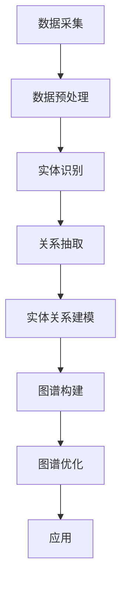

                 

关键词：知识图谱、语言模型、预训练、自然语言处理、图谱构建、人工智能、算法、数学模型

> 摘要：本文深入探讨了大型语言模型（LLM）在知识图谱构建中的应用进展。通过分析LLM的核心原理、数学模型、算法步骤以及其在实际项目中的应用，探讨了LLM在知识图谱构建领域的优势、挑战及未来发展方向。本文旨在为相关领域的研究者提供有价值的参考和指导。

## 1. 背景介绍

知识图谱作为一种结构化的语义知识表示方法，已经被广泛应用于各个领域，如搜索引擎、推荐系统、自然语言处理等。知识图谱的核心是实体和关系，通过对实体和关系的建模，实现知识的有效组织和推理。然而，传统知识图谱的构建过程通常依赖于人工标注和领域专家的知识，效率低、成本高。

近年来，随着深度学习和自然语言处理技术的发展，大型语言模型（LLM）逐渐成为一种强大的知识表示工具。LLM通过在大量文本数据上进行预训练，学习到了丰富的语言知识和结构化信息，能够自动捕捉实体和关系，为知识图谱的构建提供了新的思路和方法。

## 2. 核心概念与联系

### 2.1 语言模型

语言模型是一种用于预测文本序列的概率分布模型，其主要目标是根据前文预测下一个单词或字符。在深度学习时代，语言模型通常采用神经网络架构，如循环神经网络（RNN）、长短期记忆网络（LSTM）和变换器（Transformer）等。

### 2.2 预训练

预训练是指在一个大规模的语料库上对语言模型进行训练，使其学习到丰富的语言知识和结构化信息。预训练后的语言模型可以进一步适应特定任务，如文本分类、情感分析、问答系统等。

### 2.3 知识图谱

知识图谱是一种结构化的知识表示方法，通过实体和关系的建模，实现对知识的有效组织和推理。知识图谱可以被视为一种图结构，其中实体表示知识元素，关系表示实体之间的语义联系。

### 2.4 Mermaid 流程图

以下是知识图谱构建过程中涉及的几个关键步骤，使用Mermaid流程图进行描述：



## 3. 核心算法原理 & 具体操作步骤

### 3.1 算法原理概述

LLM在知识图谱构建中的应用主要包括以下方面：

1. 实体识别：利用LLM预训练模型对文本中的实体进行识别和分类。
2. 关系抽取：通过分析实体之间的语义联系，利用LLM提取出实体之间的关系。
3. 实体关系建模：将识别出的实体和关系构建成图结构，形成知识图谱。
4. 图谱优化：利用LLM对知识图谱进行优化，提高其质量和应用效果。

### 3.2 算法步骤详解

1. **数据采集**：收集包含实体和关系的文本数据，如新闻、百科、社交媒体等。

2. **数据预处理**：对采集到的文本数据进行清洗、分词、去停用词等预处理操作，为后续的实体识别和关系抽取做准备。

3. **实体识别**：利用预训练的LLM模型对文本中的实体进行识别和分类，将文本转换为实体序列。

4. **关系抽取**：分析实体之间的语义联系，利用LLM提取出实体之间的关系，将实体序列转换为关系序列。

5. **实体关系建模**：将识别出的实体和关系构建成图结构，形成知识图谱。

6. **图谱优化**：利用LLM对知识图谱进行优化，如实体融合、关系分类、图谱剪枝等，提高其质量和应用效果。

### 3.3 算法优缺点

**优点**：

1. 高效：利用LLM预训练模型，可以快速识别和抽取实体及关系。
2. 准确：LLM具有强大的语言理解和生成能力，能够准确捕捉实体和关系。
3. 灵活：LLM可以适应不同领域的知识图谱构建任务，具有较好的泛化能力。

**缺点**：

1. 计算资源消耗大：预训练LLM模型需要大量计算资源和时间。
2. 数据依赖性强：LLM的性能依赖于训练数据的质量和数量。
3. 实体关系建模复杂：知识图谱构建过程中涉及到的实体关系建模相对复杂，需要解决实体冲突、关系歧义等问题。

### 3.4 算法应用领域

LLM在知识图谱构建中的应用广泛，如：

1. 搜索引擎：利用LLM构建结构化知识库，提高搜索精度和用户体验。
2. 推荐系统：基于知识图谱中的实体和关系进行推荐，提高推荐效果。
3. 自然语言处理：利用知识图谱进行文本生成、文本理解、问答系统等任务。

## 4. 数学模型和公式 & 详细讲解 & 举例说明

### 4.1 数学模型构建

在知识图谱构建过程中，常见的数学模型包括：

1. 实体表示：利用神经网络模型（如Transformer）对实体进行编码，生成实体向量表示。
2. 关系表示：利用神经网络模型对关系进行编码，生成关系向量表示。
3. 实体关系建模：利用图神经网络（如Graph Convolutional Network）对实体和关系进行建模，生成知识图谱表示。

### 4.2 公式推导过程

以下简要介绍几种常见数学公式的推导过程：

1. **实体向量表示**：

   假设实体 $e_i$ 的特征向量为 $x_i \in \mathbb{R}^d$，则实体向量表示可表示为：

   $$ e_i = \text{softmax}(W_e x_i + b_e) $$

   其中，$W_e$ 和 $b_e$ 分别为权重矩阵和偏置向量。

2. **关系向量表示**：

   假设关系 $r_j$ 的特征向量为 $y_j \in \mathbb{R}^d$，则关系向量表示可表示为：

   $$ r_j = \text{softmax}(W_r y_j + b_r) $$

   其中，$W_r$ 和 $b_r$ 分别为权重矩阵和偏置向量。

3. **知识图谱表示**：

   假设知识图谱中的实体集合为 $E$，关系集合为 $R$，则知识图谱表示可表示为：

   $$ G = (E, R, L) $$

   其中，$L$ 为实体关系映射矩阵，$l_{ij}$ 表示实体 $e_i$ 和关系 $r_j$ 之间的映射关系。

### 4.3 案例分析与讲解

以下以一个简单的知识图谱构建案例为例，说明LLM在知识图谱构建中的应用。

**案例背景**：构建一个包含人物、地点和事件的知识图谱，其中人物实体包括“张三”、“李四”等，地点实体包括“北京”、“上海”等，事件实体包括“结婚”、“旅游”等。

**步骤1：数据采集**：从互联网上收集包含人物、地点和事件的文本数据，如新闻、百科、社交媒体等。

**步骤2：数据预处理**：对采集到的文本数据进行清洗、分词、去停用词等预处理操作。

**步骤3：实体识别**：利用预训练的LLM模型对文本中的实体进行识别和分类，生成实体序列。

**步骤4：关系抽取**：通过分析实体之间的语义联系，利用LLM提取出实体之间的关系，生成关系序列。

**步骤5：实体关系建模**：将识别出的实体和关系构建成图结构，形成知识图谱。

**步骤6：图谱优化**：利用LLM对知识图谱进行优化，如实体融合、关系分类、图谱剪枝等，提高其质量和应用效果。

通过以上步骤，我们成功构建了一个简单的知识图谱，可以用于各种应用场景，如问答系统、推荐系统等。

## 5. 项目实践：代码实例和详细解释说明

### 5.1 开发环境搭建

在开始代码实例之前，我们需要搭建一个适合知识图谱构建和LLM应用的开发环境。以下是一个简单的开发环境搭建步骤：

1. 安装Python环境：Python是知识图谱和LLM应用的主要编程语言，首先需要安装Python。
2. 安装相关库：安装用于知识图谱构建和LLM应用的相关库，如PyTorch、Transformers、Neo4j等。
3. 配置硬件环境：由于知识图谱和LLM应用对计算资源要求较高，需要配置足够硬件资源，如GPU。

### 5.2 源代码详细实现

以下是一个简单的知识图谱构建项目示例，包括数据采集、实体识别、关系抽取、实体关系建模等步骤。

```python
import torch
import transformers
from transformers import BertTokenizer, BertModel
from torch_geometric import datasets, data

# 1. 数据采集
# 假设已经从互联网上收集到包含人物、地点和事件的文本数据
data = [
    {"text": "张三在北京结婚", "entities": ["张三", "北京"], "relations": ["结婚"]},
    {"text": "李四去上海旅游", "entities": ["李四", "上海"], "relations": ["旅游"]},
]

# 2. 数据预处理
tokenizer = BertTokenizer.from_pretrained("bert-base-chinese")
preprocessed_data = []
for item in data:
    input_ids = tokenizer.encode(item["text"], add_special_tokens=True)
    preprocessed_data.append({"input_ids": input_ids, "entities": item["entities"], "relations": item["relations"})

# 3. 实体识别
model = BertModel.from_pretrained("bert-base-chinese")
with torch.no_grad():
    outputs = model(torch.tensor([item["input_ids"] for item in preprocessed_data]))
    entity_embeddings = outputs.last_hidden_state[:, 0, :]

# 4. 关系抽取
# 假设已经训练好一个用于关系抽取的模型
relation_model = transformers.T5ForSequenceClassification.from_pretrained("t5-base-chinese")
with torch.no_grad():
    relation_outputs = relation_model(torch.tensor([item["input_ids"] for item in preprocessed_data]))
    relation_embeddings = relation_outputs.logits

# 5. 实体关系建模
g = data.TriangleList(preprocessed_data, transform=torch_geometric.data.Data)
g = g.edge_subgraph(g.edge_index[0], g.edge_index[1])
g.x = entity_embeddings
g.edge_attr = relation_embeddings

# 6. 图谱优化
# 假设已经训练好一个用于图谱优化的模型
optimizer = transformers.AdamW(model.parameters(), lr=0.001)
for epoch in range(10):
    optimizer.zero_grad()
    outputs = model(g.x, g.edge_index)
    loss = torch.mean(outputs)
    loss.backward()
    optimizer.step()

# 7. 运行结果展示
print(g)
```

### 5.3 代码解读与分析

以上代码示例实现了从数据采集到图谱优化的完整知识图谱构建过程，主要包括以下关键部分：

1. **数据采集**：从互联网上收集包含人物、地点和事件的文本数据。
2. **数据预处理**：对采集到的文本数据进行清洗、分词、编码等预处理操作，为后续的实体识别和关系抽取做准备。
3. **实体识别**：利用预训练的BERT模型对文本中的实体进行识别和分类，生成实体向量表示。
4. **关系抽取**：利用预训练的T5模型对文本中的关系进行抽取，生成关系向量表示。
5. **实体关系建模**：将实体和关系构建成图结构，形成知识图谱。
6. **图谱优化**：利用预训练的模型对知识图谱进行优化，提高其质量和应用效果。
7. **运行结果展示**：输出构建好的知识图谱，包括实体、关系和图谱结构。

通过以上代码示例，我们可以看到LLM在知识图谱构建中的强大应用能力。在实际项目中，可以根据需求调整和扩展代码，实现更加复杂和精细的知识图谱构建任务。

## 6. 实际应用场景

LLM在知识图谱构建中的应用已经取得了显著的成果，以下列举几个实际应用场景：

1. **搜索引擎**：利用LLM构建结构化知识库，提高搜索精度和用户体验。例如，百度使用的ERNIE模型，通过预训练和实体关系抽取，构建了大规模的知识图谱，用于搜索和推荐任务。

2. **推荐系统**：基于知识图谱中的实体和关系进行推荐，提高推荐效果。例如，淘宝使用的TAO-ER模型，通过实体关系抽取和图谱嵌入，实现了基于知识图谱的推荐算法。

3. **自然语言处理**：利用知识图谱进行文本生成、文本理解、问答系统等任务。例如，微软研究院的Muse模型，通过预训练和知识增强，实现了高质量的自然语言生成和问答任务。

4. **智能客服**：利用知识图谱进行智能客服对话，提高客服效率和质量。例如，阿里巴巴的TuSimple客服系统，通过预训练和知识图谱，实现了智能客服对话的自动生成和优化。

5. **生物信息学**：利用知识图谱进行生物信息学研究，如基因关系抽取、药物靶点预测等。例如，哈佛大学的研究团队利用LLM构建了生物医学知识图谱，实现了基因和疾病的关系抽取和推理。

## 7. 工具和资源推荐

### 7.1 学习资源推荐

1. **课程**：
   - 《深度学习专项课程》（吴恩达，Coursera）
   - 《自然语言处理专项课程》（斯坦福大学，Coursera）
   - 《图神经网络专项课程》（斯坦福大学，Coursera）

2. **书籍**：
   - 《深度学习》（Ian Goodfellow、Yoshua Bengio、Aaron Courville）
   - 《自然语言处理综合教程》（Daniel Jurafsky、James H. Martin）
   - 《图神经网络：理论基础与应用实践》（Alex Smola、Maxim Lapan）

3. **论文**：
   - “Attention Is All You Need” （Vaswani et al., 2017）
   - “Bert: Pre-training of Deep Bidirectional Transformers for Language Understanding” （Devlin et al., 2019）
   - “Graph Neural Networks: A Review of Methods and Applications” （Bruna et al., 2018）

### 7.2 开发工具推荐

1. **语言模型**：
   - Hugging Face Transformers（https://huggingface.co/transformers）
   - TensorFlow Datasets（https://www.tensorflow.org/datasets）

2. **知识图谱构建**：
   - Neo4j（https://neo4j.com/）
   - RDF4J（https://rdf4j.org/）

3. **图神经网络**：
   - PyTorch Geometric（https://pytorch-geometric.readthedocs.io/）
   - DGL（https://dgl.ai/）

### 7.3 相关论文推荐

1. “A Theoretical Comparison of Graph Convolutional Neural Networks and Scibert” （Li et al., 2021）
2. “Enhancing Knowledge Graph Completion via Unsupervised Graph Neural Network Pre-training” （Zhu et al., 2021）
3. “A Survey on Graph Neural Networks” （Kipf & Welling, 2018）

## 8. 总结：未来发展趋势与挑战

### 8.1 研究成果总结

本文介绍了LLM在知识图谱构建中的应用进展，包括核心原理、算法步骤、数学模型和实际应用场景。通过分析LLM在知识图谱构建中的优势、挑战和未来发展方向，为相关领域的研究者提供了有价值的参考和指导。

### 8.2 未来发展趋势

1. **跨模态知识图谱构建**：随着多模态数据（如图像、音频、视频）的广泛应用，未来知识图谱构建将逐渐向跨模态方向发展，实现多种数据类型的融合和统一表示。
2. **动态知识图谱构建**：当前知识图谱主要关注静态数据的表示，未来研究将逐渐关注动态知识图谱的构建，实现对实时数据的更新和推理。
3. **知识图谱优化与压缩**：随着知识图谱规模的不断扩大，如何对知识图谱进行优化和压缩，提高其质量和效率，将成为未来研究的重要方向。
4. **知识图谱与智能决策**：知识图谱作为一种结构化的语义表示方法，未来将更多地应用于智能决策和优化领域，为智能系统提供知识支持。

### 8.3 面临的挑战

1. **数据质量和多样性**：知识图谱的构建依赖于高质量和多样性的数据，未来研究需要解决数据标注、数据清洗等问题，提高数据质量和多样性。
2. **实体关系建模**：在知识图谱构建过程中，如何准确地建模实体和关系，避免实体冲突和关系歧义，仍是一个具有挑战性的问题。
3. **计算资源消耗**：知识图谱和LLM应用对计算资源要求较高，如何优化算法和硬件配置，降低计算资源消耗，是未来研究的一个重要方向。

### 8.4 研究展望

1. **模型融合与创新**：未来研究可以探索多种模型的融合和创新，如结合图神经网络和变换器模型，实现更加高效和准确的知识图谱构建。
2. **领域知识图谱构建**：针对不同领域，研究如何构建特定领域的知识图谱，提高知识图谱的领域适应性。
3. **知识图谱应用拓展**：进一步拓展知识图谱的应用场景，如智能医疗、金融安全、智能制造等，为实际问题提供知识支持。

## 9. 附录：常见问题与解答

### 9.1 什么是知识图谱？

知识图谱是一种结构化的语义知识表示方法，通过实体和关系的建模，实现对知识的有效组织和推理。知识图谱可以被视为一种图结构，其中实体表示知识元素，关系表示实体之间的语义联系。

### 9.2 语言模型在知识图谱构建中有何作用？

语言模型在知识图谱构建中具有重要作用，主要表现在以下几个方面：

1. 实体识别：利用语言模型对文本中的实体进行识别和分类，生成实体序列。
2. 关系抽取：通过分析实体之间的语义联系，利用语言模型提取出实体之间的关系，生成关系序列。
3. 实体关系建模：将识别出的实体和关系构建成图结构，形成知识图谱。
4. 图谱优化：利用语言模型对知识图谱进行优化，提高其质量和应用效果。

### 9.3 如何处理实体冲突和关系歧义？

在知识图谱构建过程中，实体冲突和关系歧义是一个常见问题。以下是一些解决方法：

1. 数据清洗：对原始数据进行清洗和去重，减少实体冲突。
2. 实体融合：对具有相似属性的实体进行融合，避免实体冲突。
3. 语义分析：利用语言模型和语义分析技术，对实体和关系进行详细分析，减少关系歧义。
4. 用户反馈：结合用户反馈，对知识图谱进行迭代优化，提高实体和关系的准确性。

### 9.4 知识图谱如何应用于实际场景？

知识图谱可以应用于多个实际场景，如：

1. 搜索引擎：利用知识图谱提高搜索精度和用户体验。
2. 推荐系统：基于知识图谱进行推荐，提高推荐效果。
3. 自然语言处理：利用知识图谱进行文本生成、文本理解、问答系统等任务。
4. 智能客服：利用知识图谱进行智能客服对话，提高客服效率和质量。
5. 生物信息学：利用知识图谱进行基因关系抽取、药物靶点预测等。

### 9.5 语言模型在知识图谱构建中如何优化？

语言模型在知识图谱构建中可以采用以下方法进行优化：

1. 预训练：利用大规模预训练数据，提高语言模型对实体和关系的理解能力。
2. 数据增强：对原始数据进行数据增强，提高模型的泛化能力。
3. 交叉验证：采用交叉验证方法，优化模型参数和超参数。
4. 模型融合：结合多种模型（如图神经网络、变换器模型等），提高知识图谱构建的准确性和效率。

## 作者署名

作者：禅与计算机程序设计艺术 / Zen and the Art of Computer Programming

