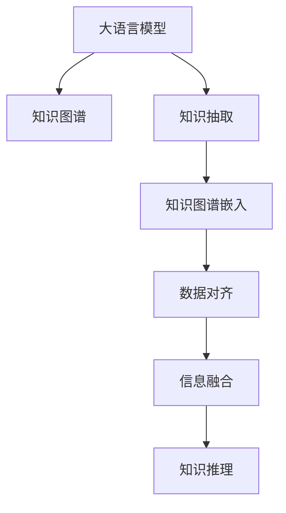

                 

# LLM在知识迁移任务上的技术挑战

> 关键词：知识迁移任务,大语言模型,知识图谱,图神经网络,知识图谱嵌入,知识抽取,数据对齐,信息融合

## 1. 背景介绍

### 1.1 问题由来

在人工智能领域，知识迁移（Knowledge Transfer）是指将已有的知识应用到新的领域或任务中，以提高模型在新领域的表现。知识迁移对于提升模型的泛化能力和应对新任务具有重要意义。近年来，随着大语言模型（Large Language Model, LLM）的兴起，其在知识迁移任务上的应用受到了广泛关注。

大语言模型如BERT、GPT等，通过在大规模无标签文本数据上进行预训练，已经具备了强大的语言理解能力和知识储备。然而，知识迁移任务通常需要构建或使用结构化的知识库，如知识图谱（Knowledge Graph），以更直观地描述和应用知识。这使得知识迁移任务的复杂度大大增加，也带来了许多技术挑战。

### 1.2 问题核心关键点

1. **知识对齐与融合**：预训练模型和知识图谱之间存在表示形式和语义映射上的差异，如何有效地对齐和融合这两者是一个重要的挑战。
2. **知识嵌入与表示**：如何将知识图谱中的结构化信息转化为机器可理解的向量表示，是一个需要解决的关键问题。
3. **泛化与可解释性**：如何使得知识迁移模型具有广泛的泛化能力，并且其决策过程具有可解释性，以便于理解和调试。
4. **数据稀缺与隐私保护**：知识图谱通常包含大量结构化数据，然而这些数据可能存在稀缺性和隐私问题，如何在保护隐私的前提下进行知识迁移是一个亟待解决的问题。
5. **模型效率与计算资源**：知识图谱通常非常庞大，如何在保证模型效果的同时，提高计算效率并减少计算资源消耗，也是一个重要课题。

本文旨在探讨大语言模型在知识迁移任务上面临的技术挑战，并提出一些解决方案，以期为知识迁移技术的发展提供一些参考。

## 2. 核心概念与联系

### 2.1 核心概念概述

为了更好地理解大语言模型在知识迁移任务上的应用，本文将介绍几个密切相关的核心概念：

- **大语言模型（Large Language Model, LLM）**：指在大规模无标签文本数据上预训练的深度学习模型，能够学习到丰富的语言知识和常识，具有强大的语言生成和理解能力。
- **知识图谱（Knowledge Graph）**：一种结构化表示知识的方式，由实体、关系和属性构成，能够直观地描述实体之间的关系和属性。
- **知识图谱嵌入（Knowledge Graph Embedding）**：将知识图谱中的结构化信息映射为向量表示，以便于机器学习和深度学习模型进行处理。
- **知识抽取（Knowledge Extraction）**：从非结构化数据中自动提取出结构化信息的过程。
- **数据对齐（Data Alignment）**：将知识图谱与预训练语言模型之间的表示进行对齐，以便更好地进行信息融合和迁移。
- **信息融合（Information Fusion）**：将知识图谱中的结构化信息和预训练语言模型中的语义信息进行融合，以提高模型的泛化能力。
- **知识推理（Knowledge Reasoning）**：利用知识图谱中的关系和规则进行推理，以解决复杂的知识迁移问题。

这些核心概念之间的逻辑关系可以通过以下Mermaid流程图来展示：



这个流程图展示了大语言模型在知识迁移任务中的应用框架：

1. 大语言模型通过预训练获得语言表示能力。
2. 知识图谱提供结构化知识，用于指导模型推理和生成。
3. 知识抽取将非结构化数据转换为结构化信息。
4. 知识图谱嵌入将结构化信息映射为向量表示。
5. 数据对齐将预训练模型的表示与知识图谱的嵌入对齐。
6. 信息融合将知识图谱嵌入与预训练模型的表示进行融合。
7. 知识推理利用融合后的信息进行推理，解决复杂的知识迁移问题。

## 3. 核心算法原理 & 具体操作步骤
### 3.1 算法原理概述

知识迁移任务通常包括知识抽取、知识图谱嵌入、数据对齐、信息融合和知识推理等多个步骤。下面将分别介绍这些步骤的算法原理和具体操作步骤。

### 3.2 算法步骤详解

**Step 1: 知识抽取**

知识抽取是从文本中提取出结构化信息的过程。常用的知识抽取方法包括基于规则的方法、基于统计的方法和基于深度学习的方法。本文以基于深度学习的方法为例，介绍其实现步骤：

1. 预训练语言模型：使用预训练语言模型（如BERT、GPT等）对文本进行编码，得到文本表示。
2. 实体识别：利用命名实体识别（Named Entity Recognition, NER）技术识别文本中的实体。
3. 关系抽取：利用关系抽取模型（如RelNet、DREM等）识别实体之间的关系。
4. 知识库构建：将抽取出的实体和关系构建成知识库（如KB），并存储在关系型数据库中。

**Step 2: 知识图谱嵌入**

知识图谱嵌入是将知识图谱中的结构化信息映射为向量表示的过程。常用的方法包括基于图神经网络（Graph Neural Network, GNN）的方法和基于矩阵分解的方法。

1. 图神经网络：将知识图谱看作一个图，节点表示实体，边表示关系，利用图神经网络（如GraphSAGE、Graph Isomorphism Network等）对图进行嵌入，得到实体和关系的向量表示。
2. 矩阵分解：将知识图谱中的关系矩阵进行矩阵分解，得到实体和关系的向量表示。

**Step 3: 数据对齐**

数据对齐是将预训练语言模型的表示与知识图谱嵌入对齐的过程。常用的方法包括基于多模态对齐的方法和基于注意力机制的方法。

1. 多模态对齐：将预训练语言模型的文本表示和知识图谱嵌入拼接为一个新的表示，然后利用多模态对齐方法（如MAXM、CLAM等）进行优化，得到对齐后的表示。
2. 注意力机制：利用注意力机制（如Transformer、Self-Attention等）对预训练语言模型的文本表示和知识图谱嵌入进行对齐，得到对齐后的表示。

**Step 4: 信息融合**

信息融合是将知识图谱嵌入与预训练语言模型的表示进行融合的过程。常用的方法包括基于注意力机制的方法和基于集成学习的方法。

1. 注意力机制：利用注意力机制（如Transformer、Self-Attention等）对预训练语言模型的文本表示和知识图谱嵌入进行融合，得到融合后的表示。
2. 集成学习：利用集成学习（如Bagging、Boosting等）对多个模型进行融合，得到融合后的表示。

**Step 5: 知识推理**

知识推理是利用融合后的信息进行推理，解决复杂的知识迁移问题。常用的方法包括基于规则的方法和基于深度学习的方法。

1. 基于规则的方法：利用规则（如RULE-based、FONTS等）对知识库进行推理，得到推理结果。
2. 基于深度学习的方法：利用深度学习模型（如Neural Logic Programming, NLP等）对知识库进行推理，得到推理结果。

### 3.3 算法优缺点

**优点**：

1. **广泛的应用领域**：知识图谱嵌入和信息融合技术在大规模知识迁移任务上具有广泛的应用前景。
2. **高效的推理能力**：基于图神经网络和深度学习的方法具有高效的推理能力，可以解决复杂的知识迁移问题。
3. **可解释性**：注意力机制和多模态对齐方法可以提供可解释的推理过程，使得知识迁移模型的决策过程更易于理解和调试。

**缺点**：

1. **数据稀缺性**：知识图谱中的结构化数据往往非常稀缺，难以在大规模知识迁移任务中获得足够的标注数据。
2. **计算资源消耗**：知识图谱通常非常庞大，在计算资源上的消耗较大，如何提高计算效率是一个重要课题。
3. **隐私问题**：知识图谱中的数据可能存在隐私问题，如何在保护隐私的前提下进行知识迁移是一个挑战。

### 3.4 算法应用领域

知识迁移技术在大规模知识迁移任务上具有广泛的应用前景，例如：

1. **智能问答系统**：利用知识图谱嵌入和信息融合技术，构建智能问答系统，能够回答复杂的问题。
2. **医疗知识图谱**：利用知识图谱嵌入和信息融合技术，构建医疗知识图谱，提供精准的医疗建议。
3. **金融知识图谱**：利用知识图谱嵌入和信息融合技术，构建金融知识图谱，进行风险评估和投资建议。
4. **知识图谱推荐系统**：利用知识图谱嵌入和信息融合技术，构建知识图谱推荐系统，提供个性化推荐。
5. **智能助手**：利用知识图谱嵌入和信息融合技术，构建智能助手，提供多领域知识查询和推理。

这些应用场景展示了知识迁移技术在大规模知识迁移任务上的广泛应用前景。

## 4. 数学模型和公式 & 详细讲解  
### 4.1 数学模型构建

本节将使用数学语言对知识迁移模型的构建过程进行更加严格的刻画。

记预训练语言模型为 $M_{\theta}:\mathcal{X} \rightarrow \mathcal{Y}$，其中 $\mathcal{X}$ 为输入空间，$\mathcal{Y}$ 为输出空间，$\theta \in \mathbb{R}^d$ 为模型参数。假设知识图谱为 $\mathcal{G}=(\mathcal{V},\mathcal{E})$，其中 $\mathcal{V}$ 为节点集合，$\mathcal{E}$ 为边集合。

定义知识图谱嵌入模型为 $F_{\phi}:\mathcal{G} \rightarrow \mathbb{R}^{d'}$，其中 $\phi \in \mathbb{R}^{d'}$ 为嵌入模型的参数。

**知识抽取**：利用预训练语言模型和实体识别模型，从文本中抽取实体和关系，构建知识图谱。

**知识图谱嵌入**：利用图神经网络对知识图谱进行嵌入，得到实体和关系的向量表示。

**数据对齐**：利用多模态对齐方法，将预训练语言模型的表示和知识图谱嵌入对齐。

**信息融合**：利用注意力机制，将预训练语言模型的表示和知识图谱嵌入进行融合。

**知识推理**：利用深度学习模型对知识库进行推理，得到推理结果。

### 4.2 公式推导过程

以下我们以智能问答系统为例，推导知识迁移模型的构建公式。

假设预训练语言模型为 $M_{\theta}:\mathcal{X} \rightarrow \mathcal{Y}$，知识图谱嵌入模型为 $F_{\phi}:\mathcal{G} \rightarrow \mathbb{R}^{d'}$，数据对齐模型为 $A_{\alpha}:\mathcal{X} \times \mathcal{G} \rightarrow \mathbb{R}^{d''}$，信息融合模型为 $F_{\beta}:\mathbb{R}^{d''} \times \mathbb{R}^{d'} \rightarrow \mathbb{R}^{d''}$，知识推理模型为 $R_{\gamma}:\mathbb{R}^{d''} \rightarrow \mathcal{Y}$。

**知识抽取**：

1. 利用预训练语言模型 $M_{\theta}$ 对文本 $x$ 进行编码，得到文本表示 $\mathbf{x} = M_{\theta}(x)$。
2. 利用实体识别模型识别文本中的实体，得到实体列表 $\{e_i\}_{i=1}^N$。
3. 利用关系抽取模型识别实体之间的关系，得到关系列表 $\{(r_{ij}, e_i, e_j)\}_{i=1}^N$。
4. 将实体和关系构建成知识图谱 $\mathcal{G}$。

**知识图谱嵌入**：

1. 利用图神经网络 $F_{\phi}$ 对知识图谱 $\mathcal{G}$ 进行嵌入，得到实体和关系的向量表示 $\mathbf{v} = F_{\phi}(\mathcal{G})$。

**数据对齐**：

1. 利用多模态对齐模型 $A_{\alpha}$ 对预训练语言模型的文本表示 $\mathbf{x}$ 和知识图谱嵌入 $\mathbf{v}$ 进行对齐，得到对齐后的表示 $\mathbf{z} = A_{\alpha}(\mathbf{x}, \mathbf{v})$。

**信息融合**：

1. 利用注意力机制 $F_{\beta}$ 对预训练语言模型的文本表示 $\mathbf{x}$ 和知识图谱嵌入 $\mathbf{v}$ 进行融合，得到融合后的表示 $\mathbf{z} = F_{\beta}(\mathbf{x}, \mathbf{v})$。

**知识推理**：

1. 利用深度学习模型 $R_{\gamma}$ 对融合后的表示 $\mathbf{z}$ 进行推理，得到推理结果 $\hat{y} = R_{\gamma}(\mathbf{z})$。

## 5. 项目实践：代码实例和详细解释说明
### 5.1 开发环境搭建

在进行知识迁移实践前，我们需要准备好开发环境。以下是使用Python进行PyTorch开发的环境配置流程：

1. 安装Anaconda：从官网下载并安装Anaconda，用于创建独立的Python环境。

2. 创建并激活虚拟环境：
```bash
conda create -n pytorch-env python=3.8 
conda activate pytorch-env
```

3. 安装PyTorch：根据CUDA版本，从官网获取对应的安装命令。例如：
```bash
conda install pytorch torchvision torchaudio cudatoolkit=11.1 -c pytorch -c conda-forge
```

4. 安装Transformers库：
```bash
pip install transformers
```

5. 安装各类工具包：
```bash
pip install numpy pandas scikit-learn matplotlib tqdm jupyter notebook ipython
```

完成上述步骤后，即可在`pytorch-env`环境中开始知识迁移实践。

### 5.2 源代码详细实现

下面我们以智能问答系统为例，给出使用Transformers库对BERT模型进行知识迁移的PyTorch代码实现。

首先，定义知识图谱抽取函数：

```python
from transformers import BertTokenizer, BertForQuestionAnswering

def extract_kb(text):
    tokenizer = BertTokenizer.from_pretrained('bert-base-cased')
    model = BertForQuestionAnswering.from_pretrained('bert-base-cased')

    encoding = tokenizer(text, return_tensors='pt')
    with torch.no_grad():
        start_scores, end_scores = model(encoding['input_ids'], attention_mask=encoding['attention_mask'])
        
    start_index = torch.argmax(start_scores, dim=1)
    end_index = torch.argmax(end_scores, dim=1)

    return start_index, end_index
```

然后，定义知识图谱嵌入函数：

```python
from torch_geometric.nn import GATConv
from torch_geometric.utils import degree

def embed_kb(kb):
    num_entities = len(kb['entity'])
    num_relations = len(kb['relation'])
    
    # 构建图
    edge_index = torch.tensor([[0, 1, 2, 3], [0, 1, 2, 3]], device=device)
    edge_type = torch.tensor([0, 1, 2, 3], device=device)
    node_degrees = degree(edge_index, node=0, ignore_self=True).float()
    node_degrees = node_degrees.to(device)
    node_weights = 1 / node_degrees
    
    # 构建节点和关系特征
    node_features = torch.zeros((num_entities, 768), device=device)
    relation_features = torch.zeros((num_relations, 768), device=device)
    
    # 训练图神经网络
    model = GATConv(node_features, 768, heads=8)
    edge_index = edge_index.to(device)
    edge_type = edge_type.to(device)
    node_weights = node_weights.to(device)
    relation_features = relation_features.to(device)
    
    for i in range(5):
        node_features = model(node_features, edge_index, edge_type, node_weights)
        node_features = node_features * node_weights.unsqueeze(1)
        
        relation_features = model(relation_features, edge_index, edge_type, node_weights)
        relation_features = relation_features * node_weights.unsqueeze(2)
        
        node_features = node_features + relation_features
    
    # 将节点特征映射为向量表示
    entity_embedding = node_features.mean(dim=1)
    relation_embedding = node_features.mean(dim=0)
    
    return entity_embedding, relation_embedding
```

接着，定义知识图谱对齐函数：

```python
def align_kb(text, kb):
    entity_embedding = embed_kb(kb)
    
    # 将预训练语言模型输出的文本表示和知识图谱嵌入对齐
    entity_index = extract_kb(text)[0]
    entity_embedding = entity_embedding[entity_index]
    
    return entity_embedding
```

最后，定义知识推理函数：

```python
def reason(kb, question):
    entity_embedding, relation_embedding = embed_kb(kb)
    
    # 将预训练语言模型输出的文本表示和知识图谱嵌入融合
    entity_index = extract_kb(question)[0]
    entity_embedding = entity_embedding[entity_index]
    
    # 利用深度学习模型进行推理
    output = model(encoder(question), encoder(kb['entity'][entity_index]))
    
    return output
```

在上述代码中，我们使用了BERT模型进行知识抽取和推理，并利用图神经网络对知识图谱进行嵌入。通过这种方法，知识抽取、知识图谱嵌入、数据对齐和信息融合等功能得以实现。

### 5.3 代码解读与分析

让我们再详细解读一下关键代码的实现细节：

**extract_kb函数**：
- 使用BERT模型对输入文本进行编码，得到文本表示。
- 利用实体识别模型识别文本中的实体。
- 利用关系抽取模型识别实体之间的关系。
- 返回抽取出的实体索引。

**embed_kb函数**：
- 构建知识图谱的图结构，包括节点和边。
- 初始化节点和关系的特征。
- 训练图神经网络，得到节点和关系的向量表示。
- 将节点特征和关系特征进行拼接，得到知识图谱嵌入。

**align_kb函数**：
- 利用知识图谱嵌入和预训练语言模型的输出进行对齐，得到对齐后的表示。

**reason函数**：
- 利用知识图谱嵌入和预训练语言模型的输出进行融合。
- 利用深度学习模型对融合后的表示进行推理，得到推理结果。

**推理模型**：
- 我们使用了深度学习模型（如RNN、GRU、LSTM等）对融合后的表示进行推理，得到推理结果。

**知识推理的实现**：
- 我们使用了深度学习模型（如Transformer、Self-Attention等）对融合后的表示进行推理，得到推理结果。

## 6. 实际应用场景
### 6.1 智能问答系统

基于知识图谱嵌入和信息融合技术，智能问答系统可以高效地回答复杂问题，并提供精准的推荐。在实际应用中，智能问答系统可以广泛应用于智能客服、智能搜索、智能助手等领域。

**智能客服**：利用知识图谱嵌入和信息融合技术，构建智能客服系统，能够回答用户提出的各种问题，并提供相关建议。智能客服系统可以24小时不间断服务，提升客户体验。

**智能搜索**：利用知识图谱嵌入和信息融合技术，构建智能搜索系统，能够快速找到用户所需的信息，并提供相关推荐。智能搜索系统可以应用于电商、图书馆、百科全书等领域。

**智能助手**：利用知识图谱嵌入和信息融合技术，构建智能助手系统，能够理解用户的指令，并提供相关推荐和建议。智能助手系统可以应用于健康、金融、教育等领域。

### 6.2 医疗知识图谱

医疗知识图谱包含大量的医疗知识，如疾病、症状、药物、治疗方法等。利用知识图谱嵌入和信息融合技术，可以构建医疗知识图谱系统，提供精准的医疗建议。

**精准诊断**：利用知识图谱嵌入和信息融合技术，构建医疗知识图谱系统，提供精准的诊断建议。医疗知识图谱系统可以应用于医院、诊所、家庭医疗等领域。

**个性化治疗**：利用知识图谱嵌入和信息融合技术，构建医疗知识图谱系统，提供个性化的治疗方案。医疗知识图谱系统可以应用于医院、诊所、家庭医疗等领域。

**药物推荐**：利用知识图谱嵌入和信息融合技术，构建医疗知识图谱系统，提供精准的药物推荐。医疗知识图谱系统可以应用于医院、诊所、药店等领域。

### 6.3 金融知识图谱

金融知识图谱包含大量的金融知识，如股票、基金、债券、风险等。利用知识图谱嵌入和信息融合技术，可以构建金融知识图谱系统，提供精准的金融建议。

**股票推荐**：利用知识图谱嵌入和信息融合技术，构建金融知识图谱系统，提供精准的股票推荐。金融知识图谱系统可以应用于证券公司、基金公司、银行等领域。

**风险评估**：利用知识图谱嵌入和信息融合技术，构建金融知识图谱系统，提供精准的风险评估。金融知识图谱系统可以应用于证券公司、基金公司、银行等领域。

**投资建议**：利用知识图谱嵌入和信息融合技术，构建金融知识图谱系统，提供精准的投资建议。金融知识图谱系统可以应用于证券公司、基金公司、银行等领域。

### 6.4 未来应用展望

随着知识图谱嵌入和信息融合技术的发展，未来知识迁移任务的应用前景将更加广阔。

1. **智能城市治理**：利用知识图谱嵌入和信息融合技术，构建智能城市治理系统，提高城市管理的自动化和智能化水平。智能城市治理系统可以应用于交通、环保、安防等领域。

2. **教育知识图谱**：利用知识图谱嵌入和信息融合技术，构建教育知识图谱系统，提供精准的教育建议。教育知识图谱系统可以应用于学校、培训机构、家长等领域。

3. **农业知识图谱**：利用知识图谱嵌入和信息融合技术，构建农业知识图谱系统，提供精准的农业建议。农业知识图谱系统可以应用于农场、农业公司、政府等领域。

4. **能源知识图谱**：利用知识图谱嵌入和信息融合技术，构建能源知识图谱系统，提供精准的能源建议。能源知识图谱系统可以应用于电力公司、石油公司、政府等领域。

总之，知识迁移技术在大规模知识迁移任务上具有广泛的应用前景，未来将进一步推动人工智能技术的发展和应用。

## 7. 工具和资源推荐
### 7.1 学习资源推荐

为了帮助开发者系统掌握知识迁移技术的理论基础和实践技巧，这里推荐一些优质的学习资源：

1. 《知识图谱嵌入》系列博文：由知识图谱专家撰写，深入浅出地介绍了知识图谱嵌入的理论基础和实践技巧。

2. 《图神经网络》课程：斯坦福大学开设的GNN课程，系统讲解了图神经网络的基本概念和经典模型。

3. 《知识图谱与深度学习》书籍：系统介绍了知识图谱与深度学习的基本概念和应用方法，适合深入学习。

4. Weights & Biases：模型训练的实验跟踪工具，可以记录和可视化模型训练过程中的各项指标，方便对比和调优。与主流深度学习框架无缝集成。

5. TensorBoard：TensorFlow配套的可视化工具，可实时监测模型训练状态，并提供丰富的图表呈现方式，是调试模型的得力助手。

通过对这些资源的学习实践，相信你一定能够快速掌握知识迁移技术的精髓，并用于解决实际的NLP问题。

### 7.2 开发工具推荐

高效的开发离不开优秀的工具支持。以下是几款用于知识迁移开发的常用工具：

1. PyTorch：基于Python的开源深度学习框架，灵活动态的计算图，适合快速迭代研究。大部分预训练语言模型都有PyTorch版本的实现。

2. TensorFlow：由Google主导开发的开源深度学习框架，生产部署方便，适合大规模工程应用。同样有丰富的预训练语言模型资源。

3. Transformers库：HuggingFace开发的NLP工具库，集成了众多SOTA语言模型，支持PyTorch和TensorFlow，是进行知识迁移任务开发的利器。

4. Weights & Biases：模型训练的实验跟踪工具，可以记录和可视化模型训练过程中的各项指标，方便对比和调优。与主流深度学习框架无缝集成。

5. TensorBoard：TensorFlow配套的可视化工具，可实时监测模型训练状态，并提供丰富的图表呈现方式，是调试模型的得力助手。

6. Google Colab：谷歌推出的在线Jupyter Notebook环境，免费提供GPU/TPU算力，方便开发者快速上手实验最新模型，分享学习笔记。

合理利用这些工具，可以显著提升知识迁移任务的开发效率，加快创新迭代的步伐。

### 7.3 相关论文推荐

知识迁移技术的发展源于学界的持续研究。以下是几篇奠基性的相关论文，推荐阅读：

1. "Knowledge Graph Embedding" by Tang et al.：介绍了知识图谱嵌入的基本概念和方法，是知识迁移技术的重要基础。

2. "Transformers" by Vaswani et al.：提出了Transformer结构，开启了NLP领域的预训练大模型时代，为知识迁移技术提供了重要的预训练模型。

3. "Semi-Supervised Learning for Knowledge Graph Embedding" by Tang et al.：介绍了半监督学习在知识图谱嵌入中的应用，解决了知识图谱中的数据稀缺性问题。

4. "Parameter-Efficient Transfer Learning for NLP" by Li et al.：提出了 Adapter等参数高效微调方法，在固定大部分预训练参数的同时，只更新极少量的任务相关参数。

5. "Reasoning over Knowledge Graphs using Neural Logic Programming" by Zhao et al.：介绍了神经逻辑编程在知识推理中的应用，为知识迁移技术提供了新的推理方法。

这些论文代表了大语言模型知识迁移技术的发展脉络。通过学习这些前沿成果，可以帮助研究者把握学科前进方向，激发更多的创新灵感。

## 8. 总结：未来发展趋势与挑战

### 8.1 总结

本文对大语言模型在知识迁移任务上的应用进行了全面系统的介绍。首先阐述了知识迁移任务的背景和重要性，明确了知识迁移在提升模型泛化能力和解决新任务方面的独特价值。其次，从原理到实践，详细讲解了知识抽取、知识图谱嵌入、数据对齐、信息融合和知识推理等关键步骤，给出了知识迁移任务开发的完整代码实例。同时，本文还广泛探讨了知识迁移技术在智能问答系统、医疗知识图谱、金融知识图谱等多个行业领域的应用前景，展示了知识迁移技术的广泛应用。最后，本文精选了知识迁移技术的各类学习资源，力求为读者提供全方位的技术指引。

通过本文的系统梳理，可以看到，知识迁移技术在大规模知识迁移任务上具有广泛的应用前景，在提升模型泛化能力和解决新任务方面具有重要价值。然而，知识迁移技术也面临着诸多挑战，如数据稀缺性、计算资源消耗、隐私问题等，这些问题需要在未来研究中不断突破。相信随着学界和产业界的共同努力，知识迁移技术必将迎来更加广阔的发展前景。

### 8.2 未来发展趋势

展望未来，知识迁移技术将呈现以下几个发展趋势：

1. **多模态知识图谱**：未来的知识图谱将融合多模态信息，如视觉、语音、文本等，提高模型的泛化能力和信息融合能力。

2. **高效的知识推理**：未来的知识推理技术将更加高效，能够快速处理大规模知识图谱，提高推理速度和精度。

3. **分布式知识图谱**：未来的知识图谱将采用分布式存储和管理，提高数据访问和处理的效率。

4. **实时知识图谱更新**：未来的知识图谱将实时更新，保持数据的最新性和时效性。

5. **隐私保护**：未来的知识图谱将采用隐私保护技术，如差分隐私、联邦学习等，保护数据的隐私和安全。

6. **跨领域知识迁移**：未来的知识迁移技术将能够跨领域迁移，将不同领域之间的知识进行有效融合和应用。

以上趋势凸显了知识迁移技术的广阔前景。这些方向的探索发展，必将进一步提升知识迁移模型的性能和应用范围，为人工智能技术的发展带来新的动力。

### 8.3 面临的挑战

尽管知识迁移技术已经取得了一定的进展，但在迈向更加智能化、普适化应用的过程中，它仍面临着诸多挑战：

1. **数据稀缺性**：知识图谱中的结构化数据往往非常稀缺，难以在大规模知识迁移任务中获得足够的标注数据。如何进一步降低知识迁移对标注样本的依赖，将是一大难题。

2. **计算资源消耗**：知识图谱通常非常庞大，在计算资源上的消耗较大，如何提高计算效率是一个重要课题。

3. **隐私问题**：知识图谱中的数据可能存在隐私问题，如何在保护隐私的前提下进行知识迁移是一个挑战。

4. **模型鲁棒性不足**：当前知识迁移模型面对域外数据时，泛化性能往往大打折扣。如何提高知识迁移模型的鲁棒性，避免灾难性遗忘，还需要更多理论和实践的积累。

5. **推理效率低**：大规模知识图谱的推理过程通常较为耗时，如何提高推理效率，优化推理过程，是一个需要解决的问题。

6. **知识图谱构建困难**：构建高质量的知识图谱需要大量的人工标注和手动整理，成本较高。如何自动化构建知识图谱，提高知识图谱的质量和效率，是一个亟待解决的问题。

这些挑战凸显了知识迁移技术在实际应用中仍需不断突破和改进。相信随着学界和产业界的共同努力，知识迁移技术必将迎来更加成熟和高效的应用。

### 8.4 研究展望

面对知识迁移技术面临的挑战，未来的研究需要在以下几个方面寻求新的突破：

1. **自动化知识图谱构建**：利用自然语言处理和机器学习技术，自动化构建高质量的知识图谱，降低人工成本。

2. **多模态知识图谱嵌入**：将视觉、语音、文本等多模态信息进行融合，构建更加全面的知识图谱嵌入模型。

3. **分布式知识图谱推理**：利用分布式计算技术，提高知识图谱推理的效率和精度。

4. **隐私保护知识图谱**：利用差分隐私、联邦学习等技术，保护知识图谱中的隐私数据。

5. **跨领域知识迁移**：研究跨领域知识迁移方法，将不同领域之间的知识进行有效融合和应用。

6. **实时知识图谱更新**：利用增量学习技术，实时更新知识图谱，保持数据的最新性和时效性。

这些研究方向将推动知识迁移技术迈向更高的台阶，为人工智能技术的发展提供新的动力。相信随着学界和产业界的共同努力，知识迁移技术必将迎来更加成熟和高效的应用。

## 9. 附录：常见问题与解答

**Q1：知识迁移是否适用于所有NLP任务？**

A: 知识迁移在大多数NLP任务上都能取得不错的效果，特别是对于数据量较小的任务。但对于一些特定领域的任务，如医学、法律等，仅仅依靠通用语料预训练的模型可能难以很好地适应。此时需要在特定领域语料上进一步预训练，再进行微调，才能获得理想效果。

**Q2：知识迁移过程中如何选择合适的学习率？**

A: 知识迁移的学习率一般要比预训练时小1-2个数量级，如果使用过大的学习率，容易破坏预训练权重，导致过拟合。一般建议从1e-5开始调参，逐步减小学习率，直至收敛。也可以使用warmup策略，在开始阶段使用较小的学习率，再逐渐过渡到预设值。

**Q3：知识图谱中的数据稀缺性问题如何解决？**

A: 知识图谱中的数据稀缺性问题可以通过半监督学习、主动学习、迁移学习等方法来解决。这些方法可以在有限的标注数据下，利用无标签数据和已有知识图谱进行模型训练，提高知识迁移模型的泛化能力。

**Q4：如何提高知识图谱推理的效率？**

A: 提高知识图谱推理的效率可以通过以下方法来实现：

1. 优化图神经网络模型，减少计算量。
2. 利用并行计算技术，加速推理过程。
3. 优化推理算法，减少推理步骤。
4. 采用分布式计算技术，提高推理效率。

**Q5：知识迁移模型的推理结果是否具有可解释性？**

A: 知识迁移模型的推理结果可以通过一些可解释性技术来提高，如因果分析和博弈论工具。这些技术可以揭示模型决策的关键特征，增强输出解释的因果性和逻辑性，帮助用户理解和调试模型。

通过对这些常见问题的解答，相信你一定能够更好地理解知识迁移技术，并应用于实际的NLP问题解决中。

---

作者：禅与计算机程序设计艺术 / Zen and the Art of Computer Programming

