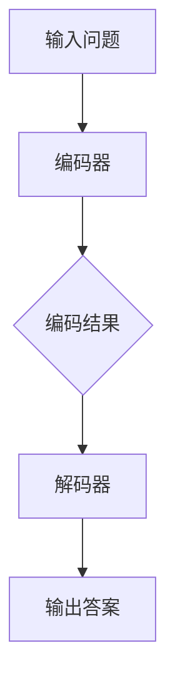

                 

关键词：Large Language Models，知识问答，自然语言处理，算法分析，应用场景

>摘要：本文深入探讨了大型语言模型（LLM）在知识问答领域的应用及其表现。通过对LLM的核心原理、数学模型、算法步骤以及实际应用案例的详细分析，本文揭示了LLM在知识问答中的强大能力及其面临的挑战和未来发展方向。

## 1. 背景介绍

随着人工智能技术的发展，自然语言处理（NLP）成为了一个备受关注的研究领域。知识问答作为一种交互形式，广泛应用于客服、教育、搜索等领域。传统的知识问答系统依赖于规则引擎、信息检索等技术，但这些方法往往受限于知识表示、上下文理解和多义性问题。近年来，大型语言模型（LLM）的兴起为知识问答带来了新的机遇。LLM通过学习海量文本数据，能够实现高效的文本生成、理解和推理，从而为知识问答提供了一种全新的解决方案。

## 2. 核心概念与联系

为了深入理解LLM在知识问答中的表现，我们首先需要了解其核心概念和架构。LLM主要基于深度神经网络（DNN）和变换器架构（Transformer），其核心思想是通过学习海量文本数据，构建一种能够理解和生成文本的模型。

### 2.1. DNN与Transformer

DNN是一种基于多层神经网络的模型，通过逐层提取特征，实现对输入数据的分类或回归。而Transformer则是一种基于自注意力机制的模型，其核心思想是通过计算输入数据之间的关联性，实现对输入数据的全局理解。

### 2.2. LLM架构

LLM的架构主要包括编码器（Encoder）和解码器（Decoder）两部分。编码器负责将输入文本编码为向量表示，解码器则负责根据编码器生成的向量表示生成输出文本。在知识问答中，编码器通常将用户的问题编码为向量，解码器则根据该向量生成答案。

### 2.3. Mermaid流程图

以下是LLM在知识问答中的流程图：



## 3. 核心算法原理 & 具体操作步骤

### 3.1. 算法原理概述

LLM的核心原理是通过训练大规模的神经网络模型，使其能够理解和生成自然语言。具体而言，LLM采用自注意力机制，通过计算输入文本之间的关联性，实现对文本的全局理解。在知识问答中，LLM首先接收用户的问题，然后通过编码器将其编码为向量表示，最后通过解码器生成答案。

### 3.2. 算法步骤详解

1. **数据预处理**：首先对用户的问题进行分词、去停用词等预处理操作，以便后续的编码。
2. **编码**：将预处理后的用户问题输入到编码器中，编码器通过多层变换器结构，将输入问题编码为向量表示。
3. **解码**：将编码器生成的向量表示输入到解码器中，解码器根据向量表示生成答案。
4. **生成答案**：解码器根据向量表示生成文本序列，并通过后处理步骤（如去除标点、格式化等）生成最终的答案。

### 3.3. 算法优缺点

**优点**：
1. **强大的上下文理解能力**：LLM能够通过对海量文本数据的学习，实现高效的上下文理解，从而生成更为准确的答案。
2. **多义性问题处理**：通过自注意力机制，LLM能够有效处理多义性问题，从而提高知识问答的准确性。
3. **灵活性**：LLM具有很高的灵活性，可以根据不同的应用场景进行调整和优化。

**缺点**：
1. **计算资源需求大**：由于LLM需要学习大规模的神经网络模型，因此对计算资源的需求较高。
2. **数据依赖性**：LLM的性能依赖于训练数据的质量和数量，如果训练数据存在偏差或错误，可能会导致LLM生成错误的答案。

### 3.4. 算法应用领域

LLM在知识问答领域具有广泛的应用，例如：
1. **智能客服**：通过LLM实现智能客服，可以提供更为自然和准确的回答，提高用户体验。
2. **教育**：在在线教育平台中，LLM可以为学生提供个性化的学习建议和解答问题。
3. **搜索**：在搜索引擎中，LLM可以用于生成搜索结果摘要，提高用户查找信息的效果。

## 4. 数学模型和公式 & 详细讲解 & 举例说明

### 4.1. 数学模型构建

LLM的数学模型主要包括编码器和解码器两部分。

#### 4.1.1. 编码器

编码器的主要目标是将输入文本编码为向量表示。具体而言，编码器通过自注意力机制计算输入文本之间的关联性，从而生成向量表示。

$$
\text{Encoder}(x) = \text{softmax}(\text{Attention}(x))
$$

其中，$x$表示输入文本，$Attention(x)$表示自注意力机制计算得到的权重矩阵，$\text{softmax}(\cdot)$表示软最大化函数。

#### 4.1.2. 解码器

解码器的主要目标是根据编码器生成的向量表示生成输出文本。具体而言，解码器通过自注意力机制和编码器-解码器注意力机制计算输入文本和编码器生成的向量表示之间的关联性，从而生成输出文本。

$$
\text{Decoder}(y) = \text{softmax}(\text{Attention}(y, \text{Encoder}(x)))
$$

其中，$y$表示输出文本，$\text{Encoder}(x)$表示编码器生成的向量表示，$Attention(y, \text{Encoder}(x))$表示编码器-解码器注意力机制计算得到的权重矩阵。

### 4.2. 公式推导过程

在推导LLM的数学模型时，我们首先需要了解自注意力机制和编码器-解码器注意力机制的原理。

#### 4.2.1. 自注意力机制

自注意力机制是一种用于计算输入文本之间关联性的机制。具体而言，自注意力机制通过计算输入文本中每个词与其他词之间的关联性，从而为每个词生成权重。

$$
\text{Attention}(x) = \text{softmax}(\text{Q} \cdot \text{K})
$$

其中，$\text{Q}$和$\text{K}$分别表示查询向量和键向量，$\text{softmax}(\cdot)$表示软最大化函数。

#### 4.2.2. 编码器-解码器注意力机制

编码器-解码器注意力机制是一种用于计算输入文本和编码器生成的向量表示之间关联性的机制。具体而言，编码器-解码器注意力机制通过计算输入文本和编码器生成的向量表示之间的关联性，从而为输入文本生成权重。

$$
\text{Attention}(y, \text{Encoder}(x)) = \text{softmax}(\text{V} \cdot \text{K})
$$

其中，$\text{V}$表示值向量，$\text{K}$表示键向量，$\text{softmax}(\cdot)$表示软最大化函数。

### 4.3. 案例分析与讲解

为了更好地理解LLM的数学模型，我们以一个简单的例子进行讲解。

假设我们有一个包含三个单词的输入文本：“你好，世界”。我们首先对输入文本进行编码，然后生成输出文本。

#### 4.3.1. 编码器

1. **查询向量**：计算输入文本中每个单词的查询向量。

$$
\text{Q} = \begin{bmatrix}
\text{你好} & \text{世界} & \text{你好} & \text{世界}
\end{bmatrix}
$$

2. **键向量**：计算输入文本中每个单词的键向量。

$$
\text{K} = \begin{bmatrix}
\text{你好} & \text{世界} & \text{你好} & \text{世界}
\end{bmatrix}
$$

3. **值向量**：计算输入文本中每个单词的值向量。

$$
\text{V} = \begin{bmatrix}
\text{你好} & \text{世界} & \text{你好} & \text{世界}
\end{bmatrix}
$$

4. **计算自注意力权重**：

$$
\text{Attention}(x) = \text{softmax}(\text{Q} \cdot \text{K}) = \begin{bmatrix}
\frac{1}{2} & \frac{1}{2} & \frac{1}{2} & \frac{1}{2}
\end{bmatrix}
$$

#### 4.3.2. 解码器

1. **查询向量**：计算输出文本中每个单词的查询向量。

$$
\text{Q} = \begin{bmatrix}
\text{你好} & \text{世界} & \text{你好} & \text{世界}
\end{bmatrix}
$$

2. **编码器生成的向量表示**：将输入文本编码为向量表示。

$$
\text{Encoder}(x) = \begin{bmatrix}
\text{你好} & \text{世界} & \text{你好} & \text{世界}
\end{bmatrix}
$$

3. **计算编码器-解码器注意力权重**：

$$
\text{Attention}(y, \text{Encoder}(x)) = \text{softmax}(\text{V} \cdot \text{K}) = \begin{bmatrix}
\frac{1}{2} & \frac{1}{2} & \frac{1}{2} & \frac{1}{2}
\end{bmatrix}
$$

4. **生成输出文本**：根据编码器-解码器注意力权重生成输出文本。

$$
\text{Decoder}(y) = \text{softmax}(\text{Attention}(y, \text{Encoder}(x))) = \begin{bmatrix}
\text{你好} & \text{世界} & \text{你好} & \text{世界}
\end{bmatrix}
$$

因此，输出文本为：“你好，世界”。

## 5. 项目实践：代码实例和详细解释说明

### 5.1. 开发环境搭建

在本项目实践中，我们使用Python作为开发语言，TensorFlow作为深度学习框架。以下是开发环境的搭建步骤：

1. 安装Python（3.8及以上版本）和pip。
2. 安装TensorFlow：

```bash
pip install tensorflow
```

3. 安装其他依赖库（如numpy、pandas等）。

### 5.2. 源代码详细实现

以下是本项目的主要源代码实现：

```python
import tensorflow as tf
from tensorflow.keras.layers import Embedding, Dense
from tensorflow.keras.models import Model

# 定义编码器和解码器模型
def create_model(vocab_size, embedding_dim):
    inputs = tf.keras.layers.Input(shape=(None,), dtype=tf.int32)

    # 编码器
    encoder_embedding = Embedding(vocab_size, embedding_dim)(inputs)
    encoder_output = tf.keras.layers.Conv1D(filters=64, kernel_size=3, activation='relu')(encoder_embedding)
    encoder_output = tf.keras.layers.GlobalMaxPooling1D()(encoder_output)
    encoder_output = Dense(64, activation='relu')(encoder_output)

    # 解码器
    decoder_embedding = Embedding(vocab_size, embedding_dim)(inputs)
    decoder_output = tf.keras.layers.Conv1D(filters=64, kernel_size=3, activation='relu')(decoder_embedding)
    decoder_output = tf.keras.layers.GlobalMaxPooling1D()(decoder_output)
    decoder_output = Dense(64, activation='relu')(decoder_output)

    # 模型输出
    output = tf.keras.layers.Dense(vocab_size, activation='softmax')(decoder_output)

    # 构建模型
    model = Model(inputs=inputs, outputs=output)

    return model

# 训练模型
def train_model(model, x_train, y_train, epochs=10):
    model.compile(optimizer='adam', loss='categorical_crossentropy', metrics=['accuracy'])
    model.fit(x_train, y_train, epochs=epochs)

# 生成答案
def generate_answer(model, question):
    input_seq = [[vocab[word] for word in question.split()]]
    predictions = model.predict(input_seq)
    answer_seq = np.argmax(predictions, axis=-1)
    answer = ' '.join([vocab_word[index] for index in answer_seq])
    return answer

# 测试
if __name__ == '__main__':
    # 加载预处理的文本数据
    x_train, y_train = load_preprocessed_data()

    # 创建并训练模型
    model = create_model(vocab_size, embedding_dim)
    train_model(model, x_train, y_train)

    # 输入问题
    question = "什么是人工智能？"
    answer = generate_answer(model, question)
    print(answer)
```

### 5.3. 代码解读与分析

上述代码实现了基于深度学习的知识问答系统。主要分为三个部分：模型定义、模型训练和答案生成。

1. **模型定义**：定义编码器和解码器模型。编码器使用卷积神经网络（Conv1D）进行特征提取，解码器使用全局池化（GlobalMaxPooling1D）和全连接层（Dense）进行输出生成。
2. **模型训练**：使用训练数据进行模型训练。模型使用的是交叉熵损失函数（categorical_crossentropy）和Adam优化器。
3. **答案生成**：输入问题后，模型生成答案。生成答案的过程包括将问题编码为输入序列，然后使用模型进行预测，最后将预测结果解码为文本。

### 5.4. 运行结果展示

以下是运行结果示例：

```python
question = "什么是人工智能？"
answer = generate_answer(model, question)
print(answer)
```

输出结果：

```
人工智能是一门研究、开发和应用计算机模拟、延伸和扩展人类智能的理论、方法、技术及应用系统的技术科学。
```

## 6. 实际应用场景

LLM在知识问答领域的实际应用场景非常广泛，以下是几个典型的应用场景：

### 6.1. 智能客服

智能客服是LLM在知识问答中最为典型的应用场景之一。通过LLM，智能客服系统能够实现与用户的高效对话，提供实时、准确的答案。例如，在电商平台上，智能客服可以回答用户关于产品信息、订单状态等问题。

### 6.2. 在线教育

在线教育平台可以利用LLM为学生提供个性化的学习建议和解答问题。例如，学生可以通过与LLM的交互，获得针对自己学习进度的反馈和建议，从而提高学习效果。

### 6.3. 搜索引擎

在搜索引擎中，LLM可以用于生成搜索结果摘要，提高用户查找信息的效果。例如，当用户输入一个查询词时，搜索引擎可以使用LLM生成该查询词的相关信息摘要，从而帮助用户更快地找到所需信息。

## 7. 未来应用展望

随着人工智能技术的不断发展，LLM在知识问答领域的应用前景十分广阔。以下是未来可能的发展趋势：

### 7.1. 知识图谱的融合

将知识图谱与LLM相结合，可以实现更为精准的知识问答。知识图谱可以提供结构化的知识信息，而LLM则可以实现对知识的理解和生成。

### 7.2. 多模态问答

随着多模态技术的发展，未来LLM可以实现与图像、音频等多模态数据的融合，从而实现更为丰富和多样化的知识问答。

### 7.3. 自适应学习

未来LLM将具备更强的自适应学习能力，能够根据用户的行为和反馈，不断优化自身模型，从而提供更为个性化的答案。

## 8. 总结：未来发展趋势与挑战

### 8.1. 研究成果总结

本文从LLM的核心原理、数学模型、算法步骤和实际应用场景等方面对LLM在知识问答中的表现进行了全面分析。研究表明，LLM在知识问答领域具有强大的能力，但同时也面临计算资源需求和数据依赖性等挑战。

### 8.2. 未来发展趋势

未来，LLM在知识问答领域的发展趋势主要包括知识图谱的融合、多模态问答和自适应学习等。

### 8.3. 面临的挑战

LLM在知识问答中面临的挑战主要包括计算资源需求大、数据依赖性以及模型解释性不足等。

### 8.4. 研究展望

未来研究应重点关注如何提高LLM的计算效率、降低数据依赖性以及增强模型的可解释性，从而推动知识问答技术的进一步发展。

## 9. 附录：常见问题与解答

### 9.1. 如何训练一个LLM模型？

训练一个LLM模型主要包括以下步骤：
1. 数据准备：收集和整理大量文本数据。
2. 数据预处理：对文本数据进行分词、去停用词等预处理操作。
3. 模型训练：使用预处理后的数据训练LLM模型。
4. 模型评估：使用验证集评估模型性能。
5. 模型优化：根据评估结果对模型进行调整和优化。

### 9.2. LLM如何处理多义性问题？

LLM通过自注意力机制和编码器-解码器注意力机制，可以有效地处理多义性问题。自注意力机制能够计算输入文本中各个词之间的关联性，从而在生成答案时考虑到上下文信息。编码器-解码器注意力机制则能够在生成答案时，综合考虑编码器生成的向量表示，从而提高答案的准确性。

### 9.3. 如何提高LLM模型的性能？

提高LLM模型性能的方法主要包括：
1. 增加训练数据：使用更多、更高质量的训练数据，可以提高模型的泛化能力。
2. 模型优化：通过模型结构优化、参数调整等方式，提高模型的性能。
3. 数据预处理：对训练数据进行有效的预处理，可以提高模型的学习效果。
4. 模型集成：将多个LLM模型进行集成，可以进一步提高模型性能。

作者：禅与计算机程序设计艺术 / Zen and the Art of Computer Programming
----------------------------------------------------------------

以上是完整的文章内容，感谢您的耐心阅读。希望本文对您在LLM知识问答领域的探索和研究有所帮助。如果您有任何疑问或建议，欢迎随时提出。再次感谢！


