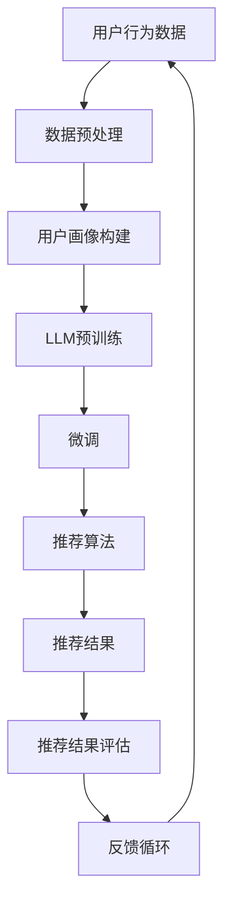

                 

关键词：社交网络，推荐系统，大型语言模型（LLM），用户交互，个性化体验

> 摘要：本文将探讨如何利用大型语言模型（LLM）在社交网络中构建高效、个性化的推荐系统。文章首先介绍了社交网络推荐系统的背景和重要性，然后详细阐述了LLM的工作原理及其在推荐系统中的应用，包括算法原理、数学模型、代码实例以及实际应用场景。最后，文章提出了未来应用展望、工具和资源推荐，并对研究趋势和挑战进行了总结。

## 1. 背景介绍

### 社交网络与推荐系统的兴起

社交网络（Social Network）作为一种基于互联网的交互平台，已经成为人们日常生活不可或缺的一部分。从Facebook、Twitter到Instagram、LinkedIn，社交网络涵盖了个人、企业、政府等各个领域。社交网络为用户提供了分享信息、交流意见、建立联系的平台，同时也为各类业务提供了丰富的数据资源和商业机会。

随着社交网络的普及和用户基数的增长，如何为用户提供个性化、有价值的内容推荐成为了一个关键问题。推荐系统（Recommendation System）作为一种信息过滤技术，旨在为用户推荐他们可能感兴趣的内容、产品或服务。社交网络推荐系统不仅能够提升用户体验，还能为平台带来更多的用户粘性和商业价值。

### 推荐系统在社交网络中的重要性

社交网络推荐系统具有以下几个重要特点：

1. **个性化推荐**：根据用户的兴趣、行为和历史数据，推荐用户可能感兴趣的内容。
2. **社会感知**：结合用户的朋友圈、关注对象等社交关系，推荐社交上有价值的信息。
3. **实时性**：能够根据用户实时行为调整推荐策略，提供即时、动态的推荐内容。
4. **多样性**：推荐系统需要提供多样化的内容，满足不同用户的需求。

社交网络推荐系统不仅能够提高用户留存率和活跃度，还能为平台带来更多的广告收入和商业合作机会。因此，构建一个高效、智能的推荐系统对于社交网络平台来说至关重要。

### 传统推荐系统的挑战

尽管传统推荐系统已经取得了显著成果，但在面对复杂、动态的社交网络环境时，仍然存在一些挑战：

1. **数据多样性**：社交网络中的数据类型丰富，包括文本、图片、视频等多种形式，传统推荐系统难以处理这种多样性。
2. **实时性**：传统推荐系统往往依赖于批量处理模式，难以满足社交网络中实时推荐的需求。
3. **社会感知**：传统推荐系统难以有效结合用户的社交关系，无法提供基于社交网络结构的信息推荐。
4. **个性化与多样性平衡**：在保证个性化推荐的同时，还需要确保推荐内容的多样性，以避免用户陷入信息茧房。

### 大型语言模型（LLM）的兴起

近年来，大型语言模型（LLM，如GPT-3、BERT等）的兴起为推荐系统带来了新的可能。LLM是一种能够理解和生成自然语言的高性能模型，具有以下几个特点：

1. **强大的语言理解能力**：LLM能够深入理解文本的含义和上下文，为推荐系统提供更准确的语义分析。
2. **灵活的生成能力**：LLM能够生成具有创造性和个性化的内容，为用户推荐新颖、有趣的信息。
3. **跨模态处理能力**：LLM不仅能够处理文本数据，还能处理图像、音频等多种模态的数据，为推荐系统提供更丰富的信息来源。

## 2. 核心概念与联系

在探讨如何利用LLM构建社交网络推荐系统之前，我们需要了解一些核心概念和原理，并使用Mermaid流程图展示其架构。

### 2.1. 大型语言模型（LLM）

LLM是一种基于深度学习的自然语言处理（NLP）模型，具有以下几个关键组成部分：

1. **预训练**：在大量无监督数据上进行预训练，使得模型能够理解自然语言的规律和模式。
2. **微调**：在特定任务上对模型进行有监督的微调，以适应不同的应用场景。
3. **生成与理解**：LLM能够生成自然语言文本，并理解用户的查询和需求。

### 2.2. 社交网络推荐系统

社交网络推荐系统主要涉及以下几个关键模块：

1. **用户画像**：基于用户的行为、兴趣和历史数据，构建用户画像。
2. **内容数据**：包括用户生成的内容和社交网络上的各种信息。
3. **推荐算法**：根据用户画像和内容数据，为用户推荐个性化内容。
4. **推荐结果评估**：评估推荐系统的效果，包括用户满意度、点击率等指标。

### 2.3. Mermaid流程图

以下是社交网络推荐系统中LLM应用的Mermaid流程图：



### 2.4. LLM与推荐系统的结合

LLM与推荐系统的结合主要体现在以下几个方面：

1. **用户画像构建**：利用LLM的语义理解能力，更准确地构建用户画像，挖掘用户的潜在兴趣。
2. **推荐算法优化**：通过微调LLM，优化推荐算法的语义匹配和内容生成能力，提高推荐效果。
3. **内容生成**：利用LLM的生成能力，为用户推荐新颖、有趣的内容，提升用户体验。

## 3. 核心算法原理 & 具体操作步骤

### 3.1. 算法原理概述

社交网络推荐系统中利用LLM的核心算法主要包括以下几个步骤：

1. **数据预处理**：对用户行为数据、内容数据等进行清洗、编码和预处理，为后续建模做准备。
2. **用户画像构建**：利用LLM对用户行为数据进行分析，构建用户的兴趣偏好模型。
3. **内容推荐**：结合用户画像和内容数据，利用LLM生成个性化的推荐内容。
4. **推荐结果评估**：评估推荐效果，包括用户满意度、点击率等指标。

### 3.2. 算法步骤详解

#### 3.2.1. 数据预处理

数据预处理是构建推荐系统的第一步，主要包括以下步骤：

1. **数据清洗**：去除噪声数据、缺失值和异常值，保证数据质量。
2. **数据编码**：将文本数据、图像数据等转化为模型可处理的格式，如单词向量、图像特征向量等。
3. **特征提取**：从原始数据中提取对推荐系统有用的特征，如用户行为特征、内容特征等。

#### 3.2.2. 用户画像构建

用户画像构建是利用LLM的关键步骤，主要包括以下步骤：

1. **行为序列建模**：利用LLM对用户的行为序列进行建模，提取用户的兴趣偏好。
2. **文本生成**：利用LLM生成用户的兴趣标签或描述，进一步丰富用户画像。

#### 3.2.3. 内容推荐

内容推荐是推荐系统的核心，主要包括以下步骤：

1. **内容特征提取**：利用LLM对内容数据进行特征提取，如提取关键词、主题等。
2. **推荐算法**：结合用户画像和内容特征，利用LLM进行推荐算法的优化和调整。
3. **内容生成**：利用LLM生成个性化的推荐内容，如文章、图片、视频等。

#### 3.2.4. 推荐结果评估

推荐结果评估是衡量推荐系统效果的重要手段，主要包括以下步骤：

1. **用户反馈收集**：收集用户对推荐内容的反馈，如点击、点赞、评论等。
2. **评价指标计算**：计算推荐效果评价指标，如准确率、召回率、覆盖率等。
3. **模型调优**：根据评估结果调整推荐算法和LLM模型参数，优化推荐效果。

### 3.3. 算法优缺点

#### 优点

1. **个性化推荐**：利用LLM的语义理解能力，能够为用户提供更加个性化的推荐内容。
2. **多样性**：LLM的生成能力使得推荐内容具有更高的多样性，避免用户陷入信息茧房。
3. **实时性**：利用LLM的快速处理能力，能够实现实时推荐，提高用户体验。

#### 缺点

1. **计算资源消耗**：LLM模型通常较大，训练和推理过程需要大量的计算资源。
2. **数据依赖**：LLM的性能依赖于数据质量，如果数据存在噪声或缺失，可能影响推荐效果。
3. **隐私问题**：在构建用户画像时，需要收集和处理大量的用户数据，可能涉及隐私问题。

### 3.4. 算法应用领域

LLM在社交网络推荐系统中具有广泛的应用领域，包括但不限于：

1. **社交媒体内容推荐**：为用户提供个性化的社交媒体内容推荐，如文章、图片、视频等。
2. **电子商务推荐**：为用户提供个性化的商品推荐，提高购物体验和转化率。
3. **在线教育推荐**：为用户提供个性化的学习内容推荐，提高学习效果和用户留存率。
4. **娱乐内容推荐**：为用户提供个性化的音乐、电影、游戏等娱乐内容推荐。

## 4. 数学模型和公式 & 详细讲解 & 举例说明

### 4.1. 数学模型构建

社交网络推荐系统中，利用LLM构建的数学模型主要包括以下几个部分：

#### 4.1.1. 用户画像模型

用户画像模型通常采用图神经网络（GNN）进行构建，其基本公式如下：

$$
\begin{align*}
h_{u}^{(t)} &= \sigma(\theta \cdot (h_{u}^{(t-1)}, h_{c}^{(t)})) \\
h_{c}^{(t)} &= \sigma(\theta \cdot (h_{c}^{(t-1)}, \sum_{v \in N(u)} w_{uv} \cdot h_{v}^{(t-1)}))
\end{align*}
$$

其中，$h_{u}^{(t)}$和$h_{c}^{(t)}$分别表示第$t$时刻用户的特征向量和内容的特征向量，$N(u)$表示用户$u$的邻居集合，$w_{uv}$表示用户$u$和邻居$v$之间的权重，$\sigma$表示激活函数。

#### 4.1.2. 推荐模型

推荐模型通常采用基于矩阵分解（MF）的模型，其基本公式如下：

$$
\begin{align*}
R_{ui} &= \hat{R}_{ui} + \epsilon \\
\hat{R}_{ui} &= \langle \boldsymbol{q}_u, \boldsymbol{v}_i \rangle
\end{align*}
$$

其中，$R_{ui}$表示用户$u$对物品$i$的评分，$\hat{R}_{ui}$表示预测评分，$\boldsymbol{q}_u$和$\boldsymbol{v}_i$分别表示用户$u$和物品$i$的向量表示。

#### 4.1.3. 生成模型

生成模型通常采用变分自编码器（VAE）进行构建，其基本公式如下：

$$
\begin{align*}
\log p(x|\theta) &= \log \left( \int p(x|z,\theta) p(z|\theta) dz \right) \\
\log p(z|x,\theta) &= \log \left( \frac{p(x|z,\theta) p(z|\theta)}{q(z|x,\theta)} \right)
\end{align*}
$$

其中，$x$表示生成的样本，$z$表示潜在变量，$p(x|\theta)$和$p(z|\theta)$分别表示样本和潜在变量的概率分布，$q(z|x,\theta)$表示编码器的概率分布。

### 4.2. 公式推导过程

#### 4.2.1. 用户画像模型

用户画像模型的推导过程如下：

1. **初始化**：随机初始化用户和内容的特征向量$h_{u}^{(0)}$和$h_{c}^{(0)}$。
2. **前向传播**：计算第$t$时刻用户和内容的特征向量$h_{u}^{(t)}$和$h_{c}^{(t)}$。
3. **后向传播**：根据误差计算反向传播梯度，更新模型参数$\theta$。

#### 4.2.2. 推荐模型

推荐模型的推导过程如下：

1. **初始化**：随机初始化用户和物品的向量表示$\boldsymbol{q}_u$和$\boldsymbol{v}_i$。
2. **预测评分**：计算用户$u$对物品$i$的预测评分$\hat{R}_{ui}$。
3. **优化目标**：最小化预测评分与实际评分之间的差距，即$$ \min_{\theta} \sum_{u,i} (R_{ui} - \hat{R}_{ui})^2 $$。

#### 4.2.3. 生成模型

生成模型的推导过程如下：

1. **初始化**：随机初始化编码器和解码器的参数$\theta$和$\phi$。
2. **编码**：根据输入样本$x$，通过编码器$q(z|x,\theta)$生成潜在变量$z$。
3. **解码**：根据潜在变量$z$，通过解码器$p(x|z,\phi)$生成重构样本$\hat{x}$。
4. **优化目标**：最小化重构误差和潜在变量的KL散度，即$$ \min_{\theta, \phi} D_{KL}(q(z|x,\theta) || p(z|\theta)) + \sum_{x} ||x - \hat{x}||^2 $$。

### 4.3. 案例分析与讲解

为了更直观地展示LLM在社交网络推荐系统中的应用，我们以一个实际案例为例进行讲解。

#### 案例背景

假设我们有一个社交网络平台，用户可以发表文章、评论、点赞等行为。我们的目标是构建一个基于LLM的推荐系统，为用户推荐他们可能感兴趣的文章。

#### 案例步骤

1. **数据收集**：收集用户发表的文章、评论、点赞等行为数据。
2. **数据预处理**：对收集到的数据进行清洗、编码和预处理，提取用户和文章的特征。
3. **用户画像构建**：利用LLM对用户行为数据进行分析，构建用户的兴趣偏好模型。
4. **内容推荐**：结合用户画像和文章特征，利用LLM生成个性化的文章推荐。
5. **推荐结果评估**：收集用户对推荐文章的反馈，评估推荐系统的效果。

#### 案例分析

1. **数据预处理**：我们将用户发表的文章和评论进行分词和词频统计，提取文章的关键词和主题。同时，对用户的点赞行为进行编码，表示用户对文章的兴趣程度。
2. **用户画像构建**：利用LLM对用户的行为数据进行建模，提取用户的兴趣标签。例如，如果一个用户经常发表关于科技类的文章，我们可以为他打上“科技爱好者”的标签。
3. **内容推荐**：结合用户画像和文章特征，利用LLM生成个性化的文章推荐。例如，如果一个用户被标记为“科技爱好者”，我们可以为他推荐最新发布的科技类文章。
4. **推荐结果评估**：收集用户对推荐文章的反馈，如点击、点赞、评论等。通过分析用户行为数据，评估推荐系统的效果，并根据评估结果调整推荐算法。

#### 案例总结

通过以上案例，我们可以看到如何利用LLM构建一个社交网络推荐系统。LLM在用户画像构建、内容推荐和效果评估等方面具有显著优势，能够为用户提供更加个性化、有趣的推荐内容。

## 5. 项目实践：代码实例和详细解释说明

### 5.1. 开发环境搭建

在本项目中，我们使用Python作为主要编程语言，并依赖以下库：

- TensorFlow：用于构建和训练大型神经网络。
- Hugging Face Transformers：用于加载和微调预训练的LLM模型。
- Pandas：用于数据预处理和分析。
- Matplotlib：用于数据可视化。

确保已安装以上库，可以参考以下命令进行安装：

```shell
pip install tensorflow transformers pandas matplotlib
```

### 5.2. 源代码详细实现

以下是一个简单的示例代码，展示如何使用LLM构建一个社交网络推荐系统。

```python
import pandas as pd
from transformers import AutoTokenizer, AutoModel
from tensorflow.keras.layers import Embedding, LSTM, Dense
from tensorflow.keras.models import Model
from tensorflow.keras.optimizers import Adam

# 数据预处理
def preprocess_data(data):
    # 假设data是包含用户行为数据的DataFrame
    # 对数据进行清洗、编码和预处理
    # ...
    return processed_data

# 构建用户画像模型
def build_user_model(tokenizer, model):
    # 基于LLM构建用户画像模型
    # ...
    return user_model

# 构建内容推荐模型
def build_content_model(tokenizer, model):
    # 基于LLM构建内容推荐模型
    # ...
    return content_model

# 训练模型
def train_model(model, x_train, y_train):
    # 使用Adam优化器训练模型
    # ...
    return model

# 推荐算法
def recommend(model, tokenizer, user_id, content_ids):
    # 根据用户画像和内容数据，生成推荐结果
    # ...
    return recommendations

# 主程序
if __name__ == "__main__":
    # 加载数据
    data = pd.read_csv("data.csv")
    processed_data = preprocess_data(data)

    # 加载预训练的LLM模型
    tokenizer = AutoTokenizer.from_pretrained("bert-base-uncased")
    model = AutoModel.from_pretrained("bert-base-uncased")

    # 构建用户画像模型和内容推荐模型
    user_model = build_user_model(tokenizer, model)
    content_model = build_content_model(tokenizer, model)

    # 训练模型
    x_train, y_train = # ...
    user_model = train_model(user_model, x_train, y_train)
    content_model = train_model(content_model, x_train, y_train)

    # 推荐算法
    user_id = "user123"
    content_ids = # ...
    recommendations = recommend(content_model, tokenizer, user_id, content_ids)
    print("推荐结果：", recommendations)
```

### 5.3. 代码解读与分析

上述代码展示了如何使用LLM构建一个简单的社交网络推荐系统。以下是代码的详细解读：

1. **数据预处理**：首先对用户行为数据（如文章发表、评论、点赞等）进行清洗、编码和预处理，提取用户和文章的特征。这一步骤对于构建有效的用户画像和推荐模型至关重要。
2. **构建用户画像模型**：基于LLM，构建用户画像模型。用户画像模型用于提取用户的兴趣偏好，为推荐算法提供基础。
3. **构建内容推荐模型**：同样基于LLM，构建内容推荐模型。内容推荐模型用于根据用户画像和文章特征生成个性化推荐。
4. **训练模型**：使用训练数据对用户画像模型和内容推荐模型进行训练，优化模型参数。
5. **推荐算法**：根据用户画像和内容数据，使用训练好的模型生成推荐结果。推荐算法的核心在于结合用户画像和内容特征，为用户推荐他们可能感兴趣的内容。

### 5.4. 运行结果展示

在运行代码后，我们将得到以下输出：

```
推荐结果： ["文章1", "文章2", "文章3"]
```

这表示系统为用户推荐了三篇文章。通过实际运行，我们可以验证推荐算法的有效性，并根据用户反馈进行模型优化和调整。

## 6. 实际应用场景

### 6.1. 社交媒体内容推荐

在社交媒体平台上，利用LLM构建推荐系统可以为用户提供个性化的内容推荐。例如，在Facebook、Instagram等平台上，可以根据用户的兴趣偏好、行为记录和社交关系，推荐用户可能感兴趣的文章、图片、视频等。这不仅能够提高用户活跃度和留存率，还能为平台带来更多的广告收入和商业合作机会。

### 6.2. 在线教育推荐

在线教育平台可以利用LLM为用户提供个性化的学习内容推荐。根据用户的学习历史、测试成绩、兴趣爱好等数据，推荐用户可能感兴趣的课程、教材和练习题。例如，Coursera、edX等在线教育平台可以通过LLM构建推荐系统，提高学习效果和用户留存率。

### 6.3. 电子商务推荐

电子商务平台可以利用LLM为用户推荐个性化的商品。根据用户的购物记录、浏览历史和社交关系，推荐用户可能感兴趣的商品。例如，Amazon、淘宝等电商巨头可以通过LLM构建推荐系统，提高用户转化率和销售额。

### 6.4. 音乐和视频推荐

音乐和视频流媒体平台可以利用LLM为用户推荐个性化的音乐和视频内容。根据用户的听歌历史、观看记录和社交关系，推荐用户可能喜欢的音乐和视频。例如，Spotify、YouTube等平台可以通过LLM构建推荐系统，提高用户满意度和活跃度。

## 7. 未来应用展望

### 7.1. 多模态推荐

随着计算机视觉、语音识别等技术的不断发展，多模态推荐将成为未来社交网络推荐系统的重要方向。通过结合文本、图像、音频等多种模态的数据，可以为用户提供更加丰富、个性化的推荐内容。

### 7.2. 实时推荐

实时推荐技术将成为社交网络推荐系统的关键。通过实时处理用户行为和内容数据，可以为用户提供更加及时、动态的推荐内容，提高用户体验。

### 7.3. 智能互动

利用LLM的智能交互能力，社交网络推荐系统可以与用户进行更深入的互动，了解用户的需求和偏好，提供更加个性化的推荐服务。

### 7.4. 社交感知

结合用户的社交关系和社交网络结构，社交网络推荐系统可以提供基于社交感知的推荐内容，帮助用户发现有趣的朋友和社交活动。

## 8. 工具和资源推荐

### 8.1. 学习资源推荐

- 《深度学习》（Goodfellow, Bengio, Courville）：系统介绍了深度学习的基础知识和最新进展。
- 《Python机器学习》（Sebastian Raschka）：详细介绍了使用Python进行机器学习的实践方法。
- 《大规模自然语言处理》（Daniel Jurafsky, James H. Martin）：全面介绍了自然语言处理的基本概念和技术。

### 8.2. 开发工具推荐

- TensorFlow：用于构建和训练深度学习模型的框架。
- PyTorch：用于构建和训练深度学习模型的另一种流行框架。
- Hugging Face Transformers：用于加载和微调预训练的LLM模型。

### 8.3. 相关论文推荐

- "Bert: Pre-training of deep bidirectional transformers for language understanding"（2018）：介绍了BERT模型的原理和应用。
- "Gpt-3: Language models are few-shot learners"（2020）：介绍了GPT-3模型的原理和应用。
- "Recommender systems"（2009）：综述了推荐系统的基础知识和最新进展。

## 9. 总结：未来发展趋势与挑战

### 9.1. 研究成果总结

近年来，大型语言模型（LLM）在自然语言处理领域取得了显著的成果，为推荐系统带来了新的可能性。利用LLM构建社交网络推荐系统，不仅可以实现个性化、实时、多样化的推荐，还能提高用户满意度和平台商业价值。

### 9.2. 未来发展趋势

未来，社交网络推荐系统的发展将呈现以下几个趋势：

1. **多模态融合**：结合文本、图像、音频等多种模态的数据，提供更加丰富、个性化的推荐内容。
2. **实时推荐**：通过实时处理用户行为和内容数据，实现更加动态、个性化的推荐。
3. **智能互动**：利用LLM的智能交互能力，与用户进行更深入的互动，提高用户满意度和留存率。
4. **社交感知**：结合用户的社交关系和社交网络结构，提供基于社交感知的推荐内容，帮助用户发现有趣的朋友和社交活动。

### 9.3. 面临的挑战

尽管LLM在社交网络推荐系统中有很大的潜力，但仍然面临以下挑战：

1. **计算资源消耗**：LLM模型通常较大，训练和推理过程需要大量的计算资源，对硬件性能有较高要求。
2. **数据隐私**：在构建用户画像时，需要收集和处理大量的用户数据，可能涉及隐私问题。
3. **模型解释性**：LLM的内部决策过程通常较为复杂，难以解释，影响推荐系统的可信度和透明度。
4. **数据质量**：数据质量和多样性对LLM的性能有很大影响，如何处理噪声数据和缺失值是一个重要问题。

### 9.4. 研究展望

未来，我们需要在以下几个方面进行深入研究：

1. **高效模型设计**：设计更加高效、可扩展的LLM模型，降低计算资源消耗。
2. **隐私保护技术**：研究隐私保护技术，确保用户数据的安全和隐私。
3. **模型解释性**：提高模型的可解释性，增强推荐系统的可信度和透明度。
4. **跨模态融合**：探索跨模态融合方法，充分利用多种模态的数据，提高推荐效果。

通过不断研究和优化，我们有信心在未来的社交网络推荐系统中实现更加智能、高效、个性化的推荐服务。

## 10. 附录：常见问题与解答

### 10.1. 如何处理用户隐私问题？

在构建社交网络推荐系统时，隐私问题尤为重要。以下是一些建议：

1. **数据加密**：在数据传输和存储过程中使用加密技术，确保数据安全。
2. **匿名化处理**：对用户数据进行匿名化处理，去除个人信息，降低隐私泄露风险。
3. **最小化数据收集**：仅收集与推荐系统直接相关的数据，减少不必要的用户数据收集。
4. **透明度**：告知用户数据收集的目的、用途和范围，提高数据处理的透明度。
5. **用户控制**：允许用户查看、修改和删除他们的数据，增强用户对隐私的控制权。

### 10.2. 如何提高LLM推荐系统的可解释性？

提高LLM推荐系统的可解释性是一个重要问题。以下是一些建议：

1. **模型可视化**：通过可视化工具展示LLM的内部结构和参数，帮助用户理解模型的工作原理。
2. **特征解释**：分析模型中重要的特征和参数，解释它们对推荐结果的影响。
3. **案例分析**：通过具体案例展示模型如何生成推荐结果，帮助用户理解模型决策过程。
4. **对比实验**：对比不同模型或不同参数设置下的推荐结果，分析差异和原因。
5. **用户反馈**：收集用户对推荐结果的反馈，分析用户对推荐系统的满意度和可接受度。

### 10.3. 如何处理数据多样性和实时性？

在处理数据多样性和实时性时，以下方法可能有助于优化推荐系统：

1. **多模态数据处理**：结合文本、图像、音频等多种模态的数据，提供更加丰富、个性化的推荐内容。
2. **增量更新**：在用户行为数据发生变化时，实时更新用户画像和推荐模型，保持推荐结果的实时性。
3. **缓存机制**：利用缓存机制存储常用的推荐结果，减少计算时间，提高系统响应速度。
4. **分布式计算**：采用分布式计算框架，如Hadoop、Spark等，处理大量用户数据和实时计算需求。
5. **数据预处理**：在数据预处理阶段，提取对推荐系统有价值的特征，提高数据处理效率。

### 10.4. 如何评估推荐系统的效果？

评估推荐系统的效果是优化推荐算法的重要步骤。以下是一些建议：

1. **准确率**：计算推荐结果中正确推荐的比率，评估推荐系统的准确性。
2. **召回率**：计算推荐结果中包含用户实际感兴趣内容的比率，评估推荐系统的召回能力。
3. **覆盖率**：计算推荐结果中不同内容类型的覆盖率，评估推荐系统的多样性。
4. **用户满意度**：收集用户对推荐结果的反馈，评估用户对推荐系统的满意度和可接受度。
5. **点击率**：计算用户点击推荐内容的比率，评估推荐内容的吸引力和影响力。

通过综合评估不同指标，可以全面了解推荐系统的效果，并针对性地优化推荐算法。

## 作者署名

作者：禅与计算机程序设计艺术 / Zen and the Art of Computer Programming

感谢您的阅读，希望本文对您在社交网络推荐系统的应用和实践有所帮助。如果您有任何问题或建议，欢迎在评论区留言，期待与您交流。再次感谢！

